# 基于GRUB2的Bootkit：疑似与NSA方程式组织关联的新型恶意软件威胁-先知社区

> **来源**: https://xz.aliyun.com/news/17887  
> **文章ID**: 17887

---

## 概述

前段时间，笔者关注到unit42安全团队发布了一篇《Off the Beaten Path: Recent Unusual Malware》报告，报告剖析了其工作中遇到的多个不寻常的恶意软件。在对其报告进行研读的过程中，一款被多个安全厂商归类为EquationDrug恶意软件的Bootkit程序引起了笔者的注意。

根据报告中的描述，unit42安全团队发现此样本是从**真实受害主机**上上传至VT平台的，由**美国密西西比大学**使用无效证书签名，颁发者为`it@olemiss.edu`，并且其运行后，将在操作系统上**安装GRUB2引导加载程序**，因此，unit42安全团队将此样本定义为2024年最奇特的威胁样本之一。

为了进一步探究此Bootkit的功能，笔者使用了多种方法进行了对比分析，**发现此Bootkit可直接由NSA方程式组织的FUZZBUNCH工具进行远程加载调用。**

此外，笔者还注意到此Bootkit技术中多个值得深思的问题：

* 此Bootkit的导出函数名与NSA方程式组织Windows平台下的多个恶意样本的导出函数名相同。**难道是为了兼容使用NSA方程式组织攻击平台？**
* 此Bootkit程序并无特种木马功能行为，更像是一个测试样本，通过梳理，发现此Bootkit样本的上传地址、证书签名、内置图片资源、内置音频资源等浅层次特征（可自由替换）上均与美国相关，但在驻留内核驱动程序、加载内核驱动程序等深层次特征（不便替换）上，使用了中国傲梅分区助手中的驱动程序。**难道真的是因为中国的这款驱动程序最合适、好用？**

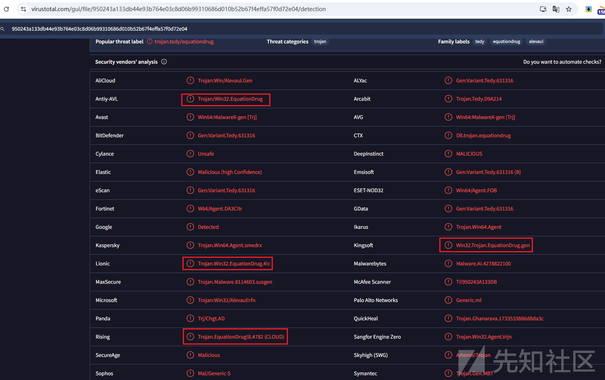

## EquationDrug报毒原因

根据unit42安全团队的报告介绍，此Bootkit的报毒原因是由于使用了与NSA方程式组织恶意样本中相同的`dll_u`导出函数名称。

此Bootkit的导出函数截图如下：

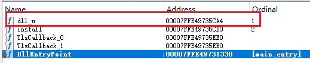

NSA方程式组织Windows平台下`PC_Level3_dll`恶意样本的导出函数截图如下：

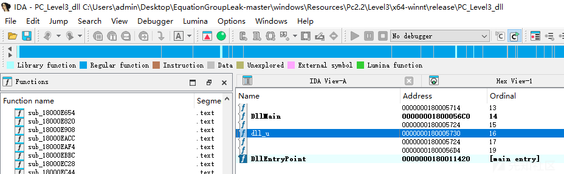

## dll\_u导出函数功能剖析

为了进一步剖析dll\_u导出函数的作用及功能，笔者从两个角度对NSA方程式组织恶意样本的`dll_u`导出函数功能进行了剖析：

* NSA方程式组织`PC_Level3_dll`恶意样本与`PC_Level3_exe`恶意样本入口点函数代码对比，观察其入口的函数代码是否相同？
* 使用NSA方程式组织FUZZBUNCH工具远程注入`PC_Level3_dll`恶意样本，加载`dll_u`导出函数，观察`PC_Level3_dll`恶意样本是否可正常上线？

基于上述对比结果，笔者发现：**dll\_u导出函数实际即为NSA方程式组织Windows平台下pc2.2\_prep恶意样本的恶意代码入口函数。**

### 入口点函数代码对比

`PC_Level3_dll`恶意样本的`dll_u`导出函数截图如下：

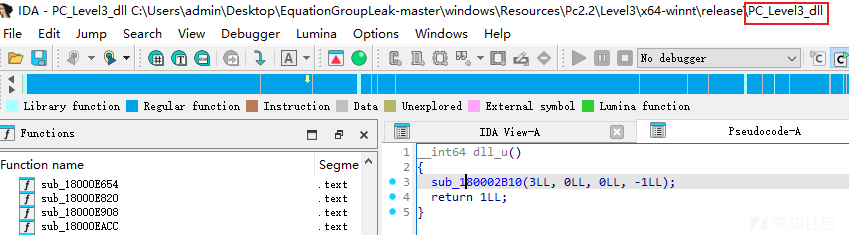

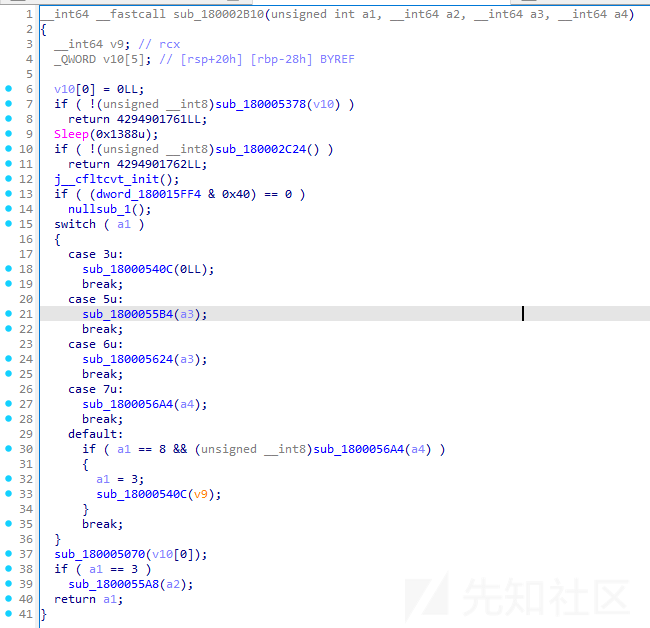

`PC_Level3_exe`恶意样本的main函数截图如下：

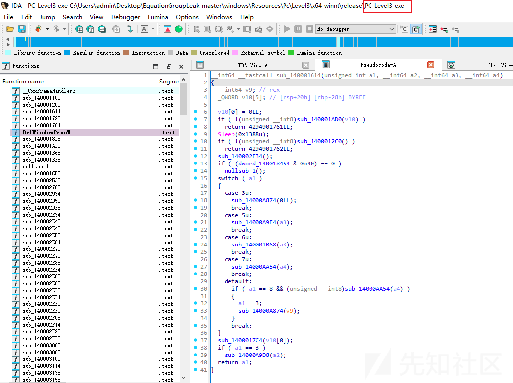

### FUZZBUNCH加载调用dll\_u导出函数

为实现使用FUZZBUNCH工具加载调用`PC_Level3_dll`恶意样本的`dll_u`导出函数，笔者将基于如下流程进行操作：

* 使用NSA方程式组织的DanderSpritz工具配置并生成PC\_Level3\_dll.configured后门程序；
* 使用NSA方程式组织的FUZZBUNCH工具调用Doublepulsar插件远程注入PC\_Level3\_dll.configured木马程序，远程加载PC\_Level3\_dll.configured木马程序的dll\_u导出函数；
* 使用NSA方程式组织的DanderSpritz工具成功接收PC\_Level3\_dll.configured后门程序的上线请求；

DanderSpritz工具生成后门程序的操作截图如下：

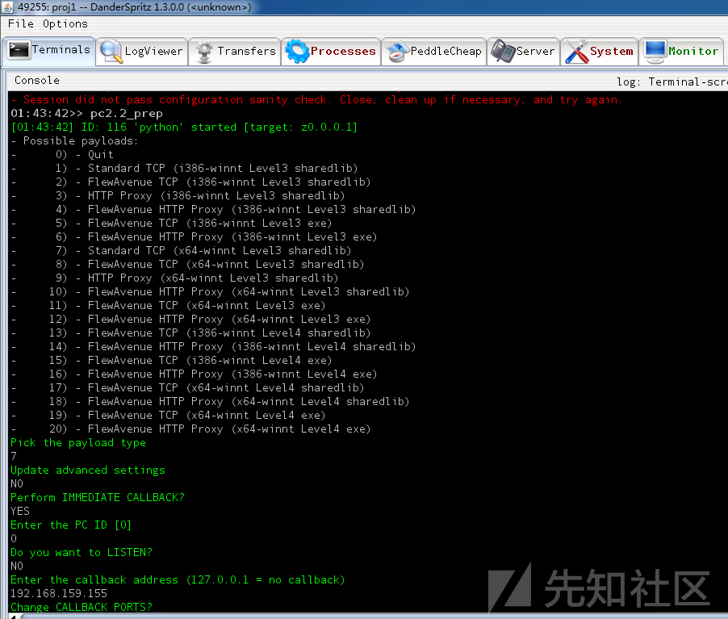

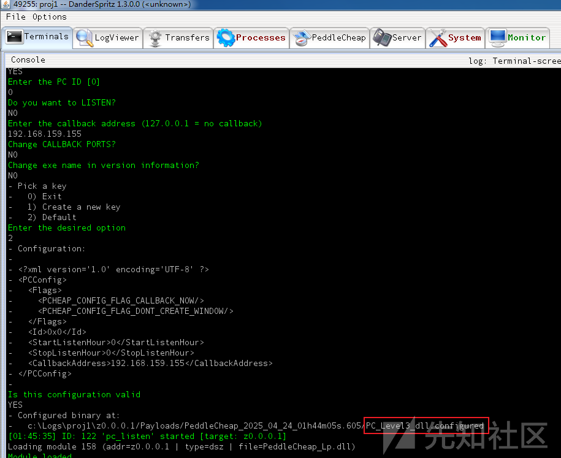

PC\_Level3\_dll.configured后门程序的导出函数截图如下：

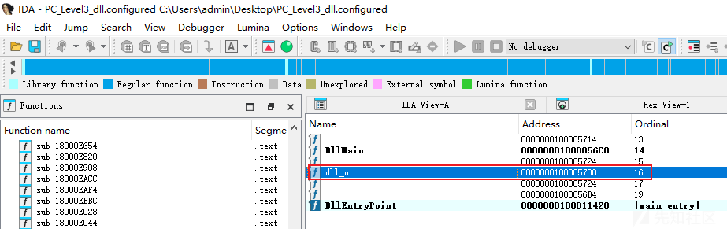

FUZZBUNCH工具调用Doublepulsar插件进行远程注入的操作截图如下：

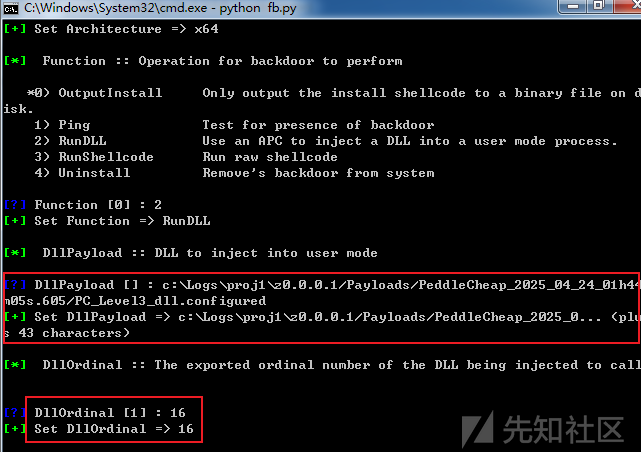

DanderSpritz工具**成功接收PC\_Level3\_dll.configured后门程序的上线请求**截图如下：

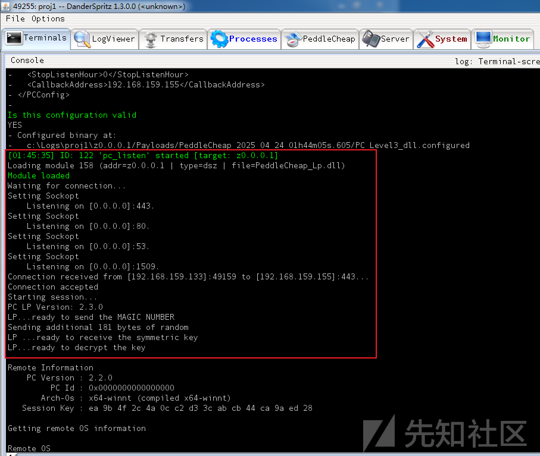

## 使用FUZZBUNCH远程注入Bootkit

基于上述研究对比结果，我们可知NSA方程式组织Windows平台下的pc2.2\_prep恶意样本的dll\_u导出函数实际即为其恶意样本的入口函数。

基于此，笔者琢磨：**能否使用FUZZBUNCH工具远程注入此Bootkit，远程加载其dll\_u导出函数，以实现此Bootkit的恶意功能呢？**

为实现上述目的，笔者借助NSA方程式组织FUZZBUNCH工具对BIOS启动的Vmware虚拟机及UEFI启动的Vmware虚拟机进行了对比测试：

* BIOS启动：成功注入并触发此Bootkit安装GRUB2引导加载程序的功能，Vmware虚拟机重启后，成功加载GRUB2引导加载程序，设置电脑背景为美利坚联盟国的战旗和播放美国dixie民谣歌曲；
* UEFI启动：成功注入并触发此Bootkit安装GRUB2引导加载程序的功能，Vmware虚拟机重启后，未能成功加载GRUB2引导加载程序；

### BIOS启动

Vmware虚拟机固件类型截图如下：

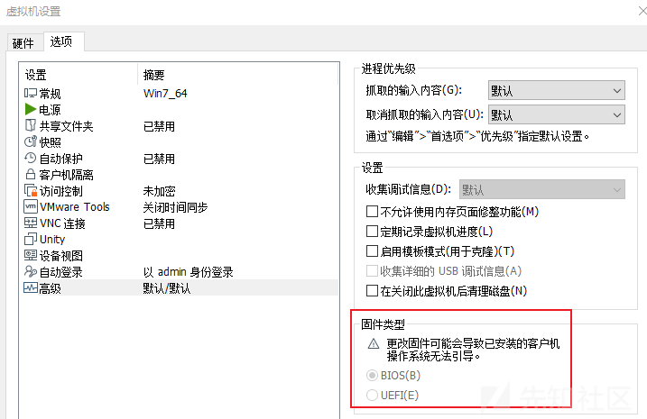

使用FUZZBUNCH工具加载EternalBlue漏洞的攻击截图如下：

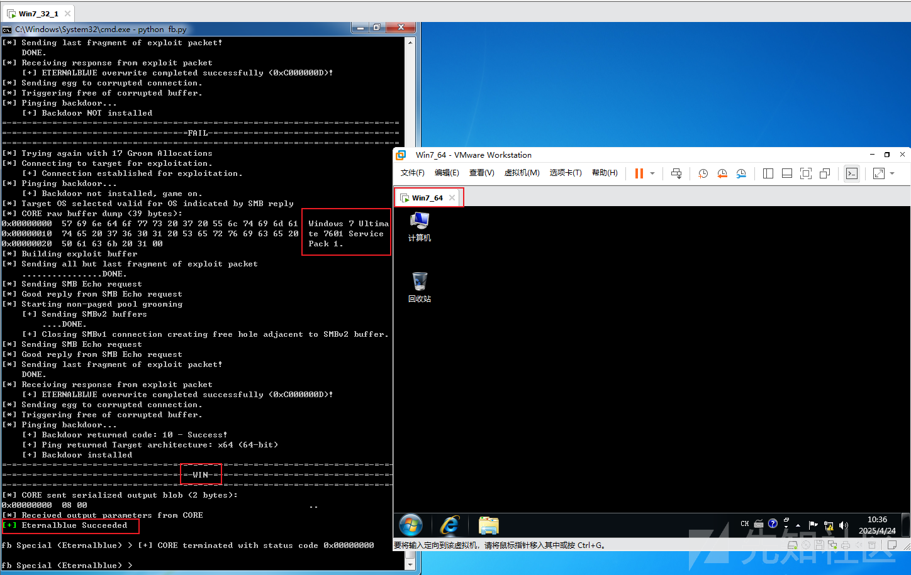

使用FUZZBUNCH工具加载Doublepulsar插件**远程注入此Bootkit**的操作截图如下：

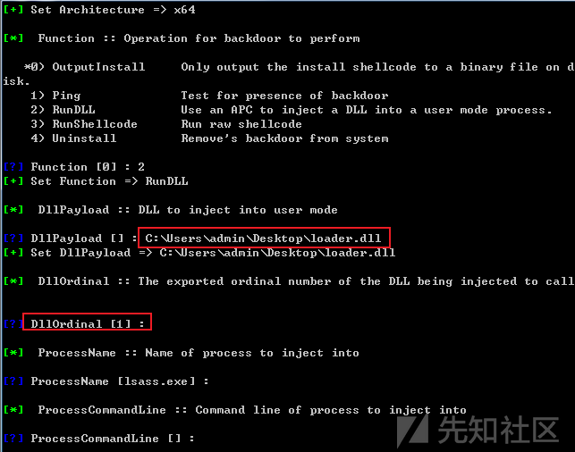

Bootkit注入成功后，成功触发此Bootkit的功能模块，实现Vmware虚拟机的重启行为：

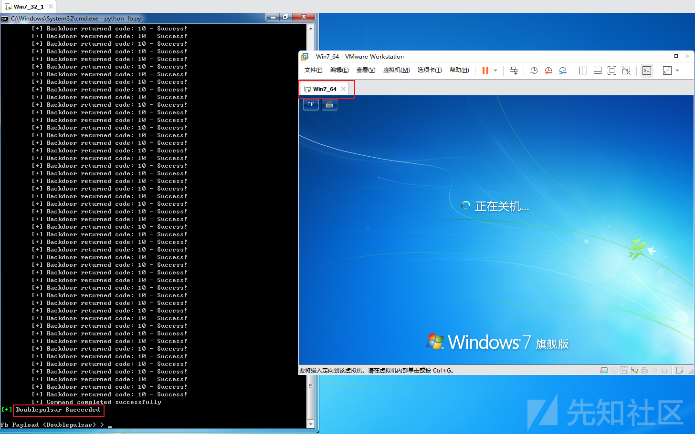

重启Vmware虚拟机后，成功加载GRUB2引导加载程序，设置电脑背景为美利坚联盟国的战旗和播放美国dixie民谣歌曲：

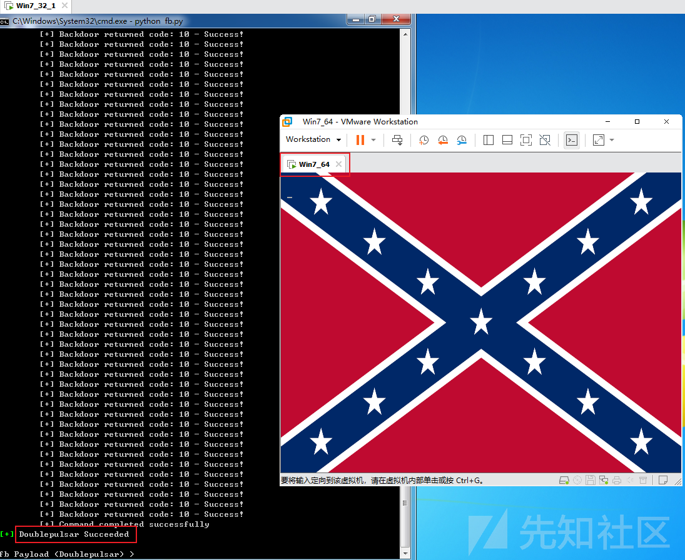

### UEFI启动

Vmware虚拟机固件类型截图如下：

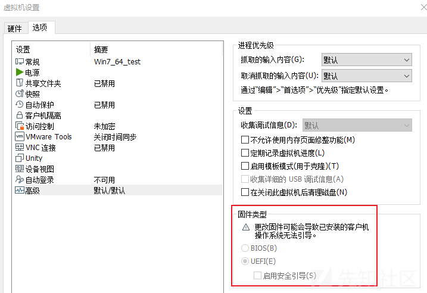

略过中间相同操作流程。

重启Vmware虚拟机后，未能成功加载GRUB2引导加载程序的截图如下：

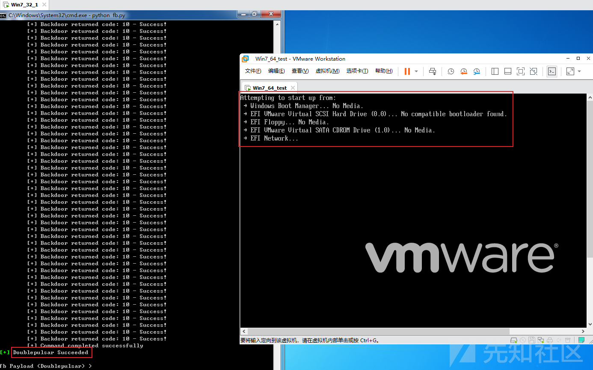

## Bootkit功能剖析

通过分析，发现此样本存在多个导出函数，具体功能如下：

* install导出函数：用于通过创建计划任务的方式安装此Bootkit恶意程序；
* dll\_u导出函数：此恶意程序的核心功能代码函数；

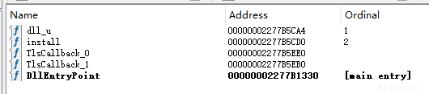

### 创建计划任务

通过分析，发现install导出函数的具体功能如下：

* 复制自身文件至系统C:\Windows\system32\w32analytics.dll路径；
* 先删除w32analytics计划任务；
* 再创建w32analytics计划任务，计划任务内容为：`schtasks /create /tn w32analytics /sc ONCE /st 07:00 /ru SYSTEM /tr \"rundll32 w32analytics.dll,dll_u\"`，功能为使用rundll32加载执行w32analytics.dll的dll\_u导出函数；

相关代码截图如下：

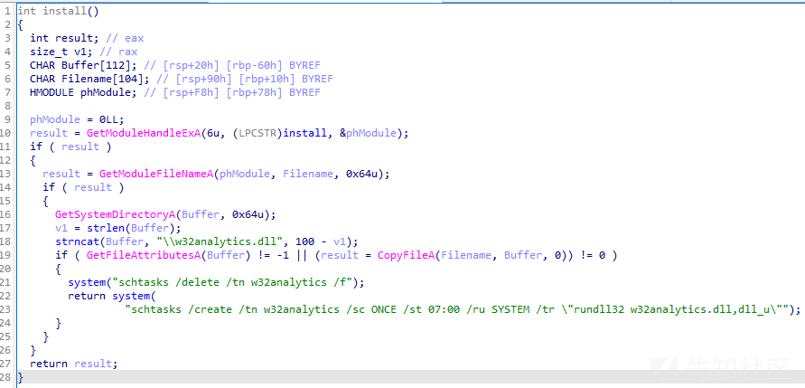

运行后创建的计划任务内容截图如下：

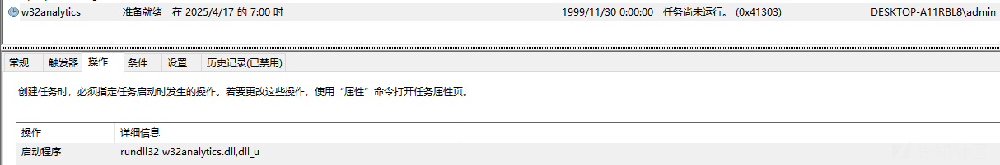

### AI逆向分析zlib函数

通过分析，发现dll\_u导出函数执行后，将通过下述截图中的sub\_7FFE49734416函数，对样本文件中内置的0x60C5E0字节长度的数据进行运算，运算后的结果输出至下述截图中的BUFFER全局变量中。

相关代码截图如下：

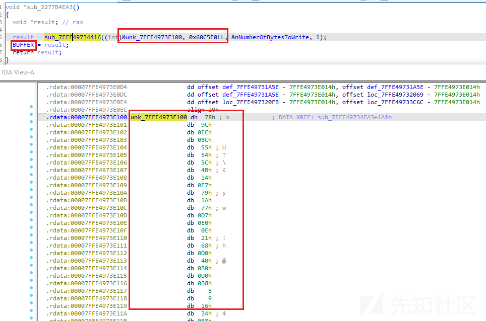

进一步分析，发现sub\_2277B4416函数中调用了sub\_7FFE49731837函数，相关代码截图如下：

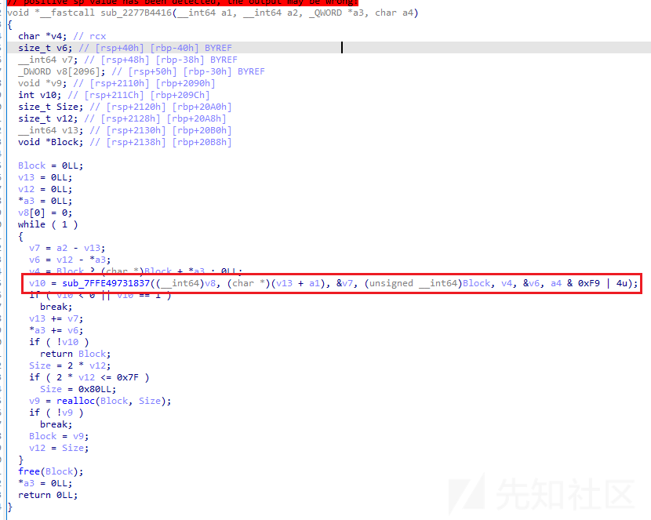

sub\_7FFE49731837函数的调用逻辑其实还挺复杂的，相关函数调用逻辑图如下：

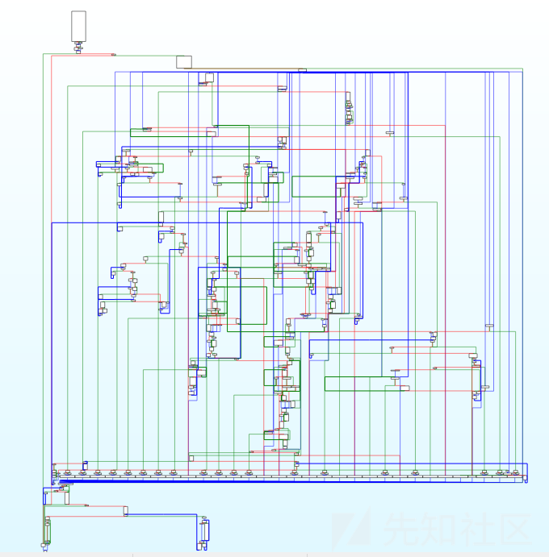

由于sub\_7FFE49731837函数代码的可读性不强，若非经验丰富的分析人员，否则仅通过人工分析是很难准备提取出此函数的功能的。

因此，笔者在这里直接借助了AI大模型对此函数功能进行了剖析。

基于AI大模型剖析结果如下：

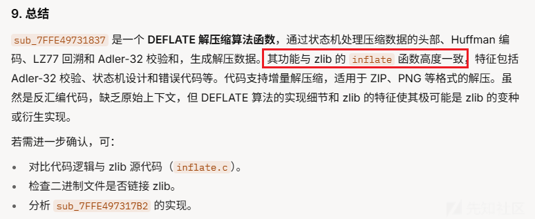

### 内存释放磁盘映像文件

基于AI大模型逆向分析剖析，我们可知dll\_u导出函数执行后，将调用zlib解压函数对样本文件中内置的0x60C5E0字节长度的压缩数据进行解压缩，解压缩后的数据将输出至BUFFER全局变量中。

相关代码截图如下：


解压缩后的二进制内容如下：

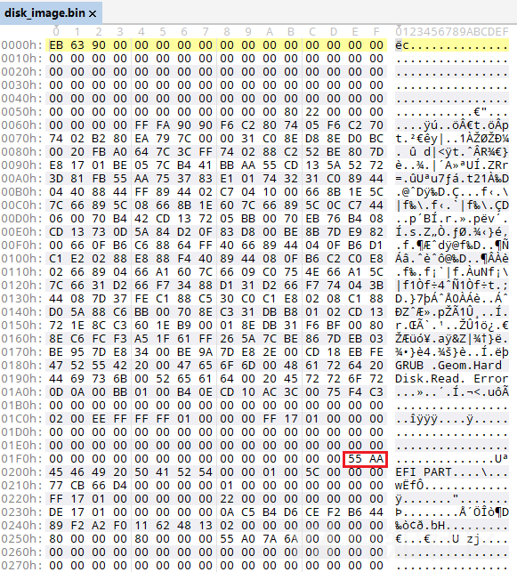

进一步分析，发现此二进制文件其实是一个磁盘映像文件，磁盘映像文件大小约35MB，相关截图如下：（磁盘映像文件中的创建时间为：2024/07/09 06:29）

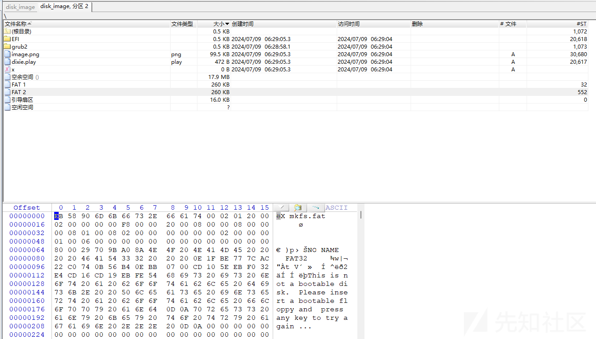

### 动态获取API

进一步分析，发现dll\_u导出函数执行后，还将动态获取多个API函数，相关代码截图如下：

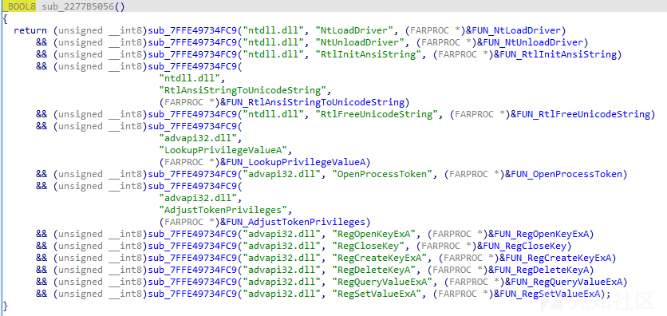

### 验证操作系统版本

进一步分析，发现dll\_u导出函数执行后，将调用函数验证当前操作系统版本，用以判断是否执行释放并加载ampa驱动程序的函数代码：

* 若当前 Windows 操作系统版本为 Windows Vista或更高系统版本，则调用释放并加载ampa驱动程序的函数代码；
* 若当前 Windows 操作系统版本为Windows XP或更早系统版本，则无需执行释放ampa驱动程序的函数代码；

相关代码截图如下：

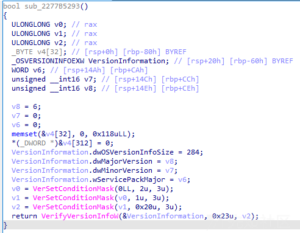

### 释放并加载ampa驱动程序

进一步分析，发现dll\_u导出函数执行后，将通过如下步骤加载ampa驱动程序：

* 释放ampa.sys驱动程序：从样本资源段中释放ampa.sys驱动程序；
* 调整进程权限：调整进程权限为SeLoadDriverPrivilege（加载驱动程序特权），用以允许进程加载或卸载设备驱动程序到Windows内核中；
* 创建ampa服务：通过创建注册表的方式创建ampa服务；（**备注：在 Windows 系统中，加载驱动程序时通常需要创建服务**）
* 调用NtLoadDrive函数加载ampa驱动程序；

#### 从资源段释放ampa.sys驱动程序

从样本资源段中释放ampa.sys驱动程序的相关代码截图如下：

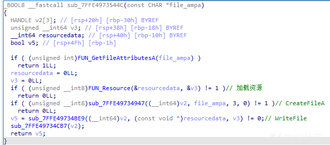

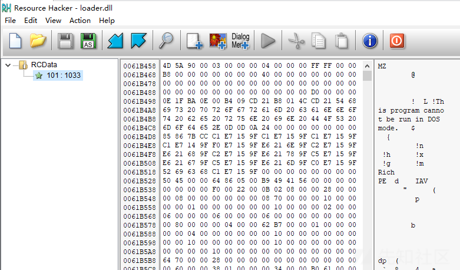

#### 调整进程权限

调整进程权限的相关代码截图如下：

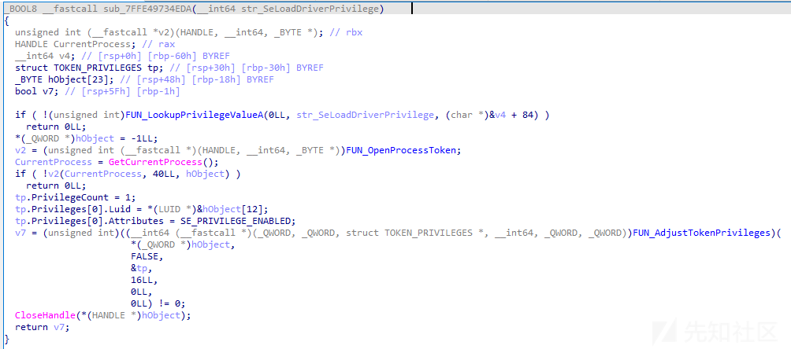

#### 创建ampa服务

创建ampa服务的相关代码截图如下：

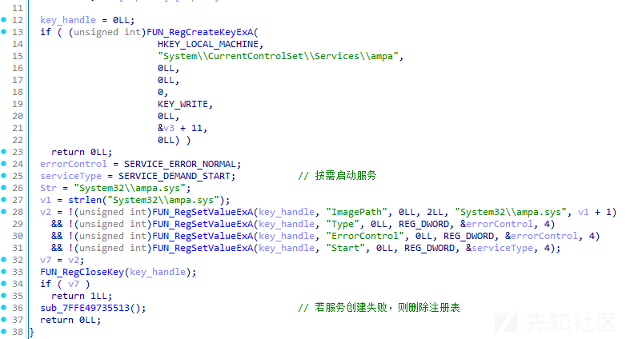

#### 加载ampa驱动程序

加载ampa驱动程序的相关代码截图如下：

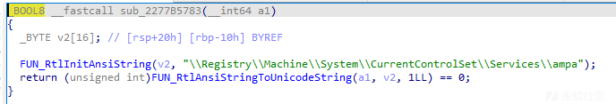

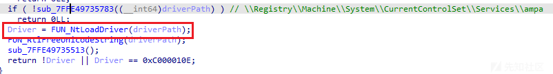

### 写磁盘映像文件至每个磁盘

进一步分析，发现dll\_u导出函数执行后，将根据操作系统版本的不同，调用不同的设备命名空间路径，将前述释放的磁盘映像文件写入至每个磁盘中：

* 若当前 Windows 操作系统版本为 Windows Vista或更高系统版本，则调用“\\.\wowrt\DR\DISK%u”设备命名空间路径写磁盘映像文件；
* 若当前 Windows 操作系统版本为Windows XP或更早系统版本，则调用“\\.\PhysicalDrive%u”设备命名空间路径写磁盘映像文件；

相关代码截图如下：


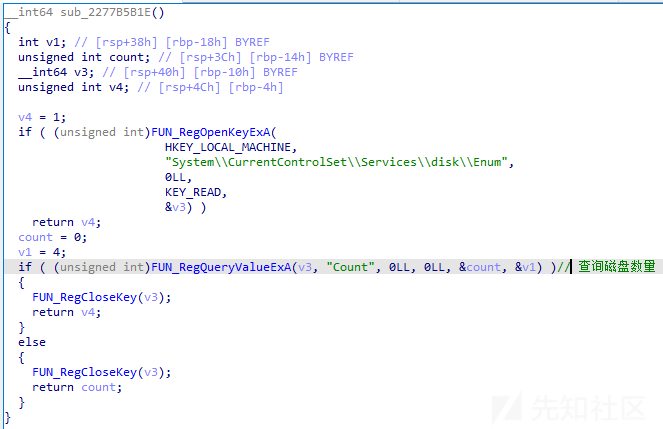

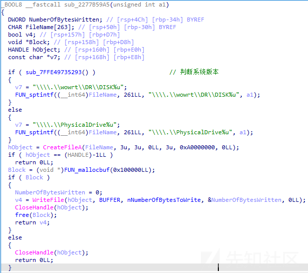

### 卸载并清理ampa驱动

成功在系统磁盘写入磁盘映像文件后，样本将清理ampa驱动程序：

* 卸载ampa驱动程序；
* 删除ampa服务；
* 用零字节重写`C:\Windows\System32\ampa.sys`驱动程序文件；
* 删除`C:\Windows\System32\ampa.sys`驱动文件；

相关代码截图如下：

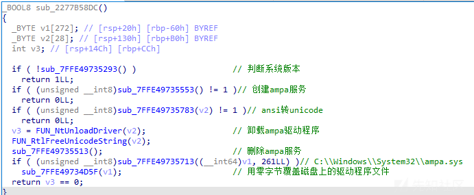

### 重启系统

最后，此样本将调整进程权限为SeShutdownPrivilege特权，允许此Bootkit进程执行系统重启操作。

相关代码截图如下：

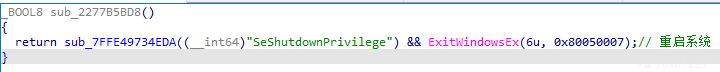

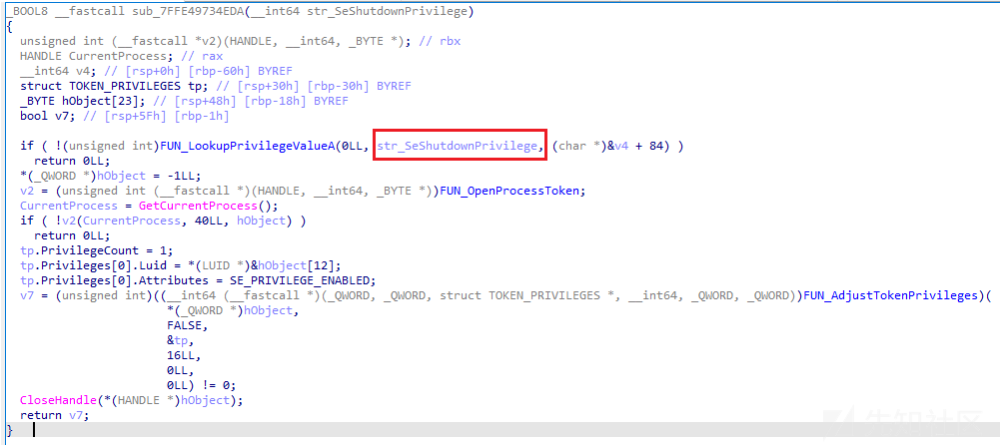

### 加载执行磁盘映像文件

当系统重新启动后，系统将加载磁盘中新写入的磁盘映像文件（GRUB2引导加载程序），**成功开机后，将设置电脑背景为美利坚联盟国的战旗和播放美国dixie民谣歌曲。**

相关截图如下：

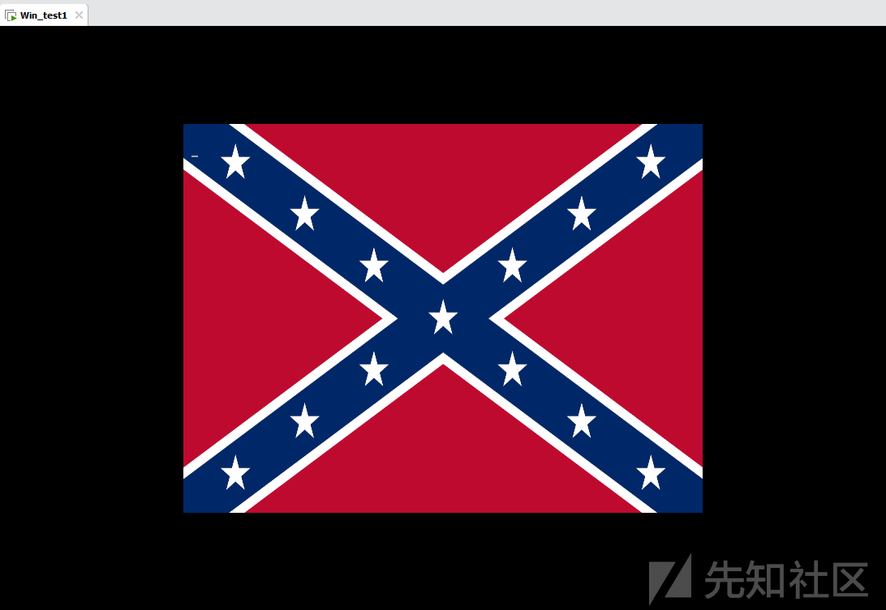

## ampa.sys驱动程序剖析

尝试提取Bootkit资源段中的ampa.sys驱动程序，对其进一步分析，发现此驱动程序文件其实是国内【傲梅分区助手】软件中的内核驱动程序。

相关VT截图如下：

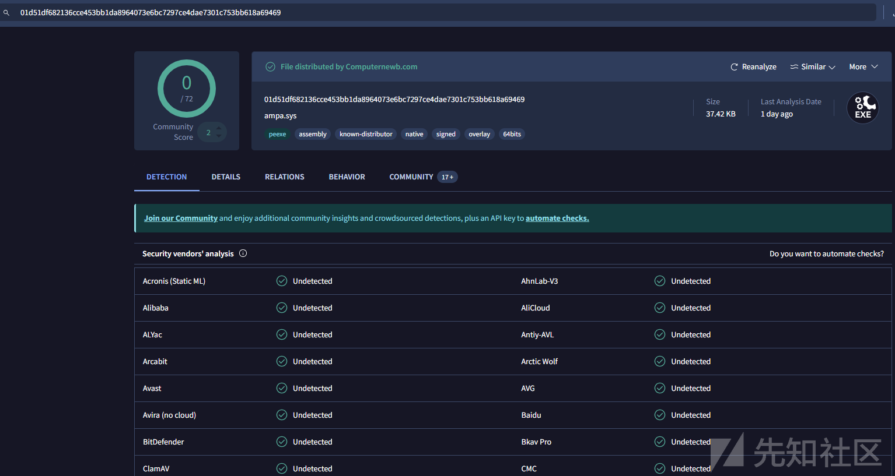

网络中关于ampa.sys驱动程序的描述：

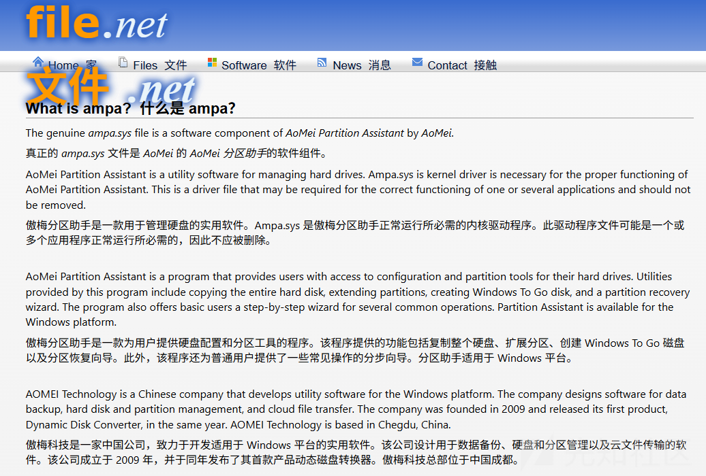

ampa.sys驱动程序的数字签名信息如下：

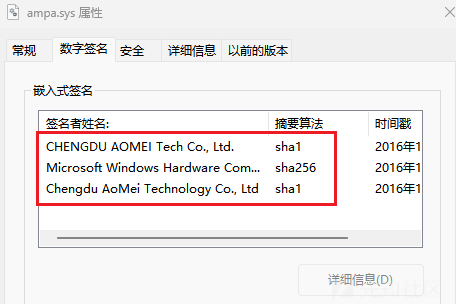

尝试安装傲梅分区助手，对比ampa.sys驱动程序的Hash信息，发现Hash信息相同，相关截图如下：

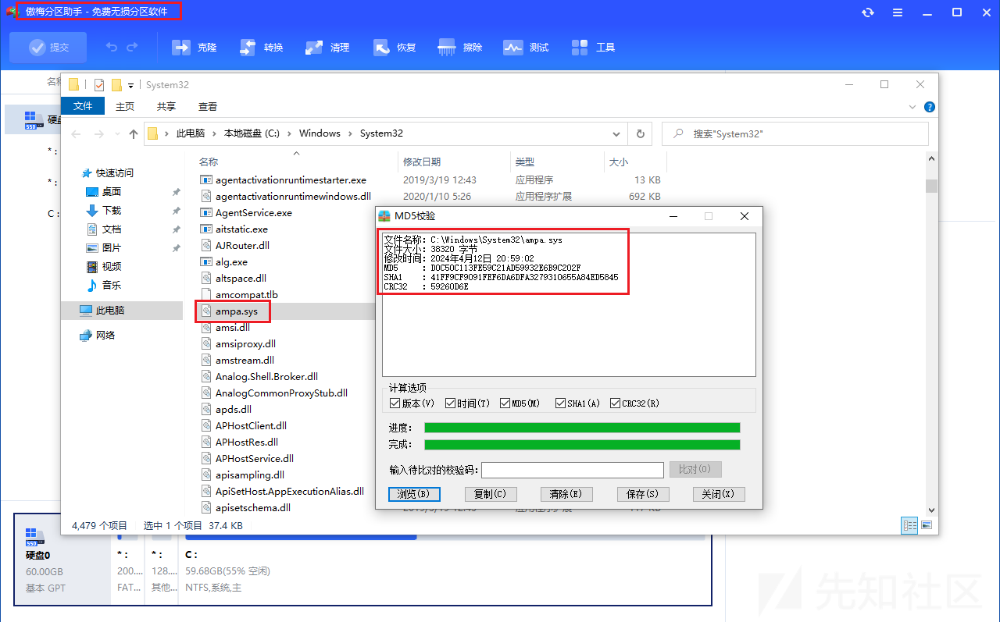

### 值得深思的问题

一款所有信息均与美国相关的Bootkit程序，为什么要内置使用中国的驱动程序？

## 磁盘映像文件剖析

尝试提取Bootkit内存中释放的磁盘映像文件，对其进一步分析，发现此磁盘映像文件实际是一个GRUB2引导加载程序，由如下几部分组成：

* 主引导记录（MBR）
* 引导分区
* /grub2/grub.cfg配置文件

### MBR剖析

结合维基百科关于主引导记录的介绍，梳理发现主引导记录MBR由三部分组成：

* 启动代码：偏移位置为0x00--0x1BE
* 硬盘分区表：偏移位置为0x1BE--0x1FD
* 结束标志：偏移位置为0x1FE--0x1FF，值为55 AA

相关截图如下：

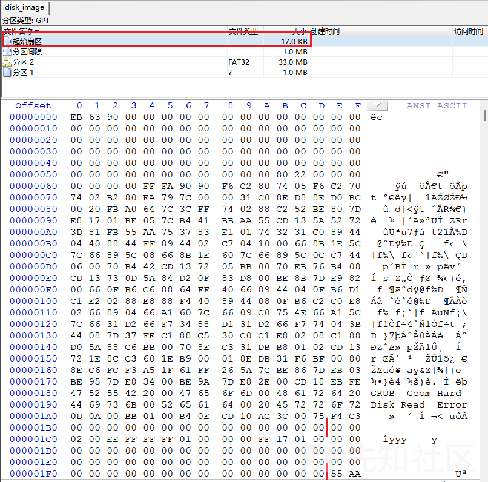

IDA反编译后的启动代码截图如下：

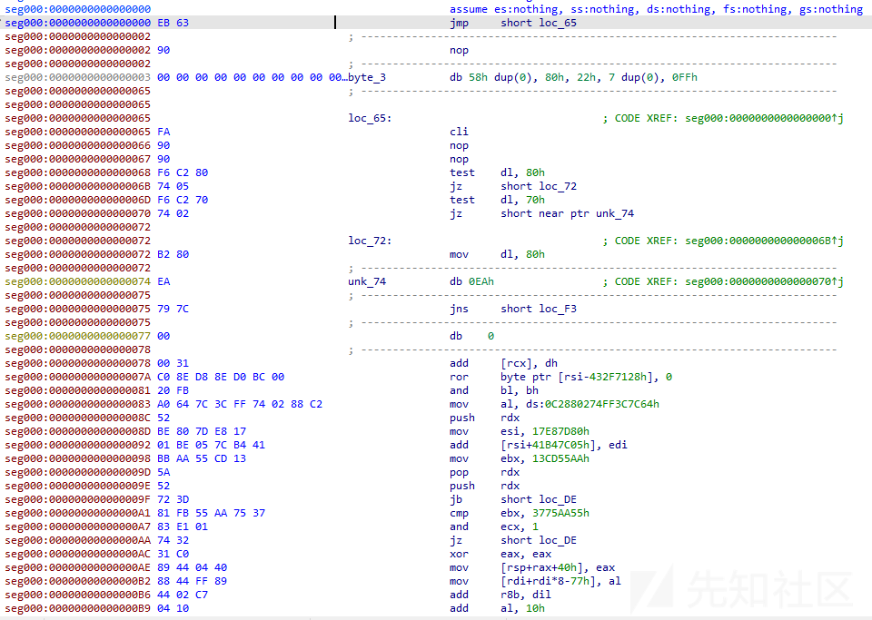

维基百科介绍如下：

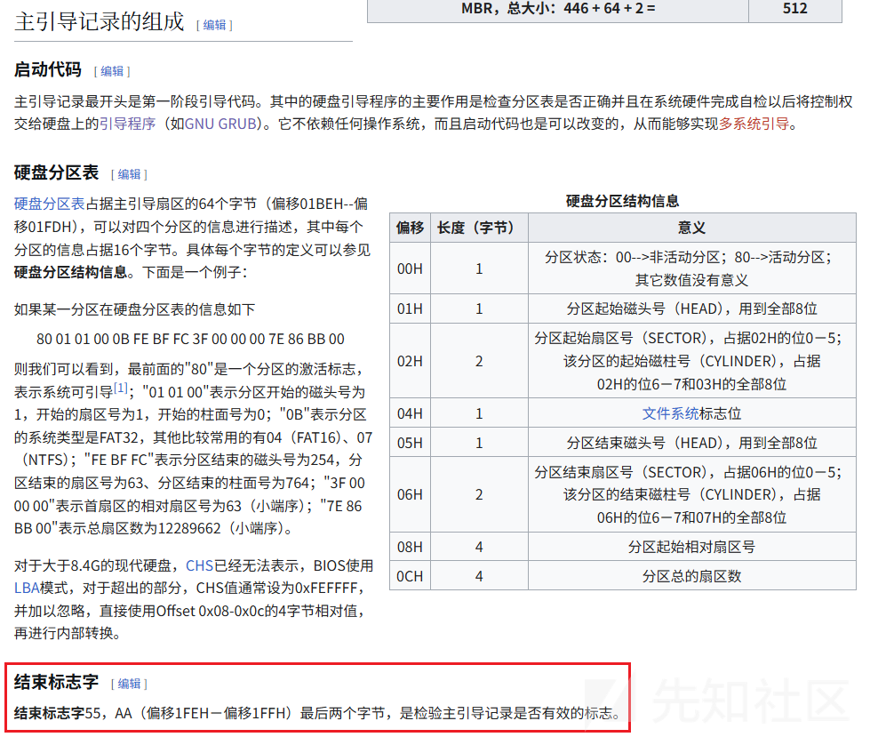

### 引导分区剖析

通过对引导分区进行剖析，发现引导分区中存在多个目录及文件：

* grub2目录

* locale目录
* i386-pc目录
* fonts目录
* grubenv文件
* grub.cfg配置文件

* EFI目录

* debian目录

* grub.cfg配置文件：文件内容为：`configfile /grub2/grub.cfg`

* BOOT目录

* GRUBX64.EFI
* BOOTX64.EFI

* image.png文件
* dixie.play文件

相关截图如下：

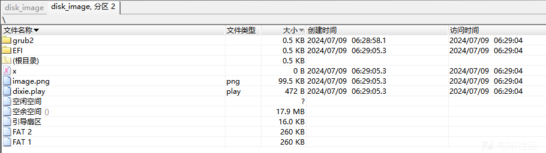

### /grub2/grub.cfg配置文件

结合grub官方文档对/grub2/grub.cfg文件进行剖析，发现/grub2/grub.cfg文件实际即为GRUB引导加载程序的配置文件，用于控制操作系统的启动过程。

进一步对/grub2/grub.cfg文件内容进行剖析，梳理关键代码功能如下：

* load\_video函数：用于加载GRUB的视频驱动模块，以支持启动过程中的图形输出
* `set linux_gfx_mode=`：不强制指定图形模式
* `load_video`：加载视频驱动模块
* `insmod gfxterm`：加载GRUB的图形终端模块（gfxterm）
* `insmod png`：允许GRUB显示PNG格式的图像
* `terminal_output gfxterm`：将GRUB的终端输出设置为图形终端（gfxterm），而不是默认的文本终端
* `background_image /image.png`：将image.png文件设置为GRUB菜单的背景图片
* `sleep 60`：暂停60秒
* `play /dixie.play`：播放音频文件

/grub2/grub.cfg配置文件内容如下：

```
function load_video {
  if [ x$feature_all_video_module = xy ]; then
    insmod all_video
  else
    insmod efi_gop
    insmod efi_uga
    insmod ieee1275_fb
    insmod vbe
    insmod vga
    insmod video_bochs
    insmod video_cirrus
  fi
}

set linux_gfx_mode=
export linux_gfx_mode
load_video

insmod gfxterm
insmod png
terminal_output gfxterm

background_image /image.png

echo
sleep 60
play /dixie.play
configfile /grub2/grub.cfg
```

grub官方文档介绍如下：

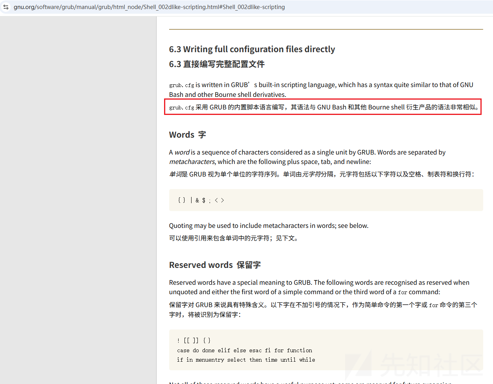

## 模拟Bookit原理制作GRUB2引导U盘

基于此，我们已基本了解此Bootkit的原理及功能：**借助ampa.sys驱动程序，将内置的GRUB2引导加载程序写入系统磁盘，用以实现破坏操作系统引导的目的。**

为了能够更直观的理解此Bootkit破坏操作系统引导的过程，笔者尝试将此Bootkit样本内存中释放的GRUB2引导加载程序制作成类似于windows PE盘的方式，用以复现此Bootkit的攻击场景：

* 使用winhex工具将此Bootkit样本内存中提取的磁盘映像文件克隆至U盘中；
* 选择一台以BIOS引导启动的VMware虚拟机作为操作主机；
* 参考《VMware虚拟机设置U盘启动与BIOS设置教程》（`https://blog.csdn.net/awfiihmmmm/article/details/105543257`）文章，将U盘作为物理磁盘添加至VMware虚拟机中；
* 以U盘启动，触发加载U盘中的GRUB2引导加载程序，成功开机后，**VMware虚拟机将设置电脑背景为美利坚联盟国的战旗和播放美国dixie民谣歌曲**；

winhex工具克隆U盘的操作截图如下：

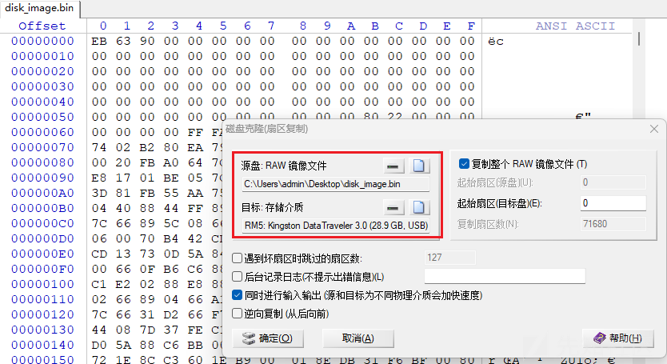

成功克隆后，U盘磁盘空间如下：

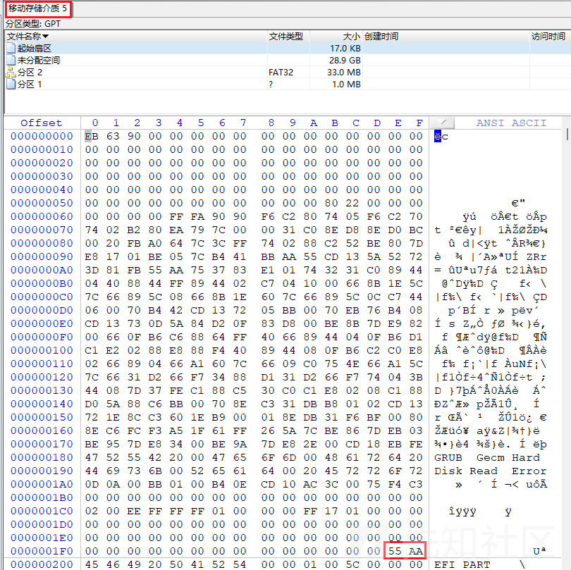

VMware虚拟机添加U盘作为虚拟机硬盘：

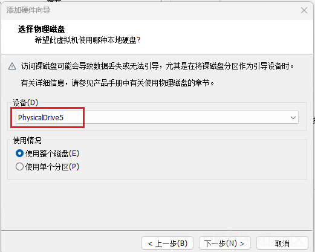

进入虚拟机固件，选择U盘对应的硬盘启动VMware虚拟机：

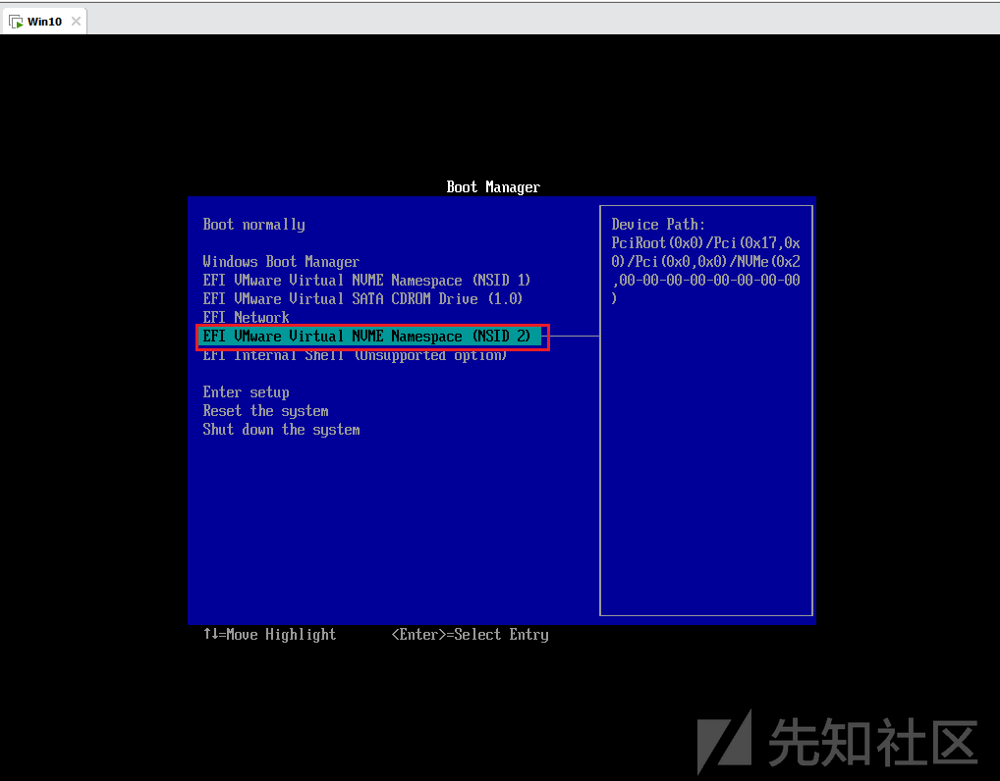

成功开机后，**VMware虚拟机将设置电脑背景为美利坚联盟国的战旗和播放美国dixie民谣歌曲，此行为与Bootkit加载运行后的场景相同**。

相关截图如下：


