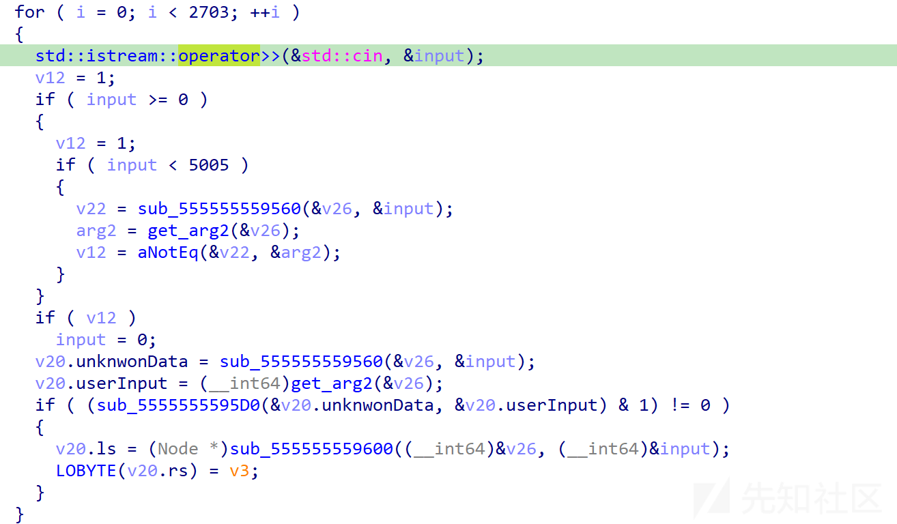
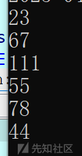
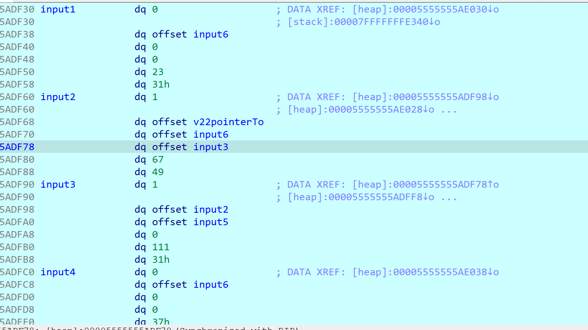
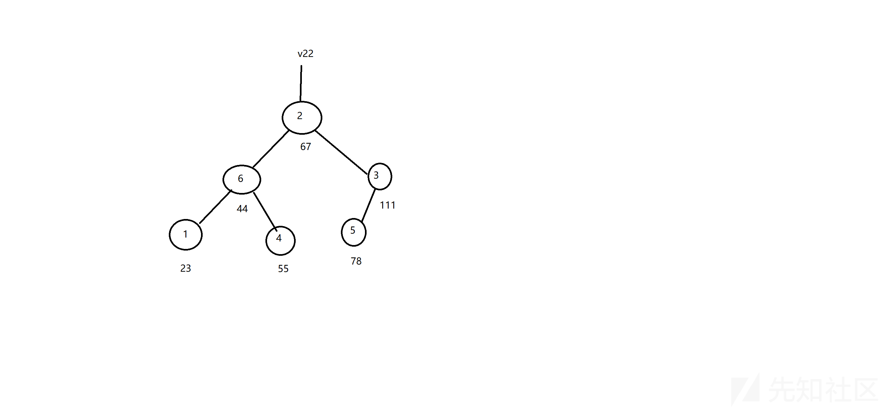
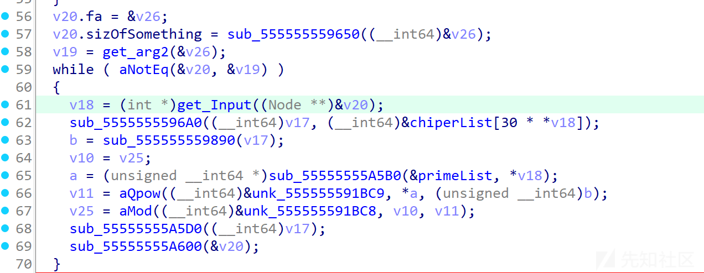
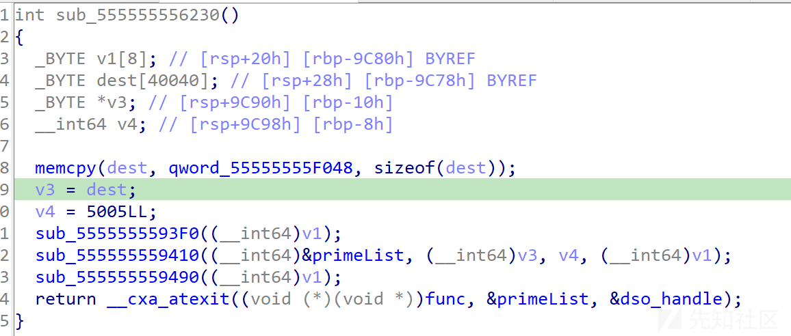
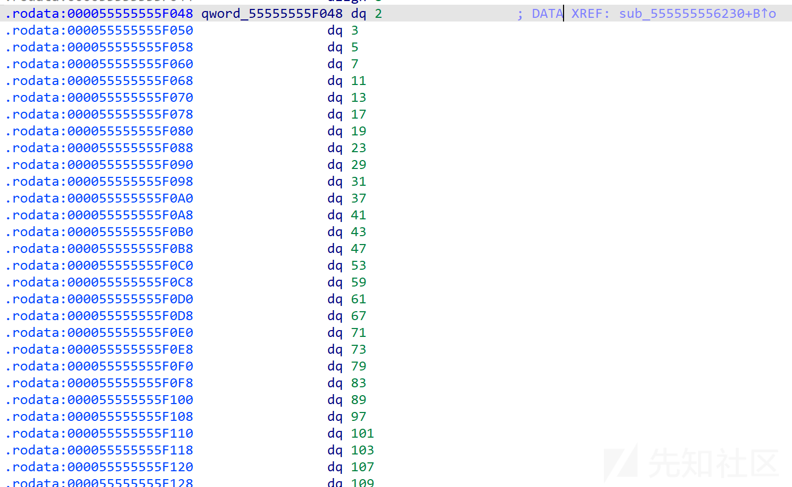
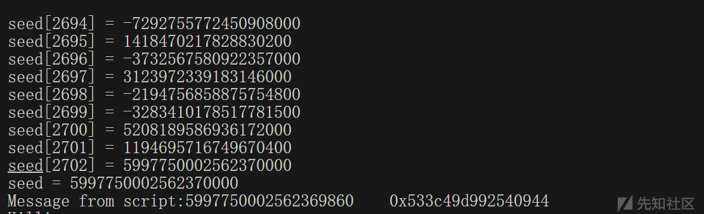
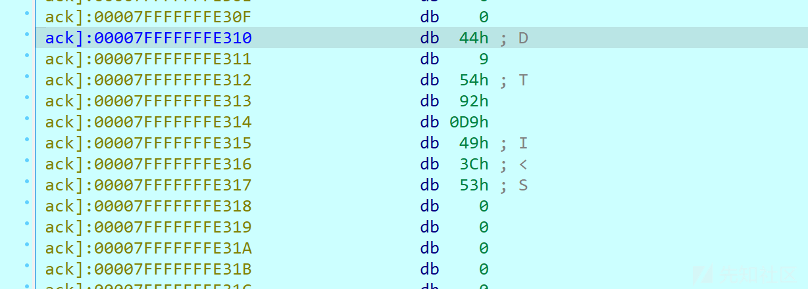
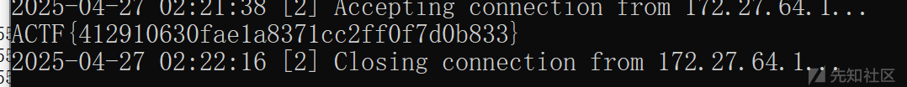

# ACTF2025 unstoppable 题解-先知社区

> **来源**: https://xz.aliyun.com/news/17900  
> **文章ID**: 17900

---

#### 主函数

进来先看主函数，输入有2703个，而且似乎有意对输入的范围做了检测，使其限定在0~5004  
  
input先进入sub\_555555559560这个函数，这个函数里面乱七八糟的一堆指针操作乱飞，下面那个重命名为get\_arg2的也是一样，让人非常怀疑这个v26和v22是不是结构体(图片里是已经修复过结构体定义的，懒得重新从原附件开始写了)，所以动调输入一些数检查下  
  
每次输入后给v22指向的地址命名标记  
  
可以看到确实是结构体，而且我们的输入也被存在了每个结构体中，另一个明显的特征是结构体里有大量互相指的指针，算法学的好的已经知道这是什么了，但万一我没打过acm怎么办呢，这里可以画图把每个结构体和他指向的对象连起来  
  
这一眼二叉搜索树了，也就是我们的输入被扔进了一颗二叉搜索树里，然后v22,v26都是相关的树节点类型，可以怀疑是根节点之类的，在下面的while循环中也有使用，二叉搜索树的重要性质就是先序遍历就是有序数列，合理怀疑这是在对我们的输入进行排序，我们把输入的组数patch少一点，到while处的逻辑中验证猜想  
另外注意到上面的循环会对我们的输入去重，如果输入的数已经在树中出现过就会把输入置0再插入树中

#### 第二处循环

  
再get\_Input处下断点，可以发现v18确实是按从小到大取出的，但这时发现程序会卡死，经过二分法下断点发现是sub\_555555559890这个函数导致了卡死，但巧合的是输入1不会卡死，输入2会，因为输入是排序的，经过多次尝试发现1,3,5均不会卡死（试出来几个不会卡死的方便动调下面的函数），再来看这个函数的逻辑，他接受v17作为传参，而v17在前一个函数进行初始化，经检查v17是一个指针数组，上面那个函数是负责把chiperlist中的数据刷入v17中，发现在取偏移时是按30的倍数取的，检查发现chiperlist正好是5005\*30组数据，和我们输入的限制对应  
再看这个a是怎么出来的，sub\_55555555A5B0的第一个参数是一个静态未初始化的全局量，第二个参数是我们取出的输入，我们查交叉引用看这个全局量哪来的  
  
  
可以看到是一个质数表，而且长度正好也是5005，结合动调确认就是查表获得质数表对应下标的数，那也就是说a和b都是查表查出来的，我们的输入其实是2703个合法下标用于在两次查表中获取对应的结果，如果输入不对则会在获取b的时候卡死  
在下面那个qpow就很清晰了，点进去直接能看出来是快速幂算法（看不出来我也没办法，和源码长得几乎完全一样了），下面那个函数是调用mod API进行取模操作  
总的来说这块就是把输入从小到大取出，分别进行两次查表获取$a,b$,然后计算$a^b$并累乘到v25上

#### 哈希

循环结束后有一个flatten过的函数，用d810解开后直接把整个函数体扔给ai识别，识别为MurmurHash3\_x64\_128哈希算法，不过他具体怎么样我们不关心，只要知道他会把v25作为种子，把congratulations的哈希值存入hashdest这个buffer即可，再看下面的输出格式，也就是flag主体其实就是这个hash

#### 如何获取种子

种子是累乘得到的，a就是查质数，难点在于获取b，可以去赌他获取b的算法在每次执行都是独立的，可以尝试输入(1,3,5),(3,5),(1,5),(1,3)做尝试，发现确实是独立的，那么考虑用frida主动调用去爆破合法的2703组回显，然后再主动调用他实现的qpow和mod函数结合素数表算出种子，最后动调把种子patch进hash函数获取flag

##### 爆破脚本

```
from frida import *
import sys
import threading
import time

def kill(pid):
    device.kill(pid)

device = get_local_device()
res = []

for i in range(2501, 5005):
    try:
        pid = device.spawn(["./unstoppable"])
        session = device.attach(pid)
    except ProcessNotFoundError:
        print(f"[!] {i:04x} Process not found, skip")
        continue

    js_code = f"""
    var baseOffset = 0x555555554000;
    var initopPtr = Module.getBaseAddress("unstoppable").sub(baseOffset).add(0x5555555596A0);
    var input = {i};
    var initop = new NativeFunction(initopPtr, 'int64', ['pointer', 'pointer']);
    var opBuf = Memory.alloc(0x1000);
    var oplist = Module.getBaseAddress("unstoppable").sub(baseOffset).add(0x55555556D110);
    initop(opBuf, oplist.add(30 * input));
    var vmPtr = Module.getBaseAddress("unstoppable").add(0x5890);
    var vm = new NativeFunction(vmPtr, 'int64', ['pointer']);
    var result = vm(opBuf);
    send(result);
    """

    script = session.create_script(js_code)
    script.on('message', lambda message,
              data: res.append((message['payload'], i)))

    timer = threading.Timer(10, kill, args=[pid])
    try:
        timer.start()
        device.resume(pid)
        script.load()       

        time.sleep(10.1)   
    except TransportError:
        print(f"[!] {i:04x} transport closed, killed or hung")
        continue
    finally:
        timer.cancel()     
        try:
            session.detach()
        except:
            pass

print(f"Total results: {len(res)}")
print(res)

```

要注意的是使用frida爆破每次要重新起新进程，因为如果输入错了程序就会卡住，而主动调用是阻塞式的，然后每次起进程设置一个时限来分辨是正确输入还是卡死了，还要主动杀掉拉起的进程（不然跑5005轮马上cpu就爆了，frida不会主动杀掉自己拉起来的进程），至于这里为什么一次调用设10s时限就要问出题人的图灵机怎么写的这么卡了，可以把5005切成多片跑，以及做好要跑大半天的准备

##### 调用qpow执行累乘

为了防止出题人实现的mod抄错，所以干脆也用frida

```
setImmediate(function () {
    var baseOffset = 0x555555554000;
    var ModPtr = Module.getBaseAddress("unstoppable")
        .sub(baseOffset)
        .add(0x555555559160);
    var QpowPtr = Module.getBaseAddress("unstoppable")
        .sub(baseOffset)
        .add(0x5555555591A0);

    console.log("ModPtr: " + ModPtr);
    console.log("QpowPtr: " + QpowPtr);

    var qpow = new NativeFunction(QpowPtr, 'uint64', ['pointer', 'uint64', 'uint64']);
    var mod = new NativeFunction(ModPtr, 'uint64', ['pointer', 'uint64', 'uint64']);

    var seed = uint64(1);
    var junk = Memory.alloc(0x10);

    for (var i = 0; i < blist.length; i++) {
        var j = blist[i][1];
        var a = uint64(primelist[j]);
        var b = uint64(blist[i][0]);
        try {
            var tmp = qpow(junk, a, b);
            seed = mod(junk, seed, tmp);
            console.log("seed[" + i + "] = " + seed);
        } catch (e) {
            console.error("error at i=" + i, e);
            break;
        }
    }
    console.log("seed = " + seed);
    send(seed);
});
```

脚本里的blist就是b的取值，是[[value,i]....]的形式,有两千多条就不放出来了  
最后跑完拿到种子  


#### 获取flag

然后断点打在hash进入前，把v25修掉就行，记得把前面的输入循环整个去掉，不然又在while里卡死了  
  
flag直接就输出来了  

