# UDRL -> Set Eaf_Bypass "true"-先知社区

> **来源**: https://xz.aliyun.com/news/17903  
> **文章ID**: 17903

---

# CS4.11 Beacon is Sleeping

CS4.11在前一段时间更新，有些新的功能发布，如异步执行的BOF，欺骗注入线程入口，DOH等，其中有一项是Eaf\_Bypass ,当我们设置了这个为TRUE的时候就能BypassEAF。

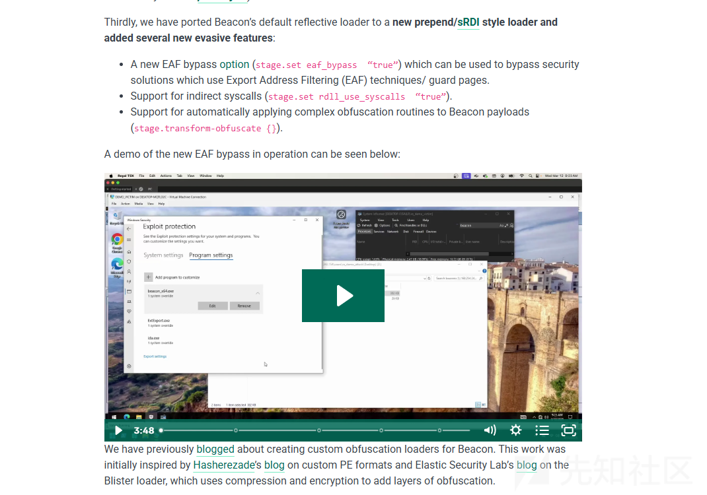

# EAF

EAF(Export Address Filtering)导出地址过滤，也就是将PAGE\_GUARD 应用到一些dll的内存中。

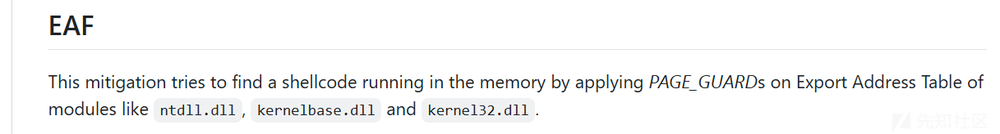

在EAF开启之后我们能看见对应的dll内存空间多出一些PAGE\_GUARD属性的内存

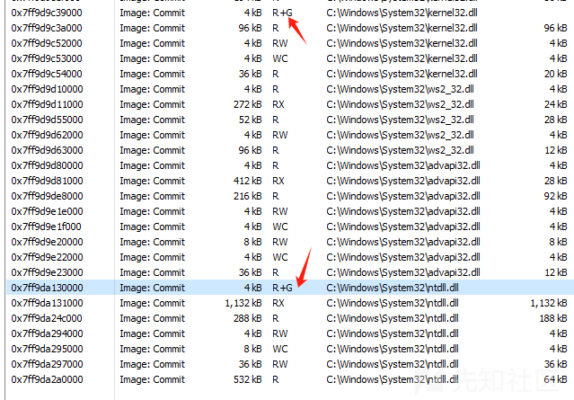

当触发PAGEGUARD之后，将会由PayloadRestrictions.dll 注册的VEH进行接管，然后判断当前的RIP 是否在未备份内存，或者说一些gadget，是的话进程将会终止。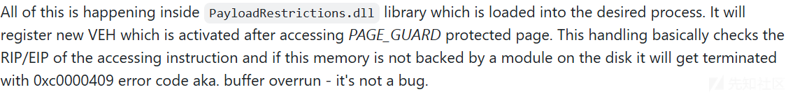

以下是开启了EAF之后进程中加载的模块。

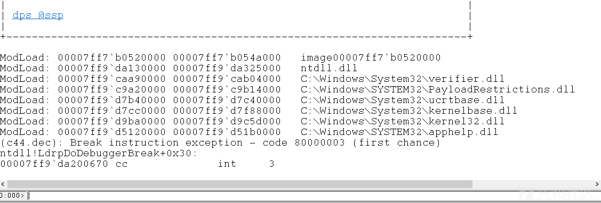

我们去Windows Defender中进行对应的配置，然后运行我们的程序，不出意外是能收到直接werfault

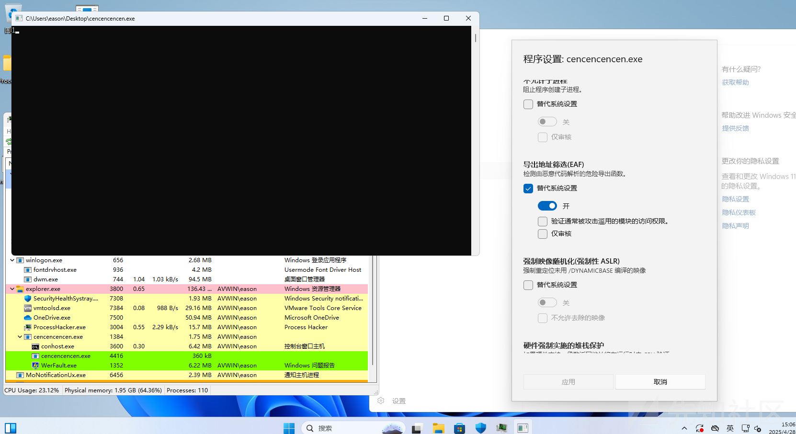

# UDRL

User Defined Reflective Loader是Cobalt Strike4.4官方发布的新功能。它允许你自定义ReflectiveLoader ，也就是反射loader。通过UDRL，我们可以控制一系列beacon在装载beacon.dll 的行为以及后续的一些API和行为的控制。 于是笔者将这里将 CS4.11的功能 融合进入UDRL

## 1.Gadget

我们触发异常之后，注册的VEH将会检测我们的RIP/EIP，由于我们的RDI的展开的特性，所以我们此时在访问对应的内存是一块未备份的内存（下面是我用module stomping 下照样触发的werfault）

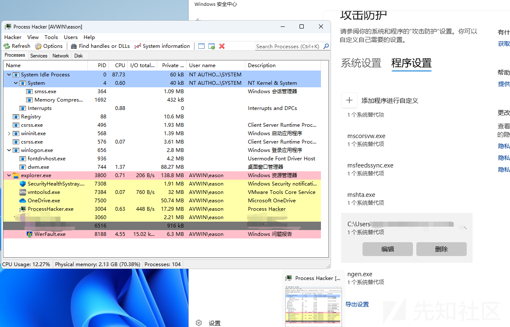

解决的方法就是通过gadget去帮我们去进行内存的读写，如下

```
mov rax, qword ptr [rax + 0x17b8] ; ret
```

但是如果像是这样的Gadget却是会触发EAF+的

```
mov rax, qword ptr [rax] ; ret
```

有了这个思路之后我们就可以去内存中去匹配内存中的gadget

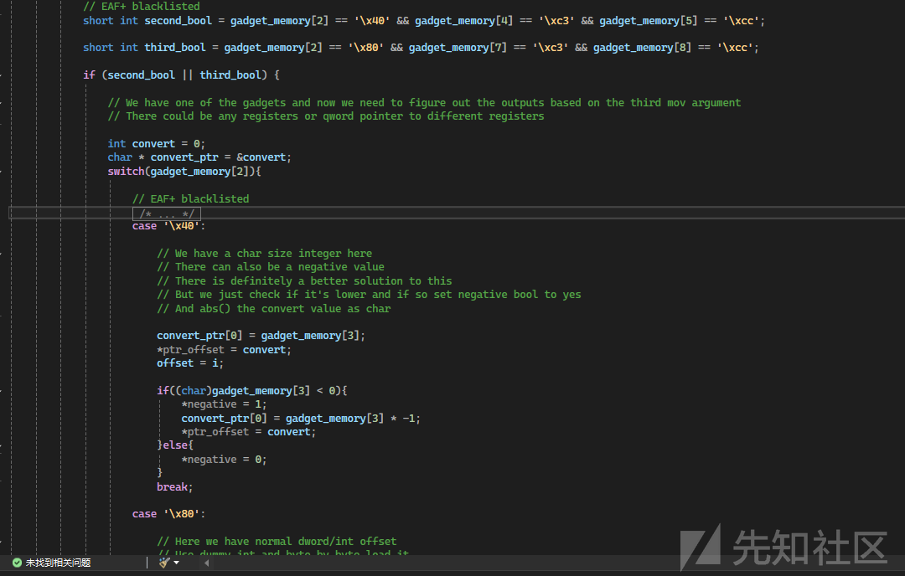

## 2.UDRL Combine

最后就是和我们的UDRL配合了，在CS官方的Kit中的 Library\FunctionResolving.cpp中是我们进行UDRL中对应的初始函数解析的寻找代码。其中作者是说只需要对AddressOfFunctions进行Gadget读写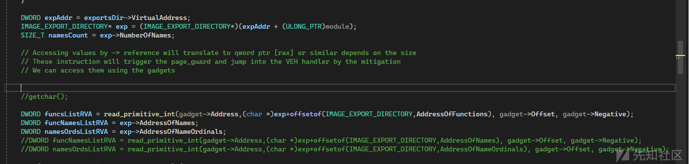

但是经过测试，一些导出表的VA也是存在eaf机制，所以我个人是直接在UDRL中把三个数组以及对应获取导入表的读取操作全部用gadget进行读写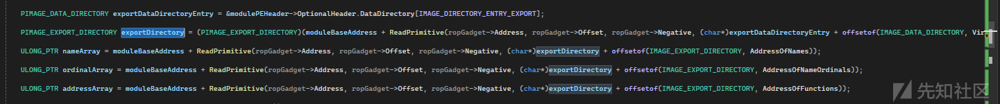

除此之外，我们UDRL还会用到Spoof Call，不然当你去做一些api call的时候像Elastic EDR是直接会报警的

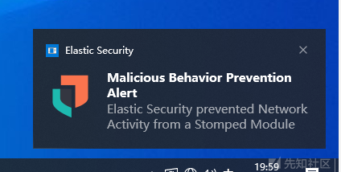

<https://github.com/elastic/protections-artifacts/blob/main/behavior/rules/windows/defense_evasion_network_activity_from_a_stomped_module.toml>

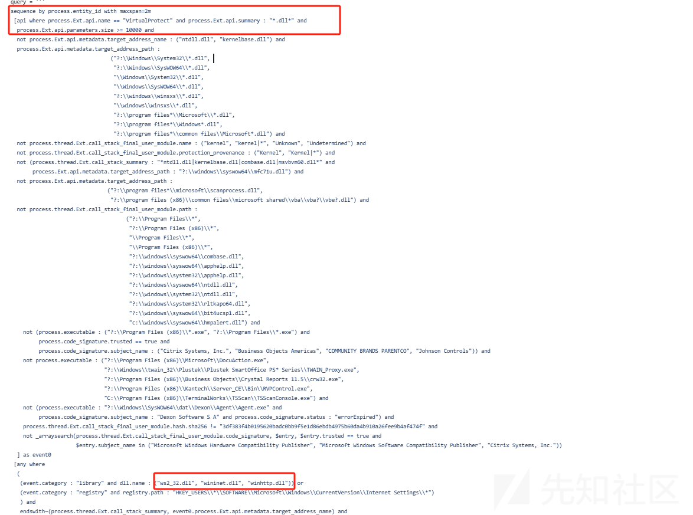

堆栈欺骗的过程中需要我们去寻找一些Gadget，这个寻找过程中也会对应有eaf的规则触发 ，下面是直接去寻找gadget的情况下触发的eaf规则

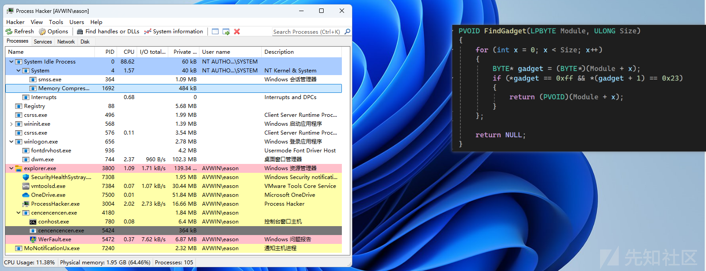

当我们用gadget去寻找的时候就不会触发

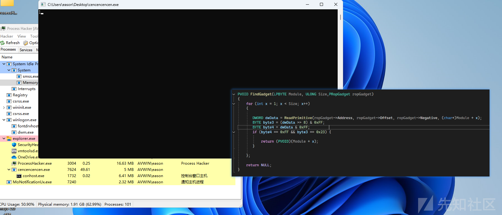

## 3.Now I Can See My Beacon Back

在对上面的操作处理之后，我们就能在开启EAF的情况下达到CS官方说的通过dll中的gadget去Bypass EAF

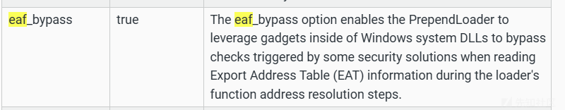

下面是在win10 和 win11上的进行版本测试

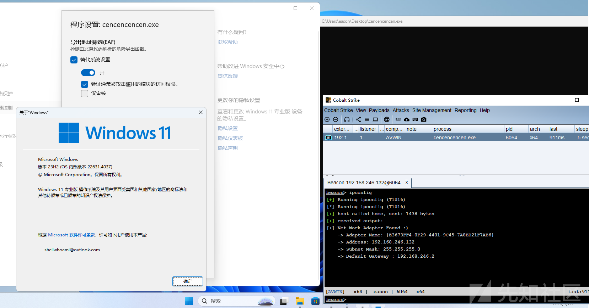

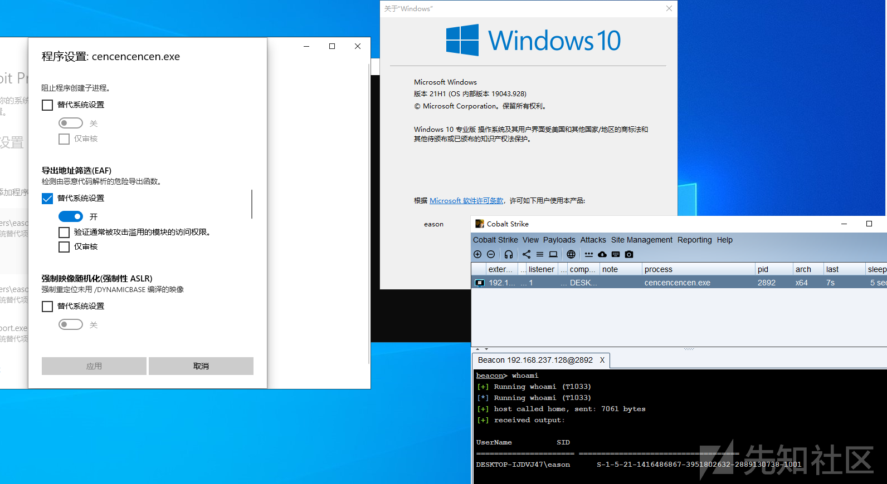

当然了上面也提到了Elastic EDR，也正是CS能把UDRL这个接口给到用户，我们CS才变得了更有可玩性和拓展性。

下图是在Elastic EDR下配合UDRL的上线（当然只是上线，后续操作还是看个人）

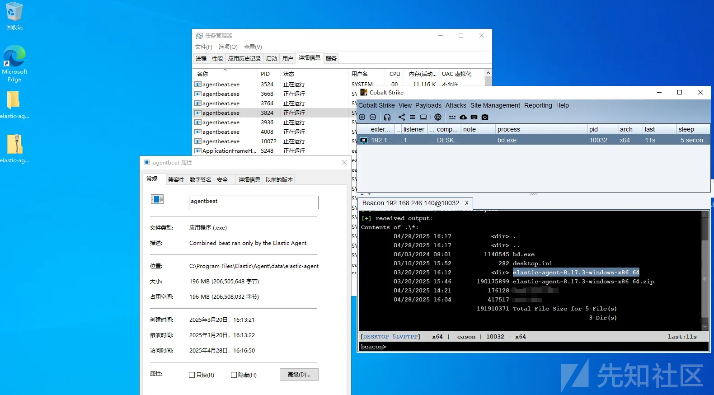

# 参考链接

[ttps://big5-sec.github.io/posts/inside-import-address-filtering/](https://big5-sec.github.io/posts/inside-import-address-filtering/)

<https://github.com/draktuls/IAF-EAF-Shellcode-bypass-PoC?tab=readme-ov-file>

<https://www.cobaltstrike.com/blog/cobalt-strike-411-shh-beacon-is-sleeping><https://hstechdocs.helpsystems.com/manuals/cobaltstrike/current/userguide/content/topics/malleable-c2-extend_pe-memory-indicators.htm?Highlight=eaf>
