# 记一次在域内多个用户横跳到获取域控及域内hash获取的多种方式-先知社区

> **来源**: https://xz.aliyun.com/news/17909  
> **文章ID**: 17909

---

# 信息收集

## 端口扫描

使用nmap进行端口探测，发现存在多个端口存活

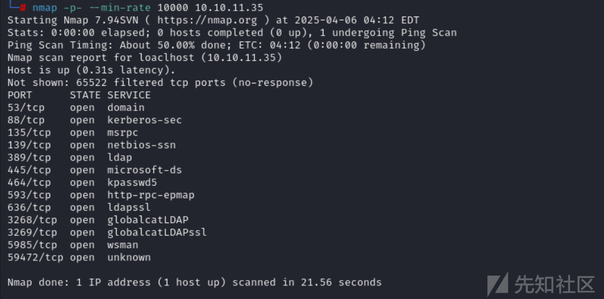

接着使用nmap进行探测具体协议

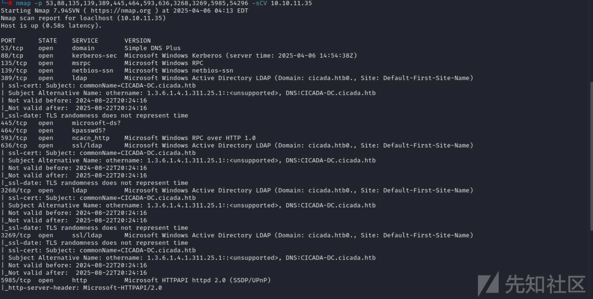

接着使用其探测具体协议。

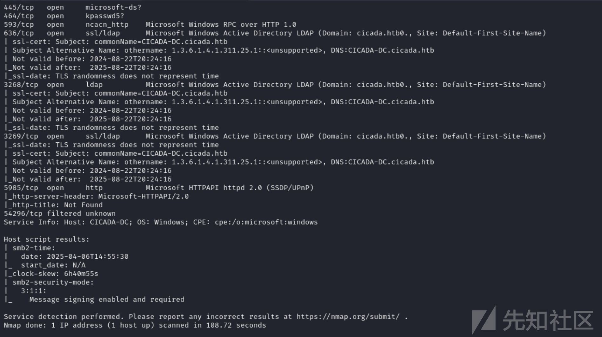

## SMB-TCP 445

使用netexec进行共享枚举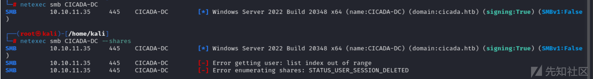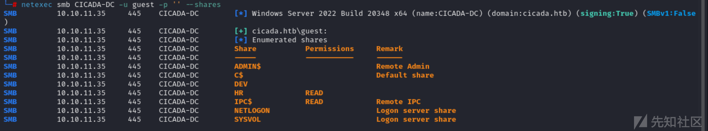

## smbclient未授权访问

guest有权访问该`HR`共享。使用`smbclient`访问

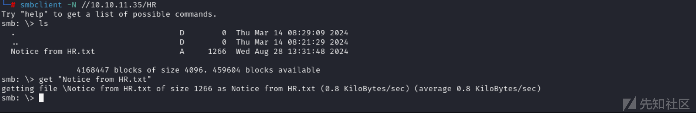

发现一个文件，下载到本地进行查看。

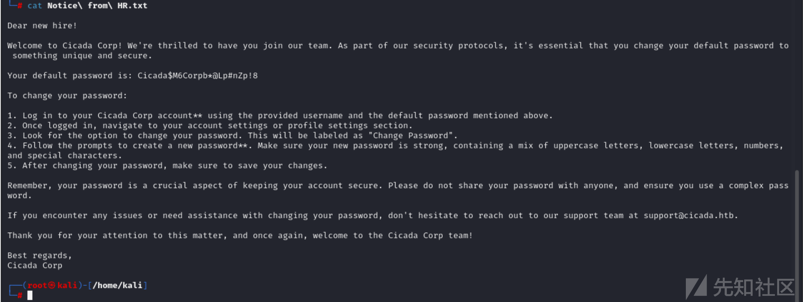

## 爆破用户ID

使用`netexec`暴力破解从 0 到 4000 的用户 ID

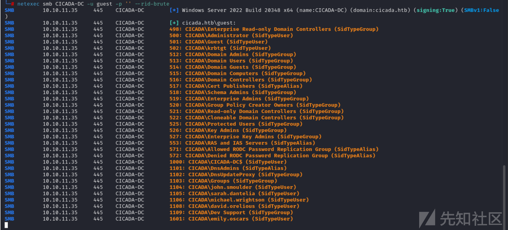

使用`grep`创建用户列表

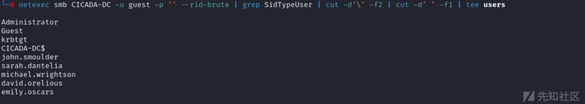

# michael.wrightson用户权限

## 查找用户

使用netexec对用户进行默认密码尝试

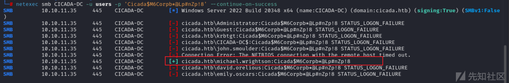

成功枚举出用户之后，然后进行登录。

## 检查访问权限

使用netexec检查ladp、winrm、smb等权限。

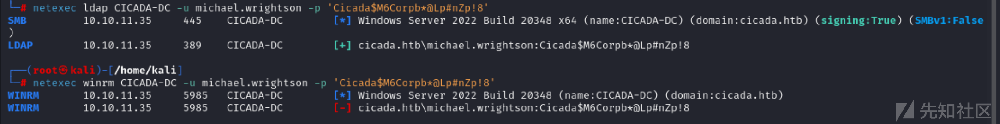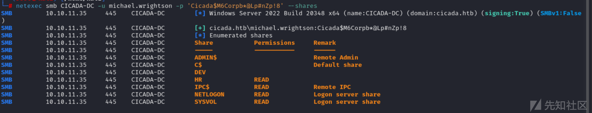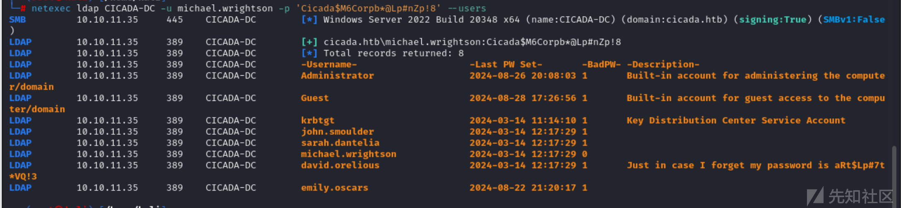

# david.orelious用户权限

## 枚举

使用netexec进行枚举之后，发现没有其他额外的共享访问权限：

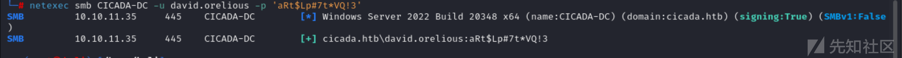

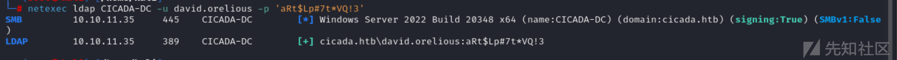

## 用户列表

列出所有用户列表

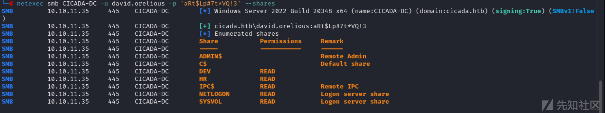

## SMB登录

使用SMBclient进行登录

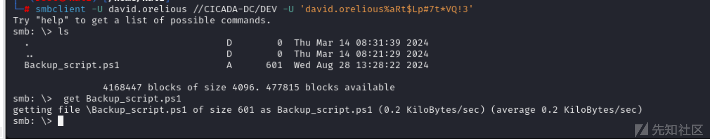

## 备份脚本.ps1

下载脚本之后，然后查看，成功获取用户名和密码

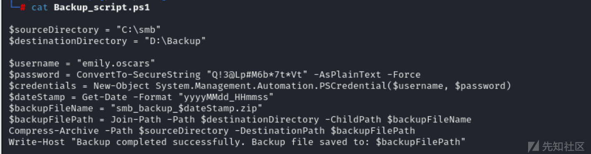

## 凭证校验

使用netexec进行验证其他协议

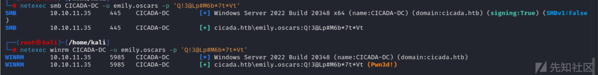

## WinRM远程登录

成功获取user.txt文件

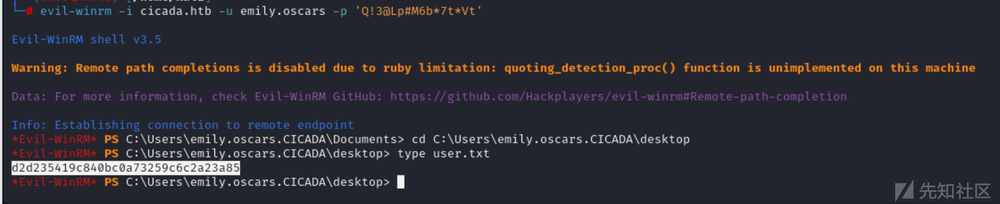

# 权限提升

发现emily.oscars 属于备份操作员组

```
备份操作员组的成员可以备份和还原计算机上的所有文件，无论保护这些文件的权限如何。备份操作员还可以登录和关闭计算机。此组不能重命名、删除或移除。默认情况下，此内置组没有成员，它可以在域控制器上执行备份和还原操作。以下组的成员可以修改备份操作员组成员身份：默认服务管理员、域中的域管理员和企业管理员。备份操作员组的成员不能修改任何管理组的成员身份。虽然此组的成员无法更改服务器设置或修改目录的配置，但他们具有替换域控制器上的文件（包括操作系统文件）所需的权限。由于此组的成员可以替换域控制器上的文件，因此他们被视为服务管理员。
```

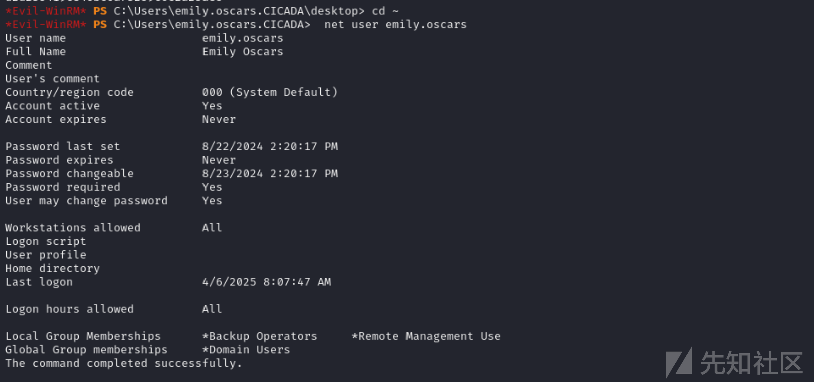

## 利用 SeBackupPrivilege进行权限提升

### reg/secretsdump

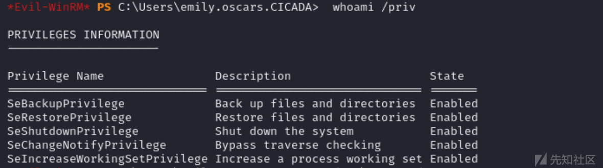

使用secretsdump.py导出hash值

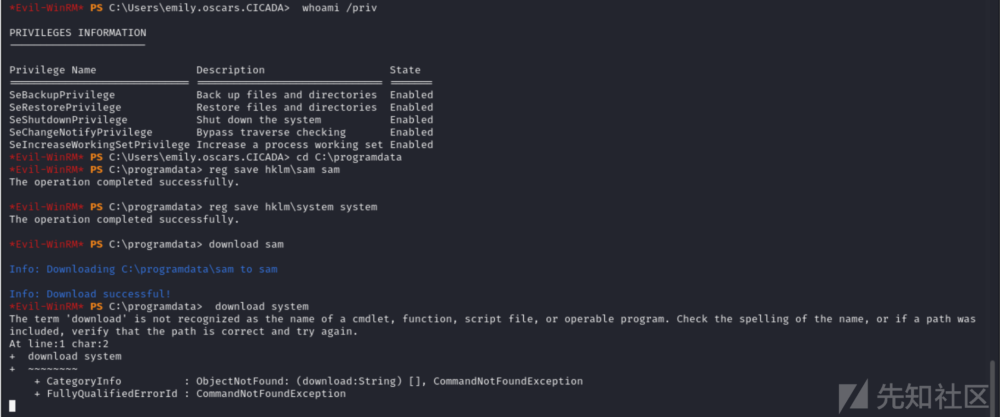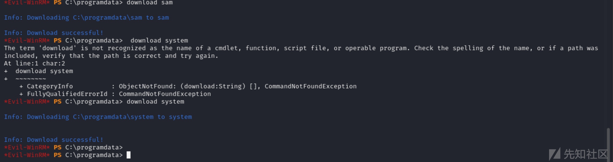

### NetExec

将注册表配置单元转储到文件中

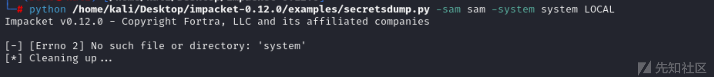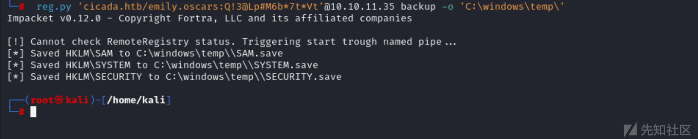

`使用reg.py`复制注册表配置单元：

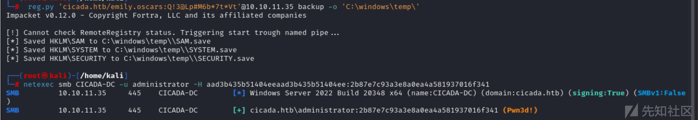

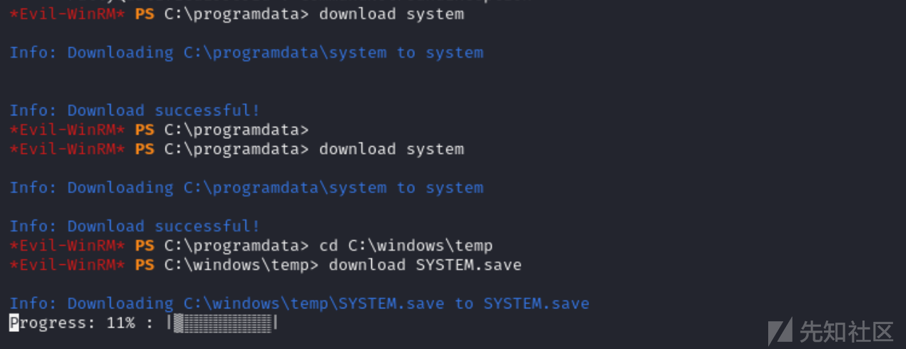

### 获取root权限

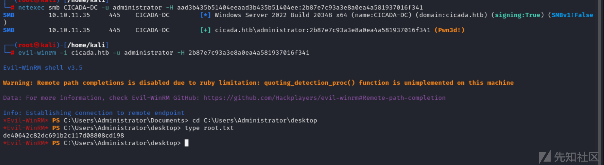

# 域内hash获取的三种方式

​

域名哈希并非存储在注册表中，而是`ndts.dit`存储在`C:\Windows\NTDS`目录中的文件中。即使使用`SeBackupPrivilege`，也无法像复制其他文件一样直接复制它。这并非权限问题，而是因为它一直在被活动目录进程使用。

​

### 方法1：复制 ntds.dit

有几种方法可以获取此文件的副本。一种方法是使用`diskshadow`备份实用程序，这很好用，因为我不需要将任何其他工具上传到目标。我需要传递一个脚本来运行它：

```
set verbose on
set metadata C:\Windows\Temp\0xdf.cab
set context clientaccessible
begin backup
add volume C: alias cdrive
create
expose %cdrive% E:
end backup
```

### 方法2：提取哈希值

`secretsdump.py`也可以提取这些哈希值：

​

### 方法3：NetExec

`netexec`使用`ntdsutil`模块来完成此操作：
