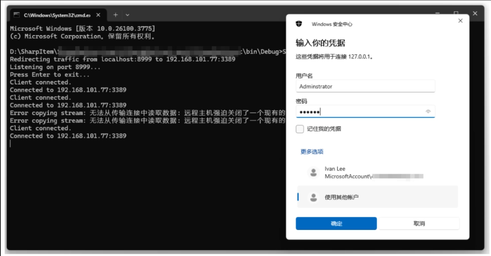
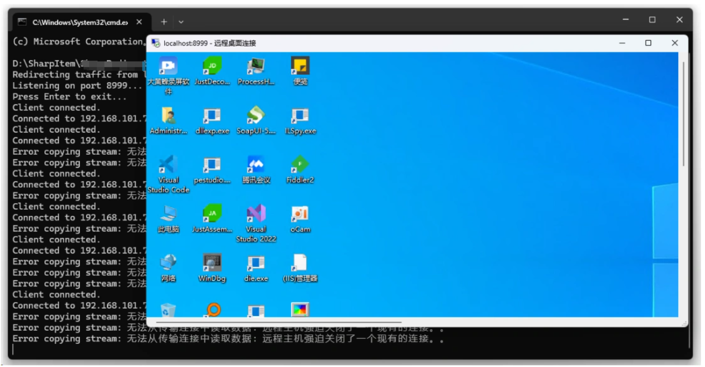

# Sharp4TransferPort：一款通过 TcpListener 实现端口转发突破网络边界的工具-先知社区

> **来源**: https://xz.aliyun.com/news/17917  
> **文章ID**: 17917

---

在渗透测试和红队攻防中，端口转发（Port Forwarding）是一项至关重要的技术手段。通过将数据流量从一个端口转发到另一个端口，打破了防火墙和其他网络安全控制措施的屏障，为攻击者提供了进一步访问目标网络的通道。

​

尤其是在目标环境中存在严格的访问控制或端口过滤时，端口转发能够为红队攻防提供更多灵活的操作空间。本文将深入探讨端口转发的实现原理，并结合实际案例分析其在渗透测试中的应用与价值，从而为攻防人员提供更加丰富的技术视角和实践经验。

### 0x01 TcpListener

在 .NET 中，TcpListener 是专门用于实现 TCP服务器端功能 的一个类，用于在指定的端口上监听传入的网络连接，并接受来自客户端的 TCP 请求。基本用法如下所示。

​

```
TcpListener listener = new TcpListener(IPAddress.Any, 8888);
listener.Start();
Console.WriteLine("Server started...");
while (true)
{
    TcpClient client = listener.AcceptTcpClient();
    Console.WriteLine("Client connected!");
}
```

此处的 IPAddress.Any 表示监听本机所有可用网络接口上的 8888 端口， Start() 方法用于启动 TcpListener 实例，开始监听指定端口上的传入 TCP 连接请求，调用此方法后，系统会分配底层的网络资源，比如 Socket，并准备好监听接收来自客户端的连接。

上述代码中， AcceptTcpClient() 方法用于同步地等待客户端连接请求，一旦有客户端连接到服务器，这个方法就会返回一个新的 TcpClient 对象，代表这条新的连接通道。

​

### 0x02 TcpClient

TcpClient 表示服务器端和客户端之间的一条 TCP 连接。在服务器端，TcpListener.AcceptTcpClient() 返回的就是一个 TcpClient，表示和某个客户端之间的通信通道，通过 TcpClient 可以很方便地进行发送数据和接受数据。基本用法如下所示。

​

```
TcpClient client = listener.AcceptTcpClient();
NetworkStream stream = client.GetStream();
// 发送数据
byte[] buffer = Encoding.UTF8.GetBytes("Hello, client!");
stream.Write(buffer, 0, buffer.Length);
// 接收数据
byte[] recvBuffer = new byte[1024];
int bytesRead = stream.Read(recvBuffer, 0, recvBuffer.Length);
Console.WriteLine("Received: " + Encoding.UTF8.GetString(recvBuffer, 0, bytesRead));
// 关闭连接
stream.Close();
client.Close();
```

​

代码中从已连接的 TcpClient 中，提取出一个 NetworkStream 对象。NetworkStream 是一个标准的 .NET 流对象，继承自 Stream，可以直接用来发送和接收字节数据。

当发送数据到客户端时，需要将字符串 "Hello, client!" 通过 UTF-8 编码成字节数组，再使用 NetworkStream.Write 方法将字节数据写入 NetworkStream，发送到客户端。

当接收客户端数据时，使用 Read 方法从 NetworkStream 中读取数据，存入 recvBuffer，再通过 UTF-8 解码收到的字节，转换成字符串。

​

### 0x03 编码实践

下面这段实践代码，将详细介绍一个使用 .NET 编写的 TCP 端口转发器，通过 TcpListener 和 TcpClient 类配合异步编程实现双向数据转发的完整流程。

​

```
var redirector = new PortRedirector(localPort, destinationHost, destinationPort);
redirector.Start();
Console.WriteLine("Press Enter to exit...");
Console.ReadLine();
redirector.Stop();

class PortRedirector
{
    private readonly int _localPort;
    private readonly string _destinationHost;
    private readonly int _destinationPort;
    private TcpListener _listener;
    private bool _isRunning;

    public PortRedirector(int localPort, string destinationHost, int destinationPort)
    {
        _localPort = localPort;
        _destinationHost = destinationHost;
        _destinationPort = destinationPort;
    }

    public void Start()
    {
        _listener = new TcpListener(IPAddress.Any, _localPort);
        _listener.Start();
        _isRunning = true;

        Console.WriteLine($"Listening on port {_localPort}...");
        Task.Run(() => AcceptClients());
    }

    public void Stop()
    {
        _isRunning = false;
        _listener?.Stop();
    }

    private async Task AcceptClients()
    {
        while (_isRunning)
        {
            try
            {
                var client = await _listener.AcceptTcpClientAsync();
                Console.WriteLine("Client connected.");
                _ = HandleClient(client);
            }
            catch (Exception ex)
            {
                if (_isRunning)
                    Console.WriteLine($"Error accepting client: {ex.Message}");
            }
        }
    }

    private async Task HandleClient(TcpClient sourceClient)
    {
        using (sourceClient)
        {
            try
            {
                var destinationClient = new TcpClient();
                await destinationClient.ConnectAsync(_destinationHost, _destinationPort);
                Console.WriteLine($"Connected to {_destinationHost}:{_destinationPort}");

                using (destinationClient)
                {
                    var sourceStream = sourceClient.GetStream();
                    var destinationStream = destinationClient.GetStream();

                    // Redirect traffic in both directions
                    var forwardTask = CopyStream(sourceStream, destinationStream);
                    var backwardTask = CopyStream(destinationStream, sourceStream);

                    await Task.WhenAll(forwardTask, backwardTask);
                }
            }
            catch (Exception ex)
            {
                Console.WriteLine($"Error handling client: {ex.Message}");
            }
        }
    }

    private async Task CopyStream(Stream input, Stream output)
    {
        try
        {
            byte[] buffer = new byte[8192];
            int bytesRead;
            while ((bytesRead = await input.ReadAsync(buffer, 0, buffer.Length)) > 0)
            {
                await output.WriteAsync(buffer, 0, bytesRead);
            }
        }
        catch (Exception ex)
        {
            Console.WriteLine($"Error copying stream: {ex.Message}");
        }
    }
}
```

​

代码首先，声明的 \_localPort、\_destinationHost、\_destinationPort、\_listener 这几个只读变量，分别代表着监听的本地端口号、要转发到的目标主机地址、目标主机端口号，以及 用于监听传入连接的 TcpListener 实例化后的对象。

接着，在 Start 方法中，创建并启动 TcpListener，再通过 Task.Run 异步执行 AcceptClients 方法，避免阻塞主线程。其中，接受数据的逻辑封装在 AcceptClients 方法中，如下所示。

​

```
private async Task AcceptClients()
{
    while (_isRunning)
    {
        try
        {
            var client = await _listener.AcceptTcpClientAsync();
            Console.WriteLine("Client connected.");
            _ = HandleClient(client);
        }
        catch (Exception ex)
        {
            if (_isRunning)
                Console.WriteLine($"Error accepting client: {ex.Message}");
        }
    }
}
```

这里使用 AcceptTcpClientAsync 方法异步接受连接，每有一个新的客户端连接到来，就调用 HandleClient 进行处理。 这里的 HandleClient 返回的是 Task，但前面用 \_ = HandleClient(client); 表示无需等待，直接让它在后台运行。

随后，通过 HandleClient 方法处理每个客户端连接的逻辑，具体代码如下所示。

​

```
private async Task HandleClient(TcpClient sourceClient)
{
    using (sourceClient)
    {
        try
        {
            var destinationClient = new TcpClient();
            await destinationClient.ConnectAsync(_destinationHost, _destinationPort);
            Console.WriteLine($"Connected to {_destinationHost}:{_destinationPort}");

            using (destinationClient)
            {
                var sourceStream = sourceClient.GetStream();
                var destinationStream = destinationClient.GetStream();
                var forwardTask = CopyStream(sourceStream, destinationStream);
                var backwardTask = CopyStream(destinationStream, sourceStream);
                await Task.WhenAll(forwardTask, backwardTask);

            }

        }

        catch (Exception ex)

        {

            Console.WriteLine($"Error handling client: {ex.Message}");
        }
    }
}
```

​

这里是建立到目标服务器的新连接，并获取客户端和服务器的 NetworkStream。再启动两个数据转发任务： 一个从客户端读数据并写入服务器。 一个从服务器读数据并写入客户端。 使用 Task.WhenAll 等待双向转发同时完成。

最后，数据转发细节封装在 CopyStream 方法中，CopyStream 方法会不断异步从输入流读取数据，并异步写入到输出流。具体代码如下所示。

​

```
private async Task CopyStream(Stream input, Stream output)

{

    try

    {

        byte[] buffer = new byte[8192];

        int bytesRead;

        while ((bytesRead = await input.ReadAsync(buffer, 0, buffer.Length)) > 0)

        {

            await output.WriteAsync(buffer, 0, bytesRead);

        }

    }

    catch (Exception ex)

    {

        Console.WriteLine($"Error copying stream: {ex.Message}");

    }

}
```

​

代码中采用 8KB 的缓冲区，并使用 ReadAsync 和 WriteAsync，能够支持高并发、大量数据传输。 如果输入流连接关闭，ReadAsync 返回 0，从而退出循环，完成转发任务。

​

Sharp4TransferPort.exe 便是这样一款专为端口转发设计的轻量型工具，使用纯 .NET 技术开发，核心逻辑基于 TcpClient 和 NetworkStream，实现了可靠而高效的异步数据流转发。

通过简单的命令行参数配置，用户可以快速建立一条本地到远程的转发通道，无需复杂部署，也无需额外组件，非常适合临时快速使用。

​

例如，在典型的使用场景中，可以通过如下命令实现远程桌面（RDP）的转发连接

​

```
Sharp4TransferPort.exe 8999 192.168.101.77 3389
```

​

这条指令表示：在本地监听8999端口，当有连接时，将流量转发到远程IP地址为192.168.101.77的3389端口。

设置完成后，只需在本机的远程桌面客户端中输入 127.0.0.1:8999 或 localhost:8999，就可以直接连接到目标主机，实现远程控制。运行后如下图所示。

​





综上，在红队渗透中，Sharp4TransferPort 可应用于各种场景，比如绕过防火墙策略、打通隔离区通信、转发数据库端口、配合代理工具搭建内网代理链等，使得横向渗透和后续操作更加顺畅。由于其体积小巧、运行方式简单，无需注册服务或修改系统设置，因此也具备一定的隐蔽性，降低了被防御系统检测的概率。
