# 幽狼GhostWolf——根据内存数据结构定位敏感信息-先知社区

> **来源**: https://xz.aliyun.com/news/17918  
> **文章ID**: 17918

---

# 简介

在学习浏览器凭证获取时了解到一款工具ChromeKatz，它可以从内存中获取Chrome浏览器的用户凭证，在深入了解它的实现原理后我觉得它的潜力远不止如此。

拿Todesk来说，我看过网上有关Todesk和向日葵内存凭证获取，大多数都是将内存dump到本地，然后找密码，也有根据偏移去计算密码地址，但是将内存dump到本地本质上和直接在进程内存中找没什么区别，甚至还多了一个dump的过程，可能唯一区别就是你能更好的浏览内存方便人工查找。而另一种方式通过偏移来找，也并不能适用于各种情况，因为通过偏移来找首先你要通过一个特征码去找基址，然后再计算偏移，但是并不是所有的敏感信息都有特征码来让你定位，而且偏移在同一版本不同环境也可能有所偏差，所以幽狼GhostWolf用了另一种方法，通过敏感信息的数据结构来定位，这种方式可以很好解决偏移定位的痛点

# 定位进程

其实大多数应用都不止一个进程，从内存中找，首先要知道哪个进程中有我们想要的数据，我看很多文章都是上来就找，并没有说清找的是哪个进程，比如Todesk就有两个进程

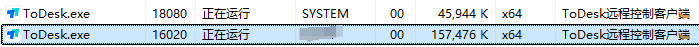

一个系统权限的进程，一个用户权限的进程，每个进程对应的内存结构都不一样

拿临时密码读取来说，我们需要找到设备代码和临时密码，用CE在这两个进程中搜索临时密码，首先是系统权限进程

​

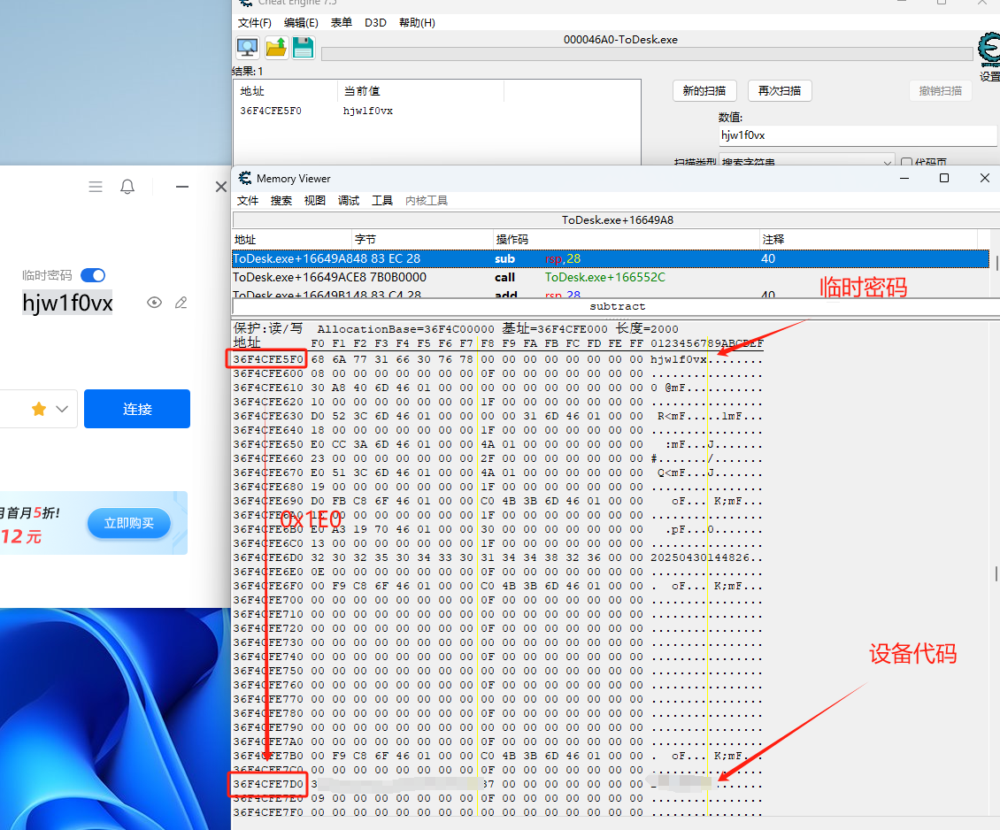

你会发现临时密码和设备代码地址之间差了0x1E0的距离

而在用户进程中

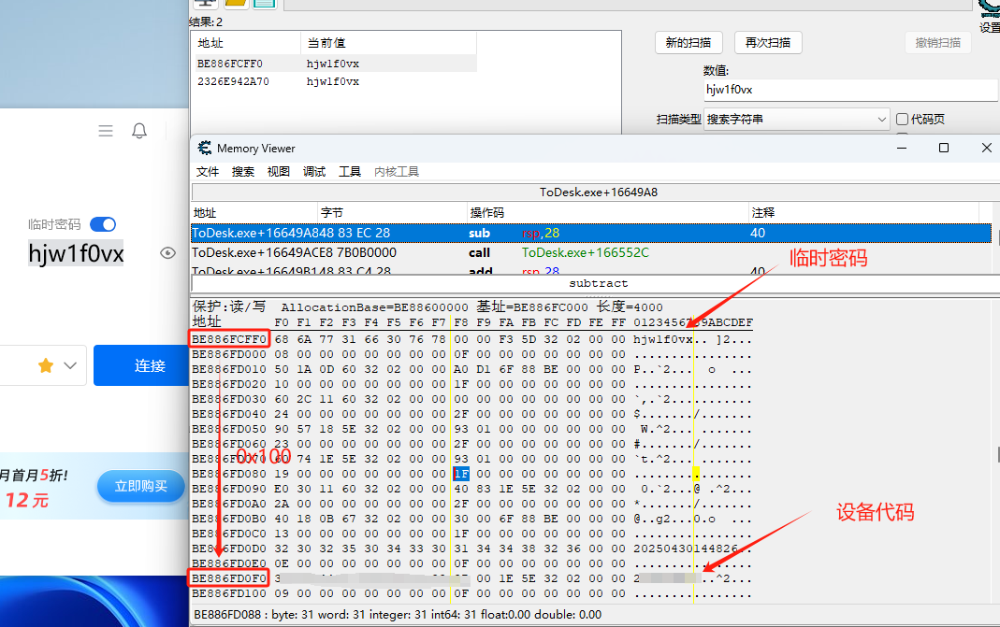

临时密码和设备代码只隔了0x100的距离。

怎么选进程呢？其实每个进程对应的参数都不一样

比如系统权限的进程参数是

`"F:\RemoteControl\ToDesk\ToDesk.exe" --runservice`

用户权限的进程参数是

`"F:\RemoteControl\ToDesk\ToDesk.exe" --show --localPort=35600`

我们可以根据参数来选出对应的进程，这里以用户权限的进程为例

选择进程，然后读取内存

# 数据结构解析

读取内存后就是找敏感数据了，怎么找，怎么定位？如果你懂点二进制，又善于细心观察，你很容易发现在上面显示内存块中有着特定的数据结构。

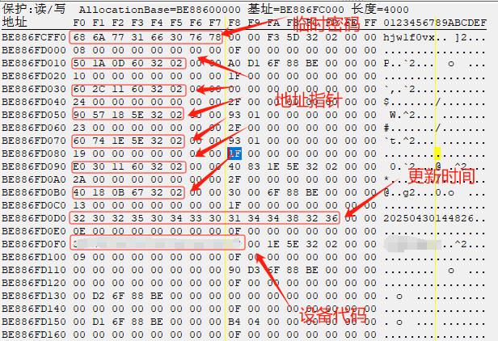

你会发现从临时密码开始，每隔0x20个字节就会出现一个地址指针，然后继续往下是临时密码更新时间，再往下是设备代码。

那这些地址指针又都是什么呢？通过CE跳转到对应的地址就会发现

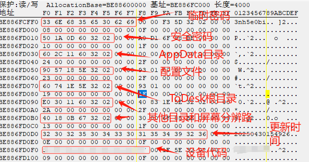

每个地址都对应ToDesk不同的信息

接着再仔细观察这0x20的内存块就会发现

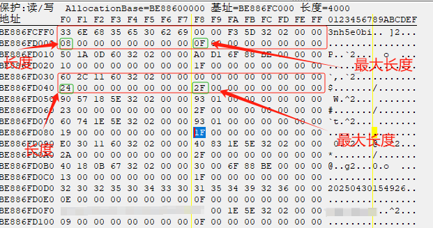

前16字节是地址和数据信息，后16字节分别是8字节的数据长度（1字节长度7字节填充对其）和8字节的最大长度（1字节长度7字节对其）

于是整个数据结构就完整了，它大概是这样的

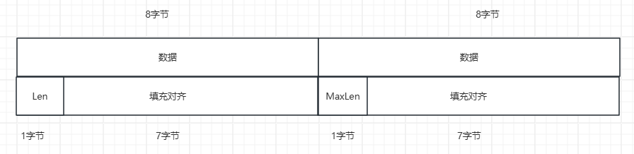

于是我们可以将这0x20字节定义为一个结构体叫TodeskString

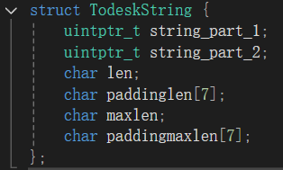

于是我们可以写出它整个数据结构

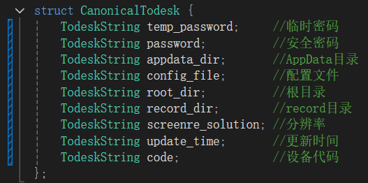

# 数据结构定位

接下来就是定位了，则么找这个数据结构？我们将其转化为一个字节签名，通过这个签名去匹配内存

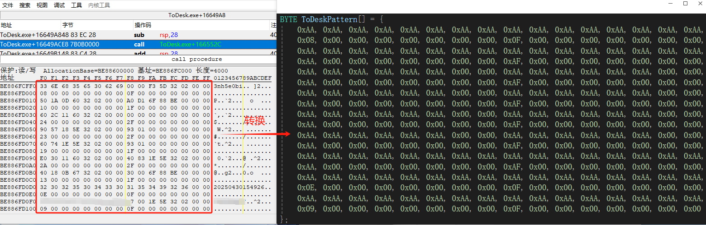

规定用0xAA来匹配任意字节，其他的则匹配特定字节

于是我们能发现一些固定格式的数据

比如Todesk的临时密码是8位的，设备代码是9位的，这些长度都是固定的，同时他们的最大长度也都是以F为结尾

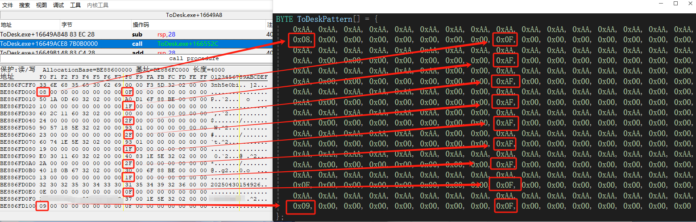

我们用AF来匹配以F结尾的16进制数

于是这个字节签名就写好了（当然还有很多需要注意的，以免篇幅过长就不一一说了）

但是根据上面的数据来看，这0x20的数据块中前16字节有的是敏感数据，有的是地址，可我们都将其定义为TodeskString，怎么区分是数据还是地址指针呢？于是通过调试你会发现

原来当数据长度小于0x10时，会直接写数据，比如临时密码是8位，就直接写在上面，如果大于0x10就会将其写为地址，并将数据存到地址中，比如我的Todesk目录很长，很显然大于0x10，于是都写的地址，我们只需要读取地址中的数据就行。

好了，完美！

于是我们逆向了Todesk的敏感信息数据结构，并尝试定位它获取它

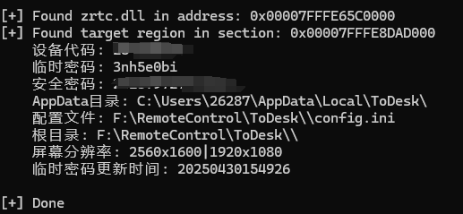

同理，你也可以尝试逆向一下Todesk的设备列表数据结构（就不过多展示了）

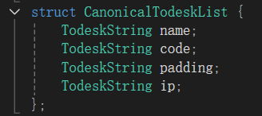

然后写出它的字节签名

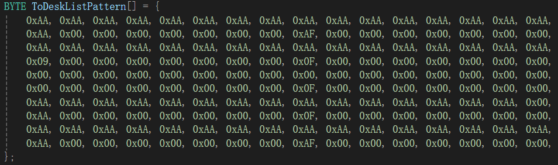

然后运行程序获取设备列表

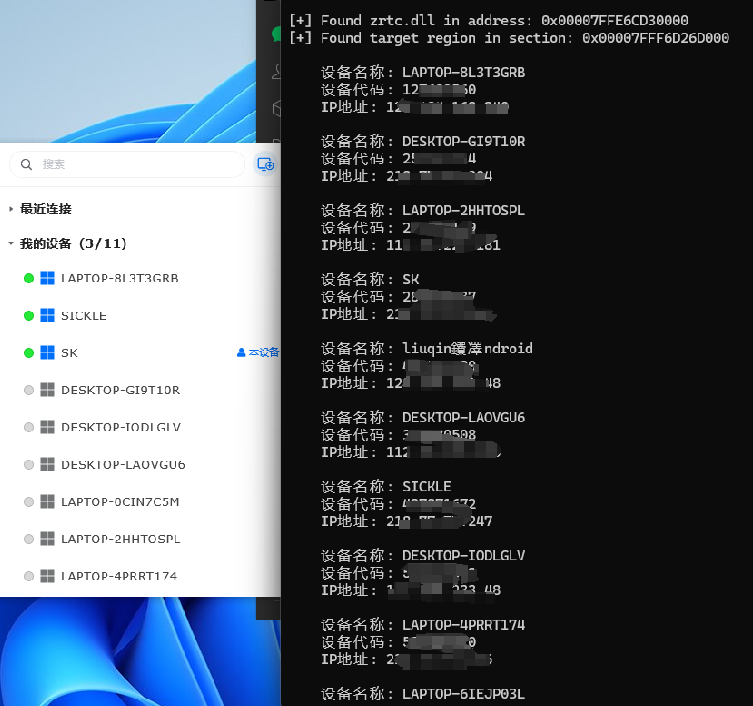

# 举一反三

于是我们可以将这种方式应用到任何应用程序，当然只要你肯花时间逆向，就拿火狐为例，我在CookieKatz的基础上添加了火狐浏览器的内存Cookie获取，这种通过特定数据结构获取数据的方式好处就是，无视你的隐私模式

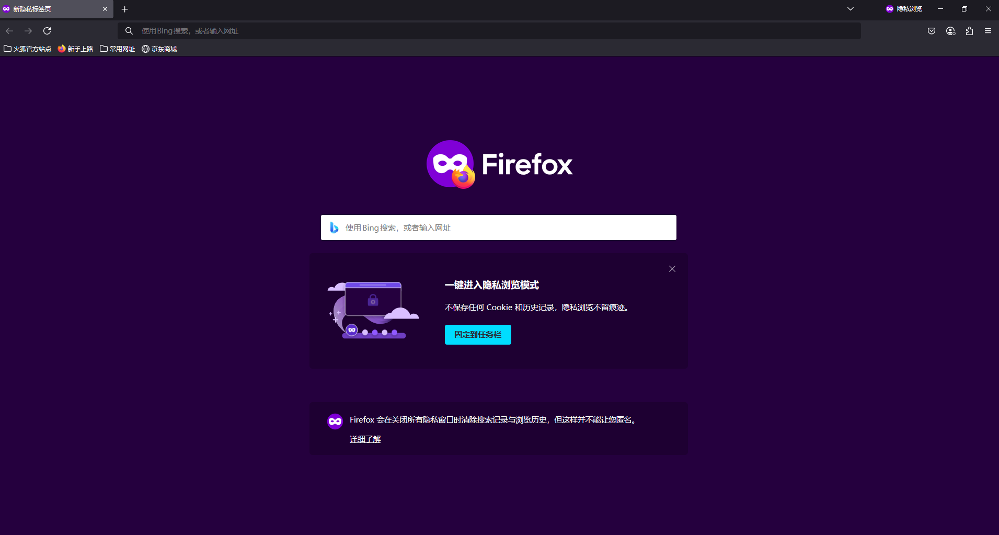

虽然隐私模式下你的Cookie数据不会保存在本地，但是它依然存在于内存中，你不管怎么存，数据结构（可能是一个类或结构体）是程序开发时定义好的，基本不会变，因此即便是隐私模式下也能提取到用户Cookie。

# 攻与防

这种攻击方式优点很明显，无需计算偏移，无需接触本地文件，签名匹配兼容性强，报毒概率小，同时同一版本应用在大多数环境下数据结构基本一致，但是随着应用版本更数据结构可能有变化

好，说完优点，来说说怎么防？随着一些应用的更新我也发现了他们的应对措施（不谈安全设备，这又是另一说了）

拿谷歌浏览器为例，以前的谷歌浏览器，只要你打开浏览器，账户密码就会被加载到内存中，但是现在不会了（Edge浏览器会），现在只有你打开谷歌密码管理工具时，明文密码才会被加载到内存中

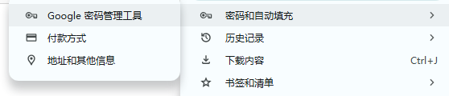

包括向日葵也是如此，较新版本的向日葵只有当你点击显示验证码时，这个验证码才会明文显示在内存中

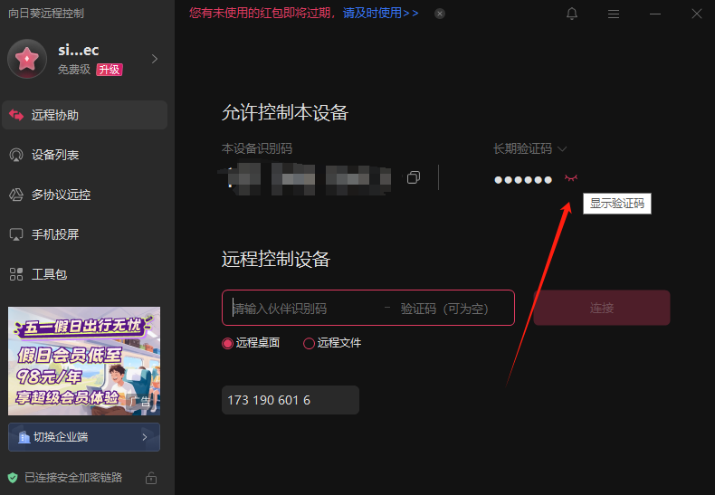

否则其他情况下你在内存中是找不到的，以前是直接可以获取到的，很显然这就大大增加了此类内存工具的利用难度了，你不可能说正好我运行的时候他就是点了是吧，这感觉几率太小了，当然也可以做成持续的内存监控，一直扫，这样就解决这个问题了，但是风险也加大了。

# 总结

于是幽狼诞生了，项目地址<https://github.com/SickleSec/GhostWolf>，欢迎技术探讨！
