# 银狐黑产组织最新Loader攻击样本分析-先知社区

> **来源**: https://xz.aliyun.com/news/17930  
> **文章ID**: 17930

---

# 前言概述

最近几年银狐类黑产团伙非常活跃，今年这些黑产团伙会更加活跃，而且仍然会不断的更新自己的攻击样本，采用各种免杀方式，逃避安全厂商的检测，此前大部分银狐黑产团伙使用各种修改版的Gh0st远控作为其攻击武器，远程控制受害者主机之后，进行相关的网络犯罪活动。

​

近日跟踪到该黑产组织最新Loader攻击样本，对该样本进行了详细分析，分享出来供大家参考学习，银狐黑产组织的核心大多数没有太多变化，主要是Loader加载器在不断的更新，以逃避安全厂商的检测。

​

# 样本分析

1.初始样本是一个伪装成Chrome的MSI安装程序，会捆绑一个正常的Chrome安装程序和一个木马程序，如下所示：

2.木马程序采用Rust语言编写，编译时间为2025年3月25日，如下所示：

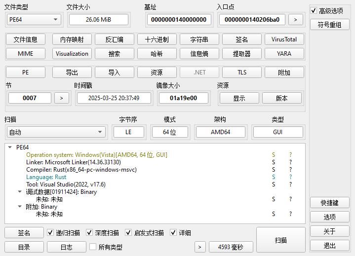

3.解密出远程服器下载URL地址，如下所示：

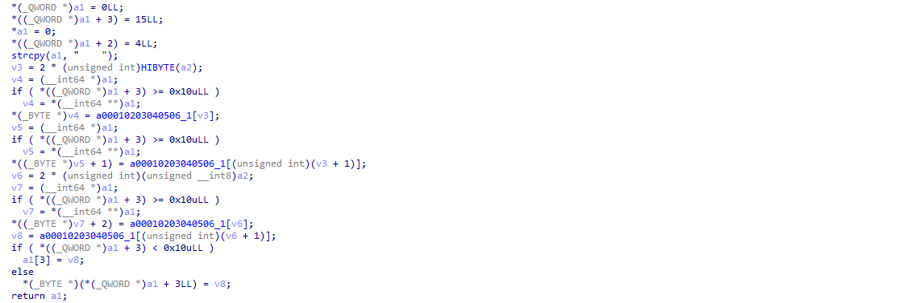

4.从远程服务器URL下载加密代码执行，下载的加密代码，如下所示：

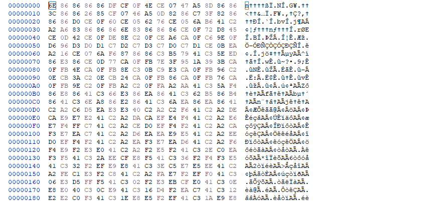

5.通过异或解密上面的加密代码，解密之后的ShellCode，如下所示：

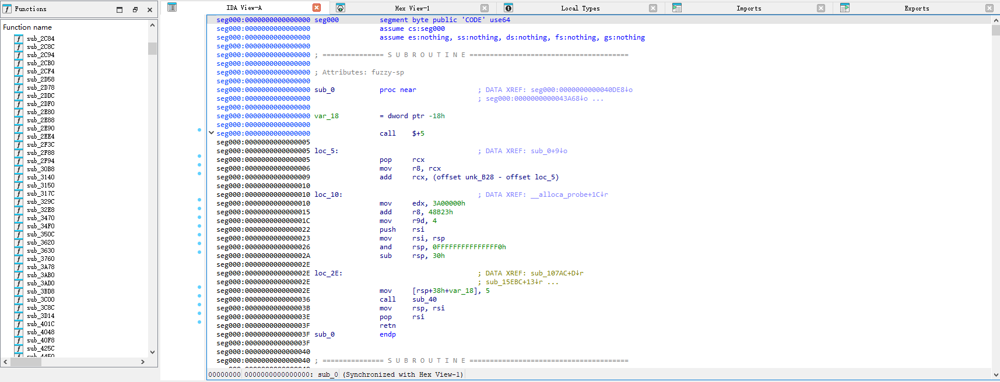

6.动态调试执行ShellCode中的PayLoad代码，PayLoad代码的导出函数，如下所示：

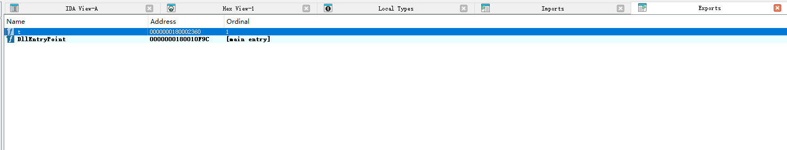

7.通过API获取远程服务器时间信息，如下所示：

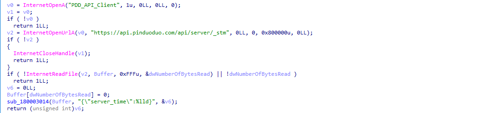

8.从远程服务器上下载恶意程序，如下所示：

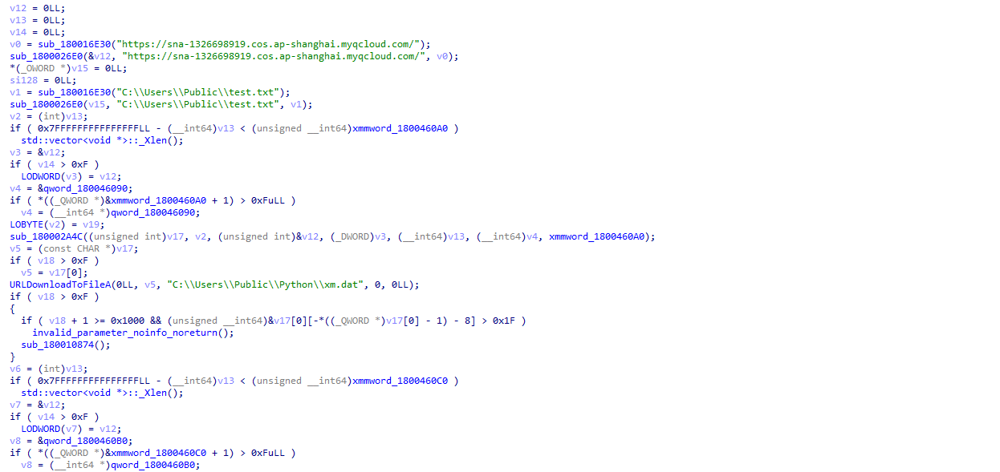

9.判断是否存在指定的恶意程序和安全产品进程，如下所示：

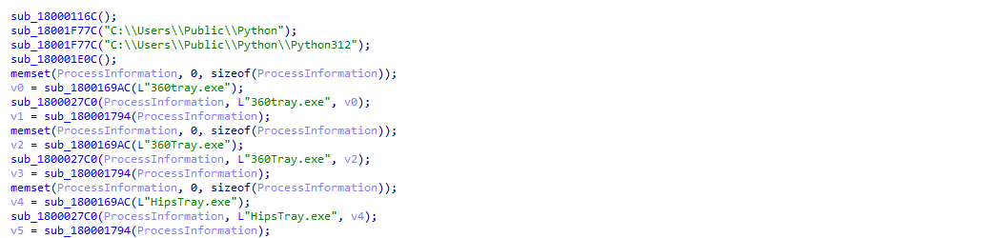

10.设置指定恶意文件目录为免扫描路径，如下所示：

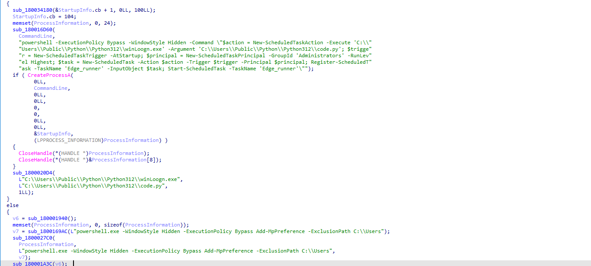

11.调用执行指定的恶意文件，如下所示：

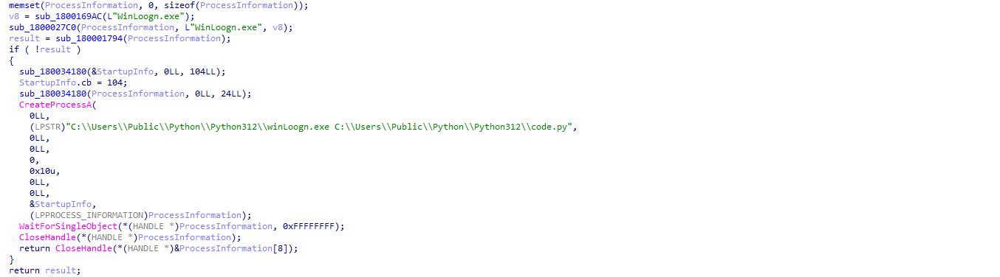

12.下载的恶意文件解压缩之后，如下所示：

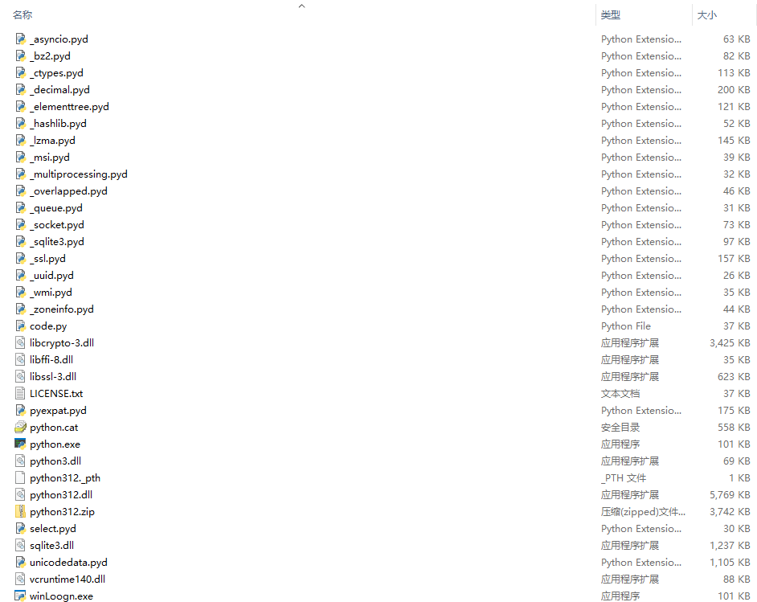

13.调用code.py恶意脚本，如下所示：

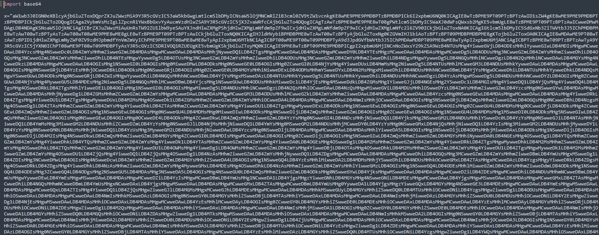

14.解密code.py恶意脚本之后，如下所示：

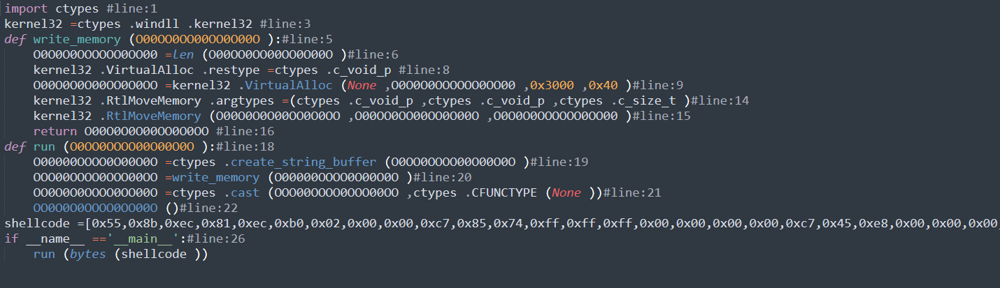

15.在内存中调用执行ShellCode代码，ShellCode代码，如下所示：

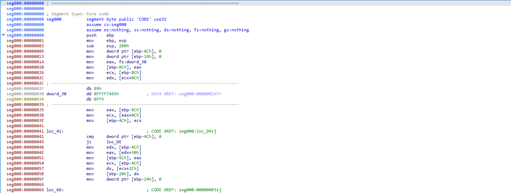

16.动态调试ShellCode代码，会读取之前从远程服务器上下载的加密数据，如下所示：

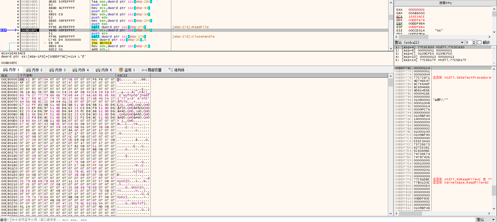

17.然后解密加密的数据，解密算法，如下所示：

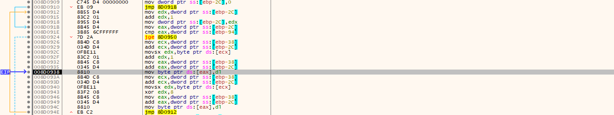

18.解密之后的PayLoad，如下所示：

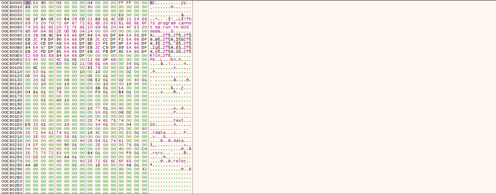

19.最后的PayLoad的导出函数，如下所示：

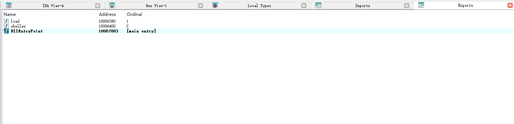

20.Load导出函数就是银狐的加载程序，会解密服务器的C2配置信息，如下所示：

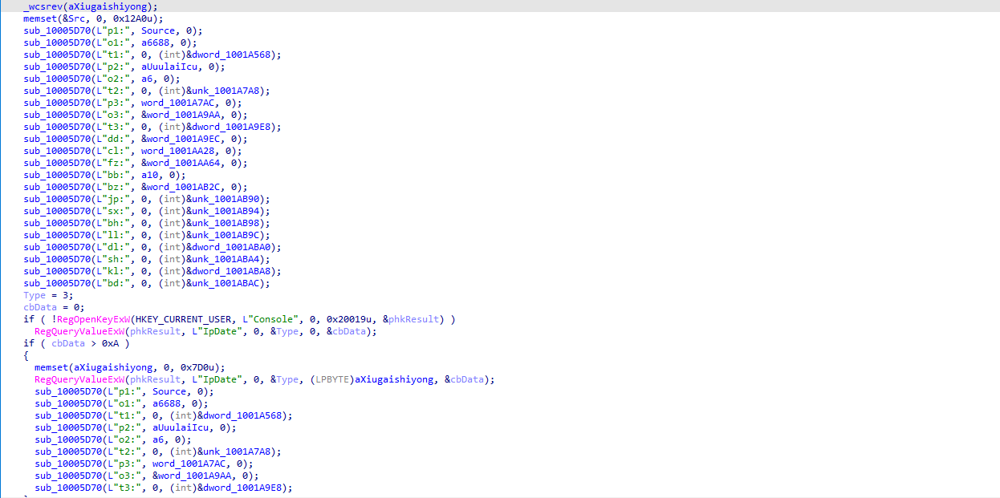

21.shellx导出函数为银狐木马的核心PayLoad，远程服务器C2域名，如下所示：

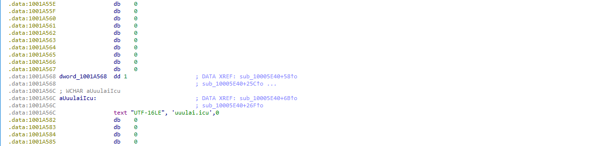

该核心PayLoad与此前的shellx银狐木马变种功能完全一样，不做重复分析，笔者主要是对前面的整个Load加载器进行了详细分析。

​

# 总结结尾

黑客组织利用各种恶意软件进行的各种攻击活动已经无处不在，防不胜防，很多系统可能已经被感染了各种恶意软件，全球各地每天都在发生各种恶意软件攻击活动，黑客组织一直在持续更新自己的攻击样本以及攻击技术，不断有企业被攻击，这些黑客组织从来没有停止过攻击活动，非常活跃，新的恶意软件层出不穷，旧的恶意软件又不断更新，需要时刻警惕，可能一不小心就被安装了某个恶意软件。
