# 带正常数字签名的后门样本分析-先知社区

> **来源**: https://xz.aliyun.com/news/17932  
> **文章ID**: 17932

---

# 前言概述

越来越多的恶意软件使用正常的数字签名，近日笔者又跟踪到一例使用正常数字签名的后门样本，该攻击样本将相关的函数保存在文件名或INI文件当中，然后读取文件名或INI文件获取到相关函数执行恶意操作，样本相关信息，如下所示：

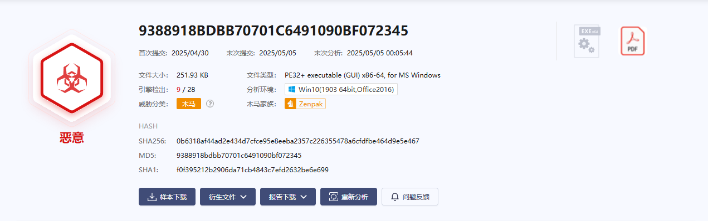

沙箱没有跑出相关的C2地址，如下所示：

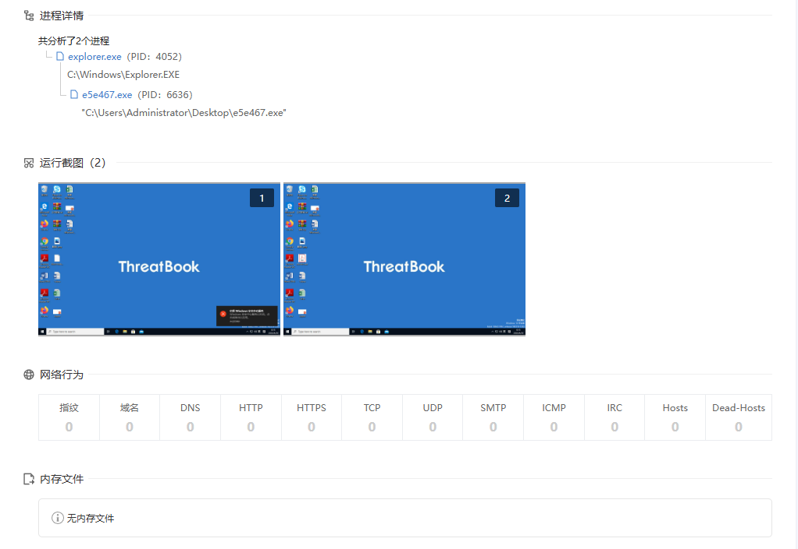

对于这种沙箱没有跑出C2的样本，笔者有空的时候都会人工分析一下看看，分享出来供大家参考学习。

​

# 样本分析

1.样本带有正常的数字签名，如下所示：

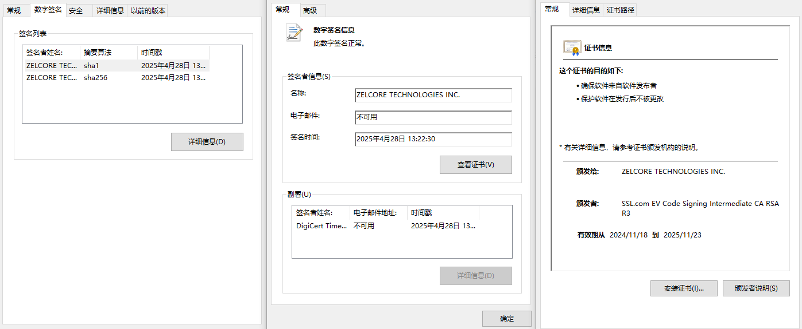

2.样本采用C/C++语言编写，编译时间为2025年4月28日，如下所示：

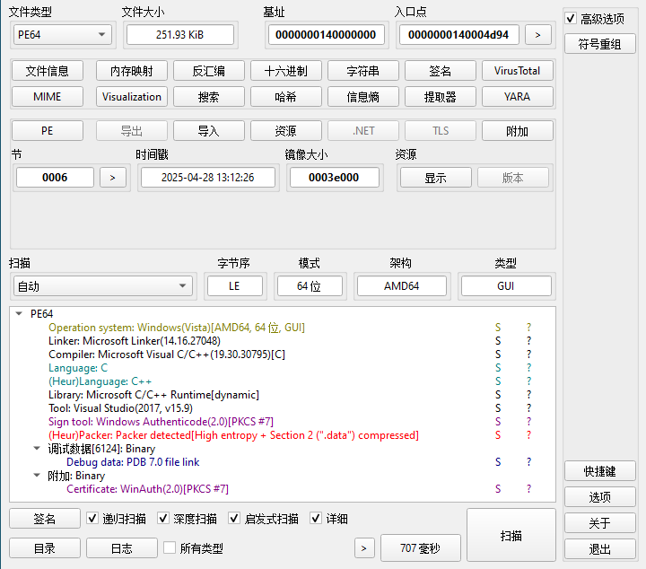

3.样本运行之后，如下所示：

4.判断是否使用管理员权限运行，如下所示：

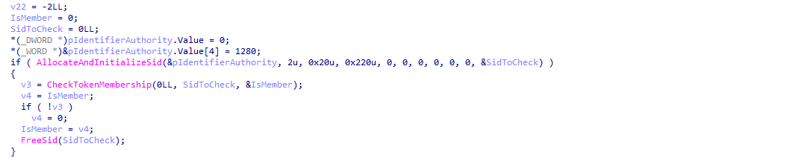

5.生成指定的恶意文件压缩包，如下所示：

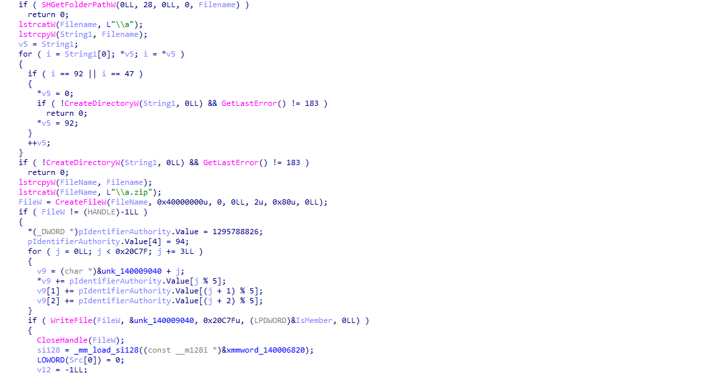

6.解压缩恶意文件压缩包之后，如下所示：

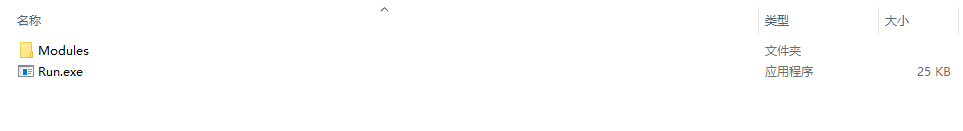

7.启动目录下的Run.exet恶意程序，如下所示：

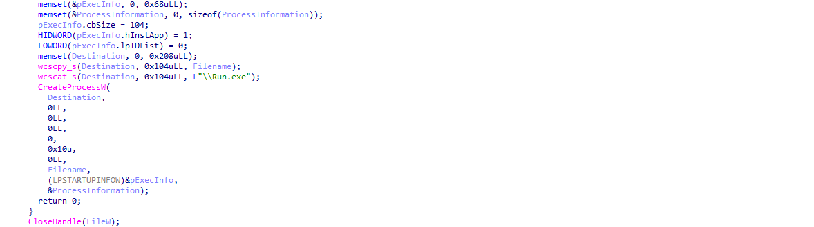

8.读取Modules目录下的dxpi.txt文件，如下所示：

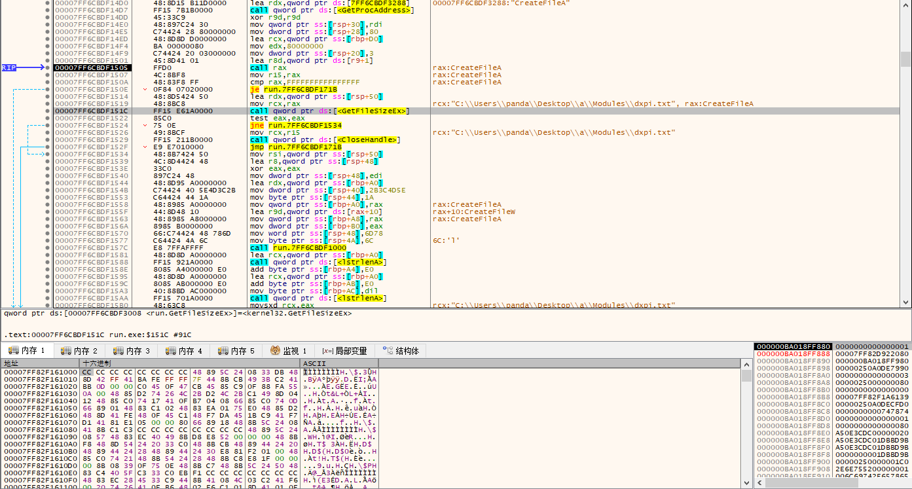

9.读取同目录下的collalautriv.xml文件获取VirtualAlloc函数名，再获取VirtualAlloc函数地址，如下所示：

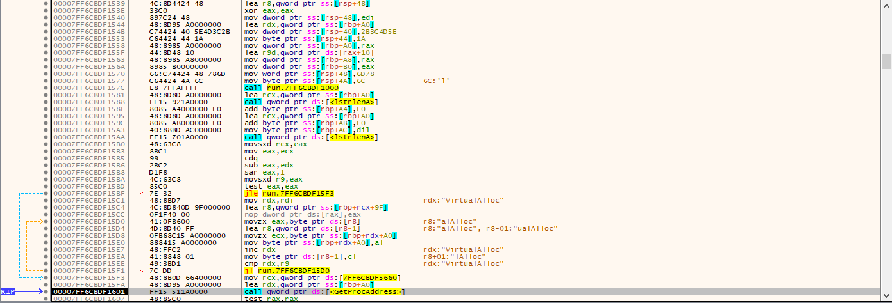

10.读取dxpi.txt文件加密数据到分配的内存空间，如下所示：

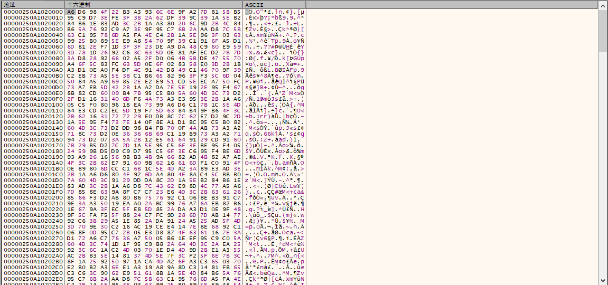

11.解密加密的数据，如下所示：

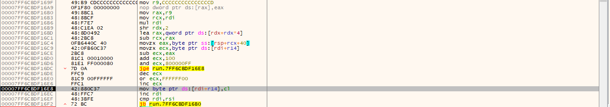

12.解密后的ShellCode代码，如下所示：

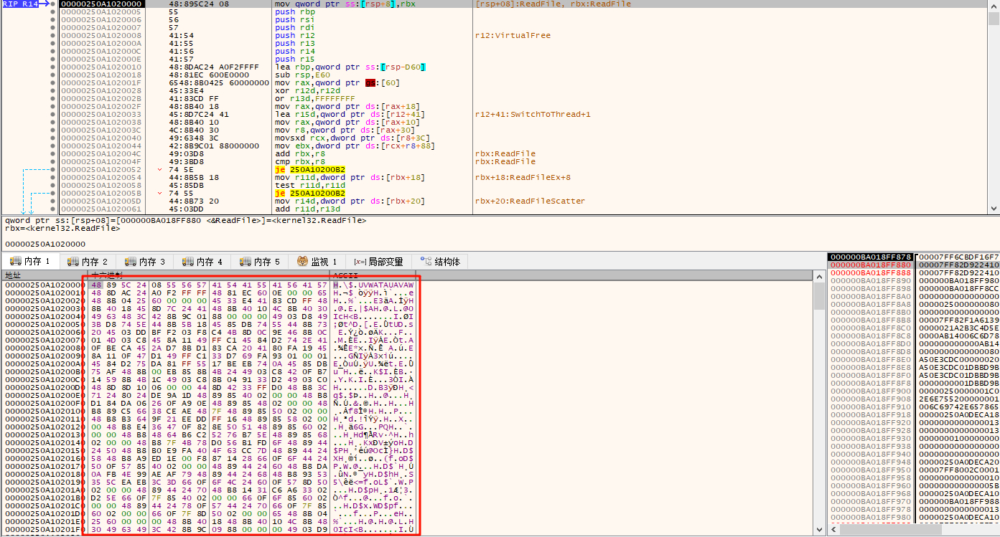

13.创建C:\Program Files (x86)\WindowsPowerShell\Update目录，如下所示：

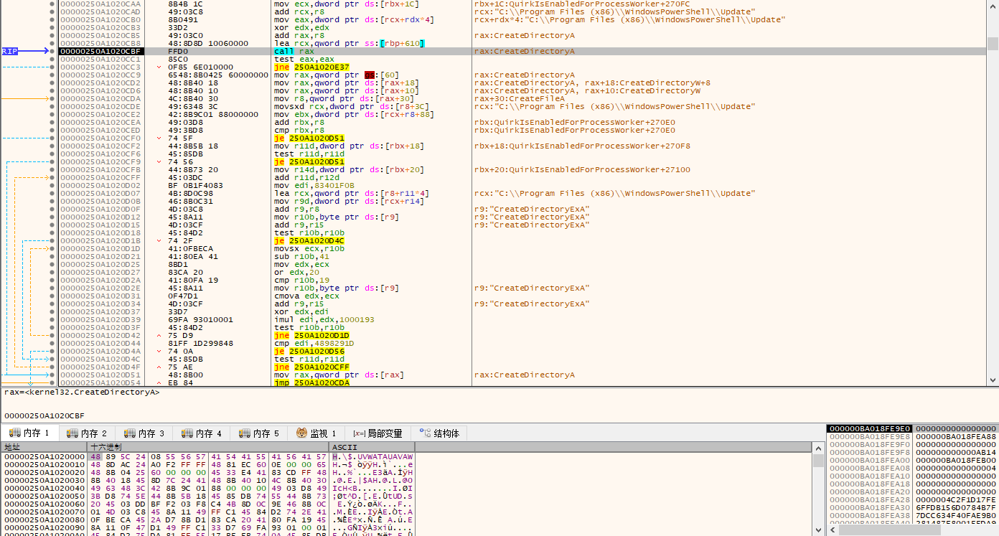

14.在创建的目录下生成恶意文件，如下所示：

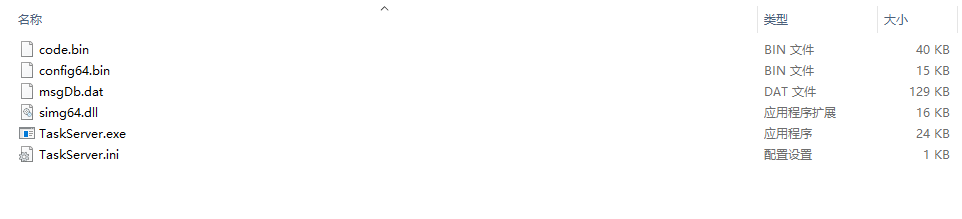

15.读取同目录下的TaskServer.ini配置文件内容，如下所示：

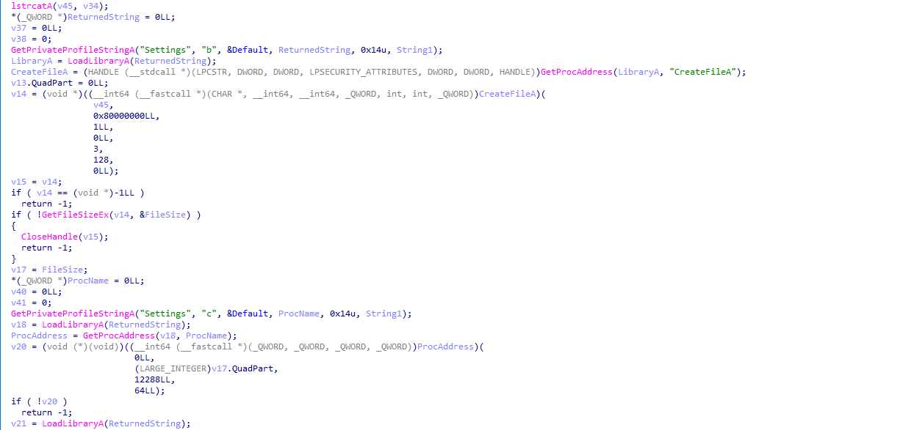

16.配置文件内容，如下所示：

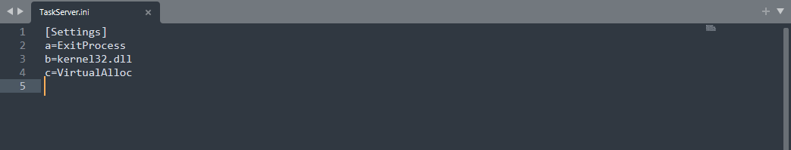

17.通过VirtualAlloc分配相应的内存空间，如下所示：

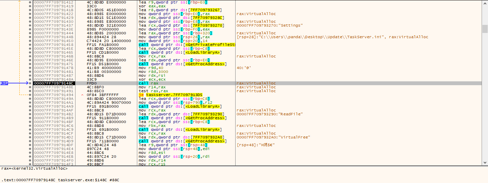

18.读取同目录下的msgDb.dat文件加密数据到分配的内存空间，如下所示：

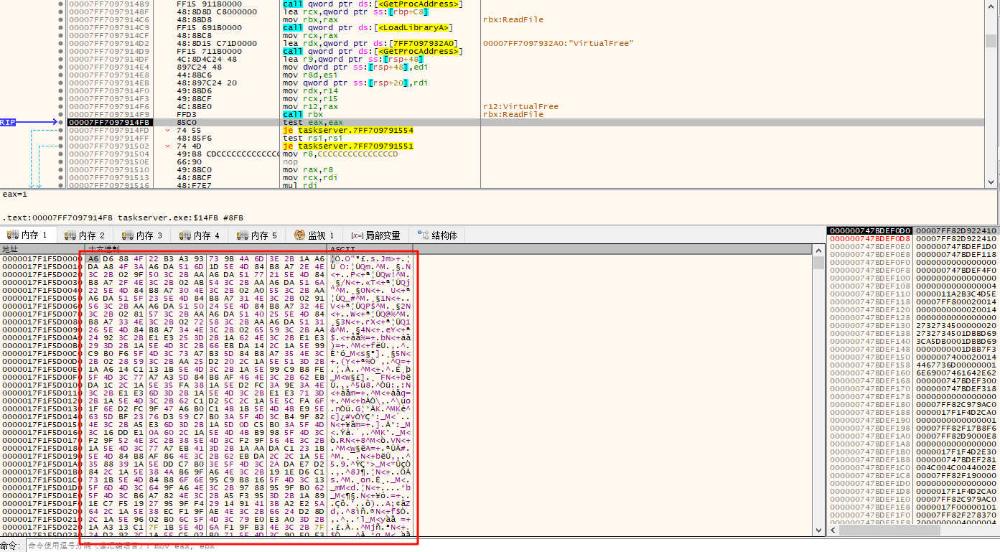

19.解密加密的数据，如下所示：

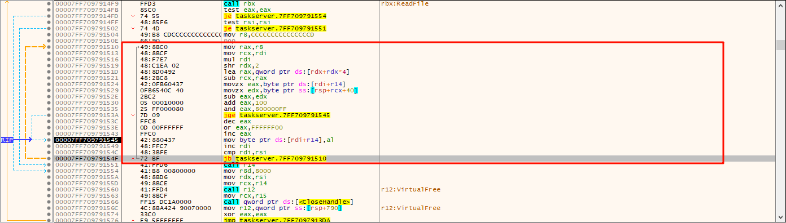

20.解密后的ShellCode代码，如下所示：

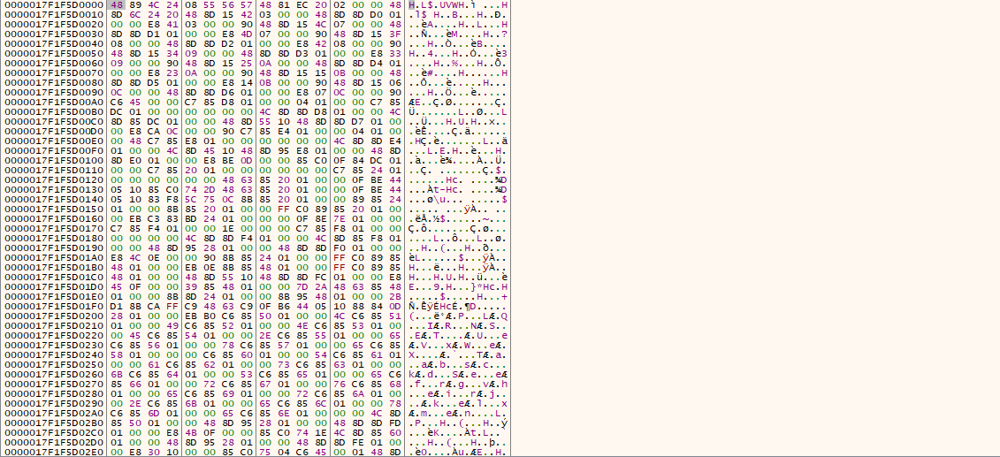

21.ShellCode代码，如下所示：

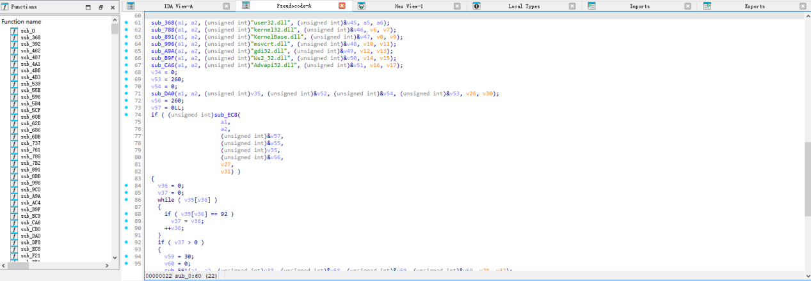

22.获取远程服务器C2地址，如下所示：

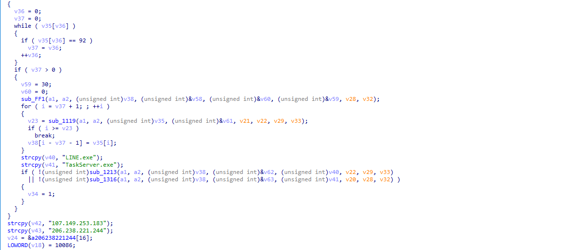

23.与远程服务器进行通信，如下所示：

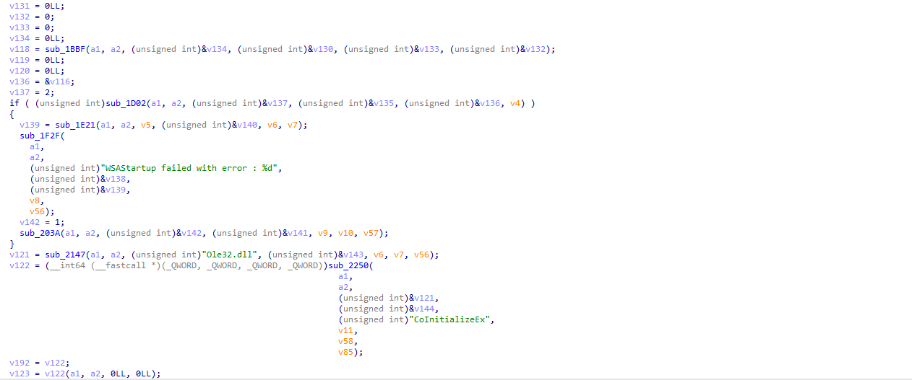

24.发送网络心跳包监控与远程服务器通信状态，如下所示：

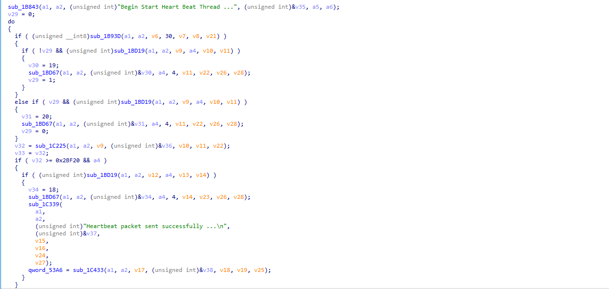

# 总结结尾

黑客组织利用各种恶意软件进行的各种攻击活动已经无处不在，防不胜防，很多系统可能已经被感染了各种恶意软件，全球各地每天都在发生各种恶意软件攻击活动，黑客组织一直在持续更新自己的攻击样本以及攻击技术，不断有企业被攻击，这些黑客组织从来没有停止过攻击活动，非常活跃，新的恶意软件层出不穷，旧的恶意软件又不断更新，需要时刻警惕，可能一不小心就被安装了某个恶意软件。

​

​
