# 五一腰疼出不去导致的edu证书站从lfi到控制台接管-先知社区

> **来源**: https://xz.aliyun.com/news/17949  
> **文章ID**: 17949

---

五一放假，因为最近腰不太好没法出去玩，所以在单位值班蹭电，边看小说边挖挖洞。

​

因为一直想要个edu的证书，所以中午先简单hunter找了几个src证书站，每个都逛一逛，翻了下js，再通过js关联到大学别的子域名资产，到处跳。

其中有个站点翻js有看到仨带api关键字的路径

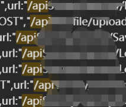

按习惯挨个扫描，得到其中一个接口路径下有api-doc。

导入到apifox，测接口，其中远程文件上传接口允许给一个文件的远程地址

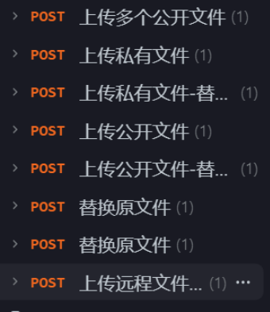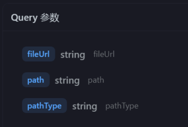

本能的直接尝试lfi下

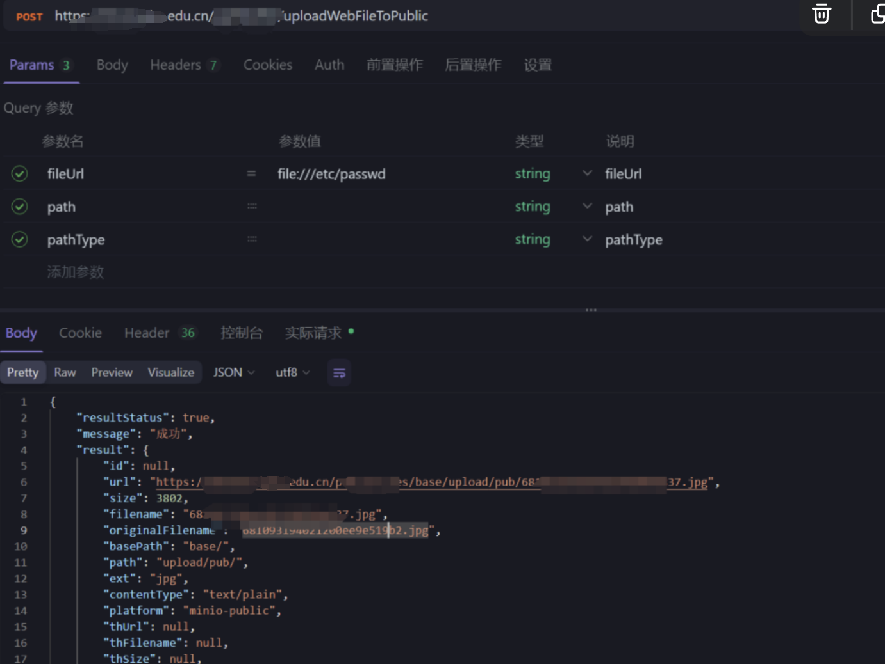

能看到，服务器抓取了内容，而后作为图片上传到了minio

这里访问图片地址获取文件内容，确认存在任意文件读取

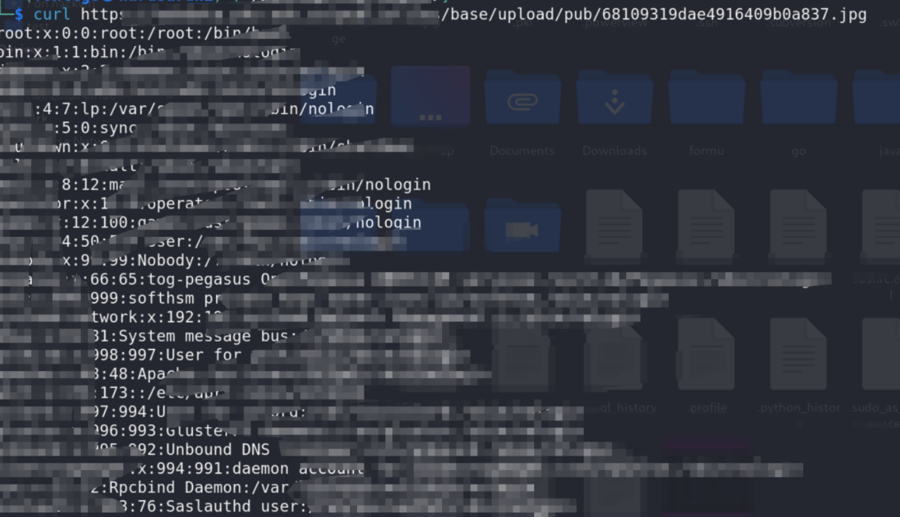

重复上面的操作，读再`/var/lib/mlocate/mlocate.db` 获取文件目录结构库

简单筛选一下 `mlocate.db` 目标文件结构的下相对高价值的信息

```
for i in `cat ~/tools/wordlist/mlocate/H_file`;do grep $i ./mlocate.db -A5;done|tee lk
```

跑了下发有 `nacos` ，从 `.properties` 文件找一下 `nacos` 等密码

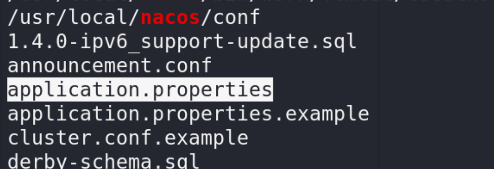  
获取 `nacos` 信息

翻了下几个 `.properties` 得到了俩 `nacos`的mysql密码

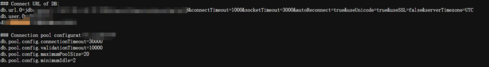

然后是Nacos密码，不过也是加密后的

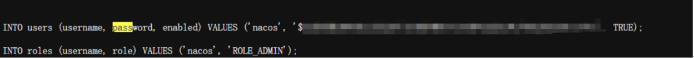

因为他这套 `nacos`库用的 `mysql`，所以直接找 `ibd`格式的 `nacos`数据库，通过读取nacos数据库获取数据库密码，说起来我记得之前别的项目还偶尔遇到过`db`格式的。

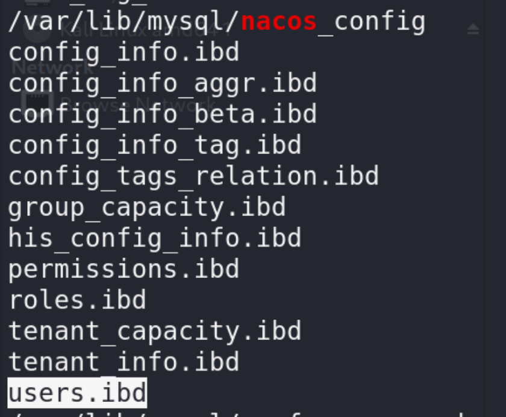

users.ibd 中存储着nacos平台上管理配置的服务所使用的用户名/密码

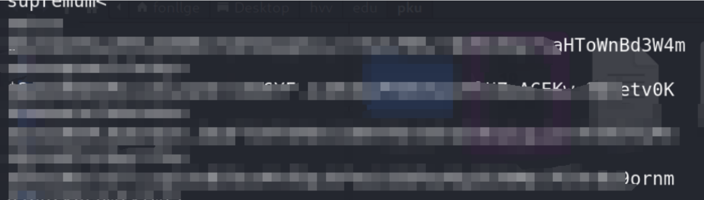

再读取 `/var/lib/mysql/nacos_config/config_info.ibd`，里面存储 `nacos`上的已配置的服务注册信息。

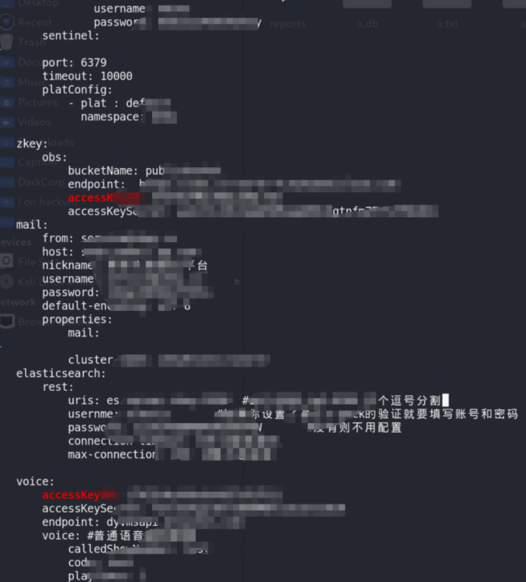  
通常来说这里会存有aksk等，这个案例也不例外，暴露了一个oss的aksk，也是上去看了下，key没过期。

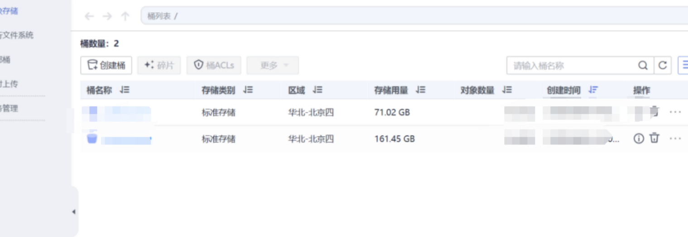

里面有敏感信息，所以就不放出来了

然后是学校公网的几个minio aksk，不过管理端点都放在了内网

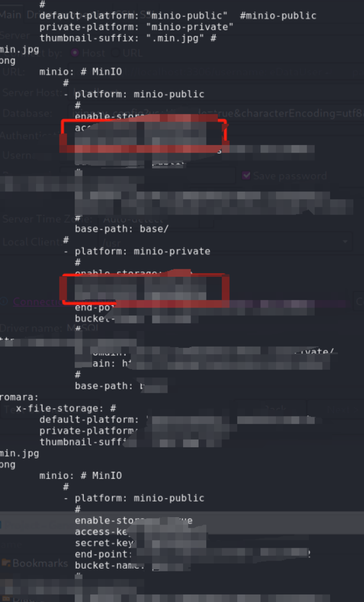

还有openai的key

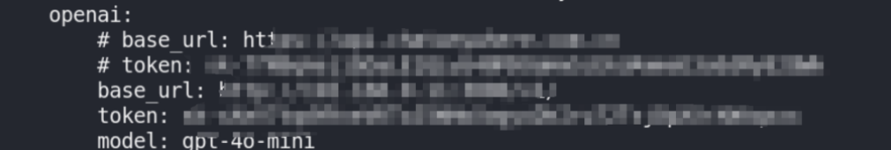

edu的mongodb

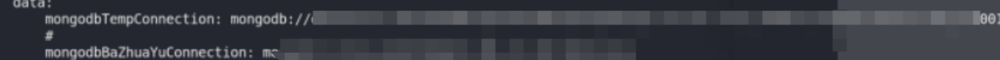

以及两个sms平台

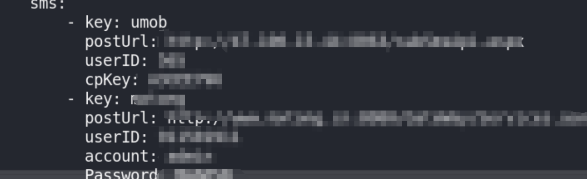

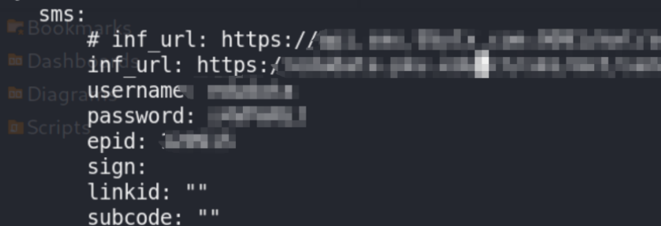

我寻思差不多这就够了高危，也没太好意思翻源码和 `mongo` 库，寻思简单混个高危能换证书就行了，然后下午交了报告。

本来当天下午交了报告之后就去打lol了，晚上和朋友简单复盘了下报告，朋友发现有报告里有aksk去试了下，发现oss的aksk是个高权账户，而且里面还有不少资产。

由于大乱斗输了一宿着实累了，所以我隔了一天才回来下发个子账户登陆华为云控制台看了下。

因为华为云我用的很少，这部分直接用cli做了，只列一下命令，回显就不放了。

导入aksk后，下发个账户，记住创建账户后的id

```
└─$ hcloud IAM KeystoneCreateUser  --user.password="Password@123_" --user.name="test"
```

列出组，得记下管理员组的id

```
└─$ hcloud IAM KeystoneListGroups 
```

把下发的用户加到管理组

```
└─$ hcloud IAM KeystoneAddUserToGroup --group_id="组id" --user_id="刚才的用户id"
```

这套操作控制台肯定会告警，但是也没研究过华为云咋绕告警，当天晚上neko葛葛说他去研究下咋绕，我负责直接白嫖。


查看租户名，其中返回的name就是租户名，登录要用。

```
└─$ hcloud IAM KeystoneListAuthDomains 
```

然后去华为云控制台，用租户名+创建的子账户登录即可  
（这里我第二天上去时候忘截图了，用的朋友当时晚上发我的图）

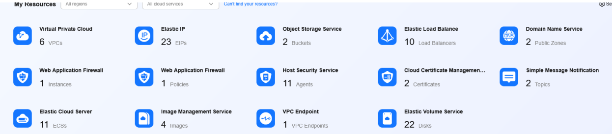

阿达西朋友雄鹰一样的资产呢.

到这里，有点怀疑入口机器是华为云的机器。

但用入口的lfi访问了下dnslog，看了下出口，确实是走的edu的出口ip。

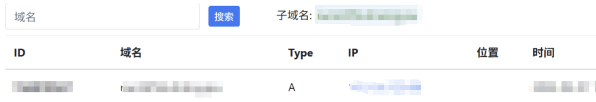

进一步确认下能否访问到元数据。

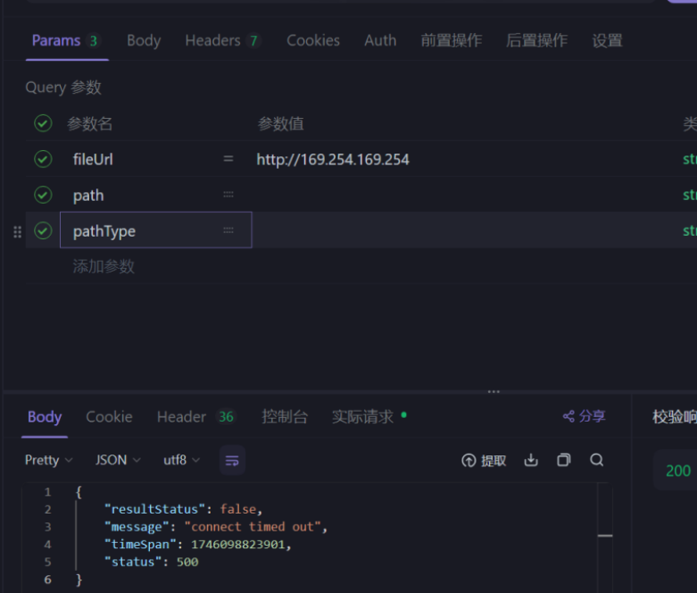

看起来8彳亍

现在感觉像做的混合云组网，因为从控制台看有 `mongo` 集群在华为云上，怀疑这台机器上的 `mongo`连的是云上的。而这台入口机器却在证书站自己内网里，当然也有可能云主机是云上的是别的业务。

​

结束了删一下刚创建的用户。

```
└─$ hcloud IAM KeystoneDeleteUser --user_id=子账户id
```

因为提交的报告比较早，所以报告里面没写云上这部分的资产，最终只拿了个高危

还是挺开心desu，严重就等下次放假8
