# 第十八届软件系统安全赛半决赛取证DC赛后复现WP-详细-先知社区

> **来源**: https://xz.aliyun.com/news/17950  
> **文章ID**: 17950

---

## 第十八届软件系统安全赛半决赛取证DC赛后复现WP-详细

这次线下，取证的题目是关于windows系统的，这方面的知识比较欠缺，借此题进行学习。

比赛给出了镜像挂载工具FTK Image和数据库文件查看工具ESEDatabaseView，还有三个镜像文件dc.ad1、dc.ad2、dc.ad3，DC取证题共4道。

### 1.小梁的域控机器被黑客攻击了，请你找出一些蛛丝马迹。攻击者通过AD CS提权至域管理员，在攻击过程中，攻击者使用有问题的证书模版注册了一张证书，该证书的证书模版名、证书序列号是什么？（格式为模版名-序列号，如CertTemplate-2f0000 00064287 f6f 5 d6ff4a91000000000006）

> 前置内容了解：
>
> Active Directory Certificate Services(AD CS)是微软Windows Server环境中的一个**服务器角色**，用于帮助组织**构建和管理内部公钥基础设施(PKI)**，以便**颁发、撤销和验证数字证书**，从而支持加密、身份验证和数字签名等安全需求。通过与Active Directory紧密集成，**AD CS可以实现证书的自动注册与分发**，并借助组策略简化大规模部署。
>
> **通过AD CS提权至域管理员**
>
> **CVE-2022-26923**：某低权限用户通过Web Enrollment接口无须适当验证即可申请到AD CS签发的域控证书，随即借助该证书获取高权限。

先使用FTK挂载镜像文件dc.ad1

根据题目内容，要去寻找相关的证书文件或日志

在Windows目录下看到了certocm.log文件

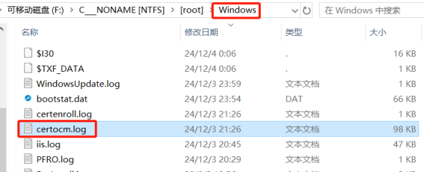

> Windows系统中，CertOCM.log是**Active Directory Certificate Services(AD CS)**安装与配置过程中生成的**设置日志文件**，主要用于记录证书服务角色**安装的详细步骤**、**成功**或**失败**信息，以及相关错误代码，帮助管理员在部署或排错时了解内部执行流程。

查看该文件，看到了很多的证书安装失败的记录日志

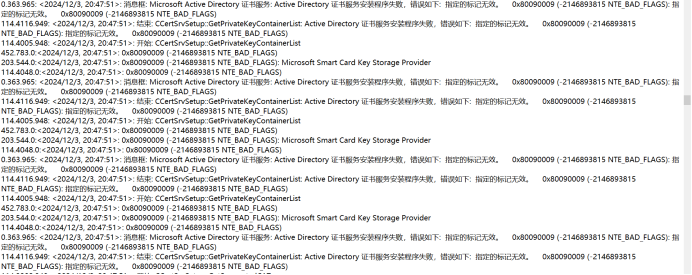

然后在日志的最后发现了可疑证书安装成功的记录，

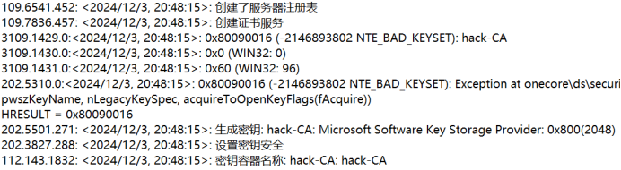

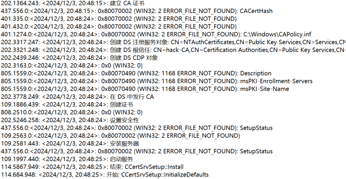

有可疑的名称字符串**hack-CA**

然后在该目录下搜索该名称

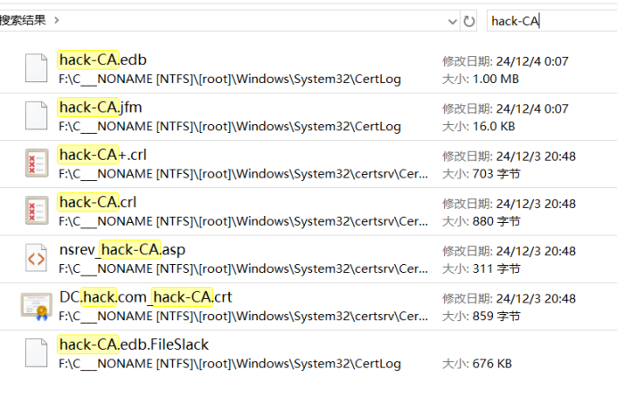

找到这么多文件

主要在两个路径下

WindowsSystem32CertLog

WindowsSystem32certsrvCertEnroll

> 在部署Active Directory Certificate Services(AD CS)时，系统会在%SystemRoot%System32下生成两个关键目录：
>
> CertLog：存放CA的**证书数据库**及**事务日志文件**，用于记录所有对数据库的写操作；
>
> CertEnroll（位于certsrvCertEnroll）：存放CA自动发布的证书（.crt）和撤销列表（.crl）文件，以及在Web注册或自动注册过程中生成的证书请求和响应。
>
> **CertLog目录主要内容**
>
> **证书数据库文件（****.edb****）**
>
> 默认会根据CA名称生成一个后缀为.edb的数据库文件，如Contoso Issuing CA 02.edb，该文件保存了已签发和已吊销证书、密钥存档以及证书请求等记录
>
> **事务日志文件（****edb\*.log****）**
>
> 目录下包含一系列名称形如edb00001.log至edbFFFFF.log的固定大小（通常 1MB）日志文件，用于快速写入数据库变更；当写满后依次创建新文件，最多可支持约1TB的日志空间
>
> **日志检查点文件（****edb.chk****）**
>
> edb.chk文件记录了数据库恢复时的日志应用检查点，保障数据库和日志的一致性
>
> **certsrvCertEnroll目录主要内容**
>
> **公共证书文件（****.crt****）**
>
> ADCS在签发或续订时，会将根CA与下级CA的证书导出为.crt文件，文件名常包含CA名称和时间戳，如corpCA1CA.crt
>
> **撤销列表文件（****.crl****）**
>
> 包括完整CRL（.crl）和可选的增量CRL（DeltaCRL），文件名同样带有CA名称和发布时间，用于CDP（CRL Distribution Point）通道分发，以便客户端进行证书吊销检查

进入CertLog目录

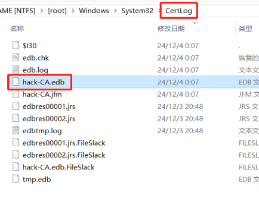

在CertLog里面发现了hack-CA.edb数据库文件

使用ESEDatabaseView工具查看hack-CA.edb文件，该工具赛前已经给出

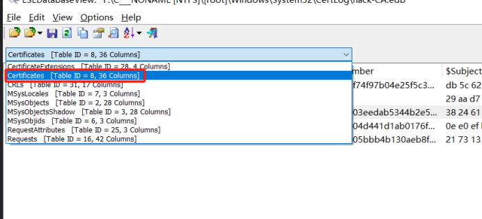

在第二个选项Certificates中，发现了证书模板和序列号

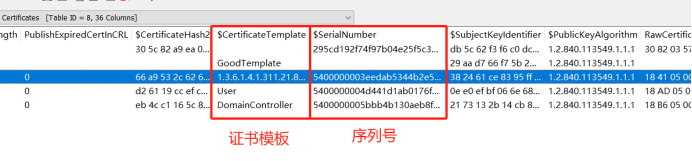

GoodTemplate这个证书模板比较可疑，但是没有序列号

继续查找

在倒数第二个选项RequestAttributes中

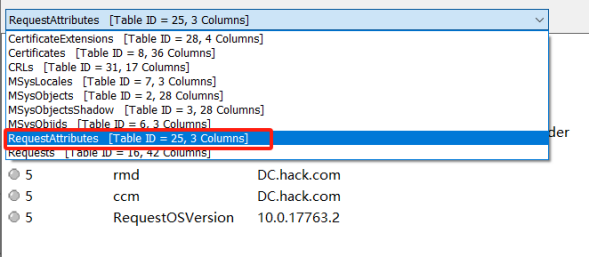

发现了一个刚刚在第二个选项Certificates中没有显示的证书模板MyTem

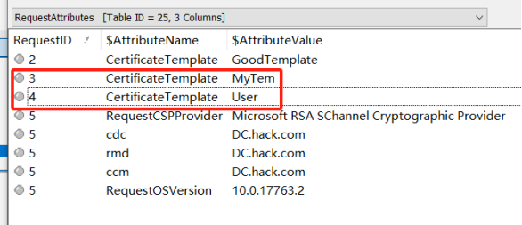

由于GoodTemplate这个证书模板没有序列号

所以主要查看MyTem这个证书模板，这里没有序列号的内容

刚刚在Certificates选项中，没有看到MyTem证书模板的名称，尝试根据MyTem的**RequestID=3**去查找，发现就是GoodTemplate下面这个证书，名称较长

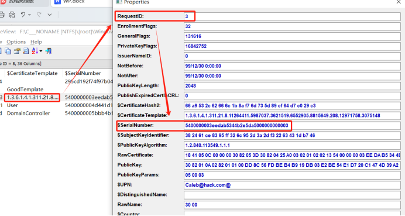

那么推测，MyTem就是有问题的证书模板，而使用该证书模板注册的新的证书就是1.3.6.1.4.1.311.21.8.11264411.5987037.3621519.6552905.8815649.208.12971758.3075148，新注册的证书的序列号是5400000003eedab5344b2e5da5000000000003

最终的flag就是MyTem-5400000003eedab5344b2e5da5000000000003

解决这个题的思路基本为：根据题目信息，先去查看证书日志文件（Windowscertocm.log），得到可疑名称hack-CA，然后通过该名称去查看证书数据库文件（WindowsSystem32CertLog）hack-CA.edb，最后从证书数据库文件hack-CA.edb中查询匹配到题目需要的内容。

### 2.小梁的域控机器被黑客攻击了，请你找出一些蛛丝马迹。攻击者在获取域管理员权限后，尝试上传木马文件，但是被杀毒软件查杀，上传的木马文件的绝对路径是什么？（如C:Windowscmd.exe）题目附件同DC-Forensics-1

根据题目内容“尝试上传**木马**文件，但是被**杀毒软件查杀**”，去查看**防火墙**的**事件日志**，去WindowsSystem32winevtLogs目录下

> Windows系统中，**C:WindowsSystem32winevt**是Windows**事件日志服务的主目录**，主要用于管理事件日志的存储和配置，而其中最**核心**的子目录是**Logs**，用于存放所有实际的日志文件。  
> Logs目录中包含大量以**.evtx**为扩展名的文件，这些文件采用专有的二进制格式存储事件记录，每个文件对应事件查看器（Event Viewer）中的一个日志通道，如 Application.evtx、System.evtx、Security.evtx 等。

然后根据防御的英文Defender，找含有Defender的.evtx文件，或者直接在该目录下搜索Defender，出现下面3个文件

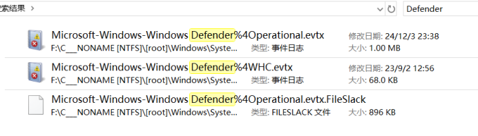

那么目标就是Microsoft-Windows-Windows Defender%4Operational.evtx这个文件

> Microsoft-Windows-Windows Defender%4Operational.evtx这个文件是Defender运行时的核心日志，涵盖扫描、检测、更新、网络保护、ASR规则执行及服务状态等多个维度的安全事件，对故障排查、安全审计和合规合规检查具有重要价值

直接使用本机的**事件查看器**打开会比较慢，先将这个文件**复制**到桌面，使用**fulleventlogview**工具单独打开该事件日志文件，这样速度会比较快。

打开文件后，发现了**1116**事件（检测到恶意文件），看到是**特洛伊木马**文件，对应的木马文件是e9caab4405a14fb6.exe

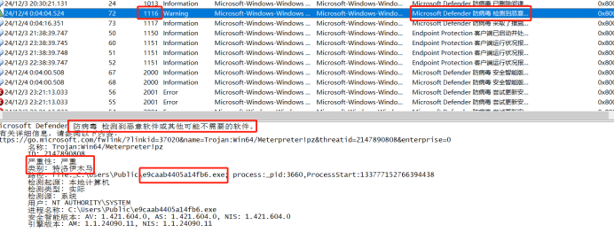

看到了**1117**事件（已阻止/隔离文件），将这个木马文件进行了隔离操作

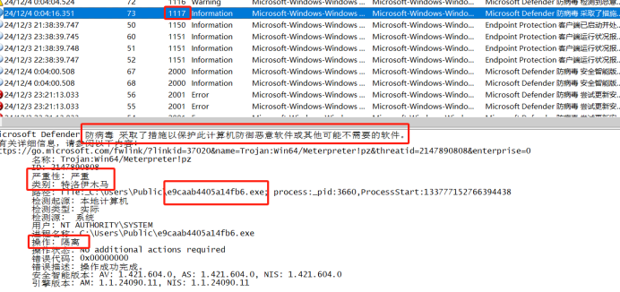

根据题目内容，需要的是木马文件的绝对路径

那么答案是：**C:UsersPublice9caab4405a14fb6.exe**

思路大概是根据题目的信息，系统中的**杀毒软件**检测到了这个木马并进行了操作。系统中的杀毒软件一般就是windows内置的**防火墙**了，去寻找防火墙相关的**事件日志**一般就可以了。

### 3.小梁的域控机器被黑客攻击了，请你找出一些蛛丝马迹。攻击者从机器中提取出了用户的连接其他机器的Windows企业凭据，凭据的连接IP、用户名、密码是什么？（格式为IP-用户名-密码，如127.0.0.1-sam-123456）题目附件同DC-Forensics-1

根据zeroc大佬WP的思路，是去寻找 **RDP** 相关的**凭据信息**。

不晓得大佬怎么想的，只能根据大佬的判断结果推理一下思路过程：那么猜测，根据题目信息，域控windows系统中，内置的连接其他主机的方法一般常见的有：远程桌面连接（RDP）、telnet，而telnet连接还需要使用**端口**，而题目只提到了**ip**，因此可能是使用**远程桌面连接**，这种方法使用远程主机的**ip、用户名、密码**，所需要的凭据也符合题目所需要的凭据信息。

> 在任何Windows机器（包括域控制器）上，通过“凭据管理器”保存的RDP凭据本质上都是以**DPAPI加密**的**“Blob”文件**形式。
>
> 默认写入本地用户配置文件下的%LOCALAPPDATA%MicrosoftCredentials文件夹；
>
> 而%APPDATA%RoamingMicrosoftCredentials仅在启用了凭据漫游（Crede
>
> ntial Roaming）功能时，才会将这些加密Blob同步到域中，以支持跨机器访问。
>
> DPAPI（Data Protection API）是Windows提供的一个简单密码学应用程序接口，用于对任意数据进行**对称加密**，尤其常用于保护**非对称私钥**等敏感信息。它**内置**于Windows 2000及更高版本操作系统中，无需开发者自行设计密钥生成和存储方案，即可调用系统 API 完成加密任务
>
> Blob是“Binary Large Object”或“Basic Large Object”的缩写，用于描述在数据库或文件系统中以**二进制方式**存储的大型、不易直接解析的数据单元。Blob（Binary/Large Object）是一个**通用概念**，用于表示“体积大、结构不定的二进制数据块”。

那么根据以上的内容，就需要去

UsersjohnAppDataRoamingMicrosoftCredentials

UsersjohnAppDataLocalMicrosoftCredentials

这两个目录下去寻找，那么两个路径都看看

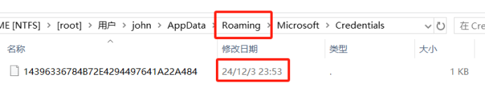

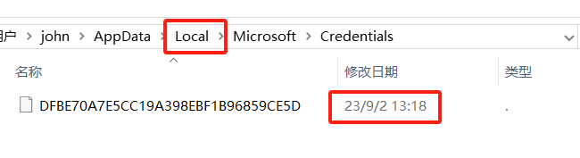

至于为什么是在john用户文件夹，是因为只有这个用户下的Credentials文件夹里面有文件，其他用户的Credentials文件夹里面都没有文件/(ㄒoㄒ)/~~

然后根据两个文件的修改日期，很明显是**24年12月份**的那个文件，也就是14396336784B72E4294497641A22A484这个Blob文件，因为在第1题和第2题中的文件修改日期都是24年12月份，那么**攻击者的入侵时间**大致也就是在**24年12月**份

然后由于找到的14396336784B72E4294497641A22A484这个Blob文件是使用**DPAPI 进行对称加密**的，要去找到使用的主密钥（Master Key）加密时使用的**对称加解密密钥 key**值，才能解密Blob文件，得到明文形式的凭据信息。

主密钥（Master Key）的信息以GUID的形式存储在Blob文件中

使用工具对Blob文件进行分析

zeroc大佬使用了两种工具进行了分析，分别是

impacket工具（https://github.com/fortra/impacket）和

mimikatz工具（https://github.com/gentilkiwi/mimikatz/）

我这里也学习模仿大佬使用两个工具分别进行分析，mimikatz下载即可直接使用，impacket工具下载后，先运行setup.py，然后即可开始使用（个人推荐mimikatz在windwos使用，impacket在linux使用）。

#### 使用mimikatz分析。

下载好压缩包后，解压进入自己系统对应的安装包，然后将14396336784B72E4294497641A22A484这个Blob文件复制到该目录下

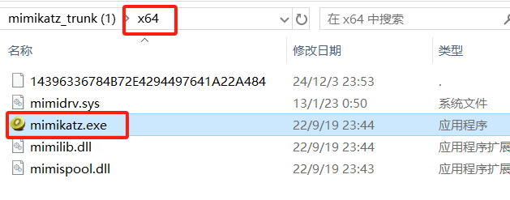

然后在命令行运行mimikatz.exe

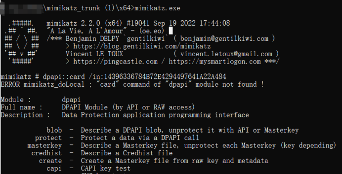

出现这个就是运行成功了

然后使用下面这个命令解析查看该Blob文件的主密钥（master key）的GUID

**dpapi::cred /in:14396336784B72E4294497641A22A484**

> dpapi::cred是mimikatz的一个功能模块，用于解密存储在本地的RDP 凭据、计划任务凭据、VPN 凭据等各种由Windows Credential Manager保护的凭证。
>
> 工作原理：mimikatz 会调用 DPAPI 接口（CryptUnprotectData）来使用当前登录用户的**主密钥（****Master Key****）**或通过**域备份密钥**来解密指定的Blob。
>
> /in:的作用大概相当于其他命令行工具的-f参数，也就是后面要指定需要解析的文件名，而在/in:后面指定的是Blob文件的GUID，也就是Blob文件的文件名

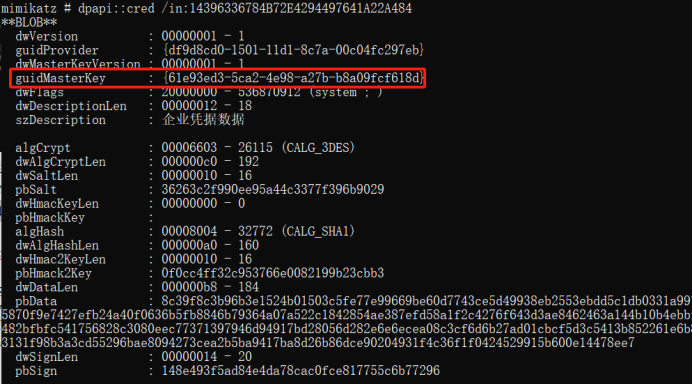

发现主密钥masterkey的GUID，即61e93ed3-5ca2-4e98-a27b-b8a09fcf618d

> 在Windows环境下，DPAPI加密文件使用的主密钥一般位于%APPDATA%MicrosoftProtectSIDMasterKeyGUID或系统目录中，文件名即为GUID

在UsersjohnAppDataRoamingMicrosoftProtectS-1-5-21-1507239155-486581747-1996177333-1000

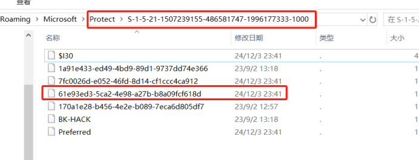

找到主密钥masterkey文件，将该密钥文件同样放到mimikatz.exe的文件夹中

使用命令

**dpapi::masterkey /in:61e93ed3-5ca2-4e98-a27b-b8a09fcf618d**

> 这条命令的作用是让Mimikatz加载并尝试解密指定用户的DPAPI主密钥（Master Key）文件，输出解密后的会话密钥等信息，以便后续解密由该主密钥加密的DPAPI数据

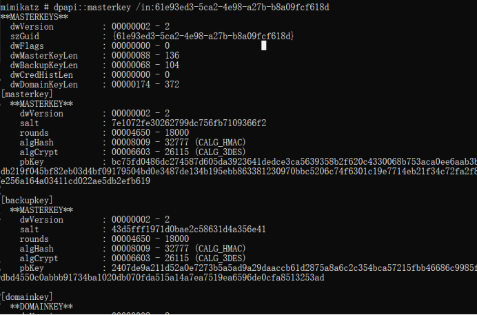

但是在结果中并没有给出主密钥中加密使用的**对称加解密密钥 key**值，为什么?

**zeroc大佬给出了方法：**

**与机器本地用户对** **masterkey file** **进行解密的方法不同，域用户需要使用** **DC backup key** **来对** **masterkey file** **进行解密，然后在使用** **masterkey** **解密对应加密后的凭证文件**

使用AI解释了一下大佬的话

> 使用**域用户**（Domain User）解密DPAPI的MasterKey文件时，需要依赖**域控制器**（DC）上的**备份密钥**（Domain Backup Key），而在**本地用户**（Local User）场景中则**无需如此**。
>
> **域环境**下，DPAPI（Data Protection API）为每个用户生成的MasterKey文件，除了使用用户密码派生的密钥进行加密外，还会使用“**域备份密钥**”（DPAPI Domain Backup Key）进行**二次加密并存储**，以应对密码重置或漫游场景；而**本地用户**的MasterKey文件**仅依赖**于**本地密码派生密钥**进行加解密，不涉及集中式恢复机制。

理一下思路：Windows DPAPI在**域环境**中为**每个用户**生成的**主密钥**（Master Key）包含**两部分**，一是**用户密码派生密钥**，用于**对主密钥**进行**正常的加解密**，二是**域级备份密钥**，用于用户密码**丢失**时来**对主密钥进行加解密**。

那么对于**攻击者**而言，用户密码肯定是不知道的，那么就要去想办法**得到域级备份密钥**来**对主密钥进行解密**，然后才能使**用主密钥解密**RDP凭据文件获得凭据信息。

那么如何得到**域级备份密钥**呢?

**域级备份密钥**的**公私钥对**存储在Active Directory的**ntds.dit**（WindowsNTDS）数据库中，而**私钥本身**又被一个称为**BootKey**（SysKey）的**对称密钥**加密。

那么要想得到**域级备份密钥**，先要得到**BootKey对称密钥**，然后**解密ntds.dit**得到**域级备份密钥**的**私钥**，然后使用这个私钥去**解密主密钥（Master Key）**，得到**对称加解密密钥key**，最后使用这个key解密RDP凭据文件获得凭据信息。

先去获得**BootKey**

**BootKey**来源于域控制器的**SYSTEM**注册表配置单元，通过导出DC的SAM和SYSTEM hive，并使用工具secretsdump.py提取BootKey

**SAM**（Security Account Manager）存储本地账户的凭据哈希，位于C:WindowsSystem32configSAM，用于本地登录验证

**SYSTEM**包含系统配置和秘密，用于保护其他hive（包括 SAM）的BootKey，位 C:WindowsSystem32configSYSTEM

去C:WindowsSystem32config下面找到这两个文件

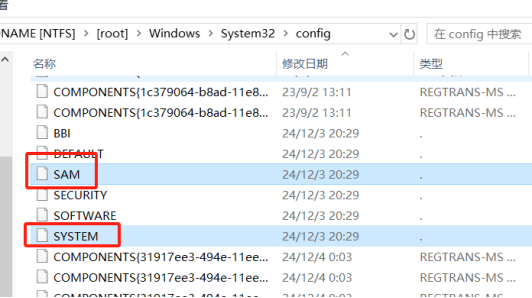

将SAM和SYSTEM复制到impacket/examples中

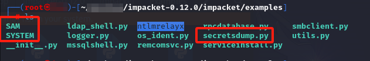

在impacket/examples目录下使用命令

**secretsdump.py -sam SAM -system SYSTEM LOCAL**

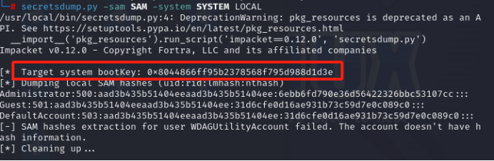

提取得到bootKey的值0x8044866ff95b2378568f795d988d1d3e

然后使用bootKey**解密ntds.dit**得到**域级备份密钥**的**私钥**

> **ntds.dit**是Active Directory的Extensible Storage Engine(ESE)数据库文件，通常位于C:WindowsNTDS tds.dit，存放所有AD对象，包括域级DPAPI备份密钥对象

在WindowsNTDS下面找到ntds.dit文件

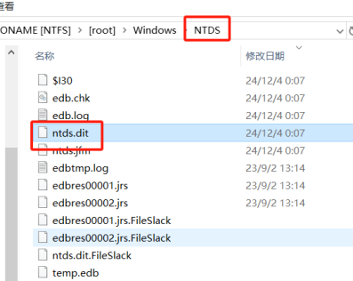

之后要用DSInternals工具的Get-ADDBBackupKey模块去使用bootKey**解密ntds.dit**得到**域级备份密钥**的**私钥文件（.pvk）**

​

先安装DSInternals，在powershell中安装DSInternals（https://github.com/MichaelGrafnetter/DSInternals）

以管理员运行powershell，然后执行命令Install-Module DSInternals -Force来安装DSInternals，第一次安装会提示先安装nuget，输入Y即可

​

在powershell中执行命令**Get-ADDBBackupKey -DBPath . tds.dit -BootKey 8044866ff95b2378568f795d988d1d3e | Save-DPAPIBlob -DirectoryPath .**

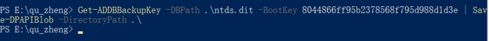

若执行失败，修改执行策略

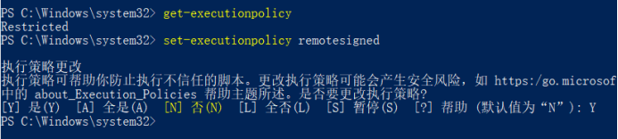

​

再次执行命令，在执行目录下生成四个文件

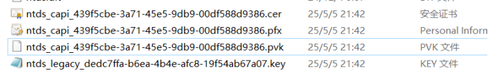

**.pvk**文件即为**域级备份密钥**的**私钥文件**

将.pvk文件复制到mimikatz.exe的文件夹中

运行命令

**dpapi::masterkey /in:61e93ed3-5ca2-4e98-a27b-b8a09fcf618d /pvk:ntds\_capi\_439f5cbe-3a71-45e5-9db9-00df588d9386.pvk**

解密主密钥master key得到**对称加解密密钥 key**

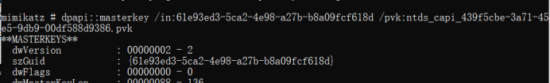

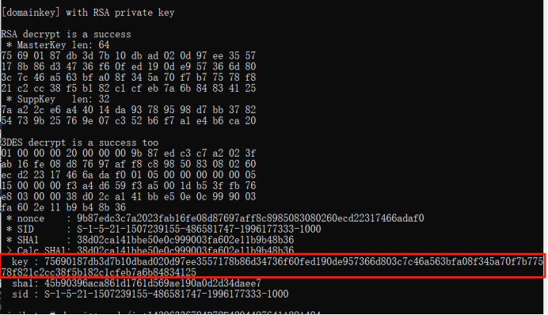

得到**对称加解密密钥key**:75690187db3d7b10dbad020d97ee3557178b86d34736f60fed190de957366d803c7c46a563bfa08f345a70f7b77578f821c2cc38f5b182c1cfeb7a6b84834125

这个**对称加解密密钥key**已经加载到内存中了，会自动对匹配的凭证文件进行解密

那么再次运行命令**dpapi::cred /in:14396336784B72E4294497641A22A484**

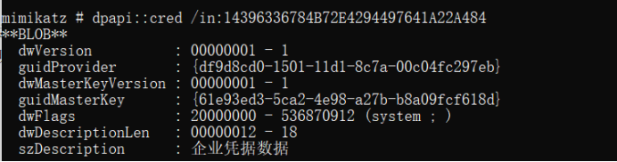

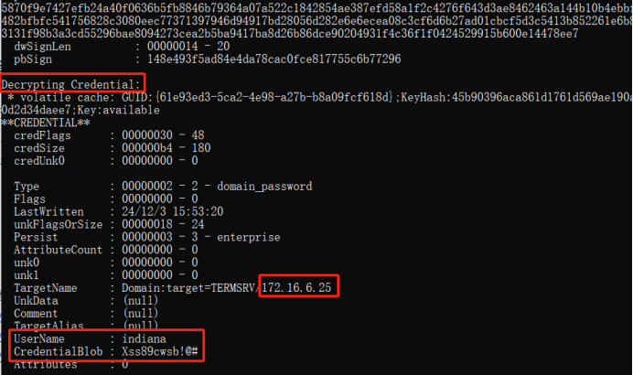

即可解密RDP凭证得到明文信息用户名、密码以及ip

得出答案172.16.6.25-indiana-Xss89cwsb!@#

#### 使用impacket工具分析

同样已经知道了加密的RDP凭据文件14396336784B72E4294497641A22A484

将这个文件复制到impacket目录下

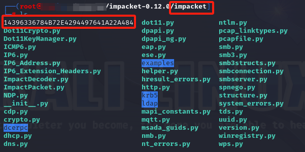

使用命令解析查看该加密文件的主密钥（master key）的GUID

**dpapi.py credential -file 14396336784B72E4294497641A22A484**

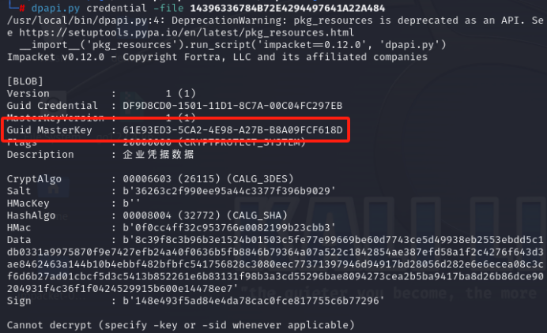

得到masterkey的GUID，即61e93ed3-5ca2-4e98-a27b-b8a09fcf618d

下面根据这个GUID去找主密钥文件，在UsersjohnAppDataRoamingMicrosoft

ProtectS-1-5-21-1507239155-486581747-1996177333-1000下

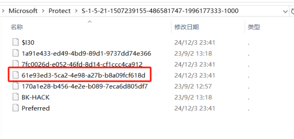

同样将这个文件复制到impacket目录下

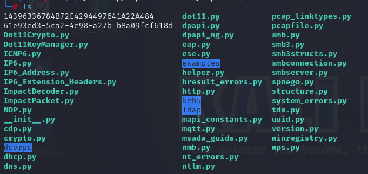

使用命令**dpapi.py masterkey -file 61e93ed3-5ca2-4e98-a27b-b8a09fcf618d**解析该文件

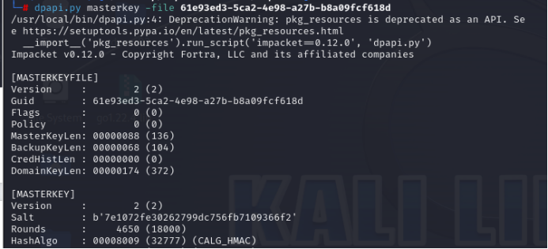

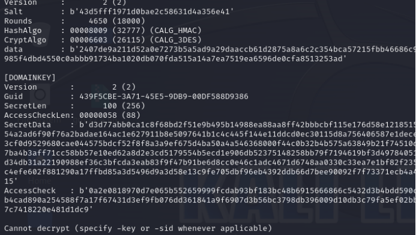

同样解析不出东西，且最后输出了Cannot decrypt不能解密

同样走之前的思路，同样的流程

先从**SAM和SYSTEM**文件中提取 **BootKey**，即**对称加密密钥**

然后再根据**ntds.dit**文件和**BootKey**，使用DSInternals工具的**Get-ADDBBackup**

**Key**模块解密得到**.pvk私钥文件**。

无论是impacket工具还是mimikatz工具分析都要走这两步

先将SAM和SYSTEM文件复制到impacket/examples目录下

使用命令**secretsdump.py -sam SAM -system SYSTEM LOCAL**得到bootKey的值，即0x8044866ff95b2378568f795d988d1d3e

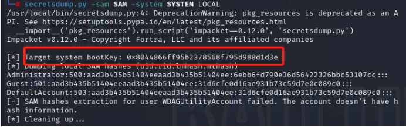

然后在powershell中，使用ntds.dit文件和BootKey解密得到.pvk私钥文件

在powershell中执行命令**Get-ADDBBackupKey -DBPath . tds.dit -BootKey 8044866ff95b2378568f795d988d1d3e | Save-DPAPIBlob -DirectoryPath .**

​

得到4个文件

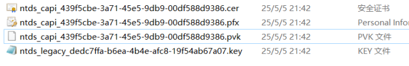

然后将.pvk私钥文件复制到impacket目录下

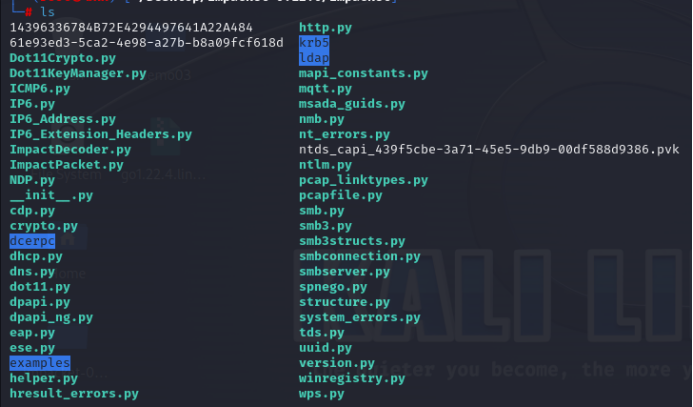

使用命令**dpapi.py masterkey -file 61e93ed3-5ca2-4e98-a27b-b8a09fcf618d -pvk hiv/ntds\_capi\_439f5cbe-3a71-45e5-9db9-00df588d9386.pvk**解密主密钥master key文件得到**对称加解密密钥 key**，即75690187db3d7b10dbad020d97

ee3557178b86d34736f60fed190de957366d803c7c46a563bfa08f345a70f7b77578f821c2cc38f5b182c1cfeb7a6b84834125

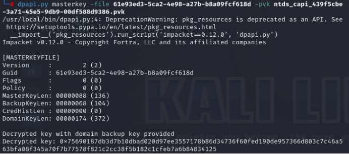

最后输入命令，使用对称的**对称加解密密钥 key**解密 RDP凭据

**dpapi.py credential -file 14396336784B72E4294497641A22A484 -key 0x75690187db3d7b10dbad020d97ee3557178b86d34736f60fed190de957366d803c7c46a563bfa08f345a70f7b77578f821c2cc38f5b182c1cfeb7a6b84834125**

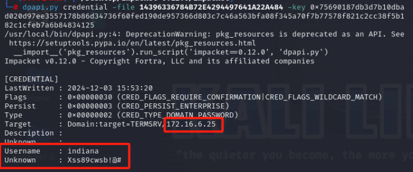

得到用户名、密码以及ip

得出答案**172.16.6.25-indiana-Xss89cwsb!@#**

第3题含有的信息量还是很大的，第一次接触这种题，前后梳理了很多遍，用一个流程图总结一下整体获取用户名、密码以及ip的过程

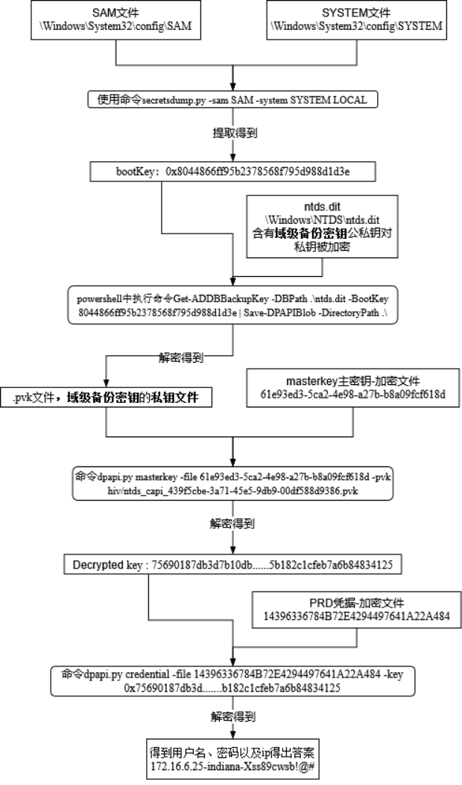

执行了3次解密操作才得到明文RDP凭据。包含了对称解密以及私钥解密。windows实在是有些稳健，但是对于域控环境的用户来说，还是存在被破解的风险，感觉要是防范的话，得对域用户可以访问的文件进行限制，这样应该可以防止域备份密钥的泄露。（简单思考，如有错误，恳请指正）

### 4.小梁的域控机器被黑客攻击了，请你找出一些蛛丝马迹。攻击者创建了一个新用户组和一个新用户，并把这个用户加入了新用户组和域管理员组中，新用户组名、新用户的用户名、新用户的密码是什么？（用户组名和用户名均小写，格式为用户组名-用户名-密码，如admins-sam-123456）题目附件同DC-Forensics-1

> 在Windows系统中（从Vista/Server2008起），所有**安全审计**相关的事件，包括“**创建新用户**”与“**创建新用户组**”都会记录在安全日志（Security Log）中，而该日志对应的文件名为**Security.evtx**，存放于%SystemRoot%System32winevtLogs目录下。该文件包含用户与组的创建时间、发起者等详细信息。

到WindowsSystem32winevtLogs目录下找到Security.evtx文件

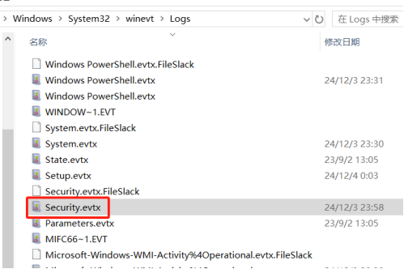

复制到桌面，用fulleventlogview打开

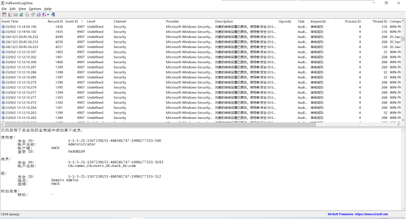

内容太多了，过滤一下，只显示**24年12月**份的记录

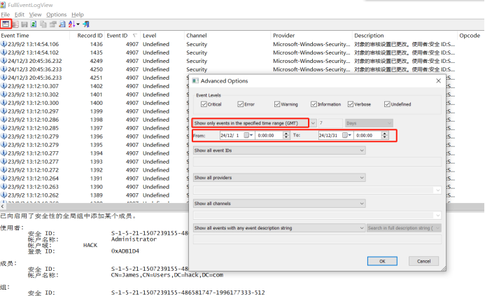

过滤后

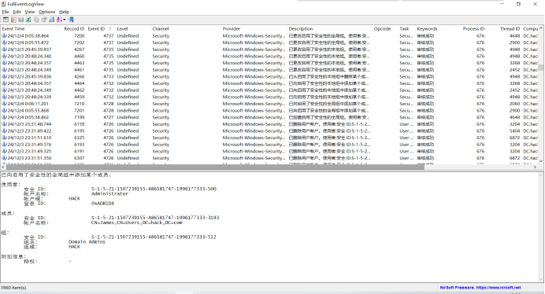

少了很多

根据事件ID排序一下，找**创建新用户组（4727）**、**创建新用户（4720）**、**添加用户到用户组（4728）**的记录

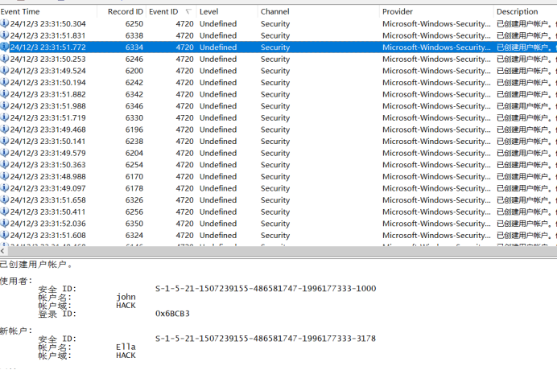

看到创建了很多的新用户

又删除了很多的新用户

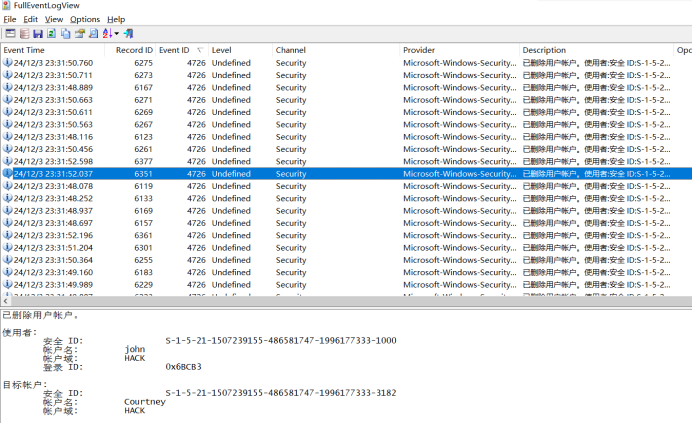

再翻翻，看到只创建了一个**新用户组maintainer**

然后添加用户到用户组的记录有两条

这条是添加了用户**James**到域管理员组Domain Admins

这条是添加了用户**James**到新用户组maintainer

并且翻看创建新用户的记录

**James**是创建的新用户

根据题目信息，**新用户组**是**maintainer**，**新用户**是**James**

下面找**新用户James**的**密码**

windows系统中，ntds.dit存储了域中所有用户和计算机对象的详细信息，其中包括经过**加密的密码哈希**，ntds.dit是 Active Directory 域控制器上的数据库文件。

SYSTEM 注册表文件则包含了用于**加密和解密**这些哈希的**系统密钥**

获取这两个文件后，就可以使用Impacket 的 **secretsdump.py提取**出域用户的用户名和对应的**密码哈希值**，然后使用**john爆破**哈希值得到**明文密码**

ntds.dit一般位于WindowsNTDS tds.dit

SYSTEM 注册表文件一般位于WindowsSystem32config

复制这两个文件到impacket/examples目录下

执行命令**secretsdump.py -ntds ntds.dit -system SYSTEM LOCAL**

得到用户名和密码的hash值

将这些用户名和hash条目复制到一个空的txt文件中

使用命令**john -format=NT --wordlist=/usr/share/wordlists/rockyou.txt hash.txt**

在后面爆出了James的密码

得到最终的答案**maintainer-James-3011liverpool!**

### 总结

特别感谢zeroc 大佬的博客，为学习指明了方向。第一道题学习了windows系统中对**证书数据库**以及**证书文件内容**的解析；第二道题学习了windows系统中关于**防火墙事件日志**的分析；第三道题学习了windows系统中对**RDP凭据的解密**的操作；第四道题学习了对windows系统中**用户及用户组创建的事件日志**，**密码hash值的爆破**。总体来看，难度应该是**3>4>2>1**，第三题是真滴复杂啊ヽ(\*。>Д<)o゜。

本人新手村成员，文章内容含有诸多不足和错误之处，请各位大佬指正(๑•̀ㅂ•́)و✧

主要参考文章

https://blog.zeroc0077.cn/software2025-writeup/#dc-forensics

https://www.cnblogs.com/start1/p/18831791

https://xz.aliyun.com/news/17408

https://www.cnblogs.com/Small-Dragon/p/18808226

https://oceanzbz.github.io/2025/03/24/CTF/WP/%E8%BD%AF%E4%BB%B6%E7%B3%BB%E7%BB%9F%E5%AE%89%E5%85%A8%E6%94%BB%E9%98%B2%E5%8D%8A%E5%86%B3%E8%B5%9BWp/#Misc-%E5%8F%96%E8%AF%811

题目附件可以在玄机靶场获取https://xj.edisec.net/challenges/126
