# Cdp协议深度应用Web渗透加解密（小白版）-先知社区

> **来源**: https://xz.aliyun.com/news/17952  
> **文章ID**: 17952

---

练手地址：<https://github.com/0ctDay/encrypt-decrypt-vuls>

原创项目：<https://github.com/Nstkm001/CDP_test>

# 项目基本使用​

准备环境：node.js + python + chrome

```
npm install chrome-remote-interface
pip install playwright
playwright install chromium
pip install mitmproxy
...............
```

第一步启动cdp.js。

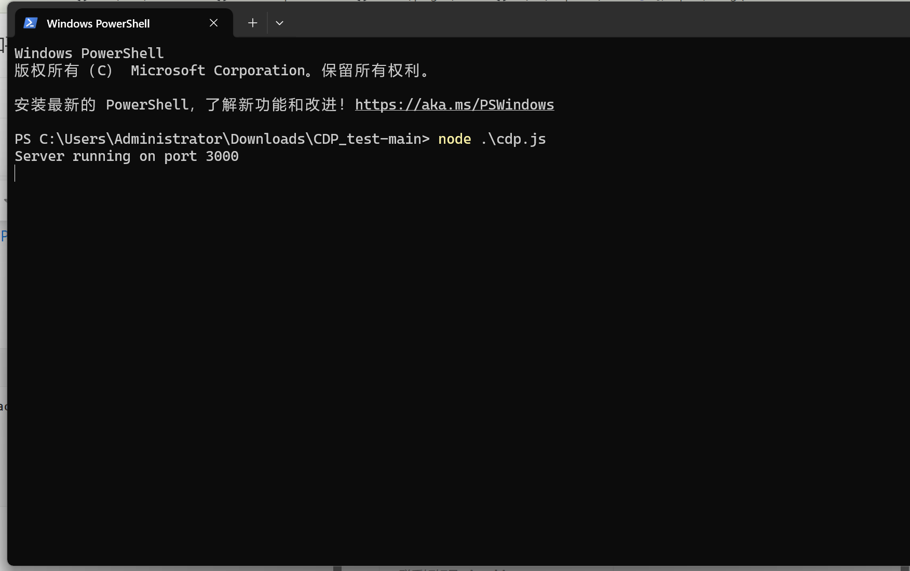

第二步使用python .\cdp\_load.py <http://39.98.108.20:8085/#/login>，连接cdp，此时会有两个本地接口发送至burp。

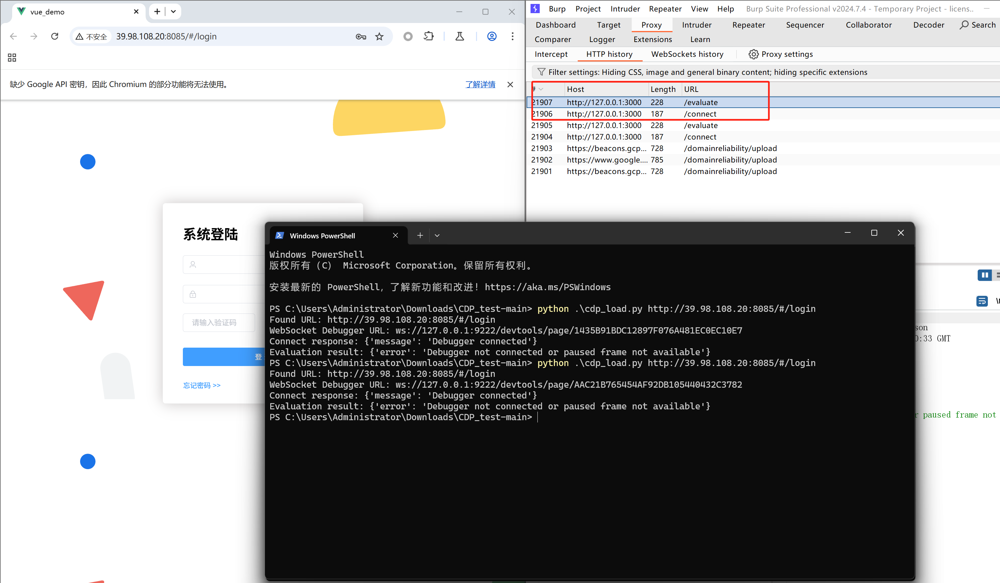

第三步找到加密点，这一章节去看别的文章即可，积累经验。

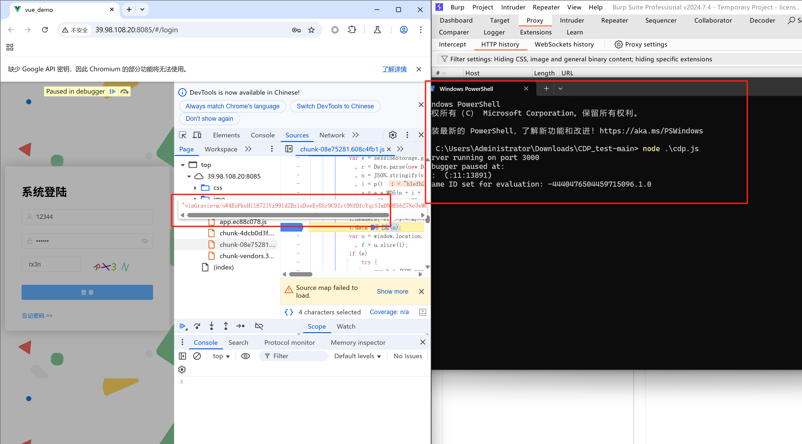

第四步调试本地加解密以及timestamp、requestId、sign接口。

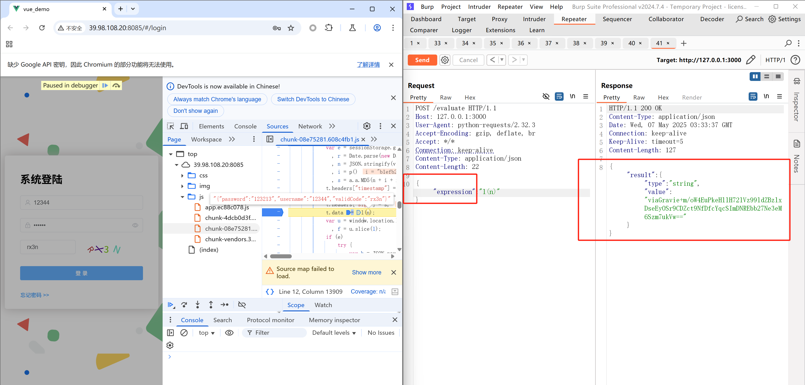

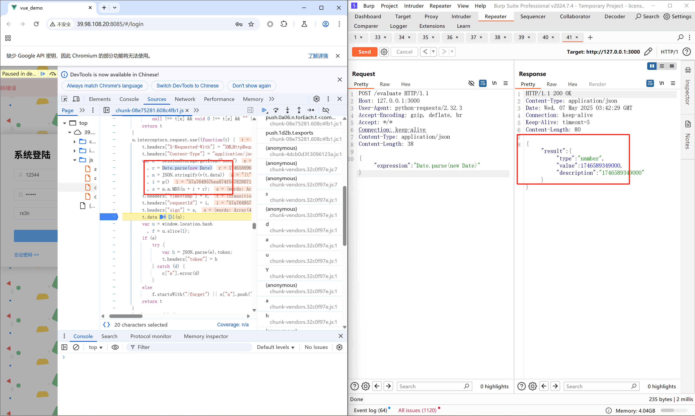

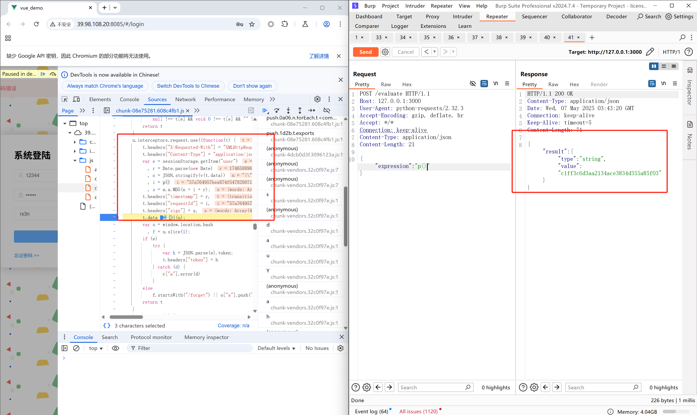

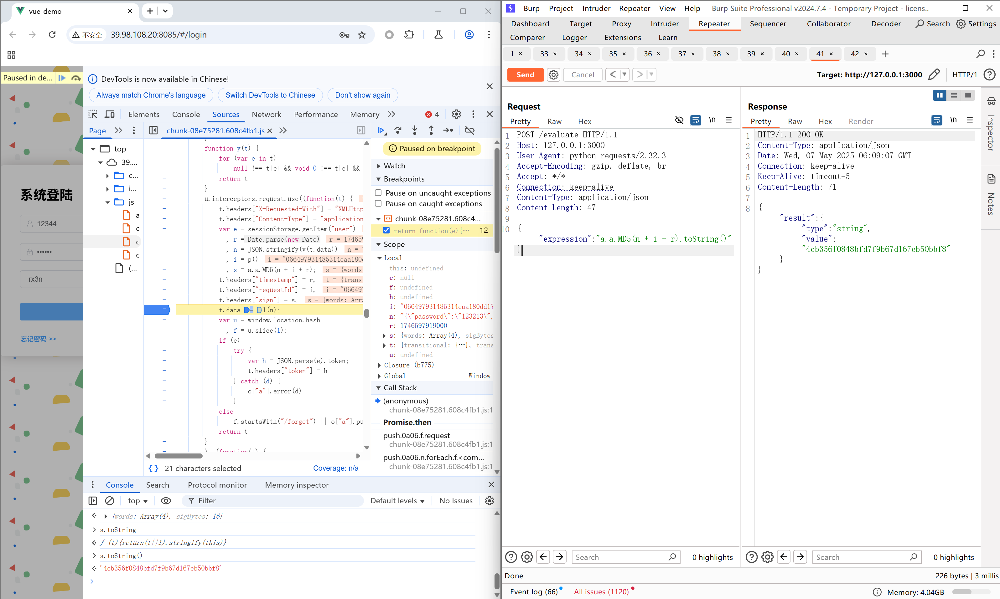

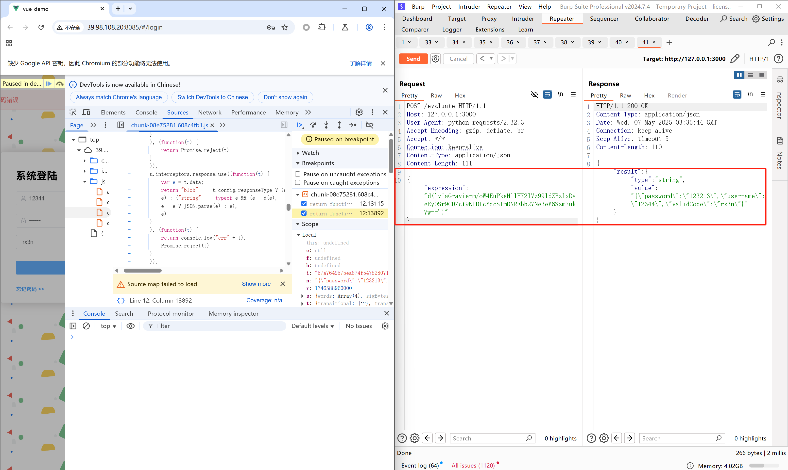

第五步构造原汁原味的mitmproxy接口与本地加解密接口通信。

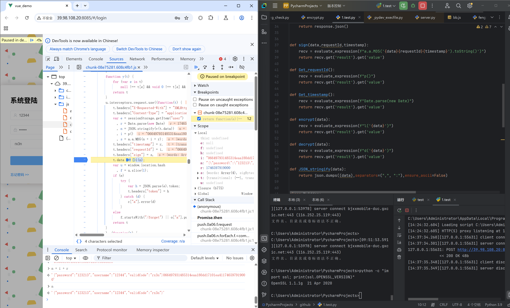

第六步保留该断点网页（注意该技术使用的是在该断点帧执行表达式，断点是不能动的），打开新的测试的网页，使用burp将l(n)替换为n，即前端替换成明文数据。

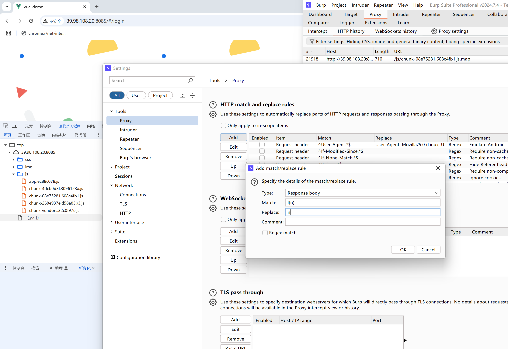

#当然我这里使用的是条件断点调试展示，对条件断点感兴趣的可以去了解一下。

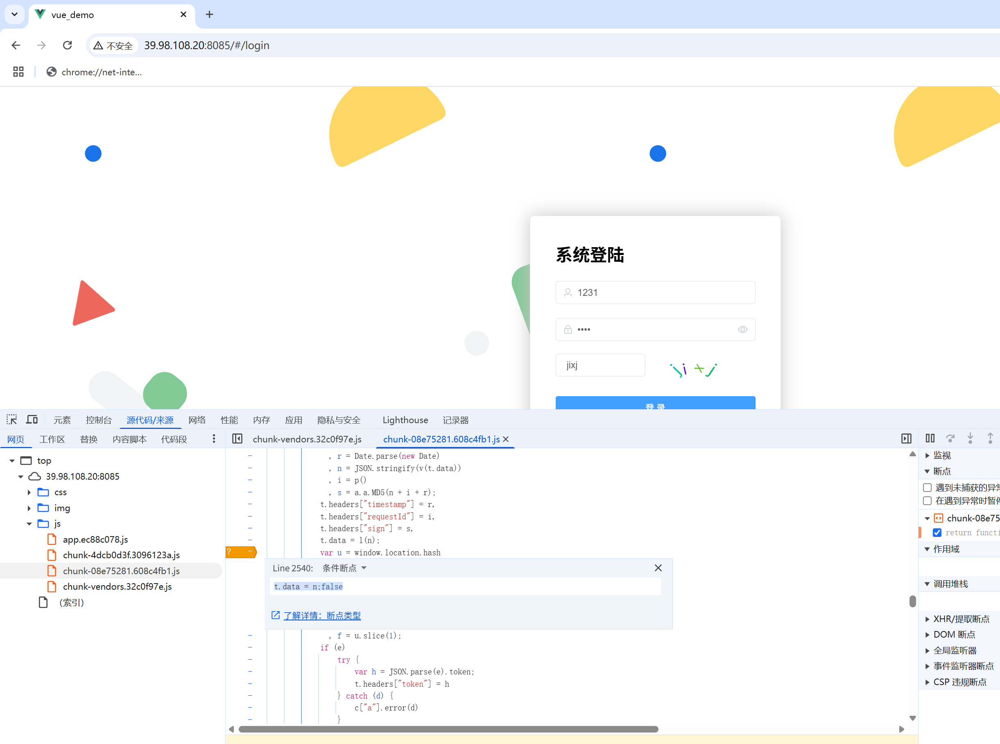

第七步调试明文与mitmproxy耦合加密签名关系与服务器通信测试。

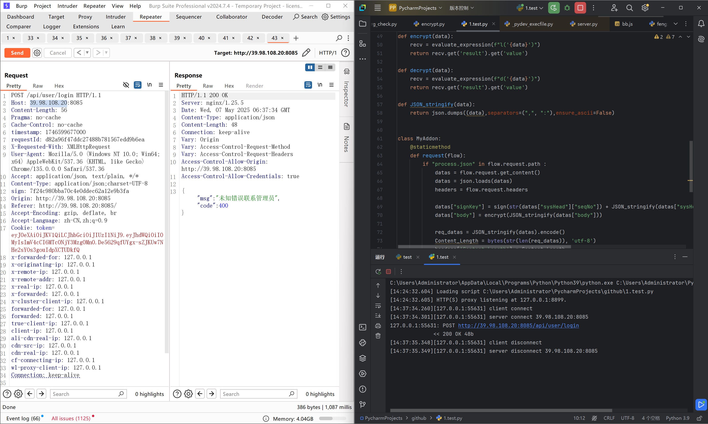

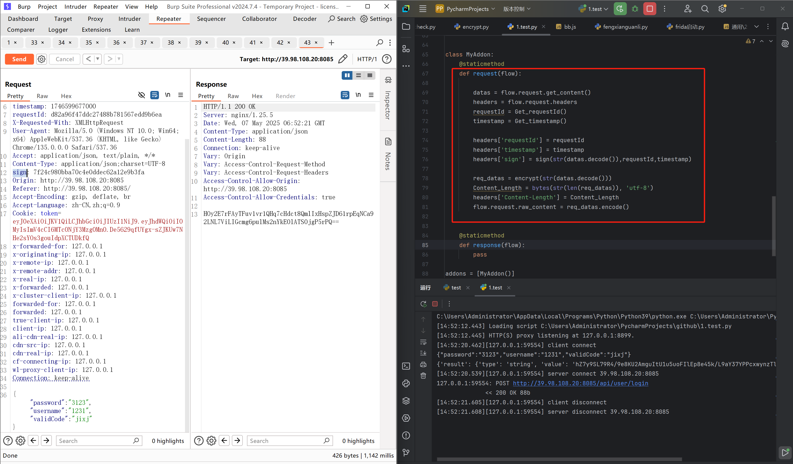

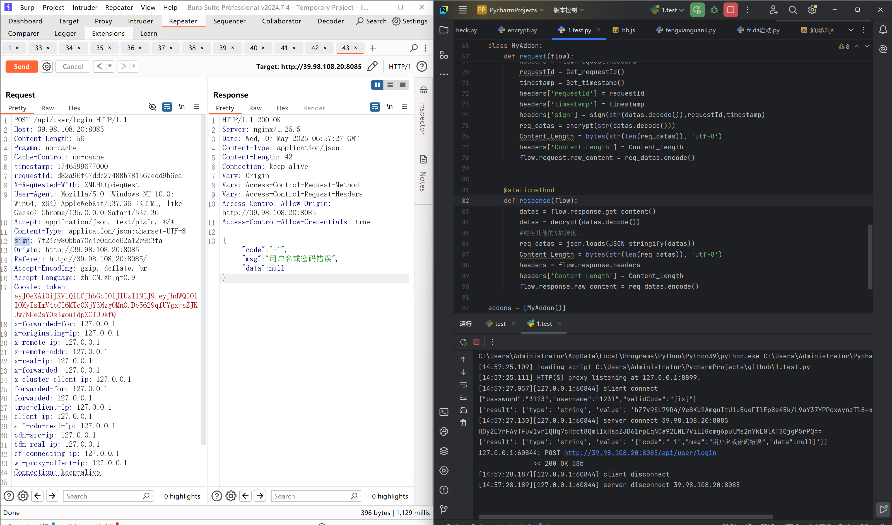

保留存在调用接口展示，方便调试bug。

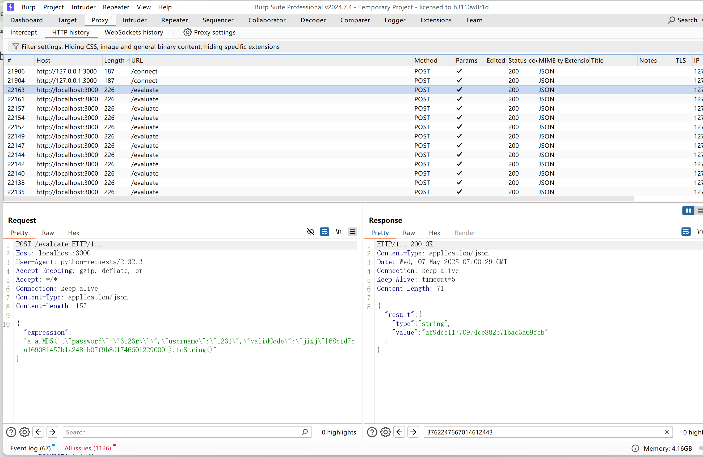

完成所有代码加解密流程，整体干净整洁清爽，原汁原味，还可以将一部分JS函数做成接口，避免手动重复实现。优点多多，个人感觉比jsrpc更好用，更简单轻便。

# 参考

<https://xz.aliyun.com/news/17198>

# 预热一下

安卓微信小程序的JS修改技术。

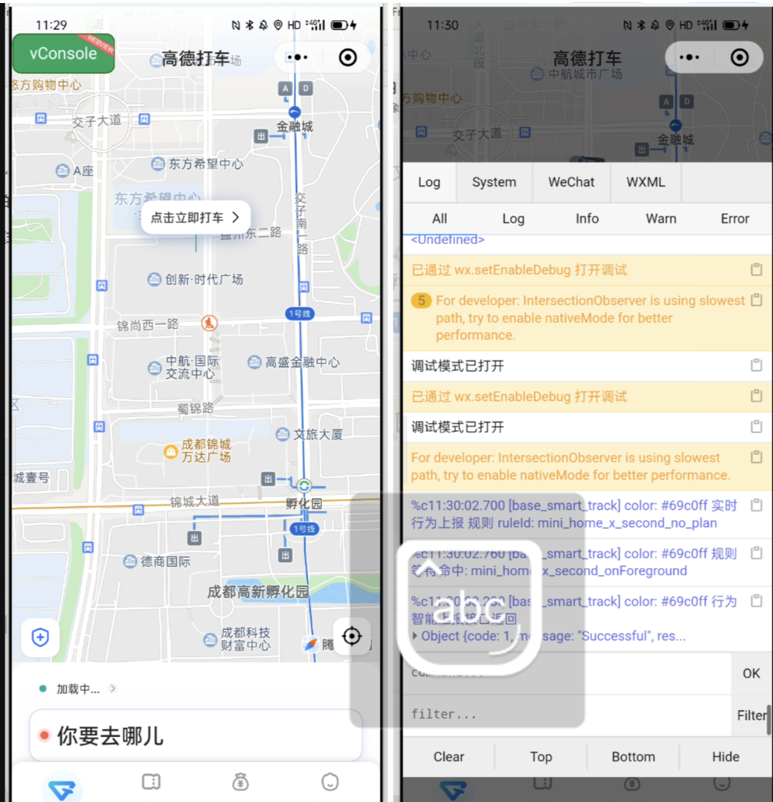
