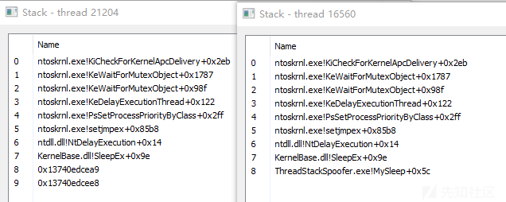
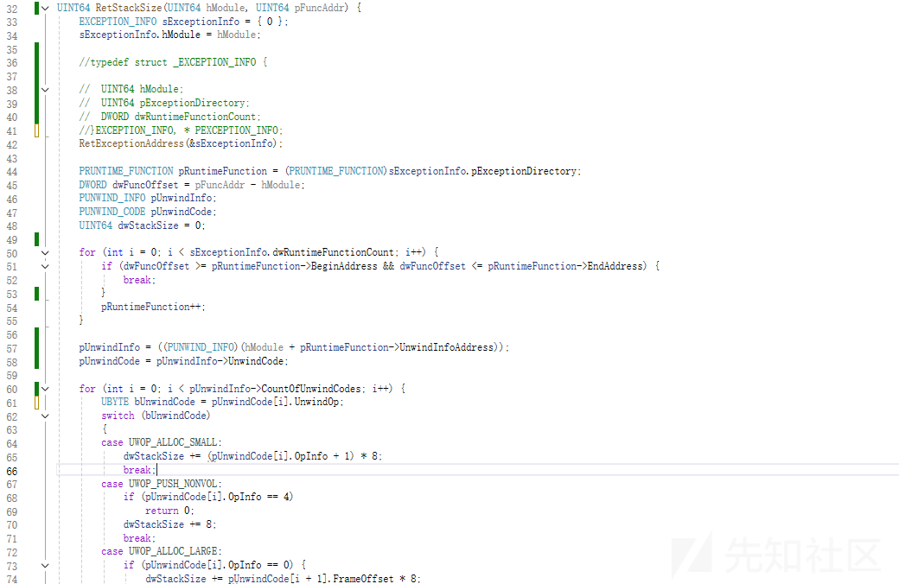
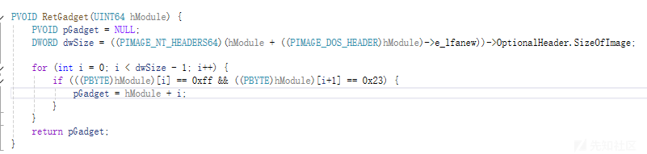
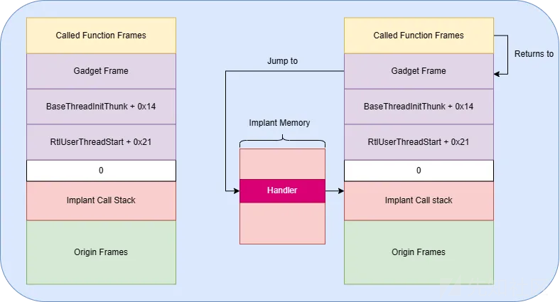
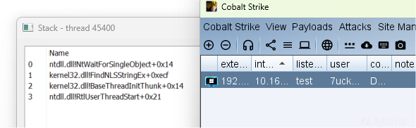
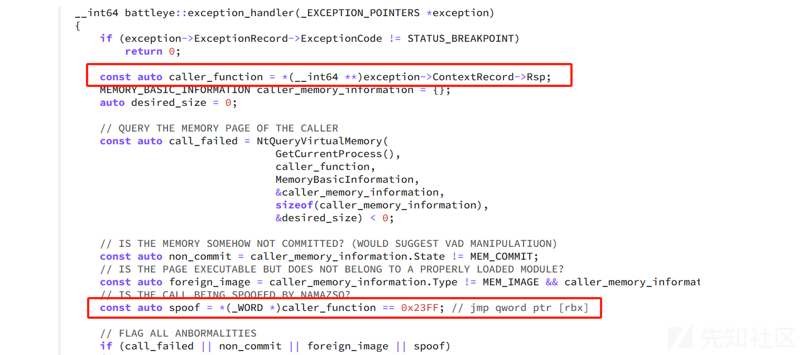
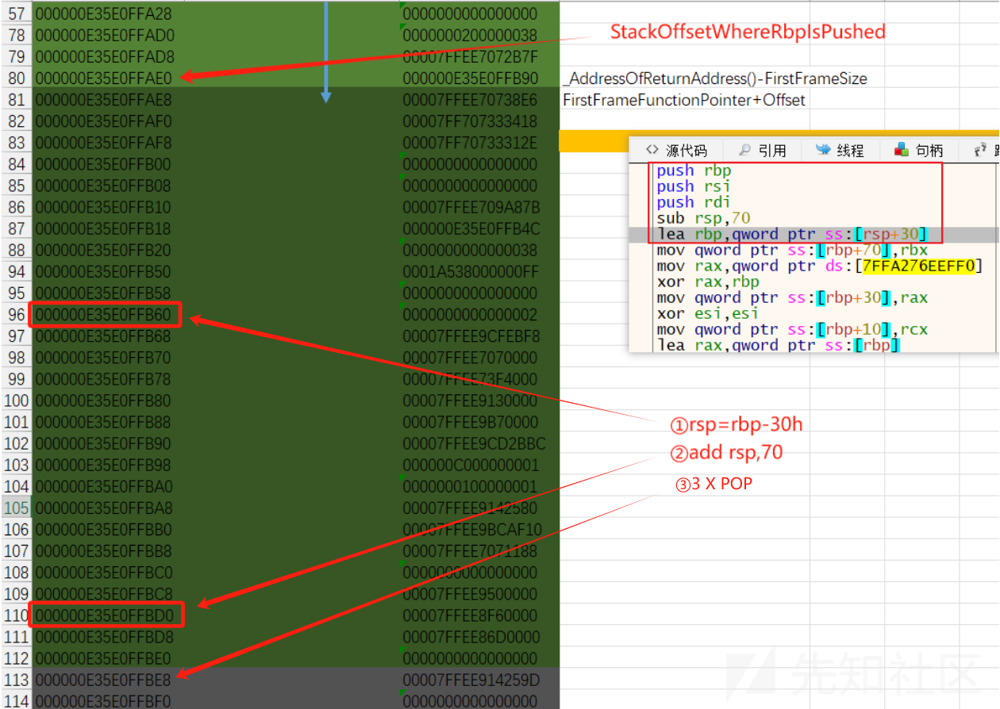
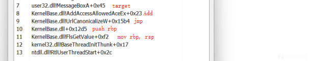
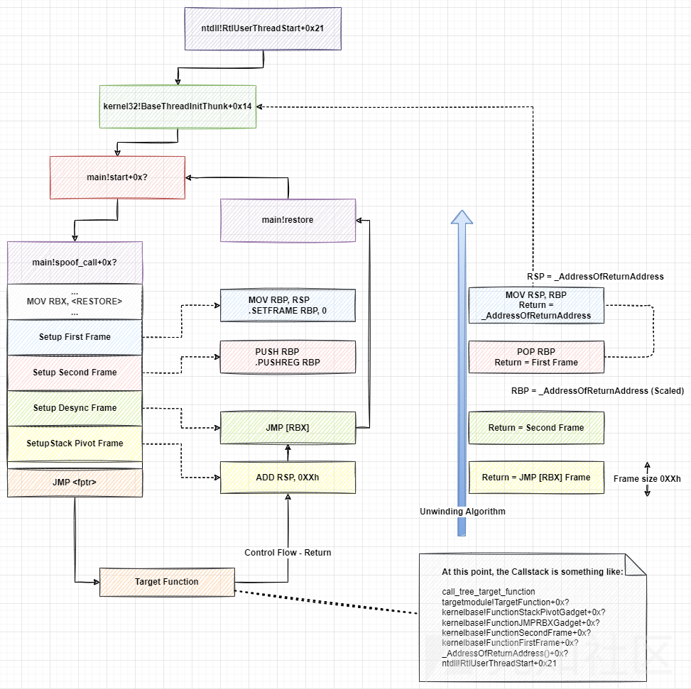

# Stack Spoof-堆栈欺骗-先知社区

> **来源**: https://xz.aliyun.com/news/17957  
> **文章ID**: 17957

---

## 铺垫内容

在Windows x86\_32中，函数在CPU级别实现了扩展基址指针EBP，它有效记录栈帧的地址（即调用者的地址），但在Windows x86\_64中，这种方式不再强制使用而是使用RSP栈指针同时扮演“栈顶指针”与“帧指针”的角色。某些情况下仍然会使用RBP，比如动态栈分配、异常处理或某一些需要稳定栈指针的情况的场景，会把当前RSP存在RBP中，再次放RBP成为帧指针。

所以x86\_64下无法再通过EBP指针进行栈展开，改用PE文件中.pdata的UNWIND信息表。在.pdata中它记录了每个函数的起止地址、以及在prologue/epilogue中对栈的操作（通过UNWIND\_CODE描述），以便系统和调试器可使用这些信息进行回退操作。

利用这个结构，当程序发生异常时操作系统需要回溯函数调用的过程，以便找到异常发生点、找到对应的异常处理程序、正确恢复线程或终止线程。这个过程中，系统会获取当前的RIP指令指针，确认异常发生的函数位置，遍历.pdata表，找到BeginAddress <= RIP < EndAddress 的记录，分析对应的UNWIND INFO，以此类推。

## ReturnAddress Truncation

回溯是吧，我不让你回溯就行了。在Sleep\_Hook函数中使用\_AddressOfReturnAddress函数获取栈帧中存储返回地址的位置：

* ULONG\_PTR\* overwrite = (ULONG\_PTR\*)\_AddressOfReturnAddress();

将\*overwrite置为0，则当前SleepHook函数的返回地址变为0，调用完SleepEx函数后恢复overwrite。

```
ULONG_PTR* overwrite = (ULONG_PTR*)_AddressOfReturnAddress();
ULONG_PTR origReturnAddress = *overwrite;
*overwrite = 0;
Sleep(dwTime);
*overwrite = origReturnAddress;
```

下图中左边是没有截断的，右图是截断的：



如果杀软对调用进行跟踪而不是只看调用栈，这种方式就没多大用处了。反而使得调用栈处于不可回溯状态，无法正确遍历整个调用栈帧链，这也是一个查杀点。

## Stack Truncation

根据上面的铺垫内容，可以知道栈回溯方式是通过RSP指针进行回溯，调试器和杀软进行堆栈回溯的情况可能是“拿着当前RIP去到Unwind Info分析对应函数的prologue，一步步还原上一级调用者的上下文”，这个过程就是结构化栈展开。

在栈的角度中任何乱七八糟的值都是对栈的破坏，假如我们随便插入一个值就会破坏这个分析的过程，阻止杀软继续往上分析，接着就可以自行构造堆栈了。我们知道一个线程通常都是从RtlUserThreadStart以及BaseThreadInitThunk开始的，所以我们需要伪造调用。

在伪造调用链时，如果需要模拟一个函数调用就必须知道这个函数真实进入时分配了多少栈空间，而这些栈分配大小都被编译器记录在Unwind Info结构中，所以就有类似如下的代码：



那之后想回去该如何做呢？在我们截断这个栈比如说push 0操作之前可以先将当前返回地址保存一手，之后还原栈指针然后跳转到该返回地址即可。跳转的操作可以压入一个jmp rbx的Trampoline，同样的可以fake一下，在跳转到目标函数之前先存入restore的地址到rbx就行：



最后通过这个Trampoline将执行流转换到我们的restore模块内恢复栈指针以及跳转就好啦，这里使用别人的一张图表示，左边是我们创建的堆栈，右边是我们真正的执行流：



实现效果：  


写在背后，网上挺多堆栈欺骗的模板代码，同时也有很多的检测方式。就从原理来看上述基本的欺骗思路重点就在于，它的实现依赖于跳转到非易失性寄存器的gadget，将执行流返回给植入程序去执行retore操作。如果帧的返回地址指向jmp xxx，则就会被视为可疑。

这个方式已经有文章说过这种检测手段了（https://secret.club/2020/01/05/battleye-stack-walking.html），简单的步骤是，对目标函数打上补丁int 3（0xCC），相当于设置了软件断点，同时注册VEH。程序调用执行到这些打了int3的函数时CPU触发STATUS\_BERAKPOINT异常执行流跳转到注册的异常处理函数，这个函数会分析当前堆栈顶的返回地址，进行检测。



同样的，我们伪造其他函数的栈，如果返回地址的前一个指令不是call，也可能被视为可疑。Elastic也对这个点进行了检测，开了对应检测后如果jmp rbx前一个指令不是call，会直接报stack spoof。

## stack moon walk

这个思路一开始是DEFCON提出的STACKMOONWALK，他们根据基于UNWIND的Windows栈回溯机制提出了一种巧妙的堆栈欺骗方法。

在文章开头写到：“某些情况下仍然会使用RBP，比如动态栈分配、异常处理或某一些需要稳定栈指针的情况的场景，会把当前RSP存在RBP中，再次放RBP成为帧指针。”这会想到自实现这个操作，但是这个操作是不太合法的。除非函数设置了帧指针，否则在函数的prologue和epilogue之外修改RSP是非法的。

所以基于修改RSP、栈回溯机制，该会议提到了两个帧，第一帧（UWOP\_SET\_FPREG）、第二帧（UWOP\_PUSH\_NONVOL）：

* 第一帧（UWOP\_SET\_FPREG）：UWOP\_SET\_FPREG操作会将当前RSP或RSP的偏移设置为RBP中，由以下代码执行：

```
① lea rbp, [rsp+040h]
② mov rbp, rsp
```

* 第二帧（UWOP\_PUSH\_NONVOL）：UWOP\_PUSH\_NONVOL操作会将RBP推送到堆栈中，由以下代码完成：

```
push rbp
```

假设第一帧采取的操作是mov，那么在展开算法的角度中，回滚这两个帧所需的操作就是：

```
pop rbp
mov rsp, rbp
```

所以这两个帧结合使用，我们可以使用任意值作为RBP，最后在第一帧时将其用作新的堆栈指针。下面为该回溯时的流程图：



其中为了让Windows成功识别这个自定义栈，需要注意的是StackOffsetWhereRbpIsPush（push rbp是压入栈哪个地方，才能在回溯过程中pop正确的值）。看他的源代码会很懵，其中可能看不懂的内容如下：

```
push    [rcx].SPOOFER.FirstFrameFunctionPointer
mov     rax, [rcx].SPOOFER.FirstFrameRandomOffset
add     qword ptr [rsp], rax                                      
	
mov     rax, [rcx].SPOOFER.ReturnAddress
sub     rax, [rcx].SPOOFER.FirstFrameSize
	
sub     rsp, [rcx].SPOOFER.SecondFrameSize
mov     r10, [rcx].SPOOFER.StackOffsetWhereRbpIsPushed
mov     [rsp+r10], rax
```

所以根据上面流程图以及汇编代码片段，站在回溯者的角度，在第二帧回溯中回溯者知道push rbp是在哪里push的之后需要原路返回，所以作为欺骗者在这个push rbp的地方提前埋下“炸弹”，回溯过程中就会成功修改了rbp的值。同时在第一帧中无论如何回溯，终究还是会把rbp赋予rsp，并且FirstFrameSize也是UWOP\_SET\_FPREG操作前的在栈中已经分配的大小，如图push、sub、lea操作后终会回溯到起始位置（ReturnAddress返回地址栈指针减去UWOP\_SET\_FPREG操作前的在栈中已经分配的大小，最后回溯过程还是会加上那么多的大小。）实现效果如下：



总体的流程，大致的操作是：

* 第一帧执行UWOP\_SET\_FPREG操作，将帧指针 (RSP) 设置为 RBP。
* 第二帧，将 RBP 推送到堆栈（UWOP\_PUSH\_NONVOL (RBP) ）
* 堆栈去同步框架，其中包含一个 ROP 小工具，它将执行JMP [RBX]指令，该指令将跳转到真正的控制流.
* 一个 RIP 隐藏框架，其中包含一个堆栈枢轴小工具，仅用于隐藏我们的原始 RIP



## 参考链接：

https://media.defcon.org/DEF%20CON%2031/DEF%20CON%2031%20presentations/Alessandro%20klezVirus%20Magnosi%20Arash%20waldoirc%20Parsa%20Athanasios%20trickster0%20Tserpelis%20-%20StackMoonwalk%20A%20Novel%20approach%20to%20stack%20spoofing%20on%20Windows%20x64.pdf

https://dtsec.us/2023-09-15-StackSpoofin/

https://klezvirus.github.io/RedTeaming/AV\_Evasion/StackSpoofing/
