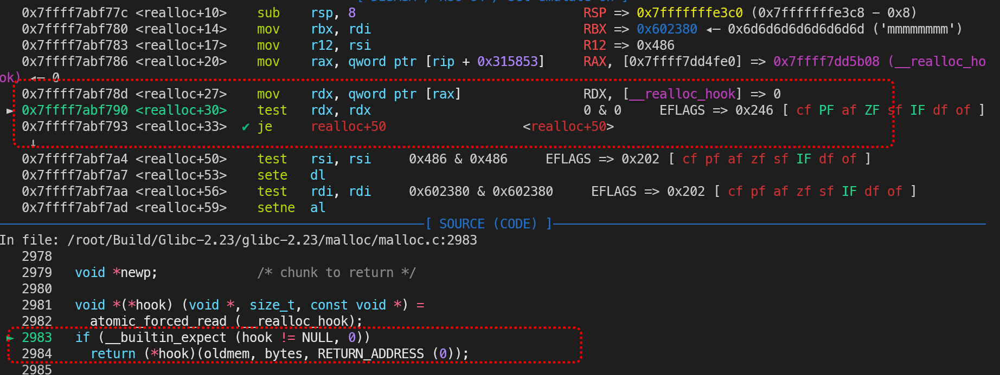
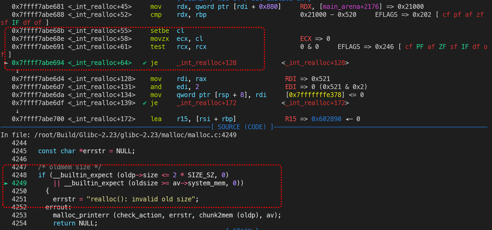
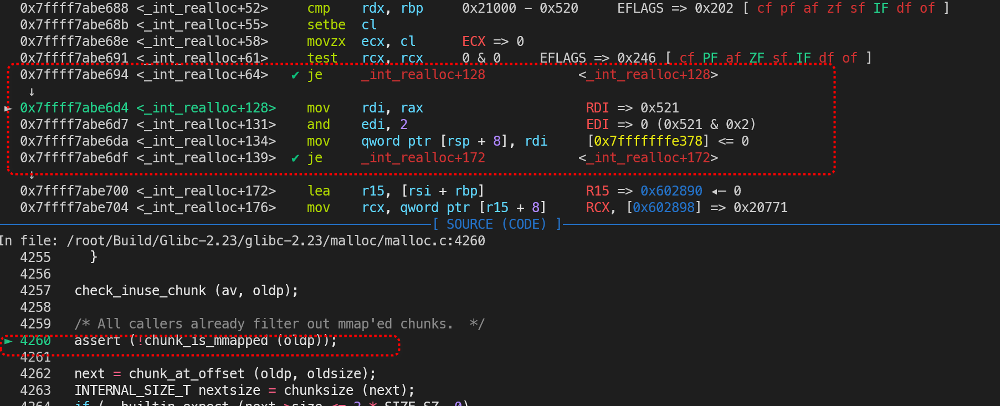
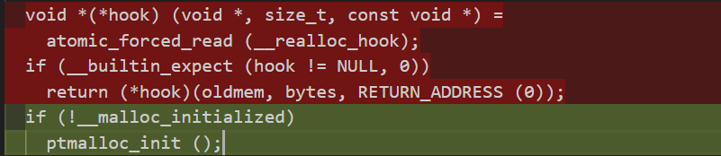
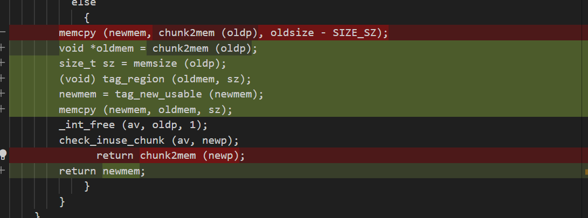
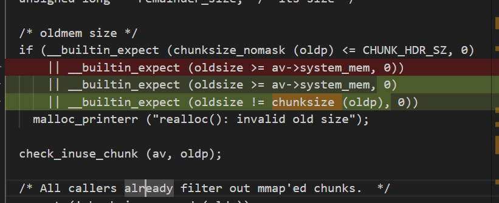

# 针对 glibc 中 realloc() 函数源码在 2.2x ~ 2.3x 版本的深度解析-先知社区

> **来源**: https://xz.aliyun.com/news/17978  
> **文章ID**: 17978

---

## 前置-常见定义

### 1-1 Glibc 2.23

1. GCC 优化的结果预期： `__builtin_expect()`

```
__builtin_expect(expr, val)
```

其中 `expr` 是条件，`val` 是预期，意思是 `expr` 的结果预期是 `val` ，符合预期为真，反之为假

2. 堆块起始位和内容起始位互转： `chunk2mem(p)` 与 `mem2chunk (oldmem)`

```
#define chunk2mem(p)   ((void*)((char*)(p) + 2*SIZE_SZ))
#define mem2chunk(mem) ((mchunkptr)((char*)(mem) - 2*SIZE_SZ))
```

`p` 为堆块指针，`mem` 即堆块数据起始位置，例如 `mem` 是 `0x602370` 则 `p` 是 `0x602360`

3. 获取堆大小： `chunksize (oldp)`
4. 检测堆块是否由 `mmap()` 创建： `chunk_is_mmapped (oldp)`
5. 根据输入大小获取申请 / 改变堆块后的实际大小：`request2size(req)` 与 `checked_request2size(req)`

```
#define request2size(req)                                         
  (((req) + SIZE_SZ + MALLOC_ALIGN_MASK < MINSIZE)  ?             
   MINSIZE :                                                      
   ((req) + SIZE_SZ + MALLOC_ALIGN_MASK) & ~MALLOC_ALIGN_MASK)

/*  Same, except also perform argument check */

#define checked_request2size(req, sz)                            
  if (REQUEST_OUT_OF_RANGE (req)) {					      
      __set_errno (ENOMEM);						      
      return 0;								      
    }									      
  (sz) = request2size (req);
```

即包括**对齐 + 头部元数据**的大小

6. 错误检测与报错： `assert(expr)`

```
# define assert(expr) 
  ((expr)								      
   ? ((void) 0)								      
   : __malloc_assert (#expr, __FILE__, __LINE__, __func__))
```

括号内条件不成立触发

7. 报错：`__malloc_assert()`

```
static void
__malloc_assert (const char *assertion, const char *file, unsigned int line,
         const char *function)
{
  (void) __fxprintf (NULL, "%s%s%s:%u: %s%sAssertion `%s' failed.
",
             __progname, __progname[0] ? ": " : "",
             file, line,
             function ? function : "", function ? ": " : "",
             assertion);
  fflush (stderr);
  abort ();
}
#endif
```

7. 报错：`malloc_printerr ()`

```
malloc_printerr (int action, const char *str, void *ptr, mstate ar_ptr)
{
  /* Avoid using this arena in future.  We do not attempt to synchronize this
     with anything else because we minimally want to ensure that __libc_message
     gets its resources safely without stumbling on the current corruption.  */
  if (ar_ptr)
    set_arena_corrupt (ar_ptr);

  if ((action & 5) == 5)
    __libc_message (action & 2, "%s
", str);
  else if (action & 1)
    {
      char buf[2 * sizeof (uintptr_t) + 1];

      buf[sizeof (buf) - 1] = '\0';
      char *cp = _itoa_word ((uintptr_t) ptr, &buf[sizeof (buf) - 1], 16, 0);
      while (cp > buf)
        *--cp = '0';

      __libc_message (action & 2, "*** Error in `%s': %s: 0x%s ***
",
                      __libc_argv[0] ? : "<unknown>", str, cp);
    }
  else if (action & 2)
    abort ();
}

```

8. 正常情况下不会触发的函数

```
/*
   Debugging support

   These routines make a number of assertions about the states
   of data structures that should be true at all times. If any
   are not true, it's very likely that a user program has somehow
   trashed memory. (It's also possible that there is a coding error
   in malloc. In which case, please report it!)
   
   翻译-调试支持：
   这些例程对数据结构的状态做出了一些定义，在任何时候都应为真，如果有不为真的情况，则很可能是用户程序以某种方式，破坏了内存。(也有可能是编码错误。在这种情况下，请报告！)
   
 */

#if !MALLOC_DEBUG

# define check_chunk(A, P)
# define check_free_chunk(A, P)
# define check_inuse_chunk(A, P)
# define check_remalloced_chunk(A, P, N)
# define check_malloced_chunk(A, P, N)
# define check_malloc_state(A)
```

### 1-2 Glibc 2.27

报错方式改变化，更加规范

新增 `__builtin_unreachable()` ：

作用为告诉编译器该位置不可能被执行，以便做更激进的优化或在出现这种情况时触发错误，如果代码实际运行到此处，通常会导致未定义行为

`assert()` 宏定义改变为 `__assert_fail()`

```
#ifndef NDEBUG
# define __assert_fail(assertion, file, line, function)	
     __malloc_assert(assertion, file, line, function)
```

`malloc_printerr()` 函数定义简化

```
malloc_printerr (const char *str)
{
  __libc_message (do_abort, "%s
", str);
  __builtin_unreachable ();
}
```

### 1-3 Glibc 2.31

1. 对结果优化的改变，可以预测的结果可以为假，也可以为真，并封装入不同的宏定义

```
# define __glibc_unlikely(cond)	__builtin_expect ((cond), 0)
# define __glibc_likely(cond)	__builtin_expect ((cond), 1)
```

2. `checked_request2size(req)` 定义改变

```
checked_request2size (size_t req, size_t *sz) __nonnull (1)
{
  if (__glibc_unlikely (req > PTRDIFF_MAX))
    return false;
  *sz = request2size (req);
  return true;
}
```

### 1-4 Glibc 2.35

特点，新增内存标记功能，为所有需要申请内存的地方都插入了这个功能，为了提高安全性

1. 新增 `__libc_mtag_tag_region()`： 用于对指定的内存区域进行标签标记，以支持内存标记（Memory Tagging）功能，帮助在运行时检测并防范错误的指针访问或越界访问等问题

虽然我觉得它貌似没有用，或者换一个说法，我没有看到任何检查的步骤，是交给其他部分做了吗，还是怎么样呢

2. 新增 `__libc_mtag_new_tag()` ：用于生成新的内存标签，与内存标记机制配合使用，以帮助检测错误的指针使用和越界访问
3. 新增 `mtag_enabled` ：通常是一个布尔标志，用来指示是否启用了内存标记功能
4. 新增 `memsize(p)` 返回数据区大小：

```
#define memsize(p)  
(__MTAG_GRANULE_SIZE > SIZE_SZ && __glibc_unlikely (mtag_enabled) ? 
    chunksize (p) - CHUNK_HDR_SZ :                                    
    chunksize (p) - CHUNK_HDR_SZ + (chunk_is_mmapped (p) ? 0 : SIZE_SZ))
```

5. 新增 `tag_region ()` 对上述函数的封装：

```
tag_region (void *ptr, size_t size)
{
  if (__glibc_unlikely (mtag_enabled))
    return __libc_mtag_tag_region (ptr, size);
  return ptr;
}
```

6. 新增 `tag_new_usable ()` 就是封装旧函数 + 添加新特性罢了

```
tag_new_usable (void *ptr)
{
  if (__glibc_unlikely (mtag_enabled) && ptr)
    {
      mchunkptr cp = mem2chunk(ptr);
      ptr = __libc_mtag_tag_region (__libc_mtag_new_tag (ptr), memsize (cp));
    }
  return ptr;
}
```

## 从不同版本角度看 realloc()

实际上，对于该函数而言，他的整体功能并没有太大的变化，版本更迭更注重的其实是检查手段以及使得代码更加规范的完善，所以这里选择了经典的 2.23 版本

### 1-1 Glibc 2.23

```
void * __libc_realloc (void *oldmem, size_t bytes)
{
  mstate ar_ptr;
  INTERNAL_SIZE_T nb;         /* padded request size */

  void *newp;             /* chunk to return */

  void *(*hook) (void *, size_t, const void *) =
    atomic_forced_read (__realloc_hook);
  if (__builtin_expect (hook != NULL, 0))
    return (*hook)(oldmem, bytes, RETURN_ADDRESS (0));
```



读入 `__realloc_hook` 上的值，检测是否为空，一般来说第一次存放堆初始化的地址，**如果非空，直接返回到写入的地址**

```
#if REALLOC_ZERO_BYTES_FREES
  if (bytes == 0 && oldmem != NULL)
    {
      __libc_free (oldmem); return 0;
    }
#endif
```

如果传入了一个正常的堆块地址，但是 `size` 是 0 ，那么就直接调用 `__libc_free`

```
  /* realloc of null is supposed to be same as malloc */
  if (oldmem == 0)
    return __libc_malloc (bytes);
```

如果传入了一个空的堆块地址，但是 `size` 不是 0 ，那么就直接调用 `__libc_malloc`

```
  /* chunk corresponding to oldmem */
  const mchunkptr oldp = mem2chunk (oldmem);
  /* its size */
  const INTERNAL_SIZE_T oldsize = chunksize (oldp);

  if (chunk_is_mmapped (oldp))
    ar_ptr = NULL;
  else
    ar_ptr = arena_for_chunk (oldp);
```

获取操作堆块的指针和地址，并**判断是否为** `mmap()` **分配的**，`mmap` 块是通过 `mmap()` 系统调用分配的大型内存块，独立于 `arena` 管理，如果是就把象征堆块所属的 `ar_ptr` 设为空，不是的话就设为堆块所在的 `arena` ，**确保能在正确的** `arena` **中为堆块提供后续操作**

```
  /* Little security check which won't hurt performance: the
     allocator never wrapps around at th e end of the address space.
     Therefore we can exclude some size values which might appear
     here by accident or by "design" from some intruder.  */
  if (__builtin_expect ((uintptr_t) oldp > (uintptr_t) -oldsize, 0)
      || __builtin_expect (misaligned_chunk (oldp), 0))
    {
      malloc_printerr (check_action, "realloc(): invalid pointer", oldmem,
               ar_ptr);
      return NULL;
    }
```

这是一个小检查，主要判断指针的大小

> 这是基本不会影响性能的安全检查：堆管理器永远不会在地址空间的末端出现 “环绕” 的情况，因此，我们可以排除一些可能在这里出现的异常大小值，或一些肮脏骇客 “设计” 的大小

* `(uintptr_t) oldp > (uintptr_t) -oldsize`：空间环绕检查`oldp` 是内存块的头部指针，转换为无符号整数 `(uintptr_t) oldp`，`oldsize` 是块的总大小，`-oldsize` 取其负值，转换为无符号整数 `(uintptr_t) -oldsize`，在无符号整数运算中，`-oldsize` 等价于 `-oldsize + 1`（按位取反加 1）这个主要为了防止**空间环绕**漏洞，这个漏洞基于**整数溢出**，即如果一个地址处于很高的位置，例如 `0xFFFFFFFFFFFFF000`，在这种情况下我们要是在这个地址加一个偏移，我们就能访问到地址空间地位的数据，该检查就是防止 `oldp` 是一个伪造的指针，其地址加上 `oldsize` 会导致溢出或非法访问换个意思说就是检查 `oldp` 是否接近地址空间的顶部（例如 `0xFFFFFFFFFFFFFFF0`），因为合法的内存块不会分配在这样的位置例如，如果 `oldsize` = 0x1000，则 `(uintptr_t) -oldsize` = `0xFFFFFFFFFFFFF000`，这个时候我们要是大下为`0xFFFFFFFFFFFFFFF0` ，就会出现空间环绕，堆块会出现访问低地址的情况，而这个情况很明显过不了检查
* `misaligned_chunk (oldp)`：堆块大小对齐检查，不对齐直接寄

```
checked_request2size (bytes, nb);
```

根据输入得到**实际堆块大小**，即包括**对齐 + 头部元数据**的大小

```
  if (chunk_is_mmapped (oldp))
    {
      void *newmem;

#if HAVE_MREMAP
      newp = mremap_chunk (oldp, nb);
      if (newp)
        return chunk2mem (newp);
#endif
      /* Note the extra SIZE_SZ overhead. */
      if (oldsize - SIZE_SZ >= nb)
        return oldmem;                         /* do nothing */

      /* Must alloc, copy, free. */
      newmem = __libc_malloc (bytes);
      if (newmem == 0)
        return 0;              /* propagate failure */

      memcpy (newmem, oldmem, oldsize - 2 * SIZE_SZ);
      munmap_chunk (oldp);
      return newmem;
    }
```

这一段是对于上文中检测由 `mmap()` 创建的堆块进行处理的支持

`HAVE_MREMAP` 宏检查系统是否支持 `mremap` 系统调用，可以自动调整映射的大小或者重新映射

没有的话我们就进行下面计算， `oldsize - SIZE_SZ >= nb` 代表新堆块的大小被老堆块满足（`SIZE_SZ` 的存在代表 `mmap` 块的元数据管理可能有额外的对齐或边界，同注释），直接返回旧堆块，相当于什么都不做

如果不满足的话就调用 `__libc_malloc()` ，错误返回 `NULL` ，老堆块不释放，成功的话申请并通过 `memcpy()` 复制内容，`oldsize - 2 * SIZE_SZ` 减去意味着只复制用户数据字节，不保留 `prev_size` 和 `size` 等，最后使用 `munmap_chunk()` 释放，具体见下

```
  (void) mutex_lock (&ar_ptr->mutex);

  newp = _int_realloc (ar_ptr, oldp, oldsize, nb);

  (void) mutex_unlock (&ar_ptr->mutex);
```

每个 `arena` 包含一个互斥锁 `mutex`，调用 `mutex_lock()` 锁定 `arena` 可以防止多线程并发修改，允许独占操作，防止条件竞争，调用 `_int_realloc()` 进行该 `arena` 的分配，分配完再解锁

```
  assert (!newp || chunk_is_mmapped (mem2chunk (newp)) ||
          ar_ptr == arena_for_chunk (mem2chunk (newp)));
```

`assert()` 对返回堆块进行检测合法性

* `!newp`：如果 `newp` == `NULL`，通过，意思是失败了
* `chunk_is_mmapped(mem2chunk(newp))`：通过 `mmap()` 处理的
* `ar_ptr == arena_for_chunk(mem2chunk(newp))`：如果 `newp` 属于 `ar_ptr` 指向的 `arena`，通过，意思是通过该线程 `arena` 处理的，防止 `arena` 不匹配

```
  if (newp == NULL)
    {
      /* Try harder to allocate memory in other arenas.  */
      
      LIBC_PROBE (memory_realloc_retry, 2, bytes, oldmem); 
      /*似乎是调试钩子，记录重试事件*/
      
      newp = __libc_malloc (bytes);
      if (newp != NULL)
        {
          memcpy (newp, oldmem, oldsize - SIZE_SZ);
          _int_free (ar_ptr, oldp, 0);
        }
    }

  return newp;
}
```

这是一种 `_int_realloc()` 彻底失败的情况，然而他还想再试试，如果因为各种原因发生了错误，那么不管相对于旧堆块的新堆块大小，直接新申请一块符合需求的堆块，把旧的堆块通过 `_int_free()` 释放

> 看起来这里没有什么检测，那么存在缩小堆块出错，二次申请复制后堆溢出的可能吗？**基本不会**其实我们缩小块几乎总是成功的，因为缩小不需要新内存，只涉及元数据更新和可能的块分割，**正常情况下**不需要检测

```
void* _int_realloc(mstate av, mchunkptr oldp, INTERNAL_SIZE_T oldsize,
         INTERNAL_SIZE_T nb)
{
  mchunkptr        newp;            /* chunk to return */
  INTERNAL_SIZE_T  newsize;         /* its size */
  void*            newmem;          /* corresponding user mem */

  mchunkptr        next;            /* next contiguous chunk after oldp */

  mchunkptr        remainder;       /* extra space at end of newp */
  unsigned long    remainder_size;  /* its size */

  mchunkptr        bck;             /* misc temp for linking 此为 unlink 需要的临时变量 */
  mchunkptr        fwd;             /* misc temp for linking 此为 unlink 需要的临时变量*/

  unsigned long    copysize;        /* bytes to copy */
  unsigned int     ncopies;         /* INTERNAL_SIZE_T words to copy */
  INTERNAL_SIZE_T* s;               /* copy source */
  INTERNAL_SIZE_T* d;               /* copy destination */

  const char *errstr = NULL;
```

```
  /* oldmem size */
  if (__builtin_expect (oldp->size <= 2 * SIZE_SZ, 0)
      || __nkbuiltin_expect (oldsize >= av->system_mem, 0))
    {
      errstr = "realloc(): invalid old size";
    errout:
      malloc_printerr (check_action, errstr, chunk2mem (oldp), av);
      return NULL;
    }
```

初步检查待处理堆块大小，不能过小，即小于 `2 * SIZE_SZ` ，也不能过大，即不能大于系统调用**当前**为该 `arena` 申请的内存，如果违规直接报错 `realloc(): invalid old size`

```
  check_inuse_chunk (av, oldp);
```

一个常规的检查，但是 **不会生效**



上面这个对应的是上一个检测



下面这个直接跳过了该检查

```
  /* All callers already filter out mmap'ed chunks.  */
  assert (!chunk_is_mmapped (oldp));
```

这里检查操作的原本堆块是否为通过 `mmap()` 系统函数申请的堆块，如果是则报错，不是则继续，可以算是一道检查的保险

```
  next = chunk_at_offset (oldp, oldsize);
  INTERNAL_SIZE_T nextsize = chunksize (next);
  if (__builtin_expect (next->size <= 2 * SIZE_SZ, 0)
      || __builtin_expect (nextsize >= av->system_mem, 0))
    {
      errstr = "realloc(): invalid next size";
      goto errout;
    }
```

和上文一样，检查待处理堆块紧邻的下个堆块，不能过小，即小于 `2 * SIZE_SZ` ，也不能过大，即不能大于系统调用**当前**为该 `arena` 申请的内存，如果违规直接报错 `realloc(): invalid next size`

```
  if ((unsigned long) (oldsize) >= (unsigned long) (nb))
    {
      /* already big enough; split below */
      newp = oldp;
      newsize = oldsize;
    }
```

从这里开始，就正式进入 `_int_realloc()` 的功能区了，我们可以看到

**如果旧的堆块足够大，那么我们就进入了缩小当前堆块的进程**，我们会初步**把返回的新堆块的指针指向原先旧堆块**，并且初步记录新堆块的大小和旧堆块相同，**在下文继续缩小的步骤**

```
  else
    {
      /* Try to expand forward into top */
      if (next == av->top &&
          (unsigned long) (newsize = oldsize + nextsize) >=
          (unsigned long) (nb + MINSIZE))
        {
          set_head_size (oldp, nb | (av != &main_arena ? NON_MAIN_ARENA : 0));
          av->top = chunk_at_offset (oldp, nb);
          set_head (av->top, (newsize - nb) | PREV_INUSE);
          check_inuse_chunk (av, oldp);
          return chunk2mem (oldp);
        }

      /* Try to expand forward into next chunk;  split off remainder below */
      else if (next != av->top &&
               !inuse (next) &&
               (unsigned long) (newsize = oldsize + nextsize) >=
               (unsigned long) (nb))
        {
          newp = oldp;
          unlink (av, next, bck, fwd);
        }
```

当然，反过来的话，**你的旧堆块不满足需要，那么我们就进入了扩大当前堆块的进程**（并非直接扩），这里有两种情况

1. 如果下个堆块是 `Top Chunk` 并且 `oldsize + nextsize >= nb + MINSIZE`，即 `top chunk` 的大小足以满足需求并且还能留下一个空缺（个人理解为留下一个本该用于存放下一个堆块的元数据的区域，虽然极限情况下没有下一个堆块），那么直接将

* `set_head_size()` 把旧堆块的大小设置成新的大小，如果当前的 `arena` 不是 `main_arena`，还会标上 `NON_MAIN_ARENA` 这个标志
* 把 `arena` 结构体 `av` 的 `top` 指针更新为 `oldp` 往后偏移 `nb` 的位置，也就是偏移一个我们要改成的新堆块的大小，剩余部分的首地址就变成 `oldp + nb`，剩下这一部分将成为新的顶端 `top chunk`，以便后续继续从这里分配内存
* 设置新的 `top chunk` 的头部信息。其大小是 `newsize - nb`，并且加上了 `PREV_INUSE` 标志
* **我们可以看到扩大的堆块会残留一些原先** `top chunk` **的元数据**

1. 如果下个堆块处于被释放状态，且不属于 `fastbin` （2.23中），换个意思是下一个堆块的 `PREV_INUSE` 为空的话，若原先堆块大小和相邻空闲堆块大小相加符合要求，那么会直接调用 `unlink` 引导两个堆块合并，返回原先的堆块数据地址指针，**在下文继续缩小的步骤**

```
      /* allocate, copy, free */
      else
        {
          newmem = _int_malloc (av, nb - MALLOC_ALIGN_MASK);
          if (newmem == 0)
            return 0; /* propagate failure */

          newp = mem2chunk (newmem);
          newsize = chunksize (newp);

          /*
             Avoid copy if newp is next chunk after oldp.
           */
          if (newp == next)
            {
              newsize += oldsize;
              newp = oldp;
            }
          else
            {
              /*
                 Unroll copy of <= 36 bytes (72 if 8byte sizes)
                 We know that contents have an odd number of
                 INTERNAL_SIZE_T-sized words; minimally 3.
               */

              copysize = oldsize - SIZE_SZ;
              s = (INTERNAL_SIZE_T *) (chunk2mem (oldp));
              d = (INTERNAL_SIZE_T *) (newmem);
              ncopies = copysize / sizeof (INTERNAL_SIZE_T);
              assert (ncopies >= 3);

              if (ncopies > 9)
                memcpy (d, s, copysize);

              else
                {
                  *(d + 0) = *(s + 0);
                  *(d + 1) = *(s + 1);
                  *(d + 2) = *(s + 2);
                  if (ncopies > 4)
                    {
                      *(d + 3) = *(s + 3);
                      *(d + 4) = *(s + 4);
                      if (ncopies > 6)
                        {
                          *(d + 5) = *(s + 5);
                          *(d + 6) = *(s + 6);
                          if (ncopies > 8)
                            {
                              *(d + 7) = *(s + 7);
                              *(d + 8) = *(s + 8);
                            }
                        }
                    }
                }

              _int_free (av, oldp, 1);
              check_inuse_chunk (av, newp);
              return chunk2mem (newp);
            }
        }
    }
```

1. 如果下个堆块并没有处于被释放状态，或是被释放但属于 `fastbin` （2.23中），换个意思是下一个堆块的 `PREV_INUSE` 为 1 的话，我们会采取**申请 + 复制 + 释放的方式**，即申请一个符合需求的新块，把内容复制到新块，调用了 `_int_malloc()` 和 `_int_free()`，**如果申请的堆块是相邻的话会跳过复制，且需要下文继续缩小的步骤**

```
  /* If possible, free extra space in old or extended chunk */

  assert ((unsigned long) (newsize) >= (unsigned long) (nb));
```

简单检测，为防止某些错误，检查符合前述条件的堆块是否小于我们初步要求新申请的大小，理论来说是绝对成立的

```
  remainder_size = newsize - nb;

  if (remainder_size < MINSIZE)   /* not enough extra to split off */
    {
      set_head_size (newp, newsize | (av != &main_arena ? NON_MAIN_ARENA : 0));
      set_inuse_bit_at_offset (newp, newsize);
    }
  else   /* split remainder */
    {
      remainder = chunk_at_offset (newp, nb);
      set_head_size (newp, nb | (av != &main_arena ? NON_MAIN_ARENA : 0));
      set_head (remainder, remainder_size | PREV_INUSE |
                (av != &main_arena ? NON_MAIN_ARENA : 0));
      /* Mark remainder as inuse so free() won't complain */
      /* 意思是如果你不设置 INUSE 位 free() 会当成 double free 的错误 */
      set_inuse_bit_at_offset (remainder, remainder_size);
      _int_free (av, remainder, 1);
    }

  check_inuse_chunk (av, newp); // 未启用
  return chunk2mem (newp);
}
```

这里是上文所述的**堆块缩小**部分，这部分通常会被划入 `last_remainder` 中，首先我们会计算出来理论上缩小后堆块的大小，就是当前扩大后的堆块大小减去需要的堆块大小

* 如果说缩小的大小不足以满足最小堆块的大小，即 `remainder_size < MINSIZE` 的话会放弃分割
* 反之，我们会把他分割成一个独立的堆块，给予他相应的元数据，就是大小，属于 `remainder` 的标记，是否属于当前 `arena` 等，然后无情的调用 `_int_free()` 释放

### 2-2 Glibc 2.27

更加及时规范的报错，即报错位置直接调用报错函数进行输出，具体见上文

### 2-3 Glibc 2.31

堆块的复制直接使用了 `memcpy()`

### 2-4 Glibc 2.35

1. `realloc_hook` 被删除，不使用钩子进行初始化，而是直接内部初始化，这意味这利用 `hook`的进程已经落幕



2. 针对复制内容的优化，增加安全性而已啦



### 2-5 Glibc 2.39

增加检查，检查需要更改的堆块的大小有没有被修改过



## 总结

因为这是一个很复杂的工作，个人精力有限，而且改动其实也不是很大，就停止到了 2.39 这个版本

到这个时候，让我们看看 `realloc()` 的工作逻辑

```
realloc() --其实是-> __libc_realloc() --内部使用-> _int_realloc()
```

（执行 `realloc_hook` ，如果有）

1. 如果指针有效，大小为 0，则进入 `__libc_free()` 直接走释放工作
2. 如果指针无效，大小非 0，则进入 `__libc_malloc()` 直接走申请工作（检查大小，防止环回攻击）
3. 如果指针有效，大小较大需要走系统调用

* 如果是缩小堆块大小，则不做任何改变，返回原来的堆块
* 如果是扩大堆块大小，则系统调用生成新的，直接复制

* 如果出错直接返回 NULL

4. 如果指针有效，大小合适无需走系统调用（`arena` 标记上锁防止条件竞争）进入 `_int_realloc()` （大小检查：不能过小，即小于 `2 * SIZE_SZ` ，也不能过大，即不能大于系统调用**当前**为该 `arena` 申请的内存）（是否 `mmap()` 内存检查）（下一邻块大小检查，包括 `top chunk` ：不能过小，即小于 `2 * SIZE_SZ` ，也不能过大，即不能大于系统调用**当前**为该 `arena` 申请的内存）

（解除锁定）

（堆块合法性检查，会跳过失败的情况）

* 如果是缩小堆块大小，则暂时不做任何改变

* 等待下面缩小

* 如果是扩大大小

* 如果下个堆块是 `Top Chunk` 并且 `top chunk` 的大小足以满足需求，将直接扩大堆块大小

* 等待下面缩小

* 如果下个堆块处于被释放状态，相加大小符合要求，`PREV_INUSE` 为空的则直接调用 `unlink`

* 等待下面缩小

* 如果下个堆块并没有处于被释放状态，或是 `PREV_INUSE` 为 1 的话，我们会采取**申请 + 复制 + 释放的方式**扩大堆块

* 如果申请的堆块不相邻，申请新的堆块就可**返回**
* 如果申请的堆块相邻

* 等待下面缩小

* 进入缩小进程

* 最大程度的缩小的剩下的空间如果满足一个最小堆块的话，堆块会进行最大程度的缩小，并划入 `last_remainder` 中
* 剩下的空间不满足则不进行缩小

5. 如果正常会返回
6. 如果 `_int_realloc()` 出现申请堆块失败的情况，即地址为 `NULL` ，直接**申请 + 复制 + 释放**
7. 这要是不成功铁寄，直接报错

​

文章首发于先知平台，有兴趣大家可以到我的[博客](https://blog.lufiende.work)看一看
