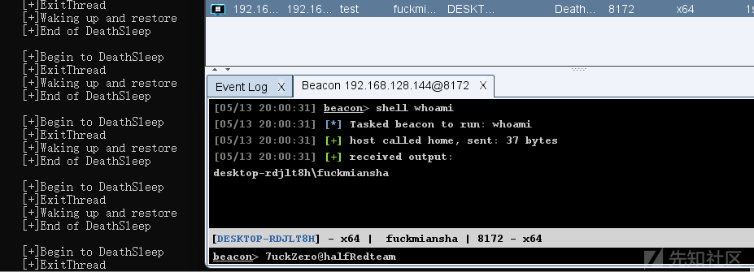
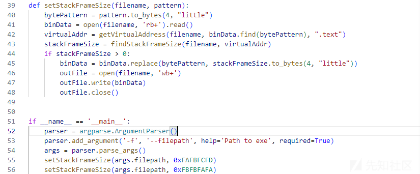
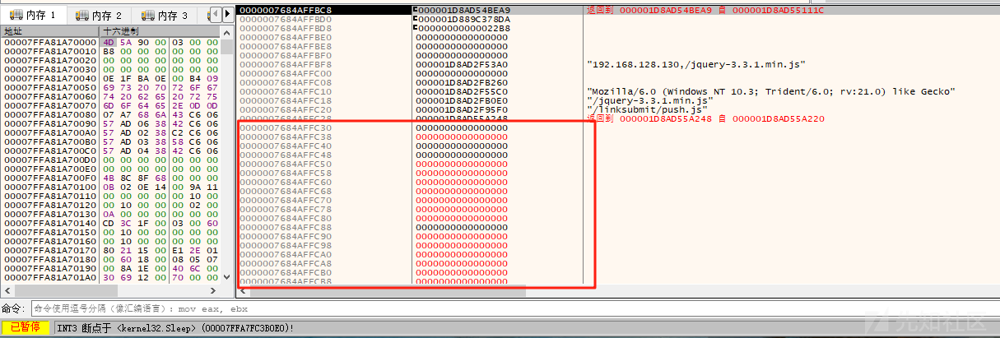
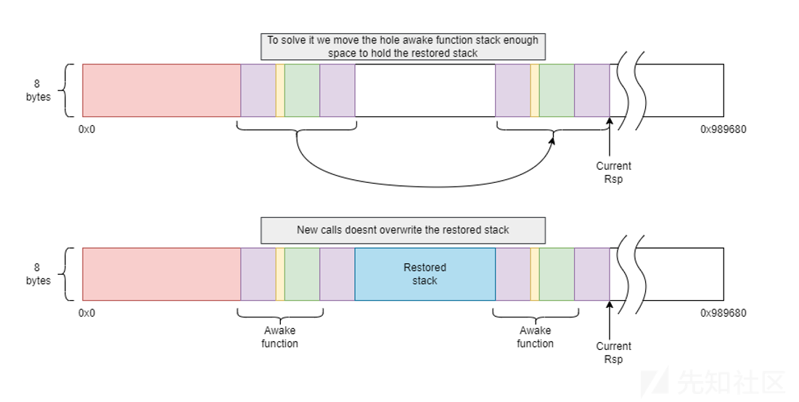
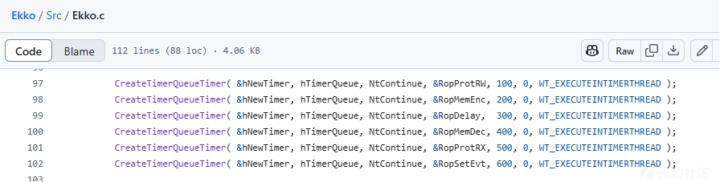
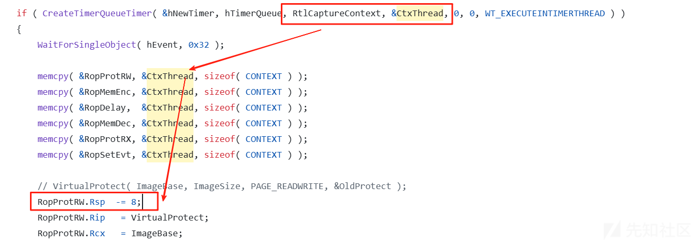
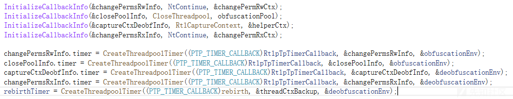
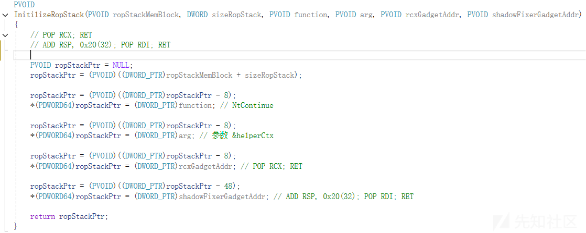
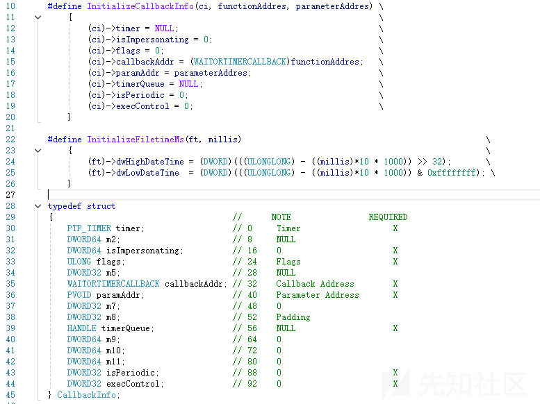
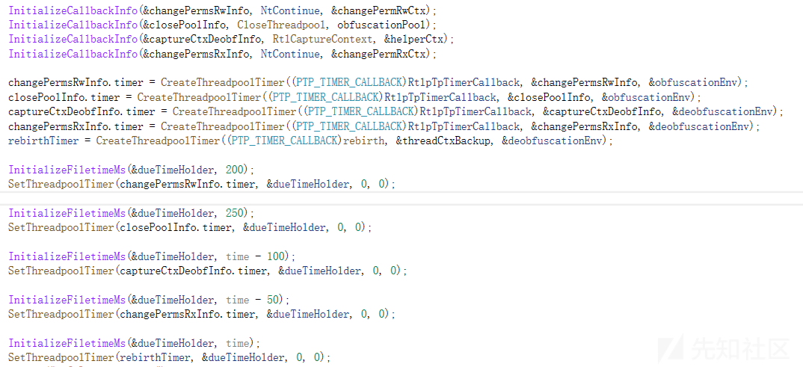

# 堆栈不在，何必欺骗？-先知社区

> **来源**: https://xz.aliyun.com/news/18005  
> **文章ID**: 18005

---

返回文档

摘要  
   
如今的C2都实现了睡眠，接着出现了内存扫描的杀毒软件，所以以“Hook Sleep”方式在睡眠期间加密的规避形式流行起来。同时，扫描线程栈的形式也成熟起来，著名的是Elastic edr，在睡眠时候、调用敏感API时候会扫描堆栈。内存加密、堆栈欺骗都是恶意软件经常使用的，后来看到了<https://twitter.com/httpyxel> 研究的新方法：“如果堆栈不存在的话，就没有必要伪造堆栈了 : )”。这个想法挺有意思，所以不计它最后绕过了什么，我学习了这个方法并改进加在了我的Loader中！  
   
项目地址：https://github.com/janoglezcampos/DeathSleep  
   
上下文恢复过程  
   
既然杀软会扫描我们线程的堆栈，所以现成的堆栈只要不存在就好了。所以该技术的目标是，终止当前线程并在执行之前回复它。在这个过程中，我们在终止线程之前需要保存两样东西，首先是CPU状态，其次是堆栈，最后在启动新线程之前恢复它。  
   
先来简单说说它的实现思路：Hook Sleep函数，所以beacon睡眠期间会跳转到我们的SleepHook函数，接着使用线程池、计时器用来实现修改内存属性、唤醒的功能。实现的效果如下：  
   



  
我们不能把它想的太简单了，因为会遇到多个困难：  
   
由于我们终止了当前的线程，所以我们需要保证进程不会结束。这很容易，一开始我使用的是while(TRUE)循环，后面出现了我不能解决的冲突问题，最后我修改为如下：  
   
​

```
WaitForSingleObject((HANDLE)-1, INFINITE);
```

既然要恢复唤醒我们的beacon，我们需要知道我们保存了多少的栈空间以及恢复之后RIP在哪。这里给出我的调用结构为“SleepHook(DWORD) -> DeathSleep(DWORD)”。为了检索DeathSleep函数的线程上下文，我们需要在DeathSleep函数第一行执行RtlCaptureContext函数（检索调用方上下文中的上下文记录）。第一个步骤是修改它的Rip，它是下一个要运行指令的寄存器，我们需要修改它使其保存DeathSleep的返回地址，即call DeathSleep的下一条指令，如果不修改它会导致恢复beacon后执行流还是在DeathSleep中。  
   
第一个问题来了，我们如何知道DeathSleep的栈构成？由于不能编译期间分析Unwind Info，所以第一个思路可以随便用一个变量填充，后续放入调试器中分析再修改这个变量的值。第二个思路是在DeathSleep中的变量当作一个标记，编译过后搜索这个标记再通过Unwind Info把值写入。  
   



  
获取DeathSleep栈结构大小后，就可以获取DeathSleep的返回地址了：  
   
接着第二个问题就来了，我们需要保存多少的栈大小从哪里保存呢？所以我开始分析原始shellcode执行的栈结构，在Sleep函数中设置断点，我甚至往上修改了部分值发现并没有影响shellcode的执行，所以就有了下面的代码，其中initialRsp是SleepHook函数中的Rsp。这时候会有疑问“initialRsp - (threadCtxBackup.Rsp + stackFrameSize + 0x8)”的结果不就是0吗？确实，但是为了防止我在SleepHook和DeathSleep的执行链中间加其他函数就这样写了  
   



  
先略过线程池的写法，咱们来看看唤醒之后如何恢复线程。在恢复beacon执行之前，我们需要将保存的栈放置到位。唤醒函数awake需要捕获当前的RSP值，使用如下汇编代码即可：  
   
恢复堆栈时，这个捕获地址将成为保存栈的放置起始地点。但是恢复之后，任何的函数调用都会破坏我们恢复的栈覆盖其中的数据：  
   


  
解决方式其实也很简单，原作者给出的方案是将前一段awake函数移后面并修改rsp，然后再将需要恢复的栈插入其中，移动awake函数的函数汇编代码（moveRsp(stackBackupSize + 0x150, 0xFBFBFAFA);）如下，同理也需要设置标记，之后填入awake函数栈大小。最后使用NtContinue函数改变执行逻辑就行。  
   



  
调度恢复过程  
   
根据上文我们基本了解了栈存储和恢复栈的基本流程，但是我们需要再没有线程的情况下运行这些操作。这时，我们就可以用到线程池API。它是 Windows 提供的一个工具， 它允许将任务排队到由操作系统管理的一组线程中。这些线程池线程会自行处理任务，而不需要手动管理线程生命周期。通过线程池 API，可以创建任务并将其排队到线程池中，这些任务会由系统自动调度和执行。其实Ekko项目（<https://github.com/Cracked5pider/Ekko>）依赖的也是线程池API：  
   



  
 虽然 Ekko 使用的线程池 API 在大多数情况下运行良好，但存在一个问题：即使任务执行完成，工作线程（worker）依然存活。这意味着，程序可能会生成许多不必要的工作线程，无法在任务完成后及时销毁它们。 所以我们用到了新的线程池API，他们提供了更强大的功能，比如CloseThreadPool()。通过新的线程池API，我们可以撞见自定义线程池、销毁、线程池最大线程数、清理线程组等。设置最大线程数可以让我们按顺序执行所有任务，只要它们按一定时间排队即可。清理线程组有助于在完成所有操作后更轻松地进行清理。  
   
写出线程池初始化代码没多少难度，疑惑的却是在我们需要将其卸载到代码之外，因为我们将内存保护改为RW。如果调用VirtualProtect，当函数返回时，我们的进程就会崩溃，所以我们需要找到一种方法从其他地方执行它，并让它也返回到RX页面（返回时也会发生同样的事情）。显然，我们也会使用线程池 API 来实现这一点，但有一个问题，我们只能给任务提供一个参数，而 VirtualProtect() 需要 4 个参数。所以我们还需要使用NtContinue函数。  
   
使用NtContinue函数中我们需要将RIP修改为目标VirtualProtect函数，接着将四个寄存器填入相应参数，这时会有一个问题，我们如何找到RSP的值？由于我们使用的是线程池形式，所以我们不知道它的栈会放在哪里，作者从Ekko项目中获得了解决方案，是使用 RtlCaptureContext() 在工作线程中复制上下文，并将获取的上下文的堆栈指针增加 8，这样它就会指向通过调用 RtlCaptureContext() 在堆栈中引入的地址，也就是最后一个函数的返回地址，我们可以将它用作所有函数的返回地址。  
   



  


  
所以我们貌似暂时解决了使用NtContinue后返回值的问题，这种情况需要在代码中手动减8，但是第二个VirtualProtect就不能直接使用这个方式了，我们会进入一个新的线程，所以旧上下文的 Rsp 就没用了，并且我们已经ExitThread了所以无法在延迟执行的任务中去操控CONTEXT。所以我们遇到的问题：一是旧的上下文RSP没用了，二是无法像之前一样直接减8。  
   
第一个问题挺好解决的，在这个线程池中再使用一次RtlCaptureContext就行：  
   



  
第二个问题作者给出的解决方案是使用Rop链，通过将第一个上下文的Rsp设置为指向手动创建的堆栈，该堆栈将保存重定向执行所需的一切，直到第二个NtContinue()调用将设置正确的上下文结束。  
   



  
至此，这个思路就差不多结束了。而作者发现了一个问题，NtContinue只需要填充一个参数就结束了，对于旧的线程池API这是好的，但是新的API CreateThreadpoolTimer传递参数的方式不同，导致无法使用NtContinue函数。作者分析这三个函数（CreateTimerQueueTimer、CreateThreadpoolTimer、SetThreadpoolTimer），发现CreateThreadpoolTimer只是TpAllocTimer的一个包装，SetThreadpoolTimer只是TpSetTimer的转发。  
   
对于CreateTimerQueueTimer函数则是RtlCreateTimer的一个包装，而RtlCreateTimer内部实际调用了TpAllocTimer和TpSetTimer，这类似于在内部调用CreateThreadpoolTimer和SetThreadpoolTimer。另外排队的函数并非直接使用我们指定的回调函数，而是将RtlpTpTimerCallback设置为回调函数。所以得出了大致的结论：RtlpTpTimerCallback函数内部会重新组织和调整参数的顺序。最终作者分析了信息的传递得到了如下调用方式：  
   



  


​
