# 一次恶意挖矿样本分析到捕获矿池地址-先知社区

> **来源**: https://xz.aliyun.com/news/18006  
> **文章ID**: 18006

---

# 样本指纹

SHA256:938c187c0c566d3ecd0ca594d027cff745688b409d6ab18e7d836d9ef1bd30de

MD5:8bb9f094a5c3e8358d931200092e3412

SHA1:fced1103ababf08ea6435f43f597240ac6c357e8

# 动静分析

首先使用IDA看看导入表 图中指出了一部分敏感的API

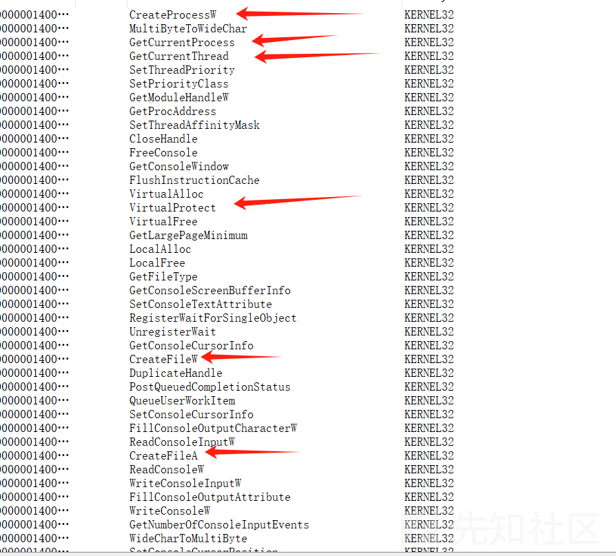

如图还有进行一些网络连接操作

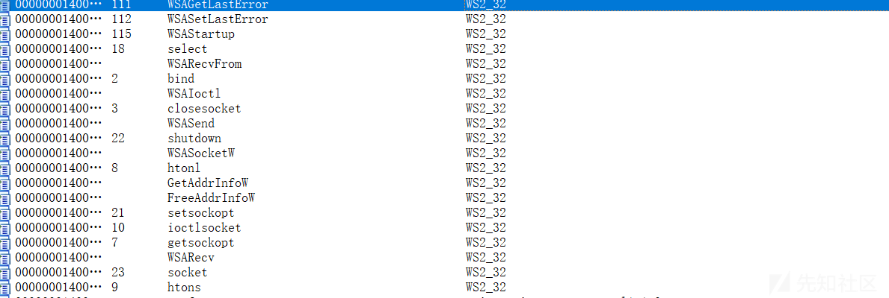

然后看执行流程，Tab键简单看看伪代码

main函数开头的这段代码，通过CreateMutex创建一个互斥体，通过GetLastError判断互斥体是否已经存在，如果已存在则进行sleep，然后程序就返回了，这样避免进程重复执行该程序

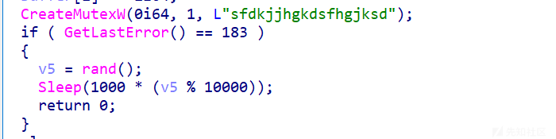

然后开始读取文件操作

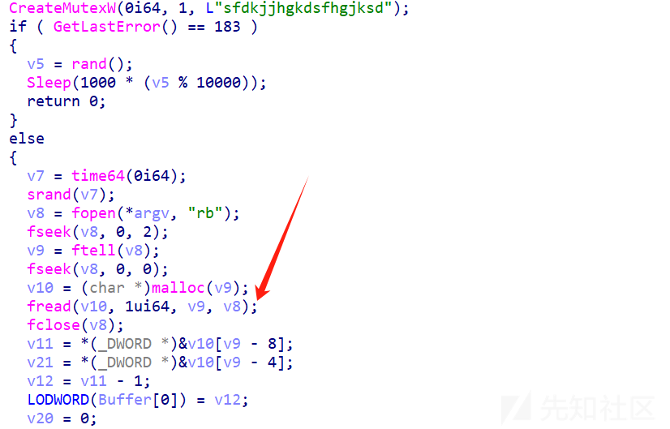

这里动态调试看一下读取的是哪一个文件，调试之前需要了解一点前置知识。文件名是作为fopen的第一个参数传递的，这是一个x64位程序，函数的第一个参数第二个参数分别放在RCX、RDX寄存器中，fopen有两个参数，第一个参数是文件路径，那么我们就动态调试看看RCX，如图说明读取的是样本自身，那么有可能真正的二阶段恶意文件就隐藏在样本自身当中（一开始我以为是CS木马就当CS马来分析了）

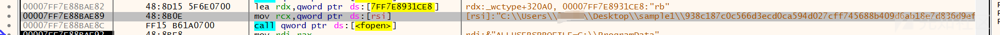

然后使用两个fseek和malloc、ftell将整个文件内容读取到了内存中，第一个fseek是获取文件末尾指针，ftell是获取文件大小，malloc是申请内存并写入内容，因此推测是将文件内容读取到内存中

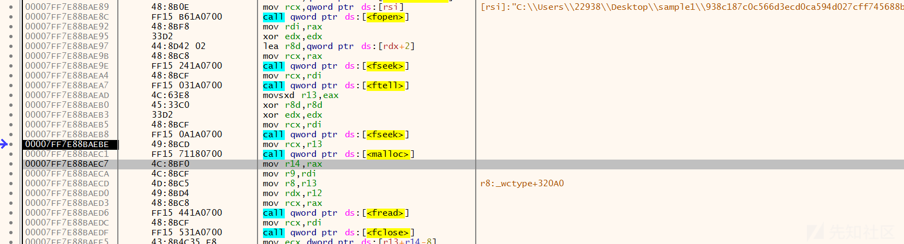

fclose之后初始化了几个变量

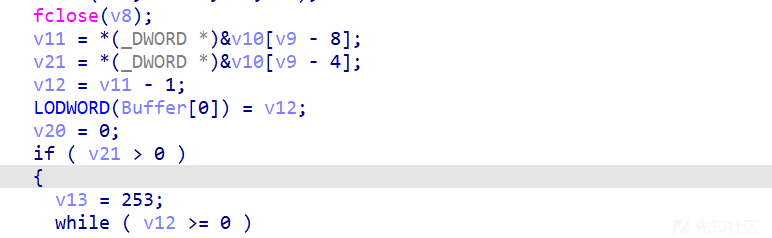

从汇编中可以看出，v11从内存中读取文件末尾倒数第8字节的DWORD值，v21读取文件末尾倒数第4字节的DWORD值，因为R13是ftell的返回值即文件大小，是R14是malloc的发挥着即内存起始地址、或者说就是文件内容的起始地址，毕竟已经把内容写入malloc

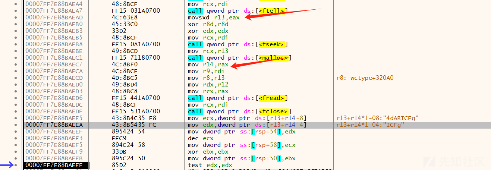

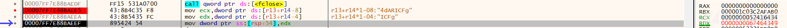

然后又开始fwrite，大小的参数值存放在R8寄存器中，根据汇编可以看出是R13-256-8

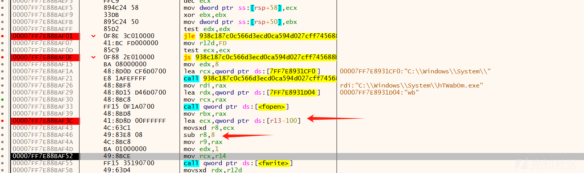

看看右边的寄存器，推测正确

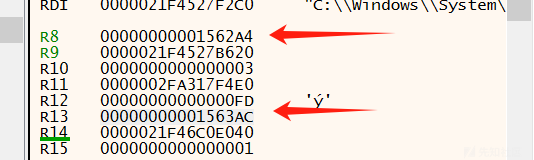

后来也经过了一次fputs和fwrite来复制一个完整的exe，但是关键代码、功能是跟样本是一样的

这里将RCX中的内容通过fputs写入文件 RCX就是一个很长的随机文件名 不知道为啥要这样

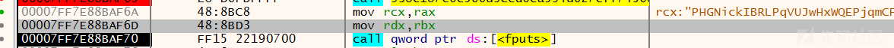

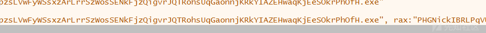

似乎是把这个文件名字给覆盖 跟了之后发现又没有变化

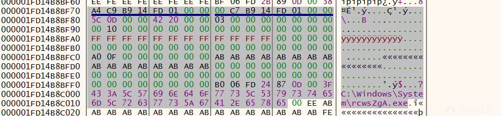

这里通过createprocess来执行exe

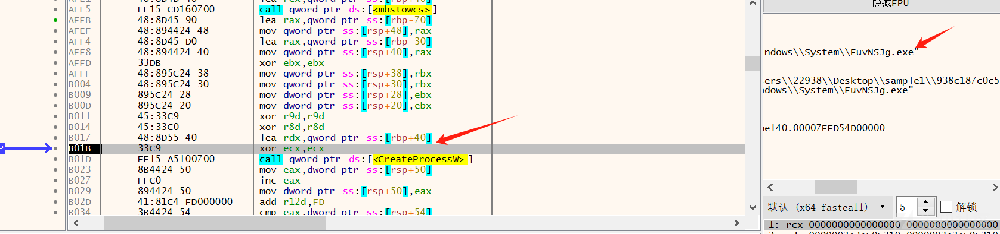

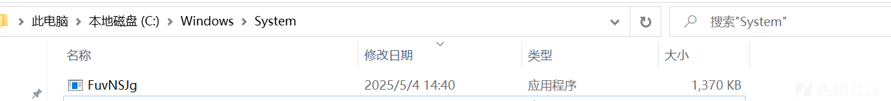

生成的exe跟一开始的样本代码是一样的但是他会循环不断生成进行自复制到C:\Windows\System\u4e2d

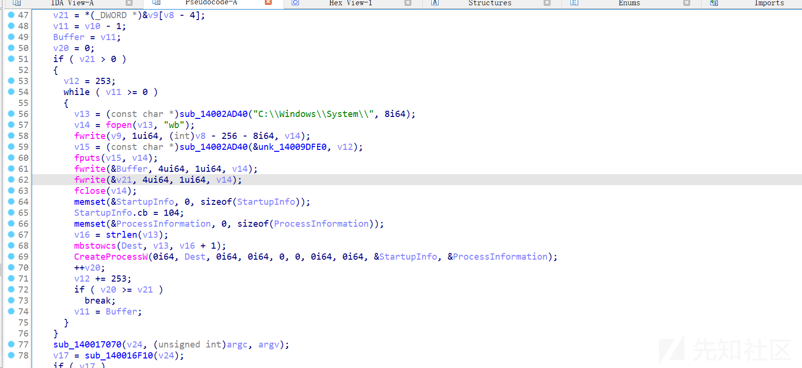

这里程序一直while循环进行自我复制，复制了很多次，如果绕过这个重复的过程呢？

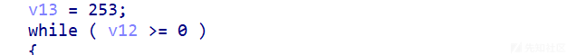

直接在复制代码区域外面下断点然后直接运行到断点位置，这是一种不过这样的话他还是会复制很多次

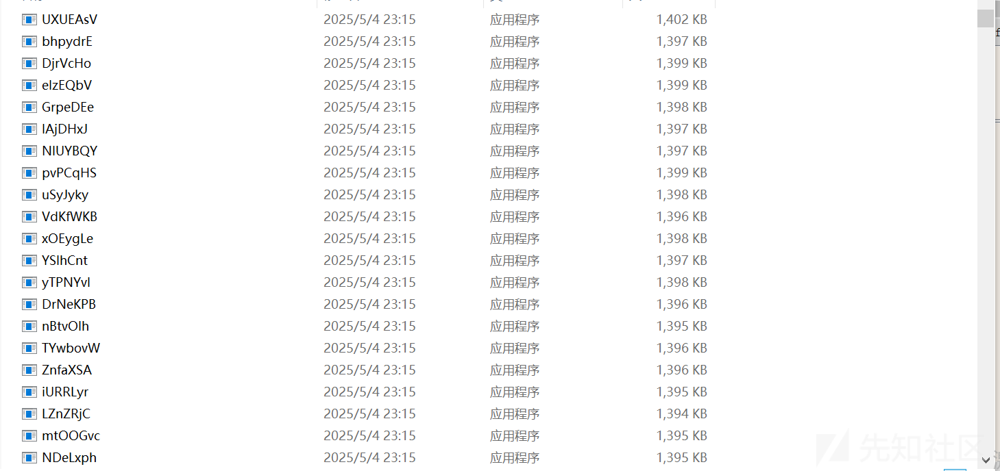

这里选择修改寄存器的方式 如图代码是通过js命令来判断次数的 判断的结果会返回给SF寄存器，如果是0则继续循环，这里直接鼠标双击设置为1就跳过循环只会进行自我复制一次了

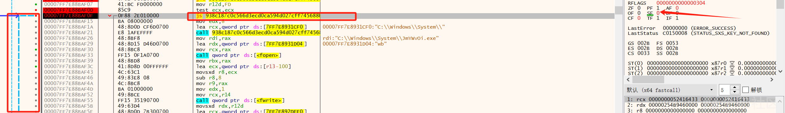

后面继续看伪代码发现了xmrig，xmrig是知名的开源矿工程序，常被恶意软件用于隐蔽挖矿

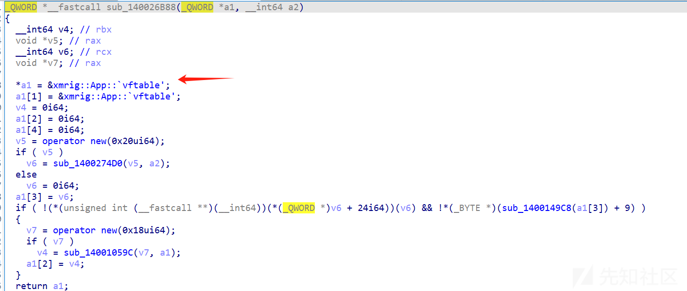

这里才发现，这实际上不是CS木马其实就是挖矿程序，只有微软报是CS木马就一直当CS木马来看了

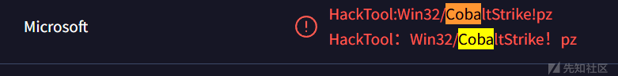

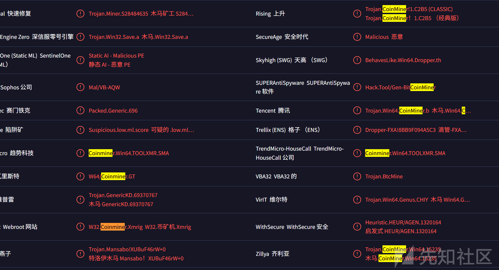

这里defender又识别是挖矿木马

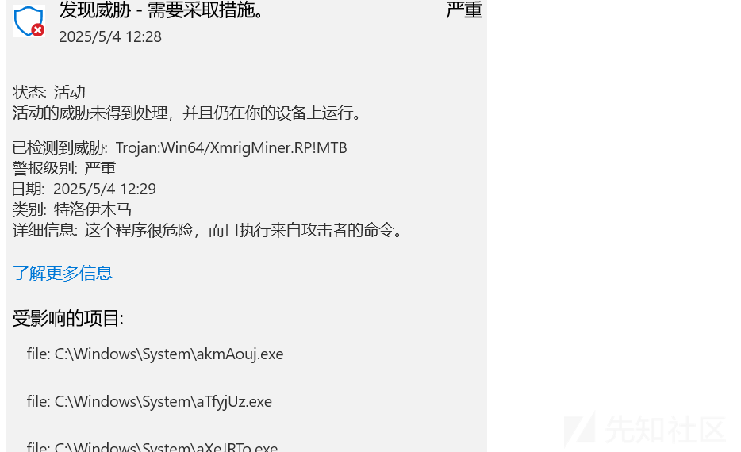

# 捕获矿池地址

确定是挖矿木马了，那就尝试找一下矿池地址吧 最简单的方式是运行然后看看wireshark，当然这存在一定风险

也可以直接ida看看字符串有没有相关的信息，如图，复制下来看看 很明显是挖矿程序的一些配置信息。其中"algo": "cn/r"：使用CryptoNight算法变种（如CryptoNightR），常用于门罗币

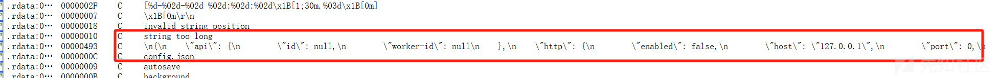

```
.rdata:000000014009DA30	00000493	C	
{
    "api": {
        "id": null,
        "worker-id": null
    },
    "http": {
        "enabled": false,
        "host": "127.0.0.1",
        "port": 0,
        "access-token": null,
        "restricted": true
    },
    "autosave": false,
    "version": 1,
    "background": false,
    "colors": true,
    "randomx": {
        "init": -1,
        "numa": true
    },
    "cpu": {
        "enabled": true,
        "huge-pages": true,
        "hw-aes": null,
        "priority": null,
        "asm": true,
        "argon2-impl": null,
        "cn/0": false,
        "cn-lite/0": false
    },
    "donate-level": 0,
    "donate-over-proxy": 1,
    "log-file": null,
    "pools": [
        {
            "algo": "cn/r",
            "url": "3.120.209.58:8080",
            "user": "x",
            "pass": "x",
            "rig-id": null,
            "nicehash": false,
            "keepalive": false..............
```

有个url：3.120.209.58:8080，pools一般就是矿池相关的参数了 微步是显示安全的 放在VT看看 有一个显示Miner也就是矿池的意思

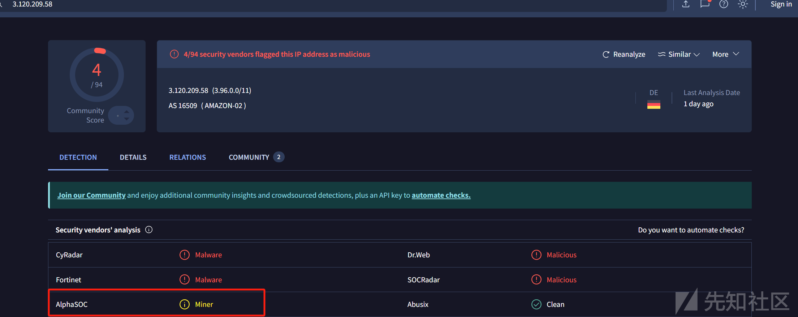

除了看字符串以外呢，我们还可以通过xdbg动态调试的方式获取矿池地址，那么我们就需要在一些进行网络连接相关的API上进行断点，然后去分析他的参数传入顺序、以及参数值，从而捕获矿池的地址，主要是找ws2\_32.dll里的API，这里面的API大多都是跟网络连接相关的，可以尝试对这些API进行断点

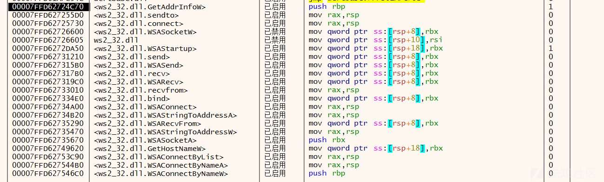

```
<ws2_32.dll.GetAddrInfoW>
<ws2_32.dll.sendto>
<ws2_32.dll.connect>
<ws2_32.dll.WSASocketW>
ws2_32.dll
<ws2_32.dll.WSAStartup>
<ws2_32.dll.send>
<ws2_32.dll.WSASend>
<ws2_32.dll.recv>
<ws2_32.dll.WSARecv>
<ws2_32.dll.recvfrom>
<ws2_32.dll.bind>
<ws2_32.dll.WSAConnect>
<ws2_32.dll.WSAStringToAddressA>
<ws2_32.dll.WSARecvFrom>
<ws2_32.dll.WSAStringToAddressW>
<ws2_32.dll.WSASocketA>
<ws2_32.dll.GetHostNameW>
<ws2_32.dll.WSAConnectByList>
<ws2_32.dll.WSAConnectByNameA>
<ws2_32.dll.WSAConnectByNameW>
```

这里开始进行动态调试，这里就进入了GetAddrInfow这个API

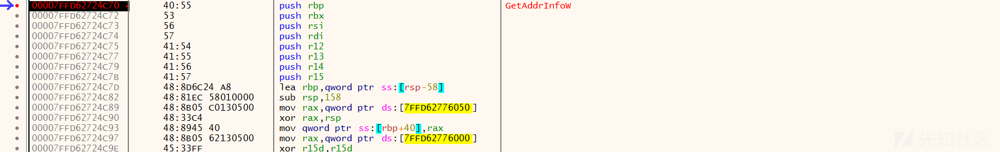

就来学习一下这个API 如图官方解释

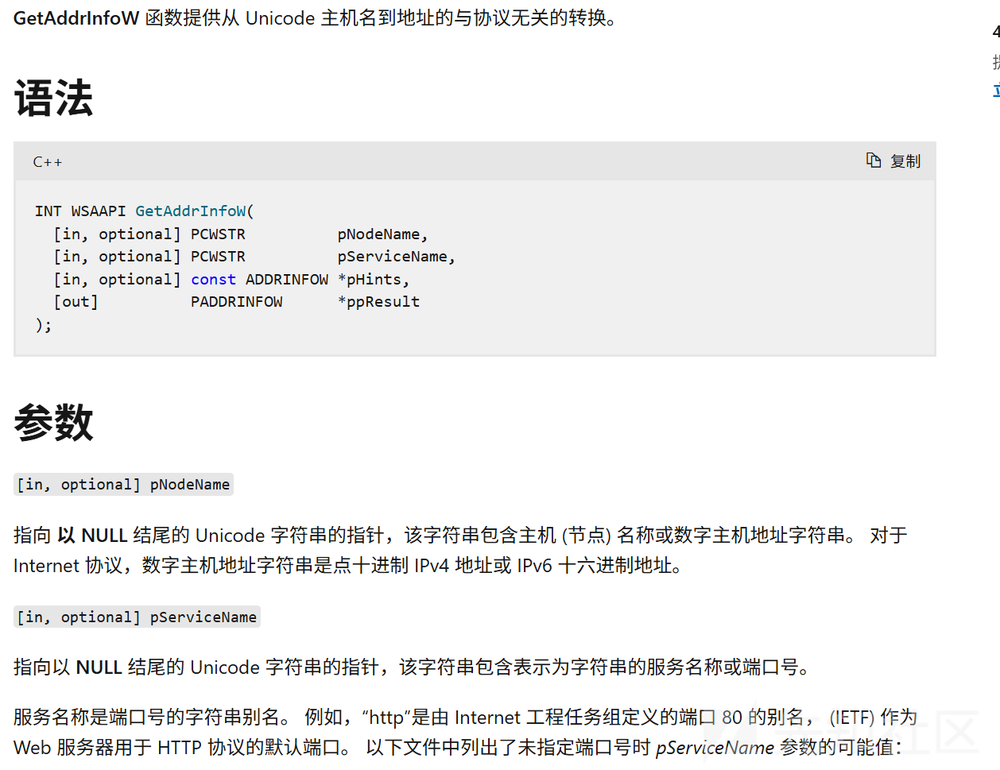

```
INT WSAAPI GetAddrInfoW(
  [in, optional] PCWSTR          pNodeName,
  [in, optional] PCWSTR          pServiceName,
  [in, optional] const ADDRINFOW *pHints,
  [out]          PADDRINFOW      *ppResult
);
```

那么第一个参数也就是矿池的IP或者域名了，根据X64的调用约定可知，第一个参数是放在RCX里的，那么我们就可以确定了，3.120.209.58:8080就是矿池地址

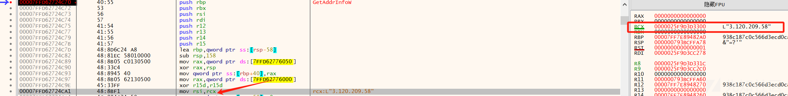
