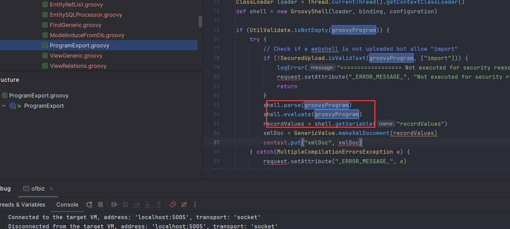
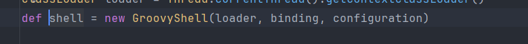

# 记一次外网打点从CVE-2023-49070到CVE-2023-51467获取域控权限的过程-先知社区

> **来源**: https://xz.aliyun.com/news/18007  
> **文章ID**: 18007

---

返回文档

信息收集  
   
端口扫描  
   
使用nmap进行端口探测，发现存在22，80，443，41525等端口开放。  
   

  
然后探测具体协议。  
   

  
Web页面  
   
访问web页面。  
   

  
发现存在web-INF接口。

  
目录爆破  
   
使用工具爆破目录。  
   

  
CVE漏洞搜索  
   
发现存在cve-2023-49070漏洞，漏洞原因是：Apache Ofbiz 18.12.09 中的预认证 RCE。这是由于 XML-RPC 不再维护而仍然存在。此问题影响 Apache OFBiz：18.12.10 之前的版本。建议用户升级到版本 18.12.10。  
   
使用poc进行测试。  
   

  
漏洞利用  
   
访问页面。  
   

  
进行漏洞利用。

  
配置环境为jdk11.  
   

  
命令执行漏洞  
   
然后使用工具进行执行命令尝试。  
   

  
反弹shell  
   
接着进行反弹shell  
   

  
升级shell权限。

  
内网信息收集  
   
接着进行内网收集，发现一个压缩包。

  
解压之后，查看压缩包内容。  
   

  
查看日志文件  
   
查看日志文件，发现存在derby.log文件。  
   

  
查看日志文件，发现存在数据库信息。  
   

  
运行IJ工具，进行枚举数据库。  
   

  
获取数据库用户hash  
   
通过翻找数据库文件，发现存在用户密码的HASH。  
   

  

  
接着进行破解用户hash。  
   

  
hash爆破  
   
尝试进行hash爆破。  
   

  
权限提升  
   
接着使用su -进行权限提升，切换到root用户。  
   
获取root.txt  
   

  
总结  
   
CVE-2023-51467  
   
影响版本  
   
Apache ofbiz applications < =18.12.10 due to xml-rpc java deserialzation bug.
多了个版本，在18.12.10中，官方移除了xmrpc组件，但是鉴权问题仍然存在，咱就是说不能一起修了。  
   
漏洞复现  
   
这一个是用groovy表达式rce，配合鉴权绕过，那么就可以访问任意接口，因此rce的可能性还是那么大。  
   
漏洞分析  
   
鉴权部分就一样了。groovy执行部分如下  
   

%22%3E%0A%20%20%20%20%20%20%20%20%20%20%20%20%3Cg%20id%3D%22%E7%BC%96%E7%BB%84-10%22%20transform%3D%22translate(729.000000%2C%207032.000000)%22%3E%0A%20%20%20%20%20%20%20%20%20%20%20%20%20%20%20%20%3Cg%20id%3D%22%E7%BC%96%E7%BB%84-15%22%20transform%3D%22translate(102.000000%2C%2046.000000)%22%3E%0A%20%20%20%20%20%20%20%20%20%20%20%20%20%20%20%20%20%20%20%20%3Cg%20id%3D%22image%E5%A4%87%E4%BB%BD%22%3E%0A%20%20%20%20%20%20%20%20%20%20%20%20%20%20%20%20%20%20%20%20%20%20%20%20%3Crect%20id%3D%22%E7%9F%A9%E5%BD%A2%22%20fill%3D%22%23000000%22%20fill-rule%3D%22nonzero%22%20opacity%3D%220%22%20x%3D%220%22%20y%3D%220%22%20width%3D%2216%22%20height%3D%2216%22%3E%3C%2Frect%3E%0A%20%20%20%20%20%20%20%20%20%20%20%20%20%20%20%20%20%20%20%20%20%20%20%20%3Cpath%20d%3D%22M2.125%2C12.375%20L2.125%2C10.4960156%20L4.194125%2C8.042375%20C4.24407812%2C7.98315625%204.33529688%2C7.98315625%204.38525%2C8.042375%20L6.63471875%2C10.7098437%20L10.1869531%2C6.49754687%20C10.2369063%2C6.43832812%2010.328125%2C6.43832812%2010.3780781%2C6.49754687%20L13.875%2C10.64425%20L13.875%2C12.375%20L13.875%2C3.625%20L2.125%2C3.625%20L2.125%2C12.375%20Z%20M1.5%2C2.5%20L14.5%2C2.5%20C14.7761406%2C2.5%2015%2C2.72385937%2015%2C3%20L15%2C13%20C15%2C13.2761406%2014.7761406%2C13.5%2014.5%2C13.5%20L1.5%2C13.5%20C1.22385937%2C13.5%201%2C13.2761406%201%2C13%20L1%2C3%20C1%2C2.72385937%201.22385937%2C2.5%201.5%2C2.5%20Z%20M4.75%2C7%20C4.05964063%2C7%203.5%2C6.44035937%203.5%2C5.75%20C3.5%2C5.05964063%204.05964063%2C4.5%204.75%2C4.5%20C5.44035937%2C4.5%206%2C5.05964063%206%2C5.75%20C6%2C6.44035937%205.44035937%2C7%204.75%2C7%20Z%22%20id%3D%22%E5%BD%A2%E7%8A%B6%22%20fill%3D%22%238C8C8C%22%3E%3C%2Fpath%3E%0A%20%20%20%20%20%20%20%20%20%20%20%20%20%20%20%20%20%20%20%20%3C%2Fg%3E%0A%20%20%20%20%20%20%20%20%20%20%20%20%20%20%20%20%20%20%20%20%3Cg%20id%3D%22alert-fill%22%20transform%3D%22translate(9.000000%2C%207.000000)%22%3E%0A%20%20%20%20%20%20%20%20%20%20%20%20%20%20%20%20%20%20%20%20%20%20%20%20%3Cpath%20d%3D%22M4.870227%2C0.216197695%20L8.94272401%2C7.35134981%20C9.01909103%2C7.48514349%209.01909206%2C7.64998385%208.94272672%2C7.78377851%20C8.86636138%2C7.91757317%208.72523106%2C8%208.57249701%2C8%20L0.427502991%2C8%20C0.274768942%2C8%200.133638625%2C7.91757317%200.0572732809%2C7.78377851%20C-0.0190920629%2C7.64998385%20-0.0190910287%2C7.48514349%200.0572759941%2C7.35134981%20L4.129773%2C0.216197695%20C4.20614384%2C0.0824130438%204.34727177%2C0%204.5%2C0%20C4.65272823%2C0%204.79385616%2C0.0824130438%204.870227%2C0.216197695%20Z%22%20id%3D%22%E5%BD%A2%E7%8A%B6%22%20fill%3D%22%23F7D844%22%3E%3C%2Fpath%3E%0A%20%20%20%20%20%20%20%20%20%20%20%20%20%20%20%20%20%20%20%20%20%20%20%20%3Cpolygon%20id%3D%22%E8%B7%AF%E5%BE%84%22%20fill%3D%22%23FFFFFF%22%20points%3D%224.07248614%205.8378327%204.07248614%206.70269962%204.92751386%206.70269962%204.92751386%205.8378327%22%3E%3C%2Fpolygon%3E%0A%20%20%20%20%20%20%20%20%20%20%20%20%20%20%20%20%20%20%20%20%20%20%20%20%3Cpolygon%20id%3D%22%E8%B7%AF%E5%BE%84%22%20fill%3D%22%23FFFFFF%22%20points%3D%224.07248614%202.81079846%204.07248614%204.97296577%204.92751386%204.97296577%204.92751386%202.81079846%204.07248614%202.81079846%22%3E%3C%2Fpolygon%3E%0A%20%20%20%20%20%20%20%20%20%20%20%20%20%20%20%20%20%20%20%20%3C%2Fg%3E%0A%20%20%20%20%20%20%20%20%20%20%20%20%20%20%20%20%3C%2Fg%3E%0A%20%20%20%20%20%20%20%20%20%20%20%20%3C%2Fg%3E%0A%20%20%20%20%20%20%20%20%3C%2Fg%3E%0A%20%20%20%20%3C%2Fg%3E%0A%3C%2Fsvg%3E%0A)

图片加载失败

获取groovyparam然后执行。

%22%3E%0A%20%20%20%20%20%20%20%20%20%20%20%20%3Cg%20id%3D%22%E7%BC%96%E7%BB%84-10%22%20transform%3D%22translate(729.000000%2C%207032.000000)%22%3E%0A%20%20%20%20%20%20%20%20%20%20%20%20%20%20%20%20%3Cg%20id%3D%22%E7%BC%96%E7%BB%84-15%22%20transform%3D%22translate(102.000000%2C%2046.000000)%22%3E%0A%20%20%20%20%20%20%20%20%20%20%20%20%20%20%20%20%20%20%20%20%3Cg%20id%3D%22image%E5%A4%87%E4%BB%BD%22%3E%0A%20%20%20%20%20%20%20%20%20%20%20%20%20%20%20%20%20%20%20%20%20%20%20%20%3Crect%20id%3D%22%E7%9F%A9%E5%BD%A2%22%20fill%3D%22%23000000%22%20fill-rule%3D%22nonzero%22%20opacity%3D%220%22%20x%3D%220%22%20y%3D%220%22%20width%3D%2216%22%20height%3D%2216%22%3E%3C%2Frect%3E%0A%20%20%20%20%20%20%20%20%20%20%20%20%20%20%20%20%20%20%20%20%20%20%20%20%3Cpath%20d%3D%22M2.125%2C12.375%20L2.125%2C10.4960156%20L4.194125%2C8.042375%20C4.24407812%2C7.98315625%204.33529688%2C7.98315625%204.38525%2C8.042375%20L6.63471875%2C10.7098437%20L10.1869531%2C6.49754687%20C10.2369063%2C6.43832812%2010.328125%2C6.43832812%2010.3780781%2C6.49754687%20L13.875%2C10.64425%20L13.875%2C12.375%20L13.875%2C3.625%20L2.125%2C3.625%20L2.125%2C12.375%20Z%20M1.5%2C2.5%20L14.5%2C2.5%20C14.7761406%2C2.5%2015%2C2.72385937%2015%2C3%20L15%2C13%20C15%2C13.2761406%2014.7761406%2C13.5%2014.5%2C13.5%20L1.5%2C13.5%20C1.22385937%2C13.5%201%2C13.2761406%201%2C13%20L1%2C3%20C1%2C2.72385937%201.22385937%2C2.5%201.5%2C2.5%20Z%20M4.75%2C7%20C4.05964063%2C7%203.5%2C6.44035937%203.5%2C5.75%20C3.5%2C5.05964063%204.05964063%2C4.5%204.75%2C4.5%20C5.44035937%2C4.5%206%2C5.05964063%206%2C5.75%20C6%2C6.44035937%205.44035937%2C7%204.75%2C7%20Z%22%20id%3D%22%E5%BD%A2%E7%8A%B6%22%20fill%3D%22%238C8C8C%22%3E%3C%2Fpath%3E%0A%20%20%20%20%20%20%20%20%20%20%20%20%20%20%20%20%20%20%20%20%3C%2Fg%3E%0A%20%20%20%20%20%20%20%20%20%20%20%20%20%20%20%20%20%20%20%20%3Cg%20id%3D%22alert-fill%22%20transform%3D%22translate(9.000000%2C%207.000000)%22%3E%0A%20%20%20%20%20%20%20%20%20%20%20%20%20%20%20%20%20%20%20%20%20%20%20%20%3Cpath%20d%3D%22M4.870227%2C0.216197695%20L8.94272401%2C7.35134981%20C9.01909103%2C7.48514349%209.01909206%2C7.64998385%208.94272672%2C7.78377851%20C8.86636138%2C7.91757317%208.72523106%2C8%208.57249701%2C8%20L0.427502991%2C8%20C0.274768942%2C8%200.133638625%2C7.91757317%200.0572732809%2C7.78377851%20C-0.0190920629%2C7.64998385%20-0.0190910287%2C7.48514349%200.0572759941%2C7.35134981%20L4.129773%2C0.216197695%20C4.20614384%2C0.0824130438%204.34727177%2C0%204.5%2C0%20C4.65272823%2C0%204.79385616%2C0.0824130438%204.870227%2C0.216197695%20Z%22%20id%3D%22%E5%BD%A2%E7%8A%B6%22%20fill%3D%22%23F7D844%22%3E%3C%2Fpath%3E%0A%20%20%20%20%20%20%20%20%20%20%20%20%20%20%20%20%20%20%20%20%20%20%20%20%3Cpolygon%20id%3D%22%E8%B7%AF%E5%BE%84%22%20fill%3D%22%23FFFFFF%22%20points%3D%224.07248614%205.8378327%204.07248614%206.70269962%204.92751386%206.70269962%204.92751386%205.8378327%22%3E%3C%2Fpolygon%3E%0A%20%20%20%20%20%20%20%20%20%20%20%20%20%20%20%20%20%20%20%20%20%20%20%20%3Cpolygon%20id%3D%22%E8%B7%AF%E5%BE%84%22%20fill%3D%22%23FFFFFF%22%20points%3D%224.07248614%202.81079846%204.07248614%204.97296577%204.92751386%204.97296577%204.92751386%202.81079846%204.07248614%202.81079846%22%3E%3C%2Fpolygon%3E%0A%20%20%20%20%20%20%20%20%20%20%20%20%20%20%20%20%20%20%20%20%3C%2Fg%3E%0A%20%20%20%20%20%20%20%20%20%20%20%20%20%20%20%20%3C%2Fg%3E%0A%20%20%20%20%20%20%20%20%20%20%20%20%3C%2Fg%3E%0A%20%20%20%20%20%20%20%20%3C%2Fg%3E%0A%20%20%20%20%3C%2Fg%3E%0A%3C%2Fsvg%3E%0A)

图片加载失败

​
