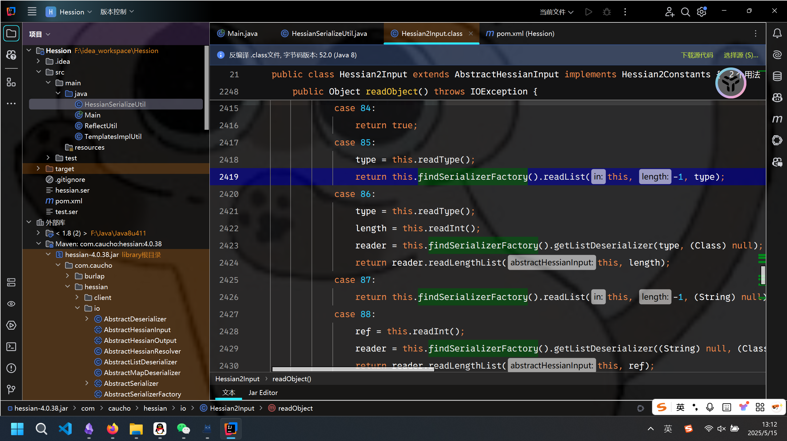
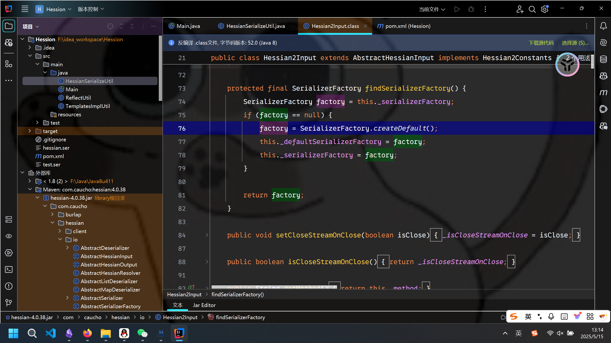
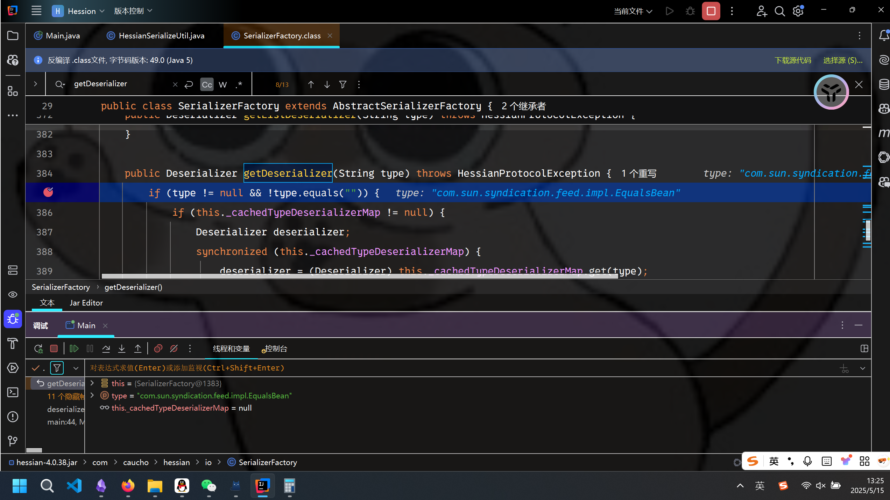
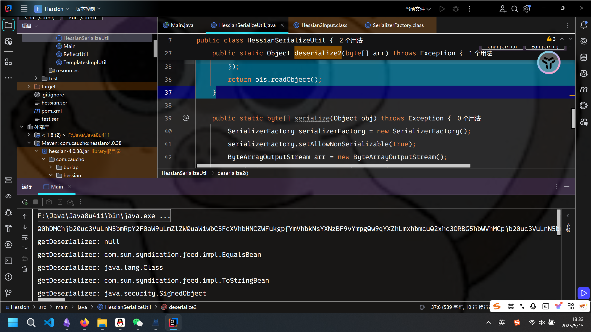

# 从原生反序列化到Hessian反序列化的hook方法-先知社区

> **来源**: https://xz.aliyun.com/news/18008  
> **文章ID**: 18008

---

在CTF线下赛中，经常有需要去hook Java反序列化题目的需要。虽然网上存在许多hook Javanative反序列化的文章，然而却没有针对Hessian反序列化的讲解。本文着重讨论Hessian的hook方式。

### Hook Java Native Deserialize

这是最常见的，也是网上文章最多的情境。通常情况下，我们通过重写ObjectInputStream的resolveClass方法来hook原生反序列化。

在awdp等线下赛事中，修复速度显得尤为重要，早修一轮就能早吃一轮分。因此我们hook的方法通常要求最小化改动和预先准备，最好是能够直接ctrl c + ctrl v直接修复。

由于通过JarEditor等方式去反编译并直接修改字节码并不是非常的方便（相对源码而言），因此我们通常使用匿名内部类的方式来进行修复，确保不用创建其他的类。

下面是我使用的一个简单的实例，成功在信安国赛和软件赛的半决赛中拿下了二血三血。

```
ObjectInputStream objectInputStream = new ObjectInputStream(bytes){
                @Override
                protected Class<?> resolveClass(ObjectStreamClass desc) throws IOException, ClassNotFoundException {
                    Set<String> BLACKLISTED_CLASSES = new HashSet();
                    BLACKLISTED_CLASSES.add("java.lang.Runtime");
                    BLACKLISTED_CLASSES.add("java.lang.ProcessBuilder");
                    BLACKLISTED_CLASSES.add("com.sun.org.apache.xalan.internal.xsltc.trax.TemplatesImpl");
                    BLACKLISTED_CLASSES.add("java.security.SignedObject");
                    BLACKLISTED_CLASSES.add("com.sun.jndi.ldap.LdapAttribute");
                    BLACKLISTED_CLASSES.add("org.apache.commons.collections.functors.InvokerTransformer");
                    BLACKLISTED_CLASSES.add("org.apache.commons.collections.map.LazyMap");
                    BLACKLISTED_CLASSES.add("org.apache.commons.collections4.functors.InvokerTransformer");
                    BLACKLISTED_CLASSES.add("org.apache.commons.collections4.map.LazyMap");
                    BLACKLISTED_CLASSES.add("javax.management.BadAttributeValueExpException");
                    BLACKLISTED_CLASSES.add("org.springframework.context.support");
BLACKLISTED_CLASSES.add("com.sun.rowset.JdbcRowSetImpl");                  BLACKLISTED_CLASSES.add("com.sun.corba.se.impl.activation");  
BLACKLISTED_CLASSES.add("java.rmi");  
BLACKLISTED_CLASSES.add("javax.naming.InitialContext");
                    if (BLACKLISTED_CLASSES.contains(desc.getName())) {
                        throw new SecurityException("");
                    }
                    return super.resolveClass(desc);
                }
            };
```

实际上，这个黑名单完全可以做的更大，至少可以包含Java-chains中的每条链的一个节点。

### Hessian Deserialize

##### 遇到的问题

然而，我翻了好多好多文章，没有人提到如何修复Hessian反序列化。而在一些存在waf的题目中，也通常是直接对传入的base64字符串进行解码检测。

这种方法的便利性暂且不谈，在x1orz师傅提出了Hessian UTF-8 Overlong Encoding的攻击方式后，直接解码检测的方式变的不安全了，并不能保证check的脚步中不包含Overlong Encoding的payload。

因此我们也希望找到一个方法，能够像resolveClass一样获取到每个类的类名，然后在其中进行判断。

##### SerializerFactory

我们断点调试一下Hessian2Input中的readObject方法，看到其中的很多case处的逻辑都调用了findSerializerFactor方法。

跟进看一下findSerializerFactory的具体内容：



发现其实际上就是返回了一个SerializerFactory。那么什么是SerializerFactory？

在Hessian中，不同的类在进行反序列化的时候可能会使用不同的反序列化器(Deserializer），而SerializerFactory就是管理他们的工厂类。

在SerializerFactory类中存在getDeserializer方法如下：

```
public Deserializer getDeserializer(Class cl) throws HessianProtocolException {
        Deserializer deserializer;
        if (this._cachedDeserializerMap != null) {
            deserializer = (Deserializer)this._cachedDeserializerMap.get(cl);
            if (deserializer != null) {
                return deserializer;
            }
        }

        deserializer = this.loadDeserializer(cl);
        if (this._cachedDeserializerMap == null) {
            this._cachedDeserializerMap = new ConcurrentHashMap(8);
        }

        this._cachedDeserializerMap.put(cl, deserializer);
        return deserializer;
    }

public Deserializer getDeserializer(String type) throws HessianProtocolException {
        if (type != null && !type.equals("")) {
            if (this._cachedTypeDeserializerMap != null) {
                Deserializer deserializer;
                synchronized(this._cachedTypeDeserializerMap) {
                    deserializer = (Deserializer)this._cachedTypeDeserializerMap.get(type);
                }

                if (deserializer != null) {
                    return deserializer;
                }
            }

            Deserializer deserializer = (Deserializer)_staticTypeMap.get(type);
            if (deserializer != null) {
                return (Deserializer)deserializer;
            } else {
                if (type.startsWith("[")) {
                    Deserializer subDeserializer = this.getDeserializer(type.substring(1));
                    if (subDeserializer != null) {
                        deserializer = new ArrayDeserializer(subDeserializer.getType());
                    } else {
                        deserializer = new ArrayDeserializer(Object.class);
                    }
                } else {
                    try {
                        Class cl = Class.forName(type, false, this.getClassLoader());
                        deserializer = this.getDeserializer(cl);
                    } catch (Exception var7) {
                        Exception e = var7;
                        log.warning("Hessian/Burlap: '" + type + "' is an unknown class in " + this.getClassLoader() + ":
" + e);
                        log.log(Level.FINER, e.toString(), e);
                    }
                }

                if (deserializer != null) {
                    if (this._cachedTypeDeserializerMap == null) {
                        this._cachedTypeDeserializerMap = new HashMap(8);
                    }

                    synchronized(this._cachedTypeDeserializerMap) {
                        this._cachedTypeDeserializerMap.put(type, deserializer);
                    }
                }

                return (Deserializer)deserializer;
            }
        } else {
            return null;
        }
    }
```

猜测两者功能相同（或是至少是相互配合的），在getDeserializer(String type)处打一个断点调试一下：可以看到此时的type就是反序列化时用到了类名。

此时我们针对这个方法去进行hook发现可以成功阻拦非法序列化数据。

实际上，在getDeserializer(Class cl)处进行hook也是可以的，还有一些其他的方法可以使用，这里就不介绍了。

##### setSerializerFactory

然而去修改Hessian包内的方法终究是不太方便（idea在反编译字节码的时候会出现变量名冲突等问题），因此我们还是希望能够通过一个匿名内部类来实现。

在Hessian2Input中我们找到了setSerializerFactory这个方法：

```
public void setSerializerFactory(SerializerFactory factory) {
        this._serializerFactory = factory;
    }
```

可以直接指定反序列化的时候使用的\_serializerFactory。那么我们此时完全可以去指定其为一个我们通过匿名内部类创建的serializerFactory对象，然后重写其中的getDeserializer。

```
public static Object deserialize2(byte[] arr) throws Exception {
        ByteArrayInputStream input = new ByteArrayInputStream(arr);
        Hessian2Input ois = new Hessian2Input(input);
        ois.setSerializerFactory(new SerializerFactory() {
            public Deserializer getDeserializer(String type) throws HessianException, HessianProtocolException {
                System.out.println("getDeserializer: " + type);
                return super.getDeserializer(type);
            }
        });
        return ois.readObject();
    }
```

测试：

那么我们就可以通过创建一个Hashset的BLACKLISTED\_CLASSES，然后向其中添加黑名单来进行防御了。

### Hessian通防

那么最后我构建了一个在awdp等线下赛中使用的Hessian反序列化黑名单通防，希望能够针对恶意反序列化中的节点进行匹配和防御，但是不去误伤其他的类（不能针对集合类进行防御）。

下面是根据Java-chains构建的：

```
ByteArrayInputStream input = new ByteArrayInputStream(arr);
        Hessian2Input ois = new Hessian2Input(input);
        ois.setSerializerFactory(new SerializerFactory() {
            public Deserializer getDeserializer(String type) throws HessianException, HessianProtocolException {
                Set<String> BLACKLISTED_CLASSES = new HashSet();
                BLACKLISTED_CLASSES.add("java.lang.Runtime");
                BLACKLISTED_CLASSES.add("java.lang.ProcessBuilder");
                BLACKLISTED_CLASSES.add("javax.management.BadAttributeValueExpException");
                BLACKLISTED_CLASSES.add("com.sun.org.apache.xalan.internal.xsltc.trax.TemplatesImpl");
                BLACKLISTED_CLASSES.add("java.security.SignedObject");
                BLACKLISTED_CLASSES.add("com.sun.jndi.ldap.LdapAttribute");
                BLACKLISTED_CLASSES.add("com.sun.rowset.JdbcRowSetImpl");
                BLACKLISTED_CLASSES.add("javax.naming.InitialContext");
                BLACKLISTED_CLASSES.add("org.apache.commons.collections.functors.InvokerTransformer");
                BLACKLISTED_CLASSES.add("org.springframework.aop.framework.JdkDynamicAopProxy");
                BLACKLISTED_CLASSES.add("org.springframework.aop.aspectj");
                BLACKLISTED_CLASSES.add("org.apache.xbean.naming.context");
                BLACKLISTED_CLASSES.add("JSONArray");
                BLACKLISTED_CLASSES.add("POJONode");
                BLACKLISTED_CLASSES.add("ToStringBean");
                BLACKLISTED_CLASSES.add("EqualsBean");
                BLACKLISTED_CLASSES.add("ProxyLazyValue");
                BLACKLISTED_CLASSES.add("SwingLazyValue");
                BLACKLISTED_CLASSES.add("UIDefaults");
                BLACKLISTED_CLASSES.add("XString");
                BLACKLISTED_CLASSES.add("org.springframework.cache.interceptor.BeanFactoryCacheOperationSourceAdvisor");
                BLACKLISTED_CLASSES.add("org.springframework.aop.aspectj.AspectInstanceFactory");
                BLACKLISTED_CLASSES.add("org.slf4j");
                BLACKLISTED_CLASSES.add("groovy");
                BLACKLISTED_CLASSES.add("sun.print.UnixPrintService");
                if (BLACKLISTED_CLASSES.contains(type)) {
                    throw new SecurityException("");
                }
                return super.getDeserializer(type);
            }
        });
        return ois.readObject();
```

如果不是很懂Java的可以上来直接套一下通防试试，能够防住绝大多数链子，防不住的话就自己再添加吧。

​

参考：

<https://github.com/vulhub/java-chains>
