# 高版本Fastjson：Getter调用限制及绕过方式探究-先知社区

> **来源**: https://xz.aliyun.com/news/18013  
> **文章ID**: 18013

---

返回文档

前言  
   
前面提及到了，在fastjson或者jackson中存在有原生的反序列化链Gadgets，能够触发任意对象的getter方法，而在高版本中同样对之前的方式进行了一系列的限制，那么该如何绕过这类限制呢？  
   
高版本getter调用失败  
   
jackson json库测试  
   
首先测试一下使用JsonNode#toString这一个链子作为反序列化Gadget的一部分，测试jackson是否对原生的反序列化链进行了限制  
   
首先将jackson版本依赖更新到最新的版本号：  
   

  
使用yomap框架生成序列化payload  
   

  
值得注意的是，在生成序列化数据的过程中，需要bypass一下writeReplace方法的检查，避免在序列化过程中，在ObjectOuptputStream#writeObject0中检查序列化类是否存在writeObject方法而导致不能够成功序列化原始的对象，导致序列化过程失败（具体可看上篇文章如何解决的）  
   
最后能够成功的反序列化ysomap生成的序列化数据进行命令执行  
   

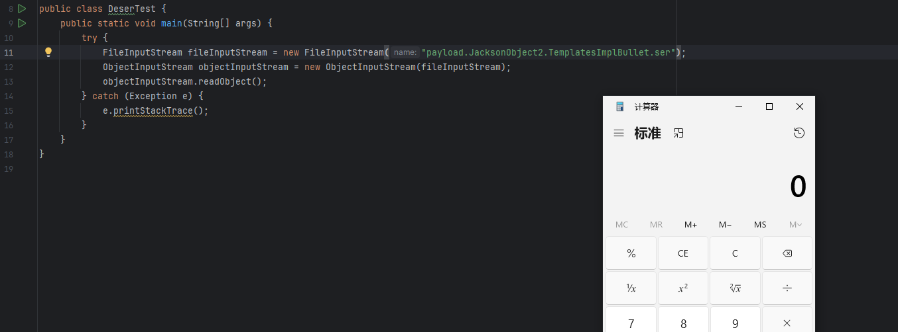

  
说明jackson在最新版本中仍然可以使用该链子  
   
fastjson 测试  
   
对于fastjson来讲，从2.0.27版本开始，其在原生反序列化的过程中设置了黑名单限制，在黑名单中的类并不会被调用getter方法  
   
我们这里直接使用fastjson 2.0.27进行测试，同样使用yomap反序列化框架  
   
修改fastjson版本  
   

  
使用ysomap的脚本模式进行序列化数据生成  
   

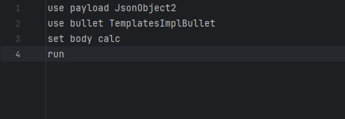

  
进行反序列化调用  
   

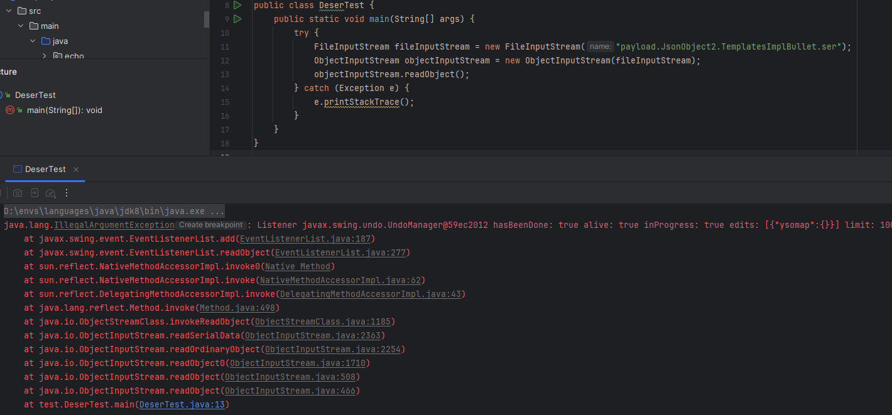

  
并不能够成功使用该方式触发反序列化漏洞  
   
fastjson中2.0.27版本开始，在toString调用的必经之路上设置了黑名单检查，如果调用的类在黑名单中则忽视对应的调用过程，具体可见BeanUtils#ignore方法  
   
从反序列化入口到黑名单检查的调用栈如下：  
   
fastjson黑名单检查流程分析  
   
Gadget的前半部分是通过EventListenerList类add方法在抛出异常时的触发toString调用，进而触发了JSONObject#toString方法  
   

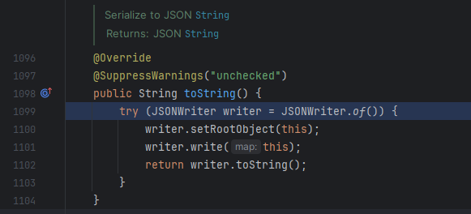

  
这个方法用来将对象序列化成JSON字符串，这里会调用JSONWriter#of方法，在利用getObjectReader方法进行对象阅读器的获取时，将会调用isExtendedMap方法判断待处理的类是否是Map相关类  
   

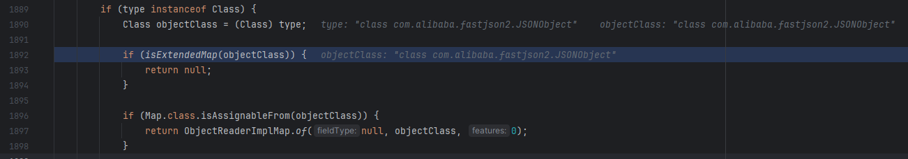

  
此时的处理的类为最外层的类JSONObject  
   

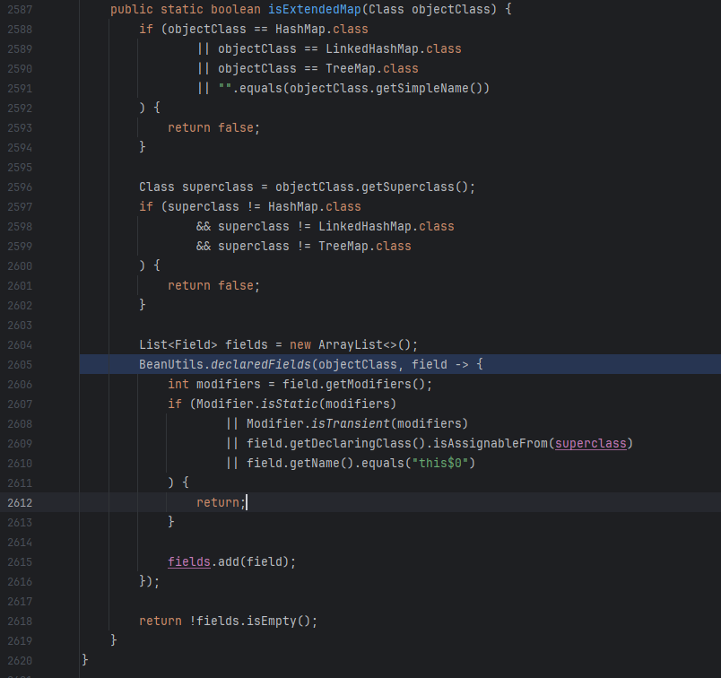

  
这里从类本身和父类两个角度进行了判断，同时，调用了BeanUtils#declaredFields用来忽视静态属性  
   

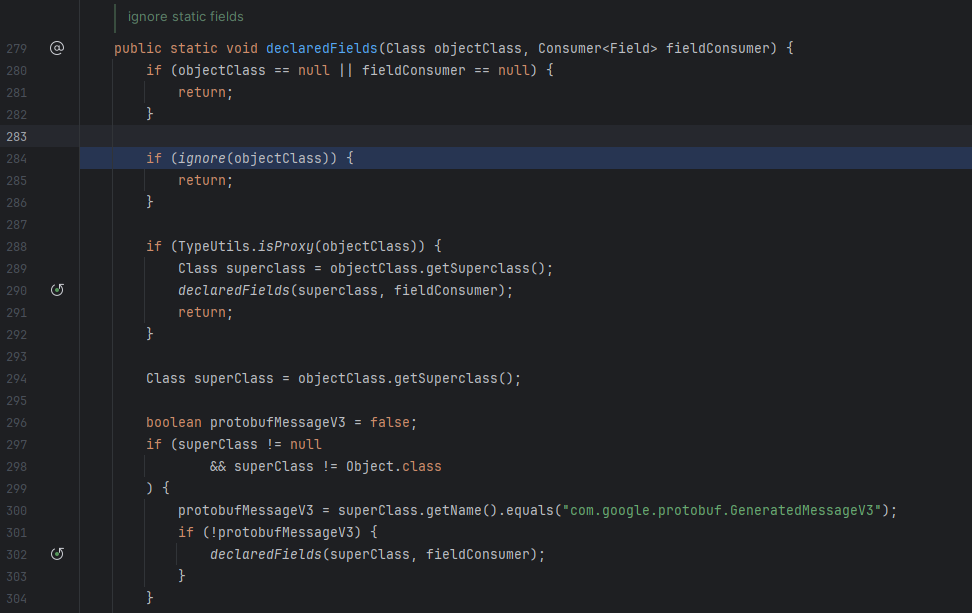

  
1 在这个过程中，官方设置了一个ignore方法用来过滤掉黑名单的类   
   

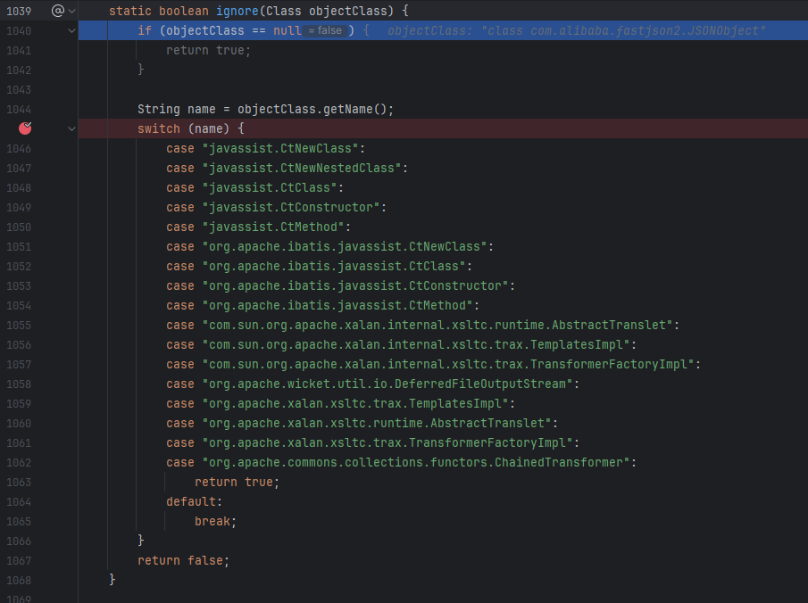

  
在该版本的fastjson，黑名单的内容为明文，后续版本的黑名单为hash值  
    
2 在对类名进行黑名单检查之后，将会判断待处理的类是否是代理类，如果是，将会解析其代理的类，其流程如下：首先调用TypeUtils.isProxy方法进行代理类的判断

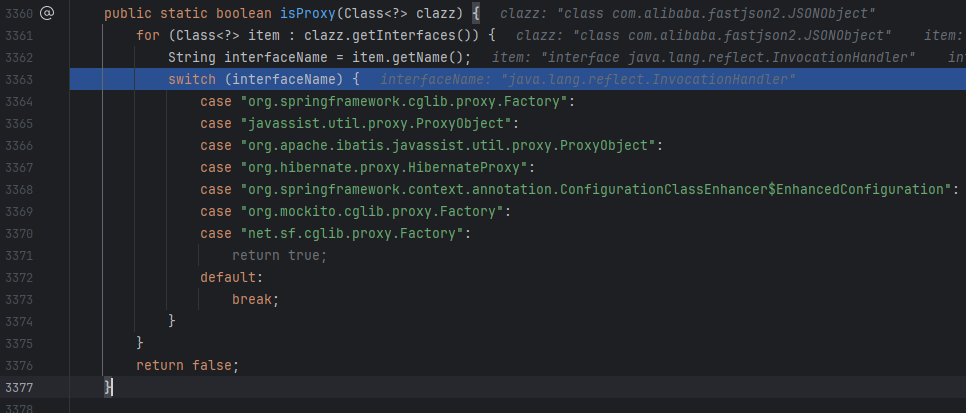

具体来说，就是遍历待处理类的所有接口，判断是否存在接口在名单内若待处理的类是代理类，将在获取它的父类之后再次调用declaredFields方法进行相同逻辑的检查，后续则不对这个代理类进行任何处理   
   
3 在通过了上述检查之后，同样会递归的对待处理类的所有父类进行declaredFields调用，在父类均处理完毕后，会对该类进行处理   
    
核心黑名单检查流程  
   
回到JSONObject#toString方法中  
   

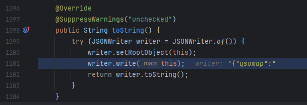

  
上述流程是在JSONWriter.of的调用过程中触发的对JSONObject的检查，真实的对于恶意类的检查是在获取了JSONWriter对象之后，将JSONObject设置为根对象之后，通过JSONWriter#writer方法对JSONObject对象进行序列化的过程中触发的  
   
调用栈为：  
   
在ObjectWriterCreatorASM#createObjectWriter方法中将会调用BeanUtils.declaredFields对类属性进行处理，进而也到了前面的检查JSONObject对象类似的逻辑  
   

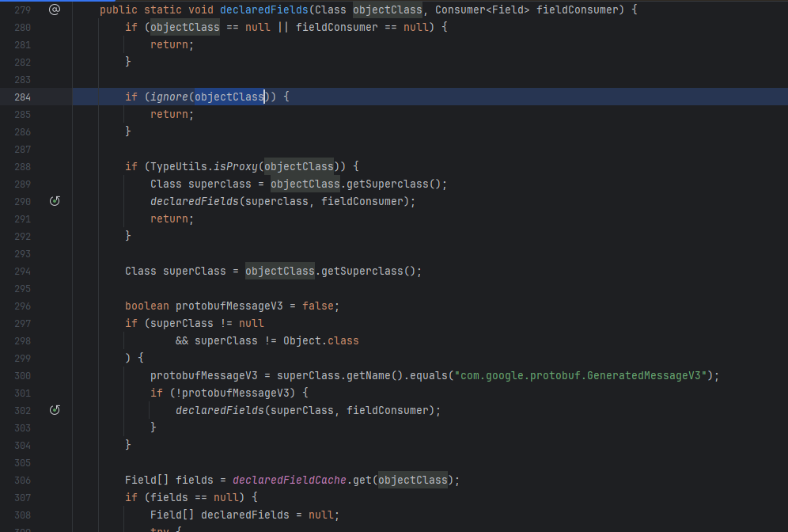

  
因为被黑名单强制拦截，其跳过了处理TemplateImpl类的步骤，则在最后通过ASM生成的字节码并没有调用TemplateImpl#getOutputProperties的过程，则不能够触发反序列化漏洞命令执行  
   
fastjson 2.0.54黑名单  
   
通过替换<https://github.com/LeadroyaL/fastjson-blacklist项目的hash计算方式，对fastjson> 2.0.54中的黑名单hash值进行破解  
   

  
通过魔改的fastjson-blacklist项目，可跑出所有的黑名单类  
   

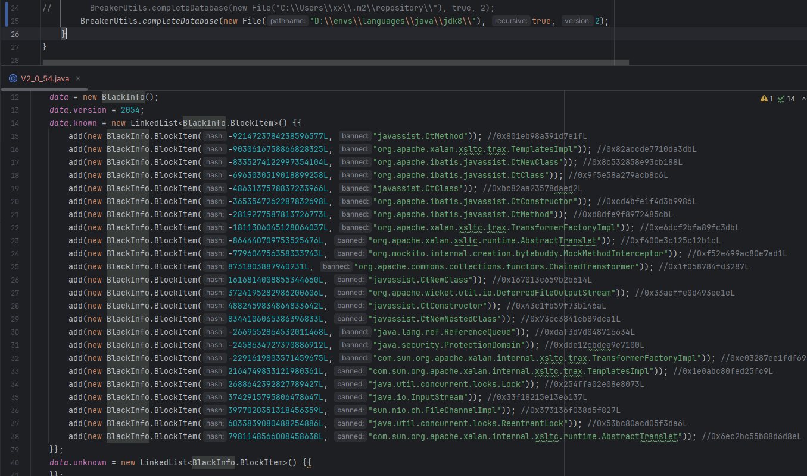

  
绕过高版本fastjson getter调用限制  
   
黑名单绕过  
   
既然设置了黑名单过滤的方式进行防御，类似于fastjson1.2.x系列的绕过方式，可以采用黑名单绕过的方式进行bypass  
   
也即是寻找不在黑名单的类，且其getter方法能够作为sink点  
   
参考文献中提到了两种，分别是依赖com.mchange:mchange-commons-java的com.mchange.v2.naming.ReferenceIndirector$ReferenceSerialized类和JDK下的LdapAttribute#getAttributeDefinition方法，其实还存在很多不在黑名单中的类可以作为sink点，例如  
    
1sun.print.UnixPrintServiceLookup#getDefaultPrintService  
   
2javax.naming.spiContinuationDirContext#getTargetContext  
   
3com.sun.media.sound.JARSoundbankReader#getSoundbank  
   
4....  
    
fastjson原生反序列化Gadget中的getter调用问题  
   
jackson的不稳定getter调用  
   
通过前面的几篇文章的学习，我们知道，在jackson这一个组件的getter方法调用时，存在有触发getter方法不稳定的问题  
   
究其原因呢，在jackson这一个json库中，其获取对应的类的所有getter方法，采用的是，直接调用getDeclaredMethods 方法的方式  
   
而根据 Java 官方文档，这个方法获取的顺序是不确定的，如果获取到非预期的 getter 就会直接报错退出了。  
   

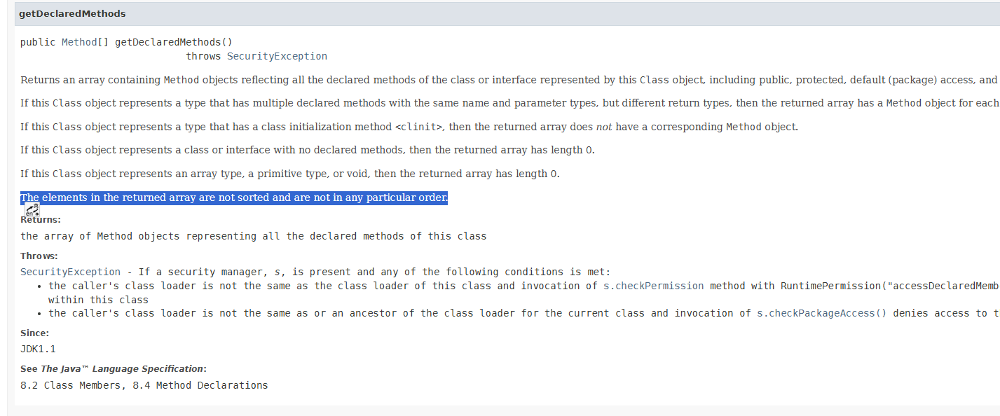

  
因此常常会出现有时打通有时打不通的情况，所以后来又对这条链进行了一些改进，这里可以使用 Spring Boot 里一个代理工具类进行封装，使 Jackson 只获取到我们需要的 getter，就实现了稳定利用。  
   
fastjson的稳定getter调用  
   
相比于jackson在获取getter方法进行调用的不确定性，也即是随机性问题，在fastjson中其对于获得getter方法会进行一次排序，之后通过排序后的顺序进行getter方法调用，其存在getter方法调用的稳定性  
   
getter调用流程  
   
前面提及到了BeanUtils.declaredFields的流程  
   

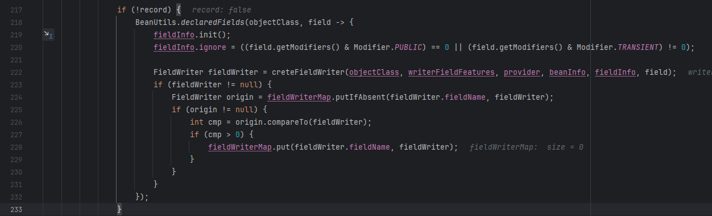

  
其处理的是属性  
   
对于getter方法可以来到BeanUtils.getters调用部分  
   

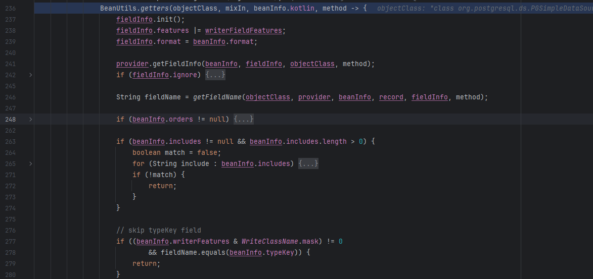

  
这里使用了Lambda表达式，当在BeanUtils#getters方法中调用methodConsumer.accept(method)方法时，才会调用该lambda表达式中的逻辑，接下来我们看看getters方法的实现  
   

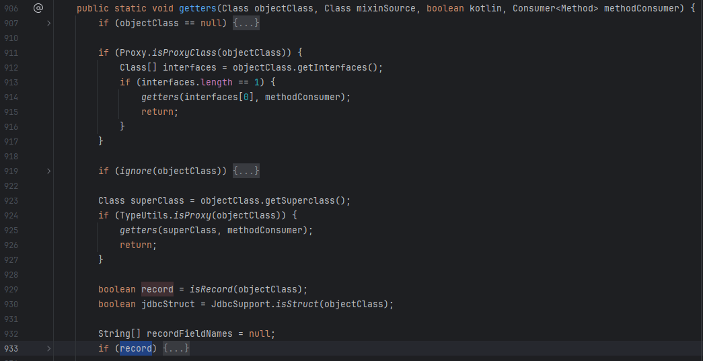

  
常规的方式，检查其是否是代理类，则对其代理类接口进行getters方法的调用，之后检查处理的类是否在黑名单中  
   

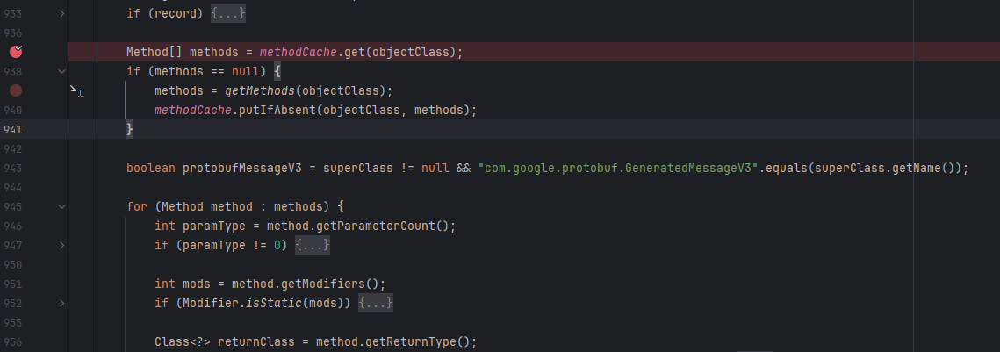

  
之后将会调用getMethods方法获取所有的类方法，并将其写入到methodCache缓存中  
   

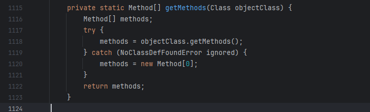

  
后续会遍历所有的method方法，对于特定类将会跳过，具体可看代码  
   
最后会从所有的方法中匹配到getter方法  
    
1获取方法名长度  
   
2 判断其长度是否大于3且以get开头   
   
3判断第四个字母是否是大写  
   
4 在获取到getter方法后，调用methodConsumer.accept(method)执行lambda表达式的逻辑   
    

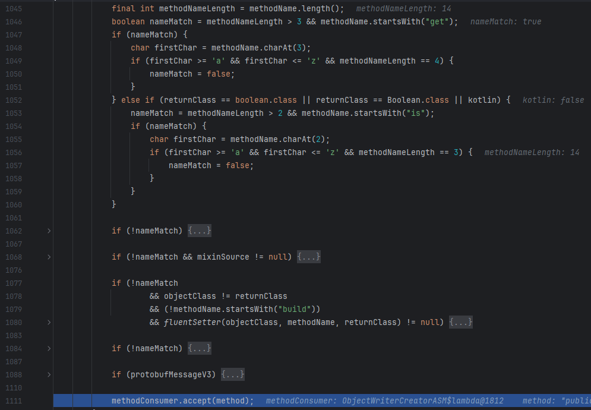

  
在lambda表达式的逻辑如下：  
    
1获取对应getter方法的filedName  
   
2获取对应getter方法的返回类型  
   
3 之后调用createFieldWriter将getter方法封装为FieldWriter

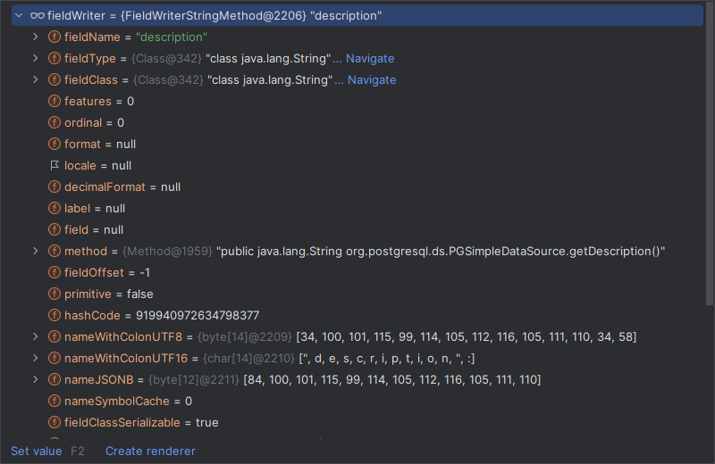

   
4 将filedName和封装的FieldWriter对象映射后存入fieldWriterMap中   
   
5 在筛选了所有的getter方法之后，将map内容保存在ArrayList中后调用Collections.sort对列表中的内容进行排序通过String#compareTo方法进行比较，按照属性名的ASCII值进行升序排序

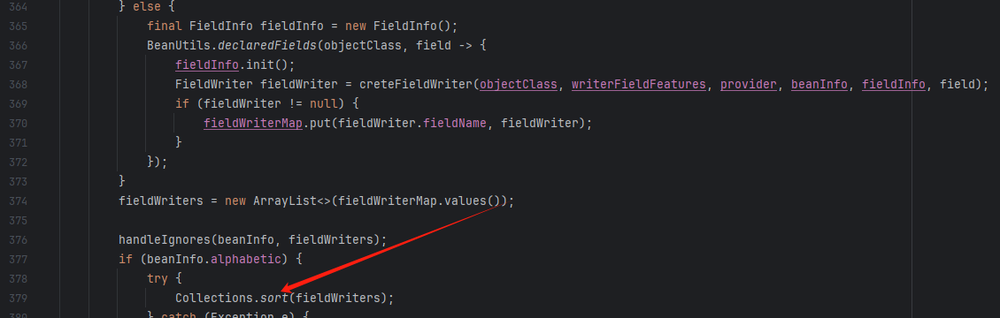

排序后的列表

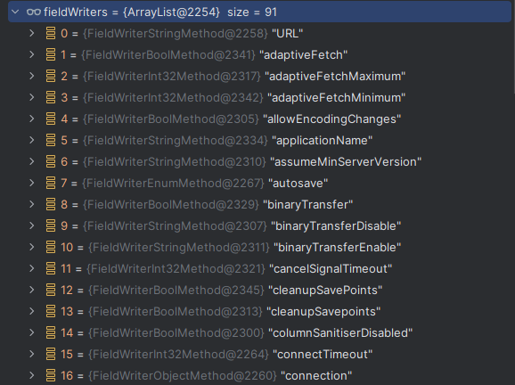

   
总结下来的fastjson中对于getter方法的处理流程如下：  
    
1 调用getMethods方法获取所有的类方法   
   
2根据规则筛选getter方法  
   
3将筛选的getter方法按照升序的顺序进行排序调用  
    
则，若在我们需要调用的getter方法之前存在有会造成错误的getter方法，将会导致抛出异常，进而不能够成功调用我们需要的getter方法  
   
失败的Bypass  
   
最开始考虑到是否可以采用之前处理jackson的不稳定getter调用时的方式，使用动态代理的方式，代理特定类，使得在获取getter是不会获取到其他易受干扰的Getter方法  
   
例如jackson的：  
   
   
1 构造一个 JdkDynamicAopProxy 类型的对象，将 TemplatesImpl 类型的对象设置为 targetSource   
   
2 使用这个 JdkDynamicAopProxy 类型的对象构造一个代理类，代理 javax.xml.transform.Templates 接口   
   
3 JSON 序列化库只能从这个 JdkDynamicAopProxy 类型的对象上找到 getOutputProperties 方法   
   
4 通过代理类的 invoke 机制，触发 TemplatesImpl#getOutputProperties 方法，实现恶意类加载   
    
源自：<https://xz.aliyun.com/t/12846>  
   
通过分析getParentLogger来自类CommonDataSource，而getPooledConnection来自类ConnectionPoolDataSource  
   

  
好巧不巧的，类ConnectionPoolDataSource是继承了CommonDataSource类的，若我们代理前者仍在存在getParentLogger这一个干扰Getter方法，若我们代理后者，其又不存在我们需要的getPooledConnection方法，则采用这种方式行不通  
   
但是，这里仅仅是在DriverAdapterCPDS#getPooledConnection不存在这类绕过方式，若遇到其他类似的因为getter排序导致的getter调用稳定失败的情况，且导致失败的getter方法同我们需要的getter方法属于不同两个类或者接口，我们可以采用这种绕过方法进行处理  
   
动态代理的绕过方式  
   
JdkDynamicAopProxy  
   
这个idea感觉确实不错，通过上述的一系列分析，若类为代理类，则其只会将代理的接口类进行黑名单检查，并不会对代理的具体对象进行黑名单检查  
   

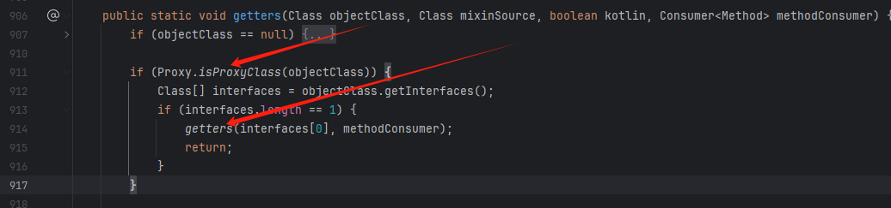

  
则我们可以采用解决jackson getter调用不稳定的方式，使用JdkDynamicAopProxy进行TemplateImpl对象的代理，特别的我们需要的getOutputProperties方法在Template接口中，该接口并不在黑名单内，能够进行绕过  
   

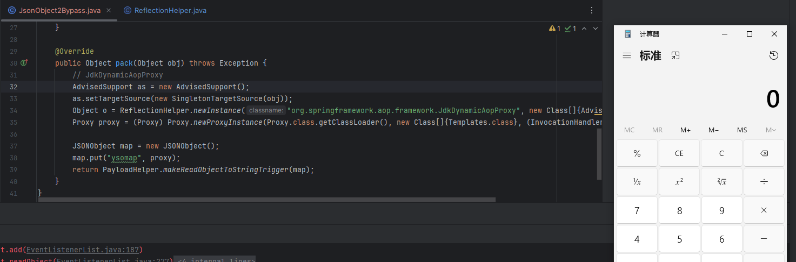

  
AutowireUtils$ObjectFactoryDelegatingInvocationHandler  
   
这个代理类在Spring1链子中有所使用，和JdkDynamicAopProxy类似，也能够反射调用方法，但是缺点在于其对象来自于this.objectFactory.getObject()的返回，需要找到能够返回恶意对象的代理类对objectFactory进行代理  
   
参考一的作者找到了使用本身的JSONObject就可以实现这类代理，简单看看JSONObject#invoke的实现，是如何进行特定对象的返回的  
   

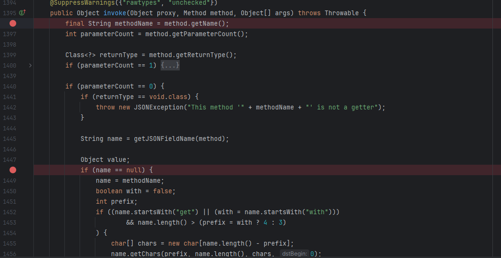

  
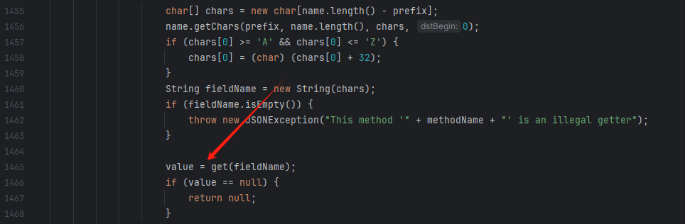

  
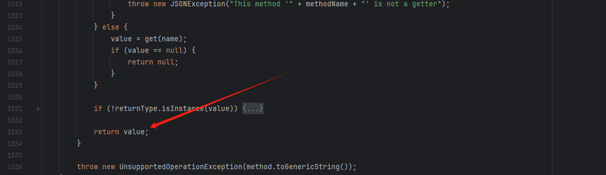

  
过程也是非常简单，这里将会对传入的方法进行处理，比如我们需要使得在调用getObject过程中返回我们的恶意对象TemplateImpl，在JSONObject#invoke中将会根据getter方法的格式获取对应的属性名，这里也就是object，之后通过调用get()方法从传入的map中获取对应的value值，最后将其进行返回，流程很简单  
   
这也能完整形成一个Gadgets  
   

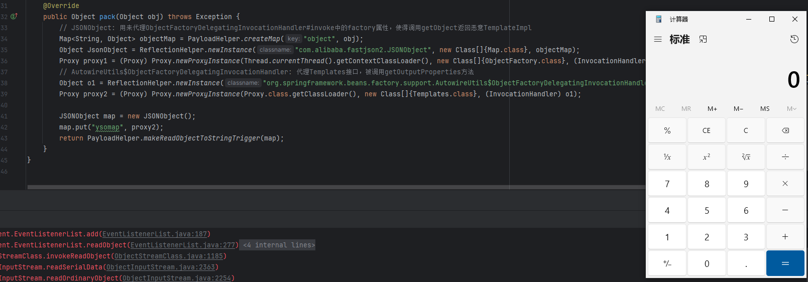

  
参考  
   
<https://mp.weixin.qq.com/s/gl8lCAZq-8lMsMZ3_uWL2Q>  
   
<https://xz.aliyun.com/t/12846>

​
