# ISCC 练武初赛re+mobile wp-先知社区

> **来源**: https://xz.aliyun.com/news/18015  
> **文章ID**: 18015

---

返回文档

mobile  
   
ISCC mobile 邦布出击  
   
安装apk

点击右下角的按钮，进入图鉴界面，百度各种邦布的种类，一个一个试，可以得到三段base64加密的文本
[邦布图鉴 - 绝区零WIKI\_BWIKI\_哔哩](https://wiki.biligame.com/zzz/%E9%82%A6%E5%B8%83%E5%9B%BE%E9%89%B4)

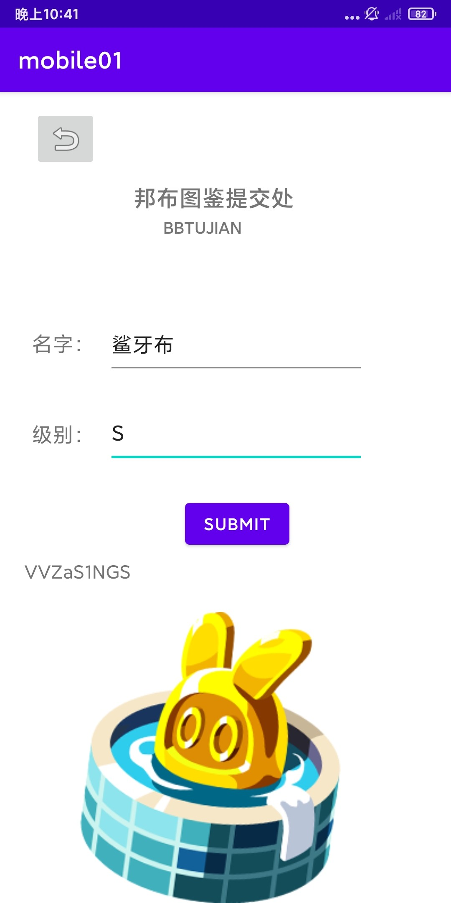

[哔哩](https://wiki.biligame.com/zzz/%E9%82%A6%E5%B8%83%E5%9B%BE%E9%89%B4)
  
   
然后将三段base64拼接起来，循环解码三次base64

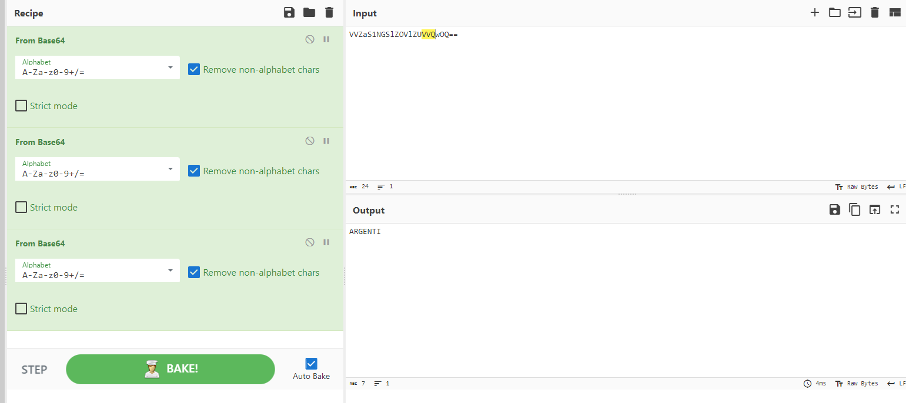

得到一串明文
尝试打开解压得到的db文件，提示非数据库文件，经查询是经过sqlcipher加密，那么此前得到的明文应该就是解密的key  
   

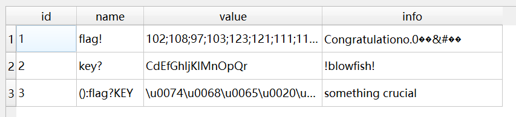

flag是假的，实际应该留意的是key以及info中的blowfish（一种加密方式）
使用jadx打开apk  
   

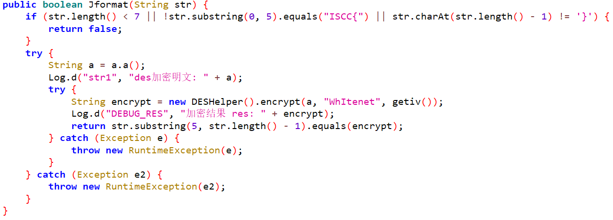

  
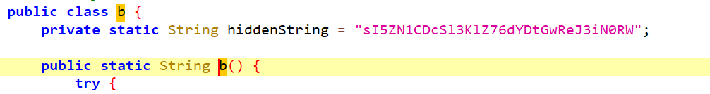

将上图中的密文通过blowfish解密之后得到的内容就是DES的明文

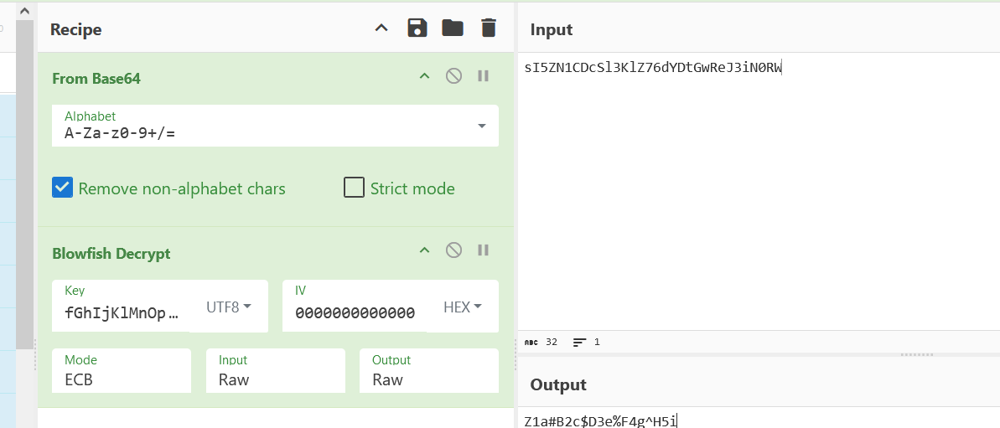

根据apk的逻辑，只有当该明文DES加密的结果和输入内容去掉flag格式后的内容相同才正确
已知明文、key、加密方式，那么对于DES加密，还需要具备的就是iv，但是iv是通过native函数生成的

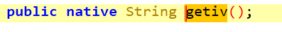

方法一：分析so文件iv的生成逻辑 -- 生成逻辑比较复杂，放弃
方法二：hook native function，在调用getiv时输出iv
这里使用frida hook（要在手机上先运行frida-server）  
   

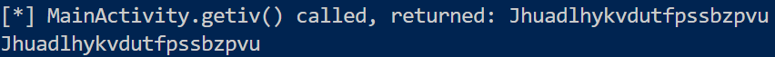

  
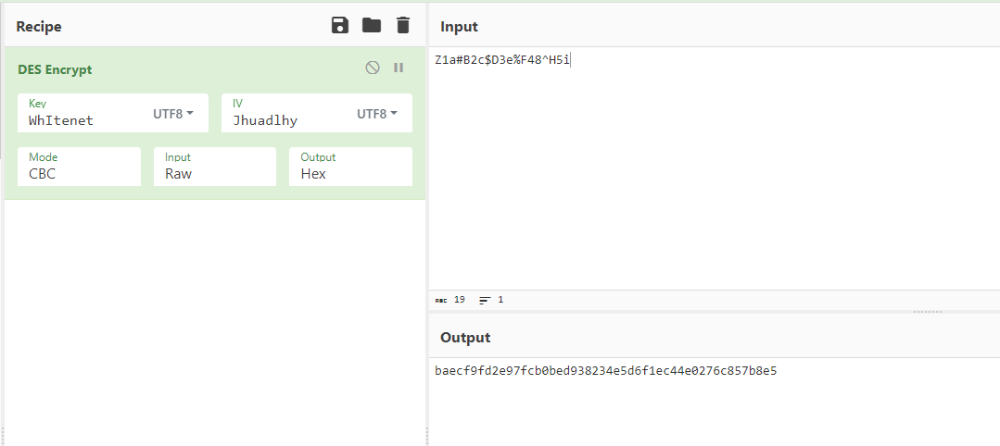

  
ISCC mobile detective  
   
附件是一个apk文件，用jadx打开

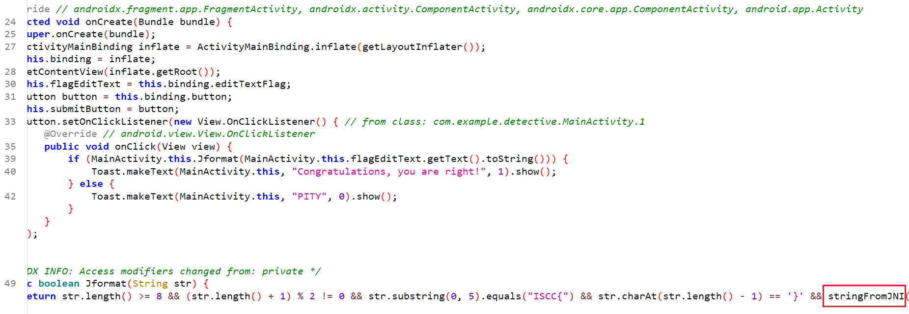

可以看到关键是这个stringFromJNI函数，跟进之后发现是native函数，因此用IDA打开so文件

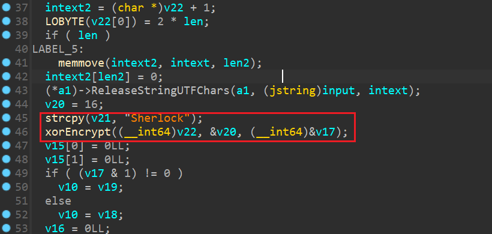

关键是这个xorEncrypt函数

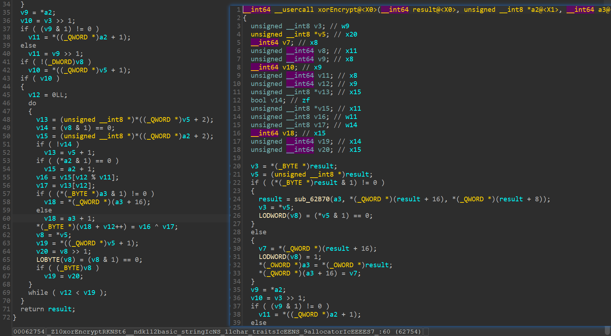

通过分析代码可知，该函数先将字符串转换为十六进制，再将输入与key异或之后转为字符串，然后从每4个字符中提取前2个字符，然后再根据一定规律打乱字符串的位置信息，最后替换特定位置的字符  
   
  
HolyGrail  
   
附件为apk安装包

使用jadx打开apk，发现其中有许多checkbox，点击checkbox的响应如下

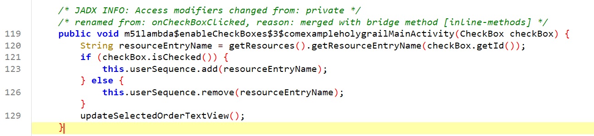

每点击一个checkbox就会在userSequence末尾添加当前checkbox的资源名称

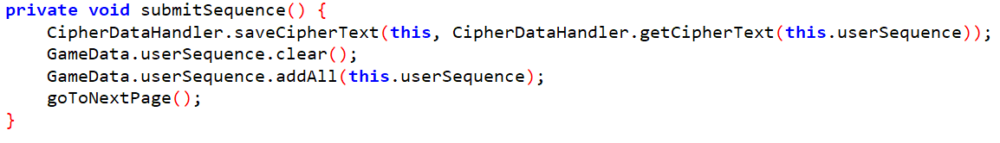

  
而根据app的提示，需要按照特定顺序点击checkbox，才能进入验证flag的页面，并且返回在native层加密后的密文
关于顺序，可以自行百度，也可以问ai，最终顺序如下

如何获得密文：通过frida hook，手动传入特定顺序的参数（每个checkbox的参数也需要通过frida hook得到），然后输出返回的密文  
   
然后分析验证flag的页面

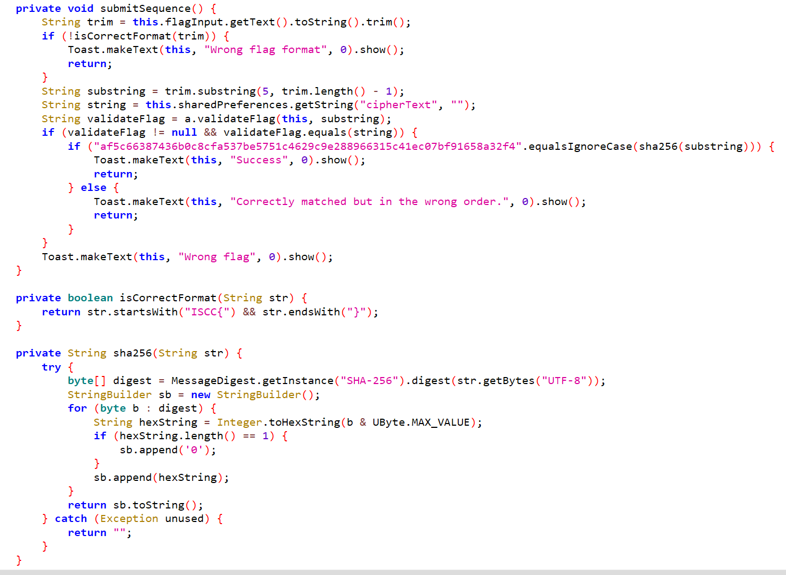

首先检查flag格式，然后调用a类的validateFlag方法

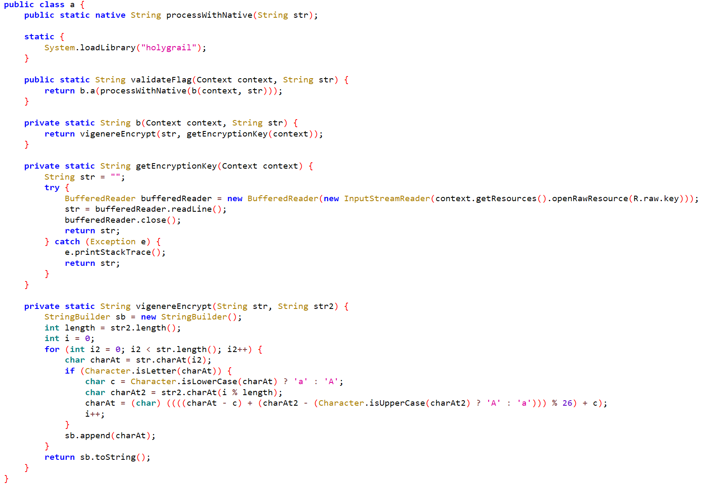

大概流程  
    
●getEncryptionKey  
   
●vigenereEncrypt  
   
●processWithNative  
   
● b.a

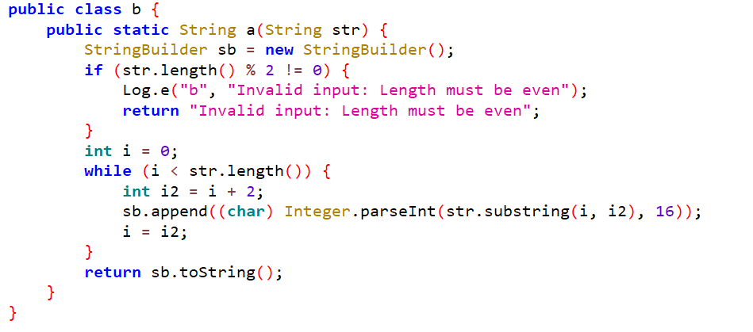

由于processWithNative是JNI函数，因此尝试frida hook该函数，尝试传入不同的值，发现每个字符对应的加密结果和顺序无关，因此可以直接生成所有字符加密的结果，再对目标字符串进行匹配   
    
解密思路  
    
●转十六进制  
   
●字符替换  
   
●字符偏移  
    
exp  
   
whereisflag  
   

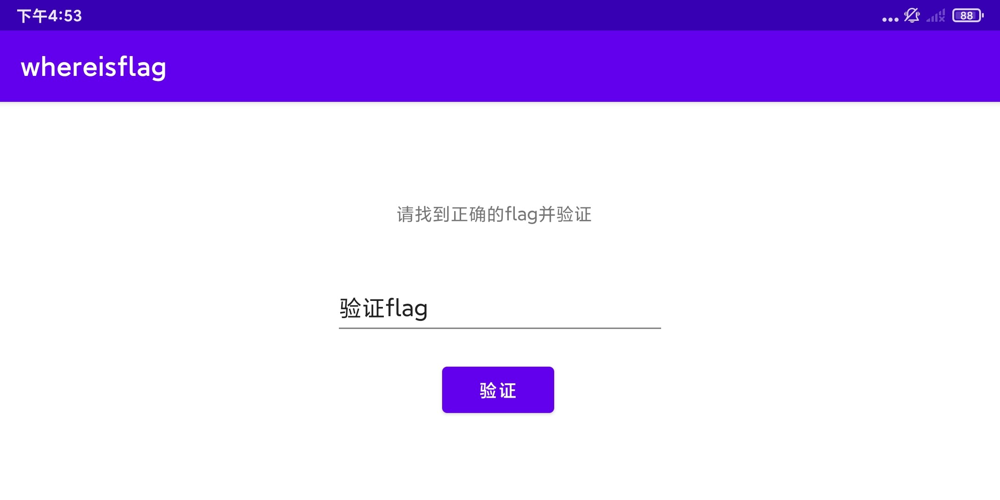

jadx打开apk可以看到具体逻辑

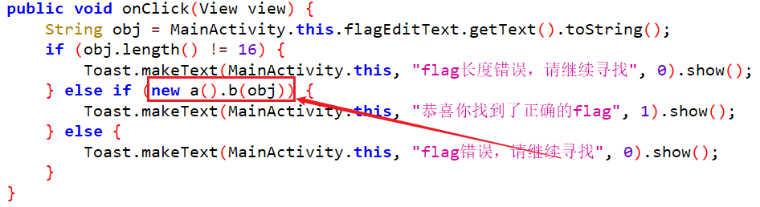

分析之后发现核心函数是native函数
Native 函数基本介绍  
    
● 定义：Native 函数通过 native 关键字在 Java 中声明，实际代码编译在 .so 动态库（ELF 格式）中。   
   
● JNI 桥梁：Java 层通过 JNI（Java Native Interface）调用 Native 函数，函数名和参数需遵循 JNI 规范。

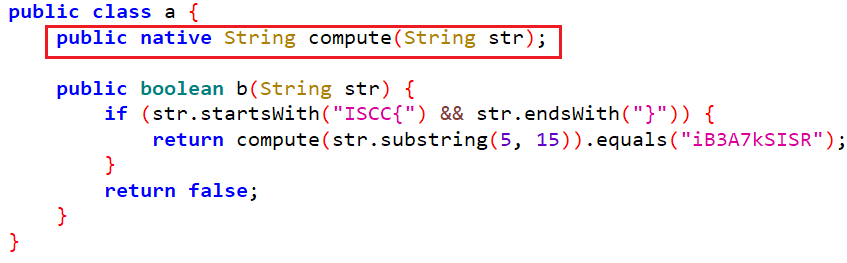

用解压软件直接解压apk文件，然后进入\lib\arm64-v8a目录找到so文件，使用IDA64打开so文件，在其中找到Java\_开头的函数便是native导出函数
在加密函数中首先将输入倒序

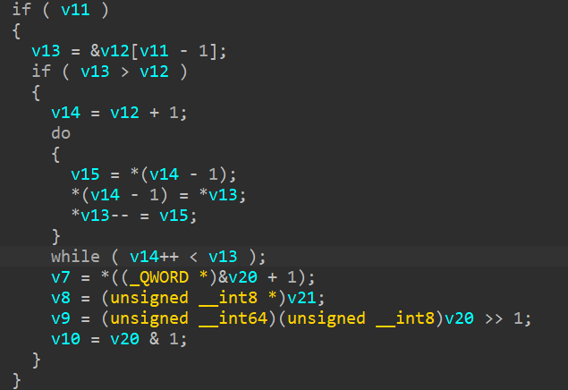

然后根据字符表查找输入的字符

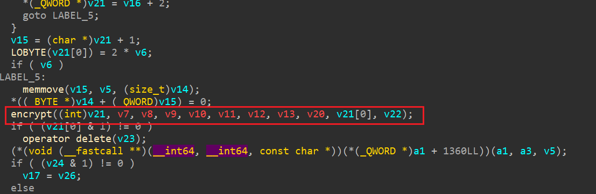

字符表需要动态调试得到

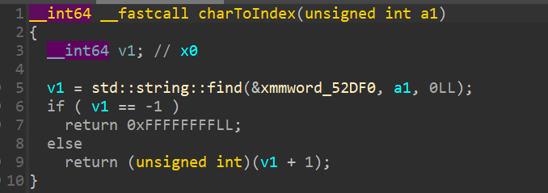

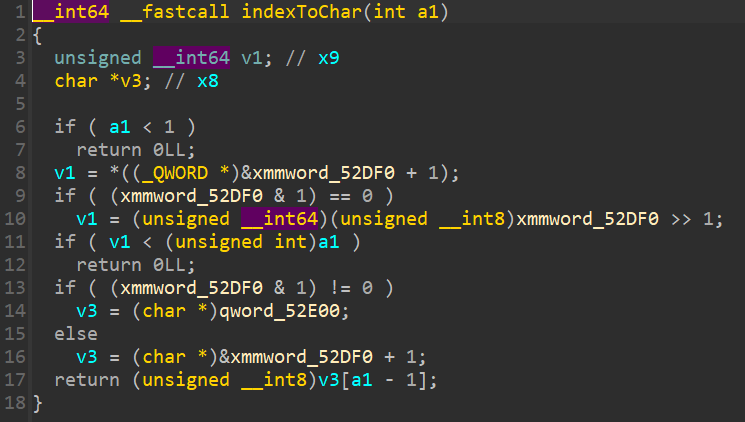

而根据encrypt、charToIndex、indexToChar函数的逻辑，可以看到在索引转换时有固定偏移，为2
从jadx反编译的结果得到目标密文iB3A7kSISR，解密   
    
exp  
   
  
RE  
   
打出flag  
   
从可执行程序的图标判断为pyinstaller编译的程序，使用pyinstxtractor反编译  
   
然后打开反编译的文件夹，打开同名pyc文件，反编译（uncompyle6或者在线）
[python反编译 - 在线工具](https://tool.lu/pyc/)  
   
可以将decompress之后的内容写入文件（以下为部分）  
   
叫AI写个脚本去混淆  
   
有趣的小游戏  
   
附件是一个exe和两个txt，其中txt内容为非打印字符
main函数中定义了许多常量

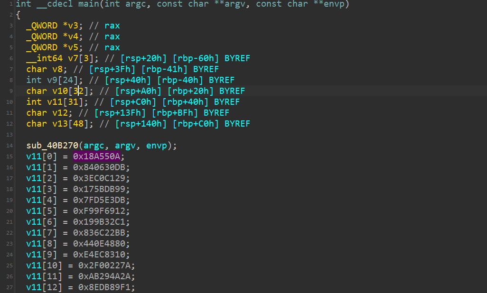

通过查看附近函数，发现其他地方也定义了常数

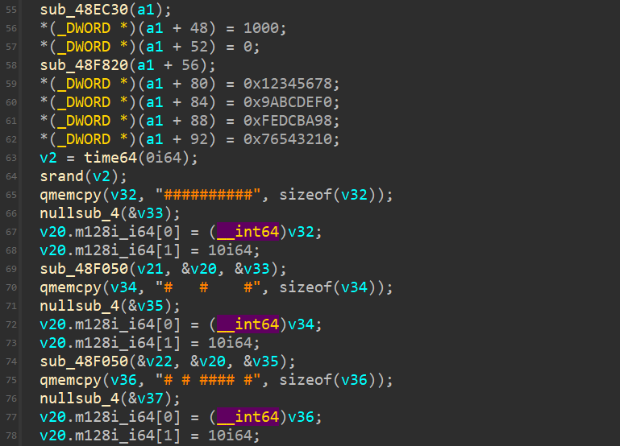

查看字符串表，可以在其中找到两个txt的文件名，交叉引用查看

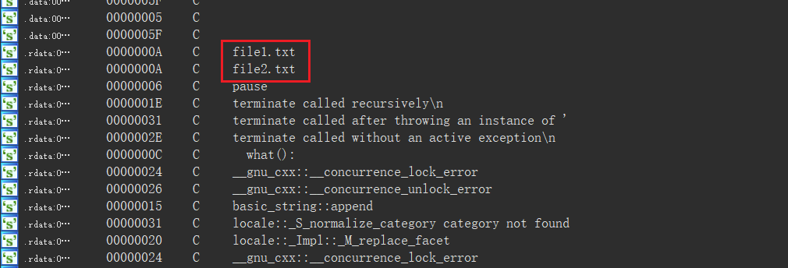

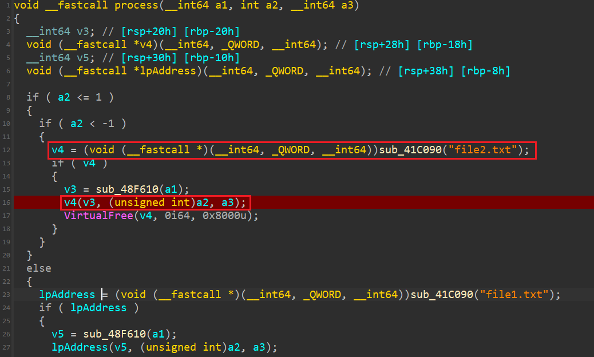

其中process是我重命名的结果
可以看到其中比较奇怪的一点是程序将文件的内容作为函数执行，也就是说原本内容不可见的txt其实是函数的二进制数据，要想知道该函数的具体逻辑，需要动态调试，在此处下断点，触发断点之后在汇编步进就可以看到其中逻辑

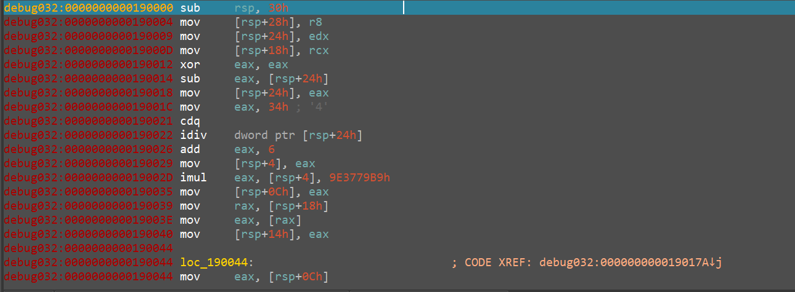

可以将汇编扔给ai判断函数逻辑
deekseek：“这段汇编代码实现的是 XXTEA（eXtended TEA）算法的解密过程……”
于是知道了加解密逻辑，并且根据xxtea的密钥格式可以判断先前的两处常量中位数较短的是key，而位数较长的是密文
接下来有两种解题方式：  
    
1手动分析解密逻辑，自己编写代码  
   
2交给ai
xxtea的加解密逻辑网上有很多就不细说了，直接给出解密脚本  
    
真？复杂  
   
题目附件是一个raw文件，010editor查看发现JFIF文件头，提取图片

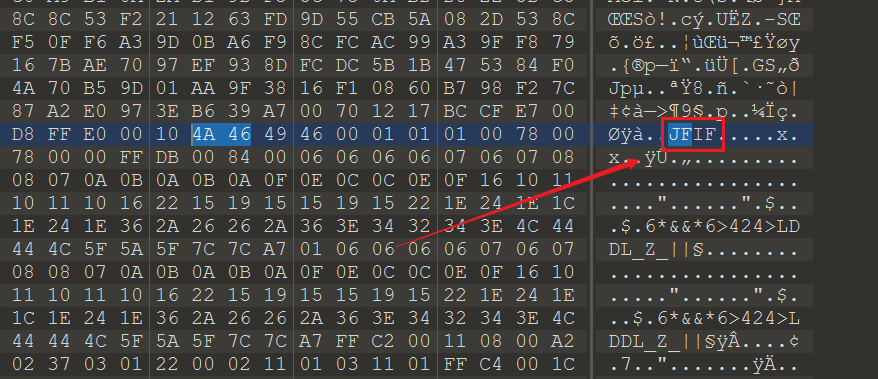

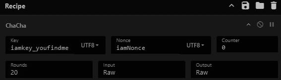

然后使用cyberchef解密，解密之前要先把原raw文件中附加的图片信息删除
解密之后得到压缩包一个，解密得exe文件和enc文件各一个

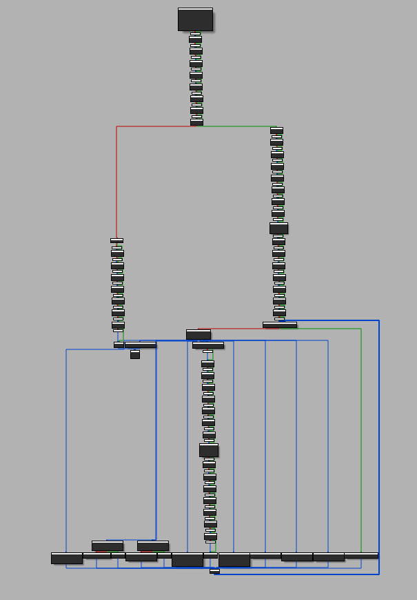

虽然流程图长这个样，但是是可以手动去除的

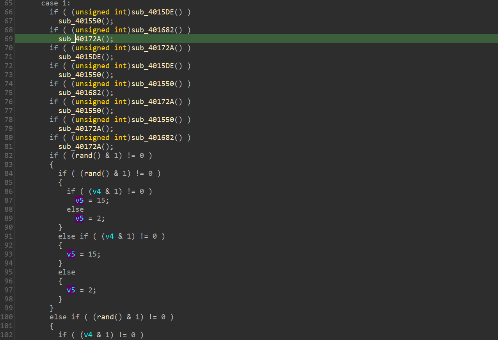

第一种方法：（直接忽略和输入无关的语句和函数，对于涉及到修改输入的语句统统下断点）
第二种方法：直接分析加密函数的switch逻辑，可以发现是对奇偶索引的字符做不同的变换，核心变量为v4（索引）和v5（控制跳转的case），通过v4&1的操作判断奇偶
通过分析exe文件可知原本逻辑是给定flag.txt，用exe加密得到enc文件，而现在只有enc文件，故需要逆向推解密逻辑
通过分析得到解密脚本  
   
faze  
   
题目附件：faze.exe
使用IDA打开附件

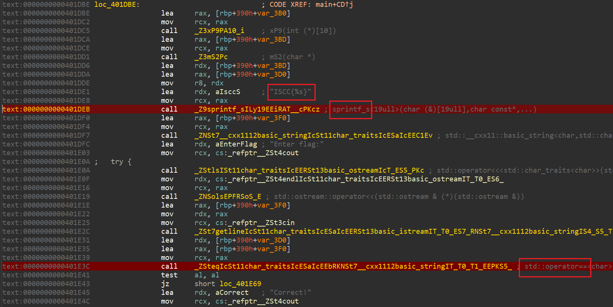

  
一眼C++，通过判断代码可以发现目标字符串在用户输入之前（getline）已经完成了目标字符串的初始化，所以这里有多种解法  
    
1在sprintf上下断点，直接查看写入目标字符串的内容  
   
2 在比较的时候（operator==）下断点，查看比较的数据
这里选择前者，在程序暂停时跳转到rcx所在地址

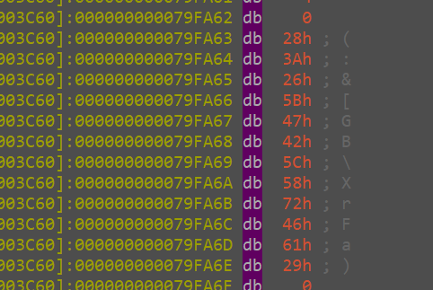

   
greeting  
   
首先IDA打开可执行文件，会发现有些函数反编译的结果不正确，且提示错误，因此可以查看目标函数附近的汇编代码，找到类似加密逻辑的代码

明显的异或和循环左移操作，大概率是加密逻辑
通过分析可知，代码首先是计算一个偏移，然后将目标数据对应索引的字节在异或i+0x5a之后（esi为索引）循环左移该计算出来的偏移，因此目标可以分为两步：  
    
1分析该偏移的计算方式  
   
2 反推整个加密逻辑
这里的r15其实是一个固定的值

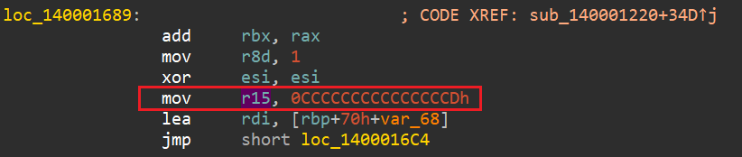

关于偏移量的计算   
    
●通过手动分析  
    
○ mul r15 和 shr dl, 2 的组合实际上执行的是整数除法 i / 5   
   
○ lea eax, [rax+rax\*4] 计算的是 (i/5)\*5   
   
○ sub ecx, eax 计算的是 i - (i/5)\*5   
   
○ 以上逻辑等价于i%5   
    
●直接动态调试可以发现rol操作中cl的取值是0、1、2、3、4、0……，所以其实偏移的计算方式是索引对5取余  
   
然后就是逆向整个加密逻辑，有了偏移的计算方式，解密的逻辑很好推，就是对每个字节先循环右移再异或(i+0x5a)
对于密文，通过交叉引用和人肉分析等方式最终可以找到位于0x014001B390  
   
因此完整的解密脚本如下

​
